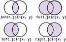

# Advanced operations

In this chapter, we will cover a few more advanced, yet incredibly useful data tidying operations like grouping, joining, binding, and pivoting. Along the way, we will also make extensive use of dplyr functions learned in the previous chapter.


## Grouping

Often, you will need to apply dplyr's various operations like `mutate()`, `summarize()`, or slicing function not across the entire dataset but in groups. This is an important technique across data science, whether it's data cleaning to exploration to visualization to modeling.

By default, data frames are not grouped when created or imported. You can create a grouping structure with the `group_by()` function. The basic syntax is `df %>% group_by(col1, col2, ...)` where `col1`, `col2`, ... are variables whose values are used to determine groups. You can group by just 1 variable, 2 variables, or as many variables as needed. **Rows with the same values in the chosen columns will be grouped together**.

After grouping, operations that normally run across all rows **now run across each group**. Here's a few simple examples using the familiar penguins dataset to start:

```{r,eval=F}
# import tidyverse, tweak some options (optional), and load dataset
library(tidyverse)
options(readr.show_col_types = FALSE)
source("https://bwu62.github.io/stat240-revamp/ggplot_theme_options.R")
penguins <- read_csv("https://bwu62.github.io/stat240-revamp/data/penguins.csv")
```
```{r,echo=F}
library(tidyverse)
source("ggplot_theme_options.R")
penguins <- read_csv("data/penguins.csv")
```

```{r}
# group by species and get mean/median/sd body mass + sample size of each group
penguins %>%
  group_by(species) %>%
  summarize(
    mean_mass   = mean(body_mass_g),
    median_mass = median(body_mass_g),
    sd_mass     = sd(body_mass_g),
    n           = n()
  )
# we can also group by multiple, e.g. group by spcies + sex
penguins %>%
  group_by(species, sex) %>%
  summarize(
    mean_mass   = mean(body_mass_g),
    median_mass = median(body_mass_g),
    sd_mass     = sd(body_mass_g),
    n           = n()
  )
```

:::{.fold .o}
```{r}
# we can of course also mutate within groups
# e.g. convert bill length in mm to number of SDs
#      away from species group mean
# to better show the result, I'm forcing it to print all rows in order
# but hiding the output in a collapsible box for style
penguins %>%
  select(species, sex, bill_length_mm) %>%
  group_by(species) %>%
  mutate(
    n = n(),
    bill_length_std = (bill_length_mm - mean(bill_length_mm)) / sd(bill_length_mm)
  ) %>%
  arrange(species, bill_length_std) %>%
  print(n = Inf)
```
:::

```{r}
# get the largest 3 penguins by bill depth from each species
penguins %>%
  group_by(species) %>%
  slice_max(bill_depth_mm, n = 3)
```


### Regrouping

Sometimes one `group_by()` may not be enough to get what you need; you may need to re-`group_by()` by something else to finish the job. For example, suppose you want to see what percent of each species came from different islands. This requires two uses of `group_by()`:

```{r}
# first group by species + island and summarize to get size of each group,
# then regroup by species and MUTATE (not summarize) totals for each species,
# then divide these to get proportion of each species from each island
penguins %>%
  group_by(species, island) %>%
  summarize(n = n()) %>%
  group_by(species) %>%
  mutate(
    species_total = sum(n),
    pct_of_species_from_island = n / species_total * 100
  )
```

This combination of `df %>% group_by(...) %>% summarize(n = n())` is so common, we have this shortcut for it: `df %>% count(...)`. We can demonstrate this in another example involving regrouping. Suppose we want to know what percent of each species were male/female:

```{r}
# again, first group by species + sex and get size using the shortcut count(),
# then regroup by species and MUTATE totals for each species,
# then divide to get proportions of each species that were male/female
penguins %>%
  count(species, sex) %>%
  group_by(species) %>%
  mutate(
    species_total = sum(n),
    pct_of_species_each_sex = n / species_total * 100
  )
```

Groups are also useful for prepping data frames for plotting. For example, here's a chunk that produces a bar plot showing how mean body mass changes by species and sex:

```{r,tidy=F}
# get mean body mass by species + sex and plot
# the %T>% is a special pipe called a Tee pipe
# it's a shortcut for piping something into 2 different operations,
# useful for example when you want to print a data frame, then also plot it
# see https://magrittr.tidyverse.org/reference/tee.html for more
penguins %>% 
  group_by(species, sex) %>% 
  summarize(mean_mass = mean(body_mass_g)) %T>% print %>% 
  ggplot(aes(x = species, y = mean_mass, fill = sex)) +
  geom_col(position = "dodge2") +
  labs(x = "Species", y = "Mean body mass (g)",
       title = "Mean body mass of Palmer penguins by species + sex")
```


### Ungrouping

Many operations output grouped data frames. For example, look closely at the output of the previous chunks and you'll see `# Groups:   species [3]` in most of them. This means any further operations you run will continue to execute in a grouped way.

You can remove the grouping structure with `ungroup()`. This allows you to revert to running operations on the entire data frame. Example:

```{r}
# get count of each species + sex combination,
# but this time get its percentage out of ALL observations
penguins %>%
  count(species, sex) %>%
  ungroup() %>%
  mutate(pct_of_all = n / sum(n))
```


### More practice! (`fertility` data)

Let's give the penguins dataset a rest and practice dplyr and grouping a bit more with a different dataset. The following chunk imports [`fertility.csv`](data/fertility.csv), the cleaned global fertility data set from [World Bank](https://data.worldbank.org/indicator/SP.DYN.TFRT.IN), giving the average number of births per woman for each year and country from 1960 to present. For the past few decades, global fertility has been [sharply declining](https://ourworldindata.org/un-population-2024-revision) for most countries. Many countries are now below the [replacement rate of 2.1](https://en.wikipedia.org/wiki/Sub-replacement_fertility), leading to widespread concerns of a population collapse in the latter part of the 21^st^ century.

```{r,eval=F}
fertility <- read_csv("https://bwu62.github.io/stat240-revamp/data/fertility.csv")
fertility
```
```{r,echo=F}
fertility <- read_csv("data/fertility.csv")
fertility
```

Each country has over 60 years of data in this dataset. We can see an overview which countries are represented in the dataset and what their listed region and income group are by temporarily dropping years, removing duplicates, and printing the full output below in a collapsible box:

:::{.fold .o}
```{r}
fertility %>%
  select(country:income_group) %>%
  distinct() %>%
  print(n = Inf)
```
:::

One additional small processing step we should do before continuing is convert `income_group` to an ordered factor (see section \@ref(ordered-data)), which will be important later.

```{r,tidy=F}
fertility <- fertility %>% mutate(
  income_group = factor(income_group, ordered = TRUE, levels = c(
    "Low", "Lower middle", "Upper middle", "High"))
)
```


We can begin by running a few summaries to explore the dataset. To start, here's a chunk showing the number of countries and median income group for countries in each region:

```{r}
# strangely, base R median doesn't work on ordered categories,
# but we can use Median from DescTools instead
fertility %>%
  select(country, region, income_group) %>%
  distinct() %>%
  group_by(region) %>%
  summarize(n = n(), median = DescTools::Median(income_group)) %>%
  arrange(desc(median))
```

Next, here's a chunk showing the median fertility rate in each region for the most recent year of `r fertility %>% select(year) %>% max`, as well as the countries with the highest and lowest `r fertility %>% select(year) %>% max` rates (and what the rates are) in each region:

```{r}
# first filter to get the right year, then
# sort by region, rate (so min, max are the first, last in each group)
# then summarize to get median, and min/max country/rate
fertility %>%
  filter(year == max(year)) %>%
  arrange(region, rate) %>%
  group_by(region) %>%
  summarize(
    n           = n(),
    median      = median(rate),
    min_country = first(country),
    min         = first(rate),
    max_country = last(country),
    max         = last(rate)
  ) %>%
  arrange(median)
```

We can also show the latest rate for each country, as well as the change from 2000, just before the start of the 21^st^ century:

:::{.fold .o}
```{r}
# first filter to get the right years, then
# sort by country, year (so 2000, 2022 are first and last in each group)
# then summarize to get 2000 and 2022 rates, mutate to get change,
# then ungroup, distinct, and arrange to display a neat output
# again, collapsing output due to lengthy print out
# %T>% is used again to both save and print the results
fertility_change <- fertility %>%
  filter(year %in% c(2000, max(year))) %>%
  arrange(country, year) %>%
  group_by(country) %>%
  mutate(
    rate2000 = first(rate),
    rate2022 = last(rate),
    change = rate2022 - rate2000
  ) %>%
  select(country, region, rate2000, change, rate2022) %>%
  ungroup() %>%
  distinct() %>%
  arrange(rate2022) %T>%
  print(n = Inf)
```
:::

Which countries had the biggest drop in fertility?

```{r}
fertility_change %>% slice_min(change, n = 10)
```

Did any countries have actually increased?

```{r}
fertility_change %>% slice_max(change, n = 10)
```

How many countries are now above vs below replacement rate? We can do this by grouping by if the rate is at least 2.1---did I mention you can use transformations inside `group_by()` as well?

```{r}
# group by a new column called at_replacement indicating rate>=2.1
fertility %>%
  group_by(at_replacement = rate >= 2.1) %>%
  summarize(n = n()) %>%
  mutate(pct = 100 * n / sum(n))
# we can repeat this grouping by region, this time using count()
# and just showing the percentage of countries at replacement
fertility %>%
  count(region, at_replacement = rate >= 2.1) %>%
  mutate(pct_at_rep = 100 * n / sum(n)) %>%
  filter(at_replacement) %>%
  select(-n, -at_replacement) %>%
  arrange(-pct_at_rep)
```

Let's make a few plots of the data as well. Here are 2 plots showing median fertility rate over time grouping by either region or income level:

:::{.i96}
```{r,tidy=F,fig.width=7.2,fig.height=4.8}
# first get mean rate in each region + year, then pipe into line plot
# fct_reorder2() is used to reorder legend to be same order as end of lines
# see https://forcats.tidyverse.org/reference/fct_reorder.html for more details
fertility %>%
  group_by(region, year) %>%
  summarize(median_rate = median(rate)) %>%
  ggplot(aes(x = year, y = median_rate,
             linetype = fct_reorder2(region, year, median_rate),
             color = fct_reorder2(region, year, median_rate))) +
  geom_hline(yintercept = 2.1, linetype = "dashed") + geom_line(linewidth = 1) +
  labs(x = "Year", y = "Median fertility rate", linetype = "Region", color = "Region",
       title = "Median fertility by region from 1960-2022",
       subtitle = "(black dashed line at replacement rate of 2.1)") +
  scale_x_continuous(expand = c(0, 0), breaks = seq(1960, 2022, 10),
                     minor_breaks = seq(1960, 2022, 2)) +
  scale_y_continuous(expand = c(0, 0), limits = c(1.2, 7.2),
                     breaks = 2:7, minor_breaks = seq(1.2, 7.2, .2))
# first get mean rate in each income group + year, then pipe into line plot
fertility %>%
  group_by(income_group, year) %>%
  summarize(median_rate = median(rate)) %>%
  ggplot(aes(x = year, y = median_rate,
             linetype = income_group,
             color = income_group)) +
  geom_hline(yintercept = 2.1, linetype = "dashed") + geom_line(linewidth = 1) +
  labs(x = "Year", y = "Median fertility rate",
       linetype = "Income group", color = "Income group",
       title = "Median fertility by income group from 1960-2022",
       subtitle = "(black dashed line at replacement rate of 2.1)") +
  scale_x_continuous(expand = c(0, 0), breaks = seq(1960, 2022, 10),
                     minor_breaks = seq(1960, 2022, 2)) +
  scale_y_continuous(expand = c(0, 0), limits = c(1.4, 7.2),
                     breaks = 2:7, minor_breaks = seq(1.6, 7.2, .2))
```
:::

#### Bonus: choropleth

Here's a bonus [plotly choropleth](https://plotly.com/r/choropleth-maps) just for fun (you do NOT need to learn this). You can change the year and pan/zoom to see each specific country. Red color indicates countries below the replacement rate 2.1, white indicates at the replacement rate, and blue indicates above the replacement rate.


:::{.fold .s}
```{r,tidy=F,fig.width=7.2,fig.height=4.45}
library(plotly)
plot_ly(fertility, type = "choropleth", locations = ~code, z = ~rate,
        text = ~country, frame = ~year, zmin = 0.7, zmax = 8.9, colorscale = list(
        c(0, "rgb(255,0,0)"), c(0.1707, "rgb(255,255,255)"), c(1, "rgb(0,0,255)"))) %>%
  layout(margin = list(l = 0, r = 0, b = 10, t = 31)) %>% animation_opts(frame = 100)
```
:::


## Merging

Let's move on to another topic: merging data frames. Often, the information you need may be spread across several data frames from different samples or different sources, in which case you may need to merge data frames together.

There are generally 2 common ways data may need to be merged: binding rows, and joining columns.

 - Binding rows is done when two data frames **share the same columns, but have different rows**, and you want to combine all the rows together.
 - Joining columns is done when two data frames **share the same rows, but have different columns**, and you want to combine all the columns together.

These two are NOT the same, so it's important to remember which is which.


### Binding

Binding is the simpler of the two, so let's start here. Returning briefly to the penguins data set, note there's a year column which indicates when each sample was collected. This means there were 3 different studies conducted. Suppose each of the years was originally in its own data frame (I suspect this is likely to be true).

```{r}
penguins2007 <- penguins %>% filter(year == 2007)
penguins2008 <- penguins %>% filter(year == 2008)
penguins2009 <- penguins %>% filter(year == 2009)
```
```{r}
print(penguins2007, n = 5)
print(penguins2008, n = 5)
print(penguins2009, n = 5)
```

We can see our 3 data frames `penguins2007`, `penguins2008`, `penguins2009` share the exact same columns (same number of columns, same column names, same column types) but have different rows. Each data frame can be thought of as containing a fraction of the overall samples or subjects. In this case, we must row-bind the 3 data frames together.

The function `bind_rows(df1, df2, ...)` lets us do this. Just pass each data frame that needs binding in:

```{r}
penguins_bound <- bind_rows(penguins2007, penguins2008, penguins2009)
penguins_bound
```

It may be hard to see, since only the first 10 rows are printed here, but if you look at the row numbers, you can see we now have `r nrow(penguins2007)`+`r nrow(penguins2008)`+`r nrow(penguins2009)`=`r nrow(penguins_bound)` rows after binding.

:::{.note}
For best results, ensure input data frames have the exact same columns, with the same names and types!
:::


### Joining

Joining is slightly more complicated. This is for when all the rows are together, but the columns you need are spread out over several data frames. Often, this occurs when you obtain data from different sources and want to combine them to look for patterns, but it can also happen sometimes with multiple data frames gathered from the same source.

Joining is performed by first **matching rows using a set of key variables** before adding in the additional columns. The **key variables should uniquely identify rows**. Here's a simple demo to start. Suppose you have the following data frames:

```{r}
x <- tibble(
  A = c("a", "b", "c"),
  B = c(1, 2, 3)
)
y <- tibble(
  A = c("a", "b", "d"),
  C = ymd("2024.1.1") + 0:2
)
x
y
```

Suppose you want to join `x` and `y` using column A as the "key", i.e. "A" is the column that uniquely matches rows across data frames. There are 4 different joins you can use: `inner_join()`, `full_join()`, `left_join()`, `right_join()` , depending on which rows you want in the result:

<center><div style="width:491px;height:258px;overflow:hidden">
<a href="https://tavareshugo.github.io/r-intro-tidyverse-gapminder/08-joins/index.html"></a>
</div></center>

 - `inner_join(x, y)` matches rows using key variable(s), then **returns only rows in both `x` and `y`**,
 - `full_join(x, y)` matches rows using key variable(s), then **returns all rows in either `x` or `y`**,
 - `left_join(x, y)` matches rows using key variable(s), then **returns only rows in `x`**,
 - `right_join(x, y)` matches rows using key variable(s), then **returns only rows in `y`**.

Below are demos of each join. Note each join has the exact same columns; the only difference is which rows are included in the output. Also note `NAs` are automatically used to fill in any missing values that arise from the merge.

```{r}
# only return rows in both x and y
inner_join(x, y)
# return rows in either x or y
full_join(x, y)
# return only rows in x
left_join(x, y)
# return only rows in y
right_join(x, y)
```

The above 4 are called the "mutating joins" since they mutate (i.e. change) the data frame by adding additional columns. There are 2 other less commonly used joins called the "filterting joins" called `semi_join()` and `anti_join()` that do not actually add columns; they are only used to filter rows that match or don't match another data frame. Examples:

```{r}
# semi_join(x, y) will FILTER rows in x that have matches in y
# note there are NO new columns added to x
semi_join(x, y)
# conversely, anti_join() will FILTER rows in x with NO match in y
# again, note NO new columns were added to x
anti_join(x, y)
```

These examples only have 1 key column, but the same works if you have 2 or more key columns; rows are matched if they have ALL the same values in the key columns.

:::{.note}
When joining, R will automatically look for columns with the same name to use as key columns. Therefore, to run smoothly, it's **highly recommended** to ensure the following before joining:

 1. Key columns should have the same name and type.
 2. All other non-key columns should have different names.
 3. When picking a join, carefully consider which rows you will actually need later.
 4. Generally, key values should be unique for each row. If you need to have duplicate key values, watch the joins closely to ensure the join works the way you want.
:::

Let's see a real example of joins in action.


### Example: cleaning `fertility`

The World Bank fertility data set we used earlier obviously didn't start out perfectly clean and tidy. When you download the CSV file from the [data page](https://data.worldbank.org/indicator/SP.DYN.TFRT.IN) it comes as a zip of the following two (renamed) files: [`fertility_meta.csv`](data/fertility_meta.csv) and [`fertility_raw.csv`](data/fertility_raw.csv). One of them contains metadata for each country, while the other contains the actual annual fertility rates.

```{r,eval=F,tidy=F}
fertility_meta <- read_csv(
  "https://bwu62.github.io/stat240-revamp/data/fertility_meta.csv")
fertility_raw <- read_csv(
  "https://bwu62.github.io/stat240-revamp/data/fertility_raw.csv")
```
```{r,echo=F}
fertility_meta <- read_csv("data/fertility_meta.csv")
fertility_raw <- read_csv("data/fertility_raw.csv")
```

```{r}
fertility_meta
fertility_raw
```

First, there are several columns like `"SpecialNotes"`, `"Indicator Name"`, and `"Indicator Code"` that we don't need; we can remove those with `select()`. Country names are duplicated in both data frames, so we can pick one to use. Let's pick `"TableName"` since the names are slightly nicer (check this yourself). The rest of the columns should probably be renamed with `rename()`.

We can also change the `"Low income"`, `"Lower middle income"`, ... values into just `"Low"`, `"Lower middle"`, ... to slightly simplify the column. Shorter labels will also be easier to work with in `filter()` or in plots.

Note as well the existence of several NAs in region and income. Again, verify this yourself, but these are all further subregion groupings of countries (e.g. AFE and AFW are for Eastern/Southern and Western/Central African countries), so we can simply drop these rows.

```{r}
# apply the processing steps above
fertility_meta2 <- fertility_meta %>%
  rename(code = "Country Code", country = "TableName", region = "Region", income_group = "IncomeGroup") %>%
  select(code, country, region, income_group) %>%
  mutate(income_group = sub(" income", "", income_group)) %>%
  filter(!is.na(income_group))
fertility_raw2 <- fertility_raw %>%
  select(2, "1960":last_col()) %>%
  rename(code = "Country Code")
print(fertility_meta2, n = 5)
print(fertility_raw2, n = 5)
```

Now comes the key step! We're going to use the `"code"` columns (which are the 3-letter [ISO 3166-1 country codes](https://en.wikipedia.org/wiki/ISO_3166-1)) as the key columns and join the two data frames together. Let's use `inner_join()` to keep only countries that appear in both, since we want to look at region and income group together with fertility rates.

Note these data frames already satisfy the recommended conditions, i.e. the key columns have the same name and type and uniquely identify each country, and all other columns have different names, so there should be no issues.

```{r}
fertility_joined <- inner_join(fertility_meta2, fertility_raw2)
fertility_joined
```

This already looks pretty good! Our data frames joined nicely along the key `"code"` column, and now our region, income, and fertility data is in 1 single data frame instead of spread across 2 data frames.

However, you may have noticed we still have a problem: our annual fertility rates are spread out across `r length(str_subset(names(fertility_joined),"^\\d+$"))` columns, with each year in its own column. This is not compatible with our tidyverse functions. How do we fix it?


## Pivoting

This is where pivoting becomes relevant. Pivoting (also sometimes called reshaping) refers to the process of transforming data between different representations of it. Let's start with a small example to better illustrate this point.

Suppose two people Alice and Bob are playing a game. They agree to play 3 rounds. Each round, each person tries to score points up to a maximum of 10. The person that wins the most rounds wins overall. Suppose these are the final scores:

```{r}
# create demo scores data frame
# sample() is used here to randomly generate points
scores_long <- tibble(
  round  = rep(1:3, each = 2),
  player = rep(c("Alice", "Bob"), 3),
  points = c(9, 4, 7, 1, 2, 7)
)
scores_long
```

However, the same data can also be represented in this alternative format:

```{r}
scores_wide <- tibble(
  round = 1:3,
  Alice = c(9, 7, 2),
  Bob   = c(4, 1, 7)
)
scores_wide
```

Despite the difference in shape and dimensions, the data contained in these data frames is identical. These are often called the **long** and **wide** representations of data, so named because one tends to be longer (i.e. more rows) and the other wider (i.e. more columns). Generally, **long formats are easier to use with R/tidyverse**, whereas **wide formats are easier for humans to read**, but there are of course exceptions to everything.

Usually, for data to be considered "tidy" it needs to be in a longer format. [Tidy data](https://tidyr.tidyverse.org) is data that satisfies the following:

> 1. Each variable is a column; each column is a variable.
> 2. Each observation is a row; each row is an observation.
> 3. Each value is a cell; each cell is a single value.^[Taken from [tidyr](https://tidyr.tidyverse.org) home page.]

Data in this format will generally be easier to work with using tidyverse, and broadly speaking R, since this format is highly versatile and most functions have been designed to work best on this format.

Hopefully, it should be easy to see that `scores_long` above satisfies these properties. Each variable is indeed a column (and vice versa), each row an observation (vv.), etc. It should also be evident `scores_wide` is NOT tidy, since each row actually contains 2 scores, and each column is a person, not a variable (the distinction here is subtle but meaningful).

Tidyr's `pivot_longer()` and `pivot_wider()` functions let you easily convert between these two representations. When used correctly, these two should be **inverses of each other**, i.e. you can take a data frame and pivot it longer, then pivot it wider (or vice versa) and get back the original data frame. There are many ways of using these functions (see help page) but here's a brief guide to their most common and important usage:

 - `df %>% pivot_longer(cols, names_to = "..", values_to = "..")` turns a "wider" representation into a "longer" representation.
   - `cols` is a set of columns where the actual observations are "spread out over". You can set this using numbers, names, ranges, or selector functions (just like for `select()`). In the `scores_wide` data frame, this would be the two columns `Alice` and `Bob` since this is where the points for each round are stored.
   - `names_to` sets the name for the new column containing the names of the `cols`. In the `scores_wide` data frame, it will be filled with repetitions of `"Alice"` and `"Bob"` corresponding to each round's points.
   - `values_to` sets the name for the new column containing the values inside `cols`. In the `scores_wide` data frame, it will be filled with the actual points scored in each round.
   ```{r}
# example:
scores_wide %>%
  pivot_longer(Alice:Bob, names_to = "player", values_to = "points")
   ```
   
 - `df %>% pivot_wider(names_from = "..", values_from = "..")` turns a "longer" represetation into a "wider" representation.
   - `names_from` sets the column of names that will each become their own column in the wider data frame. In the `scores_long` data frame, this would be the `player` column.
   - `values_from` sets the column of actual observations that will fill each of the newly created wider set of columns. In the `scores_long` data frame, this would be the `points` column.
   ```{r}
# example:
scores_long %>%
  pivot_wider(names_from = "player", values_from = "points")
   ```

Note in the above examples, passing `scores_wide` to `pivot_longer()` gives us `scores_long` exactly, and passing `scores_long` to `pivot_wider()` gives us `scores_wide` exactly.


### Example: finish cleaning `fertility`

Let's turn back to the `fertility_joined` example. After joining, we were left with the following data frame:

```{r}
fertility_joined
```

Now it should be clear all we need to do is apply `pivot_longer()`:

```{r,tidy=F}
# let's pivot_longer(), then drop any rows with missing values
# after our careful processing, it should be safe to just do drop_na()
# we can also again convert income_group to ordered categories if needed,
# and finally arrange by country and year for extra neatness
fertility <- fertility_joined %>%
  pivot_longer("1960":last_col(), names_to = "year", values_to = "rate") %>%
  drop_na() %>%
  mutate(income_group = factor(income_group, ordered = TRUE, levels = c(
    "Low", "Lower middle", "Upper middle", "High"))) %>%
  arrange(country, year)
```

```{r}
# print our final, clean & tidy data frame!
fertility
```

Our `fertility` data set is now 100% fully cleaned and ready for exploration, visualization, and modeling!

