# Data Exploration

One of the first and most important things you should do after obtaining a dataset is to **explore the data thoroughly** using a combination of summary statistics and visualizations. Careful data exploration will help you do the following:

 1. Understand the dataset,
 2. Discover interesting, sometimes unexpected patterns and trends,
 3. Identify potential sources of problems (e.g. errors, biases, other obstacles to later analysis),
 4. Formulate meaningful questions to ask using the data, and
 5. Choose the most appropriate path of analysis.

In this chapter, we will cover a variety of data exploration techniques, starting with descriptive (i.e. summary) statistics, then move on to data visualization (i.e. graphing/plotting).


## Descriptive statistics


Descriptive statistics is what most people think of when they hear the word "statistics", i.e. a collection of numbers that summarize some data. This is often a good starting point for exploring a newly encountered dataset.

:::{.def}
A **statistic** is just some number computed from a sample of data, often intended to summarize the data in a specific way. Virtually any function that ingests a sample and outputs a number can be referred to as a statistic.
:::


### Measures of central tendency

There are MANY statistics that aim to quantify the "center" of a sample. These are all collectively referred to as **measures of central tendency**, also often called **averages** for short. The 3 most common averages are the **mean**, **median**, and **mode**.

:::{.note}
**"Average" can refer to ANY measure of central tendency**, i.e. average can refer to either mean, median, or mode (or any of these [other measures](https://en.wikipedia.org/wiki/Central_tendency#Measures)). Thus, it's generally recommended to specify which measure you're referring to and avoid using the word "average" (unless you're being strategically ambiguous).
:::


### Mean

The arithmetic mean of a sample, commonly referred to as just "mean", is what most people think of when they hear "average". It is the **sum of a sample divided by the sample size**. Formally, given a sample $x_1,x_2,\dots,x_n$ the mean $\bar{x}$ is defined as:

$$\bar{x}=\frac1n\sum_{i=1}^nx_i=\frac{x_1+x_2+\cdots+x_n}n$$

The mean may seem the most natural and intuitive central tendency measure, but it has a number of drawbacks:

 1. The mean is sensitive to "outliers" and is not recommended with heavily skewed data.
 2. The mean should generally only be used with truly numeric data, i.e. data where values are intrinsically tied to some quantitative observable.
    - A common example of data that is not "truly" numeric is ordinal data, which is commonly generated by [Likert scales](https://en.wikipedia.org/wiki/Likert_scale) (e.g. strongly disagree, disagree, neutral, agree, strongly agree), or star-based review systems (e.g. &#9733;&#9733;&#9733;&#9733;&#9734;).^[In practice, this kind of ordinal data is often treated as numeric anyway, implicitly assuming a constant interval between each step, and for most purposes this is probably fine.]

Continuing with our previous 21^st^ century US volcanic eruptions dataset, you can use `mean()` to, for example, find the mean length of eruptions in days:


``` r
# import all core tidyverse packages, since we will need several
# (again, this imports readr, tibble, and stringr, as well as several others)
library(tidyverse)
# reload dataset
eruptions_recent <- read_csv(
  "https://bwu62.github.io/stat240-revamp/data/eruptions_recent.csv",
  show_col_types = FALSE
)
```


``` r
# compute mean duration of eruptions
mean(eruptions_recent$duration)
```

```
## [1] 192.1233
```

``` r
# we can check this agrees with our mathematical definition
sum(eruptions_recent$duration) / length(eruptions_recent$duration)
```

```
## [1] 192.1233
```

:::{.note}
If a vector has missing values, i.e. `NA`, `mean()` and most other statistical functions will return `NA`. This is a safety measure, to help remind you to handle missing values appropriately before attempting further analysis. You can tell R to ignore `NA`s and proceed by setting `na.rm = TRUE` in the function.

``` r
# example of NAs causing mean to fail
mean(c(1, 6, NA, 2))
```

```
## [1] NA
```

``` r
# setting na.rm = TRUE tells R to safely ignore NAs
mean(c(1, 6, NA, 2), na.rm = TRUE)
```

```
## [1] 3
```
:::


### Median

The median, a common alternative to the mean, is defined as the **"middle" number in a sorted sample**. Formally, it's the value that is both greater than or equal to half the sample, and also less than or equal to half the sample. If there are an even number of observations, the median isn't uniquely defined but is commonly taken as the mean of the middle two numbers.

The median is generally recommended over the mean in the following situations:

 1. There are "outliers", or the data is significantly skewed.
 2. The data is not truly numeric, e.g. if you have ordinal data.

We can use `median()` to find the median length of eruptions in days:


``` r
# compute median duration of eruptions
median(eruptions_recent$duration)
```

```
## [1] 71
```

``` r
# check to see if it satisfies the formal definition
# recall from the logical vectors section from Chapter 3 that
# mean() of a logical vector gives the proportion of TRUEs
c(
  mean(
    eruptions_recent$duration >= median(eruptions_recent$duration)
  ),
  mean(
    eruptions_recent$duration <= median(eruptions_recent$duration)
  )
)
```

```
## [1] 0.5068493 0.5205479
```

Note the median length of eruptions, 71, is significantly smaller than the mean, 192.1232877, because the data is extremely skewed, i.e. there are a few extremely long eruptions, which pull the mean up to be much higher (since it's more sensitive to extreme values).

:::{.note}
It's worth mentioning here the word "outliers" isn't well defined formally and is actually a surprisingly tricky subject in statistics. Here, an "outlier" just loosely refers to observations that differ dramatically compared to the rest of your data. It's important to remember that **not all "outliers" are errors**; some may in fact point to new information you're not aware of.
:::

:::{.def}
Statistics that are **less sensitive to "outliers" are called *robust***. E.g. the median is more robust than the mean.
:::


### Mode

The mode is the oft-maligned black sheep of the central tendency family. It is defined as **the most common observation**, i.e. the observation that occurs the most number of times in a sample. It's primarily intended for categorical data (e.g. male vs female) though it also has some relevance to distributions (more on this much later).

The mode is of course also a form of "average". For example, statistics show roughly [95% of lumberjacks in the US are male](https://www.zippia.com/lumberjack-jobs/demographics). It would therefore be accurate to say "the average American lumberjack is male". In fact, for categorical data---which is ubiquitous---this is the only possible measure of central tendency.

Unfortunately, base R does not have a convenient function for computing the mode (the function `mode()` is [completely unrelated](https://ds-pl-r-book.netlify.app/modes-types-classes-of-objects.html)), but you can easily either define it yourself or import `Mode()` from the `DescTools` package


``` r
# this defines a simple Mode function using mostly commands we already know
# explanation: table tabulates observations, then
#              sort(- ...) sorts by descending order, then
#              names(...)[1] extracts the name of the first item
# note this function doesn't return multiple modes if there are more than 1
Mode <- function(x) names(sort(-table(x)))[1]
```


``` r
# find the volcano with the most number of eruptions
Mode(eruptions_recent$volcano)
```

```
## [1] "Cleveland"
```

``` r
# how many eruptions has Cleveland had since 2001?
sum(eruptions_recent$volcano == "Cleveland")
```

```
## [1] 13
```


``` r
# the DescTools package also has a Mode function,
# which correctly handles ties and also gives the frequency
# make sure to install it before using: install.packages("DescTools")
DescTools::Mode(eruptions_recent$volcano)
```

```
## [1] "Cleveland"
## attr(,"freq")
## [1] 13
```


#### Aside: Modality {#modality}

Most common distributions have only 1 mode, i.e. they are unimodal, but some distributions may have 2 or more modes, in which case they're called bimodal (for 2 modes) or multimodal (for ≥2 modes). Here's an example of a bimodal distribution:

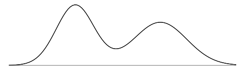


### Other measures

The mean, median, and mode are by far the most common measures of central tendency, and they are the only ones you need to know for this course. However, I thought it might be worth briefly mentioning a few other averages with interesting applications just for fun:

 - The [quadratic mean](https://en.wikipedia.org/wiki/Root_mean_square), also known as the root mean square, is defined for a sample $x_1,\dots,x_n$ as $\sqrt{\frac1n(x_1^2+\cdots+x_n^2)}$. This shows up in some statistical contexts, e.g. the standard deviation is almost a quadratic mean of the difference of each observation from the arithmetic mean, except dividing by $n-1$ instead of $n$ (which corrects a small bias and is called [Bessel's correction](https://en.wikipedia.org/wiki/Bessel%27s_correction)). It also has applications in model evaluation, statistical physics, electronics engineering, signal analysis, and more.
 - The [geometric mean](https://en.wikipedia.org/wiki/Geometric_mean) is defined as $\sqrt[n]{x_1x_2\cdots x_n}$ and is only valid for positive-valued data. This is useful when data is multiplicative rather than additive in nature, e.g. growth rates, interest rates, comparisons of relative performance on benchmarks, etc. It has many applications in finance and economics, some areas of optical engineering, and even cinematography.
   - Note the logarithm of the geometric mean of a sample is equal to the arithmetic mean of the logarithm of the same sample. In other words, a geometric mean viewed on a log scale "looks like" an arithmetic mean on a linear scale. Log transforms are an important tool for certain contexts, see [this page](https://people.duke.edu/~rnau/411log.htm) for a brief overview.
 - The [harmonic mean](https://en.wikipedia.org/wiki/Harmonic_mean) is defined as $\left(\frac{x_1^{-1}+\,\cdots\,+x_n^{-1}}{n}\right)^{\!-1}$, i.e. the reciprocal of the arithmetic mean of the reciprocals of the data, and is also typically only used for positive-valued data. It turns out to be the correct mean to use in certain applications involving rate, ratio, or time values. It also has applications in machine learning, physics, finance, and even [baseball](https://en.wikipedia.org/wiki/Power%E2%80%93speed_number).
 - Collectively, the arithmetic, geometric, and harmonic means are also known as the [Pythagorean means](https://en.wikipedia.org/wiki/Pythagorean_means).

This is just a short list; there are a host of [other means](https://en.wikipedia.org/wiki/Central_tendency#Measures) that exist. Once again, **you do NOT need to know any of these advanced means**; you are only expected to know the arithmetic mean, median, and mode.


### Measures of spread

Arguably the next most important set of summary statistics after measures of central tendency are **measures of spread**, which aim to quantify how "spread out" a dataset is. **Variance** and **standard deviation** are by far the most common measures, but the **IQR** and **range** are also sometimes useful.

Unlike measures of central tendency, measures of spread are typically location-agnostic, i.e. they don't change if the entire dataset is shifted up or down by a constant. Formally, a sample $x_1,\dots,x_n$ and a sample $x_1+c,\,\dots,\,x_n+c$ have the same spread for all $c$.


### Variance (and standard deviation)

Let's get the easy one out of the way first. **Standard deviation is always defined as the (positive) square root of variance**. So what's the variance then? The **variance of a sample is defined as**:

$$s^2=\frac1{n-1}\sum_{i=1}^n(x_i-\bar{x})^2=\frac{(x_1-\bar{x})^2+\cdots+(x_n-\bar{x})^2}{n-1}$$

Basically, it's the **mean squared-distance from the mean**, $\bar{x}$, except we use $n-1$ instead of $n$ to correct for a [small bias]([Bessel's correction](https://en.wikipedia.org/wiki/Bessel%27s_correction)). For example, we can compute the variance of the duration of eruptions, in **days squared**:


``` r
# compute variance of duration
var(eruptions_recent$duration)
```

```
## [1] 101204.7
```

In other words, the "average" squared difference of an eruption's duration and the mean duration is about 101.2k days^2^.

Note the units of the variance are squared of the data units. This makes it inconvenient to work with, since it means it cannot be directly compared with the data. This is why instead we often work with **its square root, i.e. the standard deviation**:

$$s=\sqrt{\frac1{n-1}\sum_{i=1}^n(x_i-\bar{x})^2}$$

which can be thought of as the **"average" distance from the mean** for a given observation. This can be computed using `sd()`:


``` r
# compute the standard deviation of duration
sd(eruptions_recent$duration)
```

```
## [1] 318.1269
```

``` r
# you can check this is equal to sqrt(var(...))
sqrt(var(eruptions_recent$duration))
```

```
## [1] 318.1269
```

In other words, the "average" distance in days between the duration of eruptions and the mean is about 318.1 days.

:::{.note}
Since the standard deviation is defined as the square root of the variance (and thus the variance is always the square of the standard deviation), knowing one of these quantities enables you to also easily compute the other.
:::

The variance and standard deviation are the most common measures of spread, but like the arithmetic mean, they are also sensitive to outliers and may not be suitable with highly skewed data.


### Interquartile range {#iqr}

The interquartile range, also called the IQR, is the **distance between the 1^st^ and 3^rd^ quartile**. To understand this, let's first briefly review percentiles.


### Percentiles

Percentiles are a generalization of the median. Recall the median is the data point that is just barely greater than or equal to 50% of the data. Similarly, a **$p$^th^ percentile is the data point just barely greater than or equal to $p$% of the data**. Percentiles are computed using the [`quantile(x, probs = p)`{.R}](https://rdrr.io/r/stats/quantile.html) function, where `x` is the data vector, and `p` is a desired percentile (or vector thereof). For example, we can compute the 0^th^, 25^th^, 50^th^, 75^th^, and 100^th^ percentiles of eruption duration with:


``` r
quantile(eruptions_recent$duration, probs = c(0, 0.25, 0.5, 0.75, 1))
```

```
##   0%  25%  50%  75% 100% 
##    0    6   71  195 1491
```

These 5 numbers correspond to the **min**, **1^st^ quartile ($Q_1$)**, **median**, **3^rd^ quartile ($Q_3$)**, and max respectively, which are often collectively known as the [five-number summary](https://en.wikipedia.org/wiki/Five-number_summary).

The **difference $Q_3-Q_1$ is called the interquartile range**, and is often used instead of the variance/standard deviation when outliers/skewness is a significant concern in a dataset due to its increased robustness. The IQR can be computed with the `IQR()` function:


``` r
# compute the interquartile range of eruption durations
IQR(eruptions_recent$duration)
```

```
## [1] 189
```


### Range

The range is the crudest of the measures of spread, defined as the **difference between the minimum and maximum** of a sample. It is even more sensitive to outliers than the variance/standard deviation, and thus less commonly used in formal statistical settings. It is sometimes the only practical measures for extremely small datasets.

In R, the `range()` function gives the minimum and maximum in a vector; to get the actual range, you can use `diff()` to take the difference of the two:


``` r
# range() gives the min/max vector
range(eruptions_recent$duration)
```

```
## [1]    0 1491
```

``` r
# diff() of range() gives the true statistical range
diff(range(eruptions_recent$duration))
```

```
## [1] 1491
```


### Other measures

The variance, standard deviation, IQR, and range are the only measures of spread you need to know for this course, but here are a few other measures just for fun:

 - The [median absolute deviation](https://en.wikipedia.org/wiki/Median_absolute_deviation) or MAD is exactly what it sounds like, the median of the absolute value deviation from the median. It's a more robust (i.e. outlier-resistant) version of the standard deviation.
 - The [Gini coefficient](https://en.wikipedia.org/wiki/Gini_coefficient) is another interesting measure of spread (one of my favorites). It's the only one on this list that is dimensionless (i.e. always a "pure" number with no units) and always between 0 and 1 for non-negative data. It's defined as half the [relative mean absolute difference](https://en.wikipedia.org/wiki/Mean_absolute_difference#Relative_mean_absolute_difference), which is itself defined as the average absolute difference $|x_i-x_j|$ between all pairs of observations divided by the arithmetic mean. It's commonly used in economics to characterize inequality, with 0 being total equality (e.g. everyone has exactly the same amount of wealth) and 1 being total inequality (e.g. one person having all the wealth and everyone else having none).

Once again, this is just a subset of the possible [measures of spread](https://en.wikipedia.org/wiki/Statistical_dispersion), and **you do NOT need to know these other measures**; you are only expected to know the variance, standard deviation, IQR, and range.


### Skew

Another important summary statistic is the skew of a dataset. Skew has a precise mathematical definition that is beyond the scope of this course. All you need to know is the **difference between a positive (also called right) skew and a negative (also called left) skew** in a dataset.

The side of the skewness is always the **side with the longer tail**. If the longer tail is on the positive (or right) side, it's called positive (or right) skew. If the longer tail is on the negative (or left) side, it's called negative (or left) skew.

Below, we have 3 example (unimodal) distributions showing the kinds of skewness, with the [**modes**]{style="color:#ff1919"} of each aligned.

 1. An unskewed, or symmetric distribution, where [**mode**]{style="color:#ff1919"} $=$ [**median**]{style="color:#3333ff"} $=$ [**mean**]{style="color:#009900"}.
 2. A positive, or right skewed distribution, where [**mode**]{style="color:#ff1919"} $<$ [**median**]{style="color:#3333ff"} $<$ [**mean**]{style="color:#009900"}.
 3. A negative, or left skewed distribution, where [**mean**]{style="color:#009900"} $<$ [**median**]{style="color:#3333ff"} $<$ [**mode**]{style="color:#ff1919"}.

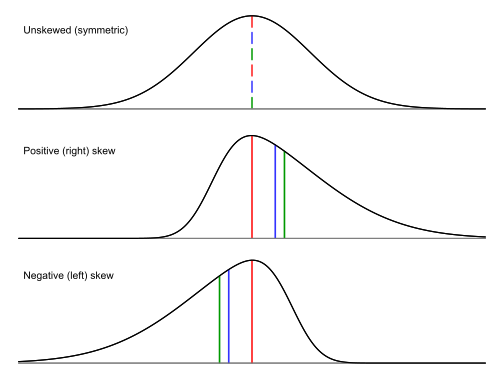

This shows again, as we already learned, that the median is more robust vs the mean to "outliers"/skew, or in other words, the mean is more affected by "outliers"/skew and gets "dragged away" further by the skewness. 

:::{.note}
Visually, the mode is always the "peak", the median splits the distribution into 2 equal areas, and the mean is the center of mass of the shape along the horizontal axis (i.e. its "balancing point").
:::


## Data visualization


Descriptive statistics are a good place to start, but usually plotting your data visually is the best way to fully understand your dataset down to its core. In this next chapter, we will cover a variety of common plot types that are most useful for exploratory analysis.

When studying each plot type, it's important to keep the following questions in mind:

 1. What kind of data is appropriate for this plot?
 2. How to create this plot?
 3. How to interpret this plot?


### ggplot2

We will be making all plots using the [ggplot2](https://ggplot2.tidyverse.org/) package which is also a core Tidyverse package. It offers a robust syntax for easily creating and modifying plots. When making a ggplot2 plot, it's important to remember **everything is a layer** that you **add onto the base object using `+`** just like adding numbers. Whether you're adding a plot, a faceting structure, changing the axes, adding annotations (e.g. title/labels), etc. they're all layers that are added. This may seem strange at first, but you'll quickly grasp it in the examples that follow.

I already have core Tidyverse packages loaded from section \@ref(mean) above, but if you need to load it again make sure to run the following:


``` r
# if you need to, reimport all core tidyverse packages
library(tidyverse)

# optional: set a slightly prettier theme for ggplot2 demos
#           (will also save ink if you print these notes)
theme_set(theme_bw())
```


### Palmer penguins

To properly demonstrate some of these plots, we need a slightly more feature-rich dataset. Let's import the [Palmer penguins](https://allisonhorst.github.io/palmerpenguins) dataset which is readily usable and has a good set of variables.^[Thanks to Hadley Wickham's excellent [R4DS](https://r4ds.hadley.nz/data-visualize) for the inspiration!] You can either get it from the `palmerpenguins` package or import/download from here: [`penguins.csv`](data/penguins.csv).

[{.i6}](https://allisonhorst.github.io/palmerpenguins/articles/art.html)


``` r
# load in the penguins dataset
penguins <- read_csv(
  "https://bwu62.github.io/stat240-revamp/data/penguins.csv",
  show_col_types = FALSE
)
# print the first few rows of the data frame to check;
# this data frame is now too wide for our screen,
# you can see some columns are cut off
print(penguins, n = 5)
```

```
## # A tibble: 344 × 8
##   species island    bill_length_mm bill_depth_mm flipper_length_mm body_mass_g
##   <chr>   <chr>              <dbl>         <dbl>             <dbl>       <dbl>
## 1 Adelie  Torgersen           39.1          18.7               181        3750
## 2 Adelie  Torgersen           39.5          17.4               186        3800
## 3 Adelie  Torgersen           40.3          18                 195        3250
## 4 Adelie  Torgersen           NA            NA                  NA          NA
## 5 Adelie  Torgersen           36.7          19.3               193        3450
## # ℹ 339 more rows
## # ℹ 2 more variables: sex <chr>, year <dbl>
```

``` r
# let's temporarily increase the width and reprint,
# so you can see all columns in the data frame
options(width = 92)
penguins
```

```
## # A tibble: 344 × 8
##    species island    bill_length_mm bill_depth_mm flipper_length_mm body_mass_g sex     year
##    <chr>   <chr>              <dbl>         <dbl>             <dbl>       <dbl> <chr>  <dbl>
##  1 Adelie  Torgersen           39.1          18.7               181        3750 male    2007
##  2 Adelie  Torgersen           39.5          17.4               186        3800 female  2007
##  3 Adelie  Torgersen           40.3          18                 195        3250 female  2007
##  4 Adelie  Torgersen           NA            NA                  NA          NA <NA>    2007
##  5 Adelie  Torgersen           36.7          19.3               193        3450 female  2007
##  6 Adelie  Torgersen           39.3          20.6               190        3650 male    2007
##  7 Adelie  Torgersen           38.9          17.8               181        3625 female  2007
##  8 Adelie  Torgersen           39.2          19.6               195        4675 male    2007
##  9 Adelie  Torgersen           34.1          18.1               193        3475 <NA>    2007
## 10 Adelie  Torgersen           42            20.2               190        4250 <NA>    2007
## # ℹ 334 more rows
```

``` r
# reset width to its original value
options(width = 80)
# another option is the glimpse() function which prints sideways,
# avoiding the hidden columns due to insufficient width issue
glimpse(penguins)
```

```
## Rows: 344
## Columns: 8
## $ species           <chr> "Adelie", "Adelie", "Adelie", "Adelie", "Adelie", "A…
## $ island            <chr> "Torgersen", "Torgersen", "Torgersen", "Torgersen", …
## $ bill_length_mm    <dbl> 39.1, 39.5, 40.3, NA, 36.7, 39.3, 38.9, 39.2, 34.1, …
## $ bill_depth_mm     <dbl> 18.7, 17.4, 18.0, NA, 19.3, 20.6, 17.8, 19.6, 18.1, …
## $ flipper_length_mm <dbl> 181, 186, 195, NA, 193, 190, 181, 195, 193, 190, 186…
## $ body_mass_g       <dbl> 3750, 3800, 3250, NA, 3450, 3650, 3625, 4675, 3475, …
## $ sex               <chr> "male", "female", "female", NA, "female", "male", "f…
## $ year              <dbl> 2007, 2007, 2007, 2007, 2007, 2007, 2007, 2007, 2007…
```

The column variables are intuitively named so you should be able to guess their meaning; see the [`penguins`](https://allisonhorst.github.io/palmerpenguins/reference/penguins.html) help page for more info on the variables as well as papers detailing the data gathering process.


### One-variable plots

Ok, now we're finally ready to learn some plots. We will start with simple one-variable plots, i.e. plots that visualize just a single column in a data frame. Depending on the type of that variable, you may decide to end up choosing between several different plot types.


### Histogram

Histograms are plots where **numeric values are grouped into "bins" (i.e. intervals) and the count of each bin plotted as a bar**. They are extremely effective at visualizing the distribution of a single numeric column, allowing you to easily see the shape, spread, and even skewness of a datset. Histograms are one of the most common plots for numeric data.

The following code makes a basic histogram in R using ggplot.


``` r
ggplot(penguins, aes(x = flipper_length_mm)) + geom_histogram()
```

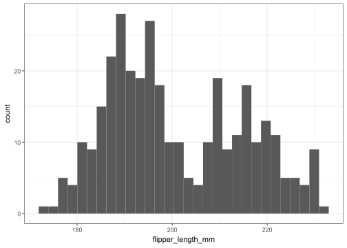


#### Interpretation

Looking at this plot, we can make a few key observations:

 - The distribution of flipper length is [bimodal](#modality), i.e. there are 2 peaks: around 190mm and 215mm.
 - The peak around 190mm is higher (i.e. more numerous) than the peak around 215mm, but they have comparable spreads.
   - This can mean either this group of observations is more prominent in the population studied, or was perhaps the result of some kind of selection or sampling bias.
 - Between the two modes, between 200-205mm, there's a noticeable "gap" with comparatively much fewer observations.
 - The vast majority of observations are around 180-220mm, with a few extremes almost as low as 170mm or just slightly above 230mm.


#### Explanation of syntax:

The code may seem strange at first, but here's a quick explanation:

 1. The `ggplot()` function creates the base "plot object", kind of like setting up a canvas in preparation for painting. `ggplot()` takes 2 arguments in order:
    i.  The first argument `penguins` is the data frame which will be used for the plot. As a general rule, **always put all data you want to plot into a SINGLE data frame** to pass to `ggplot()`.
    ii. The second argument is an aesthetic mapping. Think of **aesthetics as choosing how to display each column of variables in your data frame**. Here's a *brief* list of some common aesthetics you can map:
        - `x` controls the horizontal axis,
        - `y` controls the vertical axis,
        - `color` and `fill` control the point/line/boundary color and inside/fill colors respectively,
        - `shape` and `size` control point shapes and sizes respectively,
        - `linetype` controls the type of line (i.e. solid, dashed, dotted, etc.)
 2. Once the base plot object is setup with a data frame and aesthetic mapping, you simply need to "add on" a plot layer like `geom_histogram()` that specifies the type of plot you want and it will be drawn!
    - You can also specify the aesthetic mapping in the plot layer (e.g. inside `geom_histogram()`), which will override the aesthetic mapping that it inherits from the base `ggplot()` object. Otherwise, the aesthetic mapping in the base `ggplot()` object will be used. For example, these will make the exact same plot:
      - `ggplot(penguins, aes(x = flipper_length_mm)) + geom_histogram()`
      - `ggplot(penguins) + geom_histogram(aes(x = flipper_length_mm))`


:::{.note}

Due to the slightly unusual nature of this syntax, there are a number of common failure modes we have observed. Make sure you take note of the following:

 1. Plot layers are ALWAYS added with `+` like numbers. This is just the design of the syntax. Attempting to use anything else will give errors!
 2. You also MUST execute each layer like a function with `()`. If you try to just add `+ geom_histogram` without the `()`, the layer will not generate correctly and give errors!
 3. If you have many layers, it's recommended to break them into multiple lines, but each incomplete line MUST have either an unclosed parenthetical `(` OR end in an unfinished addition `+`, for example:
    
    ``` r
    # this is ok; R sees the incomplete lines
    # and continues reading the next line
    ggplot(penguins,                       # unclosed ( parenthetical
           aes(x = flipper_length_mm)) +   # unfinished + addition
      geom_histogram()
    ```
    
    ``` r
    # but this will error, since the first line is NOT incomplete!!
    ggplot(penguins, aes(x = flipper_length_mm))
      + geom_histogram()
    ```
    
    ```
    ## Error in `+.gg`:
    ## ! Cannot use `+` with a single argument.
    ## ℹ Did you accidentally put `+` on a new line?
    ```

:::


#### Adding aesthetics

Let's show how you can add additional aesthetics to a plot. Remember how the histogram shows bimodality? It turns out these represent different species of penguins. Let's use the `fill` aesthetic to differentiate between species.


``` r
ggplot(penguins, aes(x = flipper_length_mm, fill = species)) + 
  geom_histogram()
```

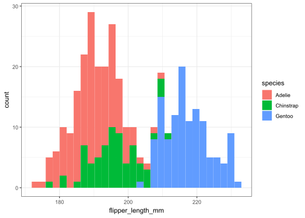

By default, ggplot will stack bars with the same position along the horizontal axis. Let's unstack them by setting [`position = "identity"`](https://ggplot2.tidyverse.org/reference/layer_positions.html) and make the bars only 50% opaque by setting `alpha = 0.5` so we can better see each group. Both these are set in the plot layer `geom_histogram()`.


``` r
ggplot(penguins, aes(x = flipper_length_mm, fill = species)) + 
  geom_histogram(position = "identity", alpha = 0.5)
```

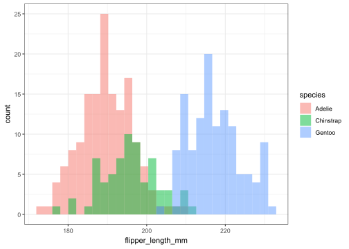

This is already starting to look pretty good! We can now start to easily make a few interesting observations:

 1. Each species of penguin has a different average^[I'm being intentionally vague here since we're not yet doing specific statistical analysis on this data; you can substitute with either mean or median to your preference.] flipper length, with Gentoo penguins having the largest, Adelie penguins having the smallest, and Chinstrap penguins somewhere in between.
 2. There seems to be far more Adelie and Gentoo penguins in the dataset than Chinstrap penguins. We can investigate this further later.


### Title & labels

We should do one final thing before we are done with this plot: title and label it! This is something you should do for EVERY plot you make, not just in this class but throughout your data science career.

All plot annotations (e.g. titles, axes/data labels, legends, etc.) should meet the following criteria:

 1. Accuracy: all annotations should contain accurate information.
 2. Precision: strive to be precise (e.g. instead of "average", specify mean, median, mode, or something else).
 3. Concision: strive to use as few words as necessary to convey only the most important information in the given context.
 4. Grammar/spelling: proper grammar and spelling should be used (abbreviations, if needed, should be standard and intuitive).
 5. Units: unless it's extremely obvious (or unitless), the data units should also be specified!


:::{.note}
Any plots submitted in this class without annotations or with annotations not meeting these criteria may be penalized!
:::


Annotations are hard to get right sometimes; practice adding them to every plot, and think critically as you write them or as you read other peoples' plots and you'll get good fast.

You can add titles/labels by adding the `ggtitle()`, `xlab()`, and `ylab()` layers with the annotation string inside. Example:


``` r
ggplot(penguins, aes(x = flipper_length_mm, fill = species)) + 
  geom_histogram(position = "identity", alpha = 0.5) + 
  ggtitle("Flipper length distribution of Palmer Archipelago penguins") + 
  xlab("Flipper length (mm)") + ylab("Count")
```

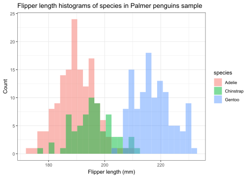

This plot is now ready for use!


### Extra options

90% of the time, the steps we went through above is all you need to completely prepare a plot for use. The other 10% of the time, you may need to configure the plot further. Each plot layer function has additional specific options you can set, so as usual **check the help page or search online** for more!

We will NOT cover every option for every plot type, but occasionally, we may highlight a few important options for you to experiment with and explore further on your own. For `geom_histogram()`, besides unstacking bars with `position = "identity"` argument as we showed above, you may also want to control how and where the bins are set. There's several ways of doing this briefly outlined below---note you can only choose ONE method!


 - You can set the `bins` argument to set that many total bins, which will be used to evenly divide up the range of the data. E.g. by default, `bins = 30` is used to draw 30 bins, which is generally agreed to be a sensible default, even though it can create bins with strange decimal bounds (like in this example, where the bins are (171.91,173.95], (173.95,175.98], ..., (230.91,232.95]).
   - If your data is integer-valued (like flipper length is here), this default method can actually cause problems, where some bins contain more whole numbers than others, creating strange artifacts in your data. For example, if we had two consecutive bins (1.8,3.2] and (3.2,4.6], even though they are both 1.4 units wide, the first covers 2 whole numbers (2 and 3) whereas the second only covers 1 whole number (just 4) which will distort the histogram shape.
 - Alternatively, you can also set the `binwidth` and `boundary` arguments which wil start at the given boundary and count up and down by the given binwidth to create all bins.
   - For example, if you want to make bins of (170,175], (175,180], ..., (230,235], you can set `binwidth = 5` and `boundary = 170` (or any other whole number divisible by 5).
 - For maximum control, you can also set `breaks` equal to any numeric vector to use for the bin boundaries.
   - For example, the same breaks (170,175], (175,180], ..., (230,235] can be chosen by setting `breaks = seq(170, 235, by = 5)`.

Generally, you want to choose bins that are easy to visually interpret, so try using whole numbers that work well with our base-10 decimal system. You also want to avoid using [too few or too many bins](https://miro.medium.com/v2/resize:fit:1400/1*ciVNPBMo-Jvqo_k7pmDbqg.png) which can both cause problems.

Let's improve the plot one final time by setting these more sensible bin widths:


``` r
ggplot(penguins, aes(x = flipper_length_mm, fill = species)) + 
  geom_histogram(position = "identity", alpha = 0.5, 
                 binwidth = 5, boundary = 170) + 
  ggtitle("Flipper length distribution of Palmer Archipelago penguins") + 
  xlab("Flipper length (mm)") + ylab("Count")
```

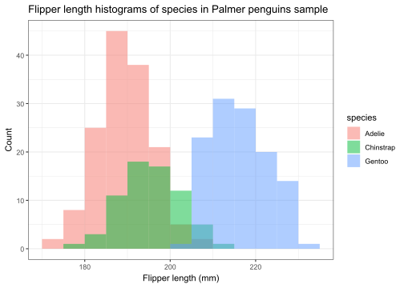

This is now even easier to interpret, and the artifacts from the previous plots are gone. We can easily identify the average^[again, I'm being intentionally ambiguous here] in each group, and even identify specific counts for specific bins (e.g. I can tell for example 39 penguins Adelie penguins were observed in the (190,195] bin).


### Density plots

A common variation on the histogram is the density plot, which can be thought of as like a **smoothed-curve version of a histogram, but with the area under the curve normalized to 1**. It represents a guess of what the entire population distribution looks like based on a sample drawn. It can be created by adding `geom_density()` as a plot layer.


``` r
ggplot(penguins, aes(x = flipper_length_mm)) + geom_density()
```

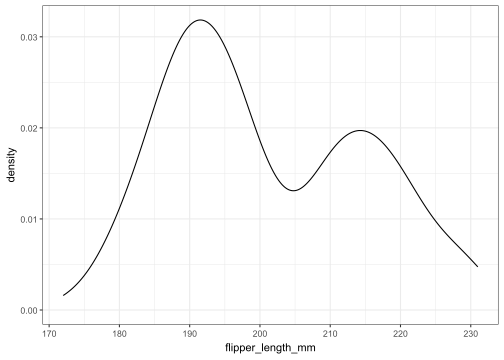

Similar to the histogram, we can also add additional aesthetics to differentiate by species:


``` r
ggplot(penguins, aes(x = flipper_length_mm, fill = species)) + 
  geom_density(alpha = 0.5) + 
  ggtitle("Flipper length distribution of Palmer Archipelago penguins") + 
  xlab("Flipper length (mm)") + ylab("Density")
```

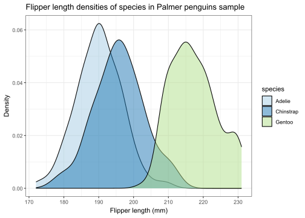

Note that this looks similar to the previously made histogram, but the Chinstrap distribution is no longer overshadowed by the other species, since the area normalization process effectively removes the effect sample size has on the height of the distribution of each species.

We will learn a lot more about density plots later in the inference portion of this course, but for now we will move on.


### Box plots

Another common plot for numeric values is the box plot. Box plots are simply a way of **showing the following 5 summary statistics on a number line**:

 1. The **minimum** of the sample,
 2. The **first quartile** $Q_1$, i.e. the 25^th^ percentile,
 3. The **median**,
 4. The **third quartile** $Q_3$, i.e. the 75^th^ percentile, and
 5. The **maximum** of the sample.

$Q_1$ and $Q_3$ form the ends of the "box", with the median shown as a line in between, while the min and max form the "whiskers" that stretch out on either end. Note the width of the box (i.e. $Q_3-Q_1$) is the [IQR](#iqr).

Compared to the histogram and density plot, there are a few key advantages and drawbacks:

 1. It's easier to compare specific summary statistics like the median and quartiles using box plots,
 2. However it's often less effective at communicating more complex features like modality and skew.
 3. Its simplicity sometimes works better for comparing many groups without appearing overly complex.

Let's show both the five number summary with `fivenum()` as well as the corresponding box plot for the flipper length variable:


``` r
# get the min, q1, median, q3, and max:
fivenum(penguins$flipper_length_mm)
```

```
## [1] 172 190 197 213 231
```

``` r
# turn these into a box plot
ggplot(penguins, aes(x = flipper_length_mm)) + geom_boxplot()
```

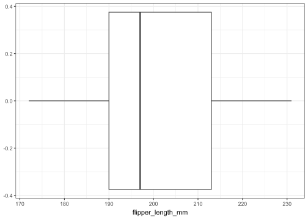

Note that even though we can easily identify the median, quartiles, and min/max, we can **no longer observe bimodality** like we previously did in the histogram or density plot. This is a tradeoff that is sometimes worth making and sometimes not.

The boxplot can also be easily adapted to highlight the difference between species, this time by adding a `y` aesthetic:


``` r
ggplot(penguins, aes(x = flipper_length_mm, y = species)) + 
  geom_boxplot() + 
  ggtitle("Flipper length box plots for Palmer Archipelago penguins") + 
  xlab("Flipper length (mm)") + ylab("Species")
```

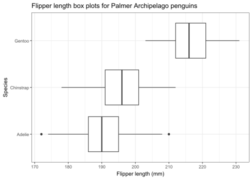

This plot sacrifices the distributional complexity of the density plot, but in return we can very easily compare the summary statistics of each group, and overall arguably just "looks nicer" in my opinion.

Note 2 Adelie penguins were plotted as points instead, this is due to a common "rule of thumb" for box plots to label points more than 1.5*IQR away from each quartile as "outliers". Again, this is simply a default convention. See the help page for more details, as well as how to disable this.


