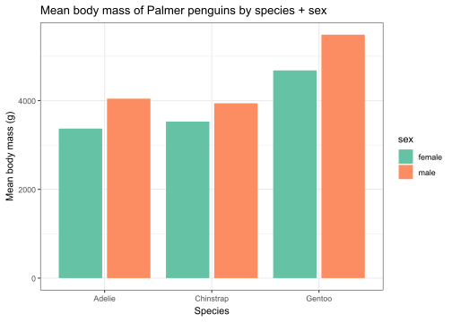
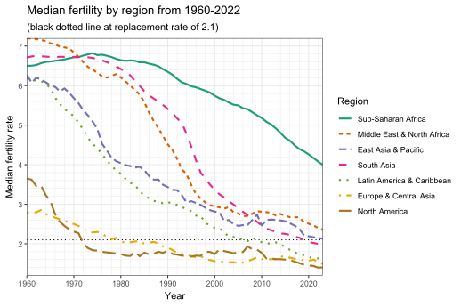
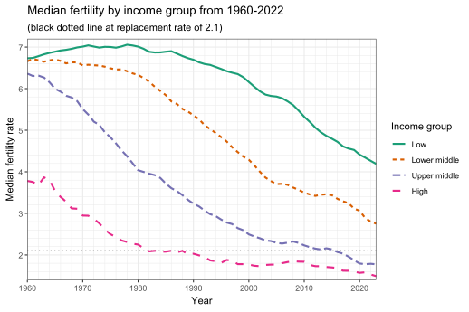

# Advanced Operations

In this chapter, we will cover a few more advanced, yet incredibly useful data tidying operations like grouping, joining, binding, and pivoting. Along the way, we will also make extensive use of dplyr functions learned in the previous chapter.


## Grouping

Often, you will need to apply dplyr's various operations like `mutate()`, `summarize()`, or slicing function not across the entire dataset but in groups. This is an important technique across data science, whether it's data cleaning to exploration to visualization to modeling.

By default, data frames are not grouped when created or imported. You can create a grouping structure with the `group_by()` function. The basic syntax is `df %>% group_by(col1, col2, ...)` where `col1`, `col2`, ... are variables whose values are used to determine groups. You can group by just 1 variable, 2 variables, or as many variables as needed. **Rows with the same values in the chosen columns will be grouped together**.

After grouping, operations that normally run across all rows **now run across each group**. Here's a few simple examples using the familiar penguins dataset to start:


``` r
# import tidyverse, import magrittr (for extra %T>% pipe),
# tweak some readr/ggplot options (optional), and load dataset
library(tidyverse)
library(magrittr)
options(readr.show_col_types = FALSE)
source("https://bwu62.github.io/stat240-revamp/ggplot_theme_options.R")
penguins <- read_csv("https://bwu62.github.io/stat240-revamp/data/penguins.csv")
```


``` r
# group by species and get mean/median/sd body mass + sample size of each group
penguins %>%
  group_by(species) %>%
  summarize(
    mean_mass   = mean(body_mass_g),
    median_mass = median(body_mass_g),
    sd_mass     = sd(body_mass_g),
    n           = n()
  )
```

```
# A tibble: 3 × 5
  species   mean_mass median_mass sd_mass     n
  <chr>         <dbl>       <dbl>   <dbl> <int>
1 Adelie        3706.        3700    459.   146
2 Chinstrap     3733.        3700    384.    68
3 Gentoo        5092.        5050    501.   119
```

``` r
# we can also group by multiple, e.g. group by spcies + sex
penguins %>%
  group_by(species, sex) %>%
  summarize(
    mean_mass   = mean(body_mass_g),
    median_mass = median(body_mass_g),
    sd_mass     = sd(body_mass_g),
    n           = n()
  )
```

```
# A tibble: 6 × 6
# Groups:   species [3]
  species   sex    mean_mass median_mass sd_mass     n
  <chr>     <chr>      <dbl>       <dbl>   <dbl> <int>
1 Adelie    female     3369.        3400    269.    73
2 Adelie    male       4043.        4000    347.    73
3 Chinstrap female     3527.        3550    285.    34
4 Chinstrap male       3939.        3950    362.    34
5 Gentoo    female     4680.        4700    282.    58
6 Gentoo    male       5485.        5500    313.    61
```

:::{.fold .o}

``` r
# we can of course also mutate within groups
# e.g. convert bill length in mm to number of SDs
#      away from species group mean
# to better show the result, I'm forcing it to print all rows in order
# but hiding the output in a collapsible box for style
penguins %>%
  select(species, sex, bill_length_mm) %>%
  group_by(species) %>%
  mutate(
    n = n(),
    bill_length_std = (bill_length_mm - mean(bill_length_mm)) / sd(bill_length_mm)
  ) %>%
  arrange(species, bill_length_std) %>%
  print(n = Inf)
```

```
# A tibble: 333 × 5
# Groups:   species [3]
    species   sex    bill_length_mm     n bill_length_std
    <chr>     <chr>           <dbl> <int>           <dbl>
  1 Adelie    female           32.1   146        -2.53   
  2 Adelie    female           33.1   146        -2.15   
  3 Adelie    female           33.5   146        -2.00   
  4 Adelie    female           34     146        -1.81   
  5 Adelie    female           34.4   146        -1.66   
  6 Adelie    female           34.5   146        -1.62   
  7 Adelie    male             34.6   146        -1.59   
  8 Adelie    female           34.6   146        -1.59   
  9 Adelie    female           35     146        -1.44   
 10 Adelie    female           35     146        -1.44   
 11 Adelie    male             35.1   146        -1.40   
 12 Adelie    female           35.2   146        -1.36   
 13 Adelie    female           35.3   146        -1.32   
 14 Adelie    female           35.5   146        -1.25   
 15 Adelie    female           35.5   146        -1.25   
 16 Adelie    female           35.6   146        -1.21   
 17 Adelie    female           35.7   146        -1.17   
 18 Adelie    female           35.7   146        -1.17   
 19 Adelie    female           35.7   146        -1.17   
 20 Adelie    female           35.9   146        -1.10   
 21 Adelie    female           35.9   146        -1.10   
 22 Adelie    female           36     146        -1.06   
 23 Adelie    female           36     146        -1.06   
 24 Adelie    female           36     146        -1.06   
 25 Adelie    female           36     146        -1.06   
 26 Adelie    female           36.2   146        -0.985  
 27 Adelie    female           36.2   146        -0.985  
 28 Adelie    female           36.2   146        -0.985  
 29 Adelie    male             36.3   146        -0.948  
 30 Adelie    female           36.4   146        -0.910  
 31 Adelie    female           36.4   146        -0.910  
 32 Adelie    female           36.5   146        -0.873  
 33 Adelie    female           36.5   146        -0.873  
 34 Adelie    female           36.6   146        -0.835  
 35 Adelie    female           36.6   146        -0.835  
 36 Adelie    female           36.7   146        -0.798  
 37 Adelie    female           36.7   146        -0.798  
 38 Adelie    female           36.8   146        -0.760  
 39 Adelie    female           36.9   146        -0.723  
 40 Adelie    female           37     146        -0.685  
 41 Adelie    female           37     146        -0.685  
 42 Adelie    male             37.2   146        -0.610  
 43 Adelie    male             37.2   146        -0.610  
 44 Adelie    female           37.3   146        -0.572  
 45 Adelie    male             37.3   146        -0.572  
 46 Adelie    female           37.3   146        -0.572  
 47 Adelie    male             37.5   146        -0.497  
 48 Adelie    female           37.6   146        -0.460  
 49 Adelie    male             37.6   146        -0.460  
 50 Adelie    female           37.6   146        -0.460  
 51 Adelie    male             37.7   146        -0.422  
 52 Adelie    female           37.7   146        -0.422  
 53 Adelie    male             37.7   146        -0.422  
 54 Adelie    female           37.8   146        -0.385  
 55 Adelie    male             37.8   146        -0.385  
 56 Adelie    male             37.8   146        -0.385  
 57 Adelie    female           37.9   146        -0.347  
 58 Adelie    female           37.9   146        -0.347  
 59 Adelie    female           38.1   146        -0.272  
 60 Adelie    female           38.1   146        -0.272  
 61 Adelie    female           38.1   146        -0.272  
 62 Adelie    female           38.1   146        -0.272  
 63 Adelie    male             38.2   146        -0.234  
 64 Adelie    male             38.2   146        -0.234  
 65 Adelie    male             38.3   146        -0.197  
 66 Adelie    female           38.5   146        -0.122  
 67 Adelie    male             38.6   146        -0.0841 
 68 Adelie    female           38.6   146        -0.0841 
 69 Adelie    female           38.6   146        -0.0841 
 70 Adelie    female           38.7   146        -0.0466 
 71 Adelie    male             38.8   146        -0.00900
 72 Adelie    male             38.8   146        -0.00900
 73 Adelie    female           38.8   146        -0.00900
 74 Adelie    female           38.9   146         0.0286 
 75 Adelie    female           38.9   146         0.0286 
 76 Adelie    female           39     146         0.0661 
 77 Adelie    female           39     146         0.0661 
 78 Adelie    male             39     146         0.0661 
 79 Adelie    male             39.1   146         0.104  
 80 Adelie    male             39.2   146         0.141  
 81 Adelie    male             39.2   146         0.141  
 82 Adelie    male             39.2   146         0.141  
 83 Adelie    male             39.3   146         0.179  
 84 Adelie    female           39.5   146         0.254  
 85 Adelie    female           39.5   146         0.254  
 86 Adelie    female           39.5   146         0.254  
 87 Adelie    male             39.6   146         0.291  
 88 Adelie    female           39.6   146         0.291  
 89 Adelie    female           39.6   146         0.291  
 90 Adelie    male             39.6   146         0.291  
 91 Adelie    female           39.6   146         0.291  
 92 Adelie    male             39.7   146         0.329  
 93 Adelie    male             39.7   146         0.329  
 94 Adelie    female           39.7   146         0.329  
 95 Adelie    male             39.7   146         0.329  
 96 Adelie    male             39.8   146         0.367  
 97 Adelie    male             40.1   146         0.479  
 98 Adelie    female           40.2   146         0.517  
 99 Adelie    male             40.2   146         0.517  
100 Adelie    female           40.2   146         0.517  
101 Adelie    female           40.3   146         0.554  
102 Adelie    male             40.3   146         0.554  
103 Adelie    female           40.5   146         0.629  
104 Adelie    male             40.5   146         0.629  
105 Adelie    male             40.6   146         0.667  
106 Adelie    male             40.6   146         0.667  
107 Adelie    male             40.6   146         0.667  
108 Adelie    male             40.6   146         0.667  
109 Adelie    male             40.7   146         0.705  
110 Adelie    male             40.8   146         0.742  
111 Adelie    male             40.8   146         0.742  
112 Adelie    male             40.9   146         0.780  
113 Adelie    female           40.9   146         0.780  
114 Adelie    male             41     146         0.817  
115 Adelie    female           41.1   146         0.855  
116 Adelie    male             41.1   146         0.855  
117 Adelie    male             41.1   146         0.855  
118 Adelie    male             41.1   146         0.855  
119 Adelie    male             41.1   146         0.855  
120 Adelie    male             41.1   146         0.855  
121 Adelie    male             41.1   146         0.855  
122 Adelie    male             41.3   146         0.930  
123 Adelie    male             41.3   146         0.930  
124 Adelie    male             41.4   146         0.967  
125 Adelie    male             41.4   146         0.967  
126 Adelie    male             41.5   146         1.01   
127 Adelie    male             41.5   146         1.01   
128 Adelie    male             41.6   146         1.04   
129 Adelie    male             41.8   146         1.12   
130 Adelie    male             42     146         1.19   
131 Adelie    male             42.1   146         1.23   
132 Adelie    female           42.2   146         1.27   
133 Adelie    male             42.2   146         1.27   
134 Adelie    male             42.3   146         1.31   
135 Adelie    male             42.5   146         1.38   
136 Adelie    male             42.7   146         1.46   
137 Adelie    male             42.8   146         1.49   
138 Adelie    male             42.9   146         1.53   
139 Adelie    male             43.1   146         1.61   
140 Adelie    male             43.2   146         1.64   
141 Adelie    male             43.2   146         1.64   
142 Adelie    male             44.1   146         1.98   
143 Adelie    male             44.1   146         1.98   
144 Adelie    male             45.6   146         2.54   
145 Adelie    male             45.8   146         2.62   
146 Adelie    male             46     146         2.70   
147 Chinstrap female           40.9    68        -2.38   
148 Chinstrap female           42.4    68        -1.93   
149 Chinstrap female           42.5    68        -1.90   
150 Chinstrap female           42.5    68        -1.90   
151 Chinstrap female           43.2    68        -1.69   
152 Chinstrap female           43.5    68        -1.60   
153 Chinstrap female           45.2    68        -1.09   
154 Chinstrap female           45.2    68        -1.09   
155 Chinstrap female           45.4    68        -1.03   
156 Chinstrap female           45.5    68        -0.998  
157 Chinstrap female           45.6    68        -0.968  
158 Chinstrap female           45.7    68        -0.938  
159 Chinstrap female           45.7    68        -0.938  
160 Chinstrap female           45.9    68        -0.879  
161 Chinstrap female           46      68        -0.849  
162 Chinstrap female           46.1    68        -0.819  
163 Chinstrap female           46.2    68        -0.789  
164 Chinstrap female           46.4    68        -0.729  
165 Chinstrap female           46.4    68        -0.729  
166 Chinstrap female           46.5    68        -0.699  
167 Chinstrap female           46.6    68        -0.669  
168 Chinstrap female           46.7    68        -0.639  
169 Chinstrap female           46.8    68        -0.609  
170 Chinstrap female           46.9    68        -0.579  
171 Chinstrap female           47      68        -0.549  
172 Chinstrap female           47.5    68        -0.399  
173 Chinstrap female           47.6    68        -0.369  
174 Chinstrap female           48.1    68        -0.220  
175 Chinstrap male             48.5    68        -0.100  
176 Chinstrap male             49      68         0.0498 
177 Chinstrap male             49      68         0.0498 
178 Chinstrap male             49.2    68         0.110  
179 Chinstrap male             49.3    68         0.140  
180 Chinstrap male             49.5    68         0.199  
181 Chinstrap male             49.6    68         0.229  
182 Chinstrap male             49.7    68         0.259  
183 Chinstrap female           49.8    68         0.289  
184 Chinstrap male             50      68         0.349  
185 Chinstrap female           50.1    68         0.379  
186 Chinstrap male             50.2    68         0.409  
187 Chinstrap female           50.2    68         0.409  
188 Chinstrap male             50.3    68         0.439  
189 Chinstrap male             50.5    68         0.499  
190 Chinstrap female           50.5    68         0.499  
191 Chinstrap male             50.6    68         0.529  
192 Chinstrap male             50.7    68         0.559  
193 Chinstrap male             50.8    68         0.589  
194 Chinstrap male             50.8    68         0.589  
195 Chinstrap male             50.9    68         0.619  
196 Chinstrap female           50.9    68         0.619  
197 Chinstrap male             51      68         0.649  
198 Chinstrap male             51.3    68         0.739  
199 Chinstrap male             51.3    68         0.739  
200 Chinstrap male             51.3    68         0.739  
201 Chinstrap male             51.4    68         0.768  
202 Chinstrap male             51.5    68         0.798  
203 Chinstrap male             51.7    68         0.858  
204 Chinstrap male             51.9    68         0.918  
205 Chinstrap male             52      68         0.948  
206 Chinstrap male             52      68         0.948  
207 Chinstrap male             52      68         0.948  
208 Chinstrap male             52.2    68         1.01   
209 Chinstrap male             52.7    68         1.16   
210 Chinstrap male             52.8    68         1.19   
211 Chinstrap male             53.5    68         1.40   
212 Chinstrap male             54.2    68         1.61   
213 Chinstrap male             55.8    68         2.09   
214 Chinstrap female           58      68         2.74   
215 Gentoo    female           40.9   119        -2.15   
216 Gentoo    female           41.7   119        -1.89   
217 Gentoo    female           42     119        -1.79   
218 Gentoo    female           42.6   119        -1.60   
219 Gentoo    female           42.7   119        -1.57   
220 Gentoo    female           42.8   119        -1.54   
221 Gentoo    female           42.9   119        -1.50   
222 Gentoo    female           43.2   119        -1.41   
223 Gentoo    female           43.3   119        -1.37   
224 Gentoo    female           43.3   119        -1.37   
225 Gentoo    female           43.4   119        -1.34   
226 Gentoo    female           43.5   119        -1.31   
227 Gentoo    female           43.5   119        -1.31   
228 Gentoo    female           43.6   119        -1.28   
229 Gentoo    female           43.8   119        -1.21   
230 Gentoo    female           44     119        -1.15   
231 Gentoo    male             44.4   119        -1.02   
232 Gentoo    female           44.5   119        -0.988  
233 Gentoo    female           44.9   119        -0.859  
234 Gentoo    female           44.9   119        -0.859  
235 Gentoo    male             45     119        -0.827  
236 Gentoo    female           45.1   119        -0.795  
237 Gentoo    female           45.1   119        -0.795  
238 Gentoo    female           45.1   119        -0.795  
239 Gentoo    male             45.2   119        -0.762  
240 Gentoo    female           45.2   119        -0.762  
241 Gentoo    male             45.2   119        -0.762  
242 Gentoo    female           45.2   119        -0.762  
243 Gentoo    female           45.3   119        -0.730  
244 Gentoo    female           45.3   119        -0.730  
245 Gentoo    female           45.4   119        -0.698  
246 Gentoo    female           45.5   119        -0.666  
247 Gentoo    female           45.5   119        -0.666  
248 Gentoo    male             45.5   119        -0.666  
249 Gentoo    female           45.5   119        -0.666  
250 Gentoo    female           45.7   119        -0.601  
251 Gentoo    female           45.8   119        -0.569  
252 Gentoo    female           45.8   119        -0.569  
253 Gentoo    female           46.1   119        -0.473  
254 Gentoo    male             46.1   119        -0.473  
255 Gentoo    female           46.2   119        -0.440  
256 Gentoo    male             46.2   119        -0.440  
257 Gentoo    female           46.2   119        -0.440  
258 Gentoo    male             46.3   119        -0.408  
259 Gentoo    male             46.4   119        -0.376  
260 Gentoo    female           46.4   119        -0.376  
261 Gentoo    female           46.5   119        -0.344  
262 Gentoo    female           46.5   119        -0.344  
263 Gentoo    female           46.5   119        -0.344  
264 Gentoo    female           46.5   119        -0.344  
265 Gentoo    female           46.6   119        -0.312  
266 Gentoo    male             46.7   119        -0.279  
267 Gentoo    male             46.8   119        -0.247  
268 Gentoo    male             46.8   119        -0.247  
269 Gentoo    female           46.8   119        -0.247  
270 Gentoo    female           46.9   119        -0.215  
271 Gentoo    female           47.2   119        -0.118  
272 Gentoo    female           47.2   119        -0.118  
273 Gentoo    male             47.3   119        -0.0863 
274 Gentoo    female           47.4   119        -0.0541 
275 Gentoo    female           47.5   119        -0.0219 
276 Gentoo    female           47.5   119        -0.0219 
277 Gentoo    female           47.5   119        -0.0219 
278 Gentoo    male             47.6   119         0.0103 
279 Gentoo    female           47.7   119         0.0425 
280 Gentoo    male             47.8   119         0.0747 
281 Gentoo    male             48.1   119         0.171  
282 Gentoo    female           48.2   119         0.203  
283 Gentoo    male             48.2   119         0.203  
284 Gentoo    male             48.4   119         0.268  
285 Gentoo    male             48.4   119         0.268  
286 Gentoo    female           48.4   119         0.268  
287 Gentoo    male             48.5   119         0.300  
288 Gentoo    female           48.5   119         0.300  
289 Gentoo    male             48.6   119         0.332  
290 Gentoo    female           48.7   119         0.364  
291 Gentoo    male             48.7   119         0.364  
292 Gentoo    male             48.7   119         0.364  
293 Gentoo    male             48.8   119         0.397  
294 Gentoo    male             49     119         0.461  
295 Gentoo    female           49.1   119         0.493  
296 Gentoo    female           49.1   119         0.493  
297 Gentoo    male             49.1   119         0.493  
298 Gentoo    male             49.2   119         0.525  
299 Gentoo    male             49.3   119         0.558  
300 Gentoo    male             49.4   119         0.590  
301 Gentoo    male             49.5   119         0.622  
302 Gentoo    male             49.5   119         0.622  
303 Gentoo    male             49.6   119         0.654  
304 Gentoo    male             49.6   119         0.654  
305 Gentoo    male             49.8   119         0.719  
306 Gentoo    male             49.8   119         0.719  
307 Gentoo    male             49.9   119         0.751  
308 Gentoo    male             50     119         0.783  
309 Gentoo    male             50     119         0.783  
310 Gentoo    male             50     119         0.783  
311 Gentoo    male             50     119         0.783  
312 Gentoo    male             50.1   119         0.815  
313 Gentoo    male             50.2   119         0.847  
314 Gentoo    male             50.4   119         0.912  
315 Gentoo    male             50.4   119         0.912  
316 Gentoo    male             50.5   119         0.944  
317 Gentoo    male             50.5   119         0.944  
318 Gentoo    female           50.5   119         0.944  
319 Gentoo    male             50.7   119         1.01   
320 Gentoo    male             50.8   119         1.04   
321 Gentoo    male             50.8   119         1.04   
322 Gentoo    male             51.1   119         1.14   
323 Gentoo    male             51.1   119         1.14   
324 Gentoo    male             51.3   119         1.20   
325 Gentoo    male             51.5   119         1.27   
326 Gentoo    male             52.1   119         1.46   
327 Gentoo    male             52.2   119         1.49   
328 Gentoo    male             52.5   119         1.59   
329 Gentoo    male             53.4   119         1.88   
330 Gentoo    male             54.3   119         2.17   
331 Gentoo    male             55.1   119         2.42   
332 Gentoo    male             55.9   119         2.68   
333 Gentoo    male             59.6   119         3.87   
```
:::


``` r
# get the largest 3 penguins by bill depth from each species
penguins %>%
  group_by(species) %>%
  slice_max(bill_depth_mm, n = 3)
```

```
# A tibble: 9 × 8
# Groups:   species [3]
  species   island   bill_length_mm bill_depth_mm flipper_length_mm body_mass_g sex  
  <chr>     <chr>             <dbl>         <dbl>             <dbl>       <dbl> <chr>
1 Adelie    Torgers…           46            21.5               194        4200 male 
2 Adelie    Torgers…           38.6          21.2               191        3800 male 
3 Adelie    Dream              42.3          21.2               191        4150 male 
4 Chinstrap Dream              54.2          20.8               201        4300 male 
5 Chinstrap Dream              52            20.7               210        4800 male 
6 Chinstrap Dream              51.7          20.3               194        3775 male 
7 Gentoo    Biscoe             44.4          17.3               219        5250 male 
8 Gentoo    Biscoe             50.8          17.3               228        5600 male 
9 Gentoo    Biscoe             52.2          17.1               228        5400 male 
# ℹ 1 more variable: year <dbl>
```


### Regrouping

Sometimes one `group_by()` may not be enough to get what you need; you may need to re-`group_by()` by something else to finish the job. For example, suppose you want to see what percent of each species came from different islands. This requires two uses of `group_by()`:


``` r
# first group by species + island and summarize to get size of each group,
# then regroup by species and MUTATE (not summarize) totals for each species,
# then divide these to get proportion of each species from each island
penguins %>%
  group_by(species, island) %>%
  summarize(n = n()) %>%
  group_by(species) %>%
  mutate(
    species_total = sum(n),
    pct_of_species_from_island = n / species_total * 100
  )
```

```
# A tibble: 5 × 5
# Groups:   species [3]
  species   island        n species_total pct_of_species_from_island
  <chr>     <chr>     <int>         <int>                      <dbl>
1 Adelie    Biscoe       44           146                       30.1
2 Adelie    Dream        55           146                       37.7
3 Adelie    Torgersen    47           146                       32.2
4 Chinstrap Dream        68            68                      100  
5 Gentoo    Biscoe      119           119                      100  
```

This combination of `df %>% group_by(...) %>% summarize(n = n())` is so common, we have this shortcut for it: `df %>% count(...)`. We can demonstrate this in another example involving regrouping. Suppose we want to know what percent of each species were male/female:


``` r
# again, first group by species + sex and get size using the shortcut count(),
# then regroup by species and MUTATE totals for each species,
# then divide to get proportions of each species that were male/female
penguins %>%
  count(species, sex) %>%
  group_by(species) %>%
  mutate(
    species_total = sum(n),
    pct_of_species_each_sex = n / species_total * 100
  )
```

```
# A tibble: 6 × 5
# Groups:   species [3]
  species   sex        n species_total pct_of_species_each_sex
  <chr>     <chr>  <int>         <int>                   <dbl>
1 Adelie    female    73           146                    50  
2 Adelie    male      73           146                    50  
3 Chinstrap female    34            68                    50  
4 Chinstrap male      34            68                    50  
5 Gentoo    female    58           119                    48.7
6 Gentoo    male      61           119                    51.3
```

Groups are also useful for prepping data frames for plotting. For example, here's a chunk that produces a bar plot showing how mean body mass changes by species and sex:


``` r
# get mean body mass by species + sex and plot
# the %T>% is a special pipe called a Tee pipe
# it's a shortcut for piping something into 2 different operations,
# useful for example when you want to print a data frame, then also plot it
# see https://magrittr.tidyverse.org/reference/tee.html for more
penguins %>% 
  group_by(species, sex) %>% 
  summarize(mean_mass = mean(body_mass_g)) %T>% print %>% 
  ggplot(aes(x = species, y = mean_mass, fill = sex)) +
  geom_col(position = "dodge2") +
  labs(x = "Species", y = "Mean body mass (g)",
       title = "Mean body mass of Palmer penguins by species + sex")
```

```
# A tibble: 6 × 3
# Groups:   species [3]
  species   sex    mean_mass
  <chr>     <chr>      <dbl>
1 Adelie    female     3369.
2 Adelie    male       4043.
3 Chinstrap female     3527.
4 Chinstrap male       3939.
5 Gentoo    female     4680.
6 Gentoo    male       5485.
```




### Ungrouping

Many operations output grouped data frames. For example, look closely at the output of the previous chunks and you'll see `# Groups:   species [3]` in most of them. This means any further operations you run will continue to execute in a grouped way.

You can remove the grouping structure with `ungroup()`. This allows you to revert to running operations on the entire data frame. Example:


``` r
# get count of each species + sex combination,
# but this time get its percentage out of ALL observations
penguins %>%
  count(species, sex) %>%
  ungroup() %>%
  mutate(pct_of_all = n / sum(n))
```

```
# A tibble: 6 × 4
  species   sex        n pct_of_all
  <chr>     <chr>  <int>      <dbl>
1 Adelie    female    73      0.219
2 Adelie    male      73      0.219
3 Chinstrap female    34      0.102
4 Chinstrap male      34      0.102
5 Gentoo    female    58      0.174
6 Gentoo    male      61      0.183
```


### More practice! (`fertility` data)

Let's give the penguins dataset a rest and practice dplyr and grouping a bit more with a different dataset. The following chunk imports [`fertility.csv`](data/fertility.csv), the cleaned global fertility data set from [World Bank](https://data.worldbank.org/indicator/SP.DYN.TFRT.IN), giving the average number of births per woman for each year and country from 1960 to present. For the past few decades, global fertility has been [sharply declining](https://ourworldindata.org/un-population-2024-revision) for most countries. Many countries are now below the [replacement rate of 2.1](https://en.wikipedia.org/wiki/Sub-replacement_fertility), leading to widespread concerns of a population collapse in the latter part of the 21^st^ century.


``` r
fertility <- read_csv("https://bwu62.github.io/stat240-revamp/data/fertility.csv")
fertility
```

```
# A tibble: 13,792 × 6
   code  country     region     income_group  year  rate
   <chr> <chr>       <chr>      <chr>        <dbl> <dbl>
 1 AFG   Afghanistan South Asia Low income    1960  7.28
 2 AFG   Afghanistan South Asia Low income    1961  7.28
 3 AFG   Afghanistan South Asia Low income    1962  7.29
 4 AFG   Afghanistan South Asia Low income    1963  7.30
 5 AFG   Afghanistan South Asia Low income    1964  7.30
 6 AFG   Afghanistan South Asia Low income    1965  7.30
 7 AFG   Afghanistan South Asia Low income    1966  7.32
 8 AFG   Afghanistan South Asia Low income    1967  7.34
 9 AFG   Afghanistan South Asia Low income    1968  7.36
10 AFG   Afghanistan South Asia Low income    1969  7.39
# ℹ 13,782 more rows
```

Each country has over 60 years of data in this dataset. We can see an overview which countries are represented in the dataset and what their listed region and income group are by temporarily dropping years, removing duplicates, and printing the full output below in a collapsible box:

:::{.fold .o}

``` r
fertility %>%
  select(country:income_group) %>%
  distinct() %>%
  print(n = Inf)
```

```
# A tibble: 215 × 3
    country                  region                     income_group       
    <chr>                    <chr>                      <chr>              
  1 Afghanistan              South Asia                 Low income         
  2 Albania                  Europe & Central Asia      Upper middle income
  3 Algeria                  Middle East & North Africa Upper middle income
  4 American Samoa           East Asia & Pacific        High income        
  5 Andorra                  Europe & Central Asia      High income        
  6 Angola                   Sub-Saharan Africa         Lower middle income
  7 Antigua & Barbuda        Latin America & Caribbean  High income        
  8 Argentina                Latin America & Caribbean  Upper middle income
  9 Armenia                  Europe & Central Asia      Upper middle income
 10 Aruba                    Latin America & Caribbean  High income        
 11 Australia                East Asia & Pacific        High income        
 12 Austria                  Europe & Central Asia      High income        
 13 Azerbaijan               Europe & Central Asia      Upper middle income
 14 Bahamas                  Latin America & Caribbean  High income        
 15 Bahrain                  Middle East & North Africa High income        
 16 Bangladesh               South Asia                 Lower middle income
 17 Barbados                 Latin America & Caribbean  High income        
 18 Belarus                  Europe & Central Asia      Upper middle income
 19 Belgium                  Europe & Central Asia      High income        
 20 Belize                   Latin America & Caribbean  Upper middle income
 21 Benin                    Sub-Saharan Africa         Lower middle income
 22 Bermuda                  North America              High income        
 23 Bhutan                   South Asia                 Lower middle income
 24 Bolivia                  Latin America & Caribbean  Lower middle income
 25 Bosnia & Herzegovina     Europe & Central Asia      Upper middle income
 26 Botswana                 Sub-Saharan Africa         Upper middle income
 27 Brazil                   Latin America & Caribbean  Upper middle income
 28 Brunei                   East Asia & Pacific        High income        
 29 Bulgaria                 Europe & Central Asia      High income        
 30 Burkina Faso             Sub-Saharan Africa         Low income         
 31 Burundi                  Sub-Saharan Africa         Low income         
 32 Cambodia                 East Asia & Pacific        Lower middle income
 33 Cameroon                 Sub-Saharan Africa         Lower middle income
 34 Canada                   North America              High income        
 35 Cape Verde               Sub-Saharan Africa         Lower middle income
 36 Cayman Islands           Latin America & Caribbean  High income        
 37 Central African Republic Sub-Saharan Africa         Low income         
 38 Chad                     Sub-Saharan Africa         Low income         
 39 Channel Islands          Europe & Central Asia      High income        
 40 Chile                    Latin America & Caribbean  High income        
 41 China                    East Asia & Pacific        Upper middle income
 42 Colombia                 Latin America & Caribbean  Upper middle income
 43 Comoros                  Sub-Saharan Africa         Lower middle income
 44 Congo, Dem. Rep.         Sub-Saharan Africa         Low income         
 45 Congo, Rep.              Sub-Saharan Africa         Lower middle income
 46 Costa Rica               Latin America & Caribbean  Upper middle income
 47 Croatia                  Europe & Central Asia      High income        
 48 Cuba                     Latin America & Caribbean  Upper middle income
 49 Curaçao                  Latin America & Caribbean  High income        
 50 Cyprus                   Europe & Central Asia      High income        
 51 Czechia                  Europe & Central Asia      High income        
 52 Denmark                  Europe & Central Asia      High income        
 53 Djibouti                 Middle East & North Africa Lower middle income
 54 Dominica                 Latin America & Caribbean  Upper middle income
 55 Dominican Republic       Latin America & Caribbean  Upper middle income
 56 East Timor               East Asia & Pacific        Lower middle income
 57 Ecuador                  Latin America & Caribbean  Upper middle income
 58 Egypt                    Middle East & North Africa Lower middle income
 59 El Salvador              Latin America & Caribbean  Upper middle income
 60 Equatorial Guinea        Sub-Saharan Africa         Upper middle income
 61 Eritrea                  Sub-Saharan Africa         Low income         
 62 Estonia                  Europe & Central Asia      High income        
 63 Eswatini                 Sub-Saharan Africa         Lower middle income
 64 Ethiopia                 Sub-Saharan Africa         Low income         
 65 Faroe Islands            Europe & Central Asia      High income        
 66 Fiji                     East Asia & Pacific        Upper middle income
 67 Finland                  Europe & Central Asia      High income        
 68 France                   Europe & Central Asia      High income        
 69 French Polynesia         East Asia & Pacific        High income        
 70 Gabon                    Sub-Saharan Africa         Upper middle income
 71 Gambia                   Sub-Saharan Africa         Low income         
 72 Georgia                  Europe & Central Asia      Upper middle income
 73 Germany                  Europe & Central Asia      High income        
 74 Ghana                    Sub-Saharan Africa         Lower middle income
 75 Gibraltar                Europe & Central Asia      High income        
 76 Greece                   Europe & Central Asia      High income        
 77 Greenland                Europe & Central Asia      High income        
 78 Grenada                  Latin America & Caribbean  Upper middle income
 79 Guam                     East Asia & Pacific        High income        
 80 Guatemala                Latin America & Caribbean  Upper middle income
 81 Guinea                   Sub-Saharan Africa         Lower middle income
 82 Guinea-Bissau            Sub-Saharan Africa         Low income         
 83 Guyana                   Latin America & Caribbean  High income        
 84 Haiti                    Latin America & Caribbean  Lower middle income
 85 Honduras                 Latin America & Caribbean  Lower middle income
 86 Hong Kong                East Asia & Pacific        High income        
 87 Hungary                  Europe & Central Asia      High income        
 88 Iceland                  Europe & Central Asia      High income        
 89 India                    South Asia                 Lower middle income
 90 Indonesia                East Asia & Pacific        Upper middle income
 91 Iran                     Middle East & North Africa Upper middle income
 92 Iraq                     Middle East & North Africa Upper middle income
 93 Ireland                  Europe & Central Asia      High income        
 94 Isle of Man              Europe & Central Asia      High income        
 95 Israel                   Middle East & North Africa High income        
 96 Italy                    Europe & Central Asia      High income        
 97 Ivory Coast              Sub-Saharan Africa         Lower middle income
 98 Jamaica                  Latin America & Caribbean  Upper middle income
 99 Japan                    East Asia & Pacific        High income        
100 Jordan                   Middle East & North Africa Lower middle income
101 Kazakhstan               Europe & Central Asia      Upper middle income
102 Kenya                    Sub-Saharan Africa         Lower middle income
103 Kiribati                 East Asia & Pacific        Lower middle income
104 Kosovo                   Europe & Central Asia      Upper middle income
105 Kuwait                   Middle East & North Africa High income        
106 Kyrgyzstan               Europe & Central Asia      Lower middle income
107 Laos                     East Asia & Pacific        Lower middle income
108 Latvia                   Europe & Central Asia      High income        
109 Lebanon                  Middle East & North Africa Lower middle income
110 Lesotho                  Sub-Saharan Africa         Lower middle income
111 Liberia                  Sub-Saharan Africa         Low income         
112 Libya                    Middle East & North Africa Upper middle income
113 Liechtenstein            Europe & Central Asia      High income        
114 Lithuania                Europe & Central Asia      High income        
115 Luxembourg               Europe & Central Asia      High income        
116 Macao                    East Asia & Pacific        High income        
117 Madagascar               Sub-Saharan Africa         Low income         
118 Malawi                   Sub-Saharan Africa         Low income         
119 Malaysia                 East Asia & Pacific        Upper middle income
120 Maldives                 South Asia                 Upper middle income
121 Mali                     Sub-Saharan Africa         Low income         
122 Malta                    Middle East & North Africa High income        
123 Marshall Islands         East Asia & Pacific        Upper middle income
124 Mauritania               Sub-Saharan Africa         Lower middle income
125 Mauritius                Sub-Saharan Africa         Upper middle income
126 Mexico                   Latin America & Caribbean  Upper middle income
127 Micronesia               East Asia & Pacific        Lower middle income
128 Moldova                  Europe & Central Asia      Upper middle income
129 Monaco                   Europe & Central Asia      High income        
130 Mongolia                 East Asia & Pacific        Upper middle income
131 Montenegro               Europe & Central Asia      Upper middle income
132 Morocco                  Middle East & North Africa Lower middle income
133 Mozambique               Sub-Saharan Africa         Low income         
134 Myanmar                  East Asia & Pacific        Lower middle income
135 Namibia                  Sub-Saharan Africa         Upper middle income
136 Nauru                    East Asia & Pacific        High income        
137 Nepal                    South Asia                 Lower middle income
138 Netherlands              Europe & Central Asia      High income        
139 New Caledonia            East Asia & Pacific        High income        
140 New Zealand              East Asia & Pacific        High income        
141 Nicaragua                Latin America & Caribbean  Lower middle income
142 Niger                    Sub-Saharan Africa         Low income         
143 Nigeria                  Sub-Saharan Africa         Lower middle income
144 North Korea              East Asia & Pacific        Low income         
145 North Macedonia          Europe & Central Asia      Upper middle income
146 Northern Mariana Islands East Asia & Pacific        High income        
147 Norway                   Europe & Central Asia      High income        
148 Oman                     Middle East & North Africa High income        
149 Pakistan                 South Asia                 Lower middle income
150 Palau                    East Asia & Pacific        High income        
151 Panama                   Latin America & Caribbean  High income        
152 Papua New Guinea         East Asia & Pacific        Lower middle income
153 Paraguay                 Latin America & Caribbean  Upper middle income
154 Peru                     Latin America & Caribbean  Upper middle income
155 Philippines              East Asia & Pacific        Lower middle income
156 Poland                   Europe & Central Asia      High income        
157 Portugal                 Europe & Central Asia      High income        
158 Puerto Rico              Latin America & Caribbean  High income        
159 Qatar                    Middle East & North Africa High income        
160 Romania                  Europe & Central Asia      High income        
161 Russia                   Europe & Central Asia      High income        
162 Rwanda                   Sub-Saharan Africa         Low income         
163 Samoa                    East Asia & Pacific        Lower middle income
164 San Marino               Europe & Central Asia      High income        
165 Saudi Arabia             Middle East & North Africa High income        
166 Senegal                  Sub-Saharan Africa         Lower middle income
167 Serbia                   Europe & Central Asia      Upper middle income
168 Seychelles               Sub-Saharan Africa         High income        
169 Sierra Leone             Sub-Saharan Africa         Low income         
170 Singapore                East Asia & Pacific        High income        
171 Sint Maarten             Latin America & Caribbean  High income        
172 Slovakia                 Europe & Central Asia      High income        
173 Slovenia                 Europe & Central Asia      High income        
174 Solomon Islands          East Asia & Pacific        Lower middle income
175 Somalia                  Sub-Saharan Africa         Low income         
176 South Africa             Sub-Saharan Africa         Upper middle income
177 South Korea              East Asia & Pacific        High income        
178 South Sudan              Sub-Saharan Africa         Low income         
179 Spain                    Europe & Central Asia      High income        
180 Sri Lanka                South Asia                 Lower middle income
181 St. Kitts & Nevis        Latin America & Caribbean  High income        
182 St. Lucia                Latin America & Caribbean  Upper middle income
183 St. Martin               Latin America & Caribbean  High income        
184 St. Vincent & Grenadines Latin America & Caribbean  Upper middle income
185 Sudan                    Sub-Saharan Africa         Low income         
186 Suriname                 Latin America & Caribbean  Upper middle income
187 Sweden                   Europe & Central Asia      High income        
188 Switzerland              Europe & Central Asia      High income        
189 Syria                    Middle East & North Africa Low income         
190 São Tomé & Principe      Sub-Saharan Africa         Lower middle income
191 Tajikistan               Europe & Central Asia      Lower middle income
192 Tanzania                 Sub-Saharan Africa         Lower middle income
193 Thailand                 East Asia & Pacific        Upper middle income
194 Togo                     Sub-Saharan Africa         Low income         
195 Tonga                    East Asia & Pacific        Upper middle income
196 Trinidad & Tobago        Latin America & Caribbean  High income        
197 Tunisia                  Middle East & North Africa Lower middle income
198 Turkey                   Europe & Central Asia      Upper middle income
199 Turkmenistan             Europe & Central Asia      Upper middle income
200 Turks & Caicos Islands   Latin America & Caribbean  High income        
201 Tuvalu                   East Asia & Pacific        Upper middle income
202 Uganda                   Sub-Saharan Africa         Low income         
203 Ukraine                  Europe & Central Asia      Upper middle income
204 United Arab Emirates     Middle East & North Africa High income        
205 United Kingdom           Europe & Central Asia      High income        
206 United States            North America              High income        
207 Uruguay                  Latin America & Caribbean  High income        
208 Uzbekistan               Europe & Central Asia      Lower middle income
209 Vanuatu                  East Asia & Pacific        Lower middle income
210 Vietnam                  East Asia & Pacific        Lower middle income
211 Virgin Islands           Latin America & Caribbean  High income        
212 West Bank & Gaza         Middle East & North Africa Lower middle income
213 Yemen                    Middle East & North Africa Low income         
214 Zambia                   Sub-Saharan Africa         Lower middle income
215 Zimbabwe                 Sub-Saharan Africa         Lower middle income
```
:::

One additional small processing step we should do before continuing is convert `income_group` to an ordered factor (see section \@ref(ordered-data)), which will be important later.


``` r
fertility <- fertility %>% mutate(
  income_group = factor(income_group, ordered = TRUE, levels = c(
    "Low", "Lower middle", "Upper middle", "High"))
)
```


We can begin by running a few summaries to explore the dataset. To start, here's a chunk showing the number of countries and median income group for countries in each region:


``` r
# strangely, base R median doesn't work on ordered categories,
# but we can use Median from DescTools instead
fertility %>%
  select(country, region, income_group) %>%
  distinct() %>%
  group_by(region) %>%
  summarize(n = n(), median = DescTools::Median(income_group)) %>%
  arrange(desc(median))
```

```
# A tibble: 7 × 3
  region                         n median
  <chr>                      <int> <lgl> 
1 East Asia & Pacific           37 NA    
2 Europe & Central Asia         58 NA    
3 Latin America & Caribbean     40 NA    
4 Middle East & North Africa    21 NA    
5 North America                  3 NA    
6 South Asia                     8 NA    
7 Sub-Saharan Africa            48 NA    
```

Next, here's a chunk showing the median fertility rate in each region for the most recent year of 2023, as well as the countries with the highest and lowest 2023 rates (and what the rates are) in each region:


``` r
# first filter to get the right year, then
# sort by region, rate (so min, max are the first, last in each group)
# then summarize to get median, and min/max country/rate
fertility %>%
  filter(year == max(year)) %>%
  arrange(region, rate) %>%
  group_by(region) %>%
  summarize(
    n           = n(),
    median      = median(rate),
    min_country = first(country),
    min         = first(rate),
    max_country = last(country),
    max         = last(rate)
  ) %>%
  arrange(median)
```

```
# A tibble: 7 × 7
  region                         n median min_country   min max_country     max
  <chr>                      <int>  <dbl> <chr>       <dbl> <chr>         <dbl>
1 North America                  3   1.40 Canada      1.26  United States  1.62
2 Europe & Central Asia         58   1.49 Ukraine     0.977 Uzbekistan     3.5 
3 Latin America & Caribbean     41   1.62 Puerto Rico 0.92  St. Martin     2.72
4 South Asia                     8   1.98 Bhutan      1.46  Afghanistan    4.84
5 East Asia & Pacific           37   2.13 Macao       0.586 Samoa          3.83
6 Middle East & North Africa    21   2.36 Malta       1.06  Yemen          4.59
7 Sub-Saharan Africa            48   4.00 Mauritius   1.39  Somalia        6.13
```

We can also show the latest rate for each country, as well as the change from 2000, just before the start of the 21^st^ century:

:::{.fold .o}

``` r
# first filter to get the right years, then
# sort by country, year (so 2000, 2022 are first and last in each group)
# then summarize to get 2000 and 2022 rates, mutate to get change,
# then ungroup, distinct, and arrange to display a neat output
# again, collapsing output due to lengthy print out
# %T>% is used again to both save and print the results
fertility_change <- fertility %>%
  filter(year %in% c(2000, max(year))) %>%
  arrange(country, year) %>%
  group_by(country) %>%
  mutate(
    rate2000 = first(rate),
    rate2022 = last(rate),
    change   = rate2022 - rate2000
  ) %>%
  select(country, region, rate2000, change, rate2022) %>%
  ungroup() %>%
  distinct() %>%
  arrange(rate2022) %T>%
  print(n = Inf)
```

```
# A tibble: 215 × 5
    country                  region                     rate2000  change rate2022
    <chr>                    <chr>                         <dbl>   <dbl>    <dbl>
  1 Macao                    East Asia & Pacific           0.933 -0.347     0.586
  2 South Korea              East Asia & Pacific           1.48  -0.759     0.721
  3 Hong Kong                East Asia & Pacific           1.03  -0.281     0.751
  4 Puerto Rico              Latin America & Caribbean     2.05  -1.13      0.92 
  5 Singapore                East Asia & Pacific           1.6   -0.63      0.97 
  6 Ukraine                  Europe & Central Asia         1.11  -0.131     0.977
  7 China                    East Asia & Pacific           1.63  -0.629     0.999
  8 Malta                    Middle East & North Africa    1.68  -0.62      1.06 
  9 Andorra                  Europe & Central Asia         1.27  -0.191     1.08 
 10 Spain                    Europe & Central Asia         1.22  -0.100     1.12 
 11 San Marino               Europe & Central Asia         1.40  -0.255     1.15 
 12 Poland                   Europe & Central Asia         1.37  -0.212     1.16 
 13 Chile                    Latin America & Caribbean     2.05  -0.879     1.17 
 14 Lithuania                Europe & Central Asia         1.39  -0.21      1.18 
 15 Curaçao                  Latin America & Caribbean     2.34  -1.14      1.2  
 16 Italy                    Europe & Central Asia         1.26  -0.0600    1.2  
 17 Japan                    East Asia & Pacific           1.36  -0.160     1.2  
 18 United Arab Emirates     Middle East & North Africa    2.73  -1.53      1.2  
 19 Belarus                  Europe & Central Asia         1.32  -0.109     1.21 
 20 Thailand                 East Asia & Pacific           1.73  -0.522     1.21 
 21 Luxembourg               Europe & Central Asia         1.76  -0.51      1.25 
 22 Canada                   North America                 1.51  -0.25      1.26 
 23 Finland                  Europe & Central Asia         1.73  -0.47      1.26 
 24 Estonia                  Europe & Central Asia         1.36  -0.0500    1.31 
 25 Austria                  Europe & Central Asia         1.36  -0.0400    1.32 
 26 Greece                   Europe & Central Asia         1.25   0.0700    1.32 
 27 Costa Rica               Latin America & Caribbean     2.41  -1.08      1.33 
 28 Switzerland              Europe & Central Asia         1.5   -0.17      1.33 
 29 Albania                  Europe & Central Asia         2.22  -0.869     1.35 
 30 Jamaica                  Latin America & Caribbean     2.35  -0.987     1.36 
 31 Latvia                   Europe & Central Asia         1.25   0.110     1.36 
 32 Channel Islands          Europe & Central Asia         1.49  -0.120     1.37 
 33 Bahamas                  Latin America & Caribbean     2.06  -0.687     1.37 
 34 St. Lucia                Latin America & Caribbean     2.21  -0.828     1.38 
 35 Cyprus                   Europe & Central Asia         1.64  -0.249     1.39 
 36 Germany                  Europe & Central Asia         1.38   0.0100    1.39 
 37 Mauritius                Sub-Saharan Africa            1.99  -0.6       1.39 
 38 Norway                   Europe & Central Asia         1.85  -0.45      1.4  
 39 Bermuda                  North America                 1.74  -0.337     1.40 
 40 Uruguay                  Latin America & Caribbean     2.20  -0.787     1.41 
 41 Russia                   Europe & Central Asia         1.20   0.215     1.41 
 42 Netherlands              Europe & Central Asia         1.72  -0.29      1.43 
 43 Cuba                     Latin America & Caribbean     1.61  -0.169     1.44 
 44 Portugal                 Europe & Central Asia         1.55  -0.110     1.44 
 45 Sint Maarten             Latin America & Caribbean     1.98  -0.535     1.45 
 46 Czechia                  Europe & Central Asia         1.15   0.3       1.45 
 47 Liechtenstein            Europe & Central Asia         1.57  -0.120     1.45 
 48 Sweden                   Europe & Central Asia         1.54  -0.0900    1.45 
 49 Croatia                  Europe & Central Asia         1.39   0.0700    1.46 
 50 Bhutan                   South Asia                    3.38  -1.92      1.46 
 51 Turks & Caicos Islands   Latin America & Caribbean     2.41  -0.943     1.46 
 52 Belgium                  Europe & Central Asia         1.67  -0.2       1.47 
 53 Dominica                 Latin America & Caribbean     2.35  -0.862     1.48 
 54 Bosnia & Herzegovina     Europe & Central Asia         1.28   0.204     1.49 
 55 Grenada                  Latin America & Caribbean     2.44  -0.954     1.49 
 56 Slovakia                 Europe & Central Asia         1.3    0.19      1.49 
 57 Argentina                Latin America & Caribbean     2.59  -1.09      1.5  
 58 Australia                East Asia & Pacific           1.76  -0.256     1.5  
 59 Denmark                  Europe & Central Asia         1.77  -0.27      1.5  
 60 Ireland                  Europe & Central Asia         1.89  -0.39      1.5  
 61 North Macedonia          Europe & Central Asia         1.86  -0.363     1.5  
 62 French Polynesia         East Asia & Pacific           2.60  -1.10      1.50 
 63 St. Kitts & Nevis        Latin America & Caribbean     2.13  -0.621     1.50 
 64 Hungary                  Europe & Central Asia         1.32   0.19      1.51 
 65 Slovenia                 Europe & Central Asia         1.26   0.25      1.51 
 66 Turkey                   Europe & Central Asia         2.49  -0.977     1.51 
 67 Cape Verde               Sub-Saharan Africa            3.54  -2.02      1.52 
 68 Kuwait                   Middle East & North Africa    2.89  -1.36      1.52 
 69 Cayman Islands           Latin America & Caribbean     1.71  -0.176     1.53 
 70 Trinidad & Tobago        Latin America & Caribbean     1.73  -0.2       1.53 
 71 Kosovo                   Europe & Central Asia         2.70  -1.15      1.54 
 72 Isle of Man              Europe & Central Asia         1.87  -0.318     1.55 
 73 Azerbaijan               Europe & Central Asia         2     -0.45      1.55 
 74 Malaysia                 East Asia & Pacific           2.94  -1.39      1.55 
 75 New Zealand              East Asia & Pacific           1.98  -0.42      1.56 
 76 United Kingdom           Europe & Central Asia         1.64  -0.0800    1.56 
 77 Maldives                 South Asia                    2.69  -1.12      1.58 
 78 Antigua & Barbuda        Latin America & Caribbean     2.20  -0.618     1.58 
 79 Iceland                  Europe & Central Asia         2.08  -0.49      1.59 
 80 Aruba                    Latin America & Caribbean     1.84  -0.243     1.60 
 81 Serbia                   Europe & Central Asia         1.48   0.130     1.61 
 82 United States            North America                 2.06  -0.440     1.62 
 83 Brazil                   Latin America & Caribbean     2.25  -0.628     1.62 
 84 Colombia                 Latin America & Caribbean     2.57  -0.929     1.64 
 85 France                   Europe & Central Asia         1.89  -0.23      1.66 
 86 Iran                     Middle East & North Africa    2.00  -0.304     1.70 
 87 Barbados                 Latin America & Caribbean     1.93  -0.225     1.71 
 88 Romania                  Europe & Central Asia         1.31   0.4       1.71 
 89 Qatar                    Middle East & North Africa    3.07  -1.34      1.73 
 90 Moldova                  Europe & Central Asia         1.50   0.235     1.73 
 91 Montenegro               Europe & Central Asia         1.90  -0.163     1.74 
 92 Brunei                   East Asia & Pacific           2.40  -0.651     1.75 
 93 Greenland                Europe & Central Asia         2.33  -0.56      1.77 
 94 El Salvador              Latin America & Caribbean     3.08  -1.30      1.78 
 95 St. Vincent & Grenadines Latin America & Caribbean     2.31  -0.531     1.78 
 96 North Korea              East Asia & Pacific           1.94  -0.161     1.78 
 97 Bulgaria                 Europe & Central Asia         1.26   0.55      1.81 
 98 Georgia                  Europe & Central Asia         1.61   0.201     1.81 
 99 Ecuador                  Latin America & Caribbean     3.10  -1.28      1.82 
100 Bahrain                  Middle East & North Africa    2.80  -0.974     1.82 
101 Tunisia                  Middle East & North Africa    2.02  -0.193     1.83 
102 Faroe Islands            Europe & Central Asia         2.59  -0.728     1.86 
103 Gibraltar                Europe & Central Asia         2.18  -0.297     1.89 
104 Armenia                  Europe & Central Asia         1.3    0.6       1.9  
105 Palau                    East Asia & Pacific           1.82   0.0880    1.91 
106 Mexico                   Latin America & Caribbean     2.71  -0.804     1.91 
107 Vietnam                  East Asia & Pacific           2.03  -0.115     1.91 
108 Philippines              East Asia & Pacific           3.75  -1.84      1.92 
109 Sri Lanka                South Asia                    2.21  -0.239     1.97 
110 India                    South Asia                    3.35  -1.38      1.98 
111 New Caledonia            East Asia & Pacific           2.51  -0.529     1.98 
112 Peru                     Latin America & Caribbean     2.84  -0.865     1.98 
113 Virgin Islands           Latin America & Caribbean     1.84   0.141     1.98 
114 Nepal                    South Asia                    3.98  -2         1.98 
115 Belize                   Latin America & Caribbean     3.63  -1.63      2.01 
116 Seychelles               Sub-Saharan Africa            2.08  -0.0600    2.02 
117 Monaco                   Europe & Central Asia         2.08   0.0280    2.11 
118 Myanmar                  East Asia & Pacific           2.81  -0.698     2.12 
119 Panama                   Latin America & Caribbean     2.74  -0.625     2.12 
120 Indonesia                East Asia & Pacific           2.50  -0.376     2.13 
121 Bangladesh               South Asia                    3.28  -1.12      2.16 
122 South Africa             Sub-Saharan Africa            2.41  -0.197     2.22 
123 Nicaragua                Latin America & Caribbean     3.12  -0.902     2.22 
124 Morocco                  Middle East & North Africa    2.77  -0.544     2.23 
125 Lebanon                  Middle East & North Africa    2.6   -0.361     2.24 
126 Dominican Republic       Latin America & Caribbean     2.87  -0.626     2.24 
127 Suriname                 Latin America & Caribbean     3.05  -0.797     2.25 
128 Saudi Arabia             Middle East & North Africa    4.21  -1.93      2.28 
129 Fiji                     East Asia & Pacific           2.99  -0.711     2.28 
130 American Samoa           East Asia & Pacific           3.89  -1.60      2.29 
131 Guatemala                Latin America & Caribbean     4.58  -2.27      2.31 
132 Northern Mariana Islands East Asia & Pacific           1.64   0.708     2.35 
133 Libya                    Middle East & North Africa    2.91  -0.551     2.36 
134 Guyana                   Latin America & Caribbean     3.06  -0.645     2.41 
135 Laos                     East Asia & Pacific           4.43  -2.01      2.42 
136 Paraguay                 Latin America & Caribbean     3.51  -1.09      2.42 
137 Honduras                 Latin America & Caribbean     4.29  -1.79      2.5  
138 Oman                     Middle East & North Africa    3.85  -1.33      2.52 
139 Bolivia                  Latin America & Caribbean     3.99  -1.44      2.55 
140 Cambodia                 East Asia & Pacific           3.79  -1.21      2.58 
141 Djibouti                 Middle East & North Africa    4.60  -1.99      2.61 
142 Jordan                   Middle East & North Africa    3.86  -1.23      2.64 
143 Haiti                    Latin America & Caribbean     4.39  -1.73      2.66 
144 Turkmenistan             Europe & Central Asia         2.9   -0.21      2.69 
145 Lesotho                  Sub-Saharan Africa            3.60  -0.911     2.69 
146 Kyrgyzstan               Europe & Central Asia         2.4    0.300     2.7  
147 Mongolia                 East Asia & Pacific           2.2    0.5       2.7  
148 East Timor               East Asia & Pacific           5.93  -3.23      2.71 
149 Syria                    Middle East & North Africa    4.07  -1.36      2.71 
150 St. Martin               Latin America & Caribbean     2.88  -0.158     2.72 
151 Botswana                 Sub-Saharan Africa            3.29  -0.562     2.73 
152 Micronesia               East Asia & Pacific           4.22  -1.47      2.75 
153 Egypt                    Middle East & North Africa    3.50  -0.755     2.75 
154 Eswatini                 Sub-Saharan Africa            4.03  -1.28      2.75 
155 Algeria                  Middle East & North Africa    2.59   0.176     2.77 
156 Guam                     East Asia & Pacific           2.92  -0.134     2.78 
157 Israel                   Middle East & North Africa    2.95  -0.100     2.85 
158 Marshall Islands         East Asia & Pacific           4.70  -1.78      2.92 
159 Kazakhstan               Europe & Central Asia         1.90   1.11      3.01 
160 Tajikistan               Europe & Central Asia         3.49  -0.418     3.07 
161 Papua New Guinea         East Asia & Pacific           4.53  -1.43      3.10 
162 Tonga                    East Asia & Pacific           4.16  -1.03      3.13 
163 Kiribati                 East Asia & Pacific           4.07  -0.924     3.15 
164 Kenya                    Sub-Saharan Africa            5.14  -1.93      3.21 
165 Tuvalu                   East Asia & Pacific           3.84  -0.633     3.21 
166 Namibia                  Sub-Saharan Africa            3.99  -0.779     3.21 
167 Iraq                     Middle East & North Africa    4.92  -1.67      3.25 
168 West Bank & Gaza         Middle East & North Africa    5.46  -2.15      3.31 
169 Nauru                    East Asia & Pacific           3.54  -0.212     3.33 
170 Ghana                    Sub-Saharan Africa            4.83  -1.43      3.40 
171 Uzbekistan               Europe & Central Asia         2.70   0.804     3.5  
172 Solomon Islands          East Asia & Pacific           4.76  -1.2       3.56 
173 Vanuatu                  East Asia & Pacific           4.54  -0.941     3.60 
174 Pakistan                 South Asia                    5.35  -1.75      3.60 
175 São Tomé & Principe      Sub-Saharan Africa            5.16  -1.51      3.64 
176 Gabon                    Sub-Saharan Africa            4.47  -0.822     3.65 
177 Malawi                   Sub-Saharan Africa            6.00  -2.35      3.65 
178 Rwanda                   Sub-Saharan Africa            5.97  -2.27      3.70 
179 Eritrea                  Sub-Saharan Africa            5.40  -1.68      3.71 
180 Zimbabwe                 Sub-Saharan Africa            4.01  -0.285     3.72 
181 Sierra Leone             Sub-Saharan Africa            6.36  -2.56      3.79 
182 Senegal                  Sub-Saharan Africa            5.50  -1.68      3.82 
183 Samoa                    East Asia & Pacific           4.52  -0.694     3.83 
184 Guinea-Bissau            Sub-Saharan Africa            5.79  -1.95      3.84 
185 South Sudan              Sub-Saharan Africa            6.80  -2.94      3.86 
186 Comoros                  Sub-Saharan Africa            5.23  -1.35      3.88 
187 Liberia                  Sub-Saharan Africa            5.88  -1.92      3.95 
188 Madagascar               Sub-Saharan Africa            5.66  -1.69      3.97 
189 Ethiopia                 Sub-Saharan Africa            6.65  -2.66      3.99 
190 Gambia                   Sub-Saharan Africa            5.72  -1.71      4.01 
191 Equatorial Guinea        Sub-Saharan Africa            5.83  -1.75      4.08 
192 Zambia                   Sub-Saharan Africa            5.92  -1.82      4.10 
193 Congo, Rep.              Sub-Saharan Africa            4.72  -0.567     4.16 
194 Burkina Faso             Sub-Saharan Africa            6.52  -2.33      4.19 
195 Togo                     Sub-Saharan Africa            5.16  -0.973     4.19 
196 Guinea                   Sub-Saharan Africa            5.92  -1.70      4.22 
197 Ivory Coast              Sub-Saharan Africa            5.77  -1.49      4.28 
198 Uganda                   Sub-Saharan Africa            6.79  -2.50      4.28 
199 Cameroon                 Sub-Saharan Africa            5.51  -1.19      4.32 
200 Sudan                    Sub-Saharan Africa            5.60  -1.27      4.32 
201 Nigeria                  Sub-Saharan Africa            6.12  -1.64      4.48 
202 Benin                    Sub-Saharan Africa            5.94  -1.38      4.56 
203 Yemen                    Middle East & North Africa    6.32  -1.73      4.59 
204 Tanzania                 Sub-Saharan Africa            5.67  -1.06      4.61 
205 Mauritania               Sub-Saharan Africa            5.46  -0.759     4.70 
206 Mozambique               Sub-Saharan Africa            5.83  -1.07      4.76 
207 Afghanistan              South Asia                    7.57  -2.73      4.84 
208 Burundi                  Sub-Saharan Africa            6.87  -1.99      4.88 
209 Angola                   Sub-Saharan Africa            6.64  -1.52      5.12 
210 Mali                     Sub-Saharan Africa            6.89  -1.27      5.61 
211 Central African Republic Sub-Saharan Africa            5.85   0.161     6.01 
212 Congo, Dem. Rep.         Sub-Saharan Africa            6.70  -0.651     6.05 
213 Niger                    Sub-Saharan Africa            7.83  -1.77      6.06 
214 Chad                     Sub-Saharan Africa            7.25  -1.13      6.12 
215 Somalia                  Sub-Saharan Africa            7.64  -1.51      6.13 
```
:::

Which countries had the biggest drop in fertility?


``` r
fertility_change %>% slice_min(change, n = 10)
```

```
# A tibble: 10 × 5
   country      region                    rate2000 change rate2022
   <chr>        <chr>                        <dbl>  <dbl>    <dbl>
 1 East Timor   East Asia & Pacific           5.93  -3.23     2.71
 2 South Sudan  Sub-Saharan Africa            6.80  -2.94     3.86
 3 Afghanistan  South Asia                    7.57  -2.73     4.84
 4 Ethiopia     Sub-Saharan Africa            6.65  -2.66     3.99
 5 Sierra Leone Sub-Saharan Africa            6.36  -2.56     3.79
 6 Uganda       Sub-Saharan Africa            6.79  -2.50     4.28
 7 Malawi       Sub-Saharan Africa            6.00  -2.35     3.65
 8 Burkina Faso Sub-Saharan Africa            6.52  -2.33     4.19
 9 Guatemala    Latin America & Caribbean     4.58  -2.27     2.31
10 Rwanda       Sub-Saharan Africa            5.97  -2.27     3.70
```

Did any countries have actually increased?


``` r
fertility_change %>% slice_max(change, n = 10)
```

```
# A tibble: 10 × 5
   country                  region                rate2000 change rate2022
   <chr>                    <chr>                    <dbl>  <dbl>    <dbl>
 1 Kazakhstan               Europe & Central Asia     1.90  1.11      3.01
 2 Uzbekistan               Europe & Central Asia     2.70  0.804     3.5 
 3 Northern Mariana Islands East Asia & Pacific       1.64  0.708     2.35
 4 Armenia                  Europe & Central Asia     1.3   0.6       1.9 
 5 Bulgaria                 Europe & Central Asia     1.26  0.55      1.81
 6 Mongolia                 East Asia & Pacific       2.2   0.5       2.7 
 7 Romania                  Europe & Central Asia     1.31  0.4       1.71
 8 Kyrgyzstan               Europe & Central Asia     2.4   0.300     2.7 
 9 Czechia                  Europe & Central Asia     1.15  0.3       1.45
10 Slovenia                 Europe & Central Asia     1.26  0.25      1.51
```

How many countries are now above vs below replacement rate? We can do this by grouping by if the rate is at least 2.1---did I mention you can use transformations inside `group_by()` as well?


``` r
# group by a new column called at_replacement indicating rate>=2.1
fertility %>%
  group_by(at_replacement = rate >= 2.1) %>%
  summarize(n = n()) %>%
  mutate(pct = 100 * n / sum(n))
```

```
# A tibble: 2 × 3
  at_replacement     n   pct
  <lgl>          <int> <dbl>
1 FALSE           3800  27.6
2 TRUE            9992  72.4
```

``` r
# we can repeat this grouping by region, this time using count()
# and just showing the percentage of countries at replacement
fertility %>%
  count(region, at_replacement = rate >= 2.1) %>%
  mutate(pct_at_rep = 100 * n / sum(n)) %>%
  filter(at_replacement) %>%
  select(-n, -at_replacement) %>%
  arrange(-pct_at_rep)
```

```
# A tibble: 7 × 2
  region                     pct_at_rep
  <chr>                           <dbl>
1 Sub-Saharan Africa             21.9  
2 Latin America & Caribbean      14.3  
3 East Asia & Pacific            13.3  
4 Europe & Central Asia          10.7  
5 Middle East & North Africa      8.48 
6 South Asia                      3.42 
7 North America                   0.290
```

Let's make a few plots of the data as well. Here are 2 plots showing median fertility rate over time grouping by either region or income level:

:::{.i96}

``` r
# first get mean rate in each region + year, then pipe into line plot
# fct_reorder2() is used to reorder legend to be same order as end of lines
# see https://forcats.tidyverse.org/reference/fct_reorder.html for more details
fertility %>%
  group_by(region, year) %>%
  summarize(median_rate = median(rate)) %>%
  ggplot(aes(x = year, y = median_rate,
             linetype = fct_reorder2(region, year, median_rate),
             color = fct_reorder2(region, year, median_rate))) +
  geom_hline(yintercept = 2.1, linetype = "dotted") + geom_line(linewidth = 1) +
  labs(x = "Year", y = "Median fertility rate", linetype = "Region", color = "Region",
       title = "Median fertility by region from 1960-2022",
       subtitle = "(black dotted line at replacement rate of 2.1)") +
  scale_x_continuous(expand = c(0, 0), breaks = seq(1960, 2022, 10),
                     minor_breaks = seq(1960, 2022, 2)) +
  scale_y_continuous(expand = c(0, 0), limits = c(1.2, 7.2),
                     breaks = 2:7, minor_breaks = seq(1.2, 7.2, .2))
```



``` r
# first get mean rate in each income group + year, then pipe into line plot
fertility %>%
  group_by(income_group, year) %>%
  summarize(median_rate = median(rate)) %>%
  ggplot(aes(x = year, y = median_rate,
             linetype = income_group, color = income_group)) +
  geom_hline(yintercept = 2.1, linetype = "dotted") + geom_line(linewidth = 1) +
  labs(x = "Year", y = "Median fertility rate",
       linetype = "Income group", color = "Income group",
       title = "Median fertility by income group from 1960-2022",
       subtitle = "(black dotted line at replacement rate of 2.1)") +
  scale_x_continuous(expand = c(0, 0), breaks = seq(1960, 2022, 10),
                     minor_breaks = seq(1960, 2022, 2)) +
  scale_y_continuous(expand = c(0, 0), limits = c(1.4, 7.2),
                     breaks = 2:7, minor_breaks = seq(1.6, 7.2, .2))
```


:::

#### Bonus: choropleth

Here's a bonus [plotly choropleth](https://plotly.com/r/choropleth-maps) just for fun (you do NOT need to learn this). You can change the year and pan/zoom to see each specific country. Red color indicates countries below the replacement rate 2.1, white indicates at the replacement rate, and blue indicates above the replacement rate.


:::{.fold .s}

``` r
library(plotly)
plot_ly(fertility, type = "choropleth", locations = ~code, z = ~rate,
        text = ~country, frame = ~year, zmin = 0.7, zmax = 8.9, colorscale = list(
        c(0, "rgb(255,0,0)"), c(0.1707, "rgb(255,255,255)"), c(1, "rgb(0,0,255)"))) %>%
  layout(margin = list(l = 10, r = 10, b = 10, t = 35)) %>% animation_opts(frame = 100)
```

```{=html}
<div class="plotly html-widget html-fill-item" id="htmlwidget-f843a680a1fcd62a0dd1" style="width:691.2px;height:427.2px;"></div>
<script type="application/json" data-for="htmlwidget-f843a680a1fcd62a0dd1">{"x":{"visdat":{"51d43b5233f9":["function () ","plotlyVisDat"]},"cur_data":"51d43b5233f9","attrs":{"51d43b5233f9":{"locations":{},"z":{},"text":{},"zmin":0.69999999999999996,"zmax":8.9000000000000004,"colorscale":[["0","rgb(255,0,0)"],["0.1707","rgb(255,255,255)"],["1","rgb(0,0,255)"]],"frame":{},"alpha_stroke":1,"sizes":[10,100],"spans":[1,20],"type":"choropleth"}},"layout":{"margin":{"b":10,"l":10,"t":35,"r":10},"scene":{"zaxis":{"title":"rate"}},"hovermode":"closest","showlegend":false,"sliders":[{"currentvalue":{"prefix":"year: ","xanchor":"right","font":{"size":16,"color":"rgba(204,204,204,1)"}},"steps":[{"method":"animate","args":[["1960"],{"transition":{"duration":100,"easing":"linear"},"frame":{"duration":100,"redraw":true},"mode":"immediate"}],"label":"1960","value":"1960"},{"method":"animate","args":[["1961"],{"transition":{"duration":100,"easing":"linear"},"frame":{"duration":100,"redraw":true},"mode":"immediate"}],"label":"1961","value":"1961"},{"method":"animate","args":[["1962"],{"transition":{"duration":100,"easing":"linear"},"frame":{"duration":100,"redraw":true},"mode":"immediate"}],"label":"1962","value":"1962"},{"method":"animate","args":[["1963"],{"transition":{"duration":100,"easing":"linear"},"frame":{"duration":100,"redraw":true},"mode":"immediate"}],"label":"1963","value":"1963"},{"method":"animate","args":[["1964"],{"transition":{"duration":100,"easing":"linear"},"frame":{"duration":100,"redraw":true},"mode":"immediate"}],"label":"1964","value":"1964"},{"method":"animate","args":[["1965"],{"transition":{"duration":100,"easing":"linear"},"frame":{"duration":100,"redraw":true},"mode":"immediate"}],"label":"1965","value":"1965"},{"method":"animate","args":[["1966"],{"transition":{"duration":100,"easing":"linear"},"frame":{"duration":100,"redraw":true},"mode":"immediate"}],"label":"1966","value":"1966"},{"method":"animate","args":[["1967"],{"transition":{"duration":100,"easing":"linear"},"frame":{"duration":100,"redraw":true},"mode":"immediate"}],"label":"1967","value":"1967"},{"method":"animate","args":[["1968"],{"transition":{"duration":100,"easing":"linear"},"frame":{"duration":100,"redraw":true},"mode":"immediate"}],"label":"1968","value":"1968"},{"method":"animate","args":[["1969"],{"transition":{"duration":100,"easing":"linear"},"frame":{"duration":100,"redraw":true},"mode":"immediate"}],"label":"1969","value":"1969"},{"method":"animate","args":[["1970"],{"transition":{"duration":100,"easing":"linear"},"frame":{"duration":100,"redraw":true},"mode":"immediate"}],"label":"1970","value":"1970"},{"method":"animate","args":[["1971"],{"transition":{"duration":100,"easing":"linear"},"frame":{"duration":100,"redraw":true},"mode":"immediate"}],"label":"1971","value":"1971"},{"method":"animate","args":[["1972"],{"transition":{"duration":100,"easing":"linear"},"frame":{"duration":100,"redraw":true},"mode":"immediate"}],"label":"1972","value":"1972"},{"method":"animate","args":[["1973"],{"transition":{"duration":100,"easing":"linear"},"frame":{"duration":100,"redraw":true},"mode":"immediate"}],"label":"1973","value":"1973"},{"method":"animate","args":[["1974"],{"transition":{"duration":100,"easing":"linear"},"frame":{"duration":100,"redraw":true},"mode":"immediate"}],"label":"1974","value":"1974"},{"method":"animate","args":[["1975"],{"transition":{"duration":100,"easing":"linear"},"frame":{"duration":100,"redraw":true},"mode":"immediate"}],"label":"1975","value":"1975"},{"method":"animate","args":[["1976"],{"transition":{"duration":100,"easing":"linear"},"frame":{"duration":100,"redraw":true},"mode":"immediate"}],"label":"1976","value":"1976"},{"method":"animate","args":[["1977"],{"transition":{"duration":100,"easing":"linear"},"frame":{"duration":100,"redraw":true},"mode":"immediate"}],"label":"1977","value":"1977"},{"method":"animate","args":[["1978"],{"transition":{"duration":100,"easing":"linear"},"frame":{"duration":100,"redraw":true},"mode":"immediate"}],"label":"1978","value":"1978"},{"method":"animate","args":[["1979"],{"transition":{"duration":100,"easing":"linear"},"frame":{"duration":100,"redraw":true},"mode":"immediate"}],"label":"1979","value":"1979"},{"method":"animate","args":[["1980"],{"transition":{"duration":100,"easing":"linear"},"frame":{"duration":100,"redraw":true},"mode":"immediate"}],"label":"1980","value":"1980"},{"method":"animate","args":[["1981"],{"transition":{"duration":100,"easing":"linear"},"frame":{"duration":100,"redraw":true},"mode":"immediate"}],"label":"1981","value":"1981"},{"method":"animate","args":[["1982"],{"transition":{"duration":100,"easing":"linear"},"frame":{"duration":100,"redraw":true},"mode":"immediate"}],"label":"1982","value":"1982"},{"method":"animate","args":[["1983"],{"transition":{"duration":100,"easing":"linear"},"frame":{"duration":100,"redraw":true},"mode":"immediate"}],"label":"1983","value":"1983"},{"method":"animate","args":[["1984"],{"transition":{"duration":100,"easing":"linear"},"frame":{"duration":100,"redraw":true},"mode":"immediate"}],"label":"1984","value":"1984"},{"method":"animate","args":[["1985"],{"transition":{"duration":100,"easing":"linear"},"frame":{"duration":100,"redraw":true},"mode":"immediate"}],"label":"1985","value":"1985"},{"method":"animate","args":[["1986"],{"transition":{"duration":100,"easing":"linear"},"frame":{"duration":100,"redraw":true},"mode":"immediate"}],"label":"1986","value":"1986"},{"method":"animate","args":[["1987"],{"transition":{"duration":100,"easing":"linear"},"frame":{"duration":100,"redraw":true},"mode":"immediate"}],"label":"1987","value":"1987"},{"method":"animate","args":[["1988"],{"transition":{"duration":100,"easing":"linear"},"frame":{"duration":100,"redraw":true},"mode":"immediate"}],"label":"1988","value":"1988"},{"method":"animate","args":[["1989"],{"transition":{"duration":100,"easing":"linear"},"frame":{"duration":100,"redraw":true},"mode":"immediate"}],"label":"1989","value":"1989"},{"method":"animate","args":[["1990"],{"transition":{"duration":100,"easing":"linear"},"frame":{"duration":100,"redraw":true},"mode":"immediate"}],"label":"1990","value":"1990"},{"method":"animate","args":[["1991"],{"transition":{"duration":100,"easing":"linear"},"frame":{"duration":100,"redraw":true},"mode":"immediate"}],"label":"1991","value":"1991"},{"method":"animate","args":[["1992"],{"transition":{"duration":100,"easing":"linear"},"frame":{"duration":100,"redraw":true},"mode":"immediate"}],"label":"1992","value":"1992"},{"method":"animate","args":[["1993"],{"transition":{"duration":100,"easing":"linear"},"frame":{"duration":100,"redraw":true},"mode":"immediate"}],"label":"1993","value":"1993"},{"method":"animate","args":[["1994"],{"transition":{"duration":100,"easing":"linear"},"frame":{"duration":100,"redraw":true},"mode":"immediate"}],"label":"1994","value":"1994"},{"method":"animate","args":[["1995"],{"transition":{"duration":100,"easing":"linear"},"frame":{"duration":100,"redraw":true},"mode":"immediate"}],"label":"1995","value":"1995"},{"method":"animate","args":[["1996"],{"transition":{"duration":100,"easing":"linear"},"frame":{"duration":100,"redraw":true},"mode":"immediate"}],"label":"1996","value":"1996"},{"method":"animate","args":[["1997"],{"transition":{"duration":100,"easing":"linear"},"frame":{"duration":100,"redraw":true},"mode":"immediate"}],"label":"1997","value":"1997"},{"method":"animate","args":[["1998"],{"transition":{"duration":100,"easing":"linear"},"frame":{"duration":100,"redraw":true},"mode":"immediate"}],"label":"1998","value":"1998"},{"method":"animate","args":[["1999"],{"transition":{"duration":100,"easing":"linear"},"frame":{"duration":100,"redraw":true},"mode":"immediate"}],"label":"1999","value":"1999"},{"method":"animate","args":[["2000"],{"transition":{"duration":100,"easing":"linear"},"frame":{"duration":100,"redraw":true},"mode":"immediate"}],"label":"2000","value":"2000"},{"method":"animate","args":[["2001"],{"transition":{"duration":100,"easing":"linear"},"frame":{"duration":100,"redraw":true},"mode":"immediate"}],"label":"2001","value":"2001"},{"method":"animate","args":[["2002"],{"transition":{"duration":100,"easing":"linear"},"frame":{"duration":100,"redraw":true},"mode":"immediate"}],"label":"2002","value":"2002"},{"method":"animate","args":[["2003"],{"transition":{"duration":100,"easing":"linear"},"frame":{"duration":100,"redraw":true},"mode":"immediate"}],"label":"2003","value":"2003"},{"method":"animate","args":[["2004"],{"transition":{"duration":100,"easing":"linear"},"frame":{"duration":100,"redraw":true},"mode":"immediate"}],"label":"2004","value":"2004"},{"method":"animate","args":[["2005"],{"transition":{"duration":100,"easing":"linear"},"frame":{"duration":100,"redraw":true},"mode":"immediate"}],"label":"2005","value":"2005"},{"method":"animate","args":[["2006"],{"transition":{"duration":100,"easing":"linear"},"frame":{"duration":100,"redraw":true},"mode":"immediate"}],"label":"2006","value":"2006"},{"method":"animate","args":[["2007"],{"transition":{"duration":100,"easing":"linear"},"frame":{"duration":100,"redraw":true},"mode":"immediate"}],"label":"2007","value":"2007"},{"method":"animate","args":[["2008"],{"transition":{"duration":100,"easing":"linear"},"frame":{"duration":100,"redraw":true},"mode":"immediate"}],"label":"2008","value":"2008"},{"method":"animate","args":[["2009"],{"transition":{"duration":100,"easing":"linear"},"frame":{"duration":100,"redraw":true},"mode":"immediate"}],"label":"2009","value":"2009"},{"method":"animate","args":[["2010"],{"transition":{"duration":100,"easing":"linear"},"frame":{"duration":100,"redraw":true},"mode":"immediate"}],"label":"2010","value":"2010"},{"method":"animate","args":[["2011"],{"transition":{"duration":100,"easing":"linear"},"frame":{"duration":100,"redraw":true},"mode":"immediate"}],"label":"2011","value":"2011"},{"method":"animate","args":[["2012"],{"transition":{"duration":100,"easing":"linear"},"frame":{"duration":100,"redraw":true},"mode":"immediate"}],"label":"2012","value":"2012"},{"method":"animate","args":[["2013"],{"transition":{"duration":100,"easing":"linear"},"frame":{"duration":100,"redraw":true},"mode":"immediate"}],"label":"2013","value":"2013"},{"method":"animate","args":[["2014"],{"transition":{"duration":100,"easing":"linear"},"frame":{"duration":100,"redraw":true},"mode":"immediate"}],"label":"2014","value":"2014"},{"method":"animate","args":[["2015"],{"transition":{"duration":100,"easing":"linear"},"frame":{"duration":100,"redraw":true},"mode":"immediate"}],"label":"2015","value":"2015"},{"method":"animate","args":[["2016"],{"transition":{"duration":100,"easing":"linear"},"frame":{"duration":100,"redraw":true},"mode":"immediate"}],"label":"2016","value":"2016"},{"method":"animate","args":[["2017"],{"transition":{"duration":100,"easing":"linear"},"frame":{"duration":100,"redraw":true},"mode":"immediate"}],"label":"2017","value":"2017"},{"method":"animate","args":[["2018"],{"transition":{"duration":100,"easing":"linear"},"frame":{"duration":100,"redraw":true},"mode":"immediate"}],"label":"2018","value":"2018"},{"method":"animate","args":[["2019"],{"transition":{"duration":100,"easing":"linear"},"frame":{"duration":100,"redraw":true},"mode":"immediate"}],"label":"2019","value":"2019"},{"method":"animate","args":[["2020"],{"transition":{"duration":100,"easing":"linear"},"frame":{"duration":100,"redraw":true},"mode":"immediate"}],"label":"2020","value":"2020"},{"method":"animate","args":[["2021"],{"transition":{"duration":100,"easing":"linear"},"frame":{"duration":100,"redraw":true},"mode":"immediate"}],"label":"2021","value":"2021"},{"method":"animate","args":[["2022"],{"transition":{"duration":100,"easing":"linear"},"frame":{"duration":100,"redraw":true},"mode":"immediate"}],"label":"2022","value":"2022"},{"method":"animate","args":[["2023"],{"transition":{"duration":100,"easing":"linear"},"frame":{"duration":100,"redraw":true},"mode":"immediate"}],"label":"2023","value":"2023"}],"visible":true,"pad":{"t":40}}],"updatemenus":[{"type":"buttons","direction":"right","showactive":false,"y":0,"x":0,"yanchor":"top","xanchor":"right","pad":{"t":60,"r":5},"buttons":[{"label":"Play","method":"animate","args":[null,{"fromcurrent":true,"mode":"immediate","transition":{"duration":100,"easing":"linear"},"frame":{"duration":100,"redraw":true}}]}]}],"legend":{"yanchor":"top","y":0.5}},"source":"A","config":{"modeBarButtonsToAdd":["hoverclosest","hovercompare"],"showSendToCloud":false},"data":[{"colorbar":{"title":"rate","ticklen":2,"len":0.5,"lenmode":"fraction","y":1,"yanchor":"top"},"colorscale":[["0","rgb(255,0,0)"],["0.1707","rgb(255,255,255)"],["1","rgb(0,0,255)"]],"showscale":true,"locations":["AFG","ALB","DZA","ASM","AND","AGO","ATG","ARG","ARM","ABW","AUS","AUT","AZE","BHS","BHR","BGD","BRB","BLR","BEL","BLZ","BEN","BMU","BTN","BOL","BIH","BWA","BRA","BRN","BGR","BFA","BDI","KHM","CMR","CAN","CPV","CYM","CAF","TCD","CHI","CHL","CHN","COL","COM","COD","COG","CRI","HRV","CUB","CUW","CYP","CZE","DNK","DJI","DMA","DOM","TLS","ECU","EGY","SLV","GNQ","ERI","EST","SWZ","ETH","FRO","FJI","FIN","FRA","PYF","GAB","GMB","GEO","DEU","GHA","GIB","GRC","GRL","GRD","GUM","GTM","GIN","GNB","GUY","HTI","HND","HKG","HUN","ISL","IND","IDN","IRN","IRQ","IRL","IMN","ISR","ITA","CIV","JAM","JPN","JOR","KAZ","KEN","KIR","XKX","KWT","KGZ","LAO","LVA","LBN","LSO","LBR","LBY","LIE","LTU","LUX","MAC","MDG","MWI","MYS","MDV","MLI","MLT","MHL","MRT","MUS","MEX","FSM","MDA","MCO","MNG","MNE","MAR","MOZ","MMR","NAM","NRU","NPL","NLD","NCL","NZL","NIC","NER","NGA","PRK","MKD","MNP","NOR","OMN","PAK","PLW","PAN","PNG","PRY","PER","PHL","POL","PRT","PRI","QAT","ROU","RUS","RWA","WSM","SMR","SAU","SEN","SRB","SYC","SLE","SGP","SXM","SVK","SVN","SLB","SOM","ZAF","KOR","SSD","ESP","LKA","KNA","LCA","MAF","VCT","SDN","SUR","SWE","CHE","SYR","STP","TJK","TZA","THA","TGO","TON","TTO","TUN","TUR","TKM","TCA","TUV","UGA","UKR","ARE","GBR","USA","URY","UZB","VUT","VNM","VGB","VIR","YEM","ZMB","ZWE"],"z":[7.282,6.383,7.5030000000000001,6.5780000000000003,2.5449999999999999,6.7080000000000002,4.6020000000000003,3.1360000000000001,4.7859999999999996,4.5670000000000002,3.4529999999999998,2.6899999999999999,5.8780000000000001,5.093,7.2619999999999996,6.742,4.7060000000000004,2.6699999999999999,2.54,6.5,6.282,3.6299999999999999,6.7039999999999997,6.2729999999999997,3.9630000000000001,6.5949999999999998,6.0510000000000002,7.3220000000000001,2.3100000000000001,6.2480000000000002,7.0030000000000001,6.3129999999999997,5.7249999999999996,3.8109999999999999,6.8849999999999998,4.7130000000000001,5.9480000000000004,6.25,2.3399999999999999,4.6970000000000001,4.4509999999999996,6.7350000000000003,6.7919999999999998,6.1050000000000004,6.085,6.7119999999999997,2.2389999999999999,4.1289999999999996,5.1299999999999999,3.3929999999999998,2.0899999999999999,2.5699999999999998,6.8470000000000004,6.1779999999999999,7.5549999999999997,6.319,6.7210000000000001,6.7930000000000001,6.6180000000000003,5.6529999999999996,6.4829999999999997,1.98,6.7519999999999998,6.5140000000000002,3.8540000000000001,6.3639999999999999,2.7200000000000002,2.8500000000000001,5.931,4.4219999999999997,6.2460000000000004,2.9420000000000002,2.3700000000000001,6.8899999999999997,3.1019999999999999,2.23,6.6859999999999999,6.7430000000000003,5.9690000000000003,6.9989999999999997,6.1120000000000001,5.9210000000000003,6.3310000000000004,6.1779999999999999,7.4580000000000002,5.085,2.02,4.29,5.9210000000000003,5.5049999999999999,7.5190000000000001,5.2999999999999998,3.7799999999999998,2.6819999999999999,3.8660000000000001,2.3999999999999999,7.6909999999999998,5.5380000000000003,2,7.5990000000000002,4.4950000000000001,7.6509999999999998,6.4409999999999998,6.359,7.2229999999999999,5.3090000000000002,6.2919999999999998,1.9399999999999999,5.8769999999999998,5.7839999999999998,6.391,7.5090000000000003,2.7789999999999999,2.5600000000000001,2.29,4.9569999999999999,7.343,7.0419999999999998,6.4119999999999999,6.7130000000000001,7.0190000000000001,3.6200000000000001,8.077,6.149,5.8970000000000002,6.7629999999999999,6.742,3.3149999999999999,2.8119999999999998,6.8170000000000002,3.532,6.8869999999999996,6.3120000000000003,5.9009999999999998,6.2430000000000003,5.3369999999999997,6.069,3.1200000000000001,5.4359999999999999,4.2400000000000002,7.1589999999999998,7.5300000000000002,6.3639999999999999,3.5680000000000001,3.8260000000000001,5.9580000000000002,2.8500000000000001,7.2770000000000001,6.7999999999999998,7.1890000000000001,5.8289999999999997,6.0179999999999998,6.5,6.9409999999999998,6.9960000000000004,2.98,3.1600000000000001,4.7960000000000003,6.5309999999999997,2.3399999999999999,2.52,8.2829999999999995,7.7789999999999999,2.4279999999999999,7.6260000000000003,6.9960000000000004,2.1549999999999998,5.3129999999999997,6.1749999999999998,5.7599999999999998,4.7670000000000003,3.04,2.1850000000000001,7.0650000000000004,7.25,6.1050000000000004,5.9939999999999998,7.1609999999999996,2.8599999999999999,5.3520000000000003,6.5410000000000004,6.7670000000000003,6.3890000000000002,7.2469999999999999,6.6630000000000003,6.5899999999999999,2.1699999999999999,2.4399999999999999,7.5049999999999999,6.242,6.2350000000000003,6.5359999999999996,6.3250000000000002,6.7969999999999997,6.6509999999999998,5.4050000000000002,7.157,6.383,6.5899999999999999,5.9909999999999997,5.1459999999999999,6.9050000000000002,2.2850000000000001,6.4989999999999997,2.6899999999999999,3.6539999999999999,2.827,6.6130000000000004,6.7839999999999998,6.2729999999999997,4.8120000000000003,5.149,7.9880000000000004,6.9470000000000001,7.1950000000000003],"text":["Afghanistan","Albania","Algeria","American Samoa","Andorra","Angola","Antigua & Barbuda","Argentina","Armenia","Aruba","Australia","Austria","Azerbaijan","Bahamas","Bahrain","Bangladesh","Barbados","Belarus","Belgium","Belize","Benin","Bermuda","Bhutan","Bolivia","Bosnia & Herzegovina","Botswana","Brazil","Brunei","Bulgaria","Burkina Faso","Burundi","Cambodia","Cameroon","Canada","Cape Verde","Cayman Islands","Central African Republic","Chad","Channel Islands","Chile","China","Colombia","Comoros","Congo, Dem. Rep.","Congo, Rep.","Costa Rica","Croatia","Cuba","Curaçao","Cyprus","Czechia","Denmark","Djibouti","Dominica","Dominican Republic","East Timor","Ecuador","Egypt","El Salvador","Equatorial Guinea","Eritrea","Estonia","Eswatini","Ethiopia","Faroe Islands","Fiji","Finland","France","French Polynesia","Gabon","Gambia","Georgia","Germany","Ghana","Gibraltar","Greece","Greenland","Grenada","Guam","Guatemala","Guinea","Guinea-Bissau","Guyana","Haiti","Honduras","Hong Kong","Hungary","Iceland","India","Indonesia","Iran","Iraq","Ireland","Isle of Man","Israel","Italy","Ivory Coast","Jamaica","Japan","Jordan","Kazakhstan","Kenya","Kiribati","Kosovo","Kuwait","Kyrgyzstan","Laos","Latvia","Lebanon","Lesotho","Liberia","Libya","Liechtenstein","Lithuania","Luxembourg","Macao","Madagascar","Malawi","Malaysia","Maldives","Mali","Malta","Marshall Islands","Mauritania","Mauritius","Mexico","Micronesia","Moldova","Monaco","Mongolia","Montenegro","Morocco","Mozambique","Myanmar","Namibia","Nauru","Nepal","Netherlands","New Caledonia","New Zealand","Nicaragua","Niger","Nigeria","North Korea","North Macedonia","Northern Mariana Islands","Norway","Oman","Pakistan","Palau","Panama","Papua New Guinea","Paraguay","Peru","Philippines","Poland","Portugal","Puerto Rico","Qatar","Romania","Russia","Rwanda","Samoa","San Marino","Saudi Arabia","Senegal","Serbia","Seychelles","Sierra Leone","Singapore","Sint Maarten","Slovakia","Slovenia","Solomon Islands","Somalia","South Africa","South Korea","South Sudan","Spain","Sri Lanka","St. Kitts & Nevis","St. Lucia","St. Martin","St. Vincent & Grenadines","Sudan","Suriname","Sweden","Switzerland","Syria","São Tomé & Principe","Tajikistan","Tanzania","Thailand","Togo","Tonga","Trinidad & Tobago","Tunisia","Turkey","Turkmenistan","Turks & Caicos Islands","Tuvalu","Uganda","Ukraine","United Arab Emirates","United Kingdom","United States","Uruguay","Uzbekistan","Vanuatu","Vietnam","Virgin Islands","Virgin Islands","Yemen","Zambia","Zimbabwe"],"zmin":0.69999999999999996,"zmax":8.9000000000000004,"frame":"1960","type":"choropleth","marker":{"line":{"color":"rgba(31,119,180,1)"}},"visible":true}],"highlight":{"on":"plotly_click","persistent":false,"dynamic":false,"selectize":false,"opacityDim":0.20000000000000001,"selected":{"opacity":1},"debounce":0},"frames":[{"name":"1960","data":[{"colorbar":{"title":"rate","ticklen":2},"colorscale":[["0","rgb(255,0,0)"],["0.1707","rgb(255,255,255)"],["1","rgb(0,0,255)"]],"showscale":true,"locations":["AFG","ALB","DZA","ASM","AND","AGO","ATG","ARG","ARM","ABW","AUS","AUT","AZE","BHS","BHR","BGD","BRB","BLR","BEL","BLZ","BEN","BMU","BTN","BOL","BIH","BWA","BRA","BRN","BGR","BFA","BDI","KHM","CMR","CAN","CPV","CYM","CAF","TCD","CHI","CHL","CHN","COL","COM","COD","COG","CRI","HRV","CUB","CUW","CYP","CZE","DNK","DJI","DMA","DOM","TLS","ECU","EGY","SLV","GNQ","ERI","EST","SWZ","ETH","FRO","FJI","FIN","FRA","PYF","GAB","GMB","GEO","DEU","GHA","GIB","GRC","GRL","GRD","GUM","GTM","GIN","GNB","GUY","HTI","HND","HKG","HUN","ISL","IND","IDN","IRN","IRQ","IRL","IMN","ISR","ITA","CIV","JAM","JPN","JOR","KAZ","KEN","KIR","XKX","KWT","KGZ","LAO","LVA","LBN","LSO","LBR","LBY","LIE","LTU","LUX","MAC","MDG","MWI","MYS","MDV","MLI","MLT","MHL","MRT","MUS","MEX","FSM","MDA","MCO","MNG","MNE","MAR","MOZ","MMR","NAM","NRU","NPL","NLD","NCL","NZL","NIC","NER","NGA","PRK","MKD","MNP","NOR","OMN","PAK","PLW","PAN","PNG","PRY","PER","PHL","POL","PRT","PRI","QAT","ROU","RUS","RWA","WSM","SMR","SAU","SEN","SRB","SYC","SLE","SGP","SXM","SVK","SVN","SLB","SOM","ZAF","KOR","SSD","ESP","LKA","KNA","LCA","MAF","VCT","SDN","SUR","SWE","CHE","SYR","STP","TJK","TZA","THA","TGO","TON","TTO","TUN","TUR","TKM","TCA","TUV","UGA","UKR","ARE","GBR","USA","URY","UZB","VUT","VNM","VGB","VIR","YEM","ZMB","ZWE"],"z":[7.282,6.383,7.5030000000000001,6.5780000000000003,2.5449999999999999,6.7080000000000002,4.6020000000000003,3.1360000000000001,4.7859999999999996,4.5670000000000002,3.4529999999999998,2.6899999999999999,5.8780000000000001,5.093,7.2619999999999996,6.742,4.7060000000000004,2.6699999999999999,2.54,6.5,6.282,3.6299999999999999,6.7039999999999997,6.2729999999999997,3.9630000000000001,6.5949999999999998,6.0510000000000002,7.3220000000000001,2.3100000000000001,6.2480000000000002,7.0030000000000001,6.3129999999999997,5.7249999999999996,3.8109999999999999,6.8849999999999998,4.7130000000000001,5.9480000000000004,6.25,2.3399999999999999,4.6970000000000001,4.4509999999999996,6.7350000000000003,6.7919999999999998,6.1050000000000004,6.085,6.7119999999999997,2.2389999999999999,4.1289999999999996,5.1299999999999999,3.3929999999999998,2.0899999999999999,2.5699999999999998,6.8470000000000004,6.1779999999999999,7.5549999999999997,6.319,6.7210000000000001,6.7930000000000001,6.6180000000000003,5.6529999999999996,6.4829999999999997,1.98,6.7519999999999998,6.5140000000000002,3.8540000000000001,6.3639999999999999,2.7200000000000002,2.8500000000000001,5.931,4.4219999999999997,6.2460000000000004,2.9420000000000002,2.3700000000000001,6.8899999999999997,3.1019999999999999,2.23,6.6859999999999999,6.7430000000000003,5.9690000000000003,6.9989999999999997,6.1120000000000001,5.9210000000000003,6.3310000000000004,6.1779999999999999,7.4580000000000002,5.085,2.02,4.29,5.9210000000000003,5.5049999999999999,7.5190000000000001,5.2999999999999998,3.7799999999999998,2.6819999999999999,3.8660000000000001,2.3999999999999999,7.6909999999999998,5.5380000000000003,2,7.5990000000000002,4.4950000000000001,7.6509999999999998,6.4409999999999998,6.359,7.2229999999999999,5.3090000000000002,6.2919999999999998,1.9399999999999999,5.8769999999999998,5.7839999999999998,6.391,7.5090000000000003,2.7789999999999999,2.5600000000000001,2.29,4.9569999999999999,7.343,7.0419999999999998,6.4119999999999999,6.7130000000000001,7.0190000000000001,3.6200000000000001,8.077,6.149,5.8970000000000002,6.7629999999999999,6.742,3.3149999999999999,2.8119999999999998,6.8170000000000002,3.532,6.8869999999999996,6.3120000000000003,5.9009999999999998,6.2430000000000003,5.3369999999999997,6.069,3.1200000000000001,5.4359999999999999,4.2400000000000002,7.1589999999999998,7.5300000000000002,6.3639999999999999,3.5680000000000001,3.8260000000000001,5.9580000000000002,2.8500000000000001,7.2770000000000001,6.7999999999999998,7.1890000000000001,5.8289999999999997,6.0179999999999998,6.5,6.9409999999999998,6.9960000000000004,2.98,3.1600000000000001,4.7960000000000003,6.5309999999999997,2.3399999999999999,2.52,8.2829999999999995,7.7789999999999999,2.4279999999999999,7.6260000000000003,6.9960000000000004,2.1549999999999998,5.3129999999999997,6.1749999999999998,5.7599999999999998,4.7670000000000003,3.04,2.1850000000000001,7.0650000000000004,7.25,6.1050000000000004,5.9939999999999998,7.1609999999999996,2.8599999999999999,5.3520000000000003,6.5410000000000004,6.7670000000000003,6.3890000000000002,7.2469999999999999,6.6630000000000003,6.5899999999999999,2.1699999999999999,2.4399999999999999,7.5049999999999999,6.242,6.2350000000000003,6.5359999999999996,6.3250000000000002,6.7969999999999997,6.6509999999999998,5.4050000000000002,7.157,6.383,6.5899999999999999,5.9909999999999997,5.1459999999999999,6.9050000000000002,2.2850000000000001,6.4989999999999997,2.6899999999999999,3.6539999999999999,2.827,6.6130000000000004,6.7839999999999998,6.2729999999999997,4.8120000000000003,5.149,7.9880000000000004,6.9470000000000001,7.1950000000000003],"text":["Afghanistan","Albania","Algeria","American Samoa","Andorra","Angola","Antigua & Barbuda","Argentina","Armenia","Aruba","Australia","Austria","Azerbaijan","Bahamas","Bahrain","Bangladesh","Barbados","Belarus","Belgium","Belize","Benin","Bermuda","Bhutan","Bolivia","Bosnia & Herzegovina","Botswana","Brazil","Brunei","Bulgaria","Burkina Faso","Burundi","Cambodia","Cameroon","Canada","Cape Verde","Cayman Islands","Central African Republic","Chad","Channel Islands","Chile","China","Colombia","Comoros","Congo, Dem. Rep.","Congo, Rep.","Costa Rica","Croatia","Cuba","Curaçao","Cyprus","Czechia","Denmark","Djibouti","Dominica","Dominican Republic","East Timor","Ecuador","Egypt","El Salvador","Equatorial Guinea","Eritrea","Estonia","Eswatini","Ethiopia","Faroe Islands","Fiji","Finland","France","French Polynesia","Gabon","Gambia","Georgia","Germany","Ghana","Gibraltar","Greece","Greenland","Grenada","Guam","Guatemala","Guinea","Guinea-Bissau","Guyana","Haiti","Honduras","Hong Kong","Hungary","Iceland","India","Indonesia","Iran","Iraq","Ireland","Isle of Man","Israel","Italy","Ivory Coast","Jamaica","Japan","Jordan","Kazakhstan","Kenya","Kiribati","Kosovo","Kuwait","Kyrgyzstan","Laos","Latvia","Lebanon","Lesotho","Liberia","Libya","Liechtenstein","Lithuania","Luxembourg","Macao","Madagascar","Malawi","Malaysia","Maldives","Mali","Malta","Marshall Islands","Mauritania","Mauritius","Mexico","Micronesia","Moldova","Monaco","Mongolia","Montenegro","Morocco","Mozambique","Myanmar","Namibia","Nauru","Nepal","Netherlands","New Caledonia","New Zealand","Nicaragua","Niger","Nigeria","North Korea","North Macedonia","Northern Mariana Islands","Norway","Oman","Pakistan","Palau","Panama","Papua New Guinea","Paraguay","Peru","Philippines","Poland","Portugal","Puerto Rico","Qatar","Romania","Russia","Rwanda","Samoa","San Marino","Saudi Arabia","Senegal","Serbia","Seychelles","Sierra Leone","Singapore","Sint Maarten","Slovakia","Slovenia","Solomon Islands","Somalia","South Africa","South Korea","South Sudan","Spain","Sri Lanka","St. Kitts & Nevis","St. Lucia","St. Martin","St. Vincent & Grenadines","Sudan","Suriname","Sweden","Switzerland","Syria","São Tomé & Principe","Tajikistan","Tanzania","Thailand","Togo","Tonga","Trinidad & Tobago","Tunisia","Turkey","Turkmenistan","Turks & Caicos Islands","Tuvalu","Uganda","Ukraine","United Arab Emirates","United Kingdom","United States","Uruguay","Uzbekistan","Vanuatu","Vietnam","Virgin Islands","Virgin Islands","Yemen","Zambia","Zimbabwe"],"zmin":0.69999999999999996,"zmax":8.9000000000000004,"frame":"1960","type":"choropleth","marker":{"line":{"color":"rgba(31,119,180,1)"}},"visible":true}],"traces":[0]},{"name":"1961","data":[{"colorbar":{"title":"rate","ticklen":2},"colorscale":[["0","rgb(255,0,0)"],["0.1707","rgb(255,255,255)"],["1","rgb(0,0,255)"]],"showscale":true,"locations":["AFG","ALB","DZA","ASM","AND","AGO","ATG","ARG","ARM","ABW","AUS","AUT","AZE","BHS","BHR","BGD","BRB","BLR","BEL","BLZ","BEN","BMU","BTN","BOL","BIH","BWA","BRA","BRN","BGR","BFA","BDI","KHM","CMR","CAN","CPV","CYM","CAF","TCD","CHI","CHL","CHN","COL","COM","COD","COG","CRI","HRV","CUB","CUW","CYP","CZE","DNK","DJI","DMA","DOM","TLS","ECU","EGY","SLV","GNQ","ERI","EST","SWZ","ETH","FRO","FJI","FIN","FRA","PYF","GAB","GMB","GEO","DEU","GHA","GIB","GRC","GRL","GRD","GUM","GTM","GIN","GNB","GUY","HTI","HND","HKG","HUN","ISL","IND","IDN","IRN","IRQ","IRL","IMN","ISR","ITA","CIV","JAM","JPN","JOR","KAZ","KEN","KIR","XKX","KWT","KGZ","LAO","LVA","LBN","LSO","LBR","LBY","LIE","LTU","MAC","MDG","MWI","MYS","MDV","MLI","MLT","MHL","MRT","MUS","MEX","FSM","MDA","MCO","MNG","MNE","MAR","MOZ","MMR","NAM","NRU","NPL","NLD","NCL","NZL","NIC","NER","NGA","PRK","MKD","MNP","NOR","OMN","PAK","PLW","PAN","PNG","PRY","PER","PHL","POL","PRT","PRI","QAT","ROU","RUS","RWA","WSM","SMR","SAU","SEN","SRB","SYC","SLE","SGP","SXM","SVK","SVN","SLB","SOM","ZAF","KOR","SSD","ESP","LKA","KNA","LCA","MAF","VCT","SDN","SUR","SWE","CHE","SYR","STP","TJK","TZA","THA","TGO","TON","TTO","TUN","TUR","TKM","TCA","TUV","UGA","UKR","ARE","GBR","USA","URY","UZB","VUT","VNM","VGB","VIR","YEM","ZMB","ZWE"],"z":[7.2839999999999998,6.2729999999999997,7.5640000000000001,6.5750000000000002,2.5430000000000001,6.79,4.5590000000000002,3.1200000000000001,4.6699999999999999,4.4219999999999997,3.54,2.7799999999999998,5.9370000000000003,5.1559999999999997,7.2309999999999999,6.7800000000000002,4.1529999999999996,2.5899999999999999,2.6299999999999999,6.4800000000000004,6.4020000000000001,3.5939999999999999,6.6980000000000004,6.2569999999999997,3.8879999999999999,6.5640000000000001,6.0220000000000002,7.1849999999999996,2.29,6.2859999999999996,7.0229999999999997,6.3019999999999996,5.7320000000000002,3.7530000000000001,6.9219999999999997,4.7809999999999997,5.9580000000000002,6.2679999999999998,2.4100000000000001,4.6550000000000002,3.863,6.7119999999999997,6.8490000000000002,6.1239999999999997,6.093,6.6509999999999998,2.2189999999999999,4.2649999999999997,5.0419999999999998,3.6190000000000002,2.1099999999999999,2.5499999999999998,6.8479999999999999,6.1559999999999997,7.4870000000000001,6.2729999999999997,6.7000000000000002,6.758,6.6440000000000001,5.6609999999999996,6.4740000000000002,1.98,6.774,6.5330000000000004,3.7570000000000001,6.2839999999999998,2.7200000000000002,2.8700000000000001,5.9459999999999997,4.5039999999999996,6.2279999999999998,2.9430000000000001,2.4500000000000002,6.9119999999999999,3.2599999999999998,2.1299999999999999,6.7809999999999997,6.6269999999999998,5.9480000000000004,6.9790000000000001,6.1260000000000003,5.931,6.3390000000000004,6.1790000000000003,7.4480000000000004,5.1689999999999996,1.9399999999999999,3.8799999999999999,5.9370000000000003,5.5220000000000002,7.4589999999999996,5.7999999999999998,3.7799999999999998,2.6880000000000002,3.8580000000000001,2.4399999999999999,7.7199999999999998,5.5970000000000004,1.96,7.6989999999999998,4.4240000000000004,7.7149999999999999,6.4770000000000003,6.3140000000000001,7.2480000000000002,5.3639999999999999,6.3099999999999996,1.9399999999999999,5.891,5.7850000000000001,6.4459999999999997,7.556,2.778,2.5299999999999998,4.6740000000000004,7.2990000000000004,7.0670000000000002,6.367,6.7919999999999998,7.0309999999999997,3.27,8.1150000000000002,6.1989999999999998,5.9820000000000002,6.7770000000000001,6.7400000000000002,3.2280000000000002,2.7829999999999999,6.9630000000000001,3.4870000000000001,6.9690000000000003,6.3659999999999997,5.9000000000000004,6.2930000000000001,5.3760000000000003,6.093,3.2200000000000002,5.4649999999999999,4.3099999999999996,7.1120000000000001,7.5119999999999996,6.3529999999999998,3.2610000000000001,3.6150000000000002,5.9119999999999999,2.9399999999999999,7.2869999999999999,6.7999999999999998,7.173,5.8650000000000002,6.0739999999999998,6.4889999999999999,6.923,6.9939999999999998,2.8300000000000001,3.21,4.5099999999999998,6.5259999999999998,2.1699999999999999,2.4500000000000002,8.2789999999999999,7.7709999999999999,2.6840000000000002,7.6340000000000003,7.0380000000000003,2.133,5.4219999999999997,6.2050000000000001,5.4100000000000001,4.6779999999999999,2.96,2.27,7.0519999999999996,7.2519999999999998,6.0800000000000001,5.8029999999999999,7.1779999999999999,2.77,5.2400000000000002,6.2720000000000002,6.835,6.3949999999999996,7.157,6.6559999999999997,6.5830000000000002,2.21,2.52,7.5019999999999998,6.2629999999999999,6.3529999999999998,6.5620000000000003,6.3239999999999998,6.8209999999999997,6.6100000000000003,5.4050000000000002,7.1589999999999998,6.4189999999999996,6.6890000000000001,5.907,5.0890000000000004,6.9269999999999996,2.1970000000000001,6.4939999999999998,2.7799999999999998,3.6200000000000001,2.8460000000000001,6.7519999999999998,6.7290000000000001,5.476,4.6669999999999998,4.8010000000000002,8,6.9820000000000002,7.2119999999999997],"text":["Afghanistan","Albania","Algeria","American Samoa","Andorra","Angola","Antigua & Barbuda","Argentina","Armenia","Aruba","Australia","Austria","Azerbaijan","Bahamas","Bahrain","Bangladesh","Barbados","Belarus","Belgium","Belize","Benin","Bermuda","Bhutan","Bolivia","Bosnia & Herzegovina","Botswana","Brazil","Brunei","Bulgaria","Burkina Faso","Burundi","Cambodia","Cameroon","Canada","Cape Verde","Cayman Islands","Central African Republic","Chad","Channel Islands","Chile","China","Colombia","Comoros","Congo, Dem. Rep.","Congo, Rep.","Costa Rica","Croatia","Cuba","Curaçao","Cyprus","Czechia","Denmark","Djibouti","Dominica","Dominican Republic","East Timor","Ecuador","Egypt","El Salvador","Equatorial Guinea","Eritrea","Estonia","Eswatini","Ethiopia","Faroe Islands","Fiji","Finland","France","French Polynesia","Gabon","Gambia","Georgia","Germany","Ghana","Gibraltar","Greece","Greenland","Grenada","Guam","Guatemala","Guinea","Guinea-Bissau","Guyana","Haiti","Honduras","Hong Kong","Hungary","Iceland","India","Indonesia","Iran","Iraq","Ireland","Isle of Man","Israel","Italy","Ivory Coast","Jamaica","Japan","Jordan","Kazakhstan","Kenya","Kiribati","Kosovo","Kuwait","Kyrgyzstan","Laos","Latvia","Lebanon","Lesotho","Liberia","Libya","Liechtenstein","Lithuania","Macao","Madagascar","Malawi","Malaysia","Maldives","Mali","Malta","Marshall Islands","Mauritania","Mauritius","Mexico","Micronesia","Moldova","Monaco","Mongolia","Montenegro","Morocco","Mozambique","Myanmar","Namibia","Nauru","Nepal","Netherlands","New Caledonia","New Zealand","Nicaragua","Niger","Nigeria","North Korea","North Macedonia","Northern Mariana Islands","Norway","Oman","Pakistan","Palau","Panama","Papua New Guinea","Paraguay","Peru","Philippines","Poland","Portugal","Puerto Rico","Qatar","Romania","Russia","Rwanda","Samoa","San Marino","Saudi Arabia","Senegal","Serbia","Seychelles","Sierra Leone","Singapore","Sint Maarten","Slovakia","Slovenia","Solomon Islands","Somalia","South Africa","South Korea","South Sudan","Spain","Sri Lanka","St. Kitts & Nevis","St. Lucia","St. Martin","St. Vincent & Grenadines","Sudan","Suriname","Sweden","Switzerland","Syria","São Tomé & Principe","Tajikistan","Tanzania","Thailand","Togo","Tonga","Trinidad & Tobago","Tunisia","Turkey","Turkmenistan","Turks & Caicos Islands","Tuvalu","Uganda","Ukraine","United Arab Emirates","United Kingdom","United States","Uruguay","Uzbekistan","Vanuatu","Vietnam","Virgin Islands","Virgin Islands","Yemen","Zambia","Zimbabwe"],"zmin":0.69999999999999996,"zmax":8.9000000000000004,"frame":"1961","type":"choropleth","marker":{"line":{"color":"rgba(31,119,180,1)"}},"visible":true}],"traces":[0]},{"name":"1962","data":[{"colorbar":{"title":"rate","ticklen":2},"colorscale":[["0","rgb(255,0,0)"],["0.1707","rgb(255,255,255)"],["1","rgb(0,0,255)"]],"showscale":true,"locations":["AFG","ALB","DZA","ASM","AND","AGO","ATG","ARG","ARM","ABW","AUS","AUT","AZE","BHS","BHR","BGD","BRB","BLR","BEL","BLZ","BEN","BMU","BTN","BOL","BIH","BWA","BRA","BRN","BGR","BFA","BDI","KHM","CMR","CAN","CPV","CYM","CAF","TCD","CHI","CHL","CHN","COL","COM","COD","COG","CRI","HRV","CUB","CUW","CYP","CZE","DNK","DJI","DMA","DOM","TLS","ECU","EGY","SLV","GNQ","ERI","EST","SWZ","ETH","FRO","FJI","FIN","FRA","PYF","GAB","GMB","GEO","DEU","GHA","GIB","GRC","GRL","GRD","GUM","GTM","GIN","GNB","GUY","HTI","HND","HKG","HUN","ISL","IND","IDN","IRN","IRQ","IRL","IMN","ISR","ITA","CIV","JAM","JPN","JOR","KAZ","KEN","KIR","XKX","KWT","KGZ","LAO","LVA","LBN","LSO","LBR","LBY","LIE","LTU","LUX","MAC","MDG","MWI","MYS","MDV","MLI","MLT","MHL","MRT","MUS","MEX","FSM","MDA","MCO","MNG","MNE","MAR","MOZ","MMR","NAM","NRU","NPL","NLD","NCL","NZL","NIC","NER","NGA","PRK","MKD","MNP","NOR","OMN","PAK","PLW","PAN","PNG","PRY","PER","PHL","POL","PRT","PRI","QAT","ROU","RUS","RWA","WSM","SMR","SAU","SEN","SRB","SYC","SLE","SGP","SXM","SVK","SVN","SLB","SOM","ZAF","KOR","SSD","ESP","LKA","KNA","LCA","MAF","VCT","SDN","SUR","SWE","CHE","SYR","STP","TJK","TZA","THA","TGO","TON","TTO","TUN","TUR","TKM","TCA","TUV","UGA","UKR","ARE","GBR","USA","URY","UZB","VUT","VNM","VGB","VIR","YEM","ZMB","ZWE"],"z":[7.2919999999999998,6.1059999999999999,7.6070000000000002,6.6029999999999998,2.548,6.8719999999999999,4.5469999999999997,3.1259999999999999,4.5209999999999999,4.2619999999999996,3.4420000000000002,2.7999999999999998,5.9610000000000003,5.125,7.1849999999999996,6.806,4.2999999999999998,2.5,2.5899999999999999,6.46,6.4569999999999999,3.4409999999999998,6.6920000000000002,6.2460000000000004,3.8050000000000002,6.5359999999999996,5.984,7.0300000000000002,2.2400000000000002,6.3220000000000001,7.0380000000000003,6.3010000000000002,5.7290000000000001,3.681,6.9530000000000003,4.7930000000000001,5.9699999999999998,6.2850000000000001,2.52,4.6020000000000003,6.085,6.6630000000000003,6.8970000000000002,6.141,6.0990000000000002,6.5430000000000001,2.1920000000000002,4.4210000000000003,4.9269999999999996,3.5099999999999998,2.1200000000000001,2.5499999999999998,6.8540000000000001,6.1219999999999999,7.4039999999999999,6.218,6.6760000000000002,6.7089999999999996,6.6749999999999998,5.673,6.4960000000000004,1.95,6.7939999999999996,6.5609999999999999,3.835,6.1980000000000004,2.6800000000000002,2.8900000000000001,5.968,4.5869999999999997,6.2130000000000001,2.9369999999999998,2.4399999999999999,6.9420000000000002,3.528,2.1600000000000001,6.7850000000000001,6.4420000000000002,5.899,6.9340000000000002,6.1399999999999997,5.9409999999999998,6.3330000000000002,6.1749999999999998,7.4429999999999996,5.1769999999999996,1.79,3.98,5.9530000000000003,5.5339999999999998,7.4009999999999998,6.9909999999999997,3.9199999999999999,2.6339999999999999,3.8500000000000001,2.46,7.75,5.6349999999999998,1.98,7.7850000000000001,4.3570000000000002,7.7690000000000001,6.415,6.2439999999999998,7.2539999999999996,5.4210000000000003,6.3129999999999997,1.9099999999999999,5.9020000000000001,5.7869999999999999,6.5039999999999996,7.6100000000000003,2.798,2.4500000000000002,2.3700000000000001,4.3929999999999998,7.2560000000000002,7.0949999999999998,6.2960000000000003,6.8869999999999996,7.0380000000000003,3.2400000000000002,8.1219999999999999,6.2439999999999998,5.8769999999999998,6.7999999999999998,6.7290000000000001,3.0430000000000001,2.7559999999999998,7.0979999999999999,3.4430000000000001,7.0460000000000003,6.4240000000000004,5.9039999999999999,6.3499999999999996,5.423,6.0819999999999999,3.1800000000000002,5.3879999999999999,4.1900000000000004,7.0999999999999996,7.5010000000000003,6.3559999999999999,3.4119999999999999,3.5030000000000001,5.8479999999999999,2.9100000000000001,7.3179999999999996,6.7999999999999998,7.1449999999999996,5.8719999999999999,6.1349999999999998,6.4720000000000004,6.8949999999999996,6.9800000000000004,2.7200000000000002,3.23,4.359,6.5300000000000002,2.04,2.3599999999999999,8.2710000000000008,7.7590000000000003,2.4340000000000002,7.6360000000000001,7.0789999999999997,2.109,5.5129999999999999,6.2220000000000004,5.21,4.5720000000000001,2.8300000000000001,2.2759999999999998,7.0419999999999998,7.2549999999999999,6.0460000000000003,5.5620000000000003,7.1950000000000003,2.7999999999999998,5.1769999999999996,6.0609999999999999,6.8179999999999996,6.3730000000000002,7.0330000000000004,6.7039999999999997,6.5720000000000001,2.25,2.5800000000000001,7.5099999999999998,6.2839999999999998,6.4790000000000001,6.6050000000000004,6.3310000000000004,6.8570000000000002,6.5709999999999997,5.3579999999999997,7.1680000000000001,6.3819999999999997,6.7560000000000002,5.8159999999999998,5.0039999999999996,6.9589999999999996,2.1539999999999999,6.4889999999999999,2.8599999999999999,3.4609999999999999,2.8660000000000001,6.8780000000000001,6.6719999999999997,6.2569999999999997,4.5140000000000002,5.0720000000000001,8.0099999999999998,7.0119999999999996,7.2309999999999999],"text":["Afghanistan","Albania","Algeria","American Samoa","Andorra","Angola","Antigua & Barbuda","Argentina","Armenia","Aruba","Australia","Austria","Azerbaijan","Bahamas","Bahrain","Bangladesh","Barbados","Belarus","Belgium","Belize","Benin","Bermuda","Bhutan","Bolivia","Bosnia & Herzegovina","Botswana","Brazil","Brunei","Bulgaria","Burkina Faso","Burundi","Cambodia","Cameroon","Canada","Cape Verde","Cayman Islands","Central African Republic","Chad","Channel Islands","Chile","China","Colombia","Comoros","Congo, Dem. Rep.","Congo, Rep.","Costa Rica","Croatia","Cuba","Curaçao","Cyprus","Czechia","Denmark","Djibouti","Dominica","Dominican Republic","East Timor","Ecuador","Egypt","El Salvador","Equatorial Guinea","Eritrea","Estonia","Eswatini","Ethiopia","Faroe Islands","Fiji","Finland","France","French Polynesia","Gabon","Gambia","Georgia","Germany","Ghana","Gibraltar","Greece","Greenland","Grenada","Guam","Guatemala","Guinea","Guinea-Bissau","Guyana","Haiti","Honduras","Hong Kong","Hungary","Iceland","India","Indonesia","Iran","Iraq","Ireland","Isle of Man","Israel","Italy","Ivory Coast","Jamaica","Japan","Jordan","Kazakhstan","Kenya","Kiribati","Kosovo","Kuwait","Kyrgyzstan","Laos","Latvia","Lebanon","Lesotho","Liberia","Libya","Liechtenstein","Lithuania","Luxembourg","Macao","Madagascar","Malawi","Malaysia","Maldives","Mali","Malta","Marshall Islands","Mauritania","Mauritius","Mexico","Micronesia","Moldova","Monaco","Mongolia","Montenegro","Morocco","Mozambique","Myanmar","Namibia","Nauru","Nepal","Netherlands","New Caledonia","New Zealand","Nicaragua","Niger","Nigeria","North Korea","North Macedonia","Northern Mariana Islands","Norway","Oman","Pakistan","Palau","Panama","Papua New Guinea","Paraguay","Peru","Philippines","Poland","Portugal","Puerto Rico","Qatar","Romania","Russia","Rwanda","Samoa","San Marino","Saudi Arabia","Senegal","Serbia","Seychelles","Sierra Leone","Singapore","Sint Maarten","Slovakia","Slovenia","Solomon Islands","Somalia","South Africa","South Korea","South Sudan","Spain","Sri Lanka","St. Kitts & Nevis","St. Lucia","St. Martin","St. Vincent & Grenadines","Sudan","Suriname","Sweden","Switzerland","Syria","São Tomé & Principe","Tajikistan","Tanzania","Thailand","Togo","Tonga","Trinidad & Tobago","Tunisia","Turkey","Turkmenistan","Turks & Caicos Islands","Tuvalu","Uganda","Ukraine","United Arab Emirates","United Kingdom","United States","Uruguay","Uzbekistan","Vanuatu","Vietnam","Virgin Islands","Virgin Islands","Yemen","Zambia","Zimbabwe"],"zmin":0.69999999999999996,"zmax":8.9000000000000004,"frame":"1962","type":"choropleth","marker":{"line":{"color":"rgba(31,119,180,1)"}},"visible":true}],"traces":[0]},{"name":"1963","data":[{"colorbar":{"title":"rate","ticklen":2},"colorscale":[["0","rgb(255,0,0)"],["0.1707","rgb(255,255,255)"],["1","rgb(0,0,255)"]],"showscale":true,"locations":["AFG","ALB","DZA","ASM","AND","AGO","ATG","ARG","ARM","ABW","AUS","AUT","AZE","BHS","BHR","BGD","BRB","BLR","BEL","BLZ","BEN","BMU","BTN","BOL","BIH","BWA","BRA","BRN","BGR","BFA","BDI","KHM","CMR","CAN","CPV","CYM","CAF","TCD","CHI","CHL","CHN","COL","COM","COD","COG","CRI","HRV","CUB","CUW","CYP","CZE","DNK","DJI","DMA","DOM","TLS","ECU","EGY","SLV","GNQ","ERI","EST","SWZ","ETH","FRO","FJI","FIN","FRA","PYF","GAB","GMB","GEO","DEU","GHA","GIB","GRC","GRL","GRD","GUM","GTM","GIN","GNB","GUY","HTI","HND","HKG","HUN","ISL","IND","IDN","IRN","IRQ","IRL","IMN","ISR","ITA","CIV","JAM","JPN","JOR","KAZ","KEN","KIR","XKX","KWT","KGZ","LAO","LVA","LBN","LSO","LBR","LBY","LIE","LTU","MAC","MDG","MWI","MYS","MDV","MLI","MLT","MHL","MRT","MUS","MEX","FSM","MDA","MCO","MNG","MNE","MAR","MOZ","MMR","NAM","NRU","NPL","NLD","NCL","NZL","NIC","NER","NGA","PRK","MKD","MNP","NOR","OMN","PAK","PLW","PAN","PNG","PRY","PER","PHL","POL","PRT","PRI","QAT","ROU","RUS","RWA","WSM","SMR","SAU","SEN","SRB","SYC","SLE","SGP","SXM","SVK","SVN","SLB","SOM","ZAF","KOR","SSD","ESP","LKA","KNA","LCA","MAF","VCT","SDN","SUR","SWE","CHE","SYR","STP","TJK","TZA","THA","TGO","TON","TTO","TUN","TUR","TKM","TCA","TUV","UGA","UKR","ARE","GBR","USA","URY","UZB","VUT","VNM","VGB","VIR","YEM","ZMB","ZWE"],"z":[7.3019999999999996,5.9269999999999996,7.649,6.6870000000000003,2.6019999999999999,6.9539999999999997,4.5359999999999996,3.109,4.3449999999999998,4.1070000000000002,3.3319999999999999,2.8199999999999998,5.9450000000000003,5.0620000000000003,7.1369999999999996,6.798,4.3040000000000003,2.3999999999999999,2.6800000000000002,6.4400000000000004,6.5099999999999998,3.476,6.6870000000000003,6.2320000000000002,3.7000000000000002,6.5780000000000003,5.9299999999999997,6.8929999999999998,2.21,6.3559999999999999,7.0670000000000002,6.2919999999999998,5.7309999999999999,3.6070000000000002,6.976,4.6859999999999999,5.9850000000000003,6.3010000000000002,2.6299999999999999,4.5359999999999996,7.5129999999999999,6.5839999999999996,6.9160000000000004,6.1580000000000004,6.1470000000000002,6.3890000000000002,2.145,4.5590000000000002,4.798,3.4940000000000002,2.3100000000000001,2.6699999999999999,6.8600000000000003,6.0839999999999996,7.3029999999999999,6.1550000000000002,6.6459999999999999,6.6479999999999997,6.6900000000000004,5.6900000000000004,6.4809999999999999,1.8899999999999999,6.8040000000000003,6.5860000000000003,3.8959999999999999,6.0880000000000001,2.6800000000000002,2.8900000000000001,5.9749999999999996,4.649,6.202,2.9489999999999998,2.5099999999999998,6.9359999999999999,4.0609999999999999,2.1400000000000001,6.7569999999999997,6.1959999999999997,5.5709999999999997,6.899,6.1529999999999996,5.9509999999999996,6.3070000000000004,6.173,7.4409999999999998,5.1520000000000001,1.8200000000000001,3.9900000000000002,5.9690000000000003,5.5510000000000002,7.3170000000000002,7.0049999999999999,4.0099999999999998,2.6240000000000001,3.8380000000000001,2.5099999999999998,7.7809999999999997,5.7309999999999999,2,7.8540000000000001,4.2640000000000002,7.8170000000000002,6.3499999999999996,6.1760000000000002,7.2750000000000004,5.4790000000000001,6.3179999999999996,1.8500000000000001,5.9050000000000002,5.7759999999999998,6.556,7.6849999999999996,2.851,2.3500000000000001,4.2270000000000003,7.2119999999999997,7.1269999999999998,6.1909999999999998,6.9409999999999998,7.0460000000000003,2.8999999999999999,8.1229999999999993,6.3120000000000003,6.1799999999999997,6.8170000000000002,6.7130000000000001,2.891,2.7269999999999999,7.2380000000000004,3.3820000000000001,7.0119999999999996,6.4740000000000002,5.9050000000000002,6.4080000000000004,5.4409999999999998,6.056,3.1899999999999999,5.343,4.0499999999999998,7.0810000000000004,7.4889999999999999,6.3490000000000002,3.6259999999999999,3.6160000000000001,5.7930000000000001,2.9300000000000002,7.3339999999999996,6.7999999999999998,7.117,5.8650000000000002,6.1529999999999996,6.4470000000000001,6.8579999999999997,6.952,2.7000000000000002,3.1200000000000001,4.5250000000000004,6.5270000000000001,2.0099999999999998,2.27,8.2690000000000001,7.7290000000000001,2.4009999999999998,7.6539999999999999,7.1200000000000001,2.0840000000000001,5.6059999999999999,6.2610000000000001,5.1600000000000001,4.4669999999999996,2.9199999999999999,2.2690000000000001,7.0339999999999998,7.258,6.0119999999999996,5.3339999999999996,7.1959999999999997,2.8799999999999999,5.1180000000000003,6.1210000000000004,6.7210000000000001,6.3600000000000003,6.9210000000000003,6.758,6.508,2.3300000000000001,2.6499999999999999,7.5110000000000001,6.306,6.6200000000000001,6.6470000000000002,6.3419999999999996,6.8929999999999998,6.5170000000000003,5.242,7.1699999999999999,6.3390000000000004,6.7880000000000003,5.7190000000000003,4.9139999999999997,6.984,2.1110000000000002,6.4950000000000001,2.8799999999999999,3.319,2.8839999999999999,6.8079999999999998,6.6230000000000002,6.3849999999999998,4.3630000000000004,4.9580000000000002,8.0280000000000005,7.0599999999999996,7.2300000000000004],"text":["Afghanistan","Albania","Algeria","American Samoa","Andorra","Angola","Antigua & Barbuda","Argentina","Armenia","Aruba","Australia","Austria","Azerbaijan","Bahamas","Bahrain","Bangladesh","Barbados","Belarus","Belgium","Belize","Benin","Bermuda","Bhutan","Bolivia","Bosnia & Herzegovina","Botswana","Brazil","Brunei","Bulgaria","Burkina Faso","Burundi","Cambodia","Cameroon","Canada","Cape Verde","Cayman Islands","Central African Republic","Chad","Channel Islands","Chile","China","Colombia","Comoros","Congo, Dem. Rep.","Congo, Rep.","Costa Rica","Croatia","Cuba","Curaçao","Cyprus","Czechia","Denmark","Djibouti","Dominica","Dominican Republic","East Timor","Ecuador","Egypt","El Salvador","Equatorial Guinea","Eritrea","Estonia","Eswatini","Ethiopia","Faroe Islands","Fiji","Finland","France","French Polynesia","Gabon","Gambia","Georgia","Germany","Ghana","Gibraltar","Greece","Greenland","Grenada","Guam","Guatemala","Guinea","Guinea-Bissau","Guyana","Haiti","Honduras","Hong Kong","Hungary","Iceland","India","Indonesia","Iran","Iraq","Ireland","Isle of Man","Israel","Italy","Ivory Coast","Jamaica","Japan","Jordan","Kazakhstan","Kenya","Kiribati","Kosovo","Kuwait","Kyrgyzstan","Laos","Latvia","Lebanon","Lesotho","Liberia","Libya","Liechtenstein","Lithuania","Macao","Madagascar","Malawi","Malaysia","Maldives","Mali","Malta","Marshall Islands","Mauritania","Mauritius","Mexico","Micronesia","Moldova","Monaco","Mongolia","Montenegro","Morocco","Mozambique","Myanmar","Namibia","Nauru","Nepal","Netherlands","New Caledonia","New Zealand","Nicaragua","Niger","Nigeria","North Korea","North Macedonia","Northern Mariana Islands","Norway","Oman","Pakistan","Palau","Panama","Papua New Guinea","Paraguay","Peru","Philippines","Poland","Portugal","Puerto Rico","Qatar","Romania","Russia","Rwanda","Samoa","San Marino","Saudi Arabia","Senegal","Serbia","Seychelles","Sierra Leone","Singapore","Sint Maarten","Slovakia","Slovenia","Solomon Islands","Somalia","South Africa","South Korea","South Sudan","Spain","Sri Lanka","St. Kitts & Nevis","St. Lucia","St. Martin","St. Vincent & Grenadines","Sudan","Suriname","Sweden","Switzerland","Syria","São Tomé & Principe","Tajikistan","Tanzania","Thailand","Togo","Tonga","Trinidad & Tobago","Tunisia","Turkey","Turkmenistan","Turks & Caicos Islands","Tuvalu","Uganda","Ukraine","United Arab Emirates","United Kingdom","United States","Uruguay","Uzbekistan","Vanuatu","Vietnam","Virgin Islands","Virgin Islands","Yemen","Zambia","Zimbabwe"],"zmin":0.69999999999999996,"zmax":8.9000000000000004,"frame":"1963","type":"choropleth","marker":{"line":{"color":"rgba(31,119,180,1)"}},"visible":true}],"traces":[0]},{"name":"1964","data":[{"colorbar":{"title":"rate","ticklen":2},"colorscale":[["0","rgb(255,0,0)"],["0.1707","rgb(255,255,255)"],["1","rgb(0,0,255)"]],"showscale":true,"locations":["AFG","ALB","DZA","ASM","AND","AGO","ATG","ARG","ARM","ABW","AUS","AUT","AZE","BHS","BHR","BGD","BRB","BLR","BEL","BLZ","BEN","BMU","BTN","BOL","BIH","BWA","BRA","BRN","BGR","BFA","BDI","KHM","CMR","CAN","CPV","CYM","CAF","TCD","CHI","CHL","CHN","COL","COM","COD","COG","CRI","HRV","CUB","CUW","CYP","CZE","DNK","DJI","DMA","DOM","TLS","ECU","EGY","SLV","GNQ","ERI","EST","SWZ","ETH","FRO","FJI","FIN","FRA","PYF","GAB","GMB","GEO","DEU","GHA","GIB","GRC","GRL","GRD","GUM","GTM","GIN","GNB","GUY","HTI","HND","HKG","HUN","ISL","IND","IDN","IRN","IRQ","IRL","IMN","ISR","ITA","CIV","JAM","JPN","JOR","KAZ","KEN","KIR","XKX","KWT","KGZ","LAO","LVA","LBN","LSO","LBR","LBY","LIE","LTU","LUX","MAC","MDG","MWI","MYS","MDV","MLI","MLT","MHL","MRT","MUS","MEX","FSM","MDA","MCO","MNG","MNE","MAR","MOZ","MMR","NAM","NRU","NPL","NLD","NCL","NZL","NIC","NER","NGA","PRK","MKD","MNP","NOR","OMN","PAK","PLW","PAN","PNG","PRY","PER","PHL","POL","PRT","PRI","QAT","ROU","RUS","RWA","WSM","SMR","SAU","SEN","SRB","SYC","SLE","SGP","SXM","SVK","SVN","SLB","SOM","ZAF","KOR","SSD","ESP","LKA","KNA","LCA","MAF","VCT","SDN","SUR","SWE","CHE","SYR","STP","TJK","TZA","THA","TGO","TON","TTO","TUN","TUR","TKM","TCA","TUV","UGA","UKR","ARE","GBR","USA","URY","UZB","VUT","VNM","VGB","VIR","YEM","ZMB","ZWE"],"z":[7.3040000000000003,5.7140000000000004,7.6719999999999997,6.7800000000000002,2.6890000000000001,7.0359999999999996,4.484,3.0750000000000002,4.1500000000000004,3.9399999999999999,3.1459999999999999,2.79,5.8879999999999999,4.9690000000000003,7.0910000000000002,6.7850000000000001,4.2140000000000004,2.3100000000000001,2.71,6.4199999999999999,6.5650000000000004,3.2309999999999999,6.6820000000000004,6.21,3.6000000000000001,6.6130000000000004,5.8179999999999996,6.7729999999999997,2.1899999999999999,6.4189999999999996,7.0899999999999999,6.2880000000000003,5.7389999999999999,3.456,6.9889999999999999,4.4109999999999996,6.0049999999999999,6.3179999999999996,2.6600000000000001,4.4569999999999999,6.6719999999999997,6.4749999999999996,6.9379999999999997,6.1879999999999997,6.1829999999999998,6.1929999999999996,2.1419999999999999,4.5279999999999996,4.641,3.4089999999999998,2.3399999999999999,2.6000000000000001,6.8719999999999999,6.0270000000000001,7.1859999999999999,6.0839999999999996,6.6100000000000003,6.5410000000000004,6.6840000000000002,5.7110000000000003,6.4870000000000001,1.9399999999999999,6.7889999999999997,6.6120000000000001,3.9750000000000001,5.96,2.5899999999999999,2.8700000000000001,5.9800000000000004,4.7130000000000001,6.1950000000000003,2.891,2.54,6.9020000000000001,4.2599999999999998,2.2400000000000002,6.6539999999999999,5.9059999999999997,5.3929999999999998,6.8710000000000004,6.1660000000000004,5.9610000000000003,6.2320000000000002,6.1639999999999997,7.4429999999999996,5.085,1.8200000000000001,3.8799999999999999,5.9790000000000001,5.5679999999999996,7.2370000000000001,7.0099999999999998,4.0700000000000003,2.6269999999999998,3.8260000000000001,2.6600000000000001,7.8109999999999999,5.79,2.0499999999999998,7.9130000000000003,4.0709999999999997,7.8689999999999998,6.2889999999999997,6.1120000000000001,7.2859999999999996,5.4329999999999998,6.3129999999999997,1.79,5.851,5.7649999999999997,6.585,7.7519999999999998,2.919,2.2799999999999998,2.3399999999999999,3.9430000000000001,7.1879999999999997,7.1139999999999999,6.0300000000000002,7.0030000000000001,7.0549999999999997,2.79,8.1430000000000007,6.3700000000000001,5.9560000000000004,6.8330000000000002,6.7370000000000001,2.71,2.6899999999999999,7.3289999999999997,3.2789999999999999,6.9699999999999998,6.5129999999999999,5.907,6.4279999999999999,5.4729999999999999,6.0430000000000001,3.1699999999999999,5.3680000000000003,3.7999999999999998,7.0640000000000001,7.4800000000000004,6.3620000000000001,3.5470000000000002,3.5600000000000001,5.7160000000000002,2.98,7.3700000000000001,6.7999999999999998,7.0759999999999996,5.8079999999999998,6.1909999999999998,6.4210000000000003,6.8099999999999996,6.8860000000000001,2.5699999999999998,3.21,4.1079999999999997,6.5250000000000004,1.96,2.1800000000000002,8.266,7.7030000000000003,2.3679999999999999,7.6719999999999997,7.157,2.0670000000000002,5.694,6.2939999999999996,4.9699999999999998,4.3540000000000001,2.8900000000000001,2.3050000000000002,7.0469999999999997,7.2610000000000001,5.9550000000000001,5.0679999999999996,7.2199999999999998,3.0099999999999998,5.0570000000000004,6.0839999999999996,6.758,6.3540000000000001,6.8280000000000003,6.8040000000000003,6.4260000000000002,2.4700000000000002,2.6600000000000001,7.5250000000000004,6.327,6.6799999999999997,6.6799999999999997,6.3090000000000002,6.9160000000000004,6.4640000000000004,5.0810000000000004,7.1660000000000004,6.2910000000000004,6.7869999999999999,5.6079999999999997,4.8259999999999996,7.0119999999999996,2.0139999999999998,6.4939999999999998,2.9300000000000002,3.1899999999999999,2.863,6.8230000000000004,6.5679999999999996,6.2850000000000001,4.194,5.4740000000000002,8.0709999999999997,7.085,7.2300000000000004],"text":["Afghanistan","Albania","Algeria","American Samoa","Andorra","Angola","Antigua & Barbuda","Argentina","Armenia","Aruba","Australia","Austria","Azerbaijan","Bahamas","Bahrain","Bangladesh","Barbados","Belarus","Belgium","Belize","Benin","Bermuda","Bhutan","Bolivia","Bosnia & Herzegovina","Botswana","Brazil","Brunei","Bulgaria","Burkina Faso","Burundi","Cambodia","Cameroon","Canada","Cape Verde","Cayman Islands","Central African Republic","Chad","Channel Islands","Chile","China","Colombia","Comoros","Congo, Dem. Rep.","Congo, Rep.","Costa Rica","Croatia","Cuba","Curaçao","Cyprus","Czechia","Denmark","Djibouti","Dominica","Dominican Republic","East Timor","Ecuador","Egypt","El Salvador","Equatorial Guinea","Eritrea","Estonia","Eswatini","Ethiopia","Faroe Islands","Fiji","Finland","France","French Polynesia","Gabon","Gambia","Georgia","Germany","Ghana","Gibraltar","Greece","Greenland","Grenada","Guam","Guatemala","Guinea","Guinea-Bissau","Guyana","Haiti","Honduras","Hong Kong","Hungary","Iceland","India","Indonesia","Iran","Iraq","Ireland","Isle of Man","Israel","Italy","Ivory Coast","Jamaica","Japan","Jordan","Kazakhstan","Kenya","Kiribati","Kosovo","Kuwait","Kyrgyzstan","Laos","Latvia","Lebanon","Lesotho","Liberia","Libya","Liechtenstein","Lithuania","Luxembourg","Macao","Madagascar","Malawi","Malaysia","Maldives","Mali","Malta","Marshall Islands","Mauritania","Mauritius","Mexico","Micronesia","Moldova","Monaco","Mongolia","Montenegro","Morocco","Mozambique","Myanmar","Namibia","Nauru","Nepal","Netherlands","New Caledonia","New Zealand","Nicaragua","Niger","Nigeria","North Korea","North Macedonia","Northern Mariana Islands","Norway","Oman","Pakistan","Palau","Panama","Papua New Guinea","Paraguay","Peru","Philippines","Poland","Portugal","Puerto Rico","Qatar","Romania","Russia","Rwanda","Samoa","San Marino","Saudi Arabia","Senegal","Serbia","Seychelles","Sierra Leone","Singapore","Sint Maarten","Slovakia","Slovenia","Solomon Islands","Somalia","South Africa","South Korea","South Sudan","Spain","Sri Lanka","St. Kitts & Nevis","St. Lucia","St. Martin","St. Vincent & Grenadines","Sudan","Suriname","Sweden","Switzerland","Syria","São Tomé & Principe","Tajikistan","Tanzania","Thailand","Togo","Tonga","Trinidad & Tobago","Tunisia","Turkey","Turkmenistan","Turks & Caicos Islands","Tuvalu","Uganda","Ukraine","United Arab Emirates","United Kingdom","United States","Uruguay","Uzbekistan","Vanuatu","Vietnam","Virgin Islands","Virgin Islands","Yemen","Zambia","Zimbabwe"],"zmin":0.69999999999999996,"zmax":8.9000000000000004,"frame":"1964","type":"choropleth","marker":{"line":{"color":"rgba(31,119,180,1)"}},"visible":true}],"traces":[0]},{"name":"1965","data":[{"colorbar":{"title":"rate","ticklen":2},"colorscale":[["0","rgb(255,0,0)"],["0.1707","rgb(255,255,255)"],["1","rgb(0,0,255)"]],"showscale":true,"locations":["AFG","ALB","DZA","ASM","AND","AGO","ATG","ARG","ARM","ABW","AUS","AUT","AZE","BHS","BHR","BGD","BRB","BLR","BEL","BLZ","BEN","BMU","BTN","BOL","BIH","BWA","BRA","BRN","BGR","BFA","BDI","KHM","CMR","CAN","CPV","CYM","CAF","TCD","CHI","CHL","CHN","COL","COM","COD","COG","CRI","HRV","CUB","CUW","CYP","CZE","DNK","DJI","DMA","DOM","TLS","ECU","EGY","SLV","GNQ","ERI","EST","SWZ","ETH","FRO","FJI","FIN","FRA","PYF","GAB","GMB","GEO","DEU","GHA","GIB","GRC","GRL","GRD","GUM","GTM","GIN","GNB","GUY","HTI","HND","HKG","HUN","ISL","IND","IDN","IRN","IRQ","IRL","IMN","ISR","ITA","CIV","JAM","JPN","JOR","KAZ","KEN","KIR","XKX","KWT","KGZ","LAO","LVA","LBN","LSO","LBR","LBY","LIE","LTU","LUX","MAC","MDG","MWI","MYS","MDV","MLI","MLT","MHL","MRT","MUS","MEX","FSM","MDA","MCO","MNG","MNE","MAR","MOZ","MMR","NAM","NRU","NPL","NLD","NCL","NZL","NIC","NER","NGA","PRK","MKD","MNP","NOR","OMN","PAK","PLW","PAN","PNG","PRY","PER","PHL","POL","PRT","PRI","QAT","ROU","RUS","RWA","WSM","SMR","SAU","SEN","SRB","SYC","SLE","SGP","SXM","SVK","SVN","SLB","SOM","ZAF","KOR","SSD","ESP","LKA","KNA","LCA","MAF","VCT","SDN","SUR","SWE","CHE","SYR","STP","TJK","TZA","THA","TGO","TON","TTO","TUN","TUR","TKM","TCA","TUV","UGA","UKR","ARE","GBR","USA","URY","UZB","VUT","VNM","VGB","VIR","YEM","ZMB","ZWE"],"z":[7.3049999999999997,5.4740000000000002,7.7110000000000003,6.7300000000000004,2.7149999999999999,7.1159999999999997,4.4160000000000004,3.0049999999999999,3.988,3.7970000000000002,2.9769999999999999,2.7000000000000002,5.7919999999999998,4.8840000000000003,7.0270000000000001,6.7709999999999999,4.1760000000000002,2.27,2.6099999999999999,6.4000000000000004,6.6050000000000004,3.077,6.6790000000000003,6.1820000000000004,3.5299999999999998,6.6040000000000001,5.6769999999999996,6.6470000000000002,2.0899999999999999,6.4710000000000001,7.1130000000000004,6.2670000000000003,5.7960000000000003,3.1150000000000002,6.9930000000000003,4.1589999999999998,6.0279999999999996,6.3369999999999997,2.5699999999999998,4.3639999999999999,6.6050000000000004,6.3330000000000002,6.9669999999999996,6.21,6.2290000000000001,5.96,2.2240000000000002,4.5039999999999996,4.4749999999999996,3.4700000000000002,2.1800000000000002,2.6099999999999999,6.8639999999999999,5.952,7.0529999999999999,6.008,6.5640000000000001,6.3869999999999996,6.6360000000000001,5.734,6.4939999999999998,1.8799999999999999,6.7939999999999996,6.6299999999999999,4.0860000000000003,5.7629999999999999,2.48,2.8399999999999999,6,4.7850000000000001,6.1920000000000002,2.774,2.5,6.8799999999999999,3.9889999999999999,2.25,6.4189999999999996,5.5970000000000004,5.1369999999999996,6.8390000000000004,6.1779999999999999,5.9710000000000001,6.1349999999999998,6.1289999999999996,7.4420000000000002,4.923,1.8200000000000001,3.73,5.9409999999999998,5.593,7.2220000000000004,7.0199999999999996,4.04,2.5390000000000001,3.8140000000000001,2.6000000000000001,7.8410000000000002,5.7190000000000003,2.1400000000000001,7.9320000000000004,3.8809999999999998,7.923,6.2619999999999996,6.0350000000000001,7.3140000000000001,5.375,6.3159999999999998,1.74,5.7679999999999998,5.7720000000000002,6.617,7.8230000000000004,2.9630000000000001,2.23,2.4199999999999999,3.6190000000000002,7.1710000000000003,7.1260000000000003,5.8360000000000003,7.0700000000000003,7.0810000000000004,2.52,8.1560000000000006,6.444,5.508,6.819,6.7430000000000003,2.6850000000000001,2.6600000000000001,7.3769999999999998,3.1859999999999999,6.9320000000000004,6.5439999999999996,5.9119999999999999,6.4450000000000003,5.476,6.0069999999999997,3.04,5.3109999999999999,3.54,7.0330000000000004,7.4660000000000002,6.367,3.556,3.516,5.6580000000000004,2.9399999999999999,7.391,6.7999999999999998,7.0140000000000002,5.7279999999999998,6.2030000000000003,6.3449999999999998,6.75,6.7990000000000004,2.52,3.1499999999999999,4.0439999999999996,6.5270000000000001,1.9099999999999999,2.1299999999999999,8.2490000000000006,7.6529999999999996,2.3340000000000001,7.6580000000000004,7.1900000000000004,2.0569999999999999,5.7160000000000002,6.3109999999999999,4.6600000000000001,4.2329999999999997,2.7799999999999998,2.4319999999999999,7.0170000000000003,7.2610000000000001,5.8920000000000003,4.8869999999999996,7.2220000000000004,2.9399999999999999,4.9340000000000002,6.008,6.6879999999999997,6.3449999999999998,6.7350000000000003,6.8399999999999999,6.3209999999999997,2.3900000000000001,2.5899999999999999,7.532,6.3490000000000002,6.7430000000000003,6.7270000000000003,6.258,6.9370000000000003,6.4080000000000004,4.8799999999999999,7.1130000000000004,6.2199999999999998,6.7560000000000002,5.5019999999999998,4.726,7.0419999999999998,1.9430000000000001,6.4950000000000001,2.8599999999999999,2.9129999999999998,2.8399999999999999,6.8099999999999996,6.524,6.1559999999999997,4.0529999999999999,5.6399999999999997,8.1010000000000009,7.1159999999999997,7.2309999999999999],"text":["Afghanistan","Albania","Algeria","American Samoa","Andorra","Angola","Antigua & Barbuda","Argentina","Armenia","Aruba","Australia","Austria","Azerbaijan","Bahamas","Bahrain","Bangladesh","Barbados","Belarus","Belgium","Belize","Benin","Bermuda","Bhutan","Bolivia","Bosnia & Herzegovina","Botswana","Brazil","Brunei","Bulgaria","Burkina Faso","Burundi","Cambodia","Cameroon","Canada","Cape Verde","Cayman Islands","Central African Republic","Chad","Channel Islands","Chile","China","Colombia","Comoros","Congo, Dem. Rep.","Congo, Rep.","Costa Rica","Croatia","Cuba","Curaçao","Cyprus","Czechia","Denmark","Djibouti","Dominica","Dominican Republic","East Timor","Ecuador","Egypt","El Salvador","Equatorial Guinea","Eritrea","Estonia","Eswatini","Ethiopia","Faroe Islands","Fiji","Finland","France","French Polynesia","Gabon","Gambia","Georgia","Germany","Ghana","Gibraltar","Greece","Greenland","Grenada","Guam","Guatemala","Guinea","Guinea-Bissau","Guyana","Haiti","Honduras","Hong Kong","Hungary","Iceland","India","Indonesia","Iran","Iraq","Ireland","Isle of Man","Israel","Italy","Ivory Coast","Jamaica","Japan","Jordan","Kazakhstan","Kenya","Kiribati","Kosovo","Kuwait","Kyrgyzstan","Laos","Latvia","Lebanon","Lesotho","Liberia","Libya","Liechtenstein","Lithuania","Luxembourg","Macao","Madagascar","Malawi","Malaysia","Maldives","Mali","Malta","Marshall Islands","Mauritania","Mauritius","Mexico","Micronesia","Moldova","Monaco","Mongolia","Montenegro","Morocco","Mozambique","Myanmar","Namibia","Nauru","Nepal","Netherlands","New Caledonia","New Zealand","Nicaragua","Niger","Nigeria","North Korea","North Macedonia","Northern Mariana Islands","Norway","Oman","Pakistan","Palau","Panama","Papua New Guinea","Paraguay","Peru","Philippines","Poland","Portugal","Puerto Rico","Qatar","Romania","Russia","Rwanda","Samoa","San Marino","Saudi Arabia","Senegal","Serbia","Seychelles","Sierra Leone","Singapore","Sint Maarten","Slovakia","Slovenia","Solomon Islands","Somalia","South Africa","South Korea","South Sudan","Spain","Sri Lanka","St. Kitts & Nevis","St. Lucia","St. Martin","St. Vincent & Grenadines","Sudan","Suriname","Sweden","Switzerland","Syria","São Tomé & Principe","Tajikistan","Tanzania","Thailand","Togo","Tonga","Trinidad & Tobago","Tunisia","Turkey","Turkmenistan","Turks & Caicos Islands","Tuvalu","Uganda","Ukraine","United Arab Emirates","United Kingdom","United States","Uruguay","Uzbekistan","Vanuatu","Vietnam","Virgin Islands","Virgin Islands","Yemen","Zambia","Zimbabwe"],"zmin":0.69999999999999996,"zmax":8.9000000000000004,"frame":"1965","type":"choropleth","marker":{"line":{"color":"rgba(31,119,180,1)"}},"visible":true}],"traces":[0]},{"name":"1966","data":[{"colorbar":{"title":"rate","ticklen":2},"colorscale":[["0","rgb(255,0,0)"],["0.1707","rgb(255,255,255)"],["1","rgb(0,0,255)"]],"showscale":true,"locations":["AFG","ALB","DZA","ASM","AND","AGO","ATG","ARG","ARM","ABW","AUS","AUT","AZE","BHS","BHR","BGD","BRB","BLR","BEL","BLZ","BEN","BMU","BTN","BOL","BIH","BWA","BRA","BRN","BGR","BFA","BDI","KHM","CMR","CAN","CPV","CYM","CAF","TCD","CHI","CHL","CHN","COL","COM","COD","COG","CRI","HRV","CUB","CUW","CYP","CZE","DNK","DJI","DMA","DOM","TLS","ECU","EGY","SLV","GNQ","ERI","EST","SWZ","ETH","FRO","FJI","FIN","FRA","PYF","GAB","GMB","GEO","DEU","GHA","GIB","GRC","GRL","GRD","GUM","GTM","GIN","GNB","GUY","HTI","HND","HKG","HUN","ISL","IND","IDN","IRN","IRQ","IRL","IMN","ISR","ITA","CIV","JAM","JPN","JOR","KAZ","KEN","KIR","XKX","KWT","KGZ","LAO","LVA","LBN","LSO","LBR","LBY","LIE","LTU","LUX","MAC","MDG","MWI","MYS","MDV","MLI","MLT","MHL","MRT","MUS","MEX","FSM","MDA","MCO","MNG","MNE","MAR","MOZ","MMR","NAM","NRU","NPL","NLD","NCL","NZL","NIC","NER","NGA","PRK","MKD","MNP","NOR","OMN","PAK","PLW","PAN","PNG","PRY","PER","PHL","POL","PRT","PRI","QAT","ROU","RUS","RWA","WSM","SMR","SAU","SEN","SRB","SYC","SLE","SGP","SXM","SVK","SVN","SLB","SOM","ZAF","KOR","SSD","ESP","LKA","KNA","LCA","MAF","VCT","SDN","SUR","SWE","CHE","SYR","STP","TJK","TZA","THA","TGO","TON","TTO","TUN","TUR","TKM","TCA","TUV","UGA","UKR","ARE","GBR","USA","URY","UZB","VUT","VNM","VGB","VIR","YEM","ZMB","ZWE"],"z":[7.3200000000000003,5.3250000000000002,7.71,6.6180000000000003,2.7589999999999999,7.194,4.3220000000000001,2.9660000000000002,3.8290000000000002,3.621,2.8809999999999998,2.6600000000000001,5.6630000000000003,4.7880000000000003,6.944,6.766,4.1440000000000001,2.29,2.52,6.3789999999999996,6.625,2.794,6.6740000000000004,6.1580000000000004,3.3940000000000001,6.6059999999999999,5.516,6.5140000000000002,2.0299999999999998,6.5270000000000001,7.1349999999999998,6.2370000000000001,5.8540000000000001,2.7490000000000001,6.9900000000000002,4.0780000000000003,6.0570000000000004,6.3620000000000001,2.4199999999999999,4.2590000000000003,6.3070000000000004,6.1589999999999998,7.0010000000000003,6.242,6.2670000000000003,5.6970000000000001,2.2269999999999999,4.3979999999999997,4.2649999999999997,3.395,2.02,2.6200000000000001,6.875,5.8559999999999999,6.9489999999999998,5.9320000000000004,6.5069999999999997,6.3079999999999998,6.5650000000000004,5.7560000000000002,6.4969999999999999,1.8700000000000001,6.8019999999999996,6.6609999999999996,4.0439999999999996,5.5460000000000003,2.4100000000000001,2.7999999999999998,5.9809999999999999,4.8609999999999998,6.1829999999999998,2.7280000000000002,2.5299999999999998,6.8620000000000001,3.6040000000000001,2.3199999999999998,6.0309999999999997,5.2999999999999998,5.0720000000000001,6.8019999999999996,6.1900000000000004,5.9820000000000002,6.0209999999999999,6.093,7.4100000000000001,4.4640000000000004,1.8899999999999999,3.5899999999999999,5.8810000000000002,5.593,7.2140000000000004,7.0220000000000002,3.9399999999999999,2.4620000000000002,3.802,2.5800000000000001,7.8680000000000003,5.6920000000000002,1.5800000000000001,7.992,3.819,7.9550000000000001,6.2249999999999996,5.9470000000000001,7.3399999999999999,5.3209999999999997,6.3070000000000004,1.76,5.6769999999999996,5.7560000000000002,6.6280000000000001,7.891,2.7789999999999999,2.2200000000000002,2.3399999999999999,3.3170000000000002,7.1559999999999997,7.1740000000000004,5.6349999999999998,7.1449999999999996,7.1109999999999998,2.3300000000000001,8.1989999999999998,6.516,5.46,6.79,6.7809999999999997,2.6509999999999998,2.625,7.4089999999999998,3.093,6.8890000000000002,6.577,5.8760000000000003,6.4720000000000004,5.4119999999999999,5.9800000000000004,2.8999999999999999,5.2480000000000002,3.4100000000000001,6.9900000000000002,7.4809999999999999,6.3860000000000001,3.7090000000000001,3.4319999999999999,5.5890000000000004,2.8999999999999999,7.4119999999999999,6.7999999999999998,6.9320000000000004,5.649,6.2320000000000002,6.2309999999999999,6.6799999999999997,6.6909999999999998,2.3399999999999999,3.1600000000000001,3.8170000000000002,6.5209999999999999,1.8999999999999999,2.1000000000000001,8.2300000000000004,7.5960000000000001,2.3260000000000001,7.6550000000000002,7.2169999999999996,2.0409999999999999,6.1260000000000003,6.3449999999999998,4.46,4.0839999999999996,2.6600000000000001,2.4649999999999999,6.9969999999999999,7.2569999999999997,5.907,4.782,7.2539999999999996,2.9100000000000001,4.8280000000000003,5.7830000000000004,6.6070000000000002,6.3230000000000004,6.6390000000000002,6.8789999999999996,6.1980000000000004,2.3700000000000001,2.5,7.5519999999999996,6.3710000000000004,6.8150000000000004,6.8040000000000003,6.1820000000000004,6.9560000000000004,6.3490000000000002,4.6200000000000001,7.0549999999999997,6.1520000000000001,6.7030000000000003,5.4349999999999996,4.6369999999999996,7.0659999999999998,2.0369999999999999,6.4950000000000001,2.7799999999999998,2.7210000000000001,2.819,6.6600000000000001,6.5110000000000001,5.968,3.9649999999999999,4.9930000000000003,8.1419999999999995,7.1379999999999999,7.1959999999999997],"text":["Afghanistan","Albania","Algeria","American Samoa","Andorra","Angola","Antigua & Barbuda","Argentina","Armenia","Aruba","Australia","Austria","Azerbaijan","Bahamas","Bahrain","Bangladesh","Barbados","Belarus","Belgium","Belize","Benin","Bermuda","Bhutan","Bolivia","Bosnia & Herzegovina","Botswana","Brazil","Brunei","Bulgaria","Burkina Faso","Burundi","Cambodia","Cameroon","Canada","Cape Verde","Cayman Islands","Central African Republic","Chad","Channel Islands","Chile","China","Colombia","Comoros","Congo, Dem. Rep.","Congo, Rep.","Costa Rica","Croatia","Cuba","Curaçao","Cyprus","Czechia","Denmark","Djibouti","Dominica","Dominican Republic","East Timor","Ecuador","Egypt","El Salvador","Equatorial Guinea","Eritrea","Estonia","Eswatini","Ethiopia","Faroe Islands","Fiji","Finland","France","French Polynesia","Gabon","Gambia","Georgia","Germany","Ghana","Gibraltar","Greece","Greenland","Grenada","Guam","Guatemala","Guinea","Guinea-Bissau","Guyana","Haiti","Honduras","Hong Kong","Hungary","Iceland","India","Indonesia","Iran","Iraq","Ireland","Isle of Man","Israel","Italy","Ivory Coast","Jamaica","Japan","Jordan","Kazakhstan","Kenya","Kiribati","Kosovo","Kuwait","Kyrgyzstan","Laos","Latvia","Lebanon","Lesotho","Liberia","Libya","Liechtenstein","Lithuania","Luxembourg","Macao","Madagascar","Malawi","Malaysia","Maldives","Mali","Malta","Marshall Islands","Mauritania","Mauritius","Mexico","Micronesia","Moldova","Monaco","Mongolia","Montenegro","Morocco","Mozambique","Myanmar","Namibia","Nauru","Nepal","Netherlands","New Caledonia","New Zealand","Nicaragua","Niger","Nigeria","North Korea","North Macedonia","Northern Mariana Islands","Norway","Oman","Pakistan","Palau","Panama","Papua New Guinea","Paraguay","Peru","Philippines","Poland","Portugal","Puerto Rico","Qatar","Romania","Russia","Rwanda","Samoa","San Marino","Saudi Arabia","Senegal","Serbia","Seychelles","Sierra Leone","Singapore","Sint Maarten","Slovakia","Slovenia","Solomon Islands","Somalia","South Africa","South Korea","South Sudan","Spain","Sri Lanka","St. Kitts & Nevis","St. Lucia","St. Martin","St. Vincent & Grenadines","Sudan","Suriname","Sweden","Switzerland","Syria","São Tomé & Principe","Tajikistan","Tanzania","Thailand","Togo","Tonga","Trinidad & Tobago","Tunisia","Turkey","Turkmenistan","Turks & Caicos Islands","Tuvalu","Uganda","Ukraine","United Arab Emirates","United Kingdom","United States","Uruguay","Uzbekistan","Vanuatu","Vietnam","Virgin Islands","Virgin Islands","Yemen","Zambia","Zimbabwe"],"zmin":0.69999999999999996,"zmax":8.9000000000000004,"frame":"1966","type":"choropleth","marker":{"line":{"color":"rgba(31,119,180,1)"}},"visible":true}],"traces":[0]},{"name":"1967","data":[{"colorbar":{"title":"rate","ticklen":2},"colorscale":[["0","rgb(255,0,0)"],["0.1707","rgb(255,255,255)"],["1","rgb(0,0,255)"]],"showscale":true,"locations":["AFG","ALB","DZA","ASM","AND","AGO","ATG","ARG","ARM","ABW","AUS","AUT","AZE","BHS","BHR","BGD","BRB","BLR","BEL","BLZ","BEN","BMU","BTN","BOL","BIH","BWA","BRA","BRN","BGR","BFA","BDI","KHM","CMR","CAN","CPV","CYM","CAF","TCD","CHI","CHL","CHN","COL","COM","COD","COG","CRI","HRV","CUB","CUW","CYP","CZE","DNK","DJI","DMA","DOM","TLS","ECU","EGY","SLV","GNQ","ERI","EST","SWZ","ETH","FRO","FJI","FIN","FRA","PYF","GAB","GMB","GEO","DEU","GHA","GIB","GRC","GRL","GRD","GUM","GTM","GIN","GNB","GUY","HTI","HND","HKG","HUN","ISL","IND","IDN","IRN","IRQ","IRL","IMN","ISR","ITA","CIV","JAM","JPN","JOR","KAZ","KEN","KIR","XKX","KWT","KGZ","LAO","LVA","LBN","LSO","LBR","LBY","LIE","LTU","LUX","MAC","MDG","MWI","MYS","MDV","MLI","MLT","MHL","MRT","MUS","MEX","FSM","MDA","MCO","MNG","MNE","MAR","MOZ","MMR","NAM","NRU","NPL","NLD","NCL","NZL","NIC","NER","NGA","PRK","MKD","MNP","NOR","OMN","PAK","PLW","PAN","PNG","PRY","PER","PHL","POL","PRT","PRI","QAT","ROU","RUS","RWA","WSM","SMR","SAU","SEN","SRB","SYC","SLE","SGP","SXM","SVK","SVN","SLB","SOM","ZAF","KOR","SSD","ESP","LKA","KNA","LCA","MAF","VCT","SDN","SUR","SWE","CHE","SYR","STP","TJK","TZA","THA","TGO","TON","TTO","TUN","TUR","TKM","TCA","TUV","UGA","UKR","ARE","GBR","USA","URY","UZB","VUT","VNM","VGB","VIR","YEM","ZMB","ZWE"],"z":[7.3390000000000004,5.3099999999999996,7.7119999999999997,6.4610000000000003,2.7799999999999998,7.2670000000000003,4.1779999999999999,2.9820000000000002,3.7309999999999999,3.452,2.8479999999999999,2.6200000000000001,5.3769999999999998,4.6890000000000001,6.843,6.79,3.5990000000000002,2.2599999999999998,2.4100000000000001,6.3579999999999997,6.6429999999999998,2.5670000000000002,6.6689999999999996,6.133,3.2189999999999999,6.5979999999999999,5.3360000000000003,6.3719999999999999,2.02,6.585,7.1559999999999997,6.2009999999999996,5.9509999999999996,2.528,6.9820000000000002,4.0449999999999999,6.0759999999999996,6.3929999999999998,2.2799999999999998,4.1440000000000001,5.806,5.9569999999999999,7.0199999999999996,6.2670000000000003,6.29,5.4160000000000004,2.1019999999999999,4.2939999999999996,4.0590000000000002,3.3239999999999998,1.9099999999999999,2.3500000000000001,6.8700000000000001,5.7370000000000001,6.7549999999999999,5.8579999999999997,6.4359999999999999,6.2519999999999998,6.4870000000000001,5.7759999999999998,6.5039999999999996,1.8999999999999999,6.766,6.6840000000000002,3.9780000000000002,5.3330000000000002,2.3199999999999998,2.75,5.9509999999999996,4.9189999999999996,6.2060000000000004,2.7429999999999999,2.48,6.8929999999999998,3.1829999999999998,2.4500000000000002,5.5449999999999999,5.04,4.6459999999999999,6.7549999999999999,6.202,5.9939999999999998,5.8879999999999999,6.0510000000000002,7.359,4.1230000000000002,2.0099999999999998,3.2799999999999998,5.8250000000000002,5.5830000000000002,7.1900000000000004,7.0289999999999999,3.8399999999999999,2.4470000000000001,3.79,2.5,7.8929999999999998,5.6680000000000001,2.23,8.0589999999999993,3.7690000000000001,7.9530000000000003,6.1120000000000001,5.8769999999999998,7.3259999999999996,5.2549999999999999,6.306,1.8,5.569,5.7450000000000001,6.6500000000000004,7.9320000000000004,2.4769999999999999,2.23,2.2400000000000002,3.0139999999999998,7.1440000000000001,7.2130000000000001,5.4329999999999998,7.2270000000000003,7.1360000000000001,2.2400000000000002,8.1690000000000005,6.5679999999999996,4.6260000000000003,6.7530000000000001,6.8099999999999996,2.617,2.5910000000000002,7.3890000000000002,2.9119999999999999,6.8449999999999998,6.6070000000000002,5.8419999999999996,6.4850000000000003,5.2939999999999996,5.9539999999999997,2.8100000000000001,5.1500000000000004,3.3500000000000001,6.9400000000000004,7.4900000000000002,6.4009999999999998,4.0499999999999998,3.3319999999999999,5.7009999999999996,2.8100000000000001,7.4370000000000003,6.7999999999999998,6.8360000000000003,5.5339999999999998,6.242,6.0970000000000004,6.5999999999999996,6.5720000000000001,2.3300000000000001,3.1600000000000001,3.569,6.4619999999999997,3.6600000000000001,2.04,8.2110000000000003,7.5510000000000002,2.3050000000000002,7.6580000000000004,7.2370000000000001,2.02,5.8949999999999996,6.383,3.9100000000000001,3.9409999999999998,2.48,2.3700000000000001,6.9740000000000002,7.2480000000000002,5.8520000000000003,4.6150000000000002,7.2569999999999997,2.9399999999999999,4.7869999999999999,5.46,6.508,6.3019999999999996,6.5330000000000004,6.9089999999999998,6.0380000000000003,2.2799999999999998,2.3900000000000001,7.556,6.3940000000000001,6.8860000000000001,6.8639999999999999,6.077,6.9589999999999996,6.2930000000000001,4.3499999999999996,6.952,6.0570000000000004,6.6349999999999998,5.3949999999999996,4.4939999999999998,7.1020000000000003,2.04,6.5099999999999998,2.6800000000000002,2.5579999999999998,2.7839999999999998,6.5670000000000002,6.5090000000000003,5.883,3.9119999999999999,5.1959999999999997,8.1739999999999995,7.1539999999999999,7.157],"text":["Afghanistan","Albania","Algeria","American Samoa","Andorra","Angola","Antigua & Barbuda","Argentina","Armenia","Aruba","Australia","Austria","Azerbaijan","Bahamas","Bahrain","Bangladesh","Barbados","Belarus","Belgium","Belize","Benin","Bermuda","Bhutan","Bolivia","Bosnia & Herzegovina","Botswana","Brazil","Brunei","Bulgaria","Burkina Faso","Burundi","Cambodia","Cameroon","Canada","Cape Verde","Cayman Islands","Central African Republic","Chad","Channel Islands","Chile","China","Colombia","Comoros","Congo, Dem. Rep.","Congo, Rep.","Costa Rica","Croatia","Cuba","Curaçao","Cyprus","Czechia","Denmark","Djibouti","Dominica","Dominican Republic","East Timor","Ecuador","Egypt","El Salvador","Equatorial Guinea","Eritrea","Estonia","Eswatini","Ethiopia","Faroe Islands","Fiji","Finland","France","French Polynesia","Gabon","Gambia","Georgia","Germany","Ghana","Gibraltar","Greece","Greenland","Grenada","Guam","Guatemala","Guinea","Guinea-Bissau","Guyana","Haiti","Honduras","Hong Kong","Hungary","Iceland","India","Indonesia","Iran","Iraq","Ireland","Isle of Man","Israel","Italy","Ivory Coast","Jamaica","Japan","Jordan","Kazakhstan","Kenya","Kiribati","Kosovo","Kuwait","Kyrgyzstan","Laos","Latvia","Lebanon","Lesotho","Liberia","Libya","Liechtenstein","Lithuania","Luxembourg","Macao","Madagascar","Malawi","Malaysia","Maldives","Mali","Malta","Marshall Islands","Mauritania","Mauritius","Mexico","Micronesia","Moldova","Monaco","Mongolia","Montenegro","Morocco","Mozambique","Myanmar","Namibia","Nauru","Nepal","Netherlands","New Caledonia","New Zealand","Nicaragua","Niger","Nigeria","North Korea","North Macedonia","Northern Mariana Islands","Norway","Oman","Pakistan","Palau","Panama","Papua New Guinea","Paraguay","Peru","Philippines","Poland","Portugal","Puerto Rico","Qatar","Romania","Russia","Rwanda","Samoa","San Marino","Saudi Arabia","Senegal","Serbia","Seychelles","Sierra Leone","Singapore","Sint Maarten","Slovakia","Slovenia","Solomon Islands","Somalia","South Africa","South Korea","South Sudan","Spain","Sri Lanka","St. Kitts & Nevis","St. Lucia","St. Martin","St. Vincent & Grenadines","Sudan","Suriname","Sweden","Switzerland","Syria","São Tomé & Principe","Tajikistan","Tanzania","Thailand","Togo","Tonga","Trinidad & Tobago","Tunisia","Turkey","Turkmenistan","Turks & Caicos Islands","Tuvalu","Uganda","Ukraine","United Arab Emirates","United Kingdom","United States","Uruguay","Uzbekistan","Vanuatu","Vietnam","Virgin Islands","Virgin Islands","Yemen","Zambia","Zimbabwe"],"zmin":0.69999999999999996,"zmax":8.9000000000000004,"frame":"1967","type":"choropleth","marker":{"line":{"color":"rgba(31,119,180,1)"}},"visible":true}],"traces":[0]},{"name":"1968","data":[{"colorbar":{"title":"rate","ticklen":2},"colorscale":[["0","rgb(255,0,0)"],["0.1707","rgb(255,255,255)"],["1","rgb(0,0,255)"]],"showscale":true,"locations":["AFG","ALB","DZA","ASM","AND","AGO","ATG","ARG","ARM","ABW","AUS","AUT","AZE","BHS","BHR","BGD","BRB","BLR","BEL","BLZ","BEN","BMU","BTN","BOL","BIH","BWA","BRA","BRN","BGR","BFA","BDI","KHM","CMR","CAN","CPV","CYM","CAF","TCD","CHI","CHL","CHN","COL","COM","COD","COG","CRI","HRV","CUB","CUW","CYP","CZE","DNK","DJI","DMA","DOM","TLS","ECU","EGY","SLV","GNQ","ERI","EST","SWZ","ETH","FRO","FJI","FIN","FRA","PYF","GAB","GMB","GEO","DEU","GHA","GIB","GRC","GRL","GRD","GUM","GTM","GIN","GNB","GUY","HTI","HND","HKG","HUN","ISL","IND","IDN","IRN","IRQ","IRL","IMN","ISR","ITA","CIV","JAM","JPN","JOR","KAZ","KEN","KIR","XKX","KWT","KGZ","LAO","LVA","LBN","LSO","LBR","LBY","LIE","LTU","LUX","MAC","MDG","MWI","MYS","MDV","MLI","MLT","MHL","MRT","MUS","MEX","FSM","MDA","MCO","MNG","MNE","MAR","MOZ","MMR","NAM","NRU","NPL","NLD","NCL","NZL","NIC","NER","NGA","PRK","MKD","MNP","NOR","OMN","PAK","PLW","PAN","PNG","PRY","PER","PHL","POL","PRT","PRI","QAT","ROU","RUS","RWA","WSM","SMR","SAU","SEN","SRB","SYC","SLE","SGP","SXM","SVK","SVN","SLB","SOM","ZAF","KOR","SSD","ESP","LKA","KNA","LCA","MAF","VCT","SDN","SUR","SWE","CHE","SYR","STP","TJK","TZA","THA","TGO","TON","TTO","TUN","TUR","TKM","TCA","TUV","UGA","UKR","ARE","GBR","USA","URY","UZB","VUT","VNM","VGB","VIR","YEM","ZMB","ZWE"],"z":[7.3630000000000004,5.3170000000000002,7.7110000000000003,6.2809999999999997,2.77,7.3319999999999999,4.0140000000000002,3.0110000000000001,3.6219999999999999,3.2770000000000001,2.8879999999999999,2.5800000000000001,5.2220000000000004,4.556,6.7080000000000002,6.7910000000000004,3.5739999999999998,2.2200000000000002,2.3100000000000001,6.3369999999999997,6.6689999999999996,2.4510000000000001,6.6639999999999997,6.101,3.0760000000000001,6.5819999999999999,5.165,6.2039999999999997,2.27,6.6449999999999996,7.1799999999999997,6.165,6.0430000000000001,2.3860000000000001,6.9699999999999998,3.992,6.101,6.4320000000000004,2.21,4.0250000000000004,6.508,5.7370000000000001,7.0510000000000002,6.2859999999999996,6.327,5.0279999999999996,2.0270000000000001,4.194,3.827,3.2669999999999999,1.8400000000000001,2.1200000000000001,6.8760000000000003,5.5869999999999997,6.548,5.7880000000000003,6.351,6.1929999999999996,6.3860000000000001,5.7910000000000004,6.5030000000000001,2.0299999999999998,6.7610000000000001,6.7000000000000002,3.8559999999999999,5.1130000000000004,2.1400000000000001,2.6899999999999999,5.9000000000000004,4.984,6.2210000000000001,2.6890000000000001,2.3799999999999999,6.8920000000000003,2.98,2.4199999999999999,4.9279999999999999,4.835,4.3460000000000001,6.6989999999999998,6.2140000000000004,6.008,5.7510000000000003,6.0090000000000003,7.2949999999999999,3.7829999999999999,2.0600000000000001,3.0600000000000001,5.7599999999999998,5.5679999999999996,7.1189999999999998,7.056,3.77,2.4470000000000001,3.786,2.46,7.9119999999999999,5.5759999999999996,2.1299999999999999,8.1349999999999998,3.629,7.9480000000000004,5.984,5.8120000000000003,7.2779999999999996,5.1820000000000004,6.298,1.8300000000000001,5.4480000000000004,5.7249999999999996,6.657,7.9740000000000002,2.2170000000000001,2.2400000000000002,2.1200000000000001,2.6080000000000001,7.1310000000000002,7.2619999999999996,5.2910000000000004,7.2789999999999999,7.1589999999999998,2.1200000000000001,8.1430000000000007,6.6029999999999998,4.5960000000000001,6.7069999999999999,6.8399999999999999,2.5920000000000001,2.5659999999999998,7.3710000000000004,2.7949999999999999,6.7859999999999996,6.6459999999999999,5.7969999999999997,6.5019999999999998,5.1390000000000002,5.944,2.7200000000000002,5.0579999999999998,3.3399999999999999,6.8849999999999998,7.4969999999999999,6.4199999999999999,3.8719999999999999,3.2189999999999999,7.7409999999999997,2.75,7.4619999999999997,6.7999999999999998,6.7140000000000004,5.4109999999999996,6.2519999999999998,5.9720000000000004,6.5129999999999999,6.4480000000000004,2.2400000000000002,3.1200000000000001,3.3809999999999998,6.3920000000000003,3.6299999999999999,1.99,8.1869999999999994,7.4989999999999997,2.2989999999999999,7.6269999999999998,7.2510000000000003,2.0049999999999999,5.6139999999999999,6.3849999999999998,3.5299999999999998,3.7839999999999998,2.3900000000000001,2.2530000000000001,6.9480000000000004,7.2309999999999999,5.782,4.5099999999999998,7.2640000000000002,2.8700000000000001,4.6580000000000004,5.165,6.3869999999999996,6.2619999999999996,6.4160000000000004,6.9459999999999997,5.8630000000000004,2.0699999999999998,2.29,7.569,6.4189999999999996,6.9119999999999999,6.9000000000000004,5.9279999999999999,6.9699999999999998,6.226,4.1059999999999999,6.806,5.9619999999999997,6.5599999999999996,5.3970000000000002,4.3609999999999998,7.1299999999999999,2.0310000000000001,6.5289999999999999,2.6000000000000001,2.464,2.7709999999999999,6.3940000000000001,6.4630000000000001,6.0289999999999999,3.875,4.9539999999999997,8.1910000000000007,7.1799999999999997,7.1139999999999999],"text":["Afghanistan","Albania","Algeria","American Samoa","Andorra","Angola","Antigua & Barbuda","Argentina","Armenia","Aruba","Australia","Austria","Azerbaijan","Bahamas","Bahrain","Bangladesh","Barbados","Belarus","Belgium","Belize","Benin","Bermuda","Bhutan","Bolivia","Bosnia & Herzegovina","Botswana","Brazil","Brunei","Bulgaria","Burkina Faso","Burundi","Cambodia","Cameroon","Canada","Cape Verde","Cayman Islands","Central African Republic","Chad","Channel Islands","Chile","China","Colombia","Comoros","Congo, Dem. Rep.","Congo, Rep.","Costa Rica","Croatia","Cuba","Curaçao","Cyprus","Czechia","Denmark","Djibouti","Dominica","Dominican Republic","East Timor","Ecuador","Egypt","El Salvador","Equatorial Guinea","Eritrea","Estonia","Eswatini","Ethiopia","Faroe Islands","Fiji","Finland","France","French Polynesia","Gabon","Gambia","Georgia","Germany","Ghana","Gibraltar","Greece","Greenland","Grenada","Guam","Guatemala","Guinea","Guinea-Bissau","Guyana","Haiti","Honduras","Hong Kong","Hungary","Iceland","India","Indonesia","Iran","Iraq","Ireland","Isle of Man","Israel","Italy","Ivory Coast","Jamaica","Japan","Jordan","Kazakhstan","Kenya","Kiribati","Kosovo","Kuwait","Kyrgyzstan","Laos","Latvia","Lebanon","Lesotho","Liberia","Libya","Liechtenstein","Lithuania","Luxembourg","Macao","Madagascar","Malawi","Malaysia","Maldives","Mali","Malta","Marshall Islands","Mauritania","Mauritius","Mexico","Micronesia","Moldova","Monaco","Mongolia","Montenegro","Morocco","Mozambique","Myanmar","Namibia","Nauru","Nepal","Netherlands","New Caledonia","New Zealand","Nicaragua","Niger","Nigeria","North Korea","North Macedonia","Northern Mariana Islands","Norway","Oman","Pakistan","Palau","Panama","Papua New Guinea","Paraguay","Peru","Philippines","Poland","Portugal","Puerto Rico","Qatar","Romania","Russia","Rwanda","Samoa","San Marino","Saudi Arabia","Senegal","Serbia","Seychelles","Sierra Leone","Singapore","Sint Maarten","Slovakia","Slovenia","Solomon Islands","Somalia","South Africa","South Korea","South Sudan","Spain","Sri Lanka","St. Kitts & Nevis","St. Lucia","St. Martin","St. Vincent & Grenadines","Sudan","Suriname","Sweden","Switzerland","Syria","São Tomé & Principe","Tajikistan","Tanzania","Thailand","Togo","Tonga","Trinidad & Tobago","Tunisia","Turkey","Turkmenistan","Turks & Caicos Islands","Tuvalu","Uganda","Ukraine","United Arab Emirates","United Kingdom","United States","Uruguay","Uzbekistan","Vanuatu","Vietnam","Virgin Islands","Virgin Islands","Yemen","Zambia","Zimbabwe"],"zmin":0.69999999999999996,"zmax":8.9000000000000004,"frame":"1968","type":"choropleth","marker":{"line":{"color":"rgba(31,119,180,1)"}},"visible":true}],"traces":[0]},{"name":"1969","data":[{"colorbar":{"title":"rate","ticklen":2},"colorscale":[["0","rgb(255,0,0)"],["0.1707","rgb(255,255,255)"],["1","rgb(0,0,255)"]],"showscale":true,"locations":["AFG","ALB","DZA","ASM","AND","AGO","ATG","ARG","ARM","ABW","AUS","AUT","AZE","BHS","BHR","BGD","BRB","BLR","BEL","BLZ","BEN","BMU","BTN","BOL","BIH","BWA","BRA","BRN","BGR","BFA","BDI","KHM","CMR","CAN","CPV","CYM","CAF","TCD","CHI","CHL","CHN","COL","COM","COD","COG","CRI","HRV","CUB","CUW","CYP","CZE","DNK","DJI","DMA","DOM","TLS","ECU","EGY","SLV","GNQ","ERI","EST","SWZ","ETH","FRO","FJI","FIN","FRA","PYF","GAB","GMB","GEO","DEU","GHA","GIB","GRC","GRL","GRD","GUM","GTM","GIN","GNB","GUY","HTI","HND","HKG","HUN","ISL","IND","IDN","IRN","IRQ","IRL","IMN","ISR","ITA","CIV","JAM","JPN","JOR","KAZ","KEN","KIR","XKX","KWT","KGZ","LAO","LVA","LBN","LSO","LBR","LBY","LIE","LTU","LUX","MAC","MDG","MWI","MYS","MDV","MLI","MLT","MHL","MRT","MUS","MEX","FSM","MDA","MCO","MNG","MNE","MAR","MOZ","MMR","NAM","NRU","NPL","NLD","NCL","NZL","NIC","NER","NGA","PRK","MKD","MNP","NOR","OMN","PAK","PLW","PAN","PNG","PRY","PER","PHL","POL","PRT","PRI","QAT","ROU","RUS","RWA","WSM","SMR","SAU","SEN","SRB","SYC","SLE","SGP","SXM","SVK","SVN","SLB","SOM","ZAF","KOR","SSD","ESP","LKA","KNA","LCA","MAF","VCT","SDN","SUR","SWE","CHE","SYR","STP","TJK","TZA","THA","TGO","TON","TTO","TUN","TUR","TKM","TCA","TUV","UGA","UKR","ARE","GBR","USA","URY","UZB","VUT","VNM","VGB","VIR","YEM","ZMB","ZWE"],"z":[7.3890000000000002,5.2869999999999999,7.7089999999999996,6.1219999999999999,2.7690000000000001,7.3879999999999999,3.8290000000000002,3.0489999999999999,3.488,3.1110000000000002,2.8860000000000001,2.4900000000000002,5.0650000000000004,4.3799999999999999,6.5700000000000003,6.806,3.3420000000000001,2.2599999999999998,2.27,6.3159999999999998,6.7050000000000001,2.3610000000000002,6.6580000000000004,6.0579999999999998,2.9540000000000002,6.5590000000000002,5.0410000000000004,6.008,2.27,6.6639999999999997,7.2149999999999999,6.1239999999999997,6.1440000000000001,2.3340000000000001,6.9539999999999997,3.5219999999999998,6.0629999999999997,6.4770000000000003,2.1299999999999999,3.9020000000000001,6.1749999999999998,5.5060000000000002,7.0730000000000004,6.3040000000000003,6.3499999999999996,4.835,1.9510000000000001,4.1239999999999997,3.6080000000000001,3.1880000000000002,1.8700000000000001,2,6.8780000000000001,5.4119999999999999,6.3659999999999997,5.7220000000000004,6.2519999999999998,6.1200000000000001,6.2779999999999996,5.8019999999999996,6.5030000000000001,2.1299999999999999,6.7610000000000001,6.7190000000000003,3.5640000000000001,4.9050000000000002,1.9299999999999999,2.6200000000000001,5.8179999999999996,5.0490000000000004,6.2460000000000004,2.6869999999999998,2.21,6.9539999999999997,2.9489999999999998,2.3599999999999999,4.2089999999999996,4.6900000000000004,4.4400000000000004,6.6459999999999999,6.2279999999999998,6.024,5.5810000000000004,5.9569999999999999,7.2279999999999998,3.5990000000000002,2.04,2.9900000000000002,5.6840000000000002,5.5529999999999999,7.0069999999999997,7.0830000000000002,3.8300000000000001,2.512,3.782,2.4700000000000002,7.9269999999999996,5.468,2.1299999999999999,8.1920000000000002,3.5089999999999999,7.9470000000000001,5.8479999999999999,5.7309999999999999,7.181,5.1829999999999998,6.3010000000000002,1.8799999999999999,5.3159999999999998,5.7039999999999997,6.6440000000000001,8.0109999999999992,2.1349999999999998,2.2999999999999998,2.02,2.3069999999999999,7.1180000000000003,7.274,5.1589999999999998,7.327,7.1749999999999998,2.02,8.1120000000000001,6.6429999999999998,3.9649999999999999,6.6260000000000003,6.8769999999999998,2.5659999999999998,2.536,7.3369999999999997,2.7909999999999999,6.726,6.6719999999999997,5.7469999999999999,6.508,4.9420000000000002,5.8929999999999998,2.75,5.008,3.2799999999999998,6.8250000000000002,7.5060000000000002,6.4379999999999997,3.8599999999999999,3.101,7.6230000000000002,2.7000000000000002,7.4889999999999999,6.7999999999999998,6.5759999999999996,5.2869999999999999,6.258,5.8369999999999997,6.4180000000000001,6.3330000000000002,2.2000000000000002,3.1200000000000001,3.3149999999999999,6.3109999999999999,3.1899999999999999,1.97,8.1760000000000002,7.4320000000000004,2.3119999999999998,7.5970000000000004,7.2590000000000003,1.986,5.4790000000000001,6.3929999999999998,3.2200000000000002,3.6339999999999999,2.4300000000000002,2.1739999999999999,6.9740000000000002,7.2089999999999996,5.7190000000000003,4.4470000000000001,7.2809999999999997,2.8599999999999999,4.4989999999999997,4.9669999999999996,6.2489999999999997,6.1859999999999999,6.2750000000000004,6.9669999999999996,5.6959999999999997,1.9299999999999999,2.1899999999999999,7.5860000000000003,6.444,6.9109999999999996,6.9539999999999997,5.7039999999999997,7.0149999999999997,6.1660000000000004,3.8559999999999999,6.6230000000000002,5.8719999999999999,6.4820000000000002,5.3109999999999999,4.2270000000000003,7.1150000000000002,2.012,6.524,2.5099999999999998,2.456,2.7690000000000001,6.3380000000000001,6.4100000000000001,6.0129999999999999,3.8069999999999999,4.8120000000000003,8.2159999999999993,7.1799999999999997,7.0359999999999996],"text":["Afghanistan","Albania","Algeria","American Samoa","Andorra","Angola","Antigua & Barbuda","Argentina","Armenia","Aruba","Australia","Austria","Azerbaijan","Bahamas","Bahrain","Bangladesh","Barbados","Belarus","Belgium","Belize","Benin","Bermuda","Bhutan","Bolivia","Bosnia & Herzegovina","Botswana","Brazil","Brunei","Bulgaria","Burkina Faso","Burundi","Cambodia","Cameroon","Canada","Cape Verde","Cayman Islands","Central African Republic","Chad","Channel Islands","Chile","China","Colombia","Comoros","Congo, Dem. Rep.","Congo, Rep.","Costa Rica","Croatia","Cuba","Curaçao","Cyprus","Czechia","Denmark","Djibouti","Dominica","Dominican Republic","East Timor","Ecuador","Egypt","El Salvador","Equatorial Guinea","Eritrea","Estonia","Eswatini","Ethiopia","Faroe Islands","Fiji","Finland","France","French Polynesia","Gabon","Gambia","Georgia","Germany","Ghana","Gibraltar","Greece","Greenland","Grenada","Guam","Guatemala","Guinea","Guinea-Bissau","Guyana","Haiti","Honduras","Hong Kong","Hungary","Iceland","India","Indonesia","Iran","Iraq","Ireland","Isle of Man","Israel","Italy","Ivory Coast","Jamaica","Japan","Jordan","Kazakhstan","Kenya","Kiribati","Kosovo","Kuwait","Kyrgyzstan","Laos","Latvia","Lebanon","Lesotho","Liberia","Libya","Liechtenstein","Lithuania","Luxembourg","Macao","Madagascar","Malawi","Malaysia","Maldives","Mali","Malta","Marshall Islands","Mauritania","Mauritius","Mexico","Micronesia","Moldova","Monaco","Mongolia","Montenegro","Morocco","Mozambique","Myanmar","Namibia","Nauru","Nepal","Netherlands","New Caledonia","New Zealand","Nicaragua","Niger","Nigeria","North Korea","North Macedonia","Northern Mariana Islands","Norway","Oman","Pakistan","Palau","Panama","Papua New Guinea","Paraguay","Peru","Philippines","Poland","Portugal","Puerto Rico","Qatar","Romania","Russia","Rwanda","Samoa","San Marino","Saudi Arabia","Senegal","Serbia","Seychelles","Sierra Leone","Singapore","Sint Maarten","Slovakia","Slovenia","Solomon Islands","Somalia","South Africa","South Korea","South Sudan","Spain","Sri Lanka","St. Kitts & Nevis","St. Lucia","St. Martin","St. Vincent & Grenadines","Sudan","Suriname","Sweden","Switzerland","Syria","São Tomé & Principe","Tajikistan","Tanzania","Thailand","Togo","Tonga","Trinidad & Tobago","Tunisia","Turkey","Turkmenistan","Turks & Caicos Islands","Tuvalu","Uganda","Ukraine","United Arab Emirates","United Kingdom","United States","Uruguay","Uzbekistan","Vanuatu","Vietnam","Virgin Islands","Virgin Islands","Yemen","Zambia","Zimbabwe"],"zmin":0.69999999999999996,"zmax":8.9000000000000004,"frame":"1969","type":"choropleth","marker":{"line":{"color":"rgba(31,119,180,1)"}},"visible":true}],"traces":[0]},{"name":"1970","data":[{"colorbar":{"title":"rate","ticklen":2},"colorscale":[["0","rgb(255,0,0)"],["0.1707","rgb(255,255,255)"],["1","rgb(0,0,255)"]],"showscale":true,"locations":["AFG","ALB","DZA","ASM","AND","AGO","ATG","ARG","ARM","ABW","AUS","AUT","AZE","BHS","BHR","BGD","BRB","BLR","BEL","BLZ","BEN","BMU","BTN","BOL","BIH","BWA","BRA","BRN","BGR","BFA","BDI","KHM","CMR","CAN","CPV","CYM","CAF","TCD","CHI","CHL","CHN","COL","COM","COD","COG","CRI","HRV","CUB","CUW","CYP","CZE","DNK","DJI","DMA","DOM","TLS","ECU","EGY","SLV","GNQ","ERI","EST","SWZ","ETH","FRO","FJI","FIN","FRA","PYF","GAB","GMB","GEO","DEU","GHA","GIB","GRC","GRL","GRD","GUM","GTM","GIN","GNB","GUY","HTI","HND","HKG","HUN","ISL","IND","IDN","IRN","IRQ","IRL","IMN","ISR","ITA","CIV","JAM","JPN","JOR","KAZ","KEN","KIR","XKX","KWT","KGZ","LAO","LVA","LBN","LSO","LBR","LBY","LIE","LTU","LUX","MAC","MDG","MWI","MYS","MDV","MLI","MLT","MHL","MRT","MUS","MEX","FSM","MDA","MCO","MNG","MNE","MAR","MOZ","MMR","NAM","NRU","NPL","NLD","NCL","NZL","NIC","NER","NGA","PRK","MKD","MNP","NOR","OMN","PAK","PLW","PAN","PNG","PRY","PER","PHL","POL","PRT","PRI","QAT","ROU","RUS","RWA","WSM","SMR","SAU","SEN","SRB","SYC","SLE","SGP","SXM","SVK","SVN","SLB","SOM","ZAF","KOR","SSD","ESP","LKA","KNA","LCA","MAF","VCT","SDN","SUR","SWE","CHE","SYR","STP","TJK","TZA","THA","TGO","TON","TTO","TUN","TUR","TKM","TCA","TUV","UGA","UKR","ARE","GBR","USA","URY","UZB","VUT","VNM","VGB","VIR","YEM","ZMB","ZWE"],"z":[7.4000000000000004,5.1580000000000004,7.7039999999999997,5.9530000000000003,2.7869999999999999,7.4340000000000002,3.6280000000000001,3.085,3.3279999999999998,2.9729999999999999,2.859,2.29,4.9130000000000003,4.2119999999999997,6.4279999999999999,6.8390000000000004,3.0790000000000002,2.3100000000000001,2.25,6.2990000000000004,6.7350000000000003,2.3079999999999998,6.6500000000000004,6.0039999999999996,2.7909999999999999,6.5499999999999998,4.9340000000000002,5.8010000000000002,2.1699999999999999,6.6849999999999996,7.2140000000000004,6.0709999999999997,6.1970000000000001,2.258,6.9349999999999996,4.6619999999999999,6.0270000000000001,6.5279999999999996,2.0099999999999998,3.778,6.085,5.2759999999999998,7.0990000000000002,6.3289999999999997,6.3760000000000003,4.585,1.8819999999999999,3.9809999999999999,3.3969999999999998,3.0649999999999999,1.9199999999999999,1.95,6.8789999999999996,5.2149999999999999,6.1840000000000002,5.6550000000000002,6.1379999999999999,6.0590000000000002,6.1779999999999999,5.8079999999999998,6.5410000000000004,2.1699999999999999,6.7489999999999997,6.782,3.4180000000000001,4.7080000000000002,1.8300000000000001,2.5499999999999998,5.6280000000000001,5.0970000000000004,6.2569999999999997,2.6949999999999998,2.0299999999999998,6.952,2.948,2.3999999999999999,3.5409999999999999,4.46,4.343,6.5999999999999996,6.2430000000000003,6.0410000000000004,5.4109999999999996,5.9109999999999996,7.1719999999999997,3.3860000000000001,1.98,2.8100000000000001,5.6239999999999997,5.4880000000000004,6.798,7.0709999999999997,3.8500000000000001,2.5659999999999998,3.778,2.3799999999999999,7.9359999999999999,5.3490000000000002,2.1299999999999999,8.1809999999999992,3.5049999999999999,7.9429999999999996,5.7060000000000004,5.6239999999999997,7.0250000000000004,5.2030000000000003,6.3099999999999996,1.96,5.1879999999999997,5.6980000000000004,6.5780000000000003,8.048,2.093,2.3999999999999999,1.97,2.0830000000000002,7.0960000000000001,7.2949999999999999,5.0350000000000001,7.391,7.181,2.0299999999999998,8.0749999999999993,6.6769999999999996,3.8199999999999998,6.5289999999999999,6.9279999999999999,2.5649999999999999,2.5,7.3140000000000001,2.6869999999999998,6.6820000000000004,6.6989999999999998,5.6820000000000004,6.5199999999999996,4.7400000000000002,5.8689999999999998,2.5699999999999998,5.0700000000000003,3.1699999999999999,6.7729999999999997,7.5140000000000002,6.4660000000000002,3.8479999999999999,3.012,7.4390000000000001,2.5,7.5229999999999997,6.8010000000000002,6.3869999999999996,5.1749999999999998,6.25,5.718,6.3159999999999998,6.218,2.2000000000000002,3.0099999999999998,3.2429999999999999,6.2279999999999998,2.8900000000000001,1.99,8.1449999999999996,7.3380000000000001,2.3159999999999998,7.5830000000000002,7.2619999999999996,1.9730000000000001,5.3070000000000004,6.4109999999999996,3.0699999999999998,3.48,2.4100000000000001,2.109,6.9829999999999997,7.1820000000000004,5.6340000000000003,4.5300000000000002,7.2859999999999996,2.8399999999999999,4.3869999999999996,4.7279999999999998,6.101,6.0890000000000004,6.1159999999999997,6.9859999999999998,5.5289999999999999,1.9199999999999999,2.1000000000000001,7.6210000000000004,6.468,6.9109999999999996,7.0010000000000003,5.452,7.0350000000000001,6.0709999999999997,3.7090000000000001,6.4260000000000002,5.7750000000000004,6.4039999999999999,5.2290000000000001,4.0810000000000004,7.149,2.0779999999999998,6.5190000000000001,2.4399999999999999,2.48,2.7719999999999998,6.3129999999999997,6.3460000000000001,6.0190000000000001,3.7389999999999999,5.2539999999999996,8.234,7.2240000000000002,6.9820000000000002],"text":["Afghanistan","Albania","Algeria","American Samoa","Andorra","Angola","Antigua & Barbuda","Argentina","Armenia","Aruba","Australia","Austria","Azerbaijan","Bahamas","Bahrain","Bangladesh","Barbados","Belarus","Belgium","Belize","Benin","Bermuda","Bhutan","Bolivia","Bosnia & Herzegovina","Botswana","Brazil","Brunei","Bulgaria","Burkina Faso","Burundi","Cambodia","Cameroon","Canada","Cape Verde","Cayman Islands","Central African Republic","Chad","Channel Islands","Chile","China","Colombia","Comoros","Congo, Dem. Rep.","Congo, Rep.","Costa Rica","Croatia","Cuba","Curaçao","Cyprus","Czechia","Denmark","Djibouti","Dominica","Dominican Republic","East Timor","Ecuador","Egypt","El Salvador","Equatorial Guinea","Eritrea","Estonia","Eswatini","Ethiopia","Faroe Islands","Fiji","Finland","France","French Polynesia","Gabon","Gambia","Georgia","Germany","Ghana","Gibraltar","Greece","Greenland","Grenada","Guam","Guatemala","Guinea","Guinea-Bissau","Guyana","Haiti","Honduras","Hong Kong","Hungary","Iceland","India","Indonesia","Iran","Iraq","Ireland","Isle of Man","Israel","Italy","Ivory Coast","Jamaica","Japan","Jordan","Kazakhstan","Kenya","Kiribati","Kosovo","Kuwait","Kyrgyzstan","Laos","Latvia","Lebanon","Lesotho","Liberia","Libya","Liechtenstein","Lithuania","Luxembourg","Macao","Madagascar","Malawi","Malaysia","Maldives","Mali","Malta","Marshall Islands","Mauritania","Mauritius","Mexico","Micronesia","Moldova","Monaco","Mongolia","Montenegro","Morocco","Mozambique","Myanmar","Namibia","Nauru","Nepal","Netherlands","New Caledonia","New Zealand","Nicaragua","Niger","Nigeria","North Korea","North Macedonia","Northern Mariana Islands","Norway","Oman","Pakistan","Palau","Panama","Papua New Guinea","Paraguay","Peru","Philippines","Poland","Portugal","Puerto Rico","Qatar","Romania","Russia","Rwanda","Samoa","San Marino","Saudi Arabia","Senegal","Serbia","Seychelles","Sierra Leone","Singapore","Sint Maarten","Slovakia","Slovenia","Solomon Islands","Somalia","South Africa","South Korea","South Sudan","Spain","Sri Lanka","St. Kitts & Nevis","St. Lucia","St. Martin","St. Vincent & Grenadines","Sudan","Suriname","Sweden","Switzerland","Syria","São Tomé & Principe","Tajikistan","Tanzania","Thailand","Togo","Tonga","Trinidad & Tobago","Tunisia","Turkey","Turkmenistan","Turks & Caicos Islands","Tuvalu","Uganda","Ukraine","United Arab Emirates","United Kingdom","United States","Uruguay","Uzbekistan","Vanuatu","Vietnam","Virgin Islands","Virgin Islands","Yemen","Zambia","Zimbabwe"],"zmin":0.69999999999999996,"zmax":8.9000000000000004,"frame":"1970","type":"choropleth","marker":{"line":{"color":"rgba(31,119,180,1)"}},"visible":true}],"traces":[0]},{"name":"1971","data":[{"colorbar":{"title":"rate","ticklen":2},"colorscale":[["0","rgb(255,0,0)"],["0.1707","rgb(255,255,255)"],["1","rgb(0,0,255)"]],"showscale":true,"locations":["AFG","ALB","DZA","ASM","AND","AGO","ATG","ARG","ARM","ABW","AUS","AUT","AZE","BHS","BHR","BGD","BRB","BLR","BEL","BLZ","BEN","BMU","BTN","BOL","BIH","BWA","BRA","BRN","BGR","BFA","BDI","KHM","CMR","CAN","CPV","CYM","CAF","TCD","CHI","CHL","CHN","COL","COM","COD","COG","CRI","HRV","CUB","CUW","CYP","CZE","DNK","DJI","DMA","DOM","TLS","ECU","EGY","SLV","GNQ","ERI","EST","SWZ","ETH","FRO","FJI","FIN","FRA","PYF","GAB","GMB","GEO","DEU","GHA","GIB","GRC","GRL","GRD","GUM","GTM","GIN","GNB","GUY","HTI","HND","HKG","HUN","ISL","IND","IDN","IRN","IRQ","IRL","IMN","ISR","ITA","CIV","JAM","JPN","JOR","KAZ","KEN","KIR","XKX","KWT","KGZ","LAO","LVA","LBN","LSO","LBR","LBY","LIE","LTU","LUX","MAC","MDG","MWI","MYS","MDV","MLI","MLT","MHL","MRT","MUS","MEX","FSM","MDA","MCO","MNG","MNE","MAR","MOZ","MMR","NAM","NRU","NPL","NLD","NCL","NZL","NIC","NER","NGA","PRK","MKD","MNP","NOR","OMN","PAK","PLW","PAN","PNG","PRY","PER","PHL","POL","PRT","PRI","QAT","ROU","RUS","RWA","WSM","SMR","SAU","SEN","SRB","SYC","SLE","SGP","SXM","SVK","SVN","SLB","SOM","ZAF","KOR","SSD","ESP","LKA","KNA","LCA","MAF","VCT","SDN","SUR","SWE","CHE","SYR","STP","TJK","TZA","THA","TGO","TON","TTO","TUN","TUR","TKM","TCA","TUV","UGA","UKR","ARE","GBR","USA","URY","UZB","VUT","VNM","VGB","VIR","YEM","ZMB","ZWE"],"z":[7.4320000000000004,5.0830000000000002,7.6710000000000003,5.7649999999999997,2.8319999999999999,7.4669999999999996,3.4550000000000001,3.1080000000000001,3.286,2.8620000000000001,2.9609999999999999,2.2000000000000002,4.7690000000000001,4.0579999999999998,6.2839999999999998,6.8310000000000004,3.1989999999999998,2.3100000000000001,2.21,6.2880000000000003,6.766,2.2770000000000001,6.6429999999999998,5.9470000000000001,2.7490000000000001,6.5439999999999996,4.8380000000000001,5.6189999999999998,2.1000000000000001,6.6980000000000004,7.2130000000000001,6.0069999999999997,6.2590000000000003,2.141,6.9130000000000003,3.4649999999999999,5.9930000000000003,6.5819999999999999,1.95,3.6539999999999999,5.5229999999999997,5.0570000000000004,7.1159999999999997,6.3440000000000003,6.4160000000000004,4.3620000000000001,1.974,3.7989999999999999,3.1800000000000002,3.036,2,2.04,6.8819999999999997,4.9850000000000003,6.0090000000000003,5.5800000000000001,6.0110000000000001,5.9900000000000002,6.1299999999999999,5.8079999999999998,6.5410000000000004,2.1899999999999999,6.7389999999999999,6.8380000000000001,3.2149999999999999,4.5099999999999998,1.6799999999999999,2.4700000000000002,5.4459999999999997,5.1630000000000003,6.3300000000000001,2.7069999999999999,1.9199999999999999,6.9459999999999997,2.944,2.3199999999999998,3.202,4.3070000000000004,4.202,6.5460000000000003,6.2619999999999996,6.0599999999999996,5.2569999999999997,5.8769999999999998,7.1130000000000004,3.4590000000000001,1.9299999999999999,2.9199999999999999,5.5650000000000004,5.3970000000000002,6.5490000000000004,7.0549999999999997,3.9300000000000002,2.512,3.774,2.3999999999999999,7.9409999999999998,5.2119999999999997,2.1600000000000001,8.1500000000000004,3.5339999999999998,7.9219999999999997,5.5540000000000003,5.556,6.8390000000000004,5.181,6.2949999999999999,2,5.0499999999999998,5.6959999999999997,6.5419999999999998,8.0960000000000001,2.0329999999999999,2.4100000000000001,1.95,1.994,7.0679999999999996,7.3109999999999999,4.9240000000000004,7.3840000000000003,7.2030000000000003,2.0600000000000001,8.0359999999999996,6.6959999999999997,3.508,6.4189999999999996,6.9379999999999997,2.5630000000000002,2.4700000000000002,7.2969999999999997,2.673,6.6159999999999997,6.7009999999999996,5.6150000000000002,6.5209999999999999,4.5410000000000004,5.8449999999999998,2.3599999999999999,5.0510000000000002,3.1800000000000002,6.7140000000000004,7.5179999999999998,6.532,3.7389999999999999,2.927,7.1340000000000003,2.4900000000000002,7.5579999999999998,6.8019999999999996,6.1639999999999997,5.0540000000000003,6.2290000000000001,5.5910000000000002,6.2069999999999999,6.0830000000000002,2.25,3,3.2909999999999999,6.1449999999999996,2.6699999999999999,2.0299999999999998,8.0920000000000005,7.2240000000000002,2.3260000000000001,7.556,7.2610000000000001,1.96,5.6890000000000001,6.4290000000000003,3.02,3.3460000000000001,2.4300000000000002,2.157,6.9850000000000003,7.1509999999999998,5.569,4.54,7.2960000000000003,2.8999999999999999,4.266,4.5060000000000002,5.9530000000000003,5.9699999999999998,5.9459999999999997,7.0190000000000001,5.3559999999999999,1.96,2.04,7.5999999999999996,6.4900000000000002,6.9109999999999996,7.0439999999999996,5.2530000000000001,7.0640000000000001,5.9580000000000002,3.6120000000000001,6.29,5.6710000000000003,6.3230000000000004,5.141,3.944,7.181,2.113,6.5190000000000001,2.4100000000000001,2.266,2.7669999999999999,6.2839999999999998,6.2930000000000001,6.069,3.6419999999999999,5.0659999999999998,8.2599999999999998,7.2599999999999998,6.9390000000000001],"text":["Afghanistan","Albania","Algeria","American Samoa","Andorra","Angola","Antigua & Barbuda","Argentina","Armenia","Aruba","Australia","Austria","Azerbaijan","Bahamas","Bahrain","Bangladesh","Barbados","Belarus","Belgium","Belize","Benin","Bermuda","Bhutan","Bolivia","Bosnia & Herzegovina","Botswana","Brazil","Brunei","Bulgaria","Burkina Faso","Burundi","Cambodia","Cameroon","Canada","Cape Verde","Cayman Islands","Central African Republic","Chad","Channel Islands","Chile","China","Colombia","Comoros","Congo, Dem. Rep.","Congo, Rep.","Costa Rica","Croatia","Cuba","Curaçao","Cyprus","Czechia","Denmark","Djibouti","Dominica","Dominican Republic","East Timor","Ecuador","Egypt","El Salvador","Equatorial Guinea","Eritrea","Estonia","Eswatini","Ethiopia","Faroe Islands","Fiji","Finland","France","French Polynesia","Gabon","Gambia","Georgia","Germany","Ghana","Gibraltar","Greece","Greenland","Grenada","Guam","Guatemala","Guinea","Guinea-Bissau","Guyana","Haiti","Honduras","Hong Kong","Hungary","Iceland","India","Indonesia","Iran","Iraq","Ireland","Isle of Man","Israel","Italy","Ivory Coast","Jamaica","Japan","Jordan","Kazakhstan","Kenya","Kiribati","Kosovo","Kuwait","Kyrgyzstan","Laos","Latvia","Lebanon","Lesotho","Liberia","Libya","Liechtenstein","Lithuania","Luxembourg","Macao","Madagascar","Malawi","Malaysia","Maldives","Mali","Malta","Marshall Islands","Mauritania","Mauritius","Mexico","Micronesia","Moldova","Monaco","Mongolia","Montenegro","Morocco","Mozambique","Myanmar","Namibia","Nauru","Nepal","Netherlands","New Caledonia","New Zealand","Nicaragua","Niger","Nigeria","North Korea","North Macedonia","Northern Mariana Islands","Norway","Oman","Pakistan","Palau","Panama","Papua New Guinea","Paraguay","Peru","Philippines","Poland","Portugal","Puerto Rico","Qatar","Romania","Russia","Rwanda","Samoa","San Marino","Saudi Arabia","Senegal","Serbia","Seychelles","Sierra Leone","Singapore","Sint Maarten","Slovakia","Slovenia","Solomon Islands","Somalia","South Africa","South Korea","South Sudan","Spain","Sri Lanka","St. Kitts & Nevis","St. Lucia","St. Martin","St. Vincent & Grenadines","Sudan","Suriname","Sweden","Switzerland","Syria","São Tomé & Principe","Tajikistan","Tanzania","Thailand","Togo","Tonga","Trinidad & Tobago","Tunisia","Turkey","Turkmenistan","Turks & Caicos Islands","Tuvalu","Uganda","Ukraine","United Arab Emirates","United Kingdom","United States","Uruguay","Uzbekistan","Vanuatu","Vietnam","Virgin Islands","Virgin Islands","Yemen","Zambia","Zimbabwe"],"zmin":0.69999999999999996,"zmax":8.9000000000000004,"frame":"1971","type":"choropleth","marker":{"line":{"color":"rgba(31,119,180,1)"}},"visible":true}],"traces":[0]},{"name":"1972","data":[{"colorbar":{"title":"rate","ticklen":2},"colorscale":[["0","rgb(255,0,0)"],["0.1707","rgb(255,255,255)"],["1","rgb(0,0,255)"]],"showscale":true,"locations":["AFG","ALB","DZA","ASM","AND","AGO","ATG","ARG","ARM","ABW","AUS","AUT","AZE","BHS","BHR","BGD","BRB","BLR","BEL","BLZ","BEN","BMU","BTN","BOL","BIH","BWA","BRA","BRN","BGR","BFA","BDI","KHM","CMR","CAN","CPV","CYM","CAF","TCD","CHI","CHL","CHN","COL","COM","COD","COG","CRI","HRV","CUB","CUW","CYP","CZE","DNK","DJI","DMA","DOM","TLS","ECU","EGY","SLV","GNQ","ERI","EST","SWZ","ETH","FRO","FJI","FIN","FRA","PYF","GAB","GMB","GEO","DEU","GHA","GIB","GRC","GRL","GRD","GUM","GTM","GIN","GNB","GUY","HTI","HND","HKG","HUN","ISL","IND","IDN","IRN","IRQ","IRL","IMN","ISR","ITA","CIV","JAM","JPN","JOR","KAZ","KEN","KIR","XKX","KWT","KGZ","LAO","LVA","LBN","LSO","LBR","LBY","LIE","LTU","LUX","MAC","MDG","MWI","MYS","MDV","MLI","MLT","MHL","MRT","MUS","MEX","FSM","MDA","MCO","MNG","MNE","MAR","MOZ","MMR","NAM","NRU","NPL","NLD","NCL","NZL","NIC","NER","NGA","PRK","MKD","MNP","NOR","OMN","PAK","PLW","PAN","PNG","PRY","PER","PHL","POL","PRT","PRI","QAT","ROU","RUS","RWA","WSM","SMR","SAU","SEN","SRB","SYC","SLE","SGP","SXM","SVK","SVN","SLB","SOM","ZAF","KOR","SSD","ESP","LKA","KNA","LCA","MAF","VCT","SDN","SUR","SWE","CHE","SYR","STP","TJK","TZA","THA","TGO","TON","TTO","TUN","TUR","TKM","TCA","TUV","UGA","UKR","ARE","GBR","USA","URY","UZB","VUT","VNM","VGB","VIR","YEM","ZMB","ZWE"],"z":[7.4530000000000003,4.9790000000000001,7.6340000000000003,5.5190000000000001,2.9049999999999998,7.4880000000000004,3.2869999999999999,3.1349999999999998,3.198,2.7549999999999999,2.7440000000000002,2.0800000000000001,4.6150000000000002,3.8860000000000001,6.1390000000000002,6.8159999999999998,3.153,2.2799999999999998,2.0899999999999999,6.2839999999999998,6.7990000000000004,2.2250000000000001,6.6390000000000002,5.8849999999999998,2.6720000000000002,6.5629999999999997,4.7350000000000003,5.5,2.0299999999999998,6.7190000000000003,7.21,5.9429999999999996,6.2930000000000001,1.98,6.8869999999999996,4.8869999999999996,5.9589999999999996,6.8499999999999996,1.76,3.5299999999999998,5.1120000000000001,4.8570000000000002,7.1420000000000003,6.3689999999999998,6.444,4.1580000000000004,2.0070000000000001,3.6120000000000001,2.992,2.988,2.0899999999999999,2.0299999999999998,6.851,4.6710000000000003,5.8410000000000002,5.492,5.8730000000000002,5.9290000000000003,6.032,5.8049999999999997,6.5380000000000003,2.1299999999999999,6.7220000000000004,6.8949999999999996,3.2559999999999998,4.3159999999999998,1.5800000000000001,2.3799999999999999,5.2720000000000002,5.2370000000000001,6.3659999999999997,2.6739999999999999,1.71,6.9160000000000004,2.7879999999999998,2.3199999999999998,3.012,4.1749999999999998,4.0460000000000003,6.5110000000000001,6.2830000000000004,6.0780000000000003,5.077,5.8490000000000002,7.0579999999999998,3.3149999999999999,1.9299999999999999,3.0899999999999999,5.4820000000000002,5.3150000000000004,6.2569999999999997,7.024,3.8399999999999999,2.4540000000000002,3.77,2.3500000000000001,7.9420000000000002,5.0599999999999996,2.1400000000000001,8.1170000000000009,3.5529999999999999,7.8940000000000001,5.3739999999999997,5.4880000000000004,6.6369999999999996,5.1369999999999996,6.2839999999999998,2,4.9119999999999999,5.694,6.5990000000000002,8.0730000000000004,1.9830000000000001,2.3399999999999999,1.75,1.9399999999999999,7.0419999999999998,7.3259999999999996,4.8220000000000001,7.3739999999999997,7.2190000000000003,2.0099999999999998,7.9950000000000001,6.7060000000000004,3.407,6.2809999999999997,6.9610000000000003,2.5640000000000001,2.4399999999999999,7.2789999999999999,2.6110000000000002,6.5449999999999999,6.7009999999999996,5.5270000000000001,6.5330000000000004,4.3550000000000004,5.8010000000000002,2.1499999999999999,5.0469999999999997,3,6.6529999999999996,7.5229999999999997,6.5789999999999997,3.8889999999999998,2.8650000000000002,6.7759999999999998,2.3799999999999999,7.5880000000000001,6.8049999999999997,5.8959999999999999,4.9080000000000004,6.1970000000000001,5.4580000000000002,6.0910000000000002,5.9370000000000003,2.2400000000000002,2.8599999999999999,3.0579999999999998,6.0730000000000004,2.5499999999999998,2.04,8.0890000000000004,7.0700000000000003,2.286,7.5389999999999997,7.258,1.952,5.1550000000000002,6.4470000000000001,3.04,3.234,2.4900000000000002,2.165,6.992,7.1180000000000003,5.4900000000000002,4.1200000000000001,7.3109999999999999,2.8700000000000001,4.1559999999999997,4.1609999999999996,5.8129999999999997,5.8390000000000004,5.774,6.9829999999999997,5.1760000000000002,1.9099999999999999,1.9099999999999999,7.5730000000000004,6.5099999999999998,6.8929999999999998,7.0519999999999996,5.077,7.069,5.8620000000000001,3.5510000000000002,6.1870000000000003,5.548,6.2000000000000002,5.0270000000000001,3.806,7.1849999999999996,2.1269999999999998,6.5019999999999998,2.2000000000000002,2.0099999999999998,2.782,6.2460000000000004,6.2279999999999998,6.0999999999999996,3.5419999999999998,4.7800000000000002,8.2729999999999997,7.2999999999999998,6.9420000000000002],"text":["Afghanistan","Albania","Algeria","American Samoa","Andorra","Angola","Antigua & Barbuda","Argentina","Armenia","Aruba","Australia","Austria","Azerbaijan","Bahamas","Bahrain","Bangladesh","Barbados","Belarus","Belgium","Belize","Benin","Bermuda","Bhutan","Bolivia","Bosnia & Herzegovina","Botswana","Brazil","Brunei","Bulgaria","Burkina Faso","Burundi","Cambodia","Cameroon","Canada","Cape Verde","Cayman Islands","Central African Republic","Chad","Channel Islands","Chile","China","Colombia","Comoros","Congo, Dem. Rep.","Congo, Rep.","Costa Rica","Croatia","Cuba","Curaçao","Cyprus","Czechia","Denmark","Djibouti","Dominica","Dominican Republic","East Timor","Ecuador","Egypt","El Salvador","Equatorial Guinea","Eritrea","Estonia","Eswatini","Ethiopia","Faroe Islands","Fiji","Finland","France","French Polynesia","Gabon","Gambia","Georgia","Germany","Ghana","Gibraltar","Greece","Greenland","Grenada","Guam","Guatemala","Guinea","Guinea-Bissau","Guyana","Haiti","Honduras","Hong Kong","Hungary","Iceland","India","Indonesia","Iran","Iraq","Ireland","Isle of Man","Israel","Italy","Ivory Coast","Jamaica","Japan","Jordan","Kazakhstan","Kenya","Kiribati","Kosovo","Kuwait","Kyrgyzstan","Laos","Latvia","Lebanon","Lesotho","Liberia","Libya","Liechtenstein","Lithuania","Luxembourg","Macao","Madagascar","Malawi","Malaysia","Maldives","Mali","Malta","Marshall Islands","Mauritania","Mauritius","Mexico","Micronesia","Moldova","Monaco","Mongolia","Montenegro","Morocco","Mozambique","Myanmar","Namibia","Nauru","Nepal","Netherlands","New Caledonia","New Zealand","Nicaragua","Niger","Nigeria","North Korea","North Macedonia","Northern Mariana Islands","Norway","Oman","Pakistan","Palau","Panama","Papua New Guinea","Paraguay","Peru","Philippines","Poland","Portugal","Puerto Rico","Qatar","Romania","Russia","Rwanda","Samoa","San Marino","Saudi Arabia","Senegal","Serbia","Seychelles","Sierra Leone","Singapore","Sint Maarten","Slovakia","Slovenia","Solomon Islands","Somalia","South Africa","South Korea","South Sudan","Spain","Sri Lanka","St. Kitts & Nevis","St. Lucia","St. Martin","St. Vincent & Grenadines","Sudan","Suriname","Sweden","Switzerland","Syria","São Tomé & Principe","Tajikistan","Tanzania","Thailand","Togo","Tonga","Trinidad & Tobago","Tunisia","Turkey","Turkmenistan","Turks & Caicos Islands","Tuvalu","Uganda","Ukraine","United Arab Emirates","United Kingdom","United States","Uruguay","Uzbekistan","Vanuatu","Vietnam","Virgin Islands","Virgin Islands","Yemen","Zambia","Zimbabwe"],"zmin":0.69999999999999996,"zmax":8.9000000000000004,"frame":"1972","type":"choropleth","marker":{"line":{"color":"rgba(31,119,180,1)"}},"visible":true}],"traces":[0]},{"name":"1973","data":[{"colorbar":{"title":"rate","ticklen":2},"colorscale":[["0","rgb(255,0,0)"],["0.1707","rgb(255,255,255)"],["1","rgb(0,0,255)"]],"showscale":true,"locations":["AFG","ALB","DZA","ASM","AND","AGO","ATG","ARG","ARM","ABW","AUS","AUT","AZE","BHS","BHR","BGD","BRB","BLR","BEL","BLZ","BEN","BMU","BTN","BOL","BIH","BWA","BRA","BRN","BGR","BFA","BDI","KHM","CMR","CAN","CPV","CYM","CAF","TCD","CHI","CHL","CHN","COL","COM","COD","COG","CRI","HRV","CUB","CUW","CYP","CZE","DNK","DJI","DMA","DOM","TLS","ECU","EGY","SLV","GNQ","ERI","EST","SWZ","ETH","FRO","FJI","FIN","FRA","PYF","GAB","GMB","GEO","DEU","GHA","GIB","GRC","GRL","GRD","GUM","GTM","GIN","GNB","GUY","HTI","HND","HKG","HUN","ISL","IND","IDN","IRN","IRQ","IRL","IMN","ISR","ITA","CIV","JAM","JPN","JOR","KAZ","KEN","KIR","XKX","KWT","KGZ","LAO","LVA","LBN","LSO","LBR","LBY","LIE","LTU","LUX","MAC","MDG","MWI","MYS","MDV","MLI","MLT","MHL","MRT","MUS","MEX","FSM","MDA","MCO","MNG","MNE","MAR","MOZ","MMR","NAM","NRU","NPL","NLD","NCL","NZL","NIC","NER","NGA","PRK","MKD","MNP","NOR","OMN","PAK","PLW","PAN","PNG","PRY","PER","PHL","POL","PRT","PRI","QAT","ROU","RUS","RWA","WSM","SMR","SAU","SEN","SRB","SYC","SLE","SGP","SXM","SVK","SVN","SLB","SOM","ZAF","KOR","SSD","ESP","LKA","KNA","LCA","MAF","VCT","SDN","SUR","SWE","CHE","SYR","STP","TJK","TZA","THA","TGO","TON","TTO","TUN","TUR","TKM","TCA","TUV","UGA","UKR","ARE","GBR","USA","URY","UZB","VUT","VNM","VGB","VIR","YEM","ZMB","ZWE"],"z":[7.4870000000000001,4.8289999999999997,7.5919999999999996,5.2969999999999997,2.8260000000000001,7.4980000000000002,3.1259999999999999,3.1699999999999999,3.081,2.6549999999999998,2.4910000000000001,1.9399999999999999,4.4509999999999996,3.726,5.9649999999999999,6.7999999999999998,2.8650000000000002,2.25,1.95,6.2850000000000001,6.8090000000000002,2.1429999999999998,6.633,5.8470000000000004,2.5390000000000001,6.5869999999999997,4.6379999999999999,5.3550000000000004,2.1499999999999999,6.7699999999999996,7.2149999999999999,5.5590000000000002,6.3259999999999996,1.8899999999999999,6.8550000000000004,3.5619999999999998,5.9249999999999998,6.8689999999999998,1.6599999999999999,3.4089999999999998,4.726,4.6799999999999997,7.165,6.3849999999999998,6.4199999999999999,3.9910000000000001,2.0129999999999999,3.4020000000000001,2.8719999999999999,2.403,2.3100000000000001,1.9199999999999999,6.8170000000000002,4.2750000000000004,5.6669999999999998,5.3920000000000003,5.7270000000000003,5.843,5.9290000000000003,5.7999999999999998,6.548,2.0600000000000001,6.7149999999999999,6.9619999999999997,3.2200000000000002,4.1580000000000004,1.49,2.2799999999999998,5.0910000000000002,5.2869999999999999,6.4050000000000002,2.617,1.54,6.8719999999999999,2.6709999999999998,2.27,2.7389999999999999,4.0460000000000003,3.8900000000000001,6.4870000000000001,6.3079999999999998,6.0979999999999999,4.8659999999999997,5.8109999999999999,6.9850000000000003,3.177,1.9299999999999999,2.9399999999999999,5.4020000000000001,5.2460000000000004,6.0609999999999999,6.9859999999999998,3.71,2.3639999999999999,3.698,2.2999999999999998,7.9390000000000001,4.9950000000000001,2.1400000000000001,8.0619999999999994,3.508,7.8600000000000003,5.1989999999999998,5.4180000000000001,6.4299999999999997,5.024,6.2809999999999997,1.98,4.79,5.6879999999999997,6.6509999999999998,8.0470000000000006,1.9359999999999999,2.2200000000000002,1.5800000000000001,1.843,7.0110000000000001,7.3380000000000001,4.7270000000000003,7.399,7.2229999999999999,1.6499999999999999,7.952,6.718,3.0710000000000002,6.1210000000000004,6.9710000000000001,2.5659999999999998,2.4079999999999999,7.2400000000000002,2.512,6.4809999999999999,6.6980000000000004,5.4349999999999996,6.54,4.1920000000000002,5.7009999999999996,1.8999999999999999,4.9320000000000004,2.7599999999999998,6.5860000000000003,7.5289999999999999,6.633,3.3530000000000002,2.7189999999999999,6.3979999999999997,2.23,7.625,6.8079999999999998,5.5919999999999996,4.7409999999999997,6.1600000000000001,5.351,5.968,5.7869999999999999,2.2599999999999998,2.77,2.9300000000000002,6.008,2.4399999999999999,2.0099999999999998,8.0920000000000005,6.9080000000000004,2.2269999999999999,7.484,7.2549999999999999,1.9399999999999999,4.7839999999999998,6.4729999999999999,2.79,3.1110000000000002,2.5600000000000001,2.2040000000000002,7.0010000000000003,7.0860000000000003,5.4130000000000003,4.0700000000000003,7.3109999999999999,2.8399999999999999,4.0010000000000003,3.9660000000000002,5.6859999999999999,5.6379999999999999,5.5869999999999997,6.9390000000000001,5.0069999999999997,1.8700000000000001,1.8100000000000001,7.548,6.5250000000000004,6.8410000000000002,7.0620000000000003,4.8449999999999998,7.0810000000000004,5.8010000000000002,3.4660000000000002,6.1200000000000001,5.4100000000000001,6.1520000000000001,4.9130000000000003,3.7120000000000002,7.1929999999999996,2.044,6.4640000000000004,2.04,1.879,2.855,6.1619999999999999,6.1509999999999998,6.1079999999999997,3.4279999999999999,4.2309999999999999,8.2899999999999991,7.3390000000000004,6.9420000000000002],"text":["Afghanistan","Albania","Algeria","American Samoa","Andorra","Angola","Antigua & Barbuda","Argentina","Armenia","Aruba","Australia","Austria","Azerbaijan","Bahamas","Bahrain","Bangladesh","Barbados","Belarus","Belgium","Belize","Benin","Bermuda","Bhutan","Bolivia","Bosnia & Herzegovina","Botswana","Brazil","Brunei","Bulgaria","Burkina Faso","Burundi","Cambodia","Cameroon","Canada","Cape Verde","Cayman Islands","Central African Republic","Chad","Channel Islands","Chile","China","Colombia","Comoros","Congo, Dem. Rep.","Congo, Rep.","Costa Rica","Croatia","Cuba","Curaçao","Cyprus","Czechia","Denmark","Djibouti","Dominica","Dominican Republic","East Timor","Ecuador","Egypt","El Salvador","Equatorial Guinea","Eritrea","Estonia","Eswatini","Ethiopia","Faroe Islands","Fiji","Finland","France","French Polynesia","Gabon","Gambia","Georgia","Germany","Ghana","Gibraltar","Greece","Greenland","Grenada","Guam","Guatemala","Guinea","Guinea-Bissau","Guyana","Haiti","Honduras","Hong Kong","Hungary","Iceland","India","Indonesia","Iran","Iraq","Ireland","Isle of Man","Israel","Italy","Ivory Coast","Jamaica","Japan","Jordan","Kazakhstan","Kenya","Kiribati","Kosovo","Kuwait","Kyrgyzstan","Laos","Latvia","Lebanon","Lesotho","Liberia","Libya","Liechtenstein","Lithuania","Luxembourg","Macao","Madagascar","Malawi","Malaysia","Maldives","Mali","Malta","Marshall Islands","Mauritania","Mauritius","Mexico","Micronesia","Moldova","Monaco","Mongolia","Montenegro","Morocco","Mozambique","Myanmar","Namibia","Nauru","Nepal","Netherlands","New Caledonia","New Zealand","Nicaragua","Niger","Nigeria","North Korea","North Macedonia","Northern Mariana Islands","Norway","Oman","Pakistan","Palau","Panama","Papua New Guinea","Paraguay","Peru","Philippines","Poland","Portugal","Puerto Rico","Qatar","Romania","Russia","Rwanda","Samoa","San Marino","Saudi Arabia","Senegal","Serbia","Seychelles","Sierra Leone","Singapore","Sint Maarten","Slovakia","Slovenia","Solomon Islands","Somalia","South Africa","South Korea","South Sudan","Spain","Sri Lanka","St. Kitts & Nevis","St. Lucia","St. Martin","St. Vincent & Grenadines","Sudan","Suriname","Sweden","Switzerland","Syria","São Tomé & Principe","Tajikistan","Tanzania","Thailand","Togo","Tonga","Trinidad & Tobago","Tunisia","Turkey","Turkmenistan","Turks & Caicos Islands","Tuvalu","Uganda","Ukraine","United Arab Emirates","United Kingdom","United States","Uruguay","Uzbekistan","Vanuatu","Vietnam","Virgin Islands","Virgin Islands","Yemen","Zambia","Zimbabwe"],"zmin":0.69999999999999996,"zmax":8.9000000000000004,"frame":"1973","type":"choropleth","marker":{"line":{"color":"rgba(31,119,180,1)"}},"visible":true}],"traces":[0]},{"name":"1974","data":[{"colorbar":{"title":"rate","ticklen":2},"colorscale":[["0","rgb(255,0,0)"],["0.1707","rgb(255,255,255)"],["1","rgb(0,0,255)"]],"showscale":true,"locations":["AFG","ALB","DZA","ASM","AND","AGO","ATG","ARG","ARM","ABW","AUS","AUT","AZE","BHS","BHR","BGD","BRB","BLR","BEL","BLZ","BEN","BMU","BTN","BOL","BIH","BWA","BRA","BRN","BGR","BFA","BDI","KHM","CMR","CAN","CPV","CYM","CAF","TCD","CHI","CHL","CHN","COL","COM","COD","COG","CRI","HRV","CUB","CUW","CYP","CZE","DNK","DJI","DMA","DOM","TLS","ECU","EGY","SLV","GNQ","ERI","EST","SWZ","ETH","FRO","FJI","FIN","FRA","PYF","GAB","GMB","GEO","DEU","GHA","GIB","GRC","GRL","GRD","GUM","GTM","GIN","GNB","GUY","HTI","HND","HKG","HUN","ISL","IND","IDN","IRN","IRQ","IRL","IMN","ISR","ITA","CIV","JAM","JPN","JOR","KAZ","KEN","KIR","XKX","KWT","KGZ","LAO","LVA","LBN","LSO","LBR","LBY","LIE","LTU","LUX","MAC","MDG","MWI","MYS","MDV","MLI","MLT","MHL","MRT","MUS","MEX","FSM","MDA","MCO","MNG","MNE","MAR","MOZ","MMR","NAM","NRU","NPL","NLD","NCL","NZL","NIC","NER","NGA","PRK","MKD","MNP","NOR","OMN","PAK","PLW","PAN","PNG","PRY","PER","PHL","POL","PRT","PRI","QAT","ROU","RUS","RWA","WSM","SMR","SAU","SEN","SRB","SYC","SLE","SGP","SXM","SVK","SVN","SLB","SOM","ZAF","KOR","SSD","ESP","LKA","KNA","LCA","MAF","VCT","SDN","SUR","SWE","CHE","SYR","STP","TJK","TZA","THA","TGO","TON","TTO","TUN","TUR","TKM","TCA","TUV","UGA","UKR","ARE","GBR","USA","URY","UZB","VUT","VNM","VGB","VIR","YEM","ZMB","ZWE"],"z":[7.5259999999999998,4.7000000000000002,7.5449999999999999,5.1390000000000002,2.7349999999999999,7.5,2.9319999999999999,3.2160000000000002,2.984,2.573,2.3969999999999998,1.9099999999999999,4.3300000000000001,3.5720000000000001,5.7869999999999999,6.7779999999999996,2.6520000000000001,2.21,1.8300000000000001,6.2869999999999999,6.8220000000000001,2.0230000000000001,6.6180000000000003,5.7960000000000003,2.4540000000000002,6.6139999999999999,4.5019999999999998,5.1829999999999998,2.29,6.8419999999999996,7.2220000000000004,4.7969999999999997,6.3609999999999998,1.837,6.8179999999999996,2.9580000000000002,5.899,6.8639999999999999,1.5800000000000001,3.2930000000000001,4.1699999999999999,4.5270000000000001,7.1630000000000003,6.4039999999999999,6.3899999999999997,3.8929999999999998,1.9830000000000001,3.1640000000000001,2.7730000000000001,2.2799999999999998,2.46,1.8999999999999999,6.7800000000000002,3.8420000000000001,5.4400000000000004,5.2869999999999999,5.577,5.7839999999999998,5.8220000000000001,5.7949999999999999,6.5670000000000002,2.0699999999999998,6.71,7.0179999999999998,3.0649999999999999,4.0679999999999996,1.6100000000000001,2.1800000000000002,4.9059999999999997,5.327,6.415,2.5649999999999999,1.51,6.8220000000000001,2.5960000000000001,2.3799999999999999,2.4500000000000002,3.9199999999999999,3.7639999999999998,6.4580000000000002,6.3360000000000003,6.1200000000000001,4.6379999999999999,5.7809999999999997,6.9130000000000003,2.9670000000000001,2.27,2.6600000000000001,5.3250000000000002,5.0890000000000004,5.968,6.952,3.5899999999999999,2.2629999999999999,3.6259999999999999,2.2799999999999998,7.9290000000000003,4.665,2.0499999999999998,7.9969999999999999,3.4529999999999998,7.8220000000000001,5.0940000000000003,5.3730000000000002,6.2329999999999997,4.891,6.2889999999999997,1.97,4.6539999999999999,5.7530000000000001,6.6909999999999998,8.0199999999999996,1.9039999999999999,2.21,1.5800000000000001,1.7310000000000001,6.9930000000000003,7.3440000000000003,4.6189999999999998,7.3769999999999998,7.2279999999999998,1.6399999999999999,7.899,6.7300000000000004,3.4529999999999998,5.9470000000000001,6.9279999999999999,2.5640000000000001,2.3769999999999998,7.173,2.4340000000000002,6.3970000000000002,6.6710000000000003,5.3410000000000002,6.5519999999999996,4.0670000000000002,5.75,1.77,4.6859999999999999,2.5800000000000001,6.5209999999999999,7.5389999999999997,6.7030000000000003,3.1419999999999999,2.698,6.0199999999999996,2.1299999999999999,7.6719999999999997,6.8109999999999999,5.258,4.5759999999999996,6.1139999999999999,5.2720000000000002,5.8410000000000002,5.6929999999999996,2.2599999999999998,2.7000000000000002,2.8820000000000001,5.9349999999999996,2.71,2,8.1020000000000003,6.7469999999999999,2.1339999999999999,7.4260000000000002,7.2519999999999998,1.9299999999999999,5.0990000000000002,6.5339999999999998,2.3500000000000001,3.0089999999999999,2.6099999999999999,2.125,7.0099999999999998,7.0570000000000004,5.298,3.77,7.3140000000000001,2.8799999999999999,3.855,3.806,5.5709999999999997,5.3879999999999999,5.3789999999999996,6.9089999999999998,4.8109999999999999,1.8700000000000001,1.73,7.5199999999999996,6.5339999999999998,6.7720000000000002,7.1230000000000002,4.5979999999999999,7.0899999999999999,5.7649999999999997,3.319,6.048,5.2430000000000003,6.0869999999999997,4.7930000000000001,3.633,7.1920000000000002,2.0640000000000001,6.4109999999999996,1.9199999999999999,1.835,2.9569999999999999,6.0529999999999999,6.0570000000000004,5.7809999999999997,3.3330000000000002,3.8730000000000002,8.3260000000000005,7.3639999999999999,6.8789999999999996],"text":["Afghanistan","Albania","Algeria","American Samoa","Andorra","Angola","Antigua & Barbuda","Argentina","Armenia","Aruba","Australia","Austria","Azerbaijan","Bahamas","Bahrain","Bangladesh","Barbados","Belarus","Belgium","Belize","Benin","Bermuda","Bhutan","Bolivia","Bosnia & Herzegovina","Botswana","Brazil","Brunei","Bulgaria","Burkina Faso","Burundi","Cambodia","Cameroon","Canada","Cape Verde","Cayman Islands","Central African Republic","Chad","Channel Islands","Chile","China","Colombia","Comoros","Congo, Dem. Rep.","Congo, Rep.","Costa Rica","Croatia","Cuba","Curaçao","Cyprus","Czechia","Denmark","Djibouti","Dominica","Dominican Republic","East Timor","Ecuador","Egypt","El Salvador","Equatorial Guinea","Eritrea","Estonia","Eswatini","Ethiopia","Faroe Islands","Fiji","Finland","France","French Polynesia","Gabon","Gambia","Georgia","Germany","Ghana","Gibraltar","Greece","Greenland","Grenada","Guam","Guatemala","Guinea","Guinea-Bissau","Guyana","Haiti","Honduras","Hong Kong","Hungary","Iceland","India","Indonesia","Iran","Iraq","Ireland","Isle of Man","Israel","Italy","Ivory Coast","Jamaica","Japan","Jordan","Kazakhstan","Kenya","Kiribati","Kosovo","Kuwait","Kyrgyzstan","Laos","Latvia","Lebanon","Lesotho","Liberia","Libya","Liechtenstein","Lithuania","Luxembourg","Macao","Madagascar","Malawi","Malaysia","Maldives","Mali","Malta","Marshall Islands","Mauritania","Mauritius","Mexico","Micronesia","Moldova","Monaco","Mongolia","Montenegro","Morocco","Mozambique","Myanmar","Namibia","Nauru","Nepal","Netherlands","New Caledonia","New Zealand","Nicaragua","Niger","Nigeria","North Korea","North Macedonia","Northern Mariana Islands","Norway","Oman","Pakistan","Palau","Panama","Papua New Guinea","Paraguay","Peru","Philippines","Poland","Portugal","Puerto Rico","Qatar","Romania","Russia","Rwanda","Samoa","San Marino","Saudi Arabia","Senegal","Serbia","Seychelles","Sierra Leone","Singapore","Sint Maarten","Slovakia","Slovenia","Solomon Islands","Somalia","South Africa","South Korea","South Sudan","Spain","Sri Lanka","St. Kitts & Nevis","St. Lucia","St. Martin","St. Vincent & Grenadines","Sudan","Suriname","Sweden","Switzerland","Syria","São Tomé & Principe","Tajikistan","Tanzania","Thailand","Togo","Tonga","Trinidad & Tobago","Tunisia","Turkey","Turkmenistan","Turks & Caicos Islands","Tuvalu","Uganda","Ukraine","United Arab Emirates","United Kingdom","United States","Uruguay","Uzbekistan","Vanuatu","Vietnam","Virgin Islands","Virgin Islands","Yemen","Zambia","Zimbabwe"],"zmin":0.69999999999999996,"zmax":8.9000000000000004,"frame":"1974","type":"choropleth","marker":{"line":{"color":"rgba(31,119,180,1)"}},"visible":true}],"traces":[0]},{"name":"1975","data":[{"colorbar":{"title":"rate","ticklen":2},"colorscale":[["0","rgb(255,0,0)"],["0.1707","rgb(255,255,255)"],["1","rgb(0,0,255)"]],"showscale":true,"locations":["AFG","ALB","DZA","ASM","AND","AGO","ATG","ARG","ARM","ABW","AUS","AUT","AZE","BHS","BHR","BGD","BRB","BLR","BEL","BLZ","BEN","BMU","BTN","BOL","BIH","BWA","BRA","BRN","BGR","BFA","BDI","KHM","CMR","CAN","CPV","CYM","CAF","TCD","CHI","CHL","CHN","COL","COM","COD","COG","CRI","HRV","CUB","CUW","CYP","CZE","DNK","DJI","DMA","DOM","TLS","ECU","EGY","SLV","GNQ","ERI","EST","SWZ","ETH","FRO","FJI","FIN","FRA","PYF","GAB","GMB","GEO","DEU","GHA","GIB","GRC","GRL","GRD","GUM","GTM","GIN","GNB","GUY","HTI","HND","HKG","HUN","ISL","IND","IDN","IRN","IRQ","IRL","IMN","ISR","ITA","CIV","JAM","JPN","JOR","KAZ","KEN","KIR","XKX","KWT","KGZ","LAO","LVA","LBN","LSO","LBR","LBY","LIE","LTU","LUX","MAC","MDG","MWI","MYS","MDV","MLI","MLT","MHL","MRT","MUS","MEX","FSM","MDA","MCO","MNG","MNE","MAR","MOZ","MMR","NAM","NRU","NPL","NLD","NCL","NZL","NIC","NER","NGA","PRK","MKD","MNP","NOR","OMN","PAK","PLW","PAN","PNG","PRY","PER","PHL","POL","PRT","PRI","QAT","ROU","RUS","RWA","WSM","SMR","SAU","SEN","SRB","SYC","SLE","SGP","SXM","SVK","SVN","SLB","SOM","ZAF","KOR","SSD","ESP","LKA","KNA","LCA","MAF","VCT","SDN","SUR","SWE","CHE","SYR","STP","TJK","TZA","THA","TGO","TON","TTO","TUN","TUR","TKM","TCA","TUV","UGA","UKR","ARE","GBR","USA","URY","UZB","VUT","VNM","VGB","VIR","YEM","ZMB","ZWE"],"z":[7.5419999999999998,4.5659999999999998,7.4850000000000003,5.0129999999999999,2.4580000000000002,7.4939999999999998,2.77,3.2709999999999999,2.9209999999999998,2.4990000000000001,2.1480000000000001,1.8300000000000001,4.1760000000000002,3.4239999999999999,5.6180000000000003,6.7279999999999998,2.4470000000000001,2.1699999999999999,1.74,6.2779999999999996,6.8300000000000001,1.8879999999999999,6.6200000000000001,5.7480000000000002,2.3889999999999998,6.6130000000000004,4.415,4.9900000000000002,2.23,6.9130000000000003,7.2439999999999998,4.1029999999999998,6.4009999999999998,1.8240000000000001,6.7709999999999999,2.7149999999999999,5.8769999999999998,6.8760000000000003,1.51,3.1819999999999999,3.5710000000000002,4.3979999999999997,7.1619999999999999,6.4189999999999996,6.3559999999999999,3.8039999999999998,1.9510000000000001,2.8239999999999998,2.6619999999999999,2.1070000000000002,2.4300000000000002,1.9199999999999999,6.7370000000000001,3.4609999999999999,5.2350000000000003,5.1900000000000004,5.4260000000000002,5.7489999999999997,5.7050000000000001,5.7910000000000004,6.5860000000000003,2.04,6.7069999999999999,7.0789999999999997,2.9020000000000001,4.1040000000000001,1.6799999999999999,2.0899999999999999,4.7130000000000001,5.391,6.4279999999999999,2.552,1.45,6.7619999999999996,2.5270000000000001,2.3300000000000001,2.3450000000000002,3.754,3.6579999999999999,6.4100000000000001,6.367,6.1500000000000004,4.4500000000000002,5.7480000000000002,6.8659999999999997,2.6659999999999999,2.3500000000000001,2.6499999999999999,5.1950000000000003,5.032,5.9470000000000001,6.9130000000000003,3.3700000000000001,2.1600000000000001,3.5539999999999998,2.1699999999999999,7.9100000000000001,4.4359999999999999,1.9099999999999999,7.9249999999999998,3.3980000000000001,7.7949999999999999,5.0190000000000001,5.2830000000000004,6.0590000000000002,4.7640000000000002,6.2869999999999999,1.96,4.5209999999999999,5.8250000000000002,6.7439999999999998,7.9770000000000003,1.897,2.1800000000000002,1.55,1.554,6.9710000000000001,7.359,4.5010000000000003,7.3209999999999997,7.2530000000000001,2.27,7.8319999999999999,6.7130000000000001,3.1970000000000001,5.7389999999999999,6.8789999999999996,2.5219999999999998,2.351,7.0659999999999998,2.3809999999999998,6.2990000000000004,6.6589999999999998,5.2489999999999997,6.5330000000000004,3.972,5.7329999999999997,1.6599999999999999,4.4560000000000004,2.3700000000000001,6.4450000000000003,7.5389999999999997,6.7729999999999997,3.0470000000000002,2.6920000000000002,5.625,1.98,7.7110000000000003,6.8120000000000003,4.9029999999999996,4.4139999999999997,6.0650000000000004,5.1769999999999996,5.7089999999999996,5.5960000000000001,2.27,2.75,2.7719999999999998,5.8609999999999998,2.5899999999999999,1.98,8.0960000000000001,6.6059999999999999,2.0529999999999999,7.3700000000000001,7.2519999999999998,1.923,4.7519999999999998,6.5460000000000003,2.0699999999999998,2.9209999999999998,2.5499999999999998,2.1749999999999998,6.9880000000000004,7.0330000000000004,5.1909999999999998,3.4300000000000002,7.3259999999999996,2.77,3.8159999999999998,3.6749999999999998,5.3579999999999997,5.0999999999999996,5.165,6.8659999999999997,4.6289999999999996,1.77,1.6100000000000001,7.4859999999999998,6.5339999999999998,6.6920000000000002,7.101,4.3639999999999999,7.0880000000000001,5.7460000000000004,3.214,5.9720000000000004,5.0869999999999997,6.0039999999999996,4.6870000000000003,3.5779999999999998,7.2009999999999996,2.0489999999999999,6.3529999999999998,1.8100000000000001,1.774,3.0169999999999999,5.9180000000000001,5.976,5.6210000000000004,3.254,3.5950000000000002,8.3729999999999993,7.4210000000000003,6.8319999999999999],"text":["Afghanistan","Albania","Algeria","American Samoa","Andorra","Angola","Antigua & Barbuda","Argentina","Armenia","Aruba","Australia","Austria","Azerbaijan","Bahamas","Bahrain","Bangladesh","Barbados","Belarus","Belgium","Belize","Benin","Bermuda","Bhutan","Bolivia","Bosnia & Herzegovina","Botswana","Brazil","Brunei","Bulgaria","Burkina Faso","Burundi","Cambodia","Cameroon","Canada","Cape Verde","Cayman Islands","Central African Republic","Chad","Channel Islands","Chile","China","Colombia","Comoros","Congo, Dem. Rep.","Congo, Rep.","Costa Rica","Croatia","Cuba","Curaçao","Cyprus","Czechia","Denmark","Djibouti","Dominica","Dominican Republic","East Timor","Ecuador","Egypt","El Salvador","Equatorial Guinea","Eritrea","Estonia","Eswatini","Ethiopia","Faroe Islands","Fiji","Finland","France","French Polynesia","Gabon","Gambia","Georgia","Germany","Ghana","Gibraltar","Greece","Greenland","Grenada","Guam","Guatemala","Guinea","Guinea-Bissau","Guyana","Haiti","Honduras","Hong Kong","Hungary","Iceland","India","Indonesia","Iran","Iraq","Ireland","Isle of Man","Israel","Italy","Ivory Coast","Jamaica","Japan","Jordan","Kazakhstan","Kenya","Kiribati","Kosovo","Kuwait","Kyrgyzstan","Laos","Latvia","Lebanon","Lesotho","Liberia","Libya","Liechtenstein","Lithuania","Luxembourg","Macao","Madagascar","Malawi","Malaysia","Maldives","Mali","Malta","Marshall Islands","Mauritania","Mauritius","Mexico","Micronesia","Moldova","Monaco","Mongolia","Montenegro","Morocco","Mozambique","Myanmar","Namibia","Nauru","Nepal","Netherlands","New Caledonia","New Zealand","Nicaragua","Niger","Nigeria","North Korea","North Macedonia","Northern Mariana Islands","Norway","Oman","Pakistan","Palau","Panama","Papua New Guinea","Paraguay","Peru","Philippines","Poland","Portugal","Puerto Rico","Qatar","Romania","Russia","Rwanda","Samoa","San Marino","Saudi Arabia","Senegal","Serbia","Seychelles","Sierra Leone","Singapore","Sint Maarten","Slovakia","Slovenia","Solomon Islands","Somalia","South Africa","South Korea","South Sudan","Spain","Sri Lanka","St. Kitts & Nevis","St. Lucia","St. Martin","St. Vincent & Grenadines","Sudan","Suriname","Sweden","Switzerland","Syria","São Tomé & Principe","Tajikistan","Tanzania","Thailand","Togo","Tonga","Trinidad & Tobago","Tunisia","Turkey","Turkmenistan","Turks & Caicos Islands","Tuvalu","Uganda","Ukraine","United Arab Emirates","United Kingdom","United States","Uruguay","Uzbekistan","Vanuatu","Vietnam","Virgin Islands","Virgin Islands","Yemen","Zambia","Zimbabwe"],"zmin":0.69999999999999996,"zmax":8.9000000000000004,"frame":"1975","type":"choropleth","marker":{"line":{"color":"rgba(31,119,180,1)"}},"visible":true}],"traces":[0]},{"name":"1976","data":[{"colorbar":{"title":"rate","ticklen":2},"colorscale":[["0","rgb(255,0,0)"],["0.1707","rgb(255,255,255)"],["1","rgb(0,0,255)"]],"showscale":true,"locations":["AFG","ALB","DZA","ASM","AND","AGO","ATG","ARG","ARM","ABW","AUS","AUT","AZE","BHS","BHR","BGD","BRB","BLR","BEL","BLZ","BEN","BMU","BTN","BOL","BIH","BWA","BRA","BRN","BGR","BFA","BDI","KHM","CMR","CAN","CPV","CYM","CAF","TCD","CHI","CHL","CHN","COL","COM","COD","COG","CRI","HRV","CUB","CUW","CYP","CZE","DNK","DJI","DMA","DOM","TLS","ECU","EGY","SLV","GNQ","ERI","EST","SWZ","ETH","FRO","FJI","FIN","FRA","PYF","GAB","GMB","GEO","DEU","GHA","GIB","GRC","GRL","GRD","GUM","GTM","GIN","GNB","GUY","HTI","HND","HKG","HUN","ISL","IND","IDN","IRN","IRQ","IRL","IMN","ISR","ITA","CIV","JAM","JPN","JOR","KAZ","KEN","KIR","XKX","KWT","KGZ","LAO","LVA","LBN","LSO","LBR","LBY","LIE","LTU","LUX","MAC","MDG","MWI","MYS","MDV","MLI","MLT","MHL","MRT","MUS","MEX","FSM","MDA","MCO","MNG","MNE","MAR","MOZ","MMR","NAM","NRU","NPL","NLD","NCL","NZL","NIC","NER","NGA","PRK","MKD","MNP","NOR","OMN","PAK","PLW","PAN","PNG","PRY","PER","PHL","POL","PRT","PRI","QAT","ROU","RUS","RWA","WSM","SMR","SAU","SEN","SRB","SYC","SLE","SGP","SXM","SVK","SVN","SLB","SOM","ZAF","KOR","SSD","ESP","LKA","KNA","LCA","MAF","VCT","SDN","SUR","SWE","CHE","SYR","STP","TJK","TZA","THA","TGO","TON","TTO","TUN","TUR","TKM","TCA","TUV","UGA","UKR","ARE","GBR","USA","URY","UZB","VUT","VNM","VGB","VIR","YEM","ZMB","ZWE"],"z":[7.5609999999999999,4.3739999999999997,7.4050000000000002,4.9320000000000004,2.2069999999999999,7.4850000000000003,2.7799999999999998,3.3170000000000002,2.8439999999999999,2.4319999999999999,2.0600000000000001,1.6899999999999999,4.0179999999999998,3.2970000000000002,5.4539999999999997,6.6600000000000001,2.2410000000000001,2.1200000000000001,1.73,6.25,6.8300000000000001,1.8640000000000001,6.6159999999999997,5.7389999999999999,2.3140000000000001,6.5990000000000002,4.3390000000000004,4.7839999999999998,2.2400000000000002,6.952,7.2480000000000002,3.4089999999999998,6.4470000000000001,1.796,6.7140000000000004,2.5289999999999999,5.9359999999999999,6.8929999999999998,1.4399999999999999,3.0779999999999998,3.2349999999999999,4.2850000000000001,7.1589999999999998,6.4370000000000003,6.3170000000000002,3.7469999999999999,1.9359999999999999,2.5059999999999998,2.5539999999999998,2.327,2.3900000000000001,1.75,6.6909999999999998,3.1909999999999998,5.0460000000000003,5.1189999999999998,5.2759999999999998,5.7270000000000003,5.5899999999999999,5.7910000000000004,6.6029999999999998,2.0699999999999998,6.7009999999999996,7.1289999999999996,2.738,4.1230000000000002,1.7,2.0099999999999998,4.5119999999999996,5.4569999999999999,6.4340000000000002,2.5099999999999998,1.45,6.7030000000000003,2.4790000000000001,2.3500000000000001,2.2549999999999999,3.597,3.5339999999999998,6.3680000000000003,6.4000000000000004,6.1920000000000002,4.2800000000000002,5.71,6.8140000000000001,2.48,2.23,2.52,5.1299999999999999,4.9210000000000003,6.0659999999999998,6.8559999999999999,3.29,2.0830000000000002,3.4820000000000002,2.04,7.8769999999999998,4.2130000000000001,1.8500000000000001,7.8319999999999999,3.3319999999999999,7.7670000000000003,4.9640000000000004,5.1849999999999996,5.8959999999999999,4.6760000000000002,6.2889999999999997,1.9299999999999999,4.3940000000000001,5.8710000000000004,6.7930000000000001,7.9320000000000004,1.909,2.1800000000000002,1.48,1.4299999999999999,6.9539999999999997,7.3869999999999996,4.3979999999999997,7.2919999999999998,7.2720000000000002,2.21,7.7569999999999997,6.7270000000000003,3.129,5.5430000000000001,6.8179999999999996,2.472,2.3260000000000001,6.931,2.3519999999999999,6.1749999999999998,6.641,5.1589999999999998,6.4939999999999998,3.899,5.7169999999999996,1.6299999999999999,4.2309999999999999,2.27,6.3659999999999997,7.5629999999999997,6.806,2.8359999999999999,2.6230000000000002,5.234,1.8600000000000001,7.7430000000000003,6.8079999999999998,4.5259999999999998,4.2640000000000002,6.0179999999999998,5.117,5.5750000000000002,5.5049999999999999,2.2999999999999998,2.8199999999999998,2.863,5.782,2.54,1.97,8.1219999999999999,6.4729999999999999,1.9470000000000001,7.3300000000000001,7.258,1.913,4.0860000000000003,6.5529999999999999,2.1099999999999999,2.8330000000000002,2.5499999999999998,2.2010000000000001,6.9539999999999997,7.016,5.0709999999999997,3,7.3310000000000004,2.77,3.7829999999999999,3.589,5.1609999999999996,4.8390000000000004,4.9489999999999998,6.8230000000000004,4.4450000000000003,1.6799999999999999,1.55,7.4480000000000004,6.524,6.601,7.0860000000000003,4.1189999999999998,7.0629999999999997,5.726,3.1379999999999999,5.8730000000000002,4.931,5.9009999999999998,4.6239999999999997,3.5539999999999998,7.194,2.044,6.2910000000000004,1.74,1.738,3.0049999999999999,5.7489999999999997,5.8849999999999998,5.4610000000000003,3.2000000000000002,3.3900000000000001,8.423,7.3879999999999999,6.7709999999999999],"text":["Afghanistan","Albania","Algeria","American Samoa","Andorra","Angola","Antigua & Barbuda","Argentina","Armenia","Aruba","Australia","Austria","Azerbaijan","Bahamas","Bahrain","Bangladesh","Barbados","Belarus","Belgium","Belize","Benin","Bermuda","Bhutan","Bolivia","Bosnia & Herzegovina","Botswana","Brazil","Brunei","Bulgaria","Burkina Faso","Burundi","Cambodia","Cameroon","Canada","Cape Verde","Cayman Islands","Central African Republic","Chad","Channel Islands","Chile","China","Colombia","Comoros","Congo, Dem. Rep.","Congo, Rep.","Costa Rica","Croatia","Cuba","Curaçao","Cyprus","Czechia","Denmark","Djibouti","Dominica","Dominican Republic","East Timor","Ecuador","Egypt","El Salvador","Equatorial Guinea","Eritrea","Estonia","Eswatini","Ethiopia","Faroe Islands","Fiji","Finland","France","French Polynesia","Gabon","Gambia","Georgia","Germany","Ghana","Gibraltar","Greece","Greenland","Grenada","Guam","Guatemala","Guinea","Guinea-Bissau","Guyana","Haiti","Honduras","Hong Kong","Hungary","Iceland","India","Indonesia","Iran","Iraq","Ireland","Isle of Man","Israel","Italy","Ivory Coast","Jamaica","Japan","Jordan","Kazakhstan","Kenya","Kiribati","Kosovo","Kuwait","Kyrgyzstan","Laos","Latvia","Lebanon","Lesotho","Liberia","Libya","Liechtenstein","Lithuania","Luxembourg","Macao","Madagascar","Malawi","Malaysia","Maldives","Mali","Malta","Marshall Islands","Mauritania","Mauritius","Mexico","Micronesia","Moldova","Monaco","Mongolia","Montenegro","Morocco","Mozambique","Myanmar","Namibia","Nauru","Nepal","Netherlands","New Caledonia","New Zealand","Nicaragua","Niger","Nigeria","North Korea","North Macedonia","Northern Mariana Islands","Norway","Oman","Pakistan","Palau","Panama","Papua New Guinea","Paraguay","Peru","Philippines","Poland","Portugal","Puerto Rico","Qatar","Romania","Russia","Rwanda","Samoa","San Marino","Saudi Arabia","Senegal","Serbia","Seychelles","Sierra Leone","Singapore","Sint Maarten","Slovakia","Slovenia","Solomon Islands","Somalia","South Africa","South Korea","South Sudan","Spain","Sri Lanka","St. Kitts & Nevis","St. Lucia","St. Martin","St. Vincent & Grenadines","Sudan","Suriname","Sweden","Switzerland","Syria","São Tomé & Principe","Tajikistan","Tanzania","Thailand","Togo","Tonga","Trinidad & Tobago","Tunisia","Turkey","Turkmenistan","Turks & Caicos Islands","Tuvalu","Uganda","Ukraine","United Arab Emirates","United Kingdom","United States","Uruguay","Uzbekistan","Vanuatu","Vietnam","Virgin Islands","Virgin Islands","Yemen","Zambia","Zimbabwe"],"zmin":0.69999999999999996,"zmax":8.9000000000000004,"frame":"1976","type":"choropleth","marker":{"line":{"color":"rgba(31,119,180,1)"}},"visible":true}],"traces":[0]},{"name":"1977","data":[{"colorbar":{"title":"rate","ticklen":2},"colorscale":[["0","rgb(255,0,0)"],["0.1707","rgb(255,255,255)"],["1","rgb(0,0,255)"]],"showscale":true,"locations":["AFG","ALB","DZA","ASM","AND","AGO","ATG","ARG","ARM","ABW","AUS","AUT","AZE","BHS","BHR","BGD","BRB","BLR","BEL","BLZ","BEN","BMU","BTN","BOL","BIH","BWA","BRA","BRN","BGR","BFA","BDI","KHM","CMR","CAN","CPV","CYM","CAF","TCD","CHI","CHL","CHN","COL","COM","COD","COG","CRI","HRV","CUB","CUW","CYP","CZE","DNK","DJI","DMA","DOM","TLS","ECU","EGY","SLV","GNQ","ERI","EST","SWZ","ETH","FRO","FJI","FIN","FRA","PYF","GAB","GMB","GEO","DEU","GHA","GIB","GRC","GRL","GRD","GUM","GTM","GIN","GNB","GUY","HTI","HND","HKG","HUN","ISL","IND","IDN","IRN","IRQ","IRL","IMN","ISR","ITA","CIV","JAM","JPN","JOR","KAZ","KEN","KIR","XKX","KWT","KGZ","LAO","LVA","LBN","LSO","LBR","LBY","LIE","LTU","LUX","MAC","MDG","MWI","MYS","MDV","MLI","MLT","MHL","MRT","MUS","MEX","FSM","MDA","MCO","MNG","MNE","MAR","MOZ","MMR","NAM","NRU","NPL","NLD","NCL","NZL","NIC","NER","NGA","PRK","MKD","MNP","NOR","OMN","PAK","PLW","PAN","PNG","PRY","PER","PHL","POL","PRT","PRI","QAT","ROU","RUS","RWA","WSM","SMR","SAU","SEN","SRB","SYC","SLE","SGP","SXM","SVK","SVN","SLB","SOM","ZAF","KOR","SSD","ESP","LKA","KNA","LCA","MAF","VCT","SDN","SUR","SWE","CHE","SYR","STP","TJK","TZA","THA","TGO","TON","TTO","TUN","TUR","TKM","TCA","TUV","UGA","UKR","ARE","GBR","USA","URY","UZB","VUT","VNM","VGB","VIR","YEM","ZMB","ZWE"],"z":[7.5910000000000002,4.2039999999999997,7.3120000000000003,4.9530000000000003,2.0289999999999999,7.4749999999999996,2.7839999999999998,3.359,2.7389999999999999,2.3719999999999999,2.0070000000000001,1.6299999999999999,3.8690000000000002,3.1669999999999998,5.2869999999999999,6.5830000000000002,2.2010000000000001,2.0800000000000001,1.71,6.1950000000000003,6.8319999999999999,1.6890000000000001,6.6050000000000004,5.673,2.1970000000000001,6.5430000000000001,4.2670000000000003,4.5800000000000001,2.21,7.0460000000000003,7.2450000000000001,2.7160000000000002,6.508,1.782,6.6449999999999996,2.4129999999999998,5.9859999999999998,6.8959999999999999,1.47,2.9809999999999999,2.8439999999999999,4.1630000000000003,7.1500000000000004,6.4500000000000002,6.2709999999999999,3.7010000000000001,1.9470000000000001,2.2090000000000001,2.4630000000000001,2.089,2.3399999999999999,1.6599999999999999,6.6399999999999997,3.02,4.8419999999999996,5.085,5.1299999999999999,5.6779999999999999,5.4729999999999999,5.7949999999999999,6.6079999999999997,2.0600000000000001,6.6760000000000002,7.1890000000000001,2.6840000000000002,4.1079999999999997,1.6799999999999999,1.9399999999999999,4.3659999999999997,5.516,6.4329999999999998,2.4409999999999998,1.3999999999999999,6.6369999999999996,2.468,2.27,2.3490000000000002,3.4569999999999999,3.363,6.319,6.4340000000000002,6.2489999999999997,4.1159999999999997,5.6740000000000004,6.7320000000000002,2.3759999999999999,2.1499999999999999,2.3100000000000001,5.0069999999999997,4.8070000000000004,6.1790000000000003,6.7949999999999999,3.2400000000000002,2.0230000000000001,3.4100000000000001,1.9299999999999999,7.8280000000000003,4.0039999999999996,1.8,7.7229999999999999,3.2570000000000001,7.7290000000000001,4.9569999999999999,5.0119999999999996,5.7119999999999997,4.593,6.2930000000000001,1.8899999999999999,4.2789999999999999,5.8479999999999999,6.8410000000000002,7.8719999999999999,1.9199999999999999,2.1400000000000001,1.5,1.391,6.9269999999999996,7.4080000000000004,4.282,7.266,7.2990000000000004,2.1400000000000001,7.6699999999999999,6.7359999999999998,3.0710000000000002,5.3609999999999998,6.742,2.4239999999999999,2.306,6.79,2.3069999999999999,6.0359999999999996,6.617,5.069,6.4409999999999998,3.8580000000000001,5.6879999999999997,1.5800000000000001,4.0540000000000003,2.21,6.2800000000000002,7.5949999999999998,6.8620000000000001,2.7709999999999999,2.4900000000000002,4.8289999999999997,1.75,7.7809999999999997,6.7990000000000004,4.0899999999999999,4.1180000000000003,5.9569999999999999,5.0780000000000003,5.4400000000000004,5.4420000000000002,2.23,2.6899999999999999,2.923,5.6909999999999998,2.5699999999999998,1.95,8.1379999999999999,6.3129999999999997,1.8680000000000001,7.2949999999999999,7.2679999999999998,1.901,3.754,6.5679999999999996,1.8200000000000001,2.7519999999999998,2.4900000000000002,2.1659999999999999,6.915,7.0039999999999996,4.9420000000000002,2.9900000000000002,7.3250000000000002,2.6499999999999999,3.7410000000000001,3.4780000000000002,4.9660000000000002,4.5759999999999996,4.7480000000000002,6.7750000000000004,4.2560000000000002,1.6399999999999999,1.53,7.4180000000000001,6.5039999999999996,6.4939999999999998,7.0720000000000001,3.8650000000000002,7.0250000000000004,5.6989999999999998,3.121,5.681,4.7839999999999998,5.7699999999999996,4.5529999999999999,3.5550000000000002,7.1829999999999998,1.9830000000000001,6.2229999999999999,1.6899999999999999,1.79,2.899,5.54,5.806,5.2910000000000004,3.1480000000000001,3.2570000000000001,8.4659999999999993,7.3529999999999998,6.7130000000000001],"text":["Afghanistan","Albania","Algeria","American Samoa","Andorra","Angola","Antigua & Barbuda","Argentina","Armenia","Aruba","Australia","Austria","Azerbaijan","Bahamas","Bahrain","Bangladesh","Barbados","Belarus","Belgium","Belize","Benin","Bermuda","Bhutan","Bolivia","Bosnia & Herzegovina","Botswana","Brazil","Brunei","Bulgaria","Burkina Faso","Burundi","Cambodia","Cameroon","Canada","Cape Verde","Cayman Islands","Central African Republic","Chad","Channel Islands","Chile","China","Colombia","Comoros","Congo, Dem. Rep.","Congo, Rep.","Costa Rica","Croatia","Cuba","Curaçao","Cyprus","Czechia","Denmark","Djibouti","Dominica","Dominican Republic","East Timor","Ecuador","Egypt","El Salvador","Equatorial Guinea","Eritrea","Estonia","Eswatini","Ethiopia","Faroe Islands","Fiji","Finland","France","French Polynesia","Gabon","Gambia","Georgia","Germany","Ghana","Gibraltar","Greece","Greenland","Grenada","Guam","Guatemala","Guinea","Guinea-Bissau","Guyana","Haiti","Honduras","Hong Kong","Hungary","Iceland","India","Indonesia","Iran","Iraq","Ireland","Isle of Man","Israel","Italy","Ivory Coast","Jamaica","Japan","Jordan","Kazakhstan","Kenya","Kiribati","Kosovo","Kuwait","Kyrgyzstan","Laos","Latvia","Lebanon","Lesotho","Liberia","Libya","Liechtenstein","Lithuania","Luxembourg","Macao","Madagascar","Malawi","Malaysia","Maldives","Mali","Malta","Marshall Islands","Mauritania","Mauritius","Mexico","Micronesia","Moldova","Monaco","Mongolia","Montenegro","Morocco","Mozambique","Myanmar","Namibia","Nauru","Nepal","Netherlands","New Caledonia","New Zealand","Nicaragua","Niger","Nigeria","North Korea","North Macedonia","Northern Mariana Islands","Norway","Oman","Pakistan","Palau","Panama","Papua New Guinea","Paraguay","Peru","Philippines","Poland","Portugal","Puerto Rico","Qatar","Romania","Russia","Rwanda","Samoa","San Marino","Saudi Arabia","Senegal","Serbia","Seychelles","Sierra Leone","Singapore","Sint Maarten","Slovakia","Slovenia","Solomon Islands","Somalia","South Africa","South Korea","South Sudan","Spain","Sri Lanka","St. Kitts & Nevis","St. Lucia","St. Martin","St. Vincent & Grenadines","Sudan","Suriname","Sweden","Switzerland","Syria","São Tomé & Principe","Tajikistan","Tanzania","Thailand","Togo","Tonga","Trinidad & Tobago","Tunisia","Turkey","Turkmenistan","Turks & Caicos Islands","Tuvalu","Uganda","Ukraine","United Arab Emirates","United Kingdom","United States","Uruguay","Uzbekistan","Vanuatu","Vietnam","Virgin Islands","Virgin Islands","Yemen","Zambia","Zimbabwe"],"zmin":0.69999999999999996,"zmax":8.9000000000000004,"frame":"1977","type":"choropleth","marker":{"line":{"color":"rgba(31,119,180,1)"}},"visible":true}],"traces":[0]},{"name":"1978","data":[{"colorbar":{"title":"rate","ticklen":2},"colorscale":[["0","rgb(255,0,0)"],["0.1707","rgb(255,255,255)"],["1","rgb(0,0,255)"]],"showscale":true,"locations":["AFG","ALB","DZA","ASM","AND","AGO","ATG","ARG","ARM","ABW","AUS","AUT","AZE","BHS","BHR","BGD","BRB","BLR","BEL","BLZ","BEN","BMU","BTN","BOL","BIH","BWA","BRA","BRN","BGR","BFA","BDI","KHM","CMR","CAN","CPV","CYM","CAF","TCD","CHI","CHL","CHN","COL","COM","COD","COG","CRI","HRV","CUB","CUW","CYP","CZE","DNK","DJI","DMA","DOM","TLS","ECU","EGY","SLV","GNQ","ERI","EST","SWZ","ETH","FRO","FJI","FIN","FRA","PYF","GAB","GMB","GEO","DEU","GHA","GIB","GRC","GRL","GRD","GUM","GTM","GIN","GNB","GUY","HTI","HND","HKG","HUN","ISL","IND","IDN","IRN","IRQ","IRL","IMN","ISR","ITA","CIV","JAM","JPN","JOR","KAZ","KEN","KIR","XKX","KWT","KGZ","LAO","LVA","LBN","LSO","LBR","LBY","LIE","LTU","LUX","MAC","MDG","MWI","MYS","MDV","MLI","MLT","MHL","MRT","MUS","MEX","FSM","MDA","MCO","MNG","MNE","MAR","MOZ","MMR","NAM","NRU","NPL","NLD","NCL","NZL","NIC","NER","NGA","PRK","MKD","MNP","NOR","OMN","PAK","PLW","PAN","PNG","PRY","PER","PHL","POL","PRT","PRI","QAT","ROU","RUS","RWA","WSM","SMR","SAU","SEN","SRB","SYC","SLE","SGP","SXM","SVK","SVN","SLB","SOM","ZAF","KOR","SSD","ESP","LKA","KNA","LCA","MAF","VCT","SDN","SUR","SWE","CHE","SYR","STP","TJK","TZA","THA","TGO","TON","TTO","TUN","TUR","TKM","TCA","TUV","UGA","UKR","ARE","GBR","USA","URY","UZB","VUT","VNM","VGB","VIR","YEM","ZMB","ZWE"],"z":[7.5990000000000002,3.996,7.2110000000000003,4.8730000000000002,1.8839999999999999,7.4669999999999996,2.573,3.359,2.617,2.3119999999999998,1.9490000000000001,1.6000000000000001,3.73,3.052,5.1200000000000001,6.5090000000000003,1.839,2.0600000000000001,1.6899999999999999,6.109,6.8239999999999998,1.798,6.5839999999999996,5.6100000000000003,2.081,6.4790000000000001,4.1950000000000003,4.3890000000000002,2.1499999999999999,7.1479999999999997,7.2590000000000003,3.3380000000000001,6.5449999999999999,1.768,6.5640000000000001,2.3660000000000001,6.0389999999999997,6.891,1.46,2.8919999999999999,2.7160000000000002,3.9980000000000002,7.1550000000000002,6.4630000000000001,6.21,3.6619999999999999,1.9550000000000001,1.8839999999999999,2.3799999999999999,2.0790000000000002,2.3300000000000001,1.6699999999999999,6.5860000000000003,2.9550000000000001,4.6440000000000001,5.0940000000000003,4.9889999999999999,5.6289999999999996,5.3570000000000002,5.8040000000000003,6.6070000000000002,2.02,6.6470000000000002,7.2290000000000001,2.597,4.0979999999999999,1.6399999999999999,1.8899999999999999,4.0449999999999999,5.5679999999999996,6.4210000000000003,2.4169999999999998,1.3799999999999999,6.5640000000000001,2.4860000000000002,2.2799999999999998,2.1970000000000001,3.351,3.105,6.2610000000000001,6.4400000000000004,6.3200000000000003,3.9670000000000001,5.6420000000000003,6.6340000000000003,2.2719999999999998,2.0600000000000001,2.3500000000000001,4.8879999999999999,4.7320000000000002,6.3440000000000003,6.726,3.21,1.988,3.3540000000000001,1.8400000000000001,7.6689999999999996,3.8380000000000001,1.79,7.5940000000000003,3.1560000000000001,7.6660000000000004,4.9690000000000003,4.8310000000000004,5.5209999999999999,4.5259999999999998,6.298,1.8700000000000001,4.1760000000000002,5.8230000000000004,6.8840000000000003,7.7889999999999997,1.8999999999999999,2.0800000000000001,1.48,1.425,6.9039999999999999,7.4340000000000002,4.1790000000000003,7.2290000000000001,7.319,2.0499999999999998,7.5800000000000001,6.7270000000000003,3.0110000000000001,5.202,6.6500000000000004,2.387,2.2839999999999998,6.6200000000000001,2.2469999999999999,5.9100000000000001,6.5919999999999996,4.9850000000000003,6.3840000000000003,3.843,5.6760000000000002,1.5800000000000001,3.875,2.0699999999999998,6.1639999999999997,7.6619999999999999,6.9210000000000003,2.7930000000000001,2.4159999999999999,4.4340000000000002,1.77,7.8179999999999996,6.7830000000000004,3.7400000000000002,3.984,5.8789999999999996,5.0359999999999996,5.3049999999999997,5.3929999999999998,2.21,2.4500000000000002,2.8999999999999999,5.577,2.52,1.9199999999999999,8.157,6.1459999999999999,1.7709999999999999,7.2629999999999999,7.2789999999999999,1.889,3.919,6.5910000000000002,1.79,2.6829999999999998,2.4700000000000002,2.1960000000000002,6.8710000000000004,7.1299999999999999,4.8529999999999998,2.6400000000000001,7.3289999999999997,2.54,3.8100000000000001,3.286,4.8250000000000002,4.319,4.5540000000000003,6.7199999999999998,4.0800000000000001,1.6000000000000001,1.51,7.3449999999999998,6.4729999999999999,6.4000000000000004,7.0599999999999996,3.617,6.9829999999999997,5.6840000000000002,3.129,5.4009999999999998,4.6909999999999998,5.6100000000000003,4.4850000000000003,3.5899999999999999,7.1630000000000003,1.9690000000000001,6.1509999999999998,1.75,1.76,2.8290000000000002,5.2809999999999997,5.7679999999999998,5.1040000000000001,3.113,3.3029999999999999,8.5009999999999994,7.2939999999999996,6.6580000000000004],"text":["Afghanistan","Albania","Algeria","American Samoa","Andorra","Angola","Antigua & Barbuda","Argentina","Armenia","Aruba","Australia","Austria","Azerbaijan","Bahamas","Bahrain","Bangladesh","Barbados","Belarus","Belgium","Belize","Benin","Bermuda","Bhutan","Bolivia","Bosnia & Herzegovina","Botswana","Brazil","Brunei","Bulgaria","Burkina Faso","Burundi","Cambodia","Cameroon","Canada","Cape Verde","Cayman Islands","Central African Republic","Chad","Channel Islands","Chile","China","Colombia","Comoros","Congo, Dem. Rep.","Congo, Rep.","Costa Rica","Croatia","Cuba","Curaçao","Cyprus","Czechia","Denmark","Djibouti","Dominica","Dominican Republic","East Timor","Ecuador","Egypt","El Salvador","Equatorial Guinea","Eritrea","Estonia","Eswatini","Ethiopia","Faroe Islands","Fiji","Finland","France","French Polynesia","Gabon","Gambia","Georgia","Germany","Ghana","Gibraltar","Greece","Greenland","Grenada","Guam","Guatemala","Guinea","Guinea-Bissau","Guyana","Haiti","Honduras","Hong Kong","Hungary","Iceland","India","Indonesia","Iran","Iraq","Ireland","Isle of Man","Israel","Italy","Ivory Coast","Jamaica","Japan","Jordan","Kazakhstan","Kenya","Kiribati","Kosovo","Kuwait","Kyrgyzstan","Laos","Latvia","Lebanon","Lesotho","Liberia","Libya","Liechtenstein","Lithuania","Luxembourg","Macao","Madagascar","Malawi","Malaysia","Maldives","Mali","Malta","Marshall Islands","Mauritania","Mauritius","Mexico","Micronesia","Moldova","Monaco","Mongolia","Montenegro","Morocco","Mozambique","Myanmar","Namibia","Nauru","Nepal","Netherlands","New Caledonia","New Zealand","Nicaragua","Niger","Nigeria","North Korea","North Macedonia","Northern Mariana Islands","Norway","Oman","Pakistan","Palau","Panama","Papua New Guinea","Paraguay","Peru","Philippines","Poland","Portugal","Puerto Rico","Qatar","Romania","Russia","Rwanda","Samoa","San Marino","Saudi Arabia","Senegal","Serbia","Seychelles","Sierra Leone","Singapore","Sint Maarten","Slovakia","Slovenia","Solomon Islands","Somalia","South Africa","South Korea","South Sudan","Spain","Sri Lanka","St. Kitts & Nevis","St. Lucia","St. Martin","St. Vincent & Grenadines","Sudan","Suriname","Sweden","Switzerland","Syria","São Tomé & Principe","Tajikistan","Tanzania","Thailand","Togo","Tonga","Trinidad & Tobago","Tunisia","Turkey","Turkmenistan","Turks & Caicos Islands","Tuvalu","Uganda","Ukraine","United Arab Emirates","United Kingdom","United States","Uruguay","Uzbekistan","Vanuatu","Vietnam","Virgin Islands","Virgin Islands","Yemen","Zambia","Zimbabwe"],"zmin":0.69999999999999996,"zmax":8.9000000000000004,"frame":"1978","type":"choropleth","marker":{"line":{"color":"rgba(31,119,180,1)"}},"visible":true}],"traces":[0]},{"name":"1979","data":[{"colorbar":{"title":"rate","ticklen":2},"colorscale":[["0","rgb(255,0,0)"],["0.1707","rgb(255,255,255)"],["1","rgb(0,0,255)"]],"showscale":true,"locations":["AFG","ALB","DZA","ASM","AND","AGO","ATG","ARG","ARM","ABW","AUS","AUT","AZE","BHS","BHR","BGD","BRB","BLR","BEL","BLZ","BEN","BMU","BTN","BOL","BIH","BWA","BRA","BRN","BGR","BFA","BDI","KHM","CMR","CAN","CPV","CYM","CAF","TCD","CHI","CHL","CHN","COL","COM","COD","COG","CRI","HRV","CUB","CUW","CYP","CZE","DNK","DJI","DMA","DOM","TLS","ECU","EGY","SLV","GNQ","ERI","EST","SWZ","ETH","FRO","FJI","FIN","FRA","PYF","GAB","GMB","GEO","DEU","GHA","GIB","GRC","GRL","GRD","GUM","GTM","GIN","GNB","GUY","HTI","HND","HKG","HUN","ISL","IND","IDN","IRN","IRQ","IRL","IMN","ISR","ITA","CIV","JAM","JPN","JOR","KAZ","KEN","KIR","XKX","KWT","KGZ","LAO","LVA","LBN","LSO","LBR","LBY","LIE","LTU","LUX","MAC","MDG","MWI","MYS","MDV","MLI","MLT","MHL","MRT","MUS","MEX","FSM","MDA","MCO","MNG","MNE","MAR","MOZ","MMR","NAM","NRU","NPL","NLD","NCL","NZL","NIC","NER","NGA","PRK","MKD","MNP","NOR","OMN","PAK","PLW","PAN","PNG","PRY","PER","PHL","POL","PRT","PRI","QAT","ROU","RUS","RWA","WSM","SMR","SAU","SEN","SRB","SYC","SLE","SGP","SXM","SVK","SVN","SLB","SOM","ZAF","KOR","SSD","ESP","LKA","KNA","LCA","MAF","VCT","SDN","SUR","SWE","CHE","SYR","STP","TJK","TZA","THA","TGO","TON","TTO","TUN","TUR","TKM","TCA","TUV","UGA","UKR","ARE","GBR","USA","URY","UZB","VUT","VNM","VGB","VIR","YEM","ZMB","ZWE"],"z":[7.6120000000000001,3.782,7.1189999999999998,4.7560000000000002,1.7949999999999999,7.4610000000000003,2.6320000000000001,3.339,2.5299999999999998,2.2570000000000001,1.907,1.6000000000000001,3.605,2.9369999999999998,4.9370000000000003,6.4210000000000003,1.8620000000000001,2.0499999999999998,1.6899999999999999,5.992,6.9050000000000002,1.661,6.5529999999999999,5.5419999999999998,1.9930000000000001,6.3949999999999996,4.1200000000000001,4.2160000000000002,2.1600000000000001,7.194,7.3070000000000004,4.556,6.5810000000000004,1.754,6.4729999999999999,2.3679999999999999,6.0899999999999999,6.9050000000000002,1.47,2.8119999999999998,2.7450000000000001,3.8879999999999999,7.1619999999999999,6.4790000000000001,6.1429999999999998,3.6509999999999998,1.9470000000000001,1.7709999999999999,2.3119999999999998,2.1360000000000001,2.27,1.6000000000000001,6.5229999999999997,2.96,4.4729999999999999,5.1420000000000003,4.8550000000000004,5.569,5.234,5.8170000000000002,6.6210000000000004,2,6.6070000000000002,7.2480000000000002,2.6960000000000002,4.0780000000000003,1.6399999999999999,1.8700000000000001,3.9409999999999998,5.6079999999999997,6.4109999999999996,2.3820000000000001,1.3799999999999999,6.5129999999999999,2.5230000000000001,2.2599999999999998,2.1869999999999998,3.3439999999999999,3.0329999999999999,6.2160000000000002,6.4500000000000002,6.4009999999999998,3.8599999999999999,5.5940000000000003,6.5309999999999997,2.1200000000000001,2.0099999999999998,2.4900000000000002,4.8079999999999998,4.625,6.5490000000000004,6.6619999999999999,3.21,1.96,3.298,1.73,7.625,3.7189999999999999,1.77,7.4480000000000004,3.137,7.5979999999999999,4.9649999999999999,4.6970000000000001,5.3330000000000002,4.3769999999999998,6.3140000000000001,1.8700000000000001,4.077,5.7889999999999997,6.9189999999999996,7.6799999999999997,1.673,2.0499999999999998,1.48,1.5800000000000001,6.8719999999999999,7.4649999999999999,4.0910000000000002,7.2329999999999997,7.3479999999999999,2.1000000000000001,7.4729999999999999,6.702,2.9140000000000001,4.9640000000000004,6.5449999999999999,2.3839999999999999,2.2639999999999998,6.4240000000000004,2.1970000000000001,5.8490000000000002,6.5640000000000001,4.8970000000000002,6.3140000000000001,3.847,5.6440000000000001,1.5600000000000001,3.7490000000000001,2.1200000000000001,6.069,7.7220000000000004,6.8869999999999996,2.8490000000000002,2.4009999999999998,4.0469999999999997,1.75,7.8499999999999996,6.7610000000000001,3.4860000000000002,3.8839999999999999,5.7850000000000001,5.0620000000000003,5.1710000000000003,5.2549999999999999,2.2799999999999998,2.3100000000000001,2.8460000000000001,5.4610000000000003,2.4900000000000002,1.8999999999999999,8.1300000000000008,5.9909999999999997,1.6339999999999999,7.2270000000000003,7.29,1.875,3.6600000000000001,6.5819999999999999,1.79,2.629,2.4500000000000002,2.2149999999999999,6.8220000000000001,7.1609999999999996,4.8179999999999996,2.8999999999999999,7.3200000000000003,2.3700000000000001,3.8220000000000001,3.23,4.5830000000000002,4.1109999999999998,4.2910000000000004,6.6509999999999998,3.9249999999999998,1.6599999999999999,1.52,7.2469999999999999,6.4340000000000002,6.3109999999999999,7.0430000000000001,3.4510000000000001,6.9349999999999996,5.6470000000000002,3.1259999999999999,5.1840000000000002,4.5789999999999997,5.4569999999999999,4.4299999999999997,3.645,7.1420000000000003,1.9570000000000001,6.0590000000000002,1.8600000000000001,1.8080000000000001,2.7109999999999999,5.1589999999999998,5.7329999999999997,4.9400000000000004,3.0659999999999998,3.04,8.6709999999999994,7.2220000000000004,6.5899999999999999],"text":["Afghanistan","Albania","Algeria","American Samoa","Andorra","Angola","Antigua & Barbuda","Argentina","Armenia","Aruba","Australia","Austria","Azerbaijan","Bahamas","Bahrain","Bangladesh","Barbados","Belarus","Belgium","Belize","Benin","Bermuda","Bhutan","Bolivia","Bosnia & Herzegovina","Botswana","Brazil","Brunei","Bulgaria","Burkina Faso","Burundi","Cambodia","Cameroon","Canada","Cape Verde","Cayman Islands","Central African Republic","Chad","Channel Islands","Chile","China","Colombia","Comoros","Congo, Dem. Rep.","Congo, Rep.","Costa Rica","Croatia","Cuba","Curaçao","Cyprus","Czechia","Denmark","Djibouti","Dominica","Dominican Republic","East Timor","Ecuador","Egypt","El Salvador","Equatorial Guinea","Eritrea","Estonia","Eswatini","Ethiopia","Faroe Islands","Fiji","Finland","France","French Polynesia","Gabon","Gambia","Georgia","Germany","Ghana","Gibraltar","Greece","Greenland","Grenada","Guam","Guatemala","Guinea","Guinea-Bissau","Guyana","Haiti","Honduras","Hong Kong","Hungary","Iceland","India","Indonesia","Iran","Iraq","Ireland","Isle of Man","Israel","Italy","Ivory Coast","Jamaica","Japan","Jordan","Kazakhstan","Kenya","Kiribati","Kosovo","Kuwait","Kyrgyzstan","Laos","Latvia","Lebanon","Lesotho","Liberia","Libya","Liechtenstein","Lithuania","Luxembourg","Macao","Madagascar","Malawi","Malaysia","Maldives","Mali","Malta","Marshall Islands","Mauritania","Mauritius","Mexico","Micronesia","Moldova","Monaco","Mongolia","Montenegro","Morocco","Mozambique","Myanmar","Namibia","Nauru","Nepal","Netherlands","New Caledonia","New Zealand","Nicaragua","Niger","Nigeria","North Korea","North Macedonia","Northern Mariana Islands","Norway","Oman","Pakistan","Palau","Panama","Papua New Guinea","Paraguay","Peru","Philippines","Poland","Portugal","Puerto Rico","Qatar","Romania","Russia","Rwanda","Samoa","San Marino","Saudi Arabia","Senegal","Serbia","Seychelles","Sierra Leone","Singapore","Sint Maarten","Slovakia","Slovenia","Solomon Islands","Somalia","South Africa","South Korea","South Sudan","Spain","Sri Lanka","St. Kitts & Nevis","St. Lucia","St. Martin","St. Vincent & Grenadines","Sudan","Suriname","Sweden","Switzerland","Syria","São Tomé & Principe","Tajikistan","Tanzania","Thailand","Togo","Tonga","Trinidad & Tobago","Tunisia","Turkey","Turkmenistan","Turks & Caicos Islands","Tuvalu","Uganda","Ukraine","United Arab Emirates","United Kingdom","United States","Uruguay","Uzbekistan","Vanuatu","Vietnam","Virgin Islands","Virgin Islands","Yemen","Zambia","Zimbabwe"],"zmin":0.69999999999999996,"zmax":8.9000000000000004,"frame":"1979","type":"choropleth","marker":{"line":{"color":"rgba(31,119,180,1)"}},"visible":true}],"traces":[0]},{"name":"1980","data":[{"colorbar":{"title":"rate","ticklen":2},"colorscale":[["0","rgb(255,0,0)"],["0.1707","rgb(255,255,255)"],["1","rgb(0,0,255)"]],"showscale":true,"locations":["AFG","ALB","DZA","ASM","AND","AGO","ATG","ARG","ARM","ABW","AUS","AUT","AZE","BHS","BHR","BGD","BRB","BLR","BEL","BLZ","BEN","BMU","BTN","BOL","BIH","BWA","BRA","BRN","BGR","BFA","BDI","KHM","CMR","CAN","CPV","CYM","CAF","TCD","CHI","CHL","CHN","COL","COM","COD","COG","CRI","HRV","CUB","CUW","CYP","CZE","DNK","DJI","DMA","DOM","TLS","ECU","EGY","SLV","GNQ","ERI","EST","SWZ","ETH","FRO","FJI","FIN","FRA","PYF","GAB","GMB","GEO","DEU","GHA","GIB","GRC","GRL","GRD","GUM","GTM","GIN","GNB","GUY","HTI","HND","HKG","HUN","ISL","IND","IDN","IRN","IRQ","IRL","IMN","ISR","ITA","CIV","JAM","JPN","JOR","KAZ","KEN","KIR","XKX","KWT","KGZ","LAO","LVA","LBN","LSO","LBR","LBY","LIE","LTU","LUX","MAC","MDG","MWI","MYS","MDV","MLI","MLT","MHL","MRT","MUS","MEX","FSM","MDA","MCO","MNG","MNE","MAR","MOZ","MMR","NAM","NRU","NPL","NLD","NCL","NZL","NIC","NER","NGA","PRK","MKD","MNP","NOR","OMN","PAK","PLW","PAN","PNG","PRY","PER","PHL","POL","PRT","PRI","QAT","ROU","RUS","RWA","WSM","SMR","SAU","SEN","SRB","SYC","SLE","SGP","SXM","SVK","SVN","SLB","SOM","ZAF","KOR","SSD","ESP","LKA","KNA","LCA","MAF","VCT","SDN","SUR","SWE","CHE","SYR","STP","TJK","TZA","THA","TGO","TON","TTO","TUN","TUR","TKM","TCA","TUV","UGA","UKR","ARE","GBR","USA","URY","UZB","VUT","VNM","VGB","VIR","YEM","ZMB","ZWE"],"z":[7.6429999999999998,3.5899999999999999,6.9939999999999998,4.6269999999999998,1.8300000000000001,7.4589999999999996,2.3109999999999999,3.3010000000000002,2.48,2.2029999999999998,1.891,1.6499999999999999,3.4969999999999999,2.8420000000000001,4.7619999999999996,6.3259999999999996,1.7769999999999999,2.0299999999999998,1.6799999999999999,5.8490000000000002,6.9889999999999999,1.6639999999999999,6.5110000000000001,5.4740000000000002,1.98,6.2919999999999998,4.0369999999999999,4.0670000000000002,2.0499999999999998,7.2220000000000004,7.3529999999999998,5.774,6.6130000000000004,1.74,6.375,2.4049999999999998,6.1299999999999999,6.9080000000000004,1.45,2.7440000000000002,2.7389999999999999,3.798,7.1539999999999999,6.4950000000000001,6.0650000000000004,3.5830000000000002,1.931,1.637,2.2719999999999998,2.298,2.0800000000000001,1.55,6.46,3.0350000000000001,4.3019999999999996,5.2190000000000003,4.7300000000000004,5.4939999999999998,5.1070000000000002,5.835,6.6139999999999999,2.02,6.5739999999999998,7.2869999999999999,2.4630000000000001,4.0380000000000003,1.6299999999999999,1.8500000000000001,3.9350000000000001,5.6639999999999997,6.4139999999999997,2.347,1.4399999999999999,6.4740000000000002,2.5670000000000002,2.23,2.4350000000000001,3.298,3.0390000000000001,6.1710000000000003,6.4589999999999996,6.4870000000000001,3.77,5.5570000000000004,6.4180000000000001,2.0470000000000002,1.9099999999999999,2.48,4.7750000000000004,4.4950000000000001,6.6299999999999999,6.593,3.21,1.954,3.242,1.6399999999999999,7.5860000000000003,3.5880000000000001,1.75,7.2869999999999999,3.0920000000000001,7.5309999999999997,4.9640000000000004,4.6580000000000004,5.1840000000000002,4.2249999999999996,6.3319999999999999,1.8600000000000001,4.0110000000000001,5.7460000000000004,6.8719999999999999,7.5430000000000001,1.696,1.99,1.5,1.7310000000000001,6.8380000000000001,7.5179999999999998,4.0350000000000001,7.226,7.3650000000000002,1.99,7.3700000000000001,6.6710000000000003,2.8029999999999999,4.7389999999999999,6.423,2.3809999999999998,2.2440000000000002,6.2110000000000003,2.2170000000000001,5.7839999999999998,6.5300000000000002,4.7889999999999997,6.2380000000000004,3.8780000000000001,5.6029999999999998,1.6000000000000001,3.6589999999999998,2.0299999999999998,5.9589999999999996,7.782,6.8470000000000004,2.8410000000000002,2.363,3.6469999999999998,1.72,7.8869999999999996,6.734,3.351,3.7959999999999998,5.7050000000000001,5.1020000000000003,5.0410000000000004,5.1079999999999997,2.2799999999999998,2.25,2.8149999999999999,5.3289999999999997,2.4300000000000002,1.8899999999999999,8.1150000000000002,5.8609999999999998,1.5249999999999999,7.1449999999999996,7.2919999999999998,1.863,3.79,6.5620000000000003,1.8200000000000001,2.593,2.3199999999999998,2.1099999999999999,6.7679999999999998,7.1779999999999999,4.7800000000000002,2.8199999999999998,7.3280000000000003,2.2200000000000002,3.7250000000000001,3.2610000000000001,4.4119999999999999,3.8839999999999999,3.923,6.5919999999999996,3.7909999999999999,1.6799999999999999,1.55,7.1189999999999998,6.3860000000000001,6.2119999999999997,6.9909999999999997,3.2930000000000001,6.8760000000000003,5.5990000000000002,3.145,5.0330000000000004,4.4530000000000003,5.3029999999999999,4.3700000000000001,3.73,7.1130000000000004,1.9490000000000001,5.9530000000000003,1.8999999999999999,1.8394999999999999,2.5899999999999999,5.0389999999999997,5.6909999999999998,4.7949999999999999,2.9239999999999999,3.105,8.7100000000000009,7.1390000000000002,6.5170000000000003],"text":["Afghanistan","Albania","Algeria","American Samoa","Andorra","Angola","Antigua & Barbuda","Argentina","Armenia","Aruba","Australia","Austria","Azerbaijan","Bahamas","Bahrain","Bangladesh","Barbados","Belarus","Belgium","Belize","Benin","Bermuda","Bhutan","Bolivia","Bosnia & Herzegovina","Botswana","Brazil","Brunei","Bulgaria","Burkina Faso","Burundi","Cambodia","Cameroon","Canada","Cape Verde","Cayman Islands","Central African Republic","Chad","Channel Islands","Chile","China","Colombia","Comoros","Congo, Dem. Rep.","Congo, Rep.","Costa Rica","Croatia","Cuba","Curaçao","Cyprus","Czechia","Denmark","Djibouti","Dominica","Dominican Republic","East Timor","Ecuador","Egypt","El Salvador","Equatorial Guinea","Eritrea","Estonia","Eswatini","Ethiopia","Faroe Islands","Fiji","Finland","France","French Polynesia","Gabon","Gambia","Georgia","Germany","Ghana","Gibraltar","Greece","Greenland","Grenada","Guam","Guatemala","Guinea","Guinea-Bissau","Guyana","Haiti","Honduras","Hong Kong","Hungary","Iceland","India","Indonesia","Iran","Iraq","Ireland","Isle of Man","Israel","Italy","Ivory Coast","Jamaica","Japan","Jordan","Kazakhstan","Kenya","Kiribati","Kosovo","Kuwait","Kyrgyzstan","Laos","Latvia","Lebanon","Lesotho","Liberia","Libya","Liechtenstein","Lithuania","Luxembourg","Macao","Madagascar","Malawi","Malaysia","Maldives","Mali","Malta","Marshall Islands","Mauritania","Mauritius","Mexico","Micronesia","Moldova","Monaco","Mongolia","Montenegro","Morocco","Mozambique","Myanmar","Namibia","Nauru","Nepal","Netherlands","New Caledonia","New Zealand","Nicaragua","Niger","Nigeria","North Korea","North Macedonia","Northern Mariana Islands","Norway","Oman","Pakistan","Palau","Panama","Papua New Guinea","Paraguay","Peru","Philippines","Poland","Portugal","Puerto Rico","Qatar","Romania","Russia","Rwanda","Samoa","San Marino","Saudi Arabia","Senegal","Serbia","Seychelles","Sierra Leone","Singapore","Sint Maarten","Slovakia","Slovenia","Solomon Islands","Somalia","South Africa","South Korea","South Sudan","Spain","Sri Lanka","St. Kitts & Nevis","St. Lucia","St. Martin","St. Vincent & Grenadines","Sudan","Suriname","Sweden","Switzerland","Syria","São Tomé & Principe","Tajikistan","Tanzania","Thailand","Togo","Tonga","Trinidad & Tobago","Tunisia","Turkey","Turkmenistan","Turks & Caicos Islands","Tuvalu","Uganda","Ukraine","United Arab Emirates","United Kingdom","United States","Uruguay","Uzbekistan","Vanuatu","Vietnam","Virgin Islands","Virgin Islands","Yemen","Zambia","Zimbabwe"],"zmin":0.69999999999999996,"zmax":8.9000000000000004,"frame":"1980","type":"choropleth","marker":{"line":{"color":"rgba(31,119,180,1)"}},"visible":true}],"traces":[0]},{"name":"1981","data":[{"colorbar":{"title":"rate","ticklen":2},"colorscale":[["0","rgb(255,0,0)"],["0.1707","rgb(255,255,255)"],["1","rgb(0,0,255)"]],"showscale":true,"locations":["AFG","ALB","DZA","ASM","AND","AGO","ATG","ARG","ARM","ABW","AUS","AUT","AZE","BHS","BHR","BGD","BRB","BLR","BEL","BLZ","BEN","BMU","BTN","BOL","BIH","BWA","BRA","BRN","BGR","BFA","BDI","KHM","CMR","CAN","CPV","CYM","CAF","TCD","CHI","CHL","CHN","COL","COM","COD","COG","CRI","HRV","CUB","CUW","CYP","CZE","DNK","DJI","DMA","DOM","TLS","ECU","EGY","SLV","GNQ","ERI","EST","SWZ","ETH","FRO","FJI","FIN","FRA","PYF","GAB","GMB","GEO","DEU","GHA","GIB","GRC","GRL","GRD","GUM","GTM","GIN","GNB","GUY","HTI","HND","HKG","HUN","ISL","IND","IDN","IRN","IRQ","IRL","IMN","ISR","ITA","CIV","JAM","JPN","JOR","KAZ","KEN","KIR","XKX","KWT","KGZ","LAO","LVA","LBN","LSO","LBR","LBY","LIE","LTU","LUX","MAC","MDG","MWI","MYS","MDV","MLI","MLT","MHL","MRT","MUS","MEX","FSM","MDA","MCO","MNG","MNE","MAR","MOZ","MMR","NAM","NRU","NPL","NLD","NCL","NZL","NIC","NER","NGA","PRK","MKD","MNP","NOR","OMN","PAK","PLW","PAN","PNG","PRY","PER","PHL","POL","PRT","PRI","QAT","ROU","RUS","RWA","WSM","SMR","SAU","SEN","SRB","SYC","SLE","SGP","SXM","SVK","SVN","SLB","SOM","ZAF","KOR","SSD","ESP","LKA","KNA","LCA","MAF","VCT","SDN","SUR","SWE","CHE","SYR","STP","TJK","TZA","THA","TGO","TON","TTO","TUN","TUR","TKM","TCA","TUV","UGA","UKR","ARE","GBR","USA","URY","UZB","VUT","VNM","VGB","VIR","YEM","ZMB","ZWE"],"z":[7.617,3.468,6.8449999999999998,4.4980000000000002,1.7969999999999999,7.4589999999999996,2.1659999999999999,3.2530000000000001,2.48,2.161,1.9350000000000001,1.6699999999999999,3.4100000000000001,2.7709999999999999,4.6020000000000003,6.2370000000000001,1.8460000000000001,2.02,1.6599999999999999,5.6840000000000002,7.056,1.5960000000000001,6.46,5.4080000000000004,2.024,6.1630000000000003,3.9430000000000001,3.9430000000000001,2,7.2560000000000002,7.3289999999999997,6.0419999999999998,6.6100000000000003,1.7,6.2729999999999997,2.3839999999999999,6.1669999999999998,6.9420000000000002,1.4199999999999999,2.6890000000000001,2.7919999999999998,3.706,7.1429999999999998,6.5190000000000001,5.984,3.556,1.9259999999999999,1.591,2.2490000000000001,2.1539999999999999,2,1.4399999999999999,6.3970000000000002,3.1139999999999999,4.149,5.5250000000000004,4.6120000000000001,5.3680000000000003,4.9859999999999998,5.8559999999999999,6.6219999999999999,2.0699999999999998,6.5389999999999997,7.3129999999999997,2.4670000000000001,3.9910000000000001,1.6399999999999999,1.8500000000000001,3.9340000000000002,5.726,6.399,2.3300000000000001,1.4299999999999999,6.415,2.5339999999999998,2.0899999999999999,2.3319999999999999,2.9889999999999999,2.9689999999999999,6.1210000000000004,6.4589999999999996,6.569,3.7189999999999999,5.5330000000000004,6.3010000000000002,1.9330000000000001,1.8799999999999999,2.3300000000000001,4.6980000000000004,4.3559999999999999,6.6180000000000003,6.5259999999999998,3.0499999999999998,1.9410000000000001,3.1859999999999999,1.5800000000000001,7.5389999999999997,3.5099999999999998,1.74,7.1210000000000004,3.052,7.4539999999999997,4.9610000000000003,4.5010000000000003,5.0209999999999999,4.1879999999999997,6.3499999999999996,1.8799999999999999,3.9529999999999998,5.694,6.8339999999999996,7.3710000000000004,1.6879999999999999,1.98,1.55,1.849,6.774,7.4930000000000003,4.0019999999999998,7.1909999999999998,7.3650000000000002,1.8700000000000001,7.2690000000000001,6.6349999999999998,2.6659999999999999,4.5739999999999998,6.2910000000000004,2.4020000000000001,2.2240000000000002,5.9820000000000002,2.1930000000000001,5.71,6.4800000000000004,4.6879999999999997,6.1589999999999998,3.9350000000000001,5.5759999999999996,1.5600000000000001,3.5859999999999999,2.0099999999999998,5.8399999999999999,7.8220000000000001,6.8200000000000003,2.9209999999999998,2.2930000000000001,3.258,1.7,7.9039999999999999,6.7039999999999997,3.2759999999999998,3.7229999999999999,5.6449999999999996,5.1529999999999996,4.915,4.9729999999999999,2.2400000000000002,2.1299999999999999,2.7109999999999999,5.1959999999999997,2.3599999999999999,1.9099999999999999,8.1020000000000003,5.7489999999999997,1.4119999999999999,7.0670000000000002,7.2789999999999999,1.8520000000000001,3.665,6.5540000000000003,1.78,2.5459999999999998,2.29,1.9610000000000001,6.7089999999999996,7.2270000000000003,4.7119999999999997,2.5699999999999998,7.3319999999999999,2.04,3.649,3.2959999999999998,4.2759999999999998,3.6400000000000001,3.8450000000000002,6.5279999999999996,3.7519999999999998,1.6299999999999999,1.55,6.9740000000000002,6.3330000000000002,6.117,6.9299999999999997,3.1269999999999998,6.8090000000000002,5.5540000000000003,3.133,5.0229999999999997,4.351,5.1619999999999999,4.2910000000000004,3.8039999999999998,7.1180000000000003,1.915,5.8140000000000001,1.8200000000000001,1.8120000000000001,2.5339999999999998,4.9050000000000002,5.6509999999999998,4.665,2.3340000000000001,2.9990000000000001,8.7520000000000007,7.0730000000000004,6.4450000000000003],"text":["Afghanistan","Albania","Algeria","American Samoa","Andorra","Angola","Antigua & Barbuda","Argentina","Armenia","Aruba","Australia","Austria","Azerbaijan","Bahamas","Bahrain","Bangladesh","Barbados","Belarus","Belgium","Belize","Benin","Bermuda","Bhutan","Bolivia","Bosnia & Herzegovina","Botswana","Brazil","Brunei","Bulgaria","Burkina Faso","Burundi","Cambodia","Cameroon","Canada","Cape Verde","Cayman Islands","Central African Republic","Chad","Channel Islands","Chile","China","Colombia","Comoros","Congo, Dem. Rep.","Congo, Rep.","Costa Rica","Croatia","Cuba","Curaçao","Cyprus","Czechia","Denmark","Djibouti","Dominica","Dominican Republic","East Timor","Ecuador","Egypt","El Salvador","Equatorial Guinea","Eritrea","Estonia","Eswatini","Ethiopia","Faroe Islands","Fiji","Finland","France","French Polynesia","Gabon","Gambia","Georgia","Germany","Ghana","Gibraltar","Greece","Greenland","Grenada","Guam","Guatemala","Guinea","Guinea-Bissau","Guyana","Haiti","Honduras","Hong Kong","Hungary","Iceland","India","Indonesia","Iran","Iraq","Ireland","Isle of Man","Israel","Italy","Ivory Coast","Jamaica","Japan","Jordan","Kazakhstan","Kenya","Kiribati","Kosovo","Kuwait","Kyrgyzstan","Laos","Latvia","Lebanon","Lesotho","Liberia","Libya","Liechtenstein","Lithuania","Luxembourg","Macao","Madagascar","Malawi","Malaysia","Maldives","Mali","Malta","Marshall Islands","Mauritania","Mauritius","Mexico","Micronesia","Moldova","Monaco","Mongolia","Montenegro","Morocco","Mozambique","Myanmar","Namibia","Nauru","Nepal","Netherlands","New Caledonia","New Zealand","Nicaragua","Niger","Nigeria","North Korea","North Macedonia","Northern Mariana Islands","Norway","Oman","Pakistan","Palau","Panama","Papua New Guinea","Paraguay","Peru","Philippines","Poland","Portugal","Puerto Rico","Qatar","Romania","Russia","Rwanda","Samoa","San Marino","Saudi Arabia","Senegal","Serbia","Seychelles","Sierra Leone","Singapore","Sint Maarten","Slovakia","Slovenia","Solomon Islands","Somalia","South Africa","South Korea","South Sudan","Spain","Sri Lanka","St. Kitts & Nevis","St. Lucia","St. Martin","St. Vincent & Grenadines","Sudan","Suriname","Sweden","Switzerland","Syria","São Tomé & Principe","Tajikistan","Tanzania","Thailand","Togo","Tonga","Trinidad & Tobago","Tunisia","Turkey","Turkmenistan","Turks & Caicos Islands","Tuvalu","Uganda","Ukraine","United Arab Emirates","United Kingdom","United States","Uruguay","Uzbekistan","Vanuatu","Vietnam","Virgin Islands","Virgin Islands","Yemen","Zambia","Zimbabwe"],"zmin":0.69999999999999996,"zmax":8.9000000000000004,"frame":"1981","type":"choropleth","marker":{"line":{"color":"rgba(31,119,180,1)"}},"visible":true}],"traces":[0]},{"name":"1982","data":[{"colorbar":{"title":"rate","ticklen":2},"colorscale":[["0","rgb(255,0,0)"],["0.1707","rgb(255,255,255)"],["1","rgb(0,0,255)"]],"showscale":true,"locations":["AFG","ALB","DZA","ASM","AND","AGO","ATG","ARG","ARM","ABW","AUS","AUT","AZE","BHS","BHR","BGD","BRB","BLR","BEL","BLZ","BEN","BMU","BTN","BOL","BIH","BWA","BRA","BRN","BGR","BFA","BDI","KHM","CMR","CAN","CPV","CYM","CAF","TCD","CHI","CHL","CHN","COL","COM","COD","COG","CRI","HRV","CUB","CUW","CYP","CZE","DNK","DJI","DMA","DOM","TLS","ECU","EGY","SLV","GNQ","ERI","EST","SWZ","ETH","FRO","FJI","FIN","FRA","PYF","GAB","GMB","GEO","DEU","GHA","GIB","GRC","GRL","GRD","GUM","GTM","GIN","GNB","GUY","HTI","HND","HKG","HUN","ISL","IND","IDN","IRN","IRQ","IRL","IMN","ISR","ITA","CIV","JAM","JPN","JOR","KAZ","KEN","KIR","XKX","KWT","KGZ","LAO","LVA","LBN","LSO","LBR","LBY","LIE","LTU","LUX","MAC","MDG","MWI","MYS","MDV","MLI","MLT","MHL","MRT","MUS","MEX","FSM","MDA","MCO","MNG","MNE","MAR","MOZ","MMR","NAM","NRU","NPL","NLD","NCL","NZL","NIC","NER","NGA","PRK","MKD","MNP","NOR","OMN","PAK","PLW","PAN","PNG","PRY","PER","PHL","POL","PRT","PRI","QAT","ROU","RUS","RWA","WSM","SMR","SAU","SEN","SRB","SYC","SLE","SGP","SXM","SVK","SVN","SLB","SOM","ZAF","KOR","SSD","ESP","LKA","KNA","LCA","MAF","VCT","SDN","SUR","SWE","CHE","SYR","STP","TJK","TZA","THA","TGO","TON","TTO","TUN","TUR","TKM","TCA","TUV","UGA","UKR","ARE","GBR","USA","URY","UZB","VUT","VNM","VGB","VIR","YEM","ZMB","ZWE"],"z":[7.5999999999999996,3.4159999999999999,6.6749999999999998,4.3700000000000001,1.726,7.4610000000000003,2.0870000000000002,3.2040000000000002,2.5030000000000001,2.1419999999999999,1.929,1.6599999999999999,3.343,2.7080000000000002,4.5049999999999999,6.1180000000000003,1.859,2.0499999999999998,1.6100000000000001,5.4969999999999999,7.0549999999999997,1.643,6.4020000000000001,5.3460000000000001,2.052,5.9699999999999998,3.8380000000000001,3.8410000000000002,2.0099999999999998,7.2530000000000001,7.3140000000000001,6.1929999999999996,6.5940000000000003,1.6899999999999999,6.1699999999999999,2.008,6.1600000000000001,6.9610000000000003,1.3899999999999999,2.6480000000000001,2.972,3.6179999999999999,7.1340000000000003,6.54,5.8499999999999996,3.54,1.8999999999999999,1.776,2.2360000000000002,2.4870000000000001,2,1.4299999999999999,6.3419999999999996,3.1659999999999999,4.0140000000000002,5.5549999999999997,4.5010000000000003,5.3289999999999997,4.8259999999999996,5.8799999999999999,6.6340000000000003,2.0699999999999998,6.4909999999999997,7.3369999999999997,2.3479999999999999,3.9409999999999998,1.71,1.8600000000000001,3.7970000000000002,5.7400000000000002,6.3959999999999999,2.3119999999999998,1.4099999999999999,6.3120000000000003,2.4910000000000001,2.0299999999999998,2.2360000000000002,3.1539999999999999,2.9119999999999999,6.0570000000000004,6.4870000000000001,6.6399999999999997,3.6779999999999999,5.5259999999999998,6.1790000000000003,1.8600000000000001,1.8,2.27,4.6200000000000001,4.2469999999999999,6.5860000000000003,6.46,2.9399999999999999,1.915,3.1299999999999999,1.5600000000000001,7.4880000000000004,3.4580000000000002,1.77,6.9589999999999996,3.02,7.3449999999999998,4.952,4.4930000000000003,4.8479999999999999,4.1980000000000004,6.3689999999999998,1.97,3.855,5.6319999999999997,6.7880000000000003,7.1619999999999999,1.6060000000000001,1.97,1.49,1.992,6.6989999999999998,7.4509999999999996,3.9670000000000001,7.1459999999999999,7.3200000000000003,1.8999999999999999,7.1790000000000003,6.5880000000000001,2.5339999999999998,4.4249999999999998,6.1639999999999997,2.4489999999999998,2.2029999999999998,5.8010000000000002,2.1859999999999999,5.6040000000000001,6.4299999999999997,4.6619999999999999,6.0780000000000003,3.9929999999999999,5.5490000000000004,1.5,3.484,1.95,5.7370000000000001,7.8620000000000001,6.7990000000000004,2.8540000000000001,2.286,2.8959999999999999,1.71,7.8369999999999997,6.6740000000000004,3.2200000000000002,3.6589999999999998,5.5869999999999997,5.1260000000000003,4.7949999999999999,4.9169999999999998,2.3399999999999999,2.0699999999999998,2.613,5.0439999999999996,2.1699999999999999,2.04,8.0640000000000001,5.6769999999999996,1.304,6.9790000000000001,7.2450000000000001,1.8420000000000001,3.1309999999999998,6.5629999999999997,1.74,2.4860000000000002,2.2799999999999998,1.9299999999999999,6.6399999999999997,7.2519999999999998,4.6959999999999997,2.3900000000000001,7.343,1.9399999999999999,3.3199999999999998,3.1749999999999998,4.1689999999999996,3.3620000000000001,3.7429999999999999,6.4729999999999999,3.8210000000000002,1.6200000000000001,1.5600000000000001,6.8109999999999999,6.2759999999999998,6.0339999999999998,6.8680000000000003,2.9430000000000001,6.7249999999999996,5.4969999999999999,3.1080000000000001,4.8899999999999997,4.2050000000000001,5.0419999999999998,4.1920000000000002,3.8769999999999998,7.1100000000000003,1.9510000000000001,5.6580000000000004,1.78,1.8274999999999999,2.512,4.8170000000000002,5.6029999999999998,4.593,2.2690000000000001,3.0760000000000001,8.7929999999999993,7.0389999999999997,6.3330000000000002],"text":["Afghanistan","Albania","Algeria","American Samoa","Andorra","Angola","Antigua & Barbuda","Argentina","Armenia","Aruba","Australia","Austria","Azerbaijan","Bahamas","Bahrain","Bangladesh","Barbados","Belarus","Belgium","Belize","Benin","Bermuda","Bhutan","Bolivia","Bosnia & Herzegovina","Botswana","Brazil","Brunei","Bulgaria","Burkina Faso","Burundi","Cambodia","Cameroon","Canada","Cape Verde","Cayman Islands","Central African Republic","Chad","Channel Islands","Chile","China","Colombia","Comoros","Congo, Dem. Rep.","Congo, Rep.","Costa Rica","Croatia","Cuba","Curaçao","Cyprus","Czechia","Denmark","Djibouti","Dominica","Dominican Republic","East Timor","Ecuador","Egypt","El Salvador","Equatorial Guinea","Eritrea","Estonia","Eswatini","Ethiopia","Faroe Islands","Fiji","Finland","France","French Polynesia","Gabon","Gambia","Georgia","Germany","Ghana","Gibraltar","Greece","Greenland","Grenada","Guam","Guatemala","Guinea","Guinea-Bissau","Guyana","Haiti","Honduras","Hong Kong","Hungary","Iceland","India","Indonesia","Iran","Iraq","Ireland","Isle of Man","Israel","Italy","Ivory Coast","Jamaica","Japan","Jordan","Kazakhstan","Kenya","Kiribati","Kosovo","Kuwait","Kyrgyzstan","Laos","Latvia","Lebanon","Lesotho","Liberia","Libya","Liechtenstein","Lithuania","Luxembourg","Macao","Madagascar","Malawi","Malaysia","Maldives","Mali","Malta","Marshall Islands","Mauritania","Mauritius","Mexico","Micronesia","Moldova","Monaco","Mongolia","Montenegro","Morocco","Mozambique","Myanmar","Namibia","Nauru","Nepal","Netherlands","New Caledonia","New Zealand","Nicaragua","Niger","Nigeria","North Korea","North Macedonia","Northern Mariana Islands","Norway","Oman","Pakistan","Palau","Panama","Papua New Guinea","Paraguay","Peru","Philippines","Poland","Portugal","Puerto Rico","Qatar","Romania","Russia","Rwanda","Samoa","San Marino","Saudi Arabia","Senegal","Serbia","Seychelles","Sierra Leone","Singapore","Sint Maarten","Slovakia","Slovenia","Solomon Islands","Somalia","South Africa","South Korea","South Sudan","Spain","Sri Lanka","St. Kitts & Nevis","St. Lucia","St. Martin","St. Vincent & Grenadines","Sudan","Suriname","Sweden","Switzerland","Syria","São Tomé & Principe","Tajikistan","Tanzania","Thailand","Togo","Tonga","Trinidad & Tobago","Tunisia","Turkey","Turkmenistan","Turks & Caicos Islands","Tuvalu","Uganda","Ukraine","United Arab Emirates","United Kingdom","United States","Uruguay","Uzbekistan","Vanuatu","Vietnam","Virgin Islands","Virgin Islands","Yemen","Zambia","Zimbabwe"],"zmin":0.69999999999999996,"zmax":8.9000000000000004,"frame":"1982","type":"choropleth","marker":{"line":{"color":"rgba(31,119,180,1)"}},"visible":true}],"traces":[0]},{"name":"1983","data":[{"colorbar":{"title":"rate","ticklen":2},"colorscale":[["0","rgb(255,0,0)"],["0.1707","rgb(255,255,255)"],["1","rgb(0,0,255)"]],"showscale":true,"locations":["AFG","ALB","DZA","ASM","AND","AGO","ATG","ARG","ARM","ABW","AUS","AUT","AZE","BHS","BHR","BGD","BRB","BLR","BEL","BLZ","BEN","BMU","BTN","BOL","BIH","BWA","BRA","BRN","BGR","BFA","BDI","KHM","CMR","CAN","CPV","CYM","CAF","TCD","CHI","CHL","CHN","COL","COM","COD","COG","CRI","HRV","CUB","CUW","CYP","CZE","DNK","DJI","DMA","DOM","TLS","ECU","EGY","SLV","GNQ","ERI","EST","SWZ","ETH","FRO","FJI","FIN","FRA","PYF","GAB","GMB","GEO","DEU","GHA","GIB","GRC","GRL","GRD","GUM","GTM","GIN","GNB","GUY","HTI","HND","HKG","HUN","ISL","IND","IDN","IRN","IRQ","IRL","IMN","ISR","ITA","CIV","JAM","JPN","JOR","KAZ","KEN","KIR","XKX","KWT","KGZ","LAO","LVA","LBN","LSO","LBR","LBY","LIE","LTU","LUX","MAC","MDG","MWI","MYS","MDV","MLI","MLT","MHL","MRT","MUS","MEX","FSM","MDA","MCO","MNG","MNE","MAR","MOZ","MMR","NAM","NRU","NPL","NLD","NCL","NZL","NIC","NER","NGA","PRK","MKD","MNP","NOR","OMN","PAK","PLW","PAN","PNG","PRY","PER","PHL","POL","PRT","PRI","QAT","ROU","RUS","RWA","WSM","SMR","SAU","SEN","SRB","SYC","SLE","SGP","SXM","SVK","SVN","SLB","SOM","ZAF","KOR","SSD","ESP","LKA","KNA","LCA","MAF","VCT","SDN","SUR","SWE","CHE","SYR","STP","TJK","TZA","THA","TGO","TON","TTO","TUN","TUR","TKM","TCA","TUV","UGA","UKR","ARE","GBR","USA","URY","UZB","VUT","VNM","VGB","VIR","YEM","ZMB","ZWE"],"z":[7.5700000000000003,3.319,6.4960000000000004,4.2670000000000003,1.5740000000000001,7.4619999999999997,2.1160000000000001,3.1480000000000001,2.5579999999999998,2.1480000000000001,1.9239999999999999,1.5600000000000001,3.2930000000000001,2.6520000000000001,4.4059999999999997,5.9059999999999997,1.8560000000000001,2.1099999999999999,1.5700000000000001,5.3090000000000002,7.0449999999999999,1.8120000000000001,6.3360000000000003,5.2889999999999997,2.0489999999999999,5.7850000000000001,3.7229999999999999,3.7509999999999999,2.0099999999999998,7.2510000000000003,7.298,6.2960000000000003,6.5750000000000002,1.6799999999999999,6.0679999999999996,1.8320000000000001,6.1509999999999998,6.9790000000000001,1.4399999999999999,2.6190000000000002,2.5590000000000002,3.5009999999999999,7.1100000000000003,6.5640000000000001,5.758,3.5249999999999999,1.8799999999999999,1.8009999999999999,2.238,2.4929999999999999,1.97,1.3799999999999999,6.298,3.1779999999999999,3.9470000000000001,5.5860000000000003,4.3949999999999996,5.3079999999999998,4.6500000000000004,5.9029999999999996,6.6459999999999999,2.1600000000000001,6.4320000000000004,7.351,2.161,3.8769999999999998,1.74,1.8600000000000001,3.7429999999999999,5.7590000000000003,6.3929999999999998,2.339,1.3300000000000001,6.2270000000000003,2.4359999999999999,1.9399999999999999,2.0539999999999998,3.306,3.0289999999999999,5.976,6.4870000000000001,6.694,3.637,5.5129999999999999,6.0590000000000002,1.722,1.75,2.2400000000000002,4.5650000000000004,4.109,6.5279999999999996,6.3869999999999996,2.7400000000000002,1.8879999999999999,3.1059999999999999,1.51,7.4169999999999998,3.411,1.8,6.8120000000000003,3.0680000000000001,7.218,4.9139999999999997,4.4619999999999997,4.6580000000000004,4.165,6.3760000000000003,2.0699999999999998,3.734,5.5599999999999996,6.7599999999999998,6.9100000000000001,1.5289999999999999,2.1000000000000001,1.4299999999999999,2.0979999999999999,6.6260000000000003,7.3609999999999998,3.9279999999999999,7.0919999999999996,7.2759999999999998,1.9199999999999999,7.0830000000000002,6.5410000000000004,2.3959999999999999,4.2960000000000003,6.032,2.5779999999999998,2.1840000000000002,5.6280000000000001,2.1659999999999999,5.4100000000000001,6.4340000000000002,4.633,5.9950000000000001,4.056,5.5359999999999996,1.47,3.3530000000000002,1.9199999999999999,5.6109999999999998,7.9020000000000001,6.7750000000000004,2.7770000000000001,2.25,2.581,1.6599999999999999,7.7480000000000002,6.6440000000000001,3.1429999999999998,3.601,5.5629999999999997,5.0869999999999997,4.6799999999999997,4.867,2.4199999999999999,1.95,2.456,4.8979999999999997,2.0600000000000001,2.1099999999999999,8.0009999999999994,5.617,1.248,6.875,7.1890000000000001,1.8320000000000001,3.218,6.5730000000000004,1.6100000000000001,2.3980000000000001,2.2799999999999998,1.8100000000000001,6.569,7.2770000000000001,4.6260000000000003,2.0600000000000001,7.3419999999999996,1.8,3.1139999999999999,3.0979999999999999,4.0819999999999999,3.149,3.5609999999999999,6.4130000000000003,3.8650000000000002,1.6100000000000001,1.52,6.6920000000000002,6.2169999999999996,5.9809999999999999,6.8049999999999997,2.7549999999999999,6.633,5.4500000000000002,3.0699999999999998,4.7709999999999999,4.056,4.9669999999999996,4.085,3.9119999999999999,7.0679999999999996,2.0990000000000002,5.4820000000000002,1.77,1.7989999999999999,2.4860000000000002,4.7140000000000004,5.5469999999999997,4.524,2.121,3.097,8.8279999999999994,7.0069999999999997,6.1970000000000001],"text":["Afghanistan","Albania","Algeria","American Samoa","Andorra","Angola","Antigua & Barbuda","Argentina","Armenia","Aruba","Australia","Austria","Azerbaijan","Bahamas","Bahrain","Bangladesh","Barbados","Belarus","Belgium","Belize","Benin","Bermuda","Bhutan","Bolivia","Bosnia & Herzegovina","Botswana","Brazil","Brunei","Bulgaria","Burkina Faso","Burundi","Cambodia","Cameroon","Canada","Cape Verde","Cayman Islands","Central African Republic","Chad","Channel Islands","Chile","China","Colombia","Comoros","Congo, Dem. Rep.","Congo, Rep.","Costa Rica","Croatia","Cuba","Curaçao","Cyprus","Czechia","Denmark","Djibouti","Dominica","Dominican Republic","East Timor","Ecuador","Egypt","El Salvador","Equatorial Guinea","Eritrea","Estonia","Eswatini","Ethiopia","Faroe Islands","Fiji","Finland","France","French Polynesia","Gabon","Gambia","Georgia","Germany","Ghana","Gibraltar","Greece","Greenland","Grenada","Guam","Guatemala","Guinea","Guinea-Bissau","Guyana","Haiti","Honduras","Hong Kong","Hungary","Iceland","India","Indonesia","Iran","Iraq","Ireland","Isle of Man","Israel","Italy","Ivory Coast","Jamaica","Japan","Jordan","Kazakhstan","Kenya","Kiribati","Kosovo","Kuwait","Kyrgyzstan","Laos","Latvia","Lebanon","Lesotho","Liberia","Libya","Liechtenstein","Lithuania","Luxembourg","Macao","Madagascar","Malawi","Malaysia","Maldives","Mali","Malta","Marshall Islands","Mauritania","Mauritius","Mexico","Micronesia","Moldova","Monaco","Mongolia","Montenegro","Morocco","Mozambique","Myanmar","Namibia","Nauru","Nepal","Netherlands","New Caledonia","New Zealand","Nicaragua","Niger","Nigeria","North Korea","North Macedonia","Northern Mariana Islands","Norway","Oman","Pakistan","Palau","Panama","Papua New Guinea","Paraguay","Peru","Philippines","Poland","Portugal","Puerto Rico","Qatar","Romania","Russia","Rwanda","Samoa","San Marino","Saudi Arabia","Senegal","Serbia","Seychelles","Sierra Leone","Singapore","Sint Maarten","Slovakia","Slovenia","Solomon Islands","Somalia","South Africa","South Korea","South Sudan","Spain","Sri Lanka","St. Kitts & Nevis","St. Lucia","St. Martin","St. Vincent & Grenadines","Sudan","Suriname","Sweden","Switzerland","Syria","São Tomé & Principe","Tajikistan","Tanzania","Thailand","Togo","Tonga","Trinidad & Tobago","Tunisia","Turkey","Turkmenistan","Turks & Caicos Islands","Tuvalu","Uganda","Ukraine","United Arab Emirates","United Kingdom","United States","Uruguay","Uzbekistan","Vanuatu","Vietnam","Virgin Islands","Virgin Islands","Yemen","Zambia","Zimbabwe"],"zmin":0.69999999999999996,"zmax":8.9000000000000004,"frame":"1983","type":"choropleth","marker":{"line":{"color":"rgba(31,119,180,1)"}},"visible":true}],"traces":[0]},{"name":"1984","data":[{"colorbar":{"title":"rate","ticklen":2},"colorscale":[["0","rgb(255,0,0)"],["0.1707","rgb(255,255,255)"],["1","rgb(0,0,255)"]],"showscale":true,"locations":["AFG","ALB","DZA","ASM","AND","AGO","ATG","ARG","ARM","ABW","AUS","AUT","AZE","BHS","BHR","BGD","BRB","BLR","BEL","BLZ","BEN","BMU","BTN","BOL","BIH","BWA","BRA","BRN","BGR","BFA","BDI","KHM","CMR","CAN","CPV","CYM","CAF","TCD","CHI","CHL","CHN","COL","COM","COD","COG","CRI","HRV","CUB","CUW","CYP","CZE","DNK","DJI","DMA","DOM","TLS","ECU","EGY","SLV","GNQ","ERI","EST","SWZ","ETH","FRO","FJI","FIN","FRA","PYF","GAB","GMB","GEO","DEU","GHA","GIB","GRC","GRL","GRD","GUM","GTM","GIN","GNB","GUY","HTI","HND","HKG","HUN","ISL","IND","IDN","IRN","IRQ","IRL","IMN","ISR","ITA","CIV","JAM","JPN","JOR","KAZ","KEN","KIR","XKX","KWT","KGZ","LAO","LVA","LBN","LSO","LBR","LBY","LIE","LTU","LUX","MAC","MDG","MWI","MYS","MDV","MLI","MLT","MHL","MRT","MUS","MEX","FSM","MDA","MCO","MNG","MNE","MAR","MOZ","MMR","NAM","NRU","NPL","NLD","NCL","NZL","NIC","NER","NGA","PRK","MKD","MNP","NOR","OMN","PAK","PLW","PAN","PNG","PRY","PER","PHL","POL","PRT","PRI","QAT","ROU","RUS","RWA","WSM","SMR","SAU","SEN","SRB","SYC","SLE","SGP","SXM","SVK","SVN","SLB","SOM","ZAF","KOR","SSD","ESP","LKA","KNA","LCA","MAF","VCT","SDN","SUR","SWE","CHE","SYR","STP","TJK","TZA","THA","TGO","TON","TTO","TUN","TUR","TKM","TCA","TUV","UGA","UKR","ARE","GBR","USA","URY","UZB","VUT","VNM","VGB","VIR","YEM","ZMB","ZWE"],"z":[7.5540000000000003,3.282,6.2830000000000004,4.25,1.4750000000000001,7.4589999999999996,2.0379999999999998,3.1160000000000001,2.6030000000000002,2.1699999999999999,1.8400000000000001,1.52,3.2589999999999999,2.5910000000000002,4.3029999999999999,5.7320000000000002,1.752,2.1099999999999999,1.54,5.1150000000000002,7.0309999999999997,1.6830000000000001,6.2619999999999996,5.242,2.0150000000000001,5.625,3.6000000000000001,3.6800000000000002,2.0099999999999998,7.2450000000000001,7.2949999999999999,6.3380000000000001,6.5629999999999997,1.6499999999999999,5.9699999999999998,1.79,6.1379999999999999,7.0149999999999997,1.3999999999999999,2.601,2.6070000000000002,3.3500000000000001,7.0720000000000001,6.5860000000000003,5.6580000000000004,3.5190000000000001,1.8700000000000001,1.774,2.2370000000000001,2.512,1.97,1.3999999999999999,6.2469999999999999,3.1509999999999998,3.8220000000000001,5.6139999999999999,4.3049999999999997,5.2069999999999999,4.4779999999999998,5.9260000000000002,6.6230000000000002,2.1699999999999999,6.3600000000000003,7.3559999999999999,2.1669999999999998,3.7959999999999998,1.6899999999999999,1.8600000000000001,3.8340000000000001,5.7329999999999997,6.3849999999999998,2.3780000000000001,1.29,6.1529999999999996,2.3980000000000001,1.8300000000000001,2.1070000000000002,3.2240000000000002,2.855,5.8550000000000004,6.5119999999999996,6.7270000000000003,3.5409999999999999,5.5049999999999999,5.9349999999999996,1.5589999999999999,1.75,2.0800000000000001,4.516,3.956,6.4329999999999998,6.3209999999999997,2.5800000000000001,1.865,3.0819999999999999,1.46,7.3520000000000003,3.3239999999999998,1.8100000000000001,6.6710000000000003,3.1459999999999999,7.0830000000000002,4.9100000000000001,4.4059999999999997,4.452,4.1980000000000004,6.3700000000000001,2.0899999999999999,3.6579999999999999,5.4779999999999998,6.7279999999999998,6.6219999999999999,1.508,2.0699999999999998,1.4199999999999999,2.145,6.5469999999999997,7.2649999999999997,3.8849999999999998,7.0250000000000004,7.2560000000000002,1.95,6.9880000000000004,6.4829999999999997,2.1600000000000001,4.1840000000000002,5.8879999999999999,2.669,2.165,5.4509999999999996,2.1360000000000001,5.1989999999999998,6.4379999999999997,4.5170000000000003,5.9400000000000004,4.1079999999999997,5.5090000000000003,1.49,3.1640000000000001,1.9299999999999999,5.4880000000000004,7.9210000000000003,6.7009999999999996,2.7080000000000002,2.2400000000000002,2.323,1.6599999999999999,7.6420000000000003,6.6150000000000002,3.0800000000000001,3.5190000000000001,5.5140000000000002,5.0369999999999999,4.5679999999999996,4.7699999999999996,2.3700000000000001,1.8999999999999999,2.3530000000000002,4.7560000000000002,2.2599999999999998,2.0600000000000001,7.9130000000000003,5.5529999999999999,1.198,6.7759999999999998,7.1109999999999998,1.8140000000000001,3.2400000000000002,6.5919999999999996,1.6200000000000001,2.2890000000000001,2.2599999999999998,1.74,6.4889999999999999,7.2999999999999998,4.5659999999999998,1.74,7.3460000000000001,1.73,3.0059999999999998,2.8839999999999999,4.0179999999999998,3.0329999999999999,3.2829999999999999,6.343,3.7959999999999998,1.6599999999999999,1.53,6.5860000000000003,6.1580000000000004,5.9560000000000004,6.7149999999999999,2.5819999999999999,6.5419999999999998,5.407,3.0169999999999999,4.6639999999999997,3.911,4.9640000000000004,3.9860000000000002,3.9460000000000002,7.024,2.081,5.3029999999999999,1.77,1.8065,2.4710000000000001,4.7290000000000001,5.4889999999999999,4.4119999999999999,1.9870000000000001,2.8959999999999999,8.8529999999999998,6.9740000000000002,6.0439999999999996],"text":["Afghanistan","Albania","Algeria","American Samoa","Andorra","Angola","Antigua & Barbuda","Argentina","Armenia","Aruba","Australia","Austria","Azerbaijan","Bahamas","Bahrain","Bangladesh","Barbados","Belarus","Belgium","Belize","Benin","Bermuda","Bhutan","Bolivia","Bosnia & Herzegovina","Botswana","Brazil","Brunei","Bulgaria","Burkina Faso","Burundi","Cambodia","Cameroon","Canada","Cape Verde","Cayman Islands","Central African Republic","Chad","Channel Islands","Chile","China","Colombia","Comoros","Congo, Dem. Rep.","Congo, Rep.","Costa Rica","Croatia","Cuba","Curaçao","Cyprus","Czechia","Denmark","Djibouti","Dominica","Dominican Republic","East Timor","Ecuador","Egypt","El Salvador","Equatorial Guinea","Eritrea","Estonia","Eswatini","Ethiopia","Faroe Islands","Fiji","Finland","France","French Polynesia","Gabon","Gambia","Georgia","Germany","Ghana","Gibraltar","Greece","Greenland","Grenada","Guam","Guatemala","Guinea","Guinea-Bissau","Guyana","Haiti","Honduras","Hong Kong","Hungary","Iceland","India","Indonesia","Iran","Iraq","Ireland","Isle of Man","Israel","Italy","Ivory Coast","Jamaica","Japan","Jordan","Kazakhstan","Kenya","Kiribati","Kosovo","Kuwait","Kyrgyzstan","Laos","Latvia","Lebanon","Lesotho","Liberia","Libya","Liechtenstein","Lithuania","Luxembourg","Macao","Madagascar","Malawi","Malaysia","Maldives","Mali","Malta","Marshall Islands","Mauritania","Mauritius","Mexico","Micronesia","Moldova","Monaco","Mongolia","Montenegro","Morocco","Mozambique","Myanmar","Namibia","Nauru","Nepal","Netherlands","New Caledonia","New Zealand","Nicaragua","Niger","Nigeria","North Korea","North Macedonia","Northern Mariana Islands","Norway","Oman","Pakistan","Palau","Panama","Papua New Guinea","Paraguay","Peru","Philippines","Poland","Portugal","Puerto Rico","Qatar","Romania","Russia","Rwanda","Samoa","San Marino","Saudi Arabia","Senegal","Serbia","Seychelles","Sierra Leone","Singapore","Sint Maarten","Slovakia","Slovenia","Solomon Islands","Somalia","South Africa","South Korea","South Sudan","Spain","Sri Lanka","St. Kitts & Nevis","St. Lucia","St. Martin","St. Vincent & Grenadines","Sudan","Suriname","Sweden","Switzerland","Syria","São Tomé & Principe","Tajikistan","Tanzania","Thailand","Togo","Tonga","Trinidad & Tobago","Tunisia","Turkey","Turkmenistan","Turks & Caicos Islands","Tuvalu","Uganda","Ukraine","United Arab Emirates","United Kingdom","United States","Uruguay","Uzbekistan","Vanuatu","Vietnam","Virgin Islands","Virgin Islands","Yemen","Zambia","Zimbabwe"],"zmin":0.69999999999999996,"zmax":8.9000000000000004,"frame":"1984","type":"choropleth","marker":{"line":{"color":"rgba(31,119,180,1)"}},"visible":true}],"traces":[0]},{"name":"1985","data":[{"colorbar":{"title":"rate","ticklen":2},"colorscale":[["0","rgb(255,0,0)"],["0.1707","rgb(255,255,255)"],["1","rgb(0,0,255)"]],"showscale":true,"locations":["AFG","ALB","DZA","ASM","AND","AGO","ATG","ARG","ARM","ABW","AUS","AUT","AZE","BHS","BHR","BGD","BRB","BLR","BEL","BLZ","BEN","BMU","BTN","BOL","BIH","BWA","BRA","BRN","BGR","BFA","BDI","KHM","CMR","CAN","CPV","CYM","CAF","TCD","CHI","CHL","CHN","COL","COM","COD","COG","CRI","HRV","CUB","CUW","CYP","CZE","DNK","DJI","DMA","DOM","TLS","ECU","EGY","SLV","GNQ","ERI","EST","SWZ","ETH","FRO","FJI","FIN","FRA","PYF","GAB","GMB","GEO","DEU","GHA","GIB","GRC","GRL","GRD","GUM","GTM","GIN","GNB","GUY","HTI","HND","HKG","HUN","ISL","IND","IDN","IRN","IRQ","IRL","IMN","ISR","ITA","CIV","JAM","JPN","JOR","KAZ","KEN","KIR","XKX","KWT","KGZ","LAO","LVA","LBN","LSO","LBR","LBY","LIE","LTU","LUX","MAC","MDG","MWI","MYS","MDV","MLI","MLT","MHL","MRT","MUS","MEX","FSM","MDA","MCO","MNG","MNE","MAR","MOZ","MMR","NAM","NRU","NPL","NLD","NCL","NZL","NIC","NER","NGA","PRK","MKD","MNP","NOR","OMN","PAK","PLW","PAN","PNG","PRY","PER","PHL","POL","PRT","PRI","QAT","ROU","RUS","RWA","WSM","SMR","SAU","SEN","SRB","SYC","SLE","SGP","SXM","SVK","SVN","SLB","SOM","ZAF","KOR","SSD","ESP","LKA","KNA","LCA","MAF","VCT","SDN","SUR","SWE","CHE","SYR","STP","TJK","TZA","THA","TGO","TON","TTO","TUN","TUR","TKM","TCA","TUV","UGA","UKR","ARE","GBR","USA","URY","UZB","VUT","VNM","VGB","VIR","YEM","ZMB","ZWE"],"z":[7.5499999999999998,3.214,6.0350000000000001,4.2549999999999999,1.4339999999999999,7.4509999999999996,2.1509999999999998,3.0659999999999998,2.6440000000000001,2.1880000000000002,1.923,1.47,2.9100000000000001,2.5459999999999998,4.2809999999999997,5.5389999999999997,1.7689999999999999,2.0899999999999999,1.51,4.9969999999999999,7.0030000000000001,1.774,6.1760000000000002,5.1529999999999996,1.96,5.4820000000000002,3.48,3.6120000000000001,1.97,7.242,7.2939999999999996,6.3129999999999997,6.5640000000000001,1.6699999999999999,5.9210000000000003,1.752,6.1189999999999998,7.0369999999999999,1.3999999999999999,2.5920000000000001,2.633,3.2250000000000001,7.0209999999999999,6.6120000000000001,5.5869999999999997,3.5110000000000001,1.8200000000000001,1.772,2.242,2.4319999999999999,1.95,1.45,6.1920000000000002,3.1160000000000001,3.6859999999999999,5.6500000000000004,4.1449999999999996,5.1159999999999997,4.3159999999999998,5.9459999999999997,6.5869999999999997,2.1299999999999999,6.282,7.3380000000000001,2.2877999999999998,3.6629999999999998,1.6399999999999999,1.8600000000000001,3.8620000000000001,5.7130000000000001,6.3570000000000002,2.399,1.3700000000000001,6.1189999999999998,2.371,1.6699999999999999,2.2410000000000001,3.4780000000000002,2.9049999999999998,5.7290000000000001,6.5270000000000001,6.7389999999999999,3.4700000000000002,5.4950000000000001,5.8159999999999998,1.4910000000000001,1.8500000000000001,1.9299999999999999,4.4320000000000004,3.7250000000000001,6.242,6.2460000000000004,2.48,1.8799999999999999,3.0579999999999998,1.4199999999999999,7.2729999999999997,3.2120000000000002,1.76,6.5339999999999998,3.2080000000000002,6.96,4.9109999999999996,4.1970000000000001,4.218,4.2030000000000003,6.3280000000000003,2.0800000000000001,3.5329999999999999,5.4009999999999998,6.6929999999999996,6.3280000000000003,1.4950000000000001,2.0800000000000001,1.3799999999999999,2.2349999999999999,6.4560000000000004,7.1699999999999999,3.8039999999999998,6.9390000000000001,7.2610000000000001,1.95,6.8659999999999997,6.423,2.02,4.0869999999999997,5.7489999999999997,2.6739999999999999,2.141,5.2619999999999996,2.129,4.9880000000000004,6.4299999999999997,4.3159999999999998,5.8769999999999998,4.1440000000000001,5.4569999999999999,1.51,3.0459999999999998,1.9299999999999999,5.359,7.9320000000000004,6.6159999999999997,2.6459999999999999,2.2519999999999998,2.145,1.6799999999999999,7.5119999999999996,6.585,3.0099999999999998,3.427,5.4699999999999998,4.9740000000000002,4.46,4.6639999999999997,2.3300000000000001,1.72,2.351,4.6420000000000003,2.3100000000000001,2.0499999999999998,7.7859999999999996,5.4889999999999999,1.1699999999999999,6.649,7.0129999999999999,1.8,3.0910000000000002,6.5919999999999996,1.6100000000000001,2.181,2.2599999999999998,1.71,6.375,7.327,4.4950000000000001,1.6599999999999999,7.3570000000000002,1.6399999999999999,2.895,2.8199999999999998,3.9700000000000002,2.952,3.081,6.2789999999999999,3.7109999999999999,1.74,1.52,6.484,6.101,5.944,6.5979999999999999,2.4500000000000002,6.4569999999999999,5.3440000000000003,2.988,4.5209999999999999,3.7789999999999999,4.9660000000000002,3.9079999999999999,3.9729999999999999,7.0369999999999999,2.0329999999999999,5.125,1.79,1.8440000000000001,2.4700000000000002,4.6909999999999998,5.4329999999999998,4.2060000000000004,1.919,2.831,8.8640000000000008,6.9279999999999999,5.8710000000000004],"text":["Afghanistan","Albania","Algeria","American Samoa","Andorra","Angola","Antigua & Barbuda","Argentina","Armenia","Aruba","Australia","Austria","Azerbaijan","Bahamas","Bahrain","Bangladesh","Barbados","Belarus","Belgium","Belize","Benin","Bermuda","Bhutan","Bolivia","Bosnia & Herzegovina","Botswana","Brazil","Brunei","Bulgaria","Burkina Faso","Burundi","Cambodia","Cameroon","Canada","Cape Verde","Cayman Islands","Central African Republic","Chad","Channel Islands","Chile","China","Colombia","Comoros","Congo, Dem. Rep.","Congo, Rep.","Costa Rica","Croatia","Cuba","Curaçao","Cyprus","Czechia","Denmark","Djibouti","Dominica","Dominican Republic","East Timor","Ecuador","Egypt","El Salvador","Equatorial Guinea","Eritrea","Estonia","Eswatini","Ethiopia","Faroe Islands","Fiji","Finland","France","French Polynesia","Gabon","Gambia","Georgia","Germany","Ghana","Gibraltar","Greece","Greenland","Grenada","Guam","Guatemala","Guinea","Guinea-Bissau","Guyana","Haiti","Honduras","Hong Kong","Hungary","Iceland","India","Indonesia","Iran","Iraq","Ireland","Isle of Man","Israel","Italy","Ivory Coast","Jamaica","Japan","Jordan","Kazakhstan","Kenya","Kiribati","Kosovo","Kuwait","Kyrgyzstan","Laos","Latvia","Lebanon","Lesotho","Liberia","Libya","Liechtenstein","Lithuania","Luxembourg","Macao","Madagascar","Malawi","Malaysia","Maldives","Mali","Malta","Marshall Islands","Mauritania","Mauritius","Mexico","Micronesia","Moldova","Monaco","Mongolia","Montenegro","Morocco","Mozambique","Myanmar","Namibia","Nauru","Nepal","Netherlands","New Caledonia","New Zealand","Nicaragua","Niger","Nigeria","North Korea","North Macedonia","Northern Mariana Islands","Norway","Oman","Pakistan","Palau","Panama","Papua New Guinea","Paraguay","Peru","Philippines","Poland","Portugal","Puerto Rico","Qatar","Romania","Russia","Rwanda","Samoa","San Marino","Saudi Arabia","Senegal","Serbia","Seychelles","Sierra Leone","Singapore","Sint Maarten","Slovakia","Slovenia","Solomon Islands","Somalia","South Africa","South Korea","South Sudan","Spain","Sri Lanka","St. Kitts & Nevis","St. Lucia","St. Martin","St. Vincent & Grenadines","Sudan","Suriname","Sweden","Switzerland","Syria","São Tomé & Principe","Tajikistan","Tanzania","Thailand","Togo","Tonga","Trinidad & Tobago","Tunisia","Turkey","Turkmenistan","Turks & Caicos Islands","Tuvalu","Uganda","Ukraine","United Arab Emirates","United Kingdom","United States","Uruguay","Uzbekistan","Vanuatu","Vietnam","Virgin Islands","Virgin Islands","Yemen","Zambia","Zimbabwe"],"zmin":0.69999999999999996,"zmax":8.9000000000000004,"frame":"1985","type":"choropleth","marker":{"line":{"color":"rgba(31,119,180,1)"}},"visible":true}],"traces":[0]},{"name":"1986","data":[{"colorbar":{"title":"rate","ticklen":2},"colorscale":[["0","rgb(255,0,0)"],["0.1707","rgb(255,255,255)"],["1","rgb(0,0,255)"]],"showscale":true,"locations":["AFG","ALB","DZA","ASM","AND","AGO","ATG","ARG","ARM","ABW","AUS","AUT","AZE","BHS","BHR","BGD","BRB","BLR","BEL","BLZ","BEN","BMU","BTN","BOL","BIH","BWA","BRA","BRN","BGR","BFA","BDI","KHM","CMR","CAN","CPV","CYM","CAF","TCD","CHI","CHL","CHN","COL","COM","COD","COG","CRI","HRV","CUB","CUW","CYP","CZE","DNK","DJI","DMA","DOM","TLS","ECU","EGY","SLV","GNQ","ERI","EST","SWZ","ETH","FRO","FJI","FIN","FRA","PYF","GAB","GMB","GEO","DEU","GHA","GIB","GRC","GRL","GRD","GUM","GTM","GIN","GNB","GUY","HTI","HND","HKG","HUN","ISL","IND","IDN","IRN","IRQ","IRL","IMN","ISR","ITA","CIV","JAM","JPN","JOR","KAZ","KEN","KIR","XKX","KWT","KGZ","LAO","LVA","LBN","LSO","LBR","LBY","LIE","LTU","LUX","MAC","MDG","MWI","MYS","MDV","MLI","MLT","MHL","MRT","MUS","MEX","FSM","MDA","MCO","MNG","MNE","MAR","MOZ","MMR","NAM","NRU","NPL","NLD","NCL","NZL","NIC","NER","NGA","PRK","MKD","MNP","NOR","OMN","PAK","PLW","PAN","PNG","PRY","PER","PHL","POL","PRT","PRI","QAT","ROU","RUS","RWA","WSM","SMR","SAU","SEN","SRB","SYC","SLE","SGP","SXM","SVK","SVN","SLB","SOM","ZAF","KOR","SSD","ESP","LKA","KNA","LCA","MAF","VCT","SDN","SUR","SWE","CHE","SYR","STP","TJK","TZA","THA","TGO","TON","TTO","TUN","TUR","TKM","TCA","TUV","UGA","UKR","ARE","GBR","USA","URY","UZB","VUT","VNM","VGB","VIR","YEM","ZMB","ZWE"],"z":[7.5529999999999999,3.141,5.6449999999999996,4.2759999999999998,1.397,7.4349999999999996,2.032,3.0539999999999998,2.6619999999999999,2.2120000000000002,1.8680000000000001,1.45,2.8999999999999999,2.5289999999999999,4.2539999999999996,5.3019999999999996,1.694,2.0899999999999999,1.54,4.9370000000000003,6.9619999999999997,1.732,6.1029999999999998,5.1150000000000002,1.909,5.3319999999999999,3.3610000000000002,3.5489999999999999,2.02,7.218,7.3200000000000003,6.226,6.5720000000000001,1.675,5.8099999999999996,1.6910000000000001,6.1059999999999999,7.0670000000000002,1.4299999999999999,2.589,2.7210000000000001,3.1469999999999998,6.9530000000000003,6.6340000000000003,5.5140000000000002,3.4540000000000002,1.76,1.7789999999999999,2.2410000000000001,2.452,1.9199999999999999,1.48,6.1390000000000002,3.0840000000000001,3.6030000000000002,5.6719999999999997,4,4.9980000000000002,4.194,5.9619999999999997,6.5549999999999997,2.1800000000000002,6.1059999999999999,7.3179999999999996,2.4100000000000001,3.5350000000000001,1.6000000000000001,1.8500000000000001,3.714,5.6879999999999997,6.3440000000000003,2.3799999999999999,1.4299999999999999,6.0839999999999996,2.3559999999999999,1.6000000000000001,2.044,3.5840000000000001,2.9340000000000002,5.6630000000000003,6.548,6.734,3.3809999999999998,5.4790000000000001,5.7000000000000002,1.367,1.8400000000000001,1.9199999999999999,4.399,3.5299999999999998,6.0110000000000001,6.1820000000000004,2.4399999999999999,1.8919999999999999,3.0339999999999998,1.3500000000000001,7.1870000000000003,3.1059999999999999,1.72,6.3869999999999996,3.1890000000000001,6.8399999999999999,4.8710000000000004,4.1150000000000002,4.0030000000000001,4.2210000000000001,6.2549999999999999,2.1200000000000001,3.4660000000000002,5.3170000000000002,6.6379999999999999,6.0220000000000002,1.4790000000000001,2.1200000000000001,1.4299999999999999,2.1890000000000001,6.343,7.069,3.6989999999999998,6.8460000000000001,7.3109999999999999,1.9299999999999999,6.7309999999999999,6.343,1.99,3.9710000000000001,5.6120000000000001,2.738,2.1059999999999999,5.0289999999999999,2.0910000000000002,4.7720000000000002,6.4130000000000003,4.0810000000000004,5.7930000000000001,4.149,5.4000000000000004,1.55,3.0790000000000002,1.96,5.2169999999999996,7.9039999999999999,6.5570000000000004,2.5939999999999999,2.2530000000000001,2.1739999999999999,1.71,7.3520000000000003,6.5540000000000003,2.976,3.339,5.415,4.9290000000000003,4.3540000000000001,4.5629999999999997,2.2200000000000002,1.6599999999999999,2.355,4.5650000000000004,2.3900000000000001,2.1499999999999999,7.6120000000000001,5.4210000000000003,1.147,6.5170000000000003,6.9020000000000001,1.778,3.0739999999999998,6.5970000000000004,1.4299999999999999,2.1019999999999999,2.2000000000000002,1.6699999999999999,6.2590000000000003,7.3490000000000002,4.4089999999999998,1.5800000000000001,7.3780000000000001,1.5600000000000001,2.7429999999999999,2.6829999999999998,3.8010000000000002,2.895,2.9239999999999999,6.2249999999999996,3.6099999999999999,1.8,1.53,6.3650000000000002,6.0460000000000003,5.9059999999999997,6.4880000000000004,2.3580000000000001,6.3819999999999997,5.2729999999999997,2.903,4.3609999999999998,3.6579999999999999,4.9359999999999999,3.7890000000000001,3.9729999999999999,7.0830000000000002,2.117,4.9989999999999997,1.78,1.8374999999999999,2.4700000000000002,4.6749999999999998,5.3819999999999997,3.9550000000000001,1.78,2.7400000000000002,8.8580000000000005,6.8680000000000003,5.6879999999999997],"text":["Afghanistan","Albania","Algeria","American Samoa","Andorra","Angola","Antigua & Barbuda","Argentina","Armenia","Aruba","Australia","Austria","Azerbaijan","Bahamas","Bahrain","Bangladesh","Barbados","Belarus","Belgium","Belize","Benin","Bermuda","Bhutan","Bolivia","Bosnia & Herzegovina","Botswana","Brazil","Brunei","Bulgaria","Burkina Faso","Burundi","Cambodia","Cameroon","Canada","Cape Verde","Cayman Islands","Central African Republic","Chad","Channel Islands","Chile","China","Colombia","Comoros","Congo, Dem. Rep.","Congo, Rep.","Costa Rica","Croatia","Cuba","Curaçao","Cyprus","Czechia","Denmark","Djibouti","Dominica","Dominican Republic","East Timor","Ecuador","Egypt","El Salvador","Equatorial Guinea","Eritrea","Estonia","Eswatini","Ethiopia","Faroe Islands","Fiji","Finland","France","French Polynesia","Gabon","Gambia","Georgia","Germany","Ghana","Gibraltar","Greece","Greenland","Grenada","Guam","Guatemala","Guinea","Guinea-Bissau","Guyana","Haiti","Honduras","Hong Kong","Hungary","Iceland","India","Indonesia","Iran","Iraq","Ireland","Isle of Man","Israel","Italy","Ivory Coast","Jamaica","Japan","Jordan","Kazakhstan","Kenya","Kiribati","Kosovo","Kuwait","Kyrgyzstan","Laos","Latvia","Lebanon","Lesotho","Liberia","Libya","Liechtenstein","Lithuania","Luxembourg","Macao","Madagascar","Malawi","Malaysia","Maldives","Mali","Malta","Marshall Islands","Mauritania","Mauritius","Mexico","Micronesia","Moldova","Monaco","Mongolia","Montenegro","Morocco","Mozambique","Myanmar","Namibia","Nauru","Nepal","Netherlands","New Caledonia","New Zealand","Nicaragua","Niger","Nigeria","North Korea","North Macedonia","Northern Mariana Islands","Norway","Oman","Pakistan","Palau","Panama","Papua New Guinea","Paraguay","Peru","Philippines","Poland","Portugal","Puerto Rico","Qatar","Romania","Russia","Rwanda","Samoa","San Marino","Saudi Arabia","Senegal","Serbia","Seychelles","Sierra Leone","Singapore","Sint Maarten","Slovakia","Slovenia","Solomon Islands","Somalia","South Africa","South Korea","South Sudan","Spain","Sri Lanka","St. Kitts & Nevis","St. Lucia","St. Martin","St. Vincent & Grenadines","Sudan","Suriname","Sweden","Switzerland","Syria","São Tomé & Principe","Tajikistan","Tanzania","Thailand","Togo","Tonga","Trinidad & Tobago","Tunisia","Turkey","Turkmenistan","Turks & Caicos Islands","Tuvalu","Uganda","Ukraine","United Arab Emirates","United Kingdom","United States","Uruguay","Uzbekistan","Vanuatu","Vietnam","Virgin Islands","Virgin Islands","Yemen","Zambia","Zimbabwe"],"zmin":0.69999999999999996,"zmax":8.9000000000000004,"frame":"1986","type":"choropleth","marker":{"line":{"color":"rgba(31,119,180,1)"}},"visible":true}],"traces":[0]},{"name":"1987","data":[{"colorbar":{"title":"rate","ticklen":2},"colorscale":[["0","rgb(255,0,0)"],["0.1707","rgb(255,255,255)"],["1","rgb(0,0,255)"]],"showscale":true,"locations":["AFG","ALB","DZA","ASM","AND","AGO","ATG","ARG","ARM","ABW","AUS","AUT","AZE","BHS","BHR","BGD","BRB","BLR","BEL","BLZ","BEN","BMU","BTN","BOL","BIH","BWA","BRA","BRN","BGR","BFA","BDI","KHM","CMR","CAN","CPV","CYM","CAF","TCD","CHI","CHL","CHN","COL","COM","COD","COG","CRI","HRV","CUB","CUW","CYP","CZE","DNK","DJI","DMA","DOM","TLS","ECU","EGY","SLV","GNQ","ERI","EST","SWZ","ETH","FRO","FJI","FIN","FRA","PYF","GAB","GMB","GEO","DEU","GHA","GIB","GRC","GRL","GRD","GUM","GTM","GIN","GNB","GUY","HTI","HND","HKG","HUN","ISL","IND","IDN","IRN","IRQ","IRL","IMN","ISR","ITA","CIV","JAM","JPN","JOR","KAZ","KEN","KIR","XKX","KWT","KGZ","LAO","LVA","LBN","LSO","LBR","LBY","LIE","LTU","LUX","MAC","MDG","MWI","MYS","MDV","MLI","MLT","MHL","MRT","MUS","MEX","FSM","MDA","MCO","MNG","MNE","MAR","MOZ","MMR","NAM","NRU","NPL","NLD","NCL","NZL","NIC","NER","NGA","PRK","MKD","MNP","NOR","OMN","PAK","PLW","PAN","PNG","PRY","PER","PHL","POL","PRT","PRI","QAT","ROU","RUS","RWA","WSM","SMR","SAU","SEN","SRB","SYC","SLE","SGP","SXM","SVK","SVN","SLB","SOM","ZAF","KOR","SSD","ESP","LKA","KNA","LCA","MAF","VCT","SDN","SUR","SWE","CHE","SYR","STP","TJK","TZA","THA","TGO","TON","TTO","TUN","TUR","TKM","TCA","TUV","UGA","UKR","ARE","GBR","USA","URY","UZB","VUT","VNM","VGB","VIR","YEM","ZMB","ZWE"],"z":[7.548,3.1059999999999999,5.298,4.298,1.367,7.4089999999999998,2.0670000000000002,3.0369999999999999,2.6640000000000001,2.2429999999999999,1.845,1.4299999999999999,2.9026000000000001,2.52,4.133,5.0750000000000002,1.611,2.0299999999999998,1.54,4.883,6.9180000000000001,1.746,5.9989999999999997,5.0629999999999997,1.879,5.1040000000000001,3.2320000000000002,3.4910000000000001,1.96,7.1680000000000001,7.3799999999999999,6.0970000000000004,6.5380000000000003,1.6799999999999999,5.681,1.5820000000000001,6.1200000000000001,7.1050000000000004,1.46,2.5899999999999999,2.7599999999999998,3.0870000000000002,6.8700000000000001,6.6509999999999998,5.4580000000000002,3.3839999999999999,1.6399999999999999,1.8,2.242,2.3879999999999999,1.9099999999999999,1.5,6.0860000000000003,3.0630000000000002,3.528,5.6820000000000004,3.8700000000000001,4.9109999999999996,4.1749999999999998,5.9740000000000002,6.5199999999999996,2.27,5.9020000000000001,7.2930000000000001,2.3584000000000001,3.4780000000000002,1.5900000000000001,1.8300000000000001,3.6219999999999999,5.6669999999999998,6.2999999999999998,2.319,1.4299999999999999,6.0220000000000002,2.3500000000000001,1.5,2.0830000000000002,3.581,2.9660000000000002,5.6390000000000002,6.5709999999999997,6.7169999999999996,3.3050000000000002,5.4710000000000001,5.5810000000000004,1.3109999999999999,1.8200000000000001,2.0600000000000001,4.3109999999999999,3.4199999999999999,5.7190000000000003,6.1139999999999999,2.3199999999999998,1.909,3.0099999999999998,1.3300000000000001,7.0899999999999999,3.024,1.6899999999999999,6.1959999999999997,3.1219999999999999,6.6859999999999999,4.806,4.0979999999999999,3.827,4.1630000000000003,6.2050000000000001,2.1499999999999999,3.4199999999999999,5.2220000000000004,6.5720000000000001,5.718,1.496,2.1099999999999999,1.3999999999999999,2.0600000000000001,6.242,6.9699999999999998,3.5649999999999999,6.7309999999999999,7.3120000000000003,1.97,6.5679999999999996,6.2709999999999999,2.0499999999999998,3.8029999999999999,5.4660000000000002,2.7759999999999998,2.0619999999999998,4.8289999999999997,2.0699999999999998,4.5830000000000002,6.3929999999999998,3.8610000000000002,5.6989999999999998,4.1429999999999998,5.3479999999999999,1.5600000000000001,3.081,2.0299999999999998,5.0730000000000004,7.8710000000000004,6.5039999999999996,2.5289999999999999,2.3149999999999999,2.343,1.74,7.1749999999999998,6.5179999999999998,2.9329999999999998,3.2509999999999999,5.359,4.8470000000000004,4.2469999999999999,4.5090000000000003,2.1499999999999999,1.6200000000000001,2.3279999999999998,4.5389999999999997,2.3799999999999999,2.2200000000000002,7.4260000000000002,5.3159999999999998,1.135,6.343,6.7850000000000001,1.7490000000000001,2.9220000000000002,6.609,1.6200000000000001,2.0310000000000001,2.1400000000000001,1.6499999999999999,6.1150000000000002,7.3730000000000002,4.3520000000000003,1.53,7.3860000000000001,1.49,2.6440000000000001,2.6219999999999999,3.613,2.855,2.819,6.1749999999999998,3.5299999999999998,1.8400000000000001,1.52,6.2009999999999996,5.992,5.8390000000000004,6.4059999999999997,2.2549999999999999,6.3040000000000003,5.1920000000000002,2.7749999999999999,4.1040000000000001,3.5419999999999998,4.8419999999999996,3.653,3.9409999999999998,7.1200000000000001,2.0699999999999998,4.883,1.8100000000000001,1.8720000000000001,2.4860000000000002,4.532,5.3280000000000003,3.7170000000000001,1.7170000000000001,2.8439999999999999,8.8330000000000002,6.798,5.5],"text":["Afghanistan","Albania","Algeria","American Samoa","Andorra","Angola","Antigua & Barbuda","Argentina","Armenia","Aruba","Australia","Austria","Azerbaijan","Bahamas","Bahrain","Bangladesh","Barbados","Belarus","Belgium","Belize","Benin","Bermuda","Bhutan","Bolivia","Bosnia & Herzegovina","Botswana","Brazil","Brunei","Bulgaria","Burkina Faso","Burundi","Cambodia","Cameroon","Canada","Cape Verde","Cayman Islands","Central African Republic","Chad","Channel Islands","Chile","China","Colombia","Comoros","Congo, Dem. Rep.","Congo, Rep.","Costa Rica","Croatia","Cuba","Curaçao","Cyprus","Czechia","Denmark","Djibouti","Dominica","Dominican Republic","East Timor","Ecuador","Egypt","El Salvador","Equatorial Guinea","Eritrea","Estonia","Eswatini","Ethiopia","Faroe Islands","Fiji","Finland","France","French Polynesia","Gabon","Gambia","Georgia","Germany","Ghana","Gibraltar","Greece","Greenland","Grenada","Guam","Guatemala","Guinea","Guinea-Bissau","Guyana","Haiti","Honduras","Hong Kong","Hungary","Iceland","India","Indonesia","Iran","Iraq","Ireland","Isle of Man","Israel","Italy","Ivory Coast","Jamaica","Japan","Jordan","Kazakhstan","Kenya","Kiribati","Kosovo","Kuwait","Kyrgyzstan","Laos","Latvia","Lebanon","Lesotho","Liberia","Libya","Liechtenstein","Lithuania","Luxembourg","Macao","Madagascar","Malawi","Malaysia","Maldives","Mali","Malta","Marshall Islands","Mauritania","Mauritius","Mexico","Micronesia","Moldova","Monaco","Mongolia","Montenegro","Morocco","Mozambique","Myanmar","Namibia","Nauru","Nepal","Netherlands","New Caledonia","New Zealand","Nicaragua","Niger","Nigeria","North Korea","North Macedonia","Northern Mariana Islands","Norway","Oman","Pakistan","Palau","Panama","Papua New Guinea","Paraguay","Peru","Philippines","Poland","Portugal","Puerto Rico","Qatar","Romania","Russia","Rwanda","Samoa","San Marino","Saudi Arabia","Senegal","Serbia","Seychelles","Sierra Leone","Singapore","Sint Maarten","Slovakia","Slovenia","Solomon Islands","Somalia","South Africa","South Korea","South Sudan","Spain","Sri Lanka","St. Kitts & Nevis","St. Lucia","St. Martin","St. Vincent & Grenadines","Sudan","Suriname","Sweden","Switzerland","Syria","São Tomé & Principe","Tajikistan","Tanzania","Thailand","Togo","Tonga","Trinidad & Tobago","Tunisia","Turkey","Turkmenistan","Turks & Caicos Islands","Tuvalu","Uganda","Ukraine","United Arab Emirates","United Kingdom","United States","Uruguay","Uzbekistan","Vanuatu","Vietnam","Virgin Islands","Virgin Islands","Yemen","Zambia","Zimbabwe"],"zmin":0.69999999999999996,"zmax":8.9000000000000004,"frame":"1987","type":"choropleth","marker":{"line":{"color":"rgba(31,119,180,1)"}},"visible":true}],"traces":[0]},{"name":"1988","data":[{"colorbar":{"title":"rate","ticklen":2},"colorscale":[["0","rgb(255,0,0)"],["0.1707","rgb(255,255,255)"],["1","rgb(0,0,255)"]],"showscale":true,"locations":["AFG","ALB","DZA","ASM","AND","AGO","ATG","ARG","ARM","ABW","AUS","AUT","AZE","BHS","BHR","BGD","BRB","BLR","BEL","BLZ","BEN","BMU","BTN","BOL","BIH","BWA","BRA","BRN","BGR","BFA","BDI","KHM","CMR","CAN","CPV","CYM","CAF","TCD","CHI","CHL","CHN","COL","COM","COD","COG","CRI","HRV","CUB","CUW","CYP","CZE","DNK","DJI","DMA","DOM","TLS","ECU","EGY","SLV","GNQ","ERI","EST","SWZ","ETH","FRO","FJI","FIN","FRA","PYF","GAB","GMB","GEO","DEU","GHA","GIB","GRC","GRL","GRD","GUM","GTM","GIN","GNB","GUY","HTI","HND","HKG","HUN","ISL","IND","IDN","IRN","IRQ","IRL","IMN","ISR","ITA","CIV","JAM","JPN","JOR","KAZ","KEN","KIR","XKX","KWT","KGZ","LAO","LVA","LBN","LSO","LBR","LBY","LIE","LTU","LUX","MAC","MDG","MWI","MYS","MDV","MLI","MLT","MHL","MRT","MUS","MEX","FSM","MDA","MCO","MNG","MNE","MAR","MOZ","MMR","NAM","NRU","NPL","NLD","NCL","NZL","NIC","NER","NGA","PRK","MKD","MNP","NOR","OMN","PAK","PLW","PAN","PNG","PRY","PER","PHL","POL","PRT","PRI","QAT","ROU","RUS","RWA","WSM","SMR","SAU","SEN","SRB","SYC","SLE","SGP","SXM","SVK","SVN","SLB","SOM","ZAF","KOR","SSD","ESP","LKA","KNA","LCA","MAF","VCT","SDN","SUR","SWE","CHE","SYR","STP","TJK","TZA","THA","TGO","TON","TTO","TUN","TUR","TKM","TCA","TUV","UGA","UKR","ARE","GBR","USA","URY","UZB","VUT","VNM","VGB","VIR","YEM","ZMB","ZWE"],"z":[7.5510000000000002,3.069,5.0229999999999997,4.3140000000000001,1.365,7.3730000000000002,2.1320000000000001,3.0459999999999998,2.6749999999999998,2.2730000000000001,1.831,1.45,2.7999999999999998,2.5190000000000001,4.04,4.8490000000000002,1.5800000000000001,2.0310000000000001,1.5700000000000001,4.8680000000000003,6.8710000000000004,1.7969999999999999,5.8799999999999999,5.0250000000000004,1.849,4.8780000000000001,3.1120000000000001,3.4350000000000001,1.97,7.109,7.383,5.944,6.4809999999999999,1.6799999999999999,5.5519999999999996,1.6299999999999999,6.0979999999999999,7.1539999999999999,1.48,2.5910000000000002,2.5390000000000001,3.0390000000000001,6.7640000000000002,6.6559999999999997,5.3920000000000003,3.3140000000000001,1.79,1.853,2.2530000000000001,2.4700000000000002,1.9399999999999999,1.5600000000000001,6.0300000000000002,3.056,3.5,5.7160000000000002,3.7869999999999999,4.8330000000000002,4.1029999999999998,5.9820000000000002,6.4669999999999996,2.27,5.6929999999999996,7.2619999999999996,2.5722,3.4319999999999999,1.6899999999999999,1.8100000000000001,3.7480000000000002,5.6230000000000002,6.258,2.3180000000000001,1.46,5.9219999999999997,2.3450000000000002,1.5,2.3170000000000002,3.1930000000000001,2.9860000000000002,5.6210000000000004,6.5609999999999999,6.6929999999999996,3.2280000000000002,5.4720000000000004,5.468,1.3999999999999999,1.8100000000000001,2.2599999999999998,4.2220000000000004,3.3530000000000002,5.4340000000000002,6.0519999999999996,2.1699999999999999,1.921,2.948,1.3600000000000001,6.9690000000000003,2.9820000000000002,1.6599999999999999,6.0110000000000001,3.0009999999999999,6.5149999999999997,4.7329999999999997,3.9670000000000001,3.702,4.0309999999999997,6.1580000000000004,2.1099999999999999,3.3919999999999999,5.1040000000000001,6.5069999999999997,5.4100000000000001,1.496,2.02,1.51,1.863,6.1779999999999999,6.8760000000000003,3.5019999999999998,6.5830000000000002,7.3239999999999998,2.0600000000000001,6.3840000000000003,6.2130000000000001,2.1400000000000001,3.6400000000000001,5.3230000000000004,2.6280000000000001,2.0110000000000001,4.6470000000000002,2.0059999999999998,4.3940000000000001,6.367,3.6699999999999999,5.609,4.1139999999999999,5.3070000000000004,1.55,3.0830000000000002,2.1000000000000001,4.931,7.8410000000000002,6.4980000000000002,2.468,2.3239999999999998,2.157,1.8400000000000001,6.9530000000000003,6.476,2.9049999999999998,3.173,5.3019999999999996,4.774,4.1379999999999999,4.4489999999999998,2.1299999999999999,1.6100000000000001,2.3069999999999999,4.5149999999999997,2.2999999999999998,2.1200000000000001,7.234,5.2069999999999999,1.1399999999999999,6.1500000000000004,6.577,1.72,2.7890000000000001,6.5880000000000001,1.96,1.962,2.1299999999999999,1.6299999999999999,5.9900000000000002,7.3979999999999997,4.1799999999999997,1.55,7.3760000000000003,1.45,2.5649999999999999,2.6219999999999999,3.4350000000000001,2.8239999999999998,2.7530000000000001,6.1319999999999997,3.4609999999999999,1.96,1.5700000000000001,5.9989999999999997,5.9379999999999997,5.7539999999999996,6.3789999999999996,2.1709999999999998,6.2279999999999998,5.1029999999999998,2.6459999999999999,3.8330000000000002,3.4449999999999998,4.6749999999999998,3.4990000000000001,3.8809999999999998,7.1020000000000003,2.0419999999999998,4.7679999999999998,1.8200000000000001,1.9339999999999999,2.5030000000000001,4.2629999999999999,5.2699999999999996,3.6230000000000002,1.7110000000000001,2.8370000000000002,8.7859999999999996,6.7030000000000003,5.2789999999999999],"text":["Afghanistan","Albania","Algeria","American Samoa","Andorra","Angola","Antigua & Barbuda","Argentina","Armenia","Aruba","Australia","Austria","Azerbaijan","Bahamas","Bahrain","Bangladesh","Barbados","Belarus","Belgium","Belize","Benin","Bermuda","Bhutan","Bolivia","Bosnia & Herzegovina","Botswana","Brazil","Brunei","Bulgaria","Burkina Faso","Burundi","Cambodia","Cameroon","Canada","Cape Verde","Cayman Islands","Central African Republic","Chad","Channel Islands","Chile","China","Colombia","Comoros","Congo, Dem. Rep.","Congo, Rep.","Costa Rica","Croatia","Cuba","Curaçao","Cyprus","Czechia","Denmark","Djibouti","Dominica","Dominican Republic","East Timor","Ecuador","Egypt","El Salvador","Equatorial Guinea","Eritrea","Estonia","Eswatini","Ethiopia","Faroe Islands","Fiji","Finland","France","French Polynesia","Gabon","Gambia","Georgia","Germany","Ghana","Gibraltar","Greece","Greenland","Grenada","Guam","Guatemala","Guinea","Guinea-Bissau","Guyana","Haiti","Honduras","Hong Kong","Hungary","Iceland","India","Indonesia","Iran","Iraq","Ireland","Isle of Man","Israel","Italy","Ivory Coast","Jamaica","Japan","Jordan","Kazakhstan","Kenya","Kiribati","Kosovo","Kuwait","Kyrgyzstan","Laos","Latvia","Lebanon","Lesotho","Liberia","Libya","Liechtenstein","Lithuania","Luxembourg","Macao","Madagascar","Malawi","Malaysia","Maldives","Mali","Malta","Marshall Islands","Mauritania","Mauritius","Mexico","Micronesia","Moldova","Monaco","Mongolia","Montenegro","Morocco","Mozambique","Myanmar","Namibia","Nauru","Nepal","Netherlands","New Caledonia","New Zealand","Nicaragua","Niger","Nigeria","North Korea","North Macedonia","Northern Mariana Islands","Norway","Oman","Pakistan","Palau","Panama","Papua New Guinea","Paraguay","Peru","Philippines","Poland","Portugal","Puerto Rico","Qatar","Romania","Russia","Rwanda","Samoa","San Marino","Saudi Arabia","Senegal","Serbia","Seychelles","Sierra Leone","Singapore","Sint Maarten","Slovakia","Slovenia","Solomon Islands","Somalia","South Africa","South Korea","South Sudan","Spain","Sri Lanka","St. Kitts & Nevis","St. Lucia","St. Martin","St. Vincent & Grenadines","Sudan","Suriname","Sweden","Switzerland","Syria","São Tomé & Principe","Tajikistan","Tanzania","Thailand","Togo","Tonga","Trinidad & Tobago","Tunisia","Turkey","Turkmenistan","Turks & Caicos Islands","Tuvalu","Uganda","Ukraine","United Arab Emirates","United Kingdom","United States","Uruguay","Uzbekistan","Vanuatu","Vietnam","Virgin Islands","Virgin Islands","Yemen","Zambia","Zimbabwe"],"zmin":0.69999999999999996,"zmax":8.9000000000000004,"frame":"1988","type":"choropleth","marker":{"line":{"color":"rgba(31,119,180,1)"}},"visible":true}],"traces":[0]},{"name":"1989","data":[{"colorbar":{"title":"rate","ticklen":2},"colorscale":[["0","rgb(255,0,0)"],["0.1707","rgb(255,255,255)"],["1","rgb(0,0,255)"]],"showscale":true,"locations":["AFG","ALB","DZA","ASM","AND","AGO","ATG","ARG","ARM","ABW","AUS","AUT","AZE","BHS","BHR","BGD","BRB","BLR","BEL","BLZ","BEN","BMU","BTN","BOL","BIH","BWA","BRA","BRN","BGR","BFA","BDI","KHM","CMR","CAN","CPV","CYM","CAF","TCD","CHI","CHL","CHN","COL","COM","COD","COG","CRI","HRV","CUB","CUW","CYP","CZE","DNK","DJI","DMA","DOM","TLS","ECU","EGY","SLV","GNQ","ERI","EST","SWZ","ETH","FRO","FJI","FIN","FRA","PYF","GAB","GMB","GEO","DEU","GHA","GIB","GRC","GRL","GRD","GUM","GTM","GIN","GNB","GUY","HTI","HND","HKG","HUN","ISL","IND","IDN","IRN","IRQ","IRL","IMN","ISR","ITA","CIV","JAM","JPN","JOR","KAZ","KEN","KIR","XKX","KWT","KGZ","LAO","LVA","LBN","LSO","LBR","LBY","LIE","LTU","LUX","MAC","MDG","MWI","MYS","MDV","MLI","MLT","MHL","MRT","MUS","MEX","FSM","MDA","MCO","MNG","MNE","MAR","MOZ","MMR","NAM","NRU","NPL","NLD","NCL","NZL","NIC","NER","NGA","PRK","MKD","MNP","NOR","OMN","PAK","PLW","PAN","PNG","PRY","PER","PHL","POL","PRT","PRI","QAT","ROU","RUS","RWA","WSM","SMR","SAU","SEN","SRB","SYC","SLE","SGP","SXM","SVK","SVN","SLB","SOM","ZAF","KOR","SSD","ESP","LKA","KNA","LCA","MAF","VCT","SDN","SUR","SWE","CHE","SYR","STP","TJK","TZA","THA","TGO","TON","TTO","TUN","TUR","TKM","TCA","TUV","UGA","UKR","ARE","GBR","USA","URY","UZB","VUT","VNM","VGB","VIR","YEM","ZMB","ZWE"],"z":[7.5590000000000002,3.0299999999999998,4.7610000000000001,4.4100000000000001,1.395,7.3280000000000003,2.1989999999999998,3.0219999999999998,2.7050000000000001,2.306,1.8380000000000001,1.45,2.7999999999999998,2.5230000000000001,3.956,4.6950000000000003,1.6379999999999999,2.0259999999999998,1.5800000000000001,4.8639999999999999,6.8150000000000004,1.76,5.7569999999999997,4.9649999999999999,1.792,4.6660000000000004,3.0070000000000001,3.3639999999999999,1.8999999999999999,7.0469999999999997,7.3869999999999996,5.681,6.4139999999999997,1.77,5.452,1.7549999999999999,6.0730000000000004,7.1859999999999999,1.49,2.589,2.52,3.012,6.6459999999999999,6.6500000000000004,5.327,3.238,1.6299999999999999,1.8320000000000001,2.2690000000000001,2.3690000000000002,1.8700000000000001,1.6200000000000001,5.9729999999999999,3.0590000000000002,3.4750000000000001,5.7619999999999996,3.7360000000000002,4.6760000000000002,4.0330000000000004,5.9859999999999998,6.4130000000000003,2.2200000000000002,5.4790000000000001,7.2290000000000001,2.7063000000000001,3.3980000000000001,1.71,1.79,3.4900000000000002,5.5499999999999998,6.2539999999999996,2.3220000000000001,1.4199999999999999,5.8179999999999996,2.3530000000000002,1.3999999999999999,2.2989999999999999,3.2330000000000001,3.0009999999999999,5.5590000000000002,6.548,6.6630000000000003,3.1859999999999999,5.444,5.3540000000000001,1.296,1.8200000000000001,2.1899999999999999,4.1319999999999997,3.2469999999999999,5.1719999999999997,5.9880000000000004,2.0800000000000001,1.9259999999999999,2.8860000000000001,1.3300000000000001,6.8499999999999996,2.9300000000000002,1.5700000000000001,5.798,2.8660000000000001,6.3319999999999999,4.6929999999999996,3.6720000000000002,3.593,3.875,6.1020000000000003,2.0499999999999998,3.363,4.9640000000000004,6.4340000000000002,5.0910000000000002,1.5009999999999999,1.98,1.52,1.8100000000000001,6.149,6.8029999999999999,3.3130000000000002,6.3860000000000001,7.3310000000000004,2.1000000000000001,6.1829999999999998,6.1950000000000003,2.23,3.532,5.1829999999999998,2.4630000000000001,1.9339999999999999,4.4199999999999999,1.9379999999999999,4.2169999999999996,6.3479999999999999,3.593,5.5170000000000003,4.0679999999999996,5.258,1.55,3.0569999999999999,2.1200000000000001,4.7619999999999996,7.8179999999999996,6.4939999999999998,2.4119999999999999,2.25,2.0150000000000001,1.8899999999999999,6.7169999999999996,6.4249999999999998,2.9169999999999998,3.121,5.2430000000000003,4.681,4.0259999999999998,4.3650000000000002,2.0800000000000001,1.5700000000000001,2.3860000000000001,4.4119999999999999,2.2200000000000002,2.0099999999999998,7.0289999999999999,5.1070000000000002,1.145,5.9749999999999996,6.4790000000000001,1.6850000000000001,2.6709999999999998,6.5709999999999997,1.75,1.9019999999999999,2.0699999999999998,1.52,5.867,7.4240000000000004,3.9830000000000001,1.5600000000000001,7.3739999999999997,1.3999999999999999,2.5779999999999998,2.6890000000000001,3.3140000000000001,2.7879999999999998,2.73,6.1059999999999999,3.387,2.0099999999999998,1.5600000000000001,5.7770000000000001,5.8840000000000003,5.609,6.3029999999999999,2.1360000000000001,6.149,5.0060000000000002,2.5259999999999998,3.569,3.3359999999999999,4.4630000000000001,3.335,3.7970000000000002,7.0449999999999999,1.927,4.6500000000000004,1.79,2.0139999999999998,2.4980000000000002,4.1020000000000003,5.2110000000000003,3.641,1.7689999999999999,3.024,8.7129999999999992,6.6349999999999998,5.0730000000000004],"text":["Afghanistan","Albania","Algeria","American Samoa","Andorra","Angola","Antigua & Barbuda","Argentina","Armenia","Aruba","Australia","Austria","Azerbaijan","Bahamas","Bahrain","Bangladesh","Barbados","Belarus","Belgium","Belize","Benin","Bermuda","Bhutan","Bolivia","Bosnia & Herzegovina","Botswana","Brazil","Brunei","Bulgaria","Burkina Faso","Burundi","Cambodia","Cameroon","Canada","Cape Verde","Cayman Islands","Central African Republic","Chad","Channel Islands","Chile","China","Colombia","Comoros","Congo, Dem. Rep.","Congo, Rep.","Costa Rica","Croatia","Cuba","Curaçao","Cyprus","Czechia","Denmark","Djibouti","Dominica","Dominican Republic","East Timor","Ecuador","Egypt","El Salvador","Equatorial Guinea","Eritrea","Estonia","Eswatini","Ethiopia","Faroe Islands","Fiji","Finland","France","French Polynesia","Gabon","Gambia","Georgia","Germany","Ghana","Gibraltar","Greece","Greenland","Grenada","Guam","Guatemala","Guinea","Guinea-Bissau","Guyana","Haiti","Honduras","Hong Kong","Hungary","Iceland","India","Indonesia","Iran","Iraq","Ireland","Isle of Man","Israel","Italy","Ivory Coast","Jamaica","Japan","Jordan","Kazakhstan","Kenya","Kiribati","Kosovo","Kuwait","Kyrgyzstan","Laos","Latvia","Lebanon","Lesotho","Liberia","Libya","Liechtenstein","Lithuania","Luxembourg","Macao","Madagascar","Malawi","Malaysia","Maldives","Mali","Malta","Marshall Islands","Mauritania","Mauritius","Mexico","Micronesia","Moldova","Monaco","Mongolia","Montenegro","Morocco","Mozambique","Myanmar","Namibia","Nauru","Nepal","Netherlands","New Caledonia","New Zealand","Nicaragua","Niger","Nigeria","North Korea","North Macedonia","Northern Mariana Islands","Norway","Oman","Pakistan","Palau","Panama","Papua New Guinea","Paraguay","Peru","Philippines","Poland","Portugal","Puerto Rico","Qatar","Romania","Russia","Rwanda","Samoa","San Marino","Saudi Arabia","Senegal","Serbia","Seychelles","Sierra Leone","Singapore","Sint Maarten","Slovakia","Slovenia","Solomon Islands","Somalia","South Africa","South Korea","South Sudan","Spain","Sri Lanka","St. Kitts & Nevis","St. Lucia","St. Martin","St. Vincent & Grenadines","Sudan","Suriname","Sweden","Switzerland","Syria","São Tomé & Principe","Tajikistan","Tanzania","Thailand","Togo","Tonga","Trinidad & Tobago","Tunisia","Turkey","Turkmenistan","Turks & Caicos Islands","Tuvalu","Uganda","Ukraine","United Arab Emirates","United Kingdom","United States","Uruguay","Uzbekistan","Vanuatu","Vietnam","Virgin Islands","Virgin Islands","Yemen","Zambia","Zimbabwe"],"zmin":0.69999999999999996,"zmax":8.9000000000000004,"frame":"1989","type":"choropleth","marker":{"line":{"color":"rgba(31,119,180,1)"}},"visible":true}],"traces":[0]},{"name":"1990","data":[{"colorbar":{"title":"rate","ticklen":2},"colorscale":[["0","rgb(255,0,0)"],["0.1707","rgb(255,255,255)"],["1","rgb(0,0,255)"]],"showscale":true,"locations":["AFG","ALB","DZA","ASM","AND","AGO","ATG","ARG","ARM","ABW","AUS","AUT","AZE","BHS","BHR","BGD","BRB","BLR","BEL","BLZ","BEN","BMU","BTN","BOL","BIH","BWA","BRA","BRN","BGR","BFA","BDI","KHM","CMR","CAN","CPV","CYM","CAF","TCD","CHI","CHL","CHN","COL","COM","COD","COG","CRI","HRV","CUB","CUW","CYP","CZE","DNK","DJI","DMA","DOM","TLS","ECU","EGY","SLV","GNQ","ERI","EST","SWZ","ETH","FRO","FJI","FIN","FRA","PYF","GAB","GMB","GEO","DEU","GHA","GIB","GRC","GRL","GRD","GUM","GTM","GIN","GNB","GUY","HTI","HND","HKG","HUN","ISL","IND","IDN","IRN","IRQ","IRL","IMN","ISR","ITA","CIV","JAM","JPN","JOR","KAZ","KEN","KIR","XKX","KWT","KGZ","LAO","LVA","LBN","LSO","LBR","LBY","LIE","LTU","LUX","MAC","MDG","MWI","MYS","MDV","MLI","MLT","MHL","MRT","MUS","MEX","FSM","MDA","MCO","MNG","MNE","MAR","MOZ","MMR","NAM","NRU","NPL","NLD","NCL","NZL","NIC","NER","NGA","PRK","MKD","MNP","NOR","OMN","PAK","PLW","PAN","PNG","PRY","PER","PHL","POL","PRT","PRI","QAT","ROU","RUS","RWA","WSM","SMR","SAU","SEN","SRB","SYC","SLE","SGP","SXM","SVK","SVN","SLB","SOM","ZAF","KOR","SSD","ESP","LKA","KNA","LCA","MAF","VCT","SDN","SUR","SWE","CHE","SYR","STP","TJK","TZA","THA","TGO","TON","TTO","TUN","TUR","TKM","TCA","TUV","UGA","UKR","ARE","GBR","USA","URY","UZB","VUT","VNM","VGB","VIR","PSE","YEM","ZMB","ZWE"],"z":[7.5759999999999996,3.0139999999999998,4.5090000000000003,4.4720000000000004,1.401,7.2720000000000002,2.2490000000000001,3.0339999999999998,2.7080000000000002,2.3450000000000002,1.9019999999999999,1.46,2.7400000000000002,2.52,3.8170000000000002,4.5060000000000002,1.8420000000000001,1.913,1.6200000000000001,4.8019999999999996,6.7409999999999997,1.6990000000000001,5.6040000000000001,4.9000000000000004,1.786,4.5090000000000003,2.8959999999999999,3.29,1.8200000000000001,7.0090000000000003,7.3650000000000002,5.6420000000000003,6.3620000000000001,1.8300000000000001,5.3600000000000003,1.7829999999999999,6.0490000000000004,7.2190000000000003,1.51,2.5790000000000002,2.5139999999999998,2.9950000000000001,6.5049999999999999,6.649,5.266,3.1669999999999998,1.6299999999999999,1.806,2.3029999999999999,2.4020000000000001,1.8999999999999999,1.6699999999999999,5.931,3.0920000000000001,3.411,5.8109999999999999,3.6800000000000002,4.5119999999999996,3.964,5.9870000000000001,6.3380000000000001,2.0499999999999998,5.2949999999999999,7.1959999999999997,2.7959999999999998,3.3860000000000001,1.78,1.77,3.4340000000000002,5.4589999999999996,6.2460000000000004,2.306,1.45,5.7370000000000001,2.3900000000000001,1.3899999999999999,2.444,3.0579999999999998,3.0150000000000001,5.4800000000000004,6.5149999999999997,6.5010000000000003,3.181,5.4139999999999997,5.2709999999999999,1.272,1.8700000000000001,2.2999999999999998,4.0449999999999999,3.1139999999999999,4.9340000000000002,5.9290000000000003,2.1099999999999999,1.9590000000000001,2.8239999999999998,1.3300000000000001,6.7190000000000003,2.9550000000000001,1.54,5.5439999999999996,2.7450000000000001,6.1349999999999998,4.6680000000000001,3.6659999999999999,3.4870000000000001,3.6299999999999999,6.0570000000000004,2.02,3.2679999999999998,4.8129999999999997,6.3700000000000001,4.7759999999999998,1.5009999999999999,2.0299999999999998,1.6000000000000001,1.7090000000000001,6.1399999999999997,6.7400000000000002,3.3039999999999998,6.1299999999999999,7.3109999999999999,2.02,5.9699999999999998,6.1749999999999998,2.3199999999999998,3.444,5.0490000000000004,2.3919999999999999,1.8480000000000001,4.5,1.9450000000000001,4.0599999999999996,6.319,3.504,5.3979999999999997,4.0199999999999996,5.2110000000000003,1.6200000000000001,3.1000000000000001,2.1800000000000002,4.5960000000000001,7.806,6.4589999999999996,2.3879999999999999,2.2690000000000001,2.3380000000000001,1.9299999999999999,6.4560000000000004,6.3639999999999999,2.8809999999999998,3.0720000000000001,5.1799999999999997,4.5650000000000004,3.9119999999999999,4.3220000000000001,2.0600000000000001,1.5600000000000001,2.3780000000000001,4.2300000000000004,1.8300000000000001,1.8919999999999999,6.8029999999999999,5.0069999999999997,1.1619999999999999,5.8040000000000003,6.3959999999999999,1.649,2.6070000000000002,6.5670000000000002,1.8300000000000001,1.8480000000000001,2.0899999999999999,1.46,5.7400000000000002,7.4400000000000004,3.7240000000000002,1.5700000000000001,7.3769999999999998,1.3600000000000001,2.5409999999999999,2.7250000000000001,3.238,2.7450000000000001,2.7309999999999999,6.0739999999999998,3.2250000000000001,2.1299999999999999,1.5800000000000001,5.5609999999999999,5.8280000000000003,5.4560000000000004,6.2009999999999996,2.0649999999999999,6.0670000000000002,4.9290000000000003,2.3940000000000001,3.4409999999999998,3.1070000000000002,4.2880000000000003,3.1890000000000001,3.75,7.0140000000000002,1.845,4.5060000000000002,1.8300000000000001,2.081,2.4769999999999999,4.1219999999999999,5.1660000000000004,3.6019999999999999,1.7789999999999999,3.1059999999999999,6.8090000000000002,8.6059999999999999,6.5670000000000002,4.8760000000000003],"text":["Afghanistan","Albania","Algeria","American Samoa","Andorra","Angola","Antigua & Barbuda","Argentina","Armenia","Aruba","Australia","Austria","Azerbaijan","Bahamas","Bahrain","Bangladesh","Barbados","Belarus","Belgium","Belize","Benin","Bermuda","Bhutan","Bolivia","Bosnia & Herzegovina","Botswana","Brazil","Brunei","Bulgaria","Burkina Faso","Burundi","Cambodia","Cameroon","Canada","Cape Verde","Cayman Islands","Central African Republic","Chad","Channel Islands","Chile","China","Colombia","Comoros","Congo, Dem. Rep.","Congo, Rep.","Costa Rica","Croatia","Cuba","Curaçao","Cyprus","Czechia","Denmark","Djibouti","Dominica","Dominican Republic","East Timor","Ecuador","Egypt","El Salvador","Equatorial Guinea","Eritrea","Estonia","Eswatini","Ethiopia","Faroe Islands","Fiji","Finland","France","French Polynesia","Gabon","Gambia","Georgia","Germany","Ghana","Gibraltar","Greece","Greenland","Grenada","Guam","Guatemala","Guinea","Guinea-Bissau","Guyana","Haiti","Honduras","Hong Kong","Hungary","Iceland","India","Indonesia","Iran","Iraq","Ireland","Isle of Man","Israel","Italy","Ivory Coast","Jamaica","Japan","Jordan","Kazakhstan","Kenya","Kiribati","Kosovo","Kuwait","Kyrgyzstan","Laos","Latvia","Lebanon","Lesotho","Liberia","Libya","Liechtenstein","Lithuania","Luxembourg","Macao","Madagascar","Malawi","Malaysia","Maldives","Mali","Malta","Marshall Islands","Mauritania","Mauritius","Mexico","Micronesia","Moldova","Monaco","Mongolia","Montenegro","Morocco","Mozambique","Myanmar","Namibia","Nauru","Nepal","Netherlands","New Caledonia","New Zealand","Nicaragua","Niger","Nigeria","North Korea","North Macedonia","Northern Mariana Islands","Norway","Oman","Pakistan","Palau","Panama","Papua New Guinea","Paraguay","Peru","Philippines","Poland","Portugal","Puerto Rico","Qatar","Romania","Russia","Rwanda","Samoa","San Marino","Saudi Arabia","Senegal","Serbia","Seychelles","Sierra Leone","Singapore","Sint Maarten","Slovakia","Slovenia","Solomon Islands","Somalia","South Africa","South Korea","South Sudan","Spain","Sri Lanka","St. Kitts & Nevis","St. Lucia","St. Martin","St. Vincent & Grenadines","Sudan","Suriname","Sweden","Switzerland","Syria","São Tomé & Principe","Tajikistan","Tanzania","Thailand","Togo","Tonga","Trinidad & Tobago","Tunisia","Turkey","Turkmenistan","Turks & Caicos Islands","Tuvalu","Uganda","Ukraine","United Arab Emirates","United Kingdom","United States","Uruguay","Uzbekistan","Vanuatu","Vietnam","Virgin Islands","Virgin Islands","West Bank & Gaza","Yemen","Zambia","Zimbabwe"],"zmin":0.69999999999999996,"zmax":8.9000000000000004,"frame":"1990","type":"choropleth","marker":{"line":{"color":"rgba(31,119,180,1)"}},"visible":true}],"traces":[0]},{"name":"1991","data":[{"colorbar":{"title":"rate","ticklen":2},"colorscale":[["0","rgb(255,0,0)"],["0.1707","rgb(255,255,255)"],["1","rgb(0,0,255)"]],"showscale":true,"locations":["AFG","ALB","DZA","ASM","AND","AGO","ATG","ARG","ARM","ABW","AUS","AUT","AZE","BHS","BHR","BGD","BRB","BLR","BEL","BLZ","BEN","BMU","BTN","BOL","BIH","BWA","BRA","BRN","BGR","BFA","BDI","KHM","CMR","CAN","CPV","CYM","CAF","TCD","CHI","CHL","CHN","COL","COM","COD","COG","CRI","HRV","CUB","CUW","CYP","CZE","DNK","DJI","DMA","DOM","TLS","ECU","EGY","SLV","GNQ","ERI","EST","SWZ","ETH","FRO","FJI","FIN","FRA","PYF","GAB","GMB","GEO","DEU","GHA","GIB","GRC","GRL","GRD","GUM","GTM","GIN","GNB","GUY","HTI","HND","HKG","HUN","ISL","IND","IDN","IRN","IRQ","IRL","IMN","ISR","ITA","CIV","JAM","JPN","JOR","KAZ","KEN","KIR","XKX","KWT","KGZ","LAO","LVA","LBN","LSO","LBR","LBY","LIE","LTU","LUX","MAC","MDG","MWI","MYS","MDV","MLI","MLT","MHL","MRT","MUS","MEX","FSM","MDA","MCO","MNG","MNE","MAR","MOZ","MMR","NAM","NRU","NPL","NLD","NCL","NZL","NIC","NER","NGA","PRK","MKD","MNP","NOR","OMN","PAK","PLW","PAN","PNG","PRY","PER","PHL","POL","PRT","PRI","QAT","ROU","RUS","RWA","WSM","SMR","SAU","SEN","SRB","SYC","SLE","SGP","SXM","SVK","SVN","SLB","SOM","ZAF","KOR","SSD","ESP","LKA","KNA","LCA","MAF","VCT","SDN","SUR","SWE","CHE","SYR","STP","TJK","TZA","THA","TGO","TON","TTO","TUN","TUR","TKM","TCA","TUV","UGA","UKR","ARE","GBR","USA","URY","UZB","VUT","VNM","VGB","VIR","PSE","YEM","ZMB","ZWE"],"z":[7.6310000000000002,2.956,4.3659999999999997,4.5279999999999996,1.397,7.2080000000000002,2.036,3.012,2.6429999999999998,2.3620000000000001,1.849,1.51,2.8700000000000001,2.5099999999999998,3.625,4.2610000000000001,1.8380000000000001,1.8049999999999999,1.6599999999999999,4.5949999999999998,6.6660000000000004,1.744,5.4509999999999996,4.8460000000000001,1.782,4.3650000000000002,2.8050000000000002,3.206,1.6599999999999999,6.9729999999999999,7.3360000000000003,5.5880000000000001,6.3239999999999998,1.72,5.2619999999999996,1.8460000000000001,6.0300000000000002,7.2610000000000001,1.47,2.5579999999999998,1.9339999999999999,2.9820000000000002,6.3540000000000001,6.6449999999999996,5.2210000000000001,3.0750000000000002,1.53,1.663,2.3719999999999999,2.3399999999999999,1.8600000000000001,1.6799999999999999,5.8559999999999999,3.145,3.3490000000000002,5.835,3.633,4.3150000000000004,3.8889999999999998,5.9850000000000003,6.242,1.8,5.1319999999999997,7.1609999999999996,2.6244000000000001,3.3650000000000002,1.79,1.75,3.2589999999999999,5.3730000000000002,6.1909999999999998,2.2080000000000002,1.3300000000000001,5.6299999999999999,2.431,1.3700000000000001,2.4209999999999998,3.1059999999999999,3.028,5.3769999999999998,6.484,6.4740000000000002,3.1829999999999998,5.3170000000000002,5.1909999999999998,1.2809999999999999,1.8700000000000001,2.1800000000000002,3.9590000000000001,3.0579999999999998,4.5679999999999996,5.8330000000000002,2.0800000000000001,1.978,2.762,1.3,6.585,2.9969999999999999,1.53,5.3300000000000001,2.677,5.9400000000000004,4.6420000000000003,3.3730000000000002,3.3980000000000001,3.5800000000000001,5.9859999999999998,1.8600000000000001,3.1619999999999999,4.681,6.3230000000000004,4.4610000000000003,1.5,2.0099999999999998,1.6000000000000001,1.615,6.1180000000000003,6.681,3.339,5.7960000000000003,7.2800000000000002,1.99,5.7569999999999997,6.157,2.2999999999999998,3.363,4.9199999999999999,2.278,1.786,4,2.0150000000000001,3.9470000000000001,6.2759999999999998,3.4319999999999999,5.29,3.9910000000000001,5.1509999999999998,1.6100000000000001,3.0720000000000001,2.0899999999999999,4.4320000000000004,7.798,6.4260000000000002,2.351,2.3100000000000001,2.823,1.9199999999999999,6.1970000000000001,6.2910000000000004,2.742,2.9990000000000001,5.109,4.4809999999999999,3.794,4.2729999999999997,2.0699999999999998,1.5600000000000001,2.302,3.988,1.5900000000000001,1.732,6.6219999999999999,4.9119999999999999,1.167,5.6440000000000001,6.2670000000000003,1.6120000000000001,2.6920000000000002,6.5529999999999999,1.73,1.847,2.0499999999999998,1.4199999999999999,5.6200000000000001,7.4699999999999998,3.6179999999999999,1.71,7.3769999999999998,1.3300000000000001,2.5139999999999998,2.597,3.1899999999999999,2.7080000000000002,2.7469999999999999,6.0499999999999998,3.0939999999999999,2.1099999999999999,1.5800000000000001,5.3419999999999996,5.7690000000000001,5.2759999999999998,6.1349999999999998,2.036,5.9870000000000001,4.8520000000000003,2.29,3.3100000000000001,3.0030000000000001,4.1449999999999996,3.0529999999999999,3.7890000000000001,6.9429999999999996,1.7729999999999999,4.2510000000000003,1.8200000000000001,2.0625,2.4540000000000002,4.1900000000000004,5.1299999999999999,3.524,1.843,3.379,6.7510000000000003,8.4589999999999996,6.4580000000000002,4.7149999999999999],"text":["Afghanistan","Albania","Algeria","American Samoa","Andorra","Angola","Antigua & Barbuda","Argentina","Armenia","Aruba","Australia","Austria","Azerbaijan","Bahamas","Bahrain","Bangladesh","Barbados","Belarus","Belgium","Belize","Benin","Bermuda","Bhutan","Bolivia","Bosnia & Herzegovina","Botswana","Brazil","Brunei","Bulgaria","Burkina Faso","Burundi","Cambodia","Cameroon","Canada","Cape Verde","Cayman Islands","Central African Republic","Chad","Channel Islands","Chile","China","Colombia","Comoros","Congo, Dem. Rep.","Congo, Rep.","Costa Rica","Croatia","Cuba","Curaçao","Cyprus","Czechia","Denmark","Djibouti","Dominica","Dominican Republic","East Timor","Ecuador","Egypt","El Salvador","Equatorial Guinea","Eritrea","Estonia","Eswatini","Ethiopia","Faroe Islands","Fiji","Finland","France","French Polynesia","Gabon","Gambia","Georgia","Germany","Ghana","Gibraltar","Greece","Greenland","Grenada","Guam","Guatemala","Guinea","Guinea-Bissau","Guyana","Haiti","Honduras","Hong Kong","Hungary","Iceland","India","Indonesia","Iran","Iraq","Ireland","Isle of Man","Israel","Italy","Ivory Coast","Jamaica","Japan","Jordan","Kazakhstan","Kenya","Kiribati","Kosovo","Kuwait","Kyrgyzstan","Laos","Latvia","Lebanon","Lesotho","Liberia","Libya","Liechtenstein","Lithuania","Luxembourg","Macao","Madagascar","Malawi","Malaysia","Maldives","Mali","Malta","Marshall Islands","Mauritania","Mauritius","Mexico","Micronesia","Moldova","Monaco","Mongolia","Montenegro","Morocco","Mozambique","Myanmar","Namibia","Nauru","Nepal","Netherlands","New Caledonia","New Zealand","Nicaragua","Niger","Nigeria","North Korea","North Macedonia","Northern Mariana Islands","Norway","Oman","Pakistan","Palau","Panama","Papua New Guinea","Paraguay","Peru","Philippines","Poland","Portugal","Puerto Rico","Qatar","Romania","Russia","Rwanda","Samoa","San Marino","Saudi Arabia","Senegal","Serbia","Seychelles","Sierra Leone","Singapore","Sint Maarten","Slovakia","Slovenia","Solomon Islands","Somalia","South Africa","South Korea","South Sudan","Spain","Sri Lanka","St. Kitts & Nevis","St. Lucia","St. Martin","St. Vincent & Grenadines","Sudan","Suriname","Sweden","Switzerland","Syria","São Tomé & Principe","Tajikistan","Tanzania","Thailand","Togo","Tonga","Trinidad & Tobago","Tunisia","Turkey","Turkmenistan","Turks & Caicos Islands","Tuvalu","Uganda","Ukraine","United Arab Emirates","United Kingdom","United States","Uruguay","Uzbekistan","Vanuatu","Vietnam","Virgin Islands","Virgin Islands","West Bank & Gaza","Yemen","Zambia","Zimbabwe"],"zmin":0.69999999999999996,"zmax":8.9000000000000004,"frame":"1991","type":"choropleth","marker":{"line":{"color":"rgba(31,119,180,1)"}},"visible":true}],"traces":[0]},{"name":"1992","data":[{"colorbar":{"title":"rate","ticklen":2},"colorscale":[["0","rgb(255,0,0)"],["0.1707","rgb(255,255,255)"],["1","rgb(0,0,255)"]],"showscale":true,"locations":["AFG","ALB","DZA","ASM","AND","AGO","ATG","ARG","ARM","ABW","AUS","AUT","AZE","BHS","BHR","BGD","BRB","BLR","BEL","BLZ","BEN","BMU","BTN","BOL","BIH","BWA","BRA","BRN","BGR","BFA","BDI","KHM","CMR","CAN","CPV","CYM","CAF","TCD","CHI","CHL","CHN","COL","COM","COD","COG","CRI","HRV","CUB","CUW","CYP","CZE","DNK","DJI","DMA","DOM","TLS","ECU","EGY","SLV","GNQ","ERI","EST","SWZ","ETH","FRO","FJI","FIN","FRA","PYF","GAB","GMB","GEO","DEU","GHA","GIB","GRC","GRL","GRD","GUM","GTM","GIN","GNB","GUY","HTI","HND","HKG","HUN","ISL","IND","IDN","IRN","IRQ","IRL","IMN","ISR","ITA","CIV","JAM","JPN","JOR","KAZ","KEN","KIR","XKX","KWT","KGZ","LAO","LVA","LBN","LSO","LBR","LBY","LIE","LTU","LUX","MAC","MDG","MWI","MYS","MDV","MLI","MLT","MHL","MRT","MUS","MEX","FSM","MDA","MCO","MNG","MNE","MAR","MOZ","MMR","NAM","NRU","NPL","NLD","NCL","NZL","NIC","NER","NGA","PRK","MKD","MNP","NOR","OMN","PAK","PLW","PAN","PNG","PRY","PER","PHL","POL","PRT","PRI","QAT","ROU","RUS","RWA","WSM","SMR","SAU","SEN","SRB","SYC","SLE","SGP","SXM","SVK","SVN","SLB","SOM","ZAF","KOR","SSD","ESP","LKA","KNA","LCA","MAF","VCT","SDN","SUR","SWE","CHE","SYR","STP","TJK","TZA","THA","TGO","TON","TTO","TUN","TUR","TKM","TCA","TUV","UGA","UKR","ARE","GBR","USA","URY","UZB","VUT","VNM","VGB","VIR","PSE","YEM","ZMB","ZWE"],"z":[7.7030000000000003,2.8849999999999998,4.274,4.5570000000000004,1.373,7.1379999999999999,2.1259999999999999,2.9870000000000001,2.4990000000000001,2.3530000000000002,1.8879999999999999,1.51,2.7400000000000002,2.71,3.548,4.0270000000000001,1.804,1.764,1.6499999999999999,4.4290000000000003,6.593,1.7250000000000001,5.2670000000000003,4.7130000000000001,1.758,4.2549999999999999,2.71,3.1110000000000002,1.55,6.9359999999999999,7.3010000000000002,5.4859999999999998,6.2560000000000002,1.71,5.1230000000000002,1.726,5.9640000000000004,7.2960000000000003,1.47,2.4780000000000002,1.776,2.9830000000000001,6.1859999999999999,6.6390000000000002,5.1769999999999996,3.0009999999999999,1.48,1.5620000000000001,2.4329999999999998,2.4590000000000001,1.71,1.76,5.7510000000000003,3.177,3.2869999999999999,5.867,3.5750000000000002,4.149,3.802,5.984,6.1559999999999997,1.71,4.9809999999999999,7.125,2.5207000000000002,3.331,1.8500000000000001,1.74,3.1499999999999999,5.2889999999999997,6.1109999999999998,2.0449999999999999,1.29,5.5170000000000003,2.4430000000000001,1.3600000000000001,2.6070000000000002,2.9700000000000002,3.0419999999999998,5.3140000000000001,6.4530000000000003,6.4349999999999996,3.1880000000000002,5.2080000000000002,5.1130000000000004,1.347,1.77,2.21,3.8769999999999998,2.9500000000000002,4.0990000000000002,5.718,1.99,1.974,2.7000000000000002,1.3,6.4260000000000002,3.0259999999999998,1.5,5.1369999999999996,2.5840000000000001,5.7400000000000002,4.5679999999999996,2.7650000000000001,3.3530000000000002,3.52,5.9000000000000004,1.73,3.052,4.5410000000000004,6.2770000000000001,4.1619999999999999,1.4770000000000001,1.97,1.6399999999999999,1.5469999999999999,6.0819999999999999,6.6299999999999999,3.3730000000000002,5.4349999999999996,7.2370000000000001,2.0699999999999998,5.5460000000000003,6.1260000000000003,2.3700000000000001,3.2850000000000001,4.8019999999999996,2.2170000000000001,1.7549999999999999,3.5,2.0129999999999999,3.7570000000000001,6.218,3.3540000000000001,5.1070000000000002,3.952,5.0739999999999998,1.5900000000000001,2.948,2.0600000000000001,4.2670000000000003,7.7949999999999999,6.391,2.2869999999999999,2.2810000000000001,3.0659999999999998,1.8799999999999999,5.9189999999999996,6.2069999999999999,2.71,2.9500000000000002,5.0330000000000004,4.4020000000000001,3.673,4.1609999999999996,1.95,1.54,2.29,3.8519999999999999,1.51,1.552,6.5389999999999997,4.8650000000000002,1.1499999999999999,5.4889999999999999,6.149,1.573,2.5259999999999998,6.5549999999999997,1.72,1.8819999999999999,1.9299999999999999,1.3300000000000001,5.5090000000000003,7.5,3.4790000000000001,1.76,7.3700000000000001,1.3100000000000001,2.4870000000000001,2.4329999999999998,3.1099999999999999,2.6800000000000002,2.7589999999999999,6.0190000000000001,3.0129999999999999,2.0899999999999999,1.5800000000000001,5.141,5.7039999999999997,5.056,6.0780000000000003,2.008,5.8860000000000001,4.7869999999999999,2.2130000000000001,3.1890000000000001,2.9390000000000001,3.9569999999999999,2.9390000000000001,3.8599999999999999,6.9130000000000003,1.6739999999999999,4.0880000000000001,1.79,2.0459999999999998,2.4319999999999999,4.056,5.0940000000000003,3.3530000000000002,1.8779999999999999,3.6299999999999999,6.6500000000000004,8.2720000000000002,6.3490000000000002,4.5670000000000002],"text":["Afghanistan","Albania","Algeria","American Samoa","Andorra","Angola","Antigua & Barbuda","Argentina","Armenia","Aruba","Australia","Austria","Azerbaijan","Bahamas","Bahrain","Bangladesh","Barbados","Belarus","Belgium","Belize","Benin","Bermuda","Bhutan","Bolivia","Bosnia & Herzegovina","Botswana","Brazil","Brunei","Bulgaria","Burkina Faso","Burundi","Cambodia","Cameroon","Canada","Cape Verde","Cayman Islands","Central African Republic","Chad","Channel Islands","Chile","China","Colombia","Comoros","Congo, Dem. Rep.","Congo, Rep.","Costa Rica","Croatia","Cuba","Curaçao","Cyprus","Czechia","Denmark","Djibouti","Dominica","Dominican Republic","East Timor","Ecuador","Egypt","El Salvador","Equatorial Guinea","Eritrea","Estonia","Eswatini","Ethiopia","Faroe Islands","Fiji","Finland","France","French Polynesia","Gabon","Gambia","Georgia","Germany","Ghana","Gibraltar","Greece","Greenland","Grenada","Guam","Guatemala","Guinea","Guinea-Bissau","Guyana","Haiti","Honduras","Hong Kong","Hungary","Iceland","India","Indonesia","Iran","Iraq","Ireland","Isle of Man","Israel","Italy","Ivory Coast","Jamaica","Japan","Jordan","Kazakhstan","Kenya","Kiribati","Kosovo","Kuwait","Kyrgyzstan","Laos","Latvia","Lebanon","Lesotho","Liberia","Libya","Liechtenstein","Lithuania","Luxembourg","Macao","Madagascar","Malawi","Malaysia","Maldives","Mali","Malta","Marshall Islands","Mauritania","Mauritius","Mexico","Micronesia","Moldova","Monaco","Mongolia","Montenegro","Morocco","Mozambique","Myanmar","Namibia","Nauru","Nepal","Netherlands","New Caledonia","New Zealand","Nicaragua","Niger","Nigeria","North Korea","North Macedonia","Northern Mariana Islands","Norway","Oman","Pakistan","Palau","Panama","Papua New Guinea","Paraguay","Peru","Philippines","Poland","Portugal","Puerto Rico","Qatar","Romania","Russia","Rwanda","Samoa","San Marino","Saudi Arabia","Senegal","Serbia","Seychelles","Sierra Leone","Singapore","Sint Maarten","Slovakia","Slovenia","Solomon Islands","Somalia","South Africa","South Korea","South Sudan","Spain","Sri Lanka","St. Kitts & Nevis","St. Lucia","St. Martin","St. Vincent & Grenadines","Sudan","Suriname","Sweden","Switzerland","Syria","São Tomé & Principe","Tajikistan","Tanzania","Thailand","Togo","Tonga","Trinidad & Tobago","Tunisia","Turkey","Turkmenistan","Turks & Caicos Islands","Tuvalu","Uganda","Ukraine","United Arab Emirates","United Kingdom","United States","Uruguay","Uzbekistan","Vanuatu","Vietnam","Virgin Islands","Virgin Islands","West Bank & Gaza","Yemen","Zambia","Zimbabwe"],"zmin":0.69999999999999996,"zmax":8.9000000000000004,"frame":"1992","type":"choropleth","marker":{"line":{"color":"rgba(31,119,180,1)"}},"visible":true}],"traces":[0]},{"name":"1993","data":[{"colorbar":{"title":"rate","ticklen":2},"colorscale":[["0","rgb(255,0,0)"],["0.1707","rgb(255,255,255)"],["1","rgb(0,0,255)"]],"showscale":true,"locations":["AFG","ALB","DZA","ASM","AND","AGO","ATG","ARG","ARM","ABW","AUS","AUT","AZE","BHS","BHR","BGD","BRB","BLR","BEL","BLZ","BEN","BMU","BTN","BOL","BIH","BWA","BRA","BRN","BGR","BFA","BDI","KHM","CMR","CAN","CPV","CYM","CAF","TCD","CHI","CHL","CHN","COL","COM","COD","COG","CRI","HRV","CUB","CUW","CYP","CZE","DNK","DJI","DMA","DOM","TLS","ECU","EGY","SLV","GNQ","ERI","EST","SWZ","ETH","FRO","FJI","FIN","FRA","PYF","GAB","GMB","GEO","DEU","GHA","GIB","GRC","GRL","GRD","GUM","GTM","GIN","GNB","GUY","HTI","HND","HKG","HUN","ISL","IND","IDN","IRN","IRQ","IRL","IMN","ISR","ITA","CIV","JAM","JPN","JOR","KAZ","KEN","KIR","XKX","KWT","KGZ","LAO","LVA","LBN","LSO","LBR","LBY","LIE","LTU","LUX","MAC","MDG","MWI","MYS","MDV","MLI","MLT","MHL","MRT","MUS","MEX","FSM","MDA","MCO","MNG","MNE","MAR","MOZ","MMR","NAM","NRU","NPL","NLD","NCL","NZL","NIC","NER","NGA","PRK","MKD","MNP","NOR","OMN","PAK","PLW","PAN","PNG","PRY","PER","PHL","POL","PRT","PRI","QAT","ROU","RUS","RWA","WSM","SMR","SAU","SEN","SRB","SYC","SLE","SGP","SXM","SVK","SVN","SLB","SOM","ZAF","KOR","SSD","ESP","LKA","KNA","LCA","MAF","VCT","SDN","SUR","SWE","CHE","SYR","STP","TJK","TZA","THA","TGO","TON","TTO","TUN","TUR","TKM","TCA","TUV","UGA","UKR","ARE","GBR","USA","URY","UZB","VUT","VNM","VGB","VIR","PSE","YEM","ZMB","ZWE"],"z":[7.7610000000000001,2.8109999999999999,4.0759999999999996,4.6050000000000004,1.3340000000000001,7.0650000000000004,2.036,2.9660000000000002,2.286,2.331,1.859,1.5,2.7000000000000002,2.6099999999999999,3.4609999999999999,3.8319999999999999,1.7689999999999999,1.623,1.6100000000000001,4.2060000000000004,6.5099999999999998,1.7,5.0720000000000001,4.5919999999999996,1.7290000000000001,4.1520000000000001,2.6600000000000001,3.0070000000000001,1.46,6.8890000000000002,7.2720000000000002,5.4329999999999998,6.1550000000000002,1.6899999999999999,4.9530000000000003,1.669,5.9260000000000002,7.3369999999999997,1.4199999999999999,2.4300000000000002,1.6910000000000001,2.9780000000000002,6.0220000000000002,6.641,5.1340000000000003,2.9279999999999999,1.52,1.4890000000000001,2.4380000000000002,2.2469999999999999,1.6699999999999999,1.75,5.6379999999999999,3.2010000000000001,3.226,5.8789999999999996,3.4910000000000001,3.9929999999999999,3.6909999999999998,5.9809999999999999,6.069,1.49,4.8150000000000004,7.0880000000000001,2.5093000000000001,3.2930000000000001,1.8100000000000001,1.73,3.0840000000000001,5.1859999999999999,6.0339999999999998,1.9119999999999999,1.28,5.4139999999999997,2.4199999999999999,1.3200000000000001,2.5779999999999998,2.8050000000000002,3.0539999999999998,5.2539999999999996,6.4089999999999998,6.3689999999999998,3.1989999999999998,5.0990000000000002,5.0279999999999996,1.3420000000000001,1.6799999999999999,2.2200000000000002,3.7989999999999999,2.8999999999999999,3.6739999999999999,5.609,1.8999999999999999,1.946,2.7999999999999998,1.25,6.2699999999999996,2.9870000000000001,1.46,4.9720000000000004,2.4830000000000001,5.569,4.4870000000000001,2.6499999999999999,3.3130000000000002,3.2000000000000002,5.798,1.51,2.9369999999999998,4.3650000000000002,6.2460000000000004,3.883,1.454,1.74,1.7,1.4710000000000001,6.0620000000000003,6.5730000000000004,3.3639999999999999,5.0629999999999997,7.1799999999999997,1.96,5.3819999999999997,6.093,2.21,3.2109999999999999,4.6779999999999999,2.1120000000000001,1.7490000000000001,2.5,1.9550000000000001,3.548,6.1529999999999996,3.2810000000000001,4.9050000000000002,3.887,5.0419999999999998,1.5700000000000001,2.823,2.04,4.1020000000000003,7.79,6.3540000000000001,2.218,2.2599999999999998,3.226,1.8600000000000001,5.6379999999999999,6.1120000000000001,2.7269999999999999,2.9089999999999998,4.9619999999999997,4.282,3.552,4.0979999999999999,1.8700000000000001,1.52,2.3069999999999999,3.7650000000000001,1.4299999999999999,1.385,6.4790000000000001,4.8259999999999996,1.123,5.3259999999999996,6.0490000000000004,1.544,2.5819999999999999,6.569,1.74,1.9419999999999999,1.8700000000000001,1.3300000000000001,5.4530000000000003,7.5259999999999998,3.3719999999999999,1.6539999999999999,7.3600000000000003,1.26,2.4380000000000002,2.375,2.9990000000000001,2.665,2.7370000000000001,5.9699999999999998,2.9430000000000001,1.99,1.51,4.9939999999999998,5.6349999999999998,4.9210000000000003,5.9969999999999999,1.9670000000000001,5.782,4.726,2.129,3.0579999999999998,2.9159999999999999,3.778,2.8420000000000001,3.9220000000000002,6.8860000000000001,1.5640000000000001,3.819,1.76,2.0194999999999999,2.4079999999999999,3.863,5.0229999999999997,3.1720000000000002,1.8100000000000001,3.6360000000000001,6.5010000000000003,8.048,6.298,4.391],"text":["Afghanistan","Albania","Algeria","American Samoa","Andorra","Angola","Antigua & Barbuda","Argentina","Armenia","Aruba","Australia","Austria","Azerbaijan","Bahamas","Bahrain","Bangladesh","Barbados","Belarus","Belgium","Belize","Benin","Bermuda","Bhutan","Bolivia","Bosnia & Herzegovina","Botswana","Brazil","Brunei","Bulgaria","Burkina Faso","Burundi","Cambodia","Cameroon","Canada","Cape Verde","Cayman Islands","Central African Republic","Chad","Channel Islands","Chile","China","Colombia","Comoros","Congo, Dem. Rep.","Congo, Rep.","Costa Rica","Croatia","Cuba","Curaçao","Cyprus","Czechia","Denmark","Djibouti","Dominica","Dominican Republic","East Timor","Ecuador","Egypt","El Salvador","Equatorial Guinea","Eritrea","Estonia","Eswatini","Ethiopia","Faroe Islands","Fiji","Finland","France","French Polynesia","Gabon","Gambia","Georgia","Germany","Ghana","Gibraltar","Greece","Greenland","Grenada","Guam","Guatemala","Guinea","Guinea-Bissau","Guyana","Haiti","Honduras","Hong Kong","Hungary","Iceland","India","Indonesia","Iran","Iraq","Ireland","Isle of Man","Israel","Italy","Ivory Coast","Jamaica","Japan","Jordan","Kazakhstan","Kenya","Kiribati","Kosovo","Kuwait","Kyrgyzstan","Laos","Latvia","Lebanon","Lesotho","Liberia","Libya","Liechtenstein","Lithuania","Luxembourg","Macao","Madagascar","Malawi","Malaysia","Maldives","Mali","Malta","Marshall Islands","Mauritania","Mauritius","Mexico","Micronesia","Moldova","Monaco","Mongolia","Montenegro","Morocco","Mozambique","Myanmar","Namibia","Nauru","Nepal","Netherlands","New Caledonia","New Zealand","Nicaragua","Niger","Nigeria","North Korea","North Macedonia","Northern Mariana Islands","Norway","Oman","Pakistan","Palau","Panama","Papua New Guinea","Paraguay","Peru","Philippines","Poland","Portugal","Puerto Rico","Qatar","Romania","Russia","Rwanda","Samoa","San Marino","Saudi Arabia","Senegal","Serbia","Seychelles","Sierra Leone","Singapore","Sint Maarten","Slovakia","Slovenia","Solomon Islands","Somalia","South Africa","South Korea","South Sudan","Spain","Sri Lanka","St. Kitts & Nevis","St. Lucia","St. Martin","St. Vincent & Grenadines","Sudan","Suriname","Sweden","Switzerland","Syria","São Tomé & Principe","Tajikistan","Tanzania","Thailand","Togo","Tonga","Trinidad & Tobago","Tunisia","Turkey","Turkmenistan","Turks & Caicos Islands","Tuvalu","Uganda","Ukraine","United Arab Emirates","United Kingdom","United States","Uruguay","Uzbekistan","Vanuatu","Vietnam","Virgin Islands","Virgin Islands","West Bank & Gaza","Yemen","Zambia","Zimbabwe"],"zmin":0.69999999999999996,"zmax":8.9000000000000004,"frame":"1993","type":"choropleth","marker":{"line":{"color":"rgba(31,119,180,1)"}},"visible":true}],"traces":[0]},{"name":"1994","data":[{"colorbar":{"title":"rate","ticklen":2},"colorscale":[["0","rgb(255,0,0)"],["0.1707","rgb(255,255,255)"],["1","rgb(0,0,255)"]],"showscale":true,"locations":["AFG","ALB","DZA","ASM","AND","AGO","ATG","ARG","ARM","ABW","AUS","AUT","AZE","BHS","BHR","BGD","BRB","BLR","BEL","BLZ","BEN","BMU","BTN","BOL","BIH","BWA","BRA","BRN","BGR","BFA","BDI","KHM","CMR","CAN","CPV","CYM","CAF","TCD","CHI","CHL","CHN","COL","COM","COD","COG","CRI","HRV","CUB","CUW","CYP","CZE","DNK","DJI","DMA","DOM","TLS","ECU","EGY","SLV","GNQ","ERI","EST","SWZ","ETH","FRO","FJI","FIN","FRA","PYF","GAB","GMB","GEO","DEU","GHA","GIB","GRC","GRL","GRD","GUM","GTM","GIN","GNB","GUY","HTI","HND","HKG","HUN","ISL","IND","IDN","IRN","IRQ","IRL","IMN","ISR","ITA","CIV","JAM","JPN","JOR","KAZ","KEN","KIR","XKX","KWT","KGZ","LAO","LVA","LBN","LSO","LBR","LBY","LIE","LTU","LUX","MAC","MDG","MWI","MYS","MDV","MLI","MLT","MHL","MRT","MUS","MEX","FSM","MDA","MCO","MNG","MNE","MAR","MOZ","MMR","NAM","NRU","NPL","NLD","NCL","NZL","NIC","NER","NGA","PRK","MKD","MNP","NOR","OMN","PAK","PLW","PAN","PNG","PRY","PER","PHL","POL","PRT","PRI","QAT","ROU","RUS","RWA","WSM","SMR","SAU","SEN","SRB","SYC","SLE","SGP","SXM","SVK","SVN","SLB","SOM","ZAF","KOR","SSD","ESP","LKA","KNA","LCA","MAF","VCT","SDN","SUR","SWE","CHE","SYR","STP","TJK","TZA","THA","TGO","TON","TTO","TUN","TUR","TKM","TCA","TUV","UGA","UKR","ARE","GBR","USA","URY","UZB","VUT","VNM","VGB","VIR","PSE","YEM","ZMB","ZWE"],"z":[7.7670000000000003,2.798,3.9140000000000001,4.3840000000000003,1.3169999999999999,6.9900000000000002,2.069,2.9350000000000001,2.0840000000000001,2.298,1.8420000000000001,1.47,2.52,2.472,3.2909999999999999,3.7370000000000001,1.7330000000000001,1.5329999999999999,1.5600000000000001,3.9729999999999999,6.4189999999999996,1.6839999999999999,4.8659999999999997,4.4939999999999998,1.698,4.0209999999999999,2.6030000000000002,2.9009999999999998,1.3700000000000001,6.843,7.2300000000000004,5.2809999999999997,6.0430000000000001,1.6899999999999999,4.7229999999999999,1.6599999999999999,5.9189999999999996,7.3099999999999996,1.47,2.3769999999999998,1.6279999999999999,2.9369999999999998,5.8639999999999999,6.6429999999999998,5.1029999999999998,2.8570000000000002,1.47,1.4670000000000001,2.4300000000000002,2.1629999999999998,1.4399999999999999,1.8100000000000001,5.5069999999999997,2.964,3.1629999999999998,5.9119999999999999,3.4199999999999999,3.8650000000000002,3.613,5.9779999999999998,6.0049999999999999,1.4199999999999999,4.6619999999999999,7.0510000000000002,2.3915999999999999,3.258,1.8500000000000001,1.73,2.9420000000000002,5.0439999999999996,6.0350000000000001,1.835,1.24,5.2539999999999996,2.3799999999999999,1.3300000000000001,2.5270000000000001,2.794,3.044,5.1909999999999998,6.3579999999999997,6.2990000000000004,3.226,4.9909999999999997,4.9349999999999996,1.355,1.6399999999999999,2.1400000000000001,3.7229999999999999,2.851,3.2440000000000002,5.4880000000000004,1.8500000000000001,1.915,2.8999999999999999,1.21,6.1280000000000001,2.9300000000000002,1.5,4.819,2.3780000000000001,5.4379999999999997,4.4420000000000002,2.524,3.2719999999999998,2.8999999999999999,5.5979999999999999,1.3899999999999999,2.823,4.21,6.21,3.649,1.4419999999999999,1.5700000000000001,1.72,1.431,6.0419999999999998,6.4880000000000004,3.3460000000000001,4.6879999999999997,7.1189999999999998,1.8400000000000001,5.2320000000000002,6.0579999999999998,2.25,3.1320000000000001,4.5750000000000002,1.9930000000000001,1.756,2.7000000000000002,1.9359999999999999,3.4129999999999998,6.0819999999999999,3.2040000000000002,4.6760000000000002,3.8370000000000002,4.9640000000000004,1.5700000000000001,2.7149999999999999,1.98,3.9369999999999998,7.7859999999999996,6.319,2.1829999999999998,2.2320000000000002,2.9780000000000002,1.8700000000000001,5.359,6.008,2.661,2.8769999999999998,4.8700000000000001,4.1959999999999997,3.4319999999999999,4.0789999999999997,1.8100000000000001,1.45,2.278,3.665,1.3999999999999999,1.3999999999999999,6.415,4.7919999999999998,1.1379999999999999,5.1609999999999996,5.915,1.5049999999999999,2.597,6.5570000000000004,1.71,2.0539999999999998,1.6699999999999999,1.3200000000000001,5.3979999999999997,7.5439999999999996,3.258,1.6559999999999999,7.3460000000000001,1.1899999999999999,2.4049999999999998,2.3100000000000001,3.028,2.669,2.6779999999999999,5.9119999999999999,2.899,1.8799999999999999,1.49,4.8559999999999999,5.5620000000000003,4.7919999999999998,5.8940000000000001,1.9279999999999999,5.6719999999999997,4.6580000000000004,2.0640000000000001,2.8740000000000001,2.8740000000000001,3.6230000000000002,2.7559999999999998,3.923,6.899,1.4710000000000001,3.7610000000000001,1.74,2.0015000000000001,2.4249999999999998,3.6600000000000001,4.9370000000000003,2.9409999999999998,1.659,3.6819999999999999,6.3339999999999996,7.7949999999999999,6.2599999999999998,4.2839999999999998],"text":["Afghanistan","Albania","Algeria","American Samoa","Andorra","Angola","Antigua & Barbuda","Argentina","Armenia","Aruba","Australia","Austria","Azerbaijan","Bahamas","Bahrain","Bangladesh","Barbados","Belarus","Belgium","Belize","Benin","Bermuda","Bhutan","Bolivia","Bosnia & Herzegovina","Botswana","Brazil","Brunei","Bulgaria","Burkina Faso","Burundi","Cambodia","Cameroon","Canada","Cape Verde","Cayman Islands","Central African Republic","Chad","Channel Islands","Chile","China","Colombia","Comoros","Congo, Dem. Rep.","Congo, Rep.","Costa Rica","Croatia","Cuba","Curaçao","Cyprus","Czechia","Denmark","Djibouti","Dominica","Dominican Republic","East Timor","Ecuador","Egypt","El Salvador","Equatorial Guinea","Eritrea","Estonia","Eswatini","Ethiopia","Faroe Islands","Fiji","Finland","France","French Polynesia","Gabon","Gambia","Georgia","Germany","Ghana","Gibraltar","Greece","Greenland","Grenada","Guam","Guatemala","Guinea","Guinea-Bissau","Guyana","Haiti","Honduras","Hong Kong","Hungary","Iceland","India","Indonesia","Iran","Iraq","Ireland","Isle of Man","Israel","Italy","Ivory Coast","Jamaica","Japan","Jordan","Kazakhstan","Kenya","Kiribati","Kosovo","Kuwait","Kyrgyzstan","Laos","Latvia","Lebanon","Lesotho","Liberia","Libya","Liechtenstein","Lithuania","Luxembourg","Macao","Madagascar","Malawi","Malaysia","Maldives","Mali","Malta","Marshall Islands","Mauritania","Mauritius","Mexico","Micronesia","Moldova","Monaco","Mongolia","Montenegro","Morocco","Mozambique","Myanmar","Namibia","Nauru","Nepal","Netherlands","New Caledonia","New Zealand","Nicaragua","Niger","Nigeria","North Korea","North Macedonia","Northern Mariana Islands","Norway","Oman","Pakistan","Palau","Panama","Papua New Guinea","Paraguay","Peru","Philippines","Poland","Portugal","Puerto Rico","Qatar","Romania","Russia","Rwanda","Samoa","San Marino","Saudi Arabia","Senegal","Serbia","Seychelles","Sierra Leone","Singapore","Sint Maarten","Slovakia","Slovenia","Solomon Islands","Somalia","South Africa","South Korea","South Sudan","Spain","Sri Lanka","St. Kitts & Nevis","St. Lucia","St. Martin","St. Vincent & Grenadines","Sudan","Suriname","Sweden","Switzerland","Syria","São Tomé & Principe","Tajikistan","Tanzania","Thailand","Togo","Tonga","Trinidad & Tobago","Tunisia","Turkey","Turkmenistan","Turks & Caicos Islands","Tuvalu","Uganda","Ukraine","United Arab Emirates","United Kingdom","United States","Uruguay","Uzbekistan","Vanuatu","Vietnam","Virgin Islands","Virgin Islands","West Bank & Gaza","Yemen","Zambia","Zimbabwe"],"zmin":0.69999999999999996,"zmax":8.9000000000000004,"frame":"1994","type":"choropleth","marker":{"line":{"color":"rgba(31,119,180,1)"}},"visible":true}],"traces":[0]},{"name":"1995","data":[{"colorbar":{"title":"rate","ticklen":2},"colorscale":[["0","rgb(255,0,0)"],["0.1707","rgb(255,255,255)"],["1","rgb(0,0,255)"]],"showscale":true,"locations":["AFG","ALB","DZA","ASM","AND","AGO","ATG","ARG","ARM","ABW","AUS","AUT","AZE","BHS","BHR","BGD","BRB","BLR","BEL","BLZ","BEN","BMU","BTN","BOL","BIH","BWA","BRA","BRN","BGR","BFA","BDI","KHM","CMR","CAN","CPV","CYM","CAF","TCD","CHI","CHL","CHN","COL","COM","COD","COG","CRI","HRV","CUB","CUW","CYP","CZE","DNK","DJI","DMA","DOM","TLS","ECU","EGY","SLV","GNQ","ERI","EST","SWZ","ETH","FRO","FJI","FIN","FRA","PYF","GAB","GMB","GEO","DEU","GHA","GIB","GRC","GRL","GRD","GUM","GTM","GIN","GNB","GUY","HTI","HND","HKG","HUN","ISL","IND","IDN","IRN","IRQ","IRL","IMN","ISR","ITA","CIV","JAM","JPN","JOR","KAZ","KEN","KIR","XKX","KWT","KGZ","LAO","LVA","LBN","LSO","LBR","LBY","LIE","LTU","LUX","MAC","MDG","MWI","MYS","MDV","MLI","MLT","MHL","MRT","MUS","MEX","FSM","MDA","MCO","MNG","MNE","MAR","MOZ","MMR","NAM","NRU","NPL","NLD","NCL","NZL","NIC","NER","NGA","PRK","MKD","MNP","NOR","OMN","PAK","PLW","PAN","PNG","PRY","PER","PHL","POL","PRT","PRI","QAT","ROU","RUS","RWA","WSM","SMR","SAU","SEN","SRB","SYC","SLE","SGP","SXM","SVK","SVN","SLB","SOM","ZAF","KOR","SSD","ESP","LKA","KNA","LCA","MAF","VCT","SDN","SUR","SWE","CHE","SYR","STP","TJK","TZA","THA","TGO","TON","TTO","TUN","TUR","TKM","TCA","TUV","UGA","UKR","ARE","GBR","USA","URY","UZB","VUT","VNM","VGB","VIR","PSE","YEM","ZMB","ZWE"],"z":[7.7670000000000003,2.762,3.4870000000000001,4.1210000000000004,1.319,6.9180000000000001,2.1589999999999998,2.8639999999999999,2.0670000000000002,2.2879999999999998,1.8220000000000001,1.4199999999999999,2.29,2.419,3.1280000000000001,3.5880000000000001,1.704,1.4059999999999999,1.5600000000000001,3.8759999999999999,6.3300000000000001,1.677,4.6239999999999997,4.4089999999999998,1.669,3.7919999999999998,2.5670000000000002,2.7869999999999999,1.23,6.8140000000000001,7.1840000000000002,5.0759999999999996,5.9189999999999996,1.6699999999999999,4.4939999999999998,1.6739999999999999,5.9429999999999996,7.29,1.45,2.3530000000000002,1.5880000000000001,2.8500000000000001,5.7300000000000004,6.6760000000000002,5.0679999999999996,2.7789999999999999,1.5800000000000001,1.4810000000000001,2.419,2.032,1.28,1.8,5.3310000000000004,2.7080000000000002,3.101,5.9359999999999999,3.3809999999999998,3.7639999999999998,3.5680000000000001,5.9710000000000001,5.9390000000000001,1.3799999999999999,4.5229999999999997,6.9980000000000002,2.4546999999999999,3.2509999999999999,1.8100000000000001,1.74,2.7810000000000001,4.8840000000000003,5.9939999999999998,1.8069999999999999,1.25,5.1059999999999999,2.3340000000000001,1.28,2.512,2.8220000000000001,3.04,5.1050000000000004,6.2880000000000003,6.2229999999999999,3.238,4.8840000000000003,4.835,1.2949999999999999,1.5700000000000001,2.0800000000000001,3.6509999999999998,2.8090000000000002,2.8519999999999999,5.3600000000000003,1.8400000000000001,1.923,2.8999999999999999,1.1899999999999999,6.0380000000000003,2.851,1.4199999999999999,4.6760000000000002,2.2530000000000001,5.3719999999999999,4.4189999999999996,2.524,3.2480000000000002,3.1000000000000001,5.3550000000000004,1.25,2.7250000000000001,4.125,6.173,3.4420000000000002,1.4350000000000001,1.55,1.7,1.367,6.0359999999999996,6.3920000000000003,3.3170000000000002,4.2919999999999998,7.0519999999999996,1.77,5.0910000000000002,5.9619999999999997,2.1400000000000001,3.044,4.4939999999999998,1.825,1.7829999999999999,2.77,1.958,3.2949999999999999,6.0190000000000001,3.1269999999999998,4.4169999999999998,3.8079999999999998,4.8689999999999998,1.53,2.6520000000000001,1.98,3.7749999999999999,7.7759999999999998,6.2729999999999997,2.1459999999999999,2.1299999999999999,3.077,1.8700000000000001,5.0670000000000002,5.8940000000000001,2.5529999999999999,2.8519999999999999,4.7800000000000002,4.1079999999999997,3.3149999999999999,4.0670000000000002,1.6200000000000001,1.4099999999999999,2.2480000000000002,3.5569999999999999,1.3300000000000001,1.337,6.3449999999999998,4.7670000000000003,1.1659999999999999,4.9859999999999998,5.819,1.468,2.3610000000000002,6.5549999999999997,1.6699999999999999,2.1429999999999998,1.52,1.29,5.335,7.5810000000000004,3.1720000000000002,1.6339999999999999,7.3369999999999997,1.1599999999999999,2.3530000000000002,2.3039999999999998,3.0259999999999998,2.6880000000000002,2.609,5.8559999999999999,2.8969999999999998,1.73,1.48,4.6970000000000001,5.5540000000000003,4.6639999999999997,5.8220000000000001,1.8879999999999999,5.5650000000000004,4.5629999999999997,1.9670000000000001,2.6699999999999999,2.835,3.4910000000000001,2.6989999999999998,3.9630000000000001,6.8710000000000004,1.399,3.278,1.71,1.978,2.4009999999999998,3.5659999999999998,4.8470000000000004,2.7000000000000002,1.7769999999999999,3.2370000000000001,6.1609999999999996,7.5250000000000004,6.2320000000000002,4.1529999999999996],"text":["Afghanistan","Albania","Algeria","American Samoa","Andorra","Angola","Antigua & Barbuda","Argentina","Armenia","Aruba","Australia","Austria","Azerbaijan","Bahamas","Bahrain","Bangladesh","Barbados","Belarus","Belgium","Belize","Benin","Bermuda","Bhutan","Bolivia","Bosnia & Herzegovina","Botswana","Brazil","Brunei","Bulgaria","Burkina Faso","Burundi","Cambodia","Cameroon","Canada","Cape Verde","Cayman Islands","Central African Republic","Chad","Channel Islands","Chile","China","Colombia","Comoros","Congo, Dem. Rep.","Congo, Rep.","Costa Rica","Croatia","Cuba","Curaçao","Cyprus","Czechia","Denmark","Djibouti","Dominica","Dominican Republic","East Timor","Ecuador","Egypt","El Salvador","Equatorial Guinea","Eritrea","Estonia","Eswatini","Ethiopia","Faroe Islands","Fiji","Finland","France","French Polynesia","Gabon","Gambia","Georgia","Germany","Ghana","Gibraltar","Greece","Greenland","Grenada","Guam","Guatemala","Guinea","Guinea-Bissau","Guyana","Haiti","Honduras","Hong Kong","Hungary","Iceland","India","Indonesia","Iran","Iraq","Ireland","Isle of Man","Israel","Italy","Ivory Coast","Jamaica","Japan","Jordan","Kazakhstan","Kenya","Kiribati","Kosovo","Kuwait","Kyrgyzstan","Laos","Latvia","Lebanon","Lesotho","Liberia","Libya","Liechtenstein","Lithuania","Luxembourg","Macao","Madagascar","Malawi","Malaysia","Maldives","Mali","Malta","Marshall Islands","Mauritania","Mauritius","Mexico","Micronesia","Moldova","Monaco","Mongolia","Montenegro","Morocco","Mozambique","Myanmar","Namibia","Nauru","Nepal","Netherlands","New Caledonia","New Zealand","Nicaragua","Niger","Nigeria","North Korea","North Macedonia","Northern Mariana Islands","Norway","Oman","Pakistan","Palau","Panama","Papua New Guinea","Paraguay","Peru","Philippines","Poland","Portugal","Puerto Rico","Qatar","Romania","Russia","Rwanda","Samoa","San Marino","Saudi Arabia","Senegal","Serbia","Seychelles","Sierra Leone","Singapore","Sint Maarten","Slovakia","Slovenia","Solomon Islands","Somalia","South Africa","South Korea","South Sudan","Spain","Sri Lanka","St. Kitts & Nevis","St. Lucia","St. Martin","St. Vincent & Grenadines","Sudan","Suriname","Sweden","Switzerland","Syria","São Tomé & Principe","Tajikistan","Tanzania","Thailand","Togo","Tonga","Trinidad & Tobago","Tunisia","Turkey","Turkmenistan","Turks & Caicos Islands","Tuvalu","Uganda","Ukraine","United Arab Emirates","United Kingdom","United States","Uruguay","Uzbekistan","Vanuatu","Vietnam","Virgin Islands","Virgin Islands","West Bank & Gaza","Yemen","Zambia","Zimbabwe"],"zmin":0.69999999999999996,"zmax":8.9000000000000004,"frame":"1995","type":"choropleth","marker":{"line":{"color":"rgba(31,119,180,1)"}},"visible":true}],"traces":[0]},{"name":"1996","data":[{"colorbar":{"title":"rate","ticklen":2},"colorscale":[["0","rgb(255,0,0)"],["0.1707","rgb(255,255,255)"],["1","rgb(0,0,255)"]],"showscale":true,"locations":["AFG","ALB","DZA","ASM","AND","AGO","ATG","ARG","ARM","ABW","AUS","AUT","AZE","BHS","BHR","BGD","BRB","BLR","BEL","BLZ","BEN","BMU","BTN","BOL","BIH","BWA","BRA","BRN","BGR","BFA","BDI","KHM","CMR","CAN","CPV","CYM","CAF","TCD","CHI","CHL","CHN","COL","COM","COD","COG","CRI","HRV","CUB","CUW","CYP","CZE","DNK","DJI","DMA","DOM","TLS","ECU","EGY","SLV","GNQ","ERI","EST","SWZ","ETH","FRO","FJI","FIN","FRA","PYF","GAB","GMB","GEO","DEU","GHA","GIB","GRC","GRL","GRD","GUM","GTM","GIN","GNB","GUY","HTI","HND","HKG","HUN","ISL","IND","IDN","IRN","IRQ","IRL","IMN","ISR","ITA","CIV","JAM","JPN","JOR","KAZ","KEN","KIR","XKX","KWT","KGZ","LAO","LVA","LBN","LSO","LBR","LBY","LIE","LTU","LUX","MAC","MDG","MWI","MYS","MDV","MLI","MLT","MHL","MRT","MUS","MEX","FSM","MDA","MCO","MNG","MNE","MAR","MOZ","MMR","NAM","NRU","NPL","NLD","NCL","NZL","NIC","NER","NGA","PRK","MKD","MNP","NOR","OMN","PAK","PLW","PAN","PNG","PRY","PER","PHL","POL","PRT","PRI","QAT","ROU","RUS","RWA","WSM","SMR","SAU","SEN","SRB","SYC","SLE","SGP","SXM","SVK","SVN","SLB","SOM","ZAF","KOR","SSD","ESP","LKA","KNA","LCA","MAF","VCT","SDN","SUR","SWE","CHE","SYR","STP","TJK","TZA","THA","TGO","TON","TTO","TUN","TUR","TKM","TCA","TUV","UGA","UKR","ARE","GBR","USA","URY","UZB","VUT","VNM","VGB","VIR","PSE","YEM","ZMB","ZWE"],"z":[7.7569999999999997,2.6659999999999999,3.1389999999999998,3.944,1.329,6.851,2.266,2.7810000000000001,2.0600000000000001,2.2330000000000001,1.796,1.45,2.0600000000000001,2.3530000000000002,2.9860000000000002,3.5049999999999999,1.673,1.335,1.5900000000000001,3.7549999999999999,6.2789999999999999,1.6990000000000001,4.3689999999999998,4.3360000000000003,1.6519999999999999,3.573,2.5110000000000001,2.681,1.23,6.7789999999999999,7.1230000000000002,4.867,5.7949999999999999,1.6299999999999999,4.2569999999999997,1.6910000000000001,5.9630000000000001,7.2919999999999998,1.49,2.2839999999999998,1.554,2.7679999999999998,5.6269999999999998,6.6719999999999997,5.0330000000000004,2.681,1.6699999999999999,1.4570000000000001,2.403,1.9530000000000001,1.1799999999999999,1.75,5.149,2.5459999999999998,3.04,5.9409999999999998,3.351,3.7000000000000002,3.4820000000000002,5.96,5.8410000000000002,1.3700000000000001,4.3780000000000001,6.9279999999999999,2.5859000000000001,3.2480000000000002,1.78,1.75,2.7160000000000002,4.742,5.9249999999999998,1.7589999999999999,1.3,4.9589999999999996,2.2509999999999999,1.26,2.4929999999999999,2.8479999999999999,3.0329999999999999,5.008,6.2050000000000001,6.141,3.23,4.7770000000000001,4.7130000000000001,1.1910000000000001,1.46,2.1200000000000001,3.5819999999999999,2.782,2.5419999999999998,5.2489999999999997,1.8799999999999999,1.931,2.8999999999999999,1.2,5.9539999999999997,2.77,1.4299999999999999,4.508,2.0840000000000001,5.3070000000000004,4.4249999999999998,2.536,3.2229999999999999,2.7999999999999998,5.1479999999999997,1.1599999999999999,2.698,4.0579999999999998,6.1289999999999996,3.2559999999999998,1.516,1.49,1.77,1.288,6.0309999999999997,6.2850000000000001,3.2970000000000002,3.859,7.0099999999999998,1.99,5.0209999999999999,5.8609999999999998,2.1200000000000001,2.964,4.4269999999999996,1.7090000000000001,1.8240000000000001,2.5,1.9219999999999999,3.2290000000000001,5.9729999999999999,3.0579999999999998,4.2009999999999996,3.7749999999999999,4.6680000000000001,1.53,2.6539999999999999,1.96,3.6200000000000001,7.7800000000000002,6.2169999999999996,2.093,2.0590000000000002,2.5880000000000001,1.8899999999999999,4.79,5.7709999999999999,2.3900000000000001,2.8300000000000001,4.7279999999999998,4.0140000000000002,3.2029999999999998,4.0039999999999996,1.5900000000000001,1.4399999999999999,1.9399999999999999,3.444,1.3,1.27,6.2889999999999997,4.7389999999999999,1.212,4.8120000000000003,5.7229999999999999,1.4359999999999999,2.3109999999999999,6.5519999999999996,1.6599999999999999,2.1840000000000002,1.47,1.28,5.2210000000000001,7.6210000000000004,2.9910000000000001,1.5740000000000001,7.3209999999999997,1.1399999999999999,2.2850000000000001,2.2599999999999998,2.7120000000000002,2.71,2.5259999999999998,5.7919999999999998,2.9199999999999999,1.6000000000000001,1.5,4.5359999999999996,5.4740000000000002,3.9399999999999999,5.8259999999999996,1.865,5.4589999999999996,4.4550000000000001,1.8939999999999999,2.488,2.7789999999999999,3.2919999999999998,2.649,3.9510000000000001,6.835,1.333,3.0600000000000001,1.73,1.976,2.3639999999999999,3.3929999999999998,4.7519999999999998,2.468,1.8939999999999999,2.9409999999999998,5.9880000000000004,7.0039999999999996,6.1820000000000004,4.1100000000000003],"text":["Afghanistan","Albania","Algeria","American Samoa","Andorra","Angola","Antigua & Barbuda","Argentina","Armenia","Aruba","Australia","Austria","Azerbaijan","Bahamas","Bahrain","Bangladesh","Barbados","Belarus","Belgium","Belize","Benin","Bermuda","Bhutan","Bolivia","Bosnia & Herzegovina","Botswana","Brazil","Brunei","Bulgaria","Burkina Faso","Burundi","Cambodia","Cameroon","Canada","Cape Verde","Cayman Islands","Central African Republic","Chad","Channel Islands","Chile","China","Colombia","Comoros","Congo, Dem. Rep.","Congo, Rep.","Costa Rica","Croatia","Cuba","Curaçao","Cyprus","Czechia","Denmark","Djibouti","Dominica","Dominican Republic","East Timor","Ecuador","Egypt","El Salvador","Equatorial Guinea","Eritrea","Estonia","Eswatini","Ethiopia","Faroe Islands","Fiji","Finland","France","French Polynesia","Gabon","Gambia","Georgia","Germany","Ghana","Gibraltar","Greece","Greenland","Grenada","Guam","Guatemala","Guinea","Guinea-Bissau","Guyana","Haiti","Honduras","Hong Kong","Hungary","Iceland","India","Indonesia","Iran","Iraq","Ireland","Isle of Man","Israel","Italy","Ivory Coast","Jamaica","Japan","Jordan","Kazakhstan","Kenya","Kiribati","Kosovo","Kuwait","Kyrgyzstan","Laos","Latvia","Lebanon","Lesotho","Liberia","Libya","Liechtenstein","Lithuania","Luxembourg","Macao","Madagascar","Malawi","Malaysia","Maldives","Mali","Malta","Marshall Islands","Mauritania","Mauritius","Mexico","Micronesia","Moldova","Monaco","Mongolia","Montenegro","Morocco","Mozambique","Myanmar","Namibia","Nauru","Nepal","Netherlands","New Caledonia","New Zealand","Nicaragua","Niger","Nigeria","North Korea","North Macedonia","Northern Mariana Islands","Norway","Oman","Pakistan","Palau","Panama","Papua New Guinea","Paraguay","Peru","Philippines","Poland","Portugal","Puerto Rico","Qatar","Romania","Russia","Rwanda","Samoa","San Marino","Saudi Arabia","Senegal","Serbia","Seychelles","Sierra Leone","Singapore","Sint Maarten","Slovakia","Slovenia","Solomon Islands","Somalia","South Africa","South Korea","South Sudan","Spain","Sri Lanka","St. Kitts & Nevis","St. Lucia","St. Martin","St. Vincent & Grenadines","Sudan","Suriname","Sweden","Switzerland","Syria","São Tomé & Principe","Tajikistan","Tanzania","Thailand","Togo","Tonga","Trinidad & Tobago","Tunisia","Turkey","Turkmenistan","Turks & Caicos Islands","Tuvalu","Uganda","Ukraine","United Arab Emirates","United Kingdom","United States","Uruguay","Uzbekistan","Vanuatu","Vietnam","Virgin Islands","Virgin Islands","West Bank & Gaza","Yemen","Zambia","Zimbabwe"],"zmin":0.69999999999999996,"zmax":8.9000000000000004,"frame":"1996","type":"choropleth","marker":{"line":{"color":"rgba(31,119,180,1)"}},"visible":true}],"traces":[0]},{"name":"1997","data":[{"colorbar":{"title":"rate","ticklen":2},"colorscale":[["0","rgb(255,0,0)"],["0.1707","rgb(255,255,255)"],["1","rgb(0,0,255)"]],"showscale":true,"locations":["AFG","ALB","DZA","ASM","AND","AGO","ATG","ARG","ARM","ABW","AUS","AUT","AZE","BHS","BHR","BGD","BRB","BLR","BEL","BLZ","BEN","BMU","BTN","BOL","BIH","BWA","BRA","BRN","BGR","BFA","BDI","KHM","CMR","CAN","CPV","CYM","CAF","TCD","CHI","CHL","CHN","COL","COM","COD","COG","CRI","HRV","CUB","CUW","CYP","CZE","DNK","DJI","DMA","DOM","TLS","ECU","EGY","SLV","GNQ","ERI","EST","SWZ","ETH","FRO","FJI","FIN","FRA","PYF","GAB","GMB","GEO","DEU","GHA","GIB","GRC","GRL","GRD","GUM","GTM","GIN","GNB","GUY","HTI","HND","HKG","HUN","ISL","IND","IDN","IRN","IRQ","IRL","IMN","ISR","ITA","CIV","JAM","JPN","JOR","KAZ","KEN","KIR","XKX","KWT","KGZ","LAO","LVA","LBN","LSO","LBR","LBY","LIE","LTU","LUX","MAC","MDG","MWI","MYS","MDV","MLI","MLT","MHL","MRT","MUS","MEX","FSM","MDA","MCO","MNG","MNE","MAR","MOZ","MMR","NAM","NRU","NPL","NLD","NCL","NZL","NIC","NER","NGA","PRK","MKD","MNP","NOR","OMN","PAK","PLW","PAN","PNG","PRY","PER","PHL","POL","PRT","PRI","QAT","ROU","RUS","RWA","WSM","SMR","SAU","SEN","SRB","SYC","SLE","SGP","SXM","SVK","SVN","SLB","SOM","ZAF","KOR","SSD","ESP","LKA","KNA","LCA","MAF","VCT","SDN","SUR","SWE","CHE","SYR","STP","TJK","TZA","THA","TGO","TON","TTO","TUN","TUR","TKM","TCA","TUV","UGA","UKR","ARE","GBR","USA","URY","UZB","VUT","VNM","VGB","VIR","PSE","YEM","ZMB","ZWE"],"z":[7.7320000000000002,2.5350000000000001,2.8860000000000001,3.887,1.3540000000000001,6.7889999999999997,2.1899999999999999,2.706,1.8999999999999999,2.1379999999999999,1.778,1.3899999999999999,2.0699999999999998,2.2930000000000001,2.9239999999999999,3.5019999999999998,1.645,1.25,1.6000000000000001,3.7370000000000001,6.2300000000000004,1.6919999999999999,4.0880000000000001,4.2190000000000003,1.6859999999999999,3.431,2.468,2.6000000000000001,1.0900000000000001,6.7240000000000002,7.04,4.3949999999999996,5.7060000000000004,1.5700000000000001,4.0519999999999996,1.7010000000000001,5.9240000000000004,7.274,1.51,2.202,1.5269999999999999,2.7429999999999999,5.5129999999999999,6.6900000000000004,4.9969999999999999,2.589,1.6899999999999999,1.5900000000000001,2.367,1.8600000000000001,1.1699999999999999,1.75,4.9660000000000002,2.4060000000000001,2.9220000000000002,5.9550000000000001,3.2879999999999998,3.6819999999999999,3.3769999999999998,5.9409999999999998,5.7430000000000003,1.3200000000000001,4.2350000000000003,6.8689999999999998,2.5148999999999999,3.1880000000000002,1.75,1.77,2.5899999999999999,4.657,5.851,1.728,1.3500000000000001,4.8840000000000003,2.2330000000000001,1.27,2.6899999999999999,2.8029999999999999,3.0230000000000001,4.9059999999999997,6.1230000000000002,6.0599999999999996,3.2210000000000001,4.6689999999999996,4.5899999999999999,1.127,1.3700000000000001,2.04,3.5139999999999998,2.742,2.323,5.194,1.9299999999999999,1.9259999999999999,2.9399999999999999,1.22,5.9020000000000001,2.677,1.3899999999999999,4.3179999999999996,1.97,5.2679999999999998,4.3680000000000003,2.3119999999999998,3.1349999999999998,2.6000000000000001,4.9610000000000003,1.1100000000000001,2.6669999999999998,3.9820000000000002,6.0789999999999997,3.1320000000000001,1.569,1.47,1.71,1.2050000000000001,6.0229999999999997,6.2309999999999999,3.2269999999999999,3.4769999999999999,6.9710000000000001,1.9299999999999999,4.9589999999999996,5.7430000000000003,2.04,2.8860000000000001,4.3550000000000004,1.79,1.8839999999999999,2.3999999999999999,1.8859999999999999,3.1469999999999998,5.9329999999999998,2.9849999999999999,4.1660000000000004,3.738,4.4420000000000002,1.5600000000000001,2.6459999999999999,1.96,3.4729999999999999,7.8019999999999996,6.1379999999999999,2.0270000000000001,1.9159999999999999,2.2450000000000001,1.8600000000000001,4.524,5.6420000000000003,2.1869999999999998,2.8100000000000001,4.6790000000000003,3.911,3.0990000000000002,3.9430000000000001,1.51,1.47,1.8999999999999999,3.327,1.3200000000000001,1.218,6.2350000000000003,4.6950000000000003,1.2430000000000001,4.6559999999999997,5.6390000000000002,1.3979999999999999,2.1000000000000001,6.5309999999999997,1.6100000000000001,2.173,1.4299999999999999,1.25,5.093,7.6619999999999999,2.734,1.5369999999999999,7.1989999999999998,1.1499999999999999,2.2149999999999999,2.2999999999999998,2.7429999999999999,2.746,2.4329999999999998,5.7169999999999996,2.952,1.52,1.48,4.3710000000000004,5.3959999999999999,4.0599999999999996,5.8360000000000003,1.845,5.3630000000000004,4.3780000000000001,1.831,2.3380000000000001,2.7440000000000002,3.1800000000000002,2.581,3.952,6.8559999999999999,1.2709999999999999,2.8250000000000002,1.72,1.9710000000000001,2.3279999999999998,3.1859999999999999,4.657,2.274,2.0089999999999999,3.0169999999999999,5.8170000000000002,6.8200000000000003,6.1239999999999997,4.0750000000000002],"text":["Afghanistan","Albania","Algeria","American Samoa","Andorra","Angola","Antigua & Barbuda","Argentina","Armenia","Aruba","Australia","Austria","Azerbaijan","Bahamas","Bahrain","Bangladesh","Barbados","Belarus","Belgium","Belize","Benin","Bermuda","Bhutan","Bolivia","Bosnia & Herzegovina","Botswana","Brazil","Brunei","Bulgaria","Burkina Faso","Burundi","Cambodia","Cameroon","Canada","Cape Verde","Cayman Islands","Central African Republic","Chad","Channel Islands","Chile","China","Colombia","Comoros","Congo, Dem. Rep.","Congo, Rep.","Costa Rica","Croatia","Cuba","Curaçao","Cyprus","Czechia","Denmark","Djibouti","Dominica","Dominican Republic","East Timor","Ecuador","Egypt","El Salvador","Equatorial Guinea","Eritrea","Estonia","Eswatini","Ethiopia","Faroe Islands","Fiji","Finland","France","French Polynesia","Gabon","Gambia","Georgia","Germany","Ghana","Gibraltar","Greece","Greenland","Grenada","Guam","Guatemala","Guinea","Guinea-Bissau","Guyana","Haiti","Honduras","Hong Kong","Hungary","Iceland","India","Indonesia","Iran","Iraq","Ireland","Isle of Man","Israel","Italy","Ivory Coast","Jamaica","Japan","Jordan","Kazakhstan","Kenya","Kiribati","Kosovo","Kuwait","Kyrgyzstan","Laos","Latvia","Lebanon","Lesotho","Liberia","Libya","Liechtenstein","Lithuania","Luxembourg","Macao","Madagascar","Malawi","Malaysia","Maldives","Mali","Malta","Marshall Islands","Mauritania","Mauritius","Mexico","Micronesia","Moldova","Monaco","Mongolia","Montenegro","Morocco","Mozambique","Myanmar","Namibia","Nauru","Nepal","Netherlands","New Caledonia","New Zealand","Nicaragua","Niger","Nigeria","North Korea","North Macedonia","Northern Mariana Islands","Norway","Oman","Pakistan","Palau","Panama","Papua New Guinea","Paraguay","Peru","Philippines","Poland","Portugal","Puerto Rico","Qatar","Romania","Russia","Rwanda","Samoa","San Marino","Saudi Arabia","Senegal","Serbia","Seychelles","Sierra Leone","Singapore","Sint Maarten","Slovakia","Slovenia","Solomon Islands","Somalia","South Africa","South Korea","South Sudan","Spain","Sri Lanka","St. Kitts & Nevis","St. Lucia","St. Martin","St. Vincent & Grenadines","Sudan","Suriname","Sweden","Switzerland","Syria","São Tomé & Principe","Tajikistan","Tanzania","Thailand","Togo","Tonga","Trinidad & Tobago","Tunisia","Turkey","Turkmenistan","Turks & Caicos Islands","Tuvalu","Uganda","Ukraine","United Arab Emirates","United Kingdom","United States","Uruguay","Uzbekistan","Vanuatu","Vietnam","Virgin Islands","Virgin Islands","West Bank & Gaza","Yemen","Zambia","Zimbabwe"],"zmin":0.69999999999999996,"zmax":8.9000000000000004,"frame":"1997","type":"choropleth","marker":{"line":{"color":"rgba(31,119,180,1)"}},"visible":true}],"traces":[0]},{"name":"1998","data":[{"colorbar":{"title":"rate","ticklen":2},"colorscale":[["0","rgb(255,0,0)"],["0.1707","rgb(255,255,255)"],["1","rgb(0,0,255)"]],"showscale":true,"locations":["AFG","ALB","DZA","ASM","AND","AGO","ATG","ARG","ARM","ABW","AUS","AUT","AZE","BHS","BHR","BGD","BRB","BLR","BEL","BLZ","BEN","BMU","BTN","BOL","BIH","BWA","BRA","BRN","BGR","BFA","BDI","KHM","CMR","CAN","CPV","CYM","CAF","TCD","CHI","CHL","CHN","COL","COM","COD","COG","CRI","HRV","CUB","CUW","CYP","CZE","DNK","DJI","DMA","DOM","TLS","ECU","EGY","SLV","GNQ","ERI","EST","SWZ","ETH","FRO","FJI","FIN","FRA","PYF","GAB","GMB","GEO","DEU","GHA","GIB","GRC","GRL","GRD","GUM","GTM","GIN","GNB","GUY","HTI","HND","HKG","HUN","ISL","IND","IDN","IRN","IRQ","IRL","IMN","ISR","ITA","CIV","JAM","JPN","JOR","KAZ","KEN","KIR","XKX","KWT","KGZ","LAO","LVA","LBN","LSO","LBR","LBY","LIE","LTU","LUX","MAC","MDG","MWI","MYS","MDV","MLI","MLT","MHL","MRT","MUS","MEX","FSM","MDA","MCO","MNG","MNE","MAR","MOZ","MMR","NAM","NRU","NPL","NLD","NCL","NZL","NIC","NER","NGA","PRK","MKD","MNP","NOR","OMN","PAK","PLW","PAN","PNG","PRY","PER","PHL","POL","PRT","PRI","QAT","ROU","RUS","RWA","WSM","SMR","SAU","SEN","SRB","SYC","SLE","SGP","SXM","SVK","SVN","SLB","SOM","ZAF","KOR","SSD","ESP","LKA","KNA","LCA","MAF","VCT","SDN","SUR","SWE","CHE","SYR","STP","TJK","TZA","THA","TGO","TON","TTO","TUN","TUR","TKM","TCA","TUV","UGA","UKR","ARE","GBR","USA","URY","UZB","VUT","VNM","VGB","VIR","PSE","YEM","ZMB","ZWE"],"z":[7.6929999999999996,2.4249999999999998,2.6909999999999998,3.8780000000000001,1.383,6.7320000000000002,2.0169999999999999,2.6619999999999999,1.8100000000000001,2.0009999999999999,1.762,1.3700000000000001,2,2.2320000000000002,2.8889999999999998,3.427,1.6200000000000001,1.3,1.6000000000000001,3.7519999999999998,6.1360000000000001,1.794,3.8530000000000002,4.149,1.5609999999999999,3.3620000000000001,2.4180000000000001,2.5329999999999999,1.1100000000000001,6.6609999999999996,6.9580000000000002,4.1299999999999999,5.6559999999999997,1.5600000000000001,3.8980000000000001,1.702,5.8890000000000002,7.266,1.51,2.149,1.522,2.7170000000000001,5.3920000000000003,6.7000000000000002,4.9089999999999998,2.5270000000000001,1.45,1.617,2.3149999999999999,1.7609999999999999,1.1599999999999999,1.72,4.7949999999999999,2.3149999999999999,2.835,5.9630000000000001,3.2280000000000002,3.681,3.3420000000000001,5.9139999999999997,5.633,1.28,4.125,6.7919999999999998,2.3363,3.1179999999999999,1.7,1.78,2.4900000000000002,4.5759999999999996,5.8179999999999996,1.7030000000000001,1.3600000000000001,4.8289999999999997,2.2040000000000002,1.24,2.4569999999999999,2.4940000000000002,3.008,4.7999999999999998,6.0510000000000002,5.9699999999999998,3.1819999999999999,4.5609999999999999,4.4729999999999999,1.016,1.3200000000000001,2.0499999999999998,3.4460000000000002,2.6600000000000001,2.1899999999999999,5.1120000000000001,1.9399999999999999,1.901,2.98,1.22,5.8540000000000001,2.5739999999999998,1.3799999999999999,4.1120000000000001,1.9379999999999999,5.2439999999999998,4.29,2.3500000000000001,3.0390000000000001,2.7000000000000002,4.7919999999999998,1.0900000000000001,2.6480000000000001,3.8149999999999999,6.0170000000000003,3.0430000000000001,1.5860000000000001,1.46,1.6799999999999999,1.113,5.992,6.2050000000000001,3.1200000000000001,3.1709999999999998,6.9359999999999999,1.8400000000000001,4.8680000000000003,5.6230000000000002,1.97,2.8149999999999999,4.3010000000000002,1.6499999999999999,1.954,2.2999999999999998,1.893,3.0369999999999999,5.9050000000000002,2.9119999999999999,4.1760000000000002,3.6829999999999998,4.2750000000000004,1.6299999999999999,2.5470000000000002,1.8899999999999999,3.339,7.8399999999999999,6.069,1.9910000000000001,1.8899999999999999,1.6850000000000001,1.8100000000000001,4.274,5.5069999999999997,2.0059999999999998,2.7890000000000001,4.6319999999999997,3.798,3.0019999999999998,3.8839999999999999,1.4399999999999999,1.47,1.8999999999999999,3.2109999999999999,1.3200000000000001,1.232,6.1710000000000003,4.6449999999999996,1.2629999999999999,4.524,5.5810000000000004,1.3700000000000001,2.04,6.4950000000000001,1.48,2.1419999999999999,1.3700000000000001,1.23,4.9770000000000003,7.6559999999999997,2.6299999999999999,1.464,7.0780000000000003,1.1299999999999999,2.1360000000000001,2.3100000000000001,2.403,2.7949999999999999,2.3450000000000002,5.6459999999999999,2.9860000000000002,1.5,1.47,4.25,5.3040000000000003,4.0700000000000003,5.8109999999999999,1.8149999999999999,5.2880000000000003,4.3090000000000002,1.784,2.1970000000000001,2.7069999999999999,3.0750000000000002,2.52,3.9510000000000001,6.8369999999999997,1.206,2.7650000000000001,1.71,1.9990000000000001,2.2709999999999999,2.9849999999999999,4.6029999999999998,2.0979999999999999,1.5229999999999999,2.6760000000000002,5.6929999999999996,6.6390000000000002,6.0670000000000002,4.0670000000000002],"text":["Afghanistan","Albania","Algeria","American Samoa","Andorra","Angola","Antigua & Barbuda","Argentina","Armenia","Aruba","Australia","Austria","Azerbaijan","Bahamas","Bahrain","Bangladesh","Barbados","Belarus","Belgium","Belize","Benin","Bermuda","Bhutan","Bolivia","Bosnia & Herzegovina","Botswana","Brazil","Brunei","Bulgaria","Burkina Faso","Burundi","Cambodia","Cameroon","Canada","Cape Verde","Cayman Islands","Central African Republic","Chad","Channel Islands","Chile","China","Colombia","Comoros","Congo, Dem. Rep.","Congo, Rep.","Costa Rica","Croatia","Cuba","Curaçao","Cyprus","Czechia","Denmark","Djibouti","Dominica","Dominican Republic","East Timor","Ecuador","Egypt","El Salvador","Equatorial Guinea","Eritrea","Estonia","Eswatini","Ethiopia","Faroe Islands","Fiji","Finland","France","French Polynesia","Gabon","Gambia","Georgia","Germany","Ghana","Gibraltar","Greece","Greenland","Grenada","Guam","Guatemala","Guinea","Guinea-Bissau","Guyana","Haiti","Honduras","Hong Kong","Hungary","Iceland","India","Indonesia","Iran","Iraq","Ireland","Isle of Man","Israel","Italy","Ivory Coast","Jamaica","Japan","Jordan","Kazakhstan","Kenya","Kiribati","Kosovo","Kuwait","Kyrgyzstan","Laos","Latvia","Lebanon","Lesotho","Liberia","Libya","Liechtenstein","Lithuania","Luxembourg","Macao","Madagascar","Malawi","Malaysia","Maldives","Mali","Malta","Marshall Islands","Mauritania","Mauritius","Mexico","Micronesia","Moldova","Monaco","Mongolia","Montenegro","Morocco","Mozambique","Myanmar","Namibia","Nauru","Nepal","Netherlands","New Caledonia","New Zealand","Nicaragua","Niger","Nigeria","North Korea","North Macedonia","Northern Mariana Islands","Norway","Oman","Pakistan","Palau","Panama","Papua New Guinea","Paraguay","Peru","Philippines","Poland","Portugal","Puerto Rico","Qatar","Romania","Russia","Rwanda","Samoa","San Marino","Saudi Arabia","Senegal","Serbia","Seychelles","Sierra Leone","Singapore","Sint Maarten","Slovakia","Slovenia","Solomon Islands","Somalia","South Africa","South Korea","South Sudan","Spain","Sri Lanka","St. Kitts & Nevis","St. Lucia","St. Martin","St. Vincent & Grenadines","Sudan","Suriname","Sweden","Switzerland","Syria","São Tomé & Principe","Tajikistan","Tanzania","Thailand","Togo","Tonga","Trinidad & Tobago","Tunisia","Turkey","Turkmenistan","Turks & Caicos Islands","Tuvalu","Uganda","Ukraine","United Arab Emirates","United Kingdom","United States","Uruguay","Uzbekistan","Vanuatu","Vietnam","Virgin Islands","Virgin Islands","West Bank & Gaza","Yemen","Zambia","Zimbabwe"],"zmin":0.69999999999999996,"zmax":8.9000000000000004,"frame":"1998","type":"choropleth","marker":{"line":{"color":"rgba(31,119,180,1)"}},"visible":true}],"traces":[0]},{"name":"1999","data":[{"colorbar":{"title":"rate","ticklen":2},"colorscale":[["0","rgb(255,0,0)"],["0.1707","rgb(255,255,255)"],["1","rgb(0,0,255)"]],"showscale":true,"locations":["AFG","ALB","DZA","ASM","AND","AGO","ATG","ARG","ARM","ABW","AUS","AUT","AZE","BHS","BHR","BGD","BRB","BLR","BEL","BLZ","BEN","BMU","BTN","BOL","BIH","BWA","BRA","BRN","BGR","BFA","BDI","KHM","CMR","CAN","CPV","CYM","CAF","TCD","CHI","CHL","CHN","COL","COM","COD","COG","CRI","HRV","CUB","CUW","CYP","CZE","DNK","DJI","DMA","DOM","TLS","ECU","EGY","SLV","GNQ","ERI","EST","SWZ","ETH","FRO","FJI","FIN","FRA","PYF","GAB","GMB","GEO","DEU","GHA","GIB","GRC","GRL","GRD","GUM","GTM","GIN","GNB","GUY","HTI","HND","HKG","HUN","ISL","IND","IDN","IRN","IRQ","IRL","IMN","ISR","ITA","CIV","JAM","JPN","JOR","KAZ","KEN","KIR","XKX","KWT","KGZ","LAO","LVA","LBN","LSO","LBR","LBY","LIE","LTU","LUX","MAC","MDG","MWI","MYS","MDV","MLI","MLT","MHL","MRT","MUS","MEX","FSM","MDA","MCO","MNG","MNE","MAR","MOZ","MMR","NAM","NRU","NPL","NLD","NCL","NZL","NIC","NER","NGA","PRK","MKD","MNP","NOR","OMN","PAK","PLW","PAN","PNG","PRY","PER","PHL","POL","PRT","PRI","QAT","ROU","RUS","RWA","WSM","SMR","SAU","SEN","SRB","SYC","SLE","SGP","SXM","SVK","SVN","SLB","SOM","ZAF","KOR","SSD","ESP","LKA","KNA","LCA","MAF","VCT","SDN","SUR","SWE","CHE","SYR","STP","TJK","TZA","THA","TGO","TON","TTO","TUN","TUR","TKM","TCA","TUV","UGA","UKR","ARE","GBR","USA","URY","UZB","VUT","VNM","VGB","VIR","PSE","YEM","ZMB","ZWE"],"z":[7.641,2.3130000000000002,2.6200000000000001,3.891,1.421,6.6829999999999998,1.956,2.6429999999999998,1.534,1.897,1.7549999999999999,1.3400000000000001,2.0699999999999998,2.1339999999999999,2.899,3.3570000000000002,1.7789999999999999,1.3100000000000001,1.6200000000000001,3.726,6.032,1.794,3.6070000000000002,4.0899999999999999,1.3660000000000001,3.3130000000000002,2.335,2.4609999999999999,1.23,6.5860000000000003,6.8970000000000002,3.9329999999999998,5.6040000000000001,1.55,3.7269999999999999,1.708,5.875,7.2619999999999996,1.51,2.0739999999999998,1.53,2.637,5.2800000000000002,6.6920000000000002,4.8049999999999997,2.4809999999999999,1.3799999999999999,1.6399999999999999,2.2850000000000001,1.6719999999999999,1.1299999999999999,1.73,4.6870000000000003,2.4580000000000002,2.8460000000000001,5.9699999999999998,3.1659999999999999,3.5990000000000002,3.2170000000000001,5.8780000000000001,5.516,1.3,4.0890000000000004,6.7210000000000001,2.3250000000000002,3.0510000000000002,1.73,1.8100000000000001,2.581,4.5019999999999998,5.7720000000000002,1.643,1.3600000000000001,4.8220000000000001,2.1890000000000001,1.23,2.415,2.3919999999999999,2.9689999999999999,4.6870000000000003,5.9850000000000003,5.8710000000000004,3.125,4.452,4.3659999999999997,0.98099999999999998,1.28,1.99,3.383,2.5680000000000001,2.089,5.0350000000000001,1.8999999999999999,1.8580000000000001,2.9649999999999999,1.23,5.8049999999999997,2.4649999999999999,1.3400000000000001,3.9710000000000001,1.9019999999999999,5.1769999999999996,4.1849999999999996,2.6339999999999999,2.952,2.6000000000000001,4.6390000000000002,1.1599999999999999,2.6309999999999998,3.6699999999999999,5.9530000000000003,2.972,1.6299999999999999,1.46,1.74,1.0249999999999999,5.8390000000000004,6.1239999999999997,3.0680000000000001,2.899,6.9109999999999996,1.73,4.7830000000000004,5.524,2.0499999999999998,2.7629999999999999,4.2699999999999996,1.556,2.0070000000000001,2.2999999999999998,1.8839999999999999,2.8820000000000001,5.875,2.851,4.1379999999999999,3.6360000000000001,4.1299999999999999,1.6499999999999999,2.484,1.97,3.218,7.8399999999999999,6.0819999999999999,1.966,1.77,1.6140000000000001,1.8500000000000001,4.0640000000000001,5.4619999999999997,1.9059999999999999,2.7669999999999999,4.5869999999999997,3.6699999999999999,2.9169999999999998,3.8250000000000002,1.3700000000000001,1.5,2,3.117,1.3,1.157,6.0590000000000002,4.5720000000000001,1.288,4.3540000000000001,5.5730000000000004,1.3540000000000001,2.04,6.423,1.47,2.0659999999999998,1.3300000000000001,1.21,4.8609999999999998,7.657,2.5590000000000002,1.425,6.9370000000000003,1.1699999999999999,2.1419999999999999,2.2559999999999998,2.5009999999999999,2.839,2.3069999999999999,5.6219999999999999,3.016,1.5,1.48,4.1440000000000001,5.2279999999999998,3.8500000000000001,5.7469999999999999,1.768,5.226,4.2279999999999998,1.76,2.0819999999999999,2.6299999999999999,2.976,2.464,3.919,6.8250000000000002,1.127,2.7930000000000001,1.6799999999999999,2.0074999999999998,2.2480000000000002,2.831,4.556,1.9990000000000001,1.786,2.4489999999999998,5.5830000000000002,6.4889999999999999,5.9980000000000002,4.056],"text":["Afghanistan","Albania","Algeria","American Samoa","Andorra","Angola","Antigua & Barbuda","Argentina","Armenia","Aruba","Australia","Austria","Azerbaijan","Bahamas","Bahrain","Bangladesh","Barbados","Belarus","Belgium","Belize","Benin","Bermuda","Bhutan","Bolivia","Bosnia & Herzegovina","Botswana","Brazil","Brunei","Bulgaria","Burkina Faso","Burundi","Cambodia","Cameroon","Canada","Cape Verde","Cayman Islands","Central African Republic","Chad","Channel Islands","Chile","China","Colombia","Comoros","Congo, Dem. Rep.","Congo, Rep.","Costa Rica","Croatia","Cuba","Curaçao","Cyprus","Czechia","Denmark","Djibouti","Dominica","Dominican Republic","East Timor","Ecuador","Egypt","El Salvador","Equatorial Guinea","Eritrea","Estonia","Eswatini","Ethiopia","Faroe Islands","Fiji","Finland","France","French Polynesia","Gabon","Gambia","Georgia","Germany","Ghana","Gibraltar","Greece","Greenland","Grenada","Guam","Guatemala","Guinea","Guinea-Bissau","Guyana","Haiti","Honduras","Hong Kong","Hungary","Iceland","India","Indonesia","Iran","Iraq","Ireland","Isle of Man","Israel","Italy","Ivory Coast","Jamaica","Japan","Jordan","Kazakhstan","Kenya","Kiribati","Kosovo","Kuwait","Kyrgyzstan","Laos","Latvia","Lebanon","Lesotho","Liberia","Libya","Liechtenstein","Lithuania","Luxembourg","Macao","Madagascar","Malawi","Malaysia","Maldives","Mali","Malta","Marshall Islands","Mauritania","Mauritius","Mexico","Micronesia","Moldova","Monaco","Mongolia","Montenegro","Morocco","Mozambique","Myanmar","Namibia","Nauru","Nepal","Netherlands","New Caledonia","New Zealand","Nicaragua","Niger","Nigeria","North Korea","North Macedonia","Northern Mariana Islands","Norway","Oman","Pakistan","Palau","Panama","Papua New Guinea","Paraguay","Peru","Philippines","Poland","Portugal","Puerto Rico","Qatar","Romania","Russia","Rwanda","Samoa","San Marino","Saudi Arabia","Senegal","Serbia","Seychelles","Sierra Leone","Singapore","Sint Maarten","Slovakia","Slovenia","Solomon Islands","Somalia","South Africa","South Korea","South Sudan","Spain","Sri Lanka","St. Kitts & Nevis","St. Lucia","St. Martin","St. Vincent & Grenadines","Sudan","Suriname","Sweden","Switzerland","Syria","São Tomé & Principe","Tajikistan","Tanzania","Thailand","Togo","Tonga","Trinidad & Tobago","Tunisia","Turkey","Turkmenistan","Turks & Caicos Islands","Tuvalu","Uganda","Ukraine","United Arab Emirates","United Kingdom","United States","Uruguay","Uzbekistan","Vanuatu","Vietnam","Virgin Islands","Virgin Islands","West Bank & Gaza","Yemen","Zambia","Zimbabwe"],"zmin":0.69999999999999996,"zmax":8.9000000000000004,"frame":"1999","type":"choropleth","marker":{"line":{"color":"rgba(31,119,180,1)"}},"visible":true}],"traces":[0]},{"name":"2000","data":[{"colorbar":{"title":"rate","ticklen":2},"colorscale":[["0","rgb(255,0,0)"],["0.1707","rgb(255,255,255)"],["1","rgb(0,0,255)"]],"showscale":true,"locations":["AFG","ALB","DZA","ASM","AND","AGO","ATG","ARG","ARM","ABW","AUS","AUT","AZE","BHS","BHR","BGD","BRB","BLR","BEL","BLZ","BEN","BMU","BTN","BOL","BIH","BWA","BRA","BRN","BGR","BFA","BDI","KHM","CMR","CAN","CPV","CYM","CAF","TCD","CHI","CHL","CHN","COL","COM","COD","COG","CRI","HRV","CUB","CUW","CYP","CZE","DNK","DJI","DMA","DOM","TLS","ECU","EGY","SLV","GNQ","ERI","EST","SWZ","ETH","FRO","FJI","FIN","FRA","PYF","GAB","GMB","GEO","DEU","GHA","GIB","GRC","GRL","GRD","GUM","GTM","GIN","GNB","GUY","HTI","HND","HKG","HUN","ISL","IND","IDN","IRN","IRQ","IRL","IMN","ISR","ITA","CIV","JAM","JPN","JOR","KAZ","KEN","KIR","XKX","KWT","KGZ","LAO","LVA","LBN","LSO","LBR","LBY","LIE","LTU","LUX","MAC","MDG","MWI","MYS","MDV","MLI","MLT","MHL","MRT","MUS","MEX","FSM","MDA","MCO","MNG","MNE","MAR","MOZ","MMR","NAM","NRU","NPL","NLD","NCL","NZL","NIC","NER","NGA","PRK","MKD","MNP","NOR","OMN","PAK","PLW","PAN","PNG","PRY","PER","PHL","POL","PRT","PRI","QAT","ROU","RUS","RWA","WSM","SMR","SAU","SEN","SRB","SYC","SLE","SGP","SXM","SVK","SVN","SLB","SOM","ZAF","KOR","SSD","ESP","LKA","KNA","LCA","MAF","VCT","SDN","SUR","SWE","CHE","SYR","STP","TJK","TZA","THA","TGO","TON","TTO","TUN","TUR","TKM","TCA","TUV","UGA","UKR","ARE","GBR","USA","URY","UZB","VUT","VNM","VGB","VIR","PSE","YEM","ZMB","ZWE"],"z":[7.5659999999999998,2.2170000000000001,2.5899999999999999,3.8900000000000001,1.2729999999999999,6.6390000000000002,2.1960000000000002,2.5910000000000002,1.3,1.845,1.756,1.3600000000000001,2,2.0600000000000001,2.798,3.2789999999999999,1.9330000000000001,1.3169999999999999,1.6699999999999999,3.633,5.9370000000000003,1.738,3.3780000000000001,3.9910000000000001,1.282,3.294,2.2469999999999999,2.3980000000000001,1.26,6.5190000000000001,6.8719999999999999,3.794,5.5140000000000002,1.51,3.5449999999999999,1.7070000000000001,5.851,7.2489999999999997,1.49,2.0459999999999998,1.6279999999999999,2.5739999999999998,5.2270000000000003,6.702,4.7240000000000002,2.4129999999999998,1.3899999999999999,1.6080000000000001,2.3420000000000001,1.6379999999999999,1.1499999999999999,1.77,4.601,2.3460000000000001,2.8690000000000002,5.9340000000000002,3.1019999999999999,3.5049999999999999,3.0760000000000001,5.8339999999999996,5.3970000000000002,1.3600000000000001,4.0300000000000002,6.6539999999999999,2.5861000000000001,2.992,1.73,1.8899999999999999,2.5960000000000001,4.4690000000000003,5.7160000000000002,1.609,1.3799999999999999,4.827,2.1850000000000001,1.25,2.3290000000000002,2.4409999999999998,2.915,4.5830000000000002,5.9180000000000001,5.7859999999999996,3.0569999999999999,4.3899999999999997,4.2889999999999997,1.032,1.3200000000000001,2.0800000000000001,3.3500000000000001,2.5030000000000001,1.9990000000000001,4.9199999999999999,1.8899999999999999,1.8660000000000001,2.9500000000000002,1.26,5.7729999999999997,2.3450000000000002,1.3600000000000001,3.8639999999999999,1.8979999999999999,5.1360000000000001,4.0709999999999997,2.698,2.887,2.3999999999999999,4.4290000000000003,1.25,2.6000000000000001,3.605,5.875,2.9060000000000001,1.5700000000000001,1.3899999999999999,1.76,0.93300000000000005,5.665,6.0019999999999998,2.9420000000000002,2.6909999999999998,6.8860000000000001,1.6799999999999999,4.6950000000000003,5.4560000000000004,1.99,2.714,4.2169999999999996,1.496,2.0819999999999999,2.2000000000000002,1.903,2.774,5.8300000000000001,2.8130000000000002,3.9910000000000001,3.5430000000000001,3.984,1.72,2.5089999999999999,1.98,3.1200000000000001,7.8289999999999997,6.1239999999999997,1.9410000000000001,1.863,1.6399999999999999,1.8500000000000001,3.8519999999999999,5.3520000000000003,1.819,2.7440000000000002,4.5250000000000004,3.508,2.8450000000000002,3.754,1.3700000000000001,1.55,2.0485000000000002,3.073,1.3100000000000001,1.1950000000000001,5.9669999999999996,4.5229999999999997,1.4039999999999999,4.2060000000000004,5.4980000000000002,1.48,2.0800000000000001,6.3550000000000004,1.6000000000000001,1.982,1.3,1.26,4.7569999999999997,7.6449999999999996,2.4129999999999998,1.48,6.8029999999999999,1.22,2.2130000000000001,2.1259999999999999,2.2069999999999999,2.8759999999999999,2.306,5.5960000000000001,3.0459999999999998,1.54,1.5,4.0679999999999996,5.157,3.4900000000000002,5.6699999999999999,1.734,5.165,4.1589999999999998,1.732,2.0249999999999999,2.4870000000000001,2.8999999999999999,2.4060000000000001,3.8410000000000002,6.7880000000000003,1.1080000000000001,2.7330000000000001,1.6399999999999999,2.056,2.1960000000000002,2.6960000000000002,4.5369999999999999,2.028,1.839,2.0600000000000001,5.4569999999999999,6.3170000000000002,5.9210000000000003,4.0090000000000003],"text":["Afghanistan","Albania","Algeria","American Samoa","Andorra","Angola","Antigua & Barbuda","Argentina","Armenia","Aruba","Australia","Austria","Azerbaijan","Bahamas","Bahrain","Bangladesh","Barbados","Belarus","Belgium","Belize","Benin","Bermuda","Bhutan","Bolivia","Bosnia & Herzegovina","Botswana","Brazil","Brunei","Bulgaria","Burkina Faso","Burundi","Cambodia","Cameroon","Canada","Cape Verde","Cayman Islands","Central African Republic","Chad","Channel Islands","Chile","China","Colombia","Comoros","Congo, Dem. Rep.","Congo, Rep.","Costa Rica","Croatia","Cuba","Curaçao","Cyprus","Czechia","Denmark","Djibouti","Dominica","Dominican Republic","East Timor","Ecuador","Egypt","El Salvador","Equatorial Guinea","Eritrea","Estonia","Eswatini","Ethiopia","Faroe Islands","Fiji","Finland","France","French Polynesia","Gabon","Gambia","Georgia","Germany","Ghana","Gibraltar","Greece","Greenland","Grenada","Guam","Guatemala","Guinea","Guinea-Bissau","Guyana","Haiti","Honduras","Hong Kong","Hungary","Iceland","India","Indonesia","Iran","Iraq","Ireland","Isle of Man","Israel","Italy","Ivory Coast","Jamaica","Japan","Jordan","Kazakhstan","Kenya","Kiribati","Kosovo","Kuwait","Kyrgyzstan","Laos","Latvia","Lebanon","Lesotho","Liberia","Libya","Liechtenstein","Lithuania","Luxembourg","Macao","Madagascar","Malawi","Malaysia","Maldives","Mali","Malta","Marshall Islands","Mauritania","Mauritius","Mexico","Micronesia","Moldova","Monaco","Mongolia","Montenegro","Morocco","Mozambique","Myanmar","Namibia","Nauru","Nepal","Netherlands","New Caledonia","New Zealand","Nicaragua","Niger","Nigeria","North Korea","North Macedonia","Northern Mariana Islands","Norway","Oman","Pakistan","Palau","Panama","Papua New Guinea","Paraguay","Peru","Philippines","Poland","Portugal","Puerto Rico","Qatar","Romania","Russia","Rwanda","Samoa","San Marino","Saudi Arabia","Senegal","Serbia","Seychelles","Sierra Leone","Singapore","Sint Maarten","Slovakia","Slovenia","Solomon Islands","Somalia","South Africa","South Korea","South Sudan","Spain","Sri Lanka","St. Kitts & Nevis","St. Lucia","St. Martin","St. Vincent & Grenadines","Sudan","Suriname","Sweden","Switzerland","Syria","São Tomé & Principe","Tajikistan","Tanzania","Thailand","Togo","Tonga","Trinidad & Tobago","Tunisia","Turkey","Turkmenistan","Turks & Caicos Islands","Tuvalu","Uganda","Ukraine","United Arab Emirates","United Kingdom","United States","Uruguay","Uzbekistan","Vanuatu","Vietnam","Virgin Islands","Virgin Islands","West Bank & Gaza","Yemen","Zambia","Zimbabwe"],"zmin":0.69999999999999996,"zmax":8.9000000000000004,"frame":"2000","type":"choropleth","marker":{"line":{"color":"rgba(31,119,180,1)"}},"visible":true}],"traces":[0]},{"name":"2001","data":[{"colorbar":{"title":"rate","ticklen":2},"colorscale":[["0","rgb(255,0,0)"],["0.1707","rgb(255,255,255)"],["1","rgb(0,0,255)"]],"showscale":true,"locations":["AFG","ALB","DZA","ASM","AND","AGO","ATG","ARG","ARM","ABW","AUS","AUT","AZE","BHS","BHR","BGD","BRB","BLR","BEL","BLZ","BEN","BMU","BTN","BOL","BIH","BWA","BRA","BRN","BGR","BFA","BDI","KHM","CMR","CAN","CPV","CYM","CAF","TCD","CHI","CHL","CHN","COL","COM","COD","COG","CRI","HRV","CUB","CUW","CYP","CZE","DNK","DJI","DMA","DOM","TLS","ECU","EGY","SLV","GNQ","ERI","EST","SWZ","ETH","FRO","FJI","FIN","FRA","PYF","GAB","GMB","GEO","DEU","GHA","GIB","GRC","GRL","GRD","GUM","GTM","GIN","GNB","GUY","HTI","HND","HKG","HUN","ISL","IND","IDN","IRN","IRQ","IRL","IMN","ISR","ITA","CIV","JAM","JPN","JOR","KAZ","KEN","KIR","XKX","KWT","KGZ","LAO","LVA","LBN","LSO","LBR","LBY","LIE","LTU","LUX","MAC","MDG","MWI","MYS","MDV","MLI","MLT","MHL","MRT","MUS","MEX","FSM","MDA","MCO","MNG","MNE","MAR","MOZ","MMR","NAM","NRU","NPL","NLD","NCL","NZL","NIC","NER","NGA","PRK","MKD","MNP","NOR","OMN","PAK","PLW","PAN","PNG","PRY","PER","PHL","POL","PRT","PRI","QAT","ROU","RUS","RWA","WSM","SMR","SAU","SEN","SRB","SYC","SLE","SGP","SXM","SVK","SVN","SLB","SOM","ZAF","KOR","SSD","ESP","LKA","KNA","LCA","MAF","VCT","SDN","SUR","SWE","CHE","SYR","STP","TJK","TZA","THA","TGO","TON","TTO","TUN","TUR","TKM","TCA","TUV","UGA","UKR","ARE","GBR","USA","URY","UZB","VUT","VNM","VGB","VIR","PSE","YEM","ZMB","ZWE"],"z":[7.4530000000000003,2.141,2.5190000000000001,3.8700000000000001,1.3049999999999999,6.601,2.0179999999999998,2.5310000000000001,1.2,1.8129999999999999,1.7390000000000001,1.3300000000000001,1.8,2.02,2.653,3.2029999999999998,1.9550000000000001,1.286,1.6699999999999999,3.5259999999999998,5.8479999999999999,1.861,3.1880000000000002,3.8900000000000001,1.23,3.2480000000000002,2.1619999999999999,2.3370000000000002,1.21,6.431,6.8490000000000002,3.6869999999999998,5.4409999999999998,1.54,3.3660000000000001,1.6970000000000001,5.8070000000000004,7.2309999999999999,1.48,2.0070000000000001,1.5629999999999999,2.5219999999999998,5.1950000000000003,6.6630000000000003,4.6699999999999999,2.3119999999999998,1.46,1.595,2.4049999999999998,1.5660000000000001,1.1499999999999999,1.74,4.5179999999999998,2.399,2.827,5.9180000000000001,3.0369999999999999,3.46,2.9300000000000002,5.7850000000000001,5.306,1.3200000000000001,3.944,6.5789999999999997,2.3369,2.9729999999999999,1.73,1.8999999999999999,2.5230000000000001,4.4169999999999998,5.6699999999999999,1.579,1.3500000000000001,4.7679999999999998,2.1040000000000001,1.25,2.5099999999999998,2.4209999999999998,2.8170000000000002,4.5019999999999998,5.8339999999999996,5.6879999999999997,2.9580000000000002,4.2480000000000002,4.1529999999999996,0.93100000000000005,1.3100000000000001,1.95,3.3029999999999999,2.4660000000000002,1.9179999999999999,4.7990000000000004,1.9399999999999999,1.8700000000000001,2.9199999999999999,1.25,5.7039999999999997,2.2959999999999998,1.3300000000000001,3.8029999999999999,1.9059999999999999,5.0940000000000003,3.9569999999999999,2.7650000000000001,2.839,2.3999999999999999,4.29,1.22,2.5760000000000001,3.6299999999999999,5.774,2.8660000000000001,1.52,1.29,1.6599999999999999,0.81799999999999995,5.5279999999999996,5.9429999999999996,2.8069999999999999,2.532,6.8520000000000003,1.48,4.5830000000000002,5.407,1.9099999999999999,2.6709999999999998,4.0839999999999996,1.4710000000000001,2.1760000000000002,2.2000000000000002,1.855,2.6859999999999999,5.7549999999999999,2.7930000000000001,3.827,3.4609999999999999,3.7930000000000001,1.71,2.4220000000000002,1.97,2.996,7.8099999999999996,6.1280000000000001,1.9399999999999999,1.7290000000000001,1.736,1.78,3.6619999999999999,5.1820000000000004,1.8700000000000001,2.7200000000000002,4.4690000000000003,3.3610000000000002,2.7440000000000002,3.7189999999999999,1.3100000000000001,1.45,1.9346000000000001,3.0800000000000001,1.27,1.2230000000000001,5.8929999999999998,4.4770000000000003,1.5189999999999999,3.964,5.3970000000000002,1.5800000000000001,1.98,6.3049999999999997,1.4099999999999999,1.8919999999999999,1.2,1.21,4.673,7.6360000000000001,2.3730000000000002,1.3089999999999999,6.6539999999999999,1.23,2.2829999999999999,2.0819999999999999,2.125,2.8969999999999998,2.2999999999999998,5.5620000000000003,3.0569999999999999,1.5700000000000001,1.3799999999999999,3.976,5.0970000000000004,3.4900000000000002,5.617,1.7110000000000001,5.1280000000000001,4.1269999999999998,1.7050000000000001,1.9750000000000001,2.3919999999999999,2.8140000000000001,2.3420000000000001,3.7490000000000001,6.7569999999999997,1.0920000000000001,2.6219999999999999,1.6299999999999999,2.0305,2.161,2.6099999999999999,4.4950000000000001,2.0230000000000001,1.5169999999999999,1.8999999999999999,5.3419999999999996,6.1429999999999998,5.8479999999999999,3.9830000000000001],"text":["Afghanistan","Albania","Algeria","American Samoa","Andorra","Angola","Antigua & Barbuda","Argentina","Armenia","Aruba","Australia","Austria","Azerbaijan","Bahamas","Bahrain","Bangladesh","Barbados","Belarus","Belgium","Belize","Benin","Bermuda","Bhutan","Bolivia","Bosnia & Herzegovina","Botswana","Brazil","Brunei","Bulgaria","Burkina Faso","Burundi","Cambodia","Cameroon","Canada","Cape Verde","Cayman Islands","Central African Republic","Chad","Channel Islands","Chile","China","Colombia","Comoros","Congo, Dem. Rep.","Congo, Rep.","Costa Rica","Croatia","Cuba","Curaçao","Cyprus","Czechia","Denmark","Djibouti","Dominica","Dominican Republic","East Timor","Ecuador","Egypt","El Salvador","Equatorial Guinea","Eritrea","Estonia","Eswatini","Ethiopia","Faroe Islands","Fiji","Finland","France","French Polynesia","Gabon","Gambia","Georgia","Germany","Ghana","Gibraltar","Greece","Greenland","Grenada","Guam","Guatemala","Guinea","Guinea-Bissau","Guyana","Haiti","Honduras","Hong Kong","Hungary","Iceland","India","Indonesia","Iran","Iraq","Ireland","Isle of Man","Israel","Italy","Ivory Coast","Jamaica","Japan","Jordan","Kazakhstan","Kenya","Kiribati","Kosovo","Kuwait","Kyrgyzstan","Laos","Latvia","Lebanon","Lesotho","Liberia","Libya","Liechtenstein","Lithuania","Luxembourg","Macao","Madagascar","Malawi","Malaysia","Maldives","Mali","Malta","Marshall Islands","Mauritania","Mauritius","Mexico","Micronesia","Moldova","Monaco","Mongolia","Montenegro","Morocco","Mozambique","Myanmar","Namibia","Nauru","Nepal","Netherlands","New Caledonia","New Zealand","Nicaragua","Niger","Nigeria","North Korea","North Macedonia","Northern Mariana Islands","Norway","Oman","Pakistan","Palau","Panama","Papua New Guinea","Paraguay","Peru","Philippines","Poland","Portugal","Puerto Rico","Qatar","Romania","Russia","Rwanda","Samoa","San Marino","Saudi Arabia","Senegal","Serbia","Seychelles","Sierra Leone","Singapore","Sint Maarten","Slovakia","Slovenia","Solomon Islands","Somalia","South Africa","South Korea","South Sudan","Spain","Sri Lanka","St. Kitts & Nevis","St. Lucia","St. Martin","St. Vincent & Grenadines","Sudan","Suriname","Sweden","Switzerland","Syria","São Tomé & Principe","Tajikistan","Tanzania","Thailand","Togo","Tonga","Trinidad & Tobago","Tunisia","Turkey","Turkmenistan","Turks & Caicos Islands","Tuvalu","Uganda","Ukraine","United Arab Emirates","United Kingdom","United States","Uruguay","Uzbekistan","Vanuatu","Vietnam","Virgin Islands","Virgin Islands","West Bank & Gaza","Yemen","Zambia","Zimbabwe"],"zmin":0.69999999999999996,"zmax":8.9000000000000004,"frame":"2001","type":"choropleth","marker":{"line":{"color":"rgba(31,119,180,1)"}},"visible":true}],"traces":[0]},{"name":"2002","data":[{"colorbar":{"title":"rate","ticklen":2},"colorscale":[["0","rgb(255,0,0)"],["0.1707","rgb(255,255,255)"],["1","rgb(0,0,255)"]],"showscale":true,"locations":["AFG","ALB","DZA","ASM","AND","AGO","ATG","ARG","ARM","ABW","AUS","AUT","AZE","BHS","BHR","BGD","BRB","BLR","BEL","BLZ","BEN","BMU","BTN","BOL","BIH","BWA","BRA","BRN","BGR","BFA","BDI","KHM","CMR","CAN","CPV","CYM","CAF","TCD","CHI","CHL","CHN","COL","COM","COD","COG","CRI","HRV","CUB","CUW","CYP","CZE","DNK","DJI","DMA","DOM","TLS","ECU","EGY","SLV","GNQ","ERI","EST","SWZ","ETH","FRO","FJI","FIN","FRA","PYF","GAB","GMB","GEO","DEU","GHA","GIB","GRC","GRL","GRD","GUM","GTM","GIN","GNB","GUY","HTI","HND","HKG","HUN","ISL","IND","IDN","IRN","IRQ","IRL","IMN","ISR","ITA","CIV","JAM","JPN","JOR","KAZ","KEN","KIR","XKX","KWT","KGZ","LAO","LVA","LBN","LSO","LBR","LBY","LIE","LTU","LUX","MAC","MDG","MWI","MYS","MDV","MLI","MLT","MHL","MRT","MUS","MEX","FSM","MDA","MCO","MNG","MNE","MAR","MOZ","MMR","NAM","NRU","NPL","NLD","NCL","NZL","NIC","NER","NGA","PRK","MKD","MNP","NOR","OMN","PAK","PLW","PAN","PNG","PRY","PER","PHL","POL","PRT","PRI","QAT","ROU","RUS","RWA","WSM","SMR","SAU","SEN","SRB","SYC","SLE","SGP","SXM","SVK","SVN","SLB","SOM","ZAF","KOR","SSD","ESP","LKA","KNA","LCA","MAF","VCT","SDN","SUR","SWE","CHE","SYR","STP","TJK","TZA","THA","TGO","TON","TTO","TUN","TUR","TKM","TCA","TUV","UGA","UKR","ARE","GBR","USA","URY","UZB","VUT","VNM","VGB","VIR","PSE","YEM","ZMB","ZWE"],"z":[7.3200000000000003,2.0019999999999998,2.4289999999999998,3.8660000000000001,1.2649999999999999,6.5670000000000002,1.9399999999999999,2.4929999999999999,1.2,1.8,1.756,1.3899999999999999,1.8,1.984,2.6989999999999998,3.1259999999999999,1.8620000000000001,1.24,1.6499999999999999,3.4300000000000002,5.7930000000000001,1.8149999999999999,3.012,3.802,1.2310000000000001,3.1749999999999998,2.081,2.2639999999999998,1.23,6.3390000000000004,6.819,3.5699999999999998,5.4349999999999996,1.52,3.1920000000000002,1.681,5.7850000000000001,7.2009999999999996,1.47,1.9339999999999999,1.5660000000000001,2.4889999999999999,5.1550000000000002,6.6059999999999999,4.6970000000000001,2.1619999999999999,1.4199999999999999,1.645,2.2999999999999998,1.4970000000000001,1.1699999999999999,1.72,4.4100000000000001,2.1600000000000001,2.7639999999999998,5.899,2.972,3.4119999999999999,2.7749999999999999,5.7309999999999999,5.2329999999999997,1.3600000000000001,3.8540000000000001,6.4989999999999997,2.5567000000000002,2.968,1.72,1.8799999999999999,2.4249999999999998,4.3600000000000003,5.6559999999999997,1.571,1.3400000000000001,4.6870000000000003,1.6830000000000001,1.28,2.5659999999999998,2.3780000000000001,2.5819999999999999,4.3710000000000004,5.7809999999999997,5.6340000000000003,2.8439999999999999,4.125,4,0.94099999999999995,1.3,1.9299999999999999,3.2170000000000001,2.4359999999999999,1.8360000000000001,4.6680000000000001,1.97,1.863,2.8900000000000001,1.27,5.641,2.2709999999999999,1.3200000000000001,3.8050000000000002,1.956,5.0270000000000001,3.8140000000000001,2.7909999999999999,2.7949999999999999,2.3999999999999999,4.1319999999999997,1.26,2.5230000000000001,3.6819999999999999,5.6529999999999996,2.831,1.47,1.23,1.6299999999999999,0.81299999999999994,5.4119999999999999,5.9029999999999996,2.6579999999999999,2.4249999999999998,6.819,1.45,4.4880000000000004,5.3730000000000002,1.9399999999999999,2.633,3.9340000000000002,1.448,2.0059999999999998,2.1000000000000001,1.8129999999999999,2.617,5.6669999999999998,2.7650000000000001,3.6930000000000001,3.3999999999999999,3.6040000000000001,1.73,2.347,1.8899999999999999,2.887,7.7969999999999997,6.1159999999999997,1.919,1.786,1.6779999999999999,1.75,3.5099999999999998,5.0119999999999996,1.923,2.698,4.4189999999999996,3.2330000000000001,2.6930000000000001,3.6509999999999998,1.25,1.46,1.8317000000000001,3.0110000000000001,1.27,1.286,5.8159999999999998,4.444,1.4319999999999999,3.7090000000000001,5.3010000000000002,1.5700000000000001,2.04,6.2300000000000004,1.3700000000000001,1.8089999999999999,1.1899999999999999,1.21,4.6020000000000003,7.6260000000000003,2.3239999999999998,1.1779999999999999,6.5149999999999997,1.25,2.3100000000000001,2.0379999999999998,2.032,2.8959999999999999,2.218,5.5309999999999997,2.956,1.6499999999999999,1.3899999999999999,3.8650000000000002,5.0620000000000003,3.4700000000000002,5.5700000000000003,1.6879999999999999,5.0919999999999996,4.1379999999999999,1.6719999999999999,1.9410000000000001,2.2679999999999998,2.71,2.242,3.637,6.7350000000000003,1.127,2.5409999999999999,1.6299999999999999,2.0205000000000002,2.1600000000000001,2.5750000000000002,4.3819999999999997,2.0059999999999998,1.2470000000000001,2.21,5.2160000000000002,5.9710000000000001,5.774,3.9249999999999998],"text":["Afghanistan","Albania","Algeria","American Samoa","Andorra","Angola","Antigua & Barbuda","Argentina","Armenia","Aruba","Australia","Austria","Azerbaijan","Bahamas","Bahrain","Bangladesh","Barbados","Belarus","Belgium","Belize","Benin","Bermuda","Bhutan","Bolivia","Bosnia & Herzegovina","Botswana","Brazil","Brunei","Bulgaria","Burkina Faso","Burundi","Cambodia","Cameroon","Canada","Cape Verde","Cayman Islands","Central African Republic","Chad","Channel Islands","Chile","China","Colombia","Comoros","Congo, Dem. Rep.","Congo, Rep.","Costa Rica","Croatia","Cuba","Curaçao","Cyprus","Czechia","Denmark","Djibouti","Dominica","Dominican Republic","East Timor","Ecuador","Egypt","El Salvador","Equatorial Guinea","Eritrea","Estonia","Eswatini","Ethiopia","Faroe Islands","Fiji","Finland","France","French Polynesia","Gabon","Gambia","Georgia","Germany","Ghana","Gibraltar","Greece","Greenland","Grenada","Guam","Guatemala","Guinea","Guinea-Bissau","Guyana","Haiti","Honduras","Hong Kong","Hungary","Iceland","India","Indonesia","Iran","Iraq","Ireland","Isle of Man","Israel","Italy","Ivory Coast","Jamaica","Japan","Jordan","Kazakhstan","Kenya","Kiribati","Kosovo","Kuwait","Kyrgyzstan","Laos","Latvia","Lebanon","Lesotho","Liberia","Libya","Liechtenstein","Lithuania","Luxembourg","Macao","Madagascar","Malawi","Malaysia","Maldives","Mali","Malta","Marshall Islands","Mauritania","Mauritius","Mexico","Micronesia","Moldova","Monaco","Mongolia","Montenegro","Morocco","Mozambique","Myanmar","Namibia","Nauru","Nepal","Netherlands","New Caledonia","New Zealand","Nicaragua","Niger","Nigeria","North Korea","North Macedonia","Northern Mariana Islands","Norway","Oman","Pakistan","Palau","Panama","Papua New Guinea","Paraguay","Peru","Philippines","Poland","Portugal","Puerto Rico","Qatar","Romania","Russia","Rwanda","Samoa","San Marino","Saudi Arabia","Senegal","Serbia","Seychelles","Sierra Leone","Singapore","Sint Maarten","Slovakia","Slovenia","Solomon Islands","Somalia","South Africa","South Korea","South Sudan","Spain","Sri Lanka","St. Kitts & Nevis","St. Lucia","St. Martin","St. Vincent & Grenadines","Sudan","Suriname","Sweden","Switzerland","Syria","São Tomé & Principe","Tajikistan","Tanzania","Thailand","Togo","Tonga","Trinidad & Tobago","Tunisia","Turkey","Turkmenistan","Turks & Caicos Islands","Tuvalu","Uganda","Ukraine","United Arab Emirates","United Kingdom","United States","Uruguay","Uzbekistan","Vanuatu","Vietnam","Virgin Islands","Virgin Islands","West Bank & Gaza","Yemen","Zambia","Zimbabwe"],"zmin":0.69999999999999996,"zmax":8.9000000000000004,"frame":"2002","type":"choropleth","marker":{"line":{"color":"rgba(31,119,180,1)"}},"visible":true}],"traces":[0]},{"name":"2003","data":[{"colorbar":{"title":"rate","ticklen":2},"colorscale":[["0","rgb(255,0,0)"],["0.1707","rgb(255,255,255)"],["1","rgb(0,0,255)"]],"showscale":true,"locations":["AFG","ALB","DZA","ASM","AND","AGO","ATG","ARG","ARM","ABW","AUS","AUT","AZE","BHS","BHR","BGD","BRB","BLR","BEL","BLZ","BEN","BMU","BTN","BOL","BIH","BWA","BRA","BRN","BGR","BFA","BDI","KHM","CMR","CAN","CPV","CYM","CAF","TCD","CHI","CHL","CHN","COL","COM","COD","COG","CRI","HRV","CUB","CUW","CYP","CZE","DNK","DJI","DMA","DOM","TLS","ECU","EGY","SLV","GNQ","ERI","EST","SWZ","ETH","FRO","FJI","FIN","FRA","PYF","GAB","GMB","GEO","DEU","GHA","GIB","GRC","GRL","GRD","GUM","GTM","GIN","GNB","GUY","HTI","HND","HKG","HUN","ISL","IND","IDN","IRN","IRQ","IRL","IMN","ISR","ITA","CIV","JAM","JPN","JOR","KAZ","KEN","KIR","XKX","KWT","KGZ","LAO","LVA","LBN","LSO","LBR","LBY","LIE","LTU","LUX","MAC","MDG","MWI","MYS","MDV","MLI","MLT","MHL","MRT","MUS","MEX","FSM","MDA","MCO","MNG","MNE","MAR","MOZ","MMR","NAM","NRU","NPL","NLD","NCL","NZL","NIC","NER","NGA","PRK","MKD","MNP","NOR","OMN","PAK","PLW","PAN","PNG","PRY","PER","PHL","POL","PRT","PRI","QAT","ROU","RUS","RWA","WSM","SMR","SAU","SEN","SRB","SYC","SLE","SGP","SXM","SVK","SVN","SLB","SOM","ZAF","KOR","SSD","ESP","LKA","KNA","LCA","MAF","VCT","SDN","SUR","SWE","CHE","SYR","STP","TJK","TZA","THA","TGO","TON","TTO","TUN","TUR","TKM","TCA","TUV","UGA","UKR","ARE","GBR","USA","URY","UZB","VUT","VNM","VGB","VIR","PSE","YEM","ZMB","ZWE"],"z":[7.1740000000000004,2.0059999999999998,2.4510000000000001,3.9100000000000001,1.1799999999999999,6.5330000000000004,1.887,2.4510000000000001,1.3,1.8080000000000001,1.748,1.3799999999999999,1.8999999999999999,1.9710000000000001,2.778,3.0289999999999999,1.8560000000000001,1.232,1.6699999999999999,3.335,5.7629999999999999,1.79,2.8650000000000002,3.7210000000000001,1.2190000000000001,3.1059999999999999,2.0059999999999998,2.1850000000000001,1.26,6.2800000000000002,6.7850000000000001,3.4289999999999998,5.4320000000000004,1.55,3.0329999999999999,1.6719999999999999,5.7990000000000004,7.1790000000000003,1.51,1.885,1.5700000000000001,2.4500000000000002,5.1150000000000002,6.5490000000000004,4.6959999999999997,2.0840000000000001,1.4099999999999999,1.627,2.1909999999999998,1.5049999999999999,1.1799999999999999,1.76,4.2960000000000003,2.0750000000000002,2.7029999999999998,5.8460000000000001,2.911,3.3519999999999999,2.6360000000000001,5.6749999999999998,5.1429999999999998,1.3700000000000001,3.7959999999999998,6.4000000000000004,2.5411999999999999,2.9569999999999999,1.76,1.8899999999999999,2.2599999999999998,4.2990000000000004,5.6559999999999997,1.552,1.3400000000000001,4.5970000000000004,1.6339999999999999,1.29,2.3719999999999999,2.3319999999999999,2.657,4.25,5.7439999999999998,5.577,2.75,4.0469999999999997,3.8439999999999999,0.90100000000000002,1.27,1.99,3.1219999999999999,2.4100000000000001,1.8009999999999999,4.5810000000000004,1.96,1.8400000000000001,2.9500000000000002,1.29,5.5720000000000001,2.2440000000000002,1.29,3.8159999999999998,2.0750000000000002,4.9370000000000003,3.702,2.6699999999999999,2.7709999999999999,2.5,4.024,1.3200000000000001,2.4569999999999999,3.6190000000000002,5.5469999999999997,2.7970000000000002,1.3600000000000001,1.26,1.6200000000000001,0.83699999999999997,5.3289999999999997,5.875,2.601,2.3420000000000001,6.7830000000000004,1.48,4.4180000000000001,5.3639999999999999,1.8700000000000001,2.5790000000000002,3.7850000000000001,1.4790000000000001,1.9139999999999999,2,1.804,2.6059999999999999,5.5999999999999996,2.6800000000000002,3.5800000000000001,3.3879999999999999,3.4390000000000001,1.75,2.2679999999999998,1.9299999999999999,2.827,7.7889999999999997,6.0999999999999996,1.909,1.7450000000000001,1.893,1.8,3.371,4.8940000000000001,1.962,2.6789999999999998,4.3620000000000001,3.1230000000000002,2.661,3.5910000000000002,1.22,1.4399999999999999,1.7624,2.9249999999999998,1.3,1.319,5.7370000000000001,4.3920000000000003,1.296,3.4649999999999999,5.2460000000000004,1.5900000000000001,2.0600000000000001,6.0869999999999997,1.27,1.742,1.2,1.2,4.5389999999999997,7.6029999999999998,2.3580000000000001,1.1910000000000001,6.3529999999999998,1.3,2.3010000000000002,2.004,1.9390000000000001,2.8719999999999999,2.1419999999999999,5.4889999999999999,2.839,1.71,1.3899999999999999,3.7629999999999999,5.0129999999999999,3.4199999999999999,5.5780000000000003,1.673,5.048,4.1749999999999998,1.6479999999999999,1.956,2.202,2.6669999999999998,2.1760000000000002,3.5790000000000002,6.6710000000000003,1.173,2.4910000000000001,1.7,2.0474999999999999,2.1160000000000001,2.5030000000000001,4.2930000000000001,1.9990000000000001,1.3089999999999999,2.0699999999999998,5.0620000000000003,5.8390000000000004,5.71,3.8620000000000001],"text":["Afghanistan","Albania","Algeria","American Samoa","Andorra","Angola","Antigua & Barbuda","Argentina","Armenia","Aruba","Australia","Austria","Azerbaijan","Bahamas","Bahrain","Bangladesh","Barbados","Belarus","Belgium","Belize","Benin","Bermuda","Bhutan","Bolivia","Bosnia & Herzegovina","Botswana","Brazil","Brunei","Bulgaria","Burkina Faso","Burundi","Cambodia","Cameroon","Canada","Cape Verde","Cayman Islands","Central African Republic","Chad","Channel Islands","Chile","China","Colombia","Comoros","Congo, Dem. Rep.","Congo, Rep.","Costa Rica","Croatia","Cuba","Curaçao","Cyprus","Czechia","Denmark","Djibouti","Dominica","Dominican Republic","East Timor","Ecuador","Egypt","El Salvador","Equatorial Guinea","Eritrea","Estonia","Eswatini","Ethiopia","Faroe Islands","Fiji","Finland","France","French Polynesia","Gabon","Gambia","Georgia","Germany","Ghana","Gibraltar","Greece","Greenland","Grenada","Guam","Guatemala","Guinea","Guinea-Bissau","Guyana","Haiti","Honduras","Hong Kong","Hungary","Iceland","India","Indonesia","Iran","Iraq","Ireland","Isle of Man","Israel","Italy","Ivory Coast","Jamaica","Japan","Jordan","Kazakhstan","Kenya","Kiribati","Kosovo","Kuwait","Kyrgyzstan","Laos","Latvia","Lebanon","Lesotho","Liberia","Libya","Liechtenstein","Lithuania","Luxembourg","Macao","Madagascar","Malawi","Malaysia","Maldives","Mali","Malta","Marshall Islands","Mauritania","Mauritius","Mexico","Micronesia","Moldova","Monaco","Mongolia","Montenegro","Morocco","Mozambique","Myanmar","Namibia","Nauru","Nepal","Netherlands","New Caledonia","New Zealand","Nicaragua","Niger","Nigeria","North Korea","North Macedonia","Northern Mariana Islands","Norway","Oman","Pakistan","Palau","Panama","Papua New Guinea","Paraguay","Peru","Philippines","Poland","Portugal","Puerto Rico","Qatar","Romania","Russia","Rwanda","Samoa","San Marino","Saudi Arabia","Senegal","Serbia","Seychelles","Sierra Leone","Singapore","Sint Maarten","Slovakia","Slovenia","Solomon Islands","Somalia","South Africa","South Korea","South Sudan","Spain","Sri Lanka","St. Kitts & Nevis","St. Lucia","St. Martin","St. Vincent & Grenadines","Sudan","Suriname","Sweden","Switzerland","Syria","São Tomé & Principe","Tajikistan","Tanzania","Thailand","Togo","Tonga","Trinidad & Tobago","Tunisia","Turkey","Turkmenistan","Turks & Caicos Islands","Tuvalu","Uganda","Ukraine","United Arab Emirates","United Kingdom","United States","Uruguay","Uzbekistan","Vanuatu","Vietnam","Virgin Islands","Virgin Islands","West Bank & Gaza","Yemen","Zambia","Zimbabwe"],"zmin":0.69999999999999996,"zmax":8.9000000000000004,"frame":"2003","type":"choropleth","marker":{"line":{"color":"rgba(31,119,180,1)"}},"visible":true}],"traces":[0]},{"name":"2004","data":[{"colorbar":{"title":"rate","ticklen":2},"colorscale":[["0","rgb(255,0,0)"],["0.1707","rgb(255,255,255)"],["1","rgb(0,0,255)"]],"showscale":true,"locations":["AFG","ALB","DZA","ASM","AND","AGO","ATG","ARG","ARM","ABW","AUS","AUT","AZE","BHS","BHR","BGD","BRB","BLR","BEL","BLZ","BEN","BMU","BTN","BOL","BIH","BWA","BRA","BRN","BGR","BFA","BDI","KHM","CMR","CAN","CPV","CYM","CAF","TCD","CHI","CHL","CHN","COL","COM","COD","COG","CRI","HRV","CUB","CUW","CYP","CZE","DNK","DJI","DMA","DOM","TLS","ECU","EGY","SLV","GNQ","ERI","EST","SWZ","ETH","FRO","FJI","FIN","FRA","PYF","GAB","GMB","GEO","DEU","GHA","GIB","GRC","GRL","GRD","GUM","GTM","GIN","GNB","GUY","HTI","HND","HKG","HUN","ISL","IND","IDN","IRN","IRQ","IRL","IMN","ISR","ITA","CIV","JAM","JPN","JOR","KAZ","KEN","KIR","XKX","KWT","KGZ","LAO","LVA","LBN","LSO","LBR","LBY","LIE","LTU","LUX","MAC","MDG","MWI","MYS","MDV","MLI","MLT","MHL","MRT","MUS","MEX","FSM","MDA","MCO","MNG","MNE","MAR","MOZ","MMR","NAM","NRU","NPL","NLD","NCL","NZL","NIC","NER","NGA","PRK","MKD","MNP","NOR","OMN","PAK","PLW","PAN","PNG","PRY","PER","PHL","POL","PRT","PRI","QAT","ROU","RUS","RWA","WSM","SMR","SAU","SEN","SRB","SYC","SLE","SGP","SXM","SVK","SVN","SLB","SOM","ZAF","KOR","SSD","ESP","LKA","KNA","LCA","MAF","VCT","SDN","SUR","SWE","CHE","SYR","STP","TJK","TZA","THA","TGO","TON","TTO","TUN","TUR","TKM","TCA","TUV","UGA","UKR","ARE","GBR","USA","URY","UZB","VUT","VNM","VGB","VIR","PSE","YEM","ZMB","ZWE"],"z":[7.0179999999999998,1.889,2.5,3.9449999999999998,1.2290000000000001,6.4989999999999997,1.8520000000000001,2.4300000000000002,1.3999999999999999,1.819,1.768,1.4199999999999999,2.0535000000000001,1.98,2.774,2.9399999999999999,1.7969999999999999,1.2330000000000001,1.72,3.2519999999999998,5.718,1.76,2.7810000000000001,3.633,1.2210000000000001,3.0630000000000002,1.9730000000000001,2.1040000000000001,1.3300000000000001,6.2160000000000002,6.7460000000000004,3.3069999999999999,5.4359999999999999,1.5600000000000001,2.8999999999999999,1.671,5.7839999999999998,7.1600000000000001,1.5,1.8440000000000001,1.605,2.3839999999999999,5.0650000000000004,6.5300000000000002,4.6900000000000004,2.028,1.4299999999999999,1.546,2.0990000000000002,1.512,1.23,1.78,4.1619999999999999,2.0230000000000001,2.641,5.7409999999999997,2.8530000000000002,3.2829999999999999,2.516,5.6180000000000003,5.0359999999999996,1.47,3.7599999999999998,6.3010000000000002,2.5937000000000001,2.9409999999999998,1.8,1.9199999999999999,2.198,4.2519999999999998,5.6829999999999998,1.5660000000000001,1.3600000000000001,4.5039999999999996,1.6890000000000001,1.3100000000000001,2.415,2.2850000000000001,2.7719999999999998,4.1340000000000003,5.7329999999999997,5.5,2.681,3.9430000000000001,3.71,0.92200000000000004,1.28,2.04,3.0459999999999998,2.415,1.78,4.5270000000000001,1.9299999999999999,1.8260000000000001,2.8999999999999999,1.3400000000000001,5.5270000000000001,2.198,1.29,3.7290000000000001,2.2010000000000001,4.8609999999999998,3.734,2.6499999999999999,2.762,2.6000000000000001,3.8980000000000001,1.29,2.3780000000000001,3.508,5.5060000000000002,2.7730000000000001,1.4399999999999999,1.27,1.6599999999999999,0.85499999999999998,5.2640000000000002,5.8639999999999999,2.4929999999999999,2.262,6.7409999999999997,1.3999999999999999,4.3399999999999999,5.3739999999999997,1.9199999999999999,2.536,3.681,1.5429999999999999,1.994,2,1.734,2.6110000000000002,5.5510000000000002,2.5880000000000001,3.5449999999999999,3.3780000000000001,3.2789999999999999,1.72,2.2429999999999999,1.98,2.7839999999999998,7.7770000000000001,6.0899999999999999,1.899,1.524,2.0659999999999998,1.8300000000000001,3.2000000000000002,4.6849999999999996,1.9890000000000001,2.6800000000000002,4.2830000000000004,3.0529999999999999,2.673,3.524,1.23,1.3999999999999999,1.7822,2.794,1.3300000000000001,1.3440000000000001,5.6399999999999997,4.343,1.298,3.2639999999999998,5.1920000000000002,1.5700000000000001,2.0099999999999998,5.9189999999999996,1.26,1.702,1.25,1.25,4.4660000000000002,7.5679999999999996,2.4359999999999999,1.1639999999999999,6.1900000000000004,1.3100000000000001,2.2709999999999999,1.964,1.863,2.827,2.0870000000000002,5.4550000000000001,2.738,1.75,1.4199999999999999,3.6789999999999998,4.9619999999999997,3.5070000000000001,5.5970000000000004,1.665,4.9950000000000001,4.1859999999999999,1.627,1.95,2.1970000000000001,2.6739999999999999,2.1360000000000001,3.5529999999999999,6.6120000000000001,1.2150000000000001,2.3849999999999998,1.75,2.0514999999999999,2.093,2.496,4.2140000000000004,1.968,1.5,2.1699999999999999,4.9710000000000001,5.7119999999999997,5.6980000000000004,3.7759999999999998],"text":["Afghanistan","Albania","Algeria","American Samoa","Andorra","Angola","Antigua & Barbuda","Argentina","Armenia","Aruba","Australia","Austria","Azerbaijan","Bahamas","Bahrain","Bangladesh","Barbados","Belarus","Belgium","Belize","Benin","Bermuda","Bhutan","Bolivia","Bosnia & Herzegovina","Botswana","Brazil","Brunei","Bulgaria","Burkina Faso","Burundi","Cambodia","Cameroon","Canada","Cape Verde","Cayman Islands","Central African Republic","Chad","Channel Islands","Chile","China","Colombia","Comoros","Congo, Dem. Rep.","Congo, Rep.","Costa Rica","Croatia","Cuba","Curaçao","Cyprus","Czechia","Denmark","Djibouti","Dominica","Dominican Republic","East Timor","Ecuador","Egypt","El Salvador","Equatorial Guinea","Eritrea","Estonia","Eswatini","Ethiopia","Faroe Islands","Fiji","Finland","France","French Polynesia","Gabon","Gambia","Georgia","Germany","Ghana","Gibraltar","Greece","Greenland","Grenada","Guam","Guatemala","Guinea","Guinea-Bissau","Guyana","Haiti","Honduras","Hong Kong","Hungary","Iceland","India","Indonesia","Iran","Iraq","Ireland","Isle of Man","Israel","Italy","Ivory Coast","Jamaica","Japan","Jordan","Kazakhstan","Kenya","Kiribati","Kosovo","Kuwait","Kyrgyzstan","Laos","Latvia","Lebanon","Lesotho","Liberia","Libya","Liechtenstein","Lithuania","Luxembourg","Macao","Madagascar","Malawi","Malaysia","Maldives","Mali","Malta","Marshall Islands","Mauritania","Mauritius","Mexico","Micronesia","Moldova","Monaco","Mongolia","Montenegro","Morocco","Mozambique","Myanmar","Namibia","Nauru","Nepal","Netherlands","New Caledonia","New Zealand","Nicaragua","Niger","Nigeria","North Korea","North Macedonia","Northern Mariana Islands","Norway","Oman","Pakistan","Palau","Panama","Papua New Guinea","Paraguay","Peru","Philippines","Poland","Portugal","Puerto Rico","Qatar","Romania","Russia","Rwanda","Samoa","San Marino","Saudi Arabia","Senegal","Serbia","Seychelles","Sierra Leone","Singapore","Sint Maarten","Slovakia","Slovenia","Solomon Islands","Somalia","South Africa","South Korea","South Sudan","Spain","Sri Lanka","St. Kitts & Nevis","St. Lucia","St. Martin","St. Vincent & Grenadines","Sudan","Suriname","Sweden","Switzerland","Syria","São Tomé & Principe","Tajikistan","Tanzania","Thailand","Togo","Tonga","Trinidad & Tobago","Tunisia","Turkey","Turkmenistan","Turks & Caicos Islands","Tuvalu","Uganda","Ukraine","United Arab Emirates","United Kingdom","United States","Uruguay","Uzbekistan","Vanuatu","Vietnam","Virgin Islands","Virgin Islands","West Bank & Gaza","Yemen","Zambia","Zimbabwe"],"zmin":0.69999999999999996,"zmax":8.9000000000000004,"frame":"2004","type":"choropleth","marker":{"line":{"color":"rgba(31,119,180,1)"}},"visible":true}],"traces":[0]},{"name":"2005","data":[{"colorbar":{"title":"rate","ticklen":2},"colorscale":[["0","rgb(255,0,0)"],["0.1707","rgb(255,255,255)"],["1","rgb(0,0,255)"]],"showscale":true,"locations":["AFG","ALB","DZA","ASM","AND","AGO","ATG","ARG","ARM","ABW","AUS","AUT","AZE","BHS","BHR","BGD","BRB","BLR","BEL","BLZ","BEN","BMU","BTN","BOL","BIH","BWA","BRA","BRN","BGR","BFA","BDI","KHM","CMR","CAN","CPV","CYM","CAF","TCD","CHI","CHL","CHN","COL","COM","COD","COG","CRI","HRV","CUB","CUW","CYP","CZE","DNK","DJI","DMA","DOM","TLS","ECU","EGY","SLV","GNQ","ERI","EST","SWZ","ETH","FRO","FJI","FIN","FRA","PYF","GAB","GMB","GEO","DEU","GHA","GIB","GRC","GRL","GRD","GUM","GTM","GIN","GNB","GUY","HTI","HND","HKG","HUN","ISL","IND","IDN","IRN","IRQ","IRL","IMN","ISR","ITA","CIV","JAM","JPN","JOR","KAZ","KEN","KIR","XKX","KWT","KGZ","LAO","LVA","LBN","LSO","LBR","LBY","LIE","LTU","LUX","MAC","MDG","MWI","MYS","MDV","MLI","MLT","MHL","MRT","MUS","MEX","FSM","MDA","MCO","MNG","MNE","MAR","MOZ","MMR","NAM","NRU","NPL","NLD","NCL","NZL","NIC","NER","NGA","PRK","MKD","MNP","NOR","OMN","PAK","PLW","PAN","PNG","PRY","PER","PHL","POL","PRT","PRI","QAT","ROU","RUS","RWA","WSM","SMR","SAU","SEN","SRB","SYC","SLE","SGP","SXM","SVK","SVN","SLB","SOM","ZAF","KOR","SSD","ESP","LKA","KNA","LCA","MAF","VCT","SDN","SUR","SWE","CHE","SYR","STP","TJK","TZA","THA","TGO","TON","TTO","TUN","TUR","TKM","TCA","TUV","UGA","UKR","ARE","GBR","USA","URY","UZB","VUT","VNM","VGB","VIR","PSE","YEM","ZMB","ZWE"],"z":[6.8579999999999997,1.7869999999999999,2.5619999999999998,3.863,1.224,6.4610000000000003,1.8320000000000001,2.4260000000000002,1.3,1.8440000000000001,1.8069999999999999,1.4099999999999999,2,2.008,2.6699999999999999,2.8460000000000001,1.738,1.252,1.76,3.173,5.6920000000000002,1.782,2.726,3.5579999999999998,1.2030000000000001,3.0819999999999999,1.9419999999999999,2.024,1.3700000000000001,6.1820000000000004,6.7080000000000002,3.238,5.4210000000000003,1.5800000000000001,2.726,1.665,5.8120000000000003,7.1340000000000003,1.46,1.825,1.6240000000000001,2.3090000000000002,5.0119999999999996,6.5259999999999998,4.6689999999999996,2.0379999999999998,1.5,1.486,2.0369999999999999,1.4790000000000001,1.29,1.8,4.0350000000000001,1.998,2.5739999999999998,5.6109999999999998,2.7999999999999998,3.254,2.4399999999999999,5.5590000000000002,4.9340000000000002,1.52,3.7040000000000002,6.194,2.6385999999999998,2.9169999999999998,1.8,1.9399999999999999,2.181,4.21,5.7080000000000002,1.583,1.3400000000000001,4.4960000000000004,1.754,1.3400000000000001,2.3769999999999998,2.242,2.6379999999999999,3.9740000000000002,5.7270000000000003,5.46,2.6480000000000001,3.835,3.577,0.95899999999999996,1.3100000000000001,2.0499999999999998,2.9580000000000002,2.452,1.756,4.4459999999999997,1.8600000000000001,1.863,2.8399999999999999,1.3300000000000001,5.4989999999999997,2.1480000000000001,1.26,3.653,2.274,4.8010000000000002,3.7599999999999998,2.6230000000000002,2.7309999999999999,2.5,3.6850000000000001,1.3899999999999999,2.2909999999999999,3.4279999999999999,5.5190000000000001,2.7650000000000001,1.49,1.29,1.6299999999999999,0.91200000000000003,5.1950000000000003,5.8479999999999999,2.391,2.1989999999999998,6.7080000000000002,1.3799999999999999,4.2759999999999998,5.3760000000000003,1.8799999999999999,2.4950000000000001,3.5950000000000002,1.528,2.0059999999999998,2,1.6899999999999999,2.613,5.5,2.5150000000000001,3.5710000000000002,3.3769999999999998,3.1150000000000002,1.71,2.2269999999999999,1.97,2.7650000000000001,7.7690000000000001,6.0629999999999997,1.8720000000000001,1.5,2.2559999999999998,1.8400000000000001,3.0289999999999999,4.5949999999999998,2.0169999999999999,2.6429999999999998,4.2199999999999998,2.9729999999999999,2.6429999999999998,3.448,1.24,1.4099999999999999,1.7702,2.6349999999999998,1.3999999999999999,1.294,5.5,4.3220000000000001,1.198,3.161,5.133,1.45,2.2000000000000002,5.8070000000000004,1.26,1.708,1.27,1.26,4.4109999999999996,7.5270000000000001,2.512,1.085,6.0220000000000002,1.3300000000000001,2.2629999999999999,1.931,1.8069999999999999,2.7789999999999999,2.0680000000000001,5.3970000000000002,2.7120000000000002,1.77,1.4199999999999999,3.605,4.9390000000000001,3.3980000000000001,5.5789999999999997,1.6439999999999999,5.0380000000000003,4.1950000000000003,1.625,1.9530000000000001,2.1970000000000001,2.706,2.1059999999999999,3.5459999999999998,6.5250000000000004,1.2210000000000001,2.2320000000000002,1.76,2.0569999999999999,2.097,2.4380000000000002,4.133,1.887,1.3400000000000001,2.2400000000000002,4.867,5.5629999999999997,5.6970000000000001,3.6930000000000001],"text":["Afghanistan","Albania","Algeria","American Samoa","Andorra","Angola","Antigua & Barbuda","Argentina","Armenia","Aruba","Australia","Austria","Azerbaijan","Bahamas","Bahrain","Bangladesh","Barbados","Belarus","Belgium","Belize","Benin","Bermuda","Bhutan","Bolivia","Bosnia & Herzegovina","Botswana","Brazil","Brunei","Bulgaria","Burkina Faso","Burundi","Cambodia","Cameroon","Canada","Cape Verde","Cayman Islands","Central African Republic","Chad","Channel Islands","Chile","China","Colombia","Comoros","Congo, Dem. Rep.","Congo, Rep.","Costa Rica","Croatia","Cuba","Curaçao","Cyprus","Czechia","Denmark","Djibouti","Dominica","Dominican Republic","East Timor","Ecuador","Egypt","El Salvador","Equatorial Guinea","Eritrea","Estonia","Eswatini","Ethiopia","Faroe Islands","Fiji","Finland","France","French Polynesia","Gabon","Gambia","Georgia","Germany","Ghana","Gibraltar","Greece","Greenland","Grenada","Guam","Guatemala","Guinea","Guinea-Bissau","Guyana","Haiti","Honduras","Hong Kong","Hungary","Iceland","India","Indonesia","Iran","Iraq","Ireland","Isle of Man","Israel","Italy","Ivory Coast","Jamaica","Japan","Jordan","Kazakhstan","Kenya","Kiribati","Kosovo","Kuwait","Kyrgyzstan","Laos","Latvia","Lebanon","Lesotho","Liberia","Libya","Liechtenstein","Lithuania","Luxembourg","Macao","Madagascar","Malawi","Malaysia","Maldives","Mali","Malta","Marshall Islands","Mauritania","Mauritius","Mexico","Micronesia","Moldova","Monaco","Mongolia","Montenegro","Morocco","Mozambique","Myanmar","Namibia","Nauru","Nepal","Netherlands","New Caledonia","New Zealand","Nicaragua","Niger","Nigeria","North Korea","North Macedonia","Northern Mariana Islands","Norway","Oman","Pakistan","Palau","Panama","Papua New Guinea","Paraguay","Peru","Philippines","Poland","Portugal","Puerto Rico","Qatar","Romania","Russia","Rwanda","Samoa","San Marino","Saudi Arabia","Senegal","Serbia","Seychelles","Sierra Leone","Singapore","Sint Maarten","Slovakia","Slovenia","Solomon Islands","Somalia","South Africa","South Korea","South Sudan","Spain","Sri Lanka","St. Kitts & Nevis","St. Lucia","St. Martin","St. Vincent & Grenadines","Sudan","Suriname","Sweden","Switzerland","Syria","São Tomé & Principe","Tajikistan","Tanzania","Thailand","Togo","Tonga","Trinidad & Tobago","Tunisia","Turkey","Turkmenistan","Turks & Caicos Islands","Tuvalu","Uganda","Ukraine","United Arab Emirates","United Kingdom","United States","Uruguay","Uzbekistan","Vanuatu","Vietnam","Virgin Islands","Virgin Islands","West Bank & Gaza","Yemen","Zambia","Zimbabwe"],"zmin":0.69999999999999996,"zmax":8.9000000000000004,"frame":"2005","type":"choropleth","marker":{"line":{"color":"rgba(31,119,180,1)"}},"visible":true}],"traces":[0]},{"name":"2006","data":[{"colorbar":{"title":"rate","ticklen":2},"colorscale":[["0","rgb(255,0,0)"],["0.1707","rgb(255,255,255)"],["1","rgb(0,0,255)"]],"showscale":true,"locations":["AFG","ALB","DZA","ASM","AND","AGO","ATG","ARG","ARM","ABW","AUS","AUT","AZE","BHS","BHR","BGD","BRB","BLR","BEL","BLZ","BEN","BMU","BTN","BOL","BIH","BWA","BRA","BRN","BGR","BFA","BDI","KHM","CMR","CAN","CPV","CYM","CAF","TCD","CHI","CHL","CHN","COL","COM","COD","COG","CRI","HRV","CUB","CUW","CYP","CZE","DNK","DJI","DMA","DOM","TLS","ECU","EGY","SLV","GNQ","ERI","EST","SWZ","ETH","FRO","FJI","FIN","FRA","PYF","GAB","GMB","GEO","DEU","GHA","GIB","GRC","GRL","GRD","GUM","GTM","GIN","GNB","GUY","HTI","HND","HKG","HUN","ISL","IND","IDN","IRN","IRQ","IRL","IMN","ISR","ITA","CIV","JAM","JPN","JOR","KAZ","KEN","KIR","XKX","KWT","KGZ","LAO","LVA","LBN","LSO","LBR","LBY","LIE","LTU","LUX","MAC","MDG","MWI","MYS","MDV","MLI","MLT","MHL","MRT","MUS","MEX","FSM","MDA","MCO","MNG","MNE","MAR","MOZ","MMR","NAM","NRU","NPL","NLD","NCL","NZL","NIC","NER","NGA","PRK","MKD","MNP","NOR","OMN","PAK","PLW","PAN","PNG","PRY","PER","PHL","POL","PRT","PRI","QAT","ROU","RUS","RWA","WSM","SMR","SAU","SEN","SRB","SYC","SLE","SGP","SXM","SVK","SVN","SLB","SOM","ZAF","KOR","SSD","ESP","LKA","KNA","LCA","MAF","VCT","SDN","SUR","SWE","CHE","SYR","STP","TJK","TZA","THA","TGO","TON","TTO","TUN","TUR","TKM","TCA","TUV","UGA","UKR","ARE","GBR","USA","URY","UZB","VUT","VNM","VGB","VIR","PSE","YEM","ZMB","ZWE"],"z":[6.6859999999999999,1.6859999999999999,2.6280000000000001,3.6850000000000001,1.234,6.4189999999999996,1.831,2.3999999999999999,1.3,1.8620000000000001,1.9079999999999999,1.4099999999999999,1.97,2.0190000000000001,2.464,2.7549999999999999,1.702,1.335,1.8,3.0209999999999999,5.673,1.79,2.6600000000000001,3.5329999999999999,1.1799999999999999,3.1139999999999999,1.8959999999999999,1.9690000000000001,1.4399999999999999,6.1699999999999999,6.6589999999999998,3.1749999999999998,5.3689999999999998,1.6299999999999999,2.5550000000000002,1.665,5.8399999999999999,7.1180000000000003,1.47,1.798,1.6439999999999999,2.2410000000000001,4.9340000000000002,6.5469999999999997,4.6509999999999998,1.9370000000000001,1.47,1.4019999999999999,2.1000000000000001,1.5089999999999999,1.3400000000000001,1.8500000000000001,3.899,2.0739999999999998,2.508,5.4740000000000002,2.7530000000000001,3.2229999999999999,2.395,5.4980000000000002,4.8810000000000002,1.5800000000000001,3.6320000000000001,6.0469999999999997,2.5038999999999998,2.9049999999999998,1.8400000000000001,2,2.2170000000000001,4.1699999999999999,5.7359999999999998,1.617,1.3300000000000001,4.399,1.802,1.3999999999999999,2.2559999999999998,2.1949999999999998,2.8069999999999999,3.8450000000000002,5.7039999999999997,5.4059999999999997,2.6589999999999998,3.7610000000000001,3.4489999999999998,0.98399999999999999,1.3400000000000001,2.0800000000000001,2.867,2.4569999999999999,1.7549999999999999,4.4589999999999996,1.9099999999999999,1.905,2.8799999999999999,1.3700000000000001,5.4480000000000004,2.089,1.3200000000000001,3.7109999999999999,2.3799999999999999,4.7539999999999996,3.8149999999999999,2.4940000000000002,2.589,2.7000000000000002,3.5590000000000002,1.46,2.2440000000000002,3.4140000000000001,5.5300000000000002,2.6989999999999998,1.4299999999999999,1.3300000000000001,1.6499999999999999,0.95399999999999996,5.133,5.8019999999999996,2.3079999999999998,2.2040000000000002,6.6769999999999996,1.3600000000000001,4.1970000000000001,5.4039999999999999,1.77,2.456,3.5139999999999998,1.5369999999999999,2.101,2.1000000000000001,1.73,2.6110000000000002,5.452,2.4710000000000001,3.601,3.3999999999999999,2.9670000000000001,1.72,2.2410000000000001,2.0099999999999998,2.7330000000000001,7.7439999999999998,6.0529999999999999,1.9359999999999999,1.46,2.613,1.8999999999999999,2.879,4.5890000000000004,1.996,2.6200000000000001,4.1479999999999997,2.8889999999999998,2.6190000000000002,3.4660000000000002,1.27,1.3700000000000001,1.7122999999999999,2.5089999999999999,1.4199999999999999,1.3049999999999999,5.335,4.3220000000000001,1.242,3.1760000000000002,5.0640000000000001,1.4299999999999999,2.1099999999999999,5.7370000000000001,1.28,1.758,1.25,1.3100000000000001,4.3899999999999997,7.4900000000000002,2.548,1.1319999999999999,5.8529999999999998,1.3600000000000001,2.2919999999999998,1.9019999999999999,1.7649999999999999,2.7109999999999999,2.0329999999999999,5.3319999999999999,2.7269999999999999,1.8500000000000001,1.4399999999999999,3.5619999999999998,4.9329999999999998,3.3410000000000002,5.5110000000000001,1.631,5.0759999999999996,4.141,1.6240000000000001,1.952,2.1930000000000001,2.7240000000000002,2.0779999999999998,3.5249999999999999,6.4290000000000003,1.2969999999999999,1.958,1.8200000000000001,2.1080000000000001,2.0699999999999998,2.4609999999999999,4.0999999999999996,1.873,1.234,2.0299999999999998,4.7389999999999999,5.4119999999999999,5.6790000000000003,3.6349999999999998],"text":["Afghanistan","Albania","Algeria","American Samoa","Andorra","Angola","Antigua & Barbuda","Argentina","Armenia","Aruba","Australia","Austria","Azerbaijan","Bahamas","Bahrain","Bangladesh","Barbados","Belarus","Belgium","Belize","Benin","Bermuda","Bhutan","Bolivia","Bosnia & Herzegovina","Botswana","Brazil","Brunei","Bulgaria","Burkina Faso","Burundi","Cambodia","Cameroon","Canada","Cape Verde","Cayman Islands","Central African Republic","Chad","Channel Islands","Chile","China","Colombia","Comoros","Congo, Dem. Rep.","Congo, Rep.","Costa Rica","Croatia","Cuba","Curaçao","Cyprus","Czechia","Denmark","Djibouti","Dominica","Dominican Republic","East Timor","Ecuador","Egypt","El Salvador","Equatorial Guinea","Eritrea","Estonia","Eswatini","Ethiopia","Faroe Islands","Fiji","Finland","France","French Polynesia","Gabon","Gambia","Georgia","Germany","Ghana","Gibraltar","Greece","Greenland","Grenada","Guam","Guatemala","Guinea","Guinea-Bissau","Guyana","Haiti","Honduras","Hong Kong","Hungary","Iceland","India","Indonesia","Iran","Iraq","Ireland","Isle of Man","Israel","Italy","Ivory Coast","Jamaica","Japan","Jordan","Kazakhstan","Kenya","Kiribati","Kosovo","Kuwait","Kyrgyzstan","Laos","Latvia","Lebanon","Lesotho","Liberia","Libya","Liechtenstein","Lithuania","Luxembourg","Macao","Madagascar","Malawi","Malaysia","Maldives","Mali","Malta","Marshall Islands","Mauritania","Mauritius","Mexico","Micronesia","Moldova","Monaco","Mongolia","Montenegro","Morocco","Mozambique","Myanmar","Namibia","Nauru","Nepal","Netherlands","New Caledonia","New Zealand","Nicaragua","Niger","Nigeria","North Korea","North Macedonia","Northern Mariana Islands","Norway","Oman","Pakistan","Palau","Panama","Papua New Guinea","Paraguay","Peru","Philippines","Poland","Portugal","Puerto Rico","Qatar","Romania","Russia","Rwanda","Samoa","San Marino","Saudi Arabia","Senegal","Serbia","Seychelles","Sierra Leone","Singapore","Sint Maarten","Slovakia","Slovenia","Solomon Islands","Somalia","South Africa","South Korea","South Sudan","Spain","Sri Lanka","St. Kitts & Nevis","St. Lucia","St. Martin","St. Vincent & Grenadines","Sudan","Suriname","Sweden","Switzerland","Syria","São Tomé & Principe","Tajikistan","Tanzania","Thailand","Togo","Tonga","Trinidad & Tobago","Tunisia","Turkey","Turkmenistan","Turks & Caicos Islands","Tuvalu","Uganda","Ukraine","United Arab Emirates","United Kingdom","United States","Uruguay","Uzbekistan","Vanuatu","Vietnam","Virgin Islands","Virgin Islands","West Bank & Gaza","Yemen","Zambia","Zimbabwe"],"zmin":0.69999999999999996,"zmax":8.9000000000000004,"frame":"2006","type":"choropleth","marker":{"line":{"color":"rgba(31,119,180,1)"}},"visible":true}],"traces":[0]},{"name":"2007","data":[{"colorbar":{"title":"rate","ticklen":2},"colorscale":[["0","rgb(255,0,0)"],["0.1707","rgb(255,255,255)"],["1","rgb(0,0,255)"]],"showscale":true,"locations":["AFG","ALB","DZA","ASM","AND","AGO","ATG","ARG","ARM","ABW","AUS","AUT","AZE","BHS","BHR","BGD","BRB","BLR","BEL","BLZ","BEN","BMU","BTN","BOL","BIH","BWA","BRA","BRN","BGR","BFA","BDI","KHM","CMR","CAN","CPV","CYM","CAF","TCD","CHI","CHL","CHN","COL","COM","COD","COG","CRI","HRV","CUB","CUW","CYP","CZE","DNK","DJI","DMA","DOM","TLS","ECU","EGY","SLV","GNQ","ERI","EST","SWZ","ETH","FRO","FJI","FIN","FRA","PYF","GAB","GMB","GEO","DEU","GHA","GIB","GRC","GRL","GRD","GUM","GTM","GIN","GNB","GUY","HTI","HND","HKG","HUN","ISL","IND","IDN","IRN","IRQ","IRL","IMN","ISR","ITA","CIV","JAM","JPN","JOR","KAZ","KEN","KIR","XKX","KWT","KGZ","LAO","LVA","LBN","LSO","LBR","LBY","LIE","LTU","LUX","MAC","MDG","MWI","MYS","MDV","MLI","MLT","MHL","MRT","MUS","MEX","FSM","MDA","MCO","MNG","MNE","MAR","MOZ","MMR","NAM","NRU","NPL","NLD","NCL","NZL","NIC","NER","NGA","PRK","MKD","MNP","NOR","OMN","PAK","PLW","PAN","PNG","PRY","PER","PHL","POL","PRT","PRI","QAT","ROU","RUS","RWA","WSM","SMR","SAU","SEN","SRB","SYC","SLE","SGP","SXM","SVK","SVN","SLB","SOM","ZAF","KOR","SSD","ESP","LKA","KNA","LCA","MAF","VCT","SDN","SUR","SWE","CHE","SYR","STP","TJK","TZA","THA","TGO","TON","TTO","TUN","TUR","TKM","TCA","TUV","UGA","UKR","ARE","GBR","USA","URY","UZB","VUT","VNM","VGB","VIR","PSE","YEM","ZMB","ZWE"],"z":[6.508,1.633,2.7040000000000002,3.5089999999999999,1.1890000000000001,6.3719999999999999,1.8600000000000001,2.3700000000000001,1.3999999999999999,1.881,1.9590000000000001,1.3799999999999999,1.97,2.0350000000000001,2.282,2.6659999999999999,1.7549999999999999,1.429,1.8200000000000001,2.8849999999999998,5.6269999999999998,1.9339999999999999,2.589,3.4470000000000001,1.1899999999999999,3.1269999999999998,1.8540000000000001,1.9330000000000001,1.49,6.1100000000000003,6.5880000000000001,3.1299999999999999,5.343,1.6699999999999999,2.4089999999999998,1.681,5.867,7.0919999999999996,1.53,1.8260000000000001,1.6659999999999999,2.1949999999999998,4.859,6.5590000000000002,4.649,1.954,1.48,1.4359999999999999,2,1.4490000000000001,1.45,1.8400000000000001,3.7559999999999998,2.0219999999999998,2.5099999999999998,5.3330000000000002,2.7040000000000002,3.2370000000000001,2.3540000000000001,5.4329999999999998,4.8120000000000003,1.6899999999999999,3.5800000000000001,5.8869999999999996,2.5669,2.8719999999999999,1.8300000000000001,1.98,2.1219999999999999,4.1420000000000003,5.6849999999999996,1.6970000000000001,1.3700000000000001,4.2880000000000003,1.8520000000000001,1.4099999999999999,2.2989999999999999,2.1539999999999999,2.9049999999999998,3.7160000000000002,5.6639999999999997,5.3650000000000002,2.681,3.6869999999999998,3.351,1.028,1.3200000000000001,2.0899999999999999,2.7749999999999999,2.476,1.748,4.4039999999999999,2.0099999999999998,1.927,2.8999999999999999,1.3899999999999999,5.4029999999999996,2.0230000000000001,1.3400000000000001,3.7970000000000002,2.4900000000000002,4.718,3.8650000000000002,2.3929999999999998,2.4119999999999999,2.7000000000000002,3.4380000000000002,1.54,2.2010000000000001,3.4420000000000002,5.4619999999999997,2.6480000000000001,1.4199999999999999,1.3600000000000001,1.6100000000000001,1.008,5.0830000000000002,5.7240000000000002,2.2519999999999998,2.2930000000000001,6.6470000000000002,1.3500000000000001,4.0899999999999999,5.4260000000000002,1.74,2.4209999999999998,3.4390000000000001,1.575,2.206,2.2999999999999998,1.8,2.6179999999999999,5.4660000000000002,2.4470000000000001,3.6080000000000001,3.504,2.8570000000000002,1.72,2.2149999999999999,2.1800000000000002,2.6970000000000001,7.726,6.0270000000000001,1.9430000000000001,1.46,2.786,1.8999999999999999,2.7610000000000001,4.5540000000000003,1.968,2.6120000000000001,4.0759999999999996,2.823,2.5830000000000002,3.403,1.3100000000000001,1.3500000000000001,1.6505000000000001,2.4380000000000002,1.45,1.4159999999999999,5.141,4.3579999999999997,1.2569999999999999,3.1850000000000001,5.0179999999999998,1.3799999999999999,2.2400000000000002,5.6429999999999998,1.29,1.5720000000000001,1.27,1.3799999999999999,4.3719999999999999,7.4569999999999999,2.5449999999999999,1.2589999999999999,5.7039999999999997,1.3799999999999999,2.2949999999999999,1.871,1.7,2.633,2.0630000000000002,5.2699999999999996,2.7349999999999999,1.8799999999999999,1.46,3.5379999999999998,4.9569999999999999,3.367,5.4029999999999996,1.6160000000000001,5.1020000000000003,4.0860000000000003,1.6220000000000001,1.9570000000000001,2.1600000000000001,2.734,2.0489999999999999,3.4460000000000002,6.3259999999999996,1.343,1.792,1.8600000000000001,2.1200000000000001,2.048,2.573,4.117,1.911,1.3120000000000001,2.5099999999999998,4.6269999999999998,5.2610000000000001,5.6130000000000004,3.677],"text":["Afghanistan","Albania","Algeria","American Samoa","Andorra","Angola","Antigua & Barbuda","Argentina","Armenia","Aruba","Australia","Austria","Azerbaijan","Bahamas","Bahrain","Bangladesh","Barbados","Belarus","Belgium","Belize","Benin","Bermuda","Bhutan","Bolivia","Bosnia & Herzegovina","Botswana","Brazil","Brunei","Bulgaria","Burkina Faso","Burundi","Cambodia","Cameroon","Canada","Cape Verde","Cayman Islands","Central African Republic","Chad","Channel Islands","Chile","China","Colombia","Comoros","Congo, Dem. Rep.","Congo, Rep.","Costa Rica","Croatia","Cuba","Curaçao","Cyprus","Czechia","Denmark","Djibouti","Dominica","Dominican Republic","East Timor","Ecuador","Egypt","El Salvador","Equatorial Guinea","Eritrea","Estonia","Eswatini","Ethiopia","Faroe Islands","Fiji","Finland","France","French Polynesia","Gabon","Gambia","Georgia","Germany","Ghana","Gibraltar","Greece","Greenland","Grenada","Guam","Guatemala","Guinea","Guinea-Bissau","Guyana","Haiti","Honduras","Hong Kong","Hungary","Iceland","India","Indonesia","Iran","Iraq","Ireland","Isle of Man","Israel","Italy","Ivory Coast","Jamaica","Japan","Jordan","Kazakhstan","Kenya","Kiribati","Kosovo","Kuwait","Kyrgyzstan","Laos","Latvia","Lebanon","Lesotho","Liberia","Libya","Liechtenstein","Lithuania","Luxembourg","Macao","Madagascar","Malawi","Malaysia","Maldives","Mali","Malta","Marshall Islands","Mauritania","Mauritius","Mexico","Micronesia","Moldova","Monaco","Mongolia","Montenegro","Morocco","Mozambique","Myanmar","Namibia","Nauru","Nepal","Netherlands","New Caledonia","New Zealand","Nicaragua","Niger","Nigeria","North Korea","North Macedonia","Northern Mariana Islands","Norway","Oman","Pakistan","Palau","Panama","Papua New Guinea","Paraguay","Peru","Philippines","Poland","Portugal","Puerto Rico","Qatar","Romania","Russia","Rwanda","Samoa","San Marino","Saudi Arabia","Senegal","Serbia","Seychelles","Sierra Leone","Singapore","Sint Maarten","Slovakia","Slovenia","Solomon Islands","Somalia","South Africa","South Korea","South Sudan","Spain","Sri Lanka","St. Kitts & Nevis","St. Lucia","St. Martin","St. Vincent & Grenadines","Sudan","Suriname","Sweden","Switzerland","Syria","São Tomé & Principe","Tajikistan","Tanzania","Thailand","Togo","Tonga","Trinidad & Tobago","Tunisia","Turkey","Turkmenistan","Turks & Caicos Islands","Tuvalu","Uganda","Ukraine","United Arab Emirates","United Kingdom","United States","Uruguay","Uzbekistan","Vanuatu","Vietnam","Virgin Islands","Virgin Islands","West Bank & Gaza","Yemen","Zambia","Zimbabwe"],"zmin":0.69999999999999996,"zmax":8.9000000000000004,"frame":"2007","type":"choropleth","marker":{"line":{"color":"rgba(31,119,180,1)"}},"visible":true}],"traces":[0]},{"name":"2008","data":[{"colorbar":{"title":"rate","ticklen":2},"colorscale":[["0","rgb(255,0,0)"],["0.1707","rgb(255,255,255)"],["1","rgb(0,0,255)"]],"showscale":true,"locations":["AFG","ALB","DZA","ASM","AND","AGO","ATG","ARG","ARM","ABW","AUS","AUT","AZE","BHS","BHR","BGD","BRB","BLR","BEL","BLZ","BEN","BMU","BTN","BOL","BIH","BWA","BRA","BRN","BGR","BFA","BDI","KHM","CMR","CAN","CPV","CYM","CAF","TCD","CHI","CHL","CHN","COL","COM","COD","COG","CRI","HRV","CUB","CUW","CYP","CZE","DNK","DJI","DMA","DOM","TLS","ECU","EGY","SLV","GNQ","ERI","EST","SWZ","ETH","FRO","FJI","FIN","FRA","PYF","GAB","GMB","GEO","DEU","GHA","GIB","GRC","GRL","GRD","GUM","GTM","GIN","GNB","GUY","HTI","HND","HKG","HUN","ISL","IND","IDN","IRN","IRQ","IRL","IMN","ISR","ITA","CIV","JAM","JPN","JOR","KAZ","KEN","KIR","XKX","KWT","KGZ","LAO","LVA","LBN","LSO","LBR","LBY","LIE","LTU","LUX","MAC","MDG","MWI","MYS","MDV","MLI","MLT","MHL","MRT","MUS","MEX","FSM","MDA","MCO","MNG","MNE","MAR","MOZ","MMR","NAM","NRU","NPL","NLD","NCL","NZL","NIC","NER","NGA","PRK","MKD","MNP","NOR","OMN","PAK","PLW","PAN","PNG","PRY","PER","PHL","POL","PRT","PRI","QAT","ROU","RUS","RWA","WSM","SMR","SAU","SEN","SRB","SYC","SLE","SGP","SXM","SVK","SVN","SLB","SOM","ZAF","KOR","SSD","ESP","LKA","KNA","LCA","MAF","VCT","SDN","SUR","SWE","CHE","SYR","STP","TJK","TZA","THA","TGO","TON","TTO","TUN","TUR","TKM","TCA","TUV","UGA","UKR","ARE","GBR","USA","URY","UZB","VUT","VNM","VGB","VIR","PSE","YEM","ZMB","ZWE"],"z":[6.3920000000000003,1.6160000000000001,2.7850000000000001,3.4199999999999999,1.25,6.3200000000000003,2.0419999999999998,2.4319999999999999,1.3999999999999999,1.889,1.984,1.4199999999999999,1.8999999999999999,1.9990000000000001,2.1520000000000001,2.577,1.756,1.488,1.8500000000000001,2.7799999999999998,5.548,1.8600000000000001,2.4809999999999999,3.3639999999999999,1.21,3.1309999999999998,1.8149999999999999,1.9179999999999999,1.5600000000000001,6.0499999999999998,6.5149999999999997,3.048,5.2939999999999996,1.7,2.298,1.7030000000000001,5.9020000000000001,7.0629999999999997,1.5600000000000001,1.8500000000000001,1.7010000000000001,2.1549999999999998,4.8049999999999997,6.5800000000000001,4.726,1.98,1.47,1.5760000000000001,2.2000000000000002,1.4790000000000001,1.51,1.8899999999999999,3.621,1.968,2.5459999999999998,5.1710000000000003,2.6880000000000002,3.238,2.2909999999999999,5.3630000000000004,4.7370000000000001,1.72,3.5670000000000002,5.6950000000000003,2.5809000000000002,2.819,1.8500000000000001,2.0099999999999998,2.1949999999999998,4.1180000000000003,5.625,1.8320000000000001,1.3799999999999999,4.2169999999999996,1.903,1.5,2.2469999999999999,2.1160000000000001,2.9049999999999998,3.5710000000000002,5.5960000000000001,5.266,2.6970000000000001,3.621,3.2599999999999998,1.0640000000000001,1.3500000000000001,2.1499999999999999,2.7109999999999999,2.4399999999999999,1.7430000000000001,4.3730000000000002,2.0600000000000001,1.9410000000000001,2.96,1.4399999999999999,5.3570000000000002,1.9530000000000001,1.3700000000000001,3.8759999999999999,2.6160000000000001,4.6600000000000001,3.899,2.359,2.266,2.7999999999999998,3.331,1.5800000000000001,2.1720000000000002,3.3919999999999999,5.3280000000000003,2.5990000000000002,1.4299999999999999,1.45,1.6100000000000001,0.97899999999999998,5.0430000000000001,5.609,2.262,2.371,6.6239999999999997,1.4299999999999999,3.9670000000000001,5.4359999999999999,1.6699999999999999,2.391,3.3679999999999999,1.6379999999999999,2.3839999999999999,2.6000000000000001,1.8899999999999999,2.6120000000000001,5.5979999999999999,2.4039999999999999,3.6160000000000001,3.665,2.7370000000000001,1.77,2.2040000000000002,2.1899999999999999,2.6600000000000001,7.702,6.024,1.97,1.47,2.8149999999999999,1.96,2.762,4.5149999999999997,1.9470000000000001,2.6080000000000001,4.0149999999999997,2.7919999999999998,2.528,3.4009999999999998,1.3899999999999999,1.3899999999999999,1.6516,2.3690000000000002,1.6000000000000001,1.502,4.9219999999999997,4.4169999999999998,1.5209999999999999,3.0739999999999998,5.024,1.3999999999999999,2.3300000000000001,5.5629999999999997,1.28,1.728,1.3400000000000001,1.53,4.3579999999999997,7.415,2.6789999999999998,1.1919999999999999,5.569,1.45,2.2320000000000002,1.833,1.7,2.5499999999999998,2.1499999999999999,5.2119999999999997,2.7269999999999999,1.9099999999999999,1.48,3.4809999999999999,4.9059999999999997,3.3879999999999999,5.3239999999999998,1.587,5.0999999999999996,4.0119999999999996,1.617,1.9750000000000001,2.1499999999999999,2.75,2.0049999999999999,3.415,6.202,1.444,1.516,1.9099999999999999,2.0720000000000001,2.0299999999999998,2.6349999999999998,4.1589999999999998,1.9330000000000001,1.272,2.4399999999999999,4.5090000000000003,5.1130000000000004,5.5300000000000002,3.7829999999999999],"text":["Afghanistan","Albania","Algeria","American Samoa","Andorra","Angola","Antigua & Barbuda","Argentina","Armenia","Aruba","Australia","Austria","Azerbaijan","Bahamas","Bahrain","Bangladesh","Barbados","Belarus","Belgium","Belize","Benin","Bermuda","Bhutan","Bolivia","Bosnia & Herzegovina","Botswana","Brazil","Brunei","Bulgaria","Burkina Faso","Burundi","Cambodia","Cameroon","Canada","Cape Verde","Cayman Islands","Central African Republic","Chad","Channel Islands","Chile","China","Colombia","Comoros","Congo, Dem. Rep.","Congo, Rep.","Costa Rica","Croatia","Cuba","Curaçao","Cyprus","Czechia","Denmark","Djibouti","Dominica","Dominican Republic","East Timor","Ecuador","Egypt","El Salvador","Equatorial Guinea","Eritrea","Estonia","Eswatini","Ethiopia","Faroe Islands","Fiji","Finland","France","French Polynesia","Gabon","Gambia","Georgia","Germany","Ghana","Gibraltar","Greece","Greenland","Grenada","Guam","Guatemala","Guinea","Guinea-Bissau","Guyana","Haiti","Honduras","Hong Kong","Hungary","Iceland","India","Indonesia","Iran","Iraq","Ireland","Isle of Man","Israel","Italy","Ivory Coast","Jamaica","Japan","Jordan","Kazakhstan","Kenya","Kiribati","Kosovo","Kuwait","Kyrgyzstan","Laos","Latvia","Lebanon","Lesotho","Liberia","Libya","Liechtenstein","Lithuania","Luxembourg","Macao","Madagascar","Malawi","Malaysia","Maldives","Mali","Malta","Marshall Islands","Mauritania","Mauritius","Mexico","Micronesia","Moldova","Monaco","Mongolia","Montenegro","Morocco","Mozambique","Myanmar","Namibia","Nauru","Nepal","Netherlands","New Caledonia","New Zealand","Nicaragua","Niger","Nigeria","North Korea","North Macedonia","Northern Mariana Islands","Norway","Oman","Pakistan","Palau","Panama","Papua New Guinea","Paraguay","Peru","Philippines","Poland","Portugal","Puerto Rico","Qatar","Romania","Russia","Rwanda","Samoa","San Marino","Saudi Arabia","Senegal","Serbia","Seychelles","Sierra Leone","Singapore","Sint Maarten","Slovakia","Slovenia","Solomon Islands","Somalia","South Africa","South Korea","South Sudan","Spain","Sri Lanka","St. Kitts & Nevis","St. Lucia","St. Martin","St. Vincent & Grenadines","Sudan","Suriname","Sweden","Switzerland","Syria","São Tomé & Principe","Tajikistan","Tanzania","Thailand","Togo","Tonga","Trinidad & Tobago","Tunisia","Turkey","Turkmenistan","Turks & Caicos Islands","Tuvalu","Uganda","Ukraine","United Arab Emirates","United Kingdom","United States","Uruguay","Uzbekistan","Vanuatu","Vietnam","Virgin Islands","Virgin Islands","West Bank & Gaza","Yemen","Zambia","Zimbabwe"],"zmin":0.69999999999999996,"zmax":8.9000000000000004,"frame":"2008","type":"choropleth","marker":{"line":{"color":"rgba(31,119,180,1)"}},"visible":true}],"traces":[0]},{"name":"2009","data":[{"colorbar":{"title":"rate","ticklen":2},"colorscale":[["0","rgb(255,0,0)"],["0.1707","rgb(255,255,255)"],["1","rgb(0,0,255)"]],"showscale":true,"locations":["AFG","ALB","DZA","ASM","AND","AGO","ATG","ARG","ARM","ABW","AUS","AUT","AZE","BHS","BHR","BGD","BRB","BLR","BEL","BLZ","BEN","BMU","BTN","BOL","BIH","BWA","BRA","BRN","BGR","BFA","BDI","KHM","CMR","CAN","CPV","CYM","CAF","TCD","CHI","CHL","CHN","COL","COM","COD","COG","CRI","HRV","CUB","CUW","CYP","CZE","DNK","DJI","DMA","DOM","TLS","ECU","EGY","SLV","GNQ","ERI","EST","SWZ","ETH","FRO","FJI","FIN","FRA","PYF","GAB","GMB","GEO","DEU","GHA","GIB","GRC","GRL","GRD","GUM","GTM","GIN","GNB","GUY","HTI","HND","HKG","HUN","ISL","IND","IDN","IRN","IRQ","IRL","IMN","ISR","ITA","CIV","JAM","JPN","JOR","KAZ","KEN","KIR","XKX","KWT","KGZ","LAO","LVA","LBN","LSO","LBR","LBY","LIE","LTU","LUX","MAC","MDG","MWI","MYS","MDV","MLI","MLT","MHL","MRT","MUS","MEX","FSM","MDA","MCO","MNG","MNE","MAR","MOZ","MMR","NAM","NRU","NPL","NLD","NCL","NZL","NIC","NER","NGA","PRK","MKD","MNP","NOR","OMN","PAK","PLW","PAN","PNG","PRY","PER","PHL","POL","PRT","PRI","QAT","ROU","RUS","RWA","WSM","SMR","SAU","SEN","SRB","SYC","SLE","SGP","SXM","SVK","SVN","SLB","SOM","ZAF","KOR","SSD","ESP","LKA","KNA","LCA","MAF","VCT","SDN","SUR","SWE","CHE","SYR","STP","TJK","TZA","THA","TGO","TON","TTO","TUN","TUR","TKM","TCA","TUV","UGA","UKR","ARE","GBR","USA","URY","UZB","VUT","VNM","VGB","VIR","PSE","YEM","ZMB","ZWE"],"z":[6.2949999999999999,1.6379999999999999,2.8250000000000002,3.359,1.208,6.2599999999999998,2.0059999999999998,2.3999999999999999,1.5,1.875,1.9710000000000001,1.3899999999999999,1.8200000000000001,2.0110000000000001,2.0470000000000002,2.484,1.77,1.5089999999999999,1.8400000000000001,2.6589999999999998,5.4909999999999997,1.853,2.3639999999999999,3.2869999999999999,1.2669999999999999,3.133,1.7989999999999999,1.921,1.6599999999999999,5.992,6.4089999999999998,2.9710000000000001,5.2359999999999998,1.6899999999999999,2.246,1.7230000000000001,5.9359999999999999,7.0209999999999999,1.5700000000000001,1.855,1.714,2.0960000000000001,4.7779999999999996,6.5910000000000002,4.8079999999999998,1.9530000000000001,1.5,1.6779999999999999,2.1000000000000001,1.4750000000000001,1.51,1.8400000000000001,3.5209999999999999,1.9179999999999999,2.5739999999999998,4.9939999999999998,2.6779999999999999,3.2589999999999999,2.2610000000000001,5.2880000000000003,4.6559999999999997,1.7,3.504,5.4880000000000004,2.3826000000000001,2.7599999999999998,1.8600000000000001,2,2.1480000000000001,4.1379999999999999,5.5739999999999998,1.9930000000000001,1.3600000000000001,4.1790000000000003,1.9259999999999999,1.5,2.359,2.0779999999999998,2.891,3.4649999999999999,5.5279999999999996,5.1760000000000002,2.694,3.5649999999999999,3.173,1.0549999999999999,1.3200000000000001,2.23,2.6739999999999999,2.4420000000000002,1.74,4.3780000000000001,2.0600000000000001,1.9370000000000001,2.96,1.4399999999999999,5.3319999999999999,1.879,1.3700000000000001,3.8410000000000002,2.5800000000000001,4.5670000000000002,3.9049999999999998,2.3170000000000002,2.1549999999999998,2.8999999999999999,3.2290000000000001,1.46,2.1909999999999998,3.3090000000000002,5.1740000000000004,2.556,1.71,1.5,1.5900000000000001,1.004,5.0030000000000001,5.4530000000000003,2.2229999999999999,2.3900000000000001,6.5919999999999996,1.4199999999999999,3.8300000000000001,5.4059999999999997,1.5900000000000001,2.3639999999999999,3.3130000000000002,1.7190000000000001,2.3969999999999998,2.7999999999999998,1.98,2.6240000000000001,5.681,2.3690000000000002,3.633,3.847,2.6299999999999999,1.79,2.194,2.1299999999999999,2.6259999999999999,7.6790000000000003,5.9930000000000003,1.905,1.5,2.7360000000000002,1.98,2.8290000000000002,4.4649999999999999,1.9350000000000001,2.593,3.9409999999999998,2.7570000000000001,2.48,3.3759999999999999,1.3999999999999999,1.3400000000000001,1.6528,2.254,1.6599999999999999,1.542,4.7069999999999999,4.4660000000000002,1.3580000000000001,2.9500000000000002,5.0250000000000004,1.4399999999999999,2.3799999999999999,5.4480000000000004,1.22,1.7130000000000001,1.4399999999999999,1.53,4.3490000000000002,7.3760000000000003,2.5009999999999999,1.149,5.4459999999999997,1.3799999999999999,2.1789999999999998,1.8,1.7350000000000001,2.464,2.1739999999999999,5.173,2.7120000000000002,1.9399999999999999,1.5,3.415,4.8380000000000001,3.4300000000000002,5.2599999999999998,1.5649999999999999,5.1040000000000001,3.9460000000000002,1.6180000000000001,2.004,2.1000000000000001,2.794,1.9590000000000001,3.4249999999999998,6.1239999999999997,1.47,1.5820000000000001,1.8899999999999999,2.0019999999999998,2.0179999999999998,2.5590000000000002,4.157,1.9199999999999999,1.23,2.3700000000000001,4.4400000000000004,5.0039999999999996,5.4530000000000003,3.9500000000000002],"text":["Afghanistan","Albania","Algeria","American Samoa","Andorra","Angola","Antigua & Barbuda","Argentina","Armenia","Aruba","Australia","Austria","Azerbaijan","Bahamas","Bahrain","Bangladesh","Barbados","Belarus","Belgium","Belize","Benin","Bermuda","Bhutan","Bolivia","Bosnia & Herzegovina","Botswana","Brazil","Brunei","Bulgaria","Burkina Faso","Burundi","Cambodia","Cameroon","Canada","Cape Verde","Cayman Islands","Central African Republic","Chad","Channel Islands","Chile","China","Colombia","Comoros","Congo, Dem. Rep.","Congo, Rep.","Costa Rica","Croatia","Cuba","Curaçao","Cyprus","Czechia","Denmark","Djibouti","Dominica","Dominican Republic","East Timor","Ecuador","Egypt","El Salvador","Equatorial Guinea","Eritrea","Estonia","Eswatini","Ethiopia","Faroe Islands","Fiji","Finland","France","French Polynesia","Gabon","Gambia","Georgia","Germany","Ghana","Gibraltar","Greece","Greenland","Grenada","Guam","Guatemala","Guinea","Guinea-Bissau","Guyana","Haiti","Honduras","Hong Kong","Hungary","Iceland","India","Indonesia","Iran","Iraq","Ireland","Isle of Man","Israel","Italy","Ivory Coast","Jamaica","Japan","Jordan","Kazakhstan","Kenya","Kiribati","Kosovo","Kuwait","Kyrgyzstan","Laos","Latvia","Lebanon","Lesotho","Liberia","Libya","Liechtenstein","Lithuania","Luxembourg","Macao","Madagascar","Malawi","Malaysia","Maldives","Mali","Malta","Marshall Islands","Mauritania","Mauritius","Mexico","Micronesia","Moldova","Monaco","Mongolia","Montenegro","Morocco","Mozambique","Myanmar","Namibia","Nauru","Nepal","Netherlands","New Caledonia","New Zealand","Nicaragua","Niger","Nigeria","North Korea","North Macedonia","Northern Mariana Islands","Norway","Oman","Pakistan","Palau","Panama","Papua New Guinea","Paraguay","Peru","Philippines","Poland","Portugal","Puerto Rico","Qatar","Romania","Russia","Rwanda","Samoa","San Marino","Saudi Arabia","Senegal","Serbia","Seychelles","Sierra Leone","Singapore","Sint Maarten","Slovakia","Slovenia","Solomon Islands","Somalia","South Africa","South Korea","South Sudan","Spain","Sri Lanka","St. Kitts & Nevis","St. Lucia","St. Martin","St. Vincent & Grenadines","Sudan","Suriname","Sweden","Switzerland","Syria","São Tomé & Principe","Tajikistan","Tanzania","Thailand","Togo","Tonga","Trinidad & Tobago","Tunisia","Turkey","Turkmenistan","Turks & Caicos Islands","Tuvalu","Uganda","Ukraine","United Arab Emirates","United Kingdom","United States","Uruguay","Uzbekistan","Vanuatu","Vietnam","Virgin Islands","Virgin Islands","West Bank & Gaza","Yemen","Zambia","Zimbabwe"],"zmin":0.69999999999999996,"zmax":8.9000000000000004,"frame":"2009","type":"choropleth","marker":{"line":{"color":"rgba(31,119,180,1)"}},"visible":true}],"traces":[0]},{"name":"2010","data":[{"colorbar":{"title":"rate","ticklen":2},"colorscale":[["0","rgb(255,0,0)"],["0.1707","rgb(255,255,255)"],["1","rgb(0,0,255)"]],"showscale":true,"locations":["AFG","ALB","DZA","ASM","AND","AGO","ATG","ARG","ARM","ABW","AUS","AUT","AZE","BHS","BHR","BGD","BRB","BLR","BEL","BLZ","BEN","BMU","BTN","BOL","BIH","BWA","BRA","BRN","BGR","BFA","BDI","KHM","CMR","CAN","CPV","CYM","CAF","TCD","CHI","CHL","CHN","COL","COM","COD","COG","CRI","HRV","CUB","CUW","CYP","CZE","DNK","DJI","DMA","DOM","TLS","ECU","EGY","SLV","GNQ","ERI","EST","SWZ","ETH","FRO","FJI","FIN","FRA","PYF","GAB","GMB","GEO","DEU","GHA","GIB","GRC","GRL","GRD","GUM","GTM","GIN","GNB","GUY","HTI","HND","HKG","HUN","ISL","IND","IDN","IRN","IRQ","IRL","IMN","ISR","ITA","CIV","JAM","JPN","JOR","KAZ","KEN","KIR","XKX","KWT","KGZ","LAO","LVA","LBN","LSO","LBR","LBY","LIE","LTU","LUX","MAC","MDG","MWI","MYS","MDV","MLI","MLT","MHL","MRT","MUS","MEX","FSM","MDA","MCO","MNG","MNE","MAR","MOZ","MMR","NAM","NRU","NPL","NLD","NCL","NZL","NIC","NER","NGA","PRK","MKD","MNP","NOR","OMN","PAK","PLW","PAN","PNG","PRY","PER","PHL","POL","PRT","PRI","QAT","ROU","RUS","RWA","WSM","SMR","SAU","SEN","SRB","SYC","SLE","SGP","SXM","SVK","SVN","SLB","SOM","ZAF","KOR","SSD","ESP","LKA","KNA","LCA","MAF","VCT","SDN","SUR","SWE","CHE","SYR","STP","TJK","TZA","THA","TGO","TON","TTO","TUN","TUR","TKM","TCA","TUV","UGA","UKR","ARE","GBR","USA","URY","UZB","VUT","VNM","VGB","VIR","PSE","YEM","ZMB","ZWE"],"z":[6.1950000000000003,1.653,2.875,3.2919999999999998,1.2749999999999999,6.194,1.7849999999999999,2.411,1.5,1.855,1.9279999999999999,1.4399999999999999,1.9199999999999999,1.837,1.9870000000000001,2.3799999999999999,1.7849999999999999,1.494,1.8600000000000001,2.552,5.452,1.7669999999999999,2.2519999999999998,3.2130000000000001,1.26,3.1349999999999998,1.786,1.9370000000000001,1.5700000000000001,5.9359999999999999,6.2599999999999998,2.859,5.1539999999999999,1.6499999999999999,2.3290000000000002,1.694,5.9630000000000001,6.9900000000000002,1.5800000000000001,1.8440000000000001,1.6870000000000001,2.0099999999999998,4.7549999999999999,6.5869999999999997,4.851,1.827,1.46,1.673,2.2000000000000002,1.4339999999999999,1.51,1.8700000000000001,3.431,1.887,2.556,4.8159999999999998,2.6150000000000002,3.2959999999999998,2.2389999999999999,5.2089999999999996,4.5709999999999997,1.72,3.375,5.282,2.5146000000000002,2.6960000000000002,1.8700000000000001,2.0299999999999998,2.165,4.1529999999999996,5.5579999999999998,1.9730000000000001,1.3899999999999999,4.181,1.954,1.48,2.1949999999999998,2.0379999999999998,2.9729999999999999,3.375,5.4349999999999996,5.1109999999999998,2.6840000000000002,3.4969999999999999,3.0779999999999998,1.127,1.25,2.2000000000000002,2.5979999999999999,2.4620000000000002,1.7490000000000001,4.4569999999999999,2.0499999999999998,1.9279999999999999,3.0299999999999998,1.4399999999999999,5.2919999999999998,1.7989999999999999,1.3899999999999999,3.7799999999999998,2.6099999999999999,4.4459999999999997,3.8980000000000001,2.2229999999999999,2.044,3.1000000000000001,3.137,1.3600000000000001,2.2559999999999998,3.25,5.0579999999999998,2.6030000000000002,1.3999999999999999,1.5,1.6299999999999999,1.0700000000000001,4.8959999999999999,5.2629999999999999,2.1440000000000001,2.3490000000000002,6.5789999999999997,1.3600000000000001,3.673,5.3840000000000003,1.5700000000000001,2.3399999999999999,3.2709999999999999,1.7030000000000001,2.3849999999999998,2.3999999999999999,1.7,2.629,5.6600000000000001,2.335,3.657,4.0190000000000001,2.5409999999999999,1.79,2.1869999999999998,2.1699999999999999,2.5960000000000001,7.6399999999999997,5.9480000000000004,1.8899999999999999,1.6000000000000001,2.9820000000000002,1.95,2.9729999999999999,4.3979999999999997,1.9370000000000001,2.5870000000000002,3.883,2.6949999999999998,2.4209999999999998,3.3149999999999999,1.4099999999999999,1.3899999999999999,1.6234999999999999,2.137,1.5900000000000001,1.5669999999999999,4.5220000000000002,4.5199999999999996,1.4590000000000001,2.8100000000000001,5.0549999999999997,1.3999999999999999,2.1600000000000001,5.327,1.1499999999999999,1.8480000000000001,1.4299999999999999,1.5700000000000001,4.3410000000000002,7.3220000000000001,2.4449999999999998,1.226,5.3179999999999996,1.3700000000000001,2.1339999999999999,1.762,1.673,2.3999999999999999,2.1440000000000001,5.141,2.6880000000000002,1.98,1.52,3.355,4.7690000000000001,3.4569999999999999,5.2249999999999996,1.5620000000000001,5.0869999999999997,3.879,1.6140000000000001,2.0750000000000002,2.0800000000000001,2.8479999999999999,1.907,3.4420000000000002,6.0190000000000001,1.4359999999999999,1.5649999999999999,1.9199999999999999,1.931,2.0110000000000001,2.4420000000000002,4.1260000000000003,1.9059999999999999,1.1830000000000001,2.2999999999999998,4.4340000000000002,4.8099999999999996,5.359,4.04],"text":["Afghanistan","Albania","Algeria","American Samoa","Andorra","Angola","Antigua & Barbuda","Argentina","Armenia","Aruba","Australia","Austria","Azerbaijan","Bahamas","Bahrain","Bangladesh","Barbados","Belarus","Belgium","Belize","Benin","Bermuda","Bhutan","Bolivia","Bosnia & Herzegovina","Botswana","Brazil","Brunei","Bulgaria","Burkina Faso","Burundi","Cambodia","Cameroon","Canada","Cape Verde","Cayman Islands","Central African Republic","Chad","Channel Islands","Chile","China","Colombia","Comoros","Congo, Dem. Rep.","Congo, Rep.","Costa Rica","Croatia","Cuba","Curaçao","Cyprus","Czechia","Denmark","Djibouti","Dominica","Dominican Republic","East Timor","Ecuador","Egypt","El Salvador","Equatorial Guinea","Eritrea","Estonia","Eswatini","Ethiopia","Faroe Islands","Fiji","Finland","France","French Polynesia","Gabon","Gambia","Georgia","Germany","Ghana","Gibraltar","Greece","Greenland","Grenada","Guam","Guatemala","Guinea","Guinea-Bissau","Guyana","Haiti","Honduras","Hong Kong","Hungary","Iceland","India","Indonesia","Iran","Iraq","Ireland","Isle of Man","Israel","Italy","Ivory Coast","Jamaica","Japan","Jordan","Kazakhstan","Kenya","Kiribati","Kosovo","Kuwait","Kyrgyzstan","Laos","Latvia","Lebanon","Lesotho","Liberia","Libya","Liechtenstein","Lithuania","Luxembourg","Macao","Madagascar","Malawi","Malaysia","Maldives","Mali","Malta","Marshall Islands","Mauritania","Mauritius","Mexico","Micronesia","Moldova","Monaco","Mongolia","Montenegro","Morocco","Mozambique","Myanmar","Namibia","Nauru","Nepal","Netherlands","New Caledonia","New Zealand","Nicaragua","Niger","Nigeria","North Korea","North Macedonia","Northern Mariana Islands","Norway","Oman","Pakistan","Palau","Panama","Papua New Guinea","Paraguay","Peru","Philippines","Poland","Portugal","Puerto Rico","Qatar","Romania","Russia","Rwanda","Samoa","San Marino","Saudi Arabia","Senegal","Serbia","Seychelles","Sierra Leone","Singapore","Sint Maarten","Slovakia","Slovenia","Solomon Islands","Somalia","South Africa","South Korea","South Sudan","Spain","Sri Lanka","St. Kitts & Nevis","St. Lucia","St. Martin","St. Vincent & Grenadines","Sudan","Suriname","Sweden","Switzerland","Syria","São Tomé & Principe","Tajikistan","Tanzania","Thailand","Togo","Tonga","Trinidad & Tobago","Tunisia","Turkey","Turkmenistan","Turks & Caicos Islands","Tuvalu","Uganda","Ukraine","United Arab Emirates","United Kingdom","United States","Uruguay","Uzbekistan","Vanuatu","Vietnam","Virgin Islands","Virgin Islands","West Bank & Gaza","Yemen","Zambia","Zimbabwe"],"zmin":0.69999999999999996,"zmax":8.9000000000000004,"frame":"2010","type":"choropleth","marker":{"line":{"color":"rgba(31,119,180,1)"}},"visible":true}],"traces":[0]},{"name":"2011","data":[{"colorbar":{"title":"rate","ticklen":2},"colorscale":[["0","rgb(255,0,0)"],["0.1707","rgb(255,255,255)"],["1","rgb(0,0,255)"]],"showscale":true,"locations":["AFG","ALB","DZA","ASM","AND","AGO","ATG","ARG","ARM","ABW","AUS","AUT","AZE","BHS","BHR","BGD","BRB","BLR","BEL","BLZ","BEN","BMU","BTN","BOL","BIH","BWA","BRA","BRN","BGR","BFA","BDI","KHM","CMR","CAN","CPV","CYM","CAF","TCD","CHI","CHL","CHN","COL","COM","COD","COG","CRI","HRV","CUB","CUW","CYP","CZE","DNK","DJI","DMA","DOM","TLS","ECU","EGY","SLV","GNQ","ERI","EST","SWZ","ETH","FRO","FJI","FIN","FRA","PYF","GAB","GMB","GEO","DEU","GHA","GIB","GRC","GRL","GRD","GUM","GTM","GIN","GNB","GUY","HTI","HND","HKG","HUN","ISL","IND","IDN","IRN","IRQ","IRL","IMN","ISR","ITA","CIV","JAM","JPN","JOR","KAZ","KEN","KIR","XKX","KWT","KGZ","LAO","LVA","LBN","LSO","LBR","LBY","LIE","LTU","LUX","MAC","MDG","MWI","MYS","MDV","MLI","MLT","MHL","MRT","MUS","MEX","FSM","MDA","MCO","MNG","MNE","MAR","MOZ","MMR","NAM","NRU","NPL","NLD","NCL","NZL","NIC","NER","NGA","PRK","MKD","MNP","NOR","OMN","PAK","PLW","PAN","PNG","PRY","PER","PHL","POL","PRT","PRI","QAT","ROU","RUS","RWA","WSM","SMR","SAU","SEN","SRB","SYC","SLE","SGP","SXM","SVK","SVN","SLB","SOM","ZAF","KOR","SSD","ESP","LKA","KNA","LCA","MAF","VCT","SDN","SUR","SWE","CHE","SYR","STP","TJK","TZA","THA","TGO","TON","TTO","TUN","TUR","TKM","TCA","TUV","UGA","UKR","ARE","GBR","USA","URY","UZB","VUT","VNM","VGB","VIR","PSE","YEM","ZMB","ZWE"],"z":[6.0940000000000003,1.677,2.899,3.169,1.321,6.1200000000000001,1.746,2.3929999999999998,1.5,1.8580000000000001,1.9259999999999999,1.4299999999999999,1.96,1.7909999999999999,2.0249999999999999,2.3090000000000002,1.758,1.5149999999999999,1.8100000000000001,2.5310000000000001,5.4359999999999999,1.569,2.1549999999999998,3.1429999999999998,1.2090000000000001,3.1030000000000002,1.7769999999999999,1.9570000000000001,1.51,5.8689999999999998,6.1079999999999997,2.782,5.0519999999999996,1.6299999999999999,2.3290000000000002,1.637,6.0090000000000003,6.9480000000000004,1.5900000000000001,1.823,1.6679999999999999,1.9379999999999999,4.7220000000000004,6.5819999999999999,4.8259999999999996,1.877,1.4099999999999999,1.734,2.1000000000000001,1.3600000000000001,1.4299999999999999,1.75,3.3410000000000002,1.861,2.5270000000000001,4.6139999999999999,2.605,3.3109999999999999,2.2240000000000002,5.1260000000000003,4.4859999999999998,1.6100000000000001,3.3170000000000002,5.0800000000000001,2.3117999999999999,2.6309999999999998,1.8300000000000001,2.0099999999999998,2.0609999999999999,4.1509999999999998,5.5419999999999998,1.915,1.3899999999999999,4.1769999999999996,1.974,1.3999999999999999,2.117,2.0059999999999998,2.8759999999999999,3.2919999999999998,5.3369999999999997,5.0670000000000002,2.694,3.431,2.9980000000000002,1.204,1.23,2.02,2.532,2.5150000000000001,1.792,4.5880000000000001,2.0299999999999998,1.903,2.98,1.4199999999999999,5.2439999999999998,1.7170000000000001,1.3899999999999999,3.6899999999999999,2.605,4.2839999999999998,3.8780000000000001,2.0379999999999998,1.956,3.1000000000000001,3.0489999999999999,1.3300000000000001,2.3199999999999998,3.343,4.9699999999999998,2.6459999999999999,1.6899999999999999,1.55,1.52,1.1499999999999999,4.7370000000000001,5.0830000000000002,2.153,2.3069999999999999,6.5449999999999999,1.45,3.5270000000000001,5.3799999999999999,1.55,2.3170000000000002,3.2229999999999999,1.6499999999999999,2.2200000000000002,2.6000000000000001,1.6499999999999999,2.5950000000000002,5.5990000000000002,2.306,3.6579999999999999,4.117,2.4620000000000002,1.76,2.2000000000000002,2.0899999999999999,2.5579999999999998,7.5919999999999996,5.8929999999999998,1.883,1.46,3.2080000000000002,1.8799999999999999,2.9550000000000001,4.3049999999999997,1.9650000000000001,2.6040000000000001,3.8159999999999998,2.6669999999999998,2.4129999999999998,3.2360000000000002,1.3300000000000001,1.3500000000000001,1.5965,2.0699999999999998,1.47,1.5820000000000001,4.3319999999999999,4.5599999999999996,1.456,2.7999999999999998,5.0990000000000002,1.3999999999999999,2.3300000000000001,5.2089999999999996,1.2,1.99,1.45,1.5600000000000001,4.335,7.2679999999999998,2.4359999999999999,1.244,5.1929999999999996,1.3400000000000001,2.1440000000000001,1.74,1.5,2.4239999999999999,2.0760000000000001,5.0869999999999997,2.6669999999999998,1.8999999999999999,1.52,3.2850000000000001,4.718,3.456,5.141,1.571,4.984,3.8290000000000002,1.611,2.1890000000000001,2.0499999999999998,2.8999999999999999,1.859,3.4630000000000001,5.8849999999999998,1.464,1.5389999999999999,1.9099999999999999,1.8945000000000001,1.9870000000000001,2.3540000000000001,4.093,1.927,1.268,2.1600000000000001,4.3049999999999997,4.6299999999999999,5.2560000000000002,4.1260000000000003],"text":["Afghanistan","Albania","Algeria","American Samoa","Andorra","Angola","Antigua & Barbuda","Argentina","Armenia","Aruba","Australia","Austria","Azerbaijan","Bahamas","Bahrain","Bangladesh","Barbados","Belarus","Belgium","Belize","Benin","Bermuda","Bhutan","Bolivia","Bosnia & Herzegovina","Botswana","Brazil","Brunei","Bulgaria","Burkina Faso","Burundi","Cambodia","Cameroon","Canada","Cape Verde","Cayman Islands","Central African Republic","Chad","Channel Islands","Chile","China","Colombia","Comoros","Congo, Dem. Rep.","Congo, Rep.","Costa Rica","Croatia","Cuba","Curaçao","Cyprus","Czechia","Denmark","Djibouti","Dominica","Dominican Republic","East Timor","Ecuador","Egypt","El Salvador","Equatorial Guinea","Eritrea","Estonia","Eswatini","Ethiopia","Faroe Islands","Fiji","Finland","France","French Polynesia","Gabon","Gambia","Georgia","Germany","Ghana","Gibraltar","Greece","Greenland","Grenada","Guam","Guatemala","Guinea","Guinea-Bissau","Guyana","Haiti","Honduras","Hong Kong","Hungary","Iceland","India","Indonesia","Iran","Iraq","Ireland","Isle of Man","Israel","Italy","Ivory Coast","Jamaica","Japan","Jordan","Kazakhstan","Kenya","Kiribati","Kosovo","Kuwait","Kyrgyzstan","Laos","Latvia","Lebanon","Lesotho","Liberia","Libya","Liechtenstein","Lithuania","Luxembourg","Macao","Madagascar","Malawi","Malaysia","Maldives","Mali","Malta","Marshall Islands","Mauritania","Mauritius","Mexico","Micronesia","Moldova","Monaco","Mongolia","Montenegro","Morocco","Mozambique","Myanmar","Namibia","Nauru","Nepal","Netherlands","New Caledonia","New Zealand","Nicaragua","Niger","Nigeria","North Korea","North Macedonia","Northern Mariana Islands","Norway","Oman","Pakistan","Palau","Panama","Papua New Guinea","Paraguay","Peru","Philippines","Poland","Portugal","Puerto Rico","Qatar","Romania","Russia","Rwanda","Samoa","San Marino","Saudi Arabia","Senegal","Serbia","Seychelles","Sierra Leone","Singapore","Sint Maarten","Slovakia","Slovenia","Solomon Islands","Somalia","South Africa","South Korea","South Sudan","Spain","Sri Lanka","St. Kitts & Nevis","St. Lucia","St. Martin","St. Vincent & Grenadines","Sudan","Suriname","Sweden","Switzerland","Syria","São Tomé & Principe","Tajikistan","Tanzania","Thailand","Togo","Tonga","Trinidad & Tobago","Tunisia","Turkey","Turkmenistan","Turks & Caicos Islands","Tuvalu","Uganda","Ukraine","United Arab Emirates","United Kingdom","United States","Uruguay","Uzbekistan","Vanuatu","Vietnam","Virgin Islands","Virgin Islands","West Bank & Gaza","Yemen","Zambia","Zimbabwe"],"zmin":0.69999999999999996,"zmax":8.9000000000000004,"frame":"2011","type":"choropleth","marker":{"line":{"color":"rgba(31,119,180,1)"}},"visible":true}],"traces":[0]},{"name":"2012","data":[{"colorbar":{"title":"rate","ticklen":2},"colorscale":[["0","rgb(255,0,0)"],["0.1707","rgb(255,255,255)"],["1","rgb(0,0,255)"]],"showscale":true,"locations":["AFG","ALB","DZA","ASM","AND","AGO","ATG","ARG","ARM","ABW","AUS","AUT","AZE","BHS","BHR","BGD","BRB","BLR","BEL","BLZ","BEN","BMU","BTN","BOL","BIH","BWA","BRA","BRN","BGR","BFA","BDI","KHM","CMR","CAN","CPV","CYM","CAF","TCD","CHI","CHL","CHN","COL","COM","COD","COG","CRI","HRV","CUB","CUW","CYP","CZE","DNK","DJI","DMA","DOM","TLS","ECU","EGY","SLV","GNQ","ERI","EST","SWZ","ETH","FRO","FJI","FIN","FRA","PYF","GAB","GMB","GEO","DEU","GHA","GIB","GRC","GRL","GRD","GUM","GTM","GIN","GNB","GUY","HTI","HND","HKG","HUN","ISL","IND","IDN","IRN","IRQ","IRL","IMN","ISR","ITA","CIV","JAM","JPN","JOR","KAZ","KEN","KIR","XKX","KWT","KGZ","LAO","LVA","LBN","LSO","LBR","LBY","LIE","LTU","LUX","MAC","MDG","MWI","MYS","MDV","MLI","MLT","MHL","MRT","MUS","MEX","FSM","MDA","MCO","MNG","MNE","MAR","MOZ","MMR","NAM","NRU","NPL","NLD","NCL","NZL","NIC","NER","NGA","PRK","MKD","MNP","NOR","OMN","PAK","PLW","PAN","PNG","PRY","PER","PHL","POL","PRT","PRI","QAT","ROU","RUS","RWA","WSM","SMR","SAU","SEN","SRB","SYC","SLE","SGP","SXM","SVK","SVN","SLB","SOM","ZAF","KOR","SSD","ESP","LKA","KNA","LCA","MAF","VCT","SDN","SUR","SWE","CHE","SYR","STP","TJK","TZA","THA","TGO","TON","TTO","TUN","TUR","TKM","TCA","TUV","UGA","UKR","ARE","GBR","USA","URY","UZB","VUT","VNM","VGB","VIR","PSE","YEM","ZMB","ZWE"],"z":[5.9850000000000003,1.7190000000000001,2.996,3.0430000000000001,1.26,6.0389999999999997,1.655,2.3039999999999998,1.6000000000000001,1.907,1.9199999999999999,1.4399999999999999,2,1.7609999999999999,2.1099999999999999,2.2629999999999999,1.7310000000000001,1.6200000000000001,1.8,2.5099999999999998,5.4290000000000003,1.528,2.0680000000000001,3.0760000000000001,1.252,3.0699999999999998,1.766,1.9730000000000001,1.5,5.7930000000000001,5.9909999999999997,2.7509999999999999,4.9820000000000002,1.6299999999999999,2.153,1.5309999999999999,6.0469999999999997,6.9050000000000002,1.5800000000000001,1.798,1.798,1.899,4.6520000000000001,6.5590000000000002,4.7850000000000001,1.851,1.52,1.6679999999999999,2.2000000000000002,1.3819999999999999,1.45,1.73,3.2549999999999999,1.827,2.4969999999999999,4.4039999999999999,2.5089999999999999,3.3999999999999999,2.1869999999999998,5.04,4.407,1.5600000000000001,3.266,4.8869999999999996,2.5709,2.6120000000000001,1.8,2.0099999999999998,2.0259999999999998,4.0860000000000003,5.5190000000000001,1.929,1.4099999999999999,4.1539999999999999,1.9990000000000001,1.3400000000000001,2.0190000000000001,1.9670000000000001,3.117,3.2189999999999999,5.2320000000000002,5.0030000000000001,2.7010000000000001,3.3210000000000002,2.927,1.2849999999999999,1.3400000000000001,2.04,2.4700000000000002,2.5139999999999998,1.851,4.5439999999999996,1.98,1.8640000000000001,3.0499999999999998,1.4199999999999999,5.1900000000000004,1.6479999999999999,1.4099999999999999,3.5680000000000001,2.6400000000000001,4.1159999999999997,3.7679999999999998,1.9690000000000001,1.99,3.2000000000000002,2.9529999999999998,1.4399999999999999,2.3450000000000002,3.2959999999999998,4.8810000000000002,2.6800000000000002,1.51,1.6000000000000001,1.5700000000000001,1.357,4.6130000000000004,4.9020000000000001,2.117,2.254,6.5229999999999997,1.4199999999999999,3.3820000000000001,5.3520000000000003,1.54,2.294,3.1800000000000002,1.661,2.294,2.7000000000000002,1.72,2.5430000000000001,5.5179999999999998,2.2759999999999998,3.6760000000000002,4.1150000000000002,2.4199999999999999,1.72,2.202,2.1000000000000001,2.5270000000000001,7.5270000000000001,5.7969999999999997,1.8819999999999999,1.5,3.3279999999999998,1.8500000000000001,2.9279999999999999,4.2039999999999997,2.0059999999999998,2.5910000000000002,3.746,2.6579999999999999,2.3559999999999999,3.1429999999999998,1.3300000000000001,1.28,1.5425,2.04,1.52,1.6910000000000001,4.2009999999999996,4.5449999999999999,1.2889999999999999,2.7799999999999998,5.1289999999999996,1.45,2.3700000000000001,5.0640000000000001,1.29,1.9590000000000001,1.3400000000000001,1.5800000000000001,4.3319999999999999,7.2110000000000003,2.4470000000000001,1.2969999999999999,5.0609999999999999,1.3200000000000001,2.173,1.7130000000000001,1.5,2.7730000000000001,2.113,5.0309999999999997,2.669,1.9099999999999999,1.52,3.2210000000000001,4.6639999999999997,3.4209999999999998,5.1369999999999996,1.5629999999999999,4.8540000000000001,3.7679999999999998,1.609,2.2770000000000001,2.1099999999999999,2.9550000000000001,1.8049999999999999,3.4700000000000002,5.7290000000000001,1.528,1.532,1.9199999999999999,1.8805000000000001,2.012,2.3370000000000002,4.0590000000000002,1.9670000000000001,1.103,2.0600000000000001,4.1539999999999999,4.633,5.1360000000000001,4.1340000000000003],"text":["Afghanistan","Albania","Algeria","American Samoa","Andorra","Angola","Antigua & Barbuda","Argentina","Armenia","Aruba","Australia","Austria","Azerbaijan","Bahamas","Bahrain","Bangladesh","Barbados","Belarus","Belgium","Belize","Benin","Bermuda","Bhutan","Bolivia","Bosnia & Herzegovina","Botswana","Brazil","Brunei","Bulgaria","Burkina Faso","Burundi","Cambodia","Cameroon","Canada","Cape Verde","Cayman Islands","Central African Republic","Chad","Channel Islands","Chile","China","Colombia","Comoros","Congo, Dem. Rep.","Congo, Rep.","Costa Rica","Croatia","Cuba","Curaçao","Cyprus","Czechia","Denmark","Djibouti","Dominica","Dominican Republic","East Timor","Ecuador","Egypt","El Salvador","Equatorial Guinea","Eritrea","Estonia","Eswatini","Ethiopia","Faroe Islands","Fiji","Finland","France","French Polynesia","Gabon","Gambia","Georgia","Germany","Ghana","Gibraltar","Greece","Greenland","Grenada","Guam","Guatemala","Guinea","Guinea-Bissau","Guyana","Haiti","Honduras","Hong Kong","Hungary","Iceland","India","Indonesia","Iran","Iraq","Ireland","Isle of Man","Israel","Italy","Ivory Coast","Jamaica","Japan","Jordan","Kazakhstan","Kenya","Kiribati","Kosovo","Kuwait","Kyrgyzstan","Laos","Latvia","Lebanon","Lesotho","Liberia","Libya","Liechtenstein","Lithuania","Luxembourg","Macao","Madagascar","Malawi","Malaysia","Maldives","Mali","Malta","Marshall Islands","Mauritania","Mauritius","Mexico","Micronesia","Moldova","Monaco","Mongolia","Montenegro","Morocco","Mozambique","Myanmar","Namibia","Nauru","Nepal","Netherlands","New Caledonia","New Zealand","Nicaragua","Niger","Nigeria","North Korea","North Macedonia","Northern Mariana Islands","Norway","Oman","Pakistan","Palau","Panama","Papua New Guinea","Paraguay","Peru","Philippines","Poland","Portugal","Puerto Rico","Qatar","Romania","Russia","Rwanda","Samoa","San Marino","Saudi Arabia","Senegal","Serbia","Seychelles","Sierra Leone","Singapore","Sint Maarten","Slovakia","Slovenia","Solomon Islands","Somalia","South Africa","South Korea","South Sudan","Spain","Sri Lanka","St. Kitts & Nevis","St. Lucia","St. Martin","St. Vincent & Grenadines","Sudan","Suriname","Sweden","Switzerland","Syria","São Tomé & Principe","Tajikistan","Tanzania","Thailand","Togo","Tonga","Trinidad & Tobago","Tunisia","Turkey","Turkmenistan","Turks & Caicos Islands","Tuvalu","Uganda","Ukraine","United Arab Emirates","United Kingdom","United States","Uruguay","Uzbekistan","Vanuatu","Vietnam","Virgin Islands","Virgin Islands","West Bank & Gaza","Yemen","Zambia","Zimbabwe"],"zmin":0.69999999999999996,"zmax":8.9000000000000004,"frame":"2012","type":"choropleth","marker":{"line":{"color":"rgba(31,119,180,1)"}},"visible":true}],"traces":[0]},{"name":"2013","data":[{"colorbar":{"title":"rate","ticklen":2},"colorscale":[["0","rgb(255,0,0)"],["0.1707","rgb(255,255,255)"],["1","rgb(0,0,255)"]],"showscale":true,"locations":["AFG","ALB","DZA","ASM","AND","AGO","ATG","ARG","ARM","ABW","AUS","AUT","AZE","BHS","BHR","BGD","BRB","BLR","BEL","BLZ","BEN","BMU","BTN","BOL","BIH","BWA","BRA","BRN","BGR","BFA","BDI","KHM","CMR","CAN","CPV","CYM","CAF","TCD","CHI","CHL","CHN","COL","COM","COD","COG","CRI","HRV","CUB","CUW","CYP","CZE","DNK","DJI","DMA","DOM","TLS","ECU","EGY","SLV","GNQ","ERI","EST","SWZ","ETH","FRO","FJI","FIN","FRA","PYF","GAB","GMB","GEO","DEU","GHA","GIB","GRC","GRL","GRD","GUM","GTM","GIN","GNB","GUY","HTI","HND","HKG","HUN","ISL","IND","IDN","IRN","IRQ","IRL","IMN","ISR","ITA","CIV","JAM","JPN","JOR","KAZ","KEN","KIR","XKX","KWT","KGZ","LAO","LVA","LBN","LSO","LBR","LBY","LIE","LTU","LUX","MAC","MDG","MWI","MYS","MDV","MLI","MLT","MHL","MRT","MUS","MEX","FSM","MDA","MCO","MNG","MNE","MAR","MOZ","MMR","NAM","NRU","NPL","NLD","NCL","NZL","NIC","NER","NGA","PRK","MKD","MNP","NOR","OMN","PAK","PLW","PAN","PNG","PRY","PER","PHL","POL","PRT","PRI","QAT","ROU","RUS","RWA","WSM","SMR","SAU","SEN","SRB","SYC","SLE","SGP","SXM","SVK","SVN","SLB","SOM","ZAF","KOR","SSD","ESP","LKA","KNA","LCA","MAF","VCT","SDN","SUR","SWE","CHE","SYR","STP","TJK","TZA","THA","TGO","TON","TTO","TUN","TUR","TKM","TCA","TUV","UGA","UKR","ARE","GBR","USA","URY","UZB","VUT","VNM","VGB","VIR","PSE","YEM","ZMB","ZWE"],"z":[5.8789999999999996,1.7410000000000001,2.9969999999999999,2.9319999999999999,1.1419999999999999,5.9530000000000003,1.5369999999999999,2.335,1.6000000000000001,1.944,1.855,1.4399999999999999,1.98,1.738,2.1659999999999999,2.2469999999999999,1.7290000000000001,1.6679999999999999,1.76,2.4980000000000002,5.4100000000000001,1.522,2,3.0099999999999998,1.278,3.0449999999999999,1.7609999999999999,1.978,1.54,5.6970000000000001,5.8890000000000002,2.742,4.9050000000000002,1.6100000000000001,2.0670000000000002,1.4450000000000001,6.0750000000000002,6.8390000000000004,1.5600000000000001,1.786,1.714,1.8600000000000001,4.5720000000000001,6.5270000000000001,4.7309999999999999,1.7789999999999999,1.46,1.6779999999999999,2.1000000000000001,1.304,1.46,1.6699999999999999,3.1869999999999998,1.778,2.4740000000000002,4.2080000000000002,2.3620000000000001,3.4900000000000002,2.1539999999999999,4.952,4.335,1.52,3.2370000000000001,4.7080000000000002,2.5459000000000001,2.6040000000000001,1.75,1.99,1.9370000000000001,4.0190000000000001,5.3920000000000003,1.9930000000000001,1.4199999999999999,4.1139999999999999,2.0990000000000002,1.29,2.077,1.913,2.883,3.1509999999999998,5.1509999999999998,4.9299999999999997,2.7109999999999999,3.2210000000000001,2.855,1.125,1.3500000000000001,1.9299999999999999,2.399,2.4409999999999998,1.913,4.4409999999999998,1.9299999999999999,1.8240000000000001,3.0299999999999998,1.3899999999999999,5.1349999999999998,1.591,1.4299999999999999,3.4489999999999998,2.6699999999999999,3.9550000000000001,3.6429999999999998,1.9530000000000001,1.968,3.1000000000000001,2.8719999999999999,1.52,2.3610000000000002,3.2829999999999999,4.7489999999999997,2.7160000000000002,1.45,1.5900000000000001,1.55,1.1499999999999999,4.5270000000000001,4.7590000000000003,2.0699999999999998,2.1739999999999999,6.4909999999999997,1.3600000000000001,3.2469999999999999,5.3170000000000002,1.4399999999999999,2.2690000000000001,3.133,1.6220000000000001,2.3130000000000002,3,1.73,2.4780000000000002,5.4299999999999997,2.2639999999999998,3.653,4.0979999999999999,2.3599999999999999,1.6799999999999999,2.1669999999999998,2.0099999999999998,2.492,7.4450000000000003,5.694,1.877,1.5,3.5350000000000001,1.78,2.9540000000000002,4.125,2.0539999999999998,2.569,3.6840000000000002,2.6360000000000001,2.3170000000000002,3.0419999999999998,1.29,1.21,1.47,2.032,1.46,1.7070000000000001,4.1360000000000001,4.4909999999999997,1.4830000000000001,2.6699999999999999,5.0490000000000004,1.4299999999999999,2.2599999999999998,4.8730000000000002,1.1899999999999999,1.8939999999999999,1.3400000000000001,1.55,4.3250000000000002,7.1399999999999997,2.4279999999999999,1.1870000000000001,4.9390000000000001,1.27,2.1779999999999999,1.6819999999999999,1.5,2.7189999999999999,2.1059999999999999,4.9649999999999999,2.6509999999999998,1.8899999999999999,1.52,3.165,4.5839999999999996,3.4329999999999998,5.1559999999999997,1.526,4.7539999999999996,3.6960000000000002,1.603,2.3100000000000001,2.1099999999999999,3.0070000000000001,1.752,3.3889999999999998,5.5629999999999997,1.5149999999999999,1.5269999999999999,1.8300000000000001,1.8574999999999999,2.0339999999999998,2.4449999999999998,4.0389999999999997,1.98,1.0860000000000001,2.0800000000000001,4.0490000000000004,4.6230000000000002,5.0140000000000002,4.1109999999999998],"text":["Afghanistan","Albania","Algeria","American Samoa","Andorra","Angola","Antigua & Barbuda","Argentina","Armenia","Aruba","Australia","Austria","Azerbaijan","Bahamas","Bahrain","Bangladesh","Barbados","Belarus","Belgium","Belize","Benin","Bermuda","Bhutan","Bolivia","Bosnia & Herzegovina","Botswana","Brazil","Brunei","Bulgaria","Burkina Faso","Burundi","Cambodia","Cameroon","Canada","Cape Verde","Cayman Islands","Central African Republic","Chad","Channel Islands","Chile","China","Colombia","Comoros","Congo, Dem. Rep.","Congo, Rep.","Costa Rica","Croatia","Cuba","Curaçao","Cyprus","Czechia","Denmark","Djibouti","Dominica","Dominican Republic","East Timor","Ecuador","Egypt","El Salvador","Equatorial Guinea","Eritrea","Estonia","Eswatini","Ethiopia","Faroe Islands","Fiji","Finland","France","French Polynesia","Gabon","Gambia","Georgia","Germany","Ghana","Gibraltar","Greece","Greenland","Grenada","Guam","Guatemala","Guinea","Guinea-Bissau","Guyana","Haiti","Honduras","Hong Kong","Hungary","Iceland","India","Indonesia","Iran","Iraq","Ireland","Isle of Man","Israel","Italy","Ivory Coast","Jamaica","Japan","Jordan","Kazakhstan","Kenya","Kiribati","Kosovo","Kuwait","Kyrgyzstan","Laos","Latvia","Lebanon","Lesotho","Liberia","Libya","Liechtenstein","Lithuania","Luxembourg","Macao","Madagascar","Malawi","Malaysia","Maldives","Mali","Malta","Marshall Islands","Mauritania","Mauritius","Mexico","Micronesia","Moldova","Monaco","Mongolia","Montenegro","Morocco","Mozambique","Myanmar","Namibia","Nauru","Nepal","Netherlands","New Caledonia","New Zealand","Nicaragua","Niger","Nigeria","North Korea","North Macedonia","Northern Mariana Islands","Norway","Oman","Pakistan","Palau","Panama","Papua New Guinea","Paraguay","Peru","Philippines","Poland","Portugal","Puerto Rico","Qatar","Romania","Russia","Rwanda","Samoa","San Marino","Saudi Arabia","Senegal","Serbia","Seychelles","Sierra Leone","Singapore","Sint Maarten","Slovakia","Slovenia","Solomon Islands","Somalia","South Africa","South Korea","South Sudan","Spain","Sri Lanka","St. Kitts & Nevis","St. Lucia","St. Martin","St. Vincent & Grenadines","Sudan","Suriname","Sweden","Switzerland","Syria","São Tomé & Principe","Tajikistan","Tanzania","Thailand","Togo","Tonga","Trinidad & Tobago","Tunisia","Turkey","Turkmenistan","Turks & Caicos Islands","Tuvalu","Uganda","Ukraine","United Arab Emirates","United Kingdom","United States","Uruguay","Uzbekistan","Vanuatu","Vietnam","Virgin Islands","Virgin Islands","West Bank & Gaza","Yemen","Zambia","Zimbabwe"],"zmin":0.69999999999999996,"zmax":8.9000000000000004,"frame":"2013","type":"choropleth","marker":{"line":{"color":"rgba(31,119,180,1)"}},"visible":true}],"traces":[0]},{"name":"2014","data":[{"colorbar":{"title":"rate","ticklen":2},"colorscale":[["0","rgb(255,0,0)"],["0.1707","rgb(255,255,255)"],["1","rgb(0,0,255)"]],"showscale":true,"locations":["AFG","ALB","DZA","ASM","AND","AGO","ATG","ARG","ARM","ABW","AUS","AUT","AZE","BHS","BHR","BGD","BRB","BLR","BEL","BLZ","BEN","BMU","BTN","BOL","BIH","BWA","BRA","BRN","BGR","BFA","BDI","KHM","CMR","CAN","CPV","CYM","CAF","TCD","CHI","CHL","CHN","COL","COM","COD","COG","CRI","HRV","CUB","CUW","CYP","CZE","DNK","DJI","DMA","DOM","TLS","ECU","EGY","SLV","GNQ","ERI","EST","SWZ","ETH","FRO","FJI","FIN","FRA","PYF","GAB","GMB","GEO","DEU","GHA","GIB","GRC","GRL","GRD","GUM","GTM","GIN","GNB","GUY","HTI","HND","HKG","HUN","ISL","IND","IDN","IRN","IRQ","IRL","IMN","ISR","ITA","CIV","JAM","JPN","JOR","KAZ","KEN","KIR","XKX","KWT","KGZ","LAO","LVA","LBN","LSO","LBR","LBY","LIE","LTU","LUX","MAC","MDG","MWI","MYS","MDV","MLI","MLT","MHL","MRT","MUS","MEX","FSM","MDA","MCO","MNG","MNE","MAR","MOZ","MMR","NAM","NRU","NPL","NLD","NCL","NZL","NIC","NER","NGA","PRK","MKD","MNP","NOR","OMN","PAK","PLW","PAN","PNG","PRY","PER","PHL","POL","PRT","PRI","QAT","ROU","RUS","RWA","WSM","SMR","SAU","SEN","SRB","SYC","SLE","SGP","SXM","SVK","SVN","SLB","SOM","ZAF","KOR","SSD","ESP","LKA","KNA","LCA","MAF","VCT","SDN","SUR","SWE","CHE","SYR","STP","TJK","TZA","THA","TGO","TON","TTO","TUN","TUR","TKM","TCA","TUV","UGA","UKR","ARE","GBR","USA","URY","UZB","VUT","VNM","VGB","VIR","PSE","YEM","ZMB","ZWE"],"z":[5.7699999999999996,1.7210000000000001,3.0840000000000001,2.8519999999999999,1.1679999999999999,5.8639999999999999,1.526,2.3860000000000001,1.7,1.944,1.8260000000000001,1.46,1.97,1.6870000000000001,2.149,2.2280000000000002,1.7270000000000001,1.696,1.74,2.4740000000000002,5.3739999999999997,1.4199999999999999,1.923,2.9470000000000001,1.262,3.0270000000000001,1.7749999999999999,1.9690000000000001,1.6200000000000001,5.5949999999999998,5.7939999999999996,2.734,4.8440000000000003,1.6100000000000001,2.0310000000000001,1.3340000000000001,6.0990000000000002,6.7809999999999997,1.54,1.774,1.7689999999999999,1.8220000000000001,4.4889999999999999,6.4829999999999997,4.665,1.8,1.46,1.655,2,1.3120000000000001,1.53,1.6899999999999999,3.1160000000000001,1.7130000000000001,2.4510000000000001,3.9990000000000001,2.274,3.4900000000000002,2.1259999999999999,4.8630000000000004,4.2729999999999997,1.54,3.181,4.6050000000000004,2.5767000000000002,2.5910000000000002,1.71,2,1.9570000000000001,3.9529999999999998,5.1970000000000001,2.1800000000000002,1.47,4.0289999999999999,2.0840000000000001,1.3,2.0369999999999999,1.7989999999999999,2.9460000000000002,3.0880000000000001,5.0700000000000003,4.79,2.6949999999999998,3.1640000000000001,2.7930000000000001,1.2350000000000001,1.4399999999999999,1.9299999999999999,2.2930000000000001,2.3929999999999998,1.9750000000000001,4.3099999999999996,1.8899999999999999,1.79,3.0800000000000001,1.3799999999999999,5.0709999999999997,1.544,1.4199999999999999,3.302,2.7599999999999998,3.843,3.5209999999999999,1.8700000000000001,2.0600000000000001,3.2000000000000002,2.802,1.6499999999999999,2.375,3.2389999999999999,4.6219999999999999,2.754,1.5900000000000001,1.5700000000000001,1.5,1.224,4.4210000000000003,4.569,2.0579999999999998,2.089,6.4409999999999998,1.3799999999999999,3.1800000000000002,5.2610000000000001,1.4299999999999999,2.2109999999999999,3.0910000000000002,1.8200000000000001,2.4849999999999999,3.1000000000000001,1.75,2.4249999999999998,5.3040000000000003,2.2519999999999998,3.6349999999999998,4.085,2.319,1.71,2.1179999999999999,1.9199999999999999,2.4630000000000001,7.3419999999999996,5.6219999999999999,1.8740000000000001,1.5,3.3719999999999999,1.75,2.9700000000000002,4.0549999999999997,2.032,2.552,3.625,2.6459999999999999,2.2709999999999999,2.8940000000000001,1.3200000000000001,1.24,1.4319999999999999,2.0299999999999998,1.5600000000000001,1.75,4.117,4.423,1.2589999999999999,2.6800000000000002,4.8840000000000003,1.46,2.25,4.7030000000000003,1.25,1.8169999999999999,1.3700000000000001,1.5800000000000001,4.3600000000000003,7.0609999999999999,2.4239999999999999,1.2050000000000001,4.8179999999999996,1.3200000000000001,2.1339999999999999,1.665,1.4850000000000001,2.7069999999999999,2.141,4.9119999999999999,2.6200000000000001,1.8799999999999999,1.54,3.117,4.4850000000000003,3.4590000000000001,5.1219999999999999,1.484,4.702,3.6190000000000002,1.6020000000000001,2.3159999999999998,2.1899999999999999,3.0230000000000001,1.7290000000000001,3.3300000000000001,5.4080000000000004,1.466,1.4830000000000001,1.8100000000000001,1.8625,2.0259999999999998,2.5459999999999998,3.9990000000000001,2.0899999999999999,1.2350000000000001,2.0899999999999999,3.9950000000000001,4.6200000000000001,4.8899999999999997,4.0110000000000001],"text":["Afghanistan","Albania","Algeria","American Samoa","Andorra","Angola","Antigua & Barbuda","Argentina","Armenia","Aruba","Australia","Austria","Azerbaijan","Bahamas","Bahrain","Bangladesh","Barbados","Belarus","Belgium","Belize","Benin","Bermuda","Bhutan","Bolivia","Bosnia & Herzegovina","Botswana","Brazil","Brunei","Bulgaria","Burkina Faso","Burundi","Cambodia","Cameroon","Canada","Cape Verde","Cayman Islands","Central African Republic","Chad","Channel Islands","Chile","China","Colombia","Comoros","Congo, Dem. Rep.","Congo, Rep.","Costa Rica","Croatia","Cuba","Curaçao","Cyprus","Czechia","Denmark","Djibouti","Dominica","Dominican Republic","East Timor","Ecuador","Egypt","El Salvador","Equatorial Guinea","Eritrea","Estonia","Eswatini","Ethiopia","Faroe Islands","Fiji","Finland","France","French Polynesia","Gabon","Gambia","Georgia","Germany","Ghana","Gibraltar","Greece","Greenland","Grenada","Guam","Guatemala","Guinea","Guinea-Bissau","Guyana","Haiti","Honduras","Hong Kong","Hungary","Iceland","India","Indonesia","Iran","Iraq","Ireland","Isle of Man","Israel","Italy","Ivory Coast","Jamaica","Japan","Jordan","Kazakhstan","Kenya","Kiribati","Kosovo","Kuwait","Kyrgyzstan","Laos","Latvia","Lebanon","Lesotho","Liberia","Libya","Liechtenstein","Lithuania","Luxembourg","Macao","Madagascar","Malawi","Malaysia","Maldives","Mali","Malta","Marshall Islands","Mauritania","Mauritius","Mexico","Micronesia","Moldova","Monaco","Mongolia","Montenegro","Morocco","Mozambique","Myanmar","Namibia","Nauru","Nepal","Netherlands","New Caledonia","New Zealand","Nicaragua","Niger","Nigeria","North Korea","North Macedonia","Northern Mariana Islands","Norway","Oman","Pakistan","Palau","Panama","Papua New Guinea","Paraguay","Peru","Philippines","Poland","Portugal","Puerto Rico","Qatar","Romania","Russia","Rwanda","Samoa","San Marino","Saudi Arabia","Senegal","Serbia","Seychelles","Sierra Leone","Singapore","Sint Maarten","Slovakia","Slovenia","Solomon Islands","Somalia","South Africa","South Korea","South Sudan","Spain","Sri Lanka","St. Kitts & Nevis","St. Lucia","St. Martin","St. Vincent & Grenadines","Sudan","Suriname","Sweden","Switzerland","Syria","São Tomé & Principe","Tajikistan","Tanzania","Thailand","Togo","Tonga","Trinidad & Tobago","Tunisia","Turkey","Turkmenistan","Turks & Caicos Islands","Tuvalu","Uganda","Ukraine","United Arab Emirates","United Kingdom","United States","Uruguay","Uzbekistan","Vanuatu","Vietnam","Virgin Islands","Virgin Islands","West Bank & Gaza","Yemen","Zambia","Zimbabwe"],"zmin":0.69999999999999996,"zmax":8.9000000000000004,"frame":"2014","type":"choropleth","marker":{"line":{"color":"rgba(31,119,180,1)"}},"visible":true}],"traces":[0]},{"name":"2015","data":[{"colorbar":{"title":"rate","ticklen":2},"colorscale":[["0","rgb(255,0,0)"],["0.1707","rgb(255,255,255)"],["1","rgb(0,0,255)"]],"showscale":true,"locations":["AFG","ALB","DZA","ASM","AND","AGO","ATG","ARG","ARM","ABW","AUS","AUT","AZE","BHS","BHR","BGD","BRB","BLR","BEL","BLZ","BEN","BMU","BTN","BOL","BIH","BWA","BRA","BRN","BGR","BFA","BDI","KHM","CMR","CAN","CPV","CYM","CAF","TCD","CHI","CHL","CHN","COL","COM","COD","COG","CRI","HRV","CUB","CUW","CYP","CZE","DNK","DJI","DMA","DOM","TLS","ECU","EGY","SLV","GNQ","ERI","EST","SWZ","ETH","FRO","FJI","FIN","FRA","PYF","GAB","GMB","GEO","DEU","GHA","GIB","GRC","GRL","GRD","GUM","GTM","GIN","GNB","GUY","HTI","HND","HKG","HUN","ISL","IND","IDN","IRN","IRQ","IRL","IMN","ISR","ITA","CIV","JAM","JPN","JOR","KAZ","KEN","KIR","XKX","KWT","KGZ","LAO","LVA","LBN","LSO","LBR","LBY","LIE","LTU","LUX","MAC","MDG","MWI","MYS","MDV","MLI","MLT","MHL","MRT","MUS","MEX","FSM","MDA","MCO","MNG","MNE","MAR","MOZ","MMR","NAM","NRU","NPL","NLD","NCL","NZL","NIC","NER","NGA","PRK","MKD","MNP","NOR","OMN","PAK","PLW","PAN","PNG","PRY","PER","PHL","POL","PRT","PRI","QAT","ROU","RUS","RWA","WSM","SMR","SAU","SEN","SRB","SYC","SLE","SGP","SXM","SVK","SVN","SLB","SOM","ZAF","KOR","SSD","ESP","LKA","KNA","LCA","MAF","VCT","SDN","SUR","SWE","CHE","SYR","STP","TJK","TZA","THA","TGO","TON","TTO","TUN","TUR","TKM","TCA","TUV","UGA","UKR","ARE","GBR","USA","URY","UZB","VUT","VNM","VGB","VIR","PSE","YEM","ZMB","ZWE"],"z":[5.6520000000000001,1.631,3.0910000000000002,2.7799999999999998,1.2230000000000001,5.774,1.5669999999999999,2.3500000000000001,1.6000000000000001,1.899,1.8140000000000001,1.49,1.9399999999999999,1.5740000000000001,2.113,2.2269999999999999,1.726,1.724,1.7,2.4329999999999998,5.3200000000000003,1.4399999999999999,1.835,2.8860000000000001,1.3220000000000001,3.008,1.7769999999999999,1.9470000000000001,1.6399999999999999,5.4779999999999998,5.6950000000000003,2.7290000000000001,4.8410000000000002,1.6000000000000001,1.968,1.2689999999999999,6.1260000000000003,6.7060000000000004,1.5,1.7370000000000001,1.6699999999999999,1.7709999999999999,4.4199999999999999,6.4370000000000003,4.6070000000000002,1.7969999999999999,1.4099999999999999,1.6850000000000001,1.8999999999999999,1.323,1.5700000000000001,1.71,3.0409999999999999,1.6479999999999999,2.4300000000000002,3.7789999999999999,2.2090000000000001,3.5,2.0670000000000002,4.774,4.2169999999999996,1.5800000000000001,3.1219999999999999,4.5289999999999999,2.4278,2.5670000000000002,1.6499999999999999,1.96,1.8720000000000001,3.9209999999999998,5.0030000000000001,2.214,1.5,3.9820000000000002,2.0739999999999998,1.3300000000000001,2.0099999999999998,1.7150000000000001,2.9329999999999998,3.0289999999999999,5.0019999999999998,4.6609999999999996,2.6669999999999998,3.1099999999999999,2.746,1.196,1.45,1.8,2.2890000000000001,2.3460000000000001,2.0169999999999999,4.0800000000000001,1.8500000000000001,1.748,3.0899999999999999,1.3600000000000001,4.9699999999999998,1.508,1.45,3.141,2.7549999999999999,3.766,3.4380000000000002,1.7629999999999999,2.0299999999999998,3.2000000000000002,2.7959999999999998,1.7,2.3820000000000001,3.2170000000000001,4.5229999999999997,2.7109999999999999,1.3999999999999999,1.6299999999999999,1.47,1.1419999999999999,4.335,4.3840000000000003,2.008,2.004,6.3849999999999998,1.3700000000000001,3.1309999999999998,5.2110000000000003,1.3600000000000001,2.137,3.0489999999999999,1.8700000000000001,2.5030000000000001,3,1.7,2.4060000000000001,5.2450000000000001,2.266,3.6040000000000001,4.0750000000000002,2.2730000000000001,1.6599999999999999,2.0790000000000002,1.99,2.4340000000000002,7.2149999999999999,5.5030000000000001,1.863,1.49,3.1339999999999999,1.72,2.9649999999999999,3.988,2.0019999999999998,2.5299999999999998,3.5579999999999998,2.645,2.2290000000000001,2.8290000000000002,1.3200000000000001,1.3100000000000001,1.3365,1.976,1.6200000000000001,1.7769999999999999,4.1079999999999997,4.3440000000000003,1.196,2.6299999999999999,4.7510000000000003,1.46,2.3100000000000001,4.548,1.24,1.732,1.3999999999999999,1.5700000000000001,4.2910000000000004,6.9749999999999996,2.359,1.2390000000000001,4.6950000000000003,1.3300000000000001,2.0899999999999999,1.643,1.4730000000000001,2.665,2.133,4.8979999999999997,2.5699999999999998,1.8500000000000001,1.54,3.0670000000000002,4.3540000000000001,3.4590000000000001,5.0250000000000004,1.4510000000000001,4.6619999999999999,3.54,1.5980000000000001,2.306,2.1600000000000001,3.0329999999999999,1.718,3.3079999999999998,5.2510000000000003,1.387,1.417,1.8,1.8434999999999999,2.0409999999999999,2.5830000000000002,3.952,2.1000000000000001,1.1859999999999999,2.1099999999999999,3.9769999999999999,4.617,4.7750000000000004,3.911],"text":["Afghanistan","Albania","Algeria","American Samoa","Andorra","Angola","Antigua & Barbuda","Argentina","Armenia","Aruba","Australia","Austria","Azerbaijan","Bahamas","Bahrain","Bangladesh","Barbados","Belarus","Belgium","Belize","Benin","Bermuda","Bhutan","Bolivia","Bosnia & Herzegovina","Botswana","Brazil","Brunei","Bulgaria","Burkina Faso","Burundi","Cambodia","Cameroon","Canada","Cape Verde","Cayman Islands","Central African Republic","Chad","Channel Islands","Chile","China","Colombia","Comoros","Congo, Dem. Rep.","Congo, Rep.","Costa Rica","Croatia","Cuba","Curaçao","Cyprus","Czechia","Denmark","Djibouti","Dominica","Dominican Republic","East Timor","Ecuador","Egypt","El Salvador","Equatorial Guinea","Eritrea","Estonia","Eswatini","Ethiopia","Faroe Islands","Fiji","Finland","France","French Polynesia","Gabon","Gambia","Georgia","Germany","Ghana","Gibraltar","Greece","Greenland","Grenada","Guam","Guatemala","Guinea","Guinea-Bissau","Guyana","Haiti","Honduras","Hong Kong","Hungary","Iceland","India","Indonesia","Iran","Iraq","Ireland","Isle of Man","Israel","Italy","Ivory Coast","Jamaica","Japan","Jordan","Kazakhstan","Kenya","Kiribati","Kosovo","Kuwait","Kyrgyzstan","Laos","Latvia","Lebanon","Lesotho","Liberia","Libya","Liechtenstein","Lithuania","Luxembourg","Macao","Madagascar","Malawi","Malaysia","Maldives","Mali","Malta","Marshall Islands","Mauritania","Mauritius","Mexico","Micronesia","Moldova","Monaco","Mongolia","Montenegro","Morocco","Mozambique","Myanmar","Namibia","Nauru","Nepal","Netherlands","New Caledonia","New Zealand","Nicaragua","Niger","Nigeria","North Korea","North Macedonia","Northern Mariana Islands","Norway","Oman","Pakistan","Palau","Panama","Papua New Guinea","Paraguay","Peru","Philippines","Poland","Portugal","Puerto Rico","Qatar","Romania","Russia","Rwanda","Samoa","San Marino","Saudi Arabia","Senegal","Serbia","Seychelles","Sierra Leone","Singapore","Sint Maarten","Slovakia","Slovenia","Solomon Islands","Somalia","South Africa","South Korea","South Sudan","Spain","Sri Lanka","St. Kitts & Nevis","St. Lucia","St. Martin","St. Vincent & Grenadines","Sudan","Suriname","Sweden","Switzerland","Syria","São Tomé & Principe","Tajikistan","Tanzania","Thailand","Togo","Tonga","Trinidad & Tobago","Tunisia","Turkey","Turkmenistan","Turks & Caicos Islands","Tuvalu","Uganda","Ukraine","United Arab Emirates","United Kingdom","United States","Uruguay","Uzbekistan","Vanuatu","Vietnam","Virgin Islands","Virgin Islands","West Bank & Gaza","Yemen","Zambia","Zimbabwe"],"zmin":0.69999999999999996,"zmax":8.9000000000000004,"frame":"2015","type":"choropleth","marker":{"line":{"color":"rgba(31,119,180,1)"}},"visible":true}],"traces":[0]},{"name":"2016","data":[{"colorbar":{"title":"rate","ticklen":2},"colorscale":[["0","rgb(255,0,0)"],["0.1707","rgb(255,255,255)"],["1","rgb(0,0,255)"]],"showscale":true,"locations":["AFG","ALB","DZA","ASM","AND","AGO","ATG","ARG","ARM","ABW","AUS","AUT","AZE","BHS","BHR","BGD","BRB","BLR","BEL","BLZ","BEN","BMU","BTN","BOL","BIH","BWA","BRA","BRN","BGR","BFA","BDI","KHM","CMR","CAN","CPV","CYM","CAF","TCD","CHI","CHL","CHN","COL","COM","COD","COG","CRI","HRV","CUB","CUW","CYP","CZE","DNK","DJI","DMA","DOM","TLS","ECU","EGY","SLV","GNQ","ERI","EST","SWZ","ETH","FRO","FJI","FIN","FRA","PYF","GAB","GMB","GEO","DEU","GHA","GIB","GRC","GRL","GRD","GUM","GTM","GIN","GNB","GUY","HTI","HND","HKG","HUN","ISL","IND","IDN","IRN","IRQ","IRL","IMN","ISR","ITA","CIV","JAM","JPN","JOR","KAZ","KEN","KIR","XKX","KWT","KGZ","LAO","LVA","LBN","LSO","LBR","LBY","LIE","LTU","LUX","MAC","MDG","MWI","MYS","MDV","MLI","MLT","MHL","MRT","MUS","MEX","FSM","MDA","MCO","MNG","MNE","MAR","MOZ","MMR","NAM","NRU","NPL","NLD","NCL","NZL","NIC","NER","NGA","PRK","MKD","MNP","NOR","OMN","PAK","PLW","PAN","PNG","PRY","PER","PHL","POL","PRT","PRI","QAT","ROU","RUS","RWA","WSM","SMR","SAU","SEN","SRB","SYC","SLE","SGP","SXM","SVK","SVN","SLB","SOM","ZAF","KOR","SSD","ESP","LKA","KNA","LCA","MAF","VCT","SDN","SUR","SWE","CHE","SYR","STP","TJK","TZA","THA","TGO","TON","TTO","TUN","TUR","TKM","TCA","TUV","UGA","UKR","ARE","GBR","USA","URY","UZB","VUT","VNM","VGB","VIR","PSE","YEM","ZMB","ZWE"],"z":[5.5419999999999998,1.5549999999999999,3.0910000000000002,2.6989999999999998,1.1839999999999999,5.6859999999999999,1.458,2.2410000000000001,1.6000000000000001,1.8480000000000001,1.752,1.53,1.8999999999999999,1.4950000000000001,2.0419999999999998,2.2269999999999999,1.724,1.7330000000000001,1.6799999999999999,2.3959999999999999,5.2539999999999996,1.45,1.738,2.8290000000000002,1.3600000000000001,2.9900000000000002,1.7270000000000001,1.915,1.6699999999999999,5.3310000000000004,5.5869999999999997,2.7250000000000001,4.8419999999999996,1.5900000000000001,1.966,1.2310000000000001,6.1260000000000003,6.6230000000000002,1.46,1.6859999999999999,1.772,1.7190000000000001,4.3479999999999999,6.3920000000000003,4.5460000000000003,1.746,1.4299999999999999,1.6000000000000001,1.7,1.357,1.6299999999999999,1.79,2.9689999999999999,1.581,2.4100000000000001,3.5819999999999999,2.1219999999999999,3.3500000000000001,1.9650000000000001,4.6859999999999999,4.1639999999999997,1.6000000000000001,3.0680000000000001,4.4729999999999999,2.6393,2.5179999999999998,1.5700000000000001,1.9199999999999999,1.7629999999999999,3.9209999999999998,4.8090000000000002,2.2280000000000002,1.6000000000000001,3.8730000000000002,1.9399999999999999,1.3799999999999999,2,1.6160000000000001,3.1709999999999998,2.9729999999999999,4.915,4.5190000000000001,2.6339999999999999,3.0539999999999998,2.7040000000000002,1.2050000000000001,1.53,1.74,2.2839999999999998,2.3109999999999999,2.0539999999999998,3.843,1.8100000000000001,1.7130000000000001,3.1099999999999999,1.3600000000000001,4.8730000000000002,1.464,1.4399999999999999,3.0720000000000001,2.7949999999999999,3.6890000000000001,3.375,1.641,2.0609999999999999,3.1000000000000001,2.7440000000000002,1.74,2.3900000000000001,3.1800000000000002,4.4610000000000003,2.673,1.6100000000000001,1.6299999999999999,1.4099999999999999,1.1379999999999999,4.2850000000000001,4.2160000000000002,1.9419999999999999,1.903,6.319,1.3700000000000001,3.0910000000000002,5.157,1.3999999999999999,2.0859999999999999,3.0009999999999999,1.8899999999999999,2.5779999999999998,3,1.8,2.3959999999999999,5.1879999999999997,2.27,3.5739999999999998,4.0270000000000001,2.226,1.6599999999999999,2.0779999999999998,1.8700000000000001,2.407,7.0430000000000001,5.343,1.8560000000000001,1.5,2.923,1.71,2.9489999999999998,3.9020000000000001,2.0550000000000002,2.5019999999999998,3.4950000000000001,2.6240000000000001,2.1890000000000001,2.6789999999999998,1.3899999999999999,1.3700000000000001,1.2424999999999999,1.8560000000000001,1.6899999999999999,1.762,4.1059999999999999,4.2619999999999996,1.127,2.6499999999999999,4.6479999999999997,1.46,2.3900000000000001,4.4660000000000002,1.2,1.6419999999999999,1.48,1.5800000000000001,4.2000000000000002,6.8780000000000001,2.2610000000000001,1.1719999999999999,4.5789999999999997,1.3300000000000001,2.0619999999999998,1.633,1.4610000000000001,2.6429999999999998,2.0550000000000002,4.8289999999999997,2.5,1.8500000000000001,1.54,3.012,4.2030000000000003,3.3839999999999999,5.0060000000000002,1.3999999999999999,4.6340000000000003,3.4630000000000001,1.601,2.2749999999999999,2.1099999999999999,2.9900000000000002,1.7130000000000001,3.2970000000000002,5.1120000000000001,1.391,1.3660000000000001,1.79,1.8205,1.966,2.5640000000000001,3.915,2,0.98699999999999999,2.0899999999999999,3.887,4.6130000000000004,4.6689999999999996,3.8279999999999998],"text":["Afghanistan","Albania","Algeria","American Samoa","Andorra","Angola","Antigua & Barbuda","Argentina","Armenia","Aruba","Australia","Austria","Azerbaijan","Bahamas","Bahrain","Bangladesh","Barbados","Belarus","Belgium","Belize","Benin","Bermuda","Bhutan","Bolivia","Bosnia & Herzegovina","Botswana","Brazil","Brunei","Bulgaria","Burkina Faso","Burundi","Cambodia","Cameroon","Canada","Cape Verde","Cayman Islands","Central African Republic","Chad","Channel Islands","Chile","China","Colombia","Comoros","Congo, Dem. Rep.","Congo, Rep.","Costa Rica","Croatia","Cuba","Curaçao","Cyprus","Czechia","Denmark","Djibouti","Dominica","Dominican Republic","East Timor","Ecuador","Egypt","El Salvador","Equatorial Guinea","Eritrea","Estonia","Eswatini","Ethiopia","Faroe Islands","Fiji","Finland","France","French Polynesia","Gabon","Gambia","Georgia","Germany","Ghana","Gibraltar","Greece","Greenland","Grenada","Guam","Guatemala","Guinea","Guinea-Bissau","Guyana","Haiti","Honduras","Hong Kong","Hungary","Iceland","India","Indonesia","Iran","Iraq","Ireland","Isle of Man","Israel","Italy","Ivory Coast","Jamaica","Japan","Jordan","Kazakhstan","Kenya","Kiribati","Kosovo","Kuwait","Kyrgyzstan","Laos","Latvia","Lebanon","Lesotho","Liberia","Libya","Liechtenstein","Lithuania","Luxembourg","Macao","Madagascar","Malawi","Malaysia","Maldives","Mali","Malta","Marshall Islands","Mauritania","Mauritius","Mexico","Micronesia","Moldova","Monaco","Mongolia","Montenegro","Morocco","Mozambique","Myanmar","Namibia","Nauru","Nepal","Netherlands","New Caledonia","New Zealand","Nicaragua","Niger","Nigeria","North Korea","North Macedonia","Northern Mariana Islands","Norway","Oman","Pakistan","Palau","Panama","Papua New Guinea","Paraguay","Peru","Philippines","Poland","Portugal","Puerto Rico","Qatar","Romania","Russia","Rwanda","Samoa","San Marino","Saudi Arabia","Senegal","Serbia","Seychelles","Sierra Leone","Singapore","Sint Maarten","Slovakia","Slovenia","Solomon Islands","Somalia","South Africa","South Korea","South Sudan","Spain","Sri Lanka","St. Kitts & Nevis","St. Lucia","St. Martin","St. Vincent & Grenadines","Sudan","Suriname","Sweden","Switzerland","Syria","São Tomé & Principe","Tajikistan","Tanzania","Thailand","Togo","Tonga","Trinidad & Tobago","Tunisia","Turkey","Turkmenistan","Turks & Caicos Islands","Tuvalu","Uganda","Ukraine","United Arab Emirates","United Kingdom","United States","Uruguay","Uzbekistan","Vanuatu","Vietnam","Virgin Islands","Virgin Islands","West Bank & Gaza","Yemen","Zambia","Zimbabwe"],"zmin":0.69999999999999996,"zmax":8.9000000000000004,"frame":"2016","type":"choropleth","marker":{"line":{"color":"rgba(31,119,180,1)"}},"visible":true}],"traces":[0]},{"name":"2017","data":[{"colorbar":{"title":"rate","ticklen":2},"colorscale":[["0","rgb(255,0,0)"],["0.1707","rgb(255,255,255)"],["1","rgb(0,0,255)"]],"showscale":true,"locations":["AFG","ALB","DZA","ASM","AND","AGO","ATG","ARG","ARM","ABW","AUS","AUT","AZE","BHS","BHR","BGD","BRB","BLR","BEL","BLZ","BEN","BMU","BTN","BOL","BIH","BWA","BRA","BRN","BGR","BFA","BDI","KHM","CMR","CAN","CPV","CYM","CAF","TCD","CHI","CHL","CHN","COL","COM","COD","COG","CRI","HRV","CUB","CUW","CYP","CZE","DNK","DJI","DMA","DOM","TLS","ECU","EGY","SLV","GNQ","ERI","EST","SWZ","ETH","FRO","FJI","FIN","FRA","PYF","GAB","GMB","GEO","DEU","GHA","GIB","GRC","GRL","GRD","GUM","GTM","GIN","GNB","GUY","HTI","HND","HKG","HUN","ISL","IND","IDN","IRN","IRQ","IRL","IMN","ISR","ITA","CIV","JAM","JPN","JOR","KAZ","KEN","KIR","XKX","KWT","KGZ","LAO","LVA","LBN","LSO","LBR","LBY","LIE","LTU","LUX","MAC","MDG","MWI","MYS","MDV","MLI","MLT","MHL","MRT","MUS","MEX","FSM","MDA","MCO","MNG","MNE","MAR","MOZ","MMR","NAM","NRU","NPL","NLD","NCL","NZL","NIC","NER","NGA","PRK","MKD","MNP","NOR","OMN","PAK","PLW","PAN","PNG","PRY","PER","PHL","POL","PRT","PRI","QAT","ROU","RUS","RWA","WSM","SMR","SAU","SEN","SRB","SYC","SLE","SGP","SXM","SVK","SVN","SLB","SOM","ZAF","KOR","SSD","ESP","LKA","KNA","LCA","MAF","VCT","SDN","SUR","SWE","CHE","SYR","STP","TJK","TZA","THA","TGO","TON","TTO","TUN","TUR","TKM","TCA","TUV","UGA","UKR","ARE","GBR","USA","URY","UZB","VUT","VNM","VGB","VIR","PSE","YEM","ZMB","ZWE"],"z":[5.4329999999999998,1.486,3.0899999999999999,2.5979999999999999,1.129,5.5999999999999996,1.4850000000000001,2.1680000000000001,1.6000000000000001,1.7849999999999999,1.7410000000000001,1.52,1.75,1.4239999999999999,1.984,2.2050000000000001,1.724,1.5409999999999999,1.6499999999999999,2.3679999999999999,5.1550000000000002,1.419,1.621,2.7770000000000001,1.419,2.9689999999999999,1.74,1.881,1.71,5.1699999999999999,5.4809999999999999,2.7189999999999999,4.8040000000000003,1.55,1.9299999999999999,1.222,6.1269999999999998,6.5369999999999999,1.4099999999999999,1.5629999999999999,1.7949999999999999,1.7170000000000001,4.2779999999999996,6.3490000000000002,4.4960000000000004,1.714,1.4199999999999999,1.585,1.5,1.323,1.6899999999999999,1.75,2.9159999999999999,1.54,2.3980000000000001,3.399,2.1280000000000001,3.3100000000000001,1.8959999999999999,4.5990000000000002,4.1120000000000001,1.5900000000000001,3.0179999999999998,4.4009999999999998,2.4925999999999999,2.4609999999999999,1.49,1.8899999999999999,1.669,3.9129999999999998,4.6139999999999999,2.1360000000000001,1.5700000000000001,3.7149999999999999,1.9299999999999999,1.3500000000000001,2.0899999999999999,1.4379999999999999,3.0880000000000001,2.8570000000000002,4.7930000000000001,4.3470000000000004,2.593,2.9849999999999999,2.6629999999999998,1.1279999999999999,1.54,1.71,2.1930000000000001,2.2530000000000001,2.0230000000000001,3.6400000000000001,1.77,1.6739999999999999,3.1099999999999999,1.3400000000000001,4.7569999999999997,1.4279999999999999,1.4299999999999999,2.9940000000000002,2.7450000000000001,3.609,3.339,1.6180000000000001,2.1600000000000001,3,2.6909999999999998,1.6899999999999999,2.3719999999999999,3.105,4.3959999999999999,2.6259999999999999,1.4399999999999999,1.5700000000000001,1.3899999999999999,1.0209999999999999,4.2590000000000003,4.1130000000000004,1.893,1.798,6.2510000000000003,1.26,3.0640000000000001,5.1059999999999999,1.4399999999999999,2.0409999999999999,2.9569999999999999,1.8100000000000001,2.4180000000000001,2.7999999999999998,1.8,2.375,5.1280000000000001,2.2519999999999998,3.5110000000000001,3.879,2.173,1.6200000000000001,2.0430000000000001,1.8100000000000001,2.3780000000000001,6.8739999999999997,5.1820000000000004,1.8480000000000001,1.4299999999999999,2.762,1.6200000000000001,2.923,3.8999999999999999,2.0190000000000001,2.4620000000000002,3.4319999999999999,2.5910000000000002,2.1520000000000001,2.5249999999999999,1.48,1.3799999999999999,1.101,1.8340000000000001,1.78,1.621,4.0839999999999996,4.1959999999999997,1.054,2.6699999999999999,4.4889999999999999,1.49,2.4100000000000001,4.3890000000000002,1.1599999999999999,1.571,1.52,1.6200000000000001,4.0599999999999996,6.766,2.2829999999999999,1.052,4.4829999999999997,1.3100000000000001,2.044,1.6100000000000001,1.448,2.657,1.9399999999999999,4.7610000000000001,2.431,1.78,1.52,2.972,4.069,3.29,4.9880000000000004,1.363,4.5759999999999996,3.3879999999999999,1.5940000000000001,2.2050000000000001,2.0800000000000001,2.9340000000000002,1.704,3.3010000000000002,4.9870000000000001,1.3,1.3500000000000001,1.74,1.7655000000000001,1.8240000000000001,2.5699999999999998,3.875,1.9850000000000001,0.873,2.0800000000000001,3.7709999999999999,4.6100000000000003,4.5670000000000002,3.7679999999999998],"text":["Afghanistan","Albania","Algeria","American Samoa","Andorra","Angola","Antigua & Barbuda","Argentina","Armenia","Aruba","Australia","Austria","Azerbaijan","Bahamas","Bahrain","Bangladesh","Barbados","Belarus","Belgium","Belize","Benin","Bermuda","Bhutan","Bolivia","Bosnia & Herzegovina","Botswana","Brazil","Brunei","Bulgaria","Burkina Faso","Burundi","Cambodia","Cameroon","Canada","Cape Verde","Cayman Islands","Central African Republic","Chad","Channel Islands","Chile","China","Colombia","Comoros","Congo, Dem. Rep.","Congo, Rep.","Costa Rica","Croatia","Cuba","Curaçao","Cyprus","Czechia","Denmark","Djibouti","Dominica","Dominican Republic","East Timor","Ecuador","Egypt","El Salvador","Equatorial Guinea","Eritrea","Estonia","Eswatini","Ethiopia","Faroe Islands","Fiji","Finland","France","French Polynesia","Gabon","Gambia","Georgia","Germany","Ghana","Gibraltar","Greece","Greenland","Grenada","Guam","Guatemala","Guinea","Guinea-Bissau","Guyana","Haiti","Honduras","Hong Kong","Hungary","Iceland","India","Indonesia","Iran","Iraq","Ireland","Isle of Man","Israel","Italy","Ivory Coast","Jamaica","Japan","Jordan","Kazakhstan","Kenya","Kiribati","Kosovo","Kuwait","Kyrgyzstan","Laos","Latvia","Lebanon","Lesotho","Liberia","Libya","Liechtenstein","Lithuania","Luxembourg","Macao","Madagascar","Malawi","Malaysia","Maldives","Mali","Malta","Marshall Islands","Mauritania","Mauritius","Mexico","Micronesia","Moldova","Monaco","Mongolia","Montenegro","Morocco","Mozambique","Myanmar","Namibia","Nauru","Nepal","Netherlands","New Caledonia","New Zealand","Nicaragua","Niger","Nigeria","North Korea","North Macedonia","Northern Mariana Islands","Norway","Oman","Pakistan","Palau","Panama","Papua New Guinea","Paraguay","Peru","Philippines","Poland","Portugal","Puerto Rico","Qatar","Romania","Russia","Rwanda","Samoa","San Marino","Saudi Arabia","Senegal","Serbia","Seychelles","Sierra Leone","Singapore","Sint Maarten","Slovakia","Slovenia","Solomon Islands","Somalia","South Africa","South Korea","South Sudan","Spain","Sri Lanka","St. Kitts & Nevis","St. Lucia","St. Martin","St. Vincent & Grenadines","Sudan","Suriname","Sweden","Switzerland","Syria","São Tomé & Principe","Tajikistan","Tanzania","Thailand","Togo","Tonga","Trinidad & Tobago","Tunisia","Turkey","Turkmenistan","Turks & Caicos Islands","Tuvalu","Uganda","Ukraine","United Arab Emirates","United Kingdom","United States","Uruguay","Uzbekistan","Vanuatu","Vietnam","Virgin Islands","Virgin Islands","West Bank & Gaza","Yemen","Zambia","Zimbabwe"],"zmin":0.69999999999999996,"zmax":8.9000000000000004,"frame":"2017","type":"choropleth","marker":{"line":{"color":"rgba(31,119,180,1)"}},"visible":true}],"traces":[0]},{"name":"2018","data":[{"colorbar":{"title":"rate","ticklen":2},"colorscale":[["0","rgb(255,0,0)"],["0.1707","rgb(255,255,255)"],["1","rgb(0,0,255)"]],"showscale":true,"locations":["AFG","ALB","DZA","ASM","AND","AGO","ATG","ARG","ARM","ABW","AUS","AUT","AZE","BHS","BHR","BGD","BRB","BLR","BEL","BLZ","BEN","BMU","BTN","BOL","BIH","BWA","BRA","BRN","BGR","BFA","BDI","KHM","CMR","CAN","CPV","CYM","CAF","TCD","CHI","CHL","CHN","COL","COM","COD","COG","CRI","HRV","CUB","CUW","CYP","CZE","DNK","DJI","DMA","DOM","TLS","ECU","EGY","SLV","GNQ","ERI","EST","SWZ","ETH","FRO","FJI","FIN","FRA","PYF","GAB","GMB","GEO","DEU","GHA","GIB","GRC","GRL","GRD","GUM","GTM","GIN","GNB","GUY","HTI","HND","HKG","HUN","ISL","IND","IDN","IRN","IRQ","IRL","IMN","ISR","ITA","CIV","JAM","JPN","JOR","KAZ","KEN","KIR","XKX","KWT","KGZ","LAO","LVA","LBN","LSO","LBR","LBY","LIE","LTU","LUX","MAC","MDG","MWI","MYS","MDV","MLI","MLT","MHL","MRT","MUS","MEX","FSM","MDA","MCO","MNG","MNE","MAR","MOZ","MMR","NAM","NRU","NPL","NLD","NCL","NZL","NIC","NER","NGA","PRK","MKD","MNP","NOR","OMN","PAK","PLW","PAN","PNG","PRY","PER","PHL","POL","PRT","PRI","QAT","ROU","RUS","RWA","WSM","SMR","SAU","SEN","SRB","SYC","SLE","SGP","SXM","SVK","SVN","SLB","SOM","ZAF","KOR","SSD","ESP","LKA","KNA","LCA","MAF","VCT","SDN","SUR","SWE","CHE","SYR","STP","TJK","TZA","THA","TGO","TON","TTO","TUN","TUR","TKM","TCA","TUV","UGA","UKR","ARE","GBR","USA","URY","UZB","VUT","VNM","VGB","VIR","PSE","YEM","ZMB","ZWE"],"z":[5.327,1.415,3.0190000000000001,2.4940000000000002,1.0529999999999999,5.5190000000000001,1.371,2.0670000000000002,1.6000000000000001,1.732,1.74,1.47,1.73,1.4039999999999999,1.911,2.1930000000000001,1.72,1.448,1.6200000000000001,2.343,5.0309999999999997,1.3740000000000001,1.5169999999999999,2.73,1.504,2.9409999999999998,1.744,1.8480000000000001,1.73,4.9210000000000003,5.3799999999999999,2.7240000000000002,4.7400000000000002,1.51,1.804,1.2769999999999999,6.1079999999999997,6.4640000000000004,1.3700000000000001,1.5429999999999999,1.5389999999999999,1.7150000000000001,4.2080000000000002,6.3019999999999996,4.4420000000000002,1.706,1.47,1.607,1.7,1.319,1.71,1.73,2.8580000000000001,1.5169999999999999,2.3969999999999998,3.2440000000000002,2.1110000000000002,3.02,1.849,4.5129999999999999,4.056,1.6699999999999999,2.9710000000000001,4.3710000000000004,2.5118,2.419,1.4099999999999999,1.8700000000000001,1.645,3.9079999999999999,4.4199999999999999,2.093,1.5700000000000001,3.6499999999999999,1.921,1.3500000000000001,2,1.53,2.9950000000000001,2.7429999999999999,4.6689999999999996,4.2409999999999997,2.5529999999999999,2.9239999999999999,2.645,1.0800000000000001,1.55,1.71,2.1840000000000002,2.2189999999999999,1.919,3.5470000000000002,1.75,1.6359999999999999,3.0899999999999999,1.3100000000000001,4.5960000000000001,1.3999999999999999,1.4199999999999999,2.923,2.8450000000000002,3.536,3.3180000000000001,1.581,2.1179999999999999,3.2999999999999998,2.633,1.6000000000000001,2.347,3.016,4.3360000000000003,2.581,1.5800000000000001,1.53,1.3799999999999999,0.91500000000000004,4.2460000000000004,4.0209999999999999,1.8380000000000001,1.71,6.1180000000000003,1.23,3.0379999999999998,5.0439999999999996,1.4099999999999999,2.0299999999999998,2.9220000000000002,1.8100000000000001,2.4849999999999999,2.8999999999999999,1.8,2.3540000000000001,5.0700000000000003,2.2280000000000002,3.4620000000000002,3.6829999999999998,2.1200000000000001,1.5900000000000001,2.0409999999999999,1.71,2.347,6.7060000000000004,5.0209999999999999,1.8340000000000001,1.4199999999999999,2.6429999999999998,1.5600000000000001,2.8100000000000001,3.855,1.97,2.4020000000000001,3.3820000000000001,2.5609999999999999,2.1179999999999999,2.3780000000000001,1.46,1.4199999999999999,1.0349999999999999,1.756,1.76,1.579,4.0469999999999997,4.1360000000000001,1.077,2.6699999999999999,4.2939999999999996,1.49,2.4100000000000001,4.2939999999999996,1.1399999999999999,1.522,1.54,1.6000000000000001,3.9300000000000002,6.6619999999999999,2.27,0.97699999999999998,4.3700000000000001,1.26,2.0329999999999999,1.587,1.4359999999999999,2.7250000000000001,1.8999999999999999,4.681,2.3809999999999998,1.76,1.52,2.9319999999999999,3.9769999999999999,3.294,4.9320000000000004,1.323,4.5129999999999999,3.3260000000000001,1.5880000000000001,2.133,2,2.875,1.677,3.3279999999999998,4.867,1.2330000000000001,1.288,1.6799999999999999,1.7295,1.681,2.7130000000000001,3.8340000000000001,1.8799999999999999,0.90500000000000003,2.0600000000000001,3.6739999999999999,4.6070000000000002,4.492,3.7440000000000002],"text":["Afghanistan","Albania","Algeria","American Samoa","Andorra","Angola","Antigua & Barbuda","Argentina","Armenia","Aruba","Australia","Austria","Azerbaijan","Bahamas","Bahrain","Bangladesh","Barbados","Belarus","Belgium","Belize","Benin","Bermuda","Bhutan","Bolivia","Bosnia & Herzegovina","Botswana","Brazil","Brunei","Bulgaria","Burkina Faso","Burundi","Cambodia","Cameroon","Canada","Cape Verde","Cayman Islands","Central African Republic","Chad","Channel Islands","Chile","China","Colombia","Comoros","Congo, Dem. Rep.","Congo, Rep.","Costa Rica","Croatia","Cuba","Curaçao","Cyprus","Czechia","Denmark","Djibouti","Dominica","Dominican Republic","East Timor","Ecuador","Egypt","El Salvador","Equatorial Guinea","Eritrea","Estonia","Eswatini","Ethiopia","Faroe Islands","Fiji","Finland","France","French Polynesia","Gabon","Gambia","Georgia","Germany","Ghana","Gibraltar","Greece","Greenland","Grenada","Guam","Guatemala","Guinea","Guinea-Bissau","Guyana","Haiti","Honduras","Hong Kong","Hungary","Iceland","India","Indonesia","Iran","Iraq","Ireland","Isle of Man","Israel","Italy","Ivory Coast","Jamaica","Japan","Jordan","Kazakhstan","Kenya","Kiribati","Kosovo","Kuwait","Kyrgyzstan","Laos","Latvia","Lebanon","Lesotho","Liberia","Libya","Liechtenstein","Lithuania","Luxembourg","Macao","Madagascar","Malawi","Malaysia","Maldives","Mali","Malta","Marshall Islands","Mauritania","Mauritius","Mexico","Micronesia","Moldova","Monaco","Mongolia","Montenegro","Morocco","Mozambique","Myanmar","Namibia","Nauru","Nepal","Netherlands","New Caledonia","New Zealand","Nicaragua","Niger","Nigeria","North Korea","North Macedonia","Northern Mariana Islands","Norway","Oman","Pakistan","Palau","Panama","Papua New Guinea","Paraguay","Peru","Philippines","Poland","Portugal","Puerto Rico","Qatar","Romania","Russia","Rwanda","Samoa","San Marino","Saudi Arabia","Senegal","Serbia","Seychelles","Sierra Leone","Singapore","Sint Maarten","Slovakia","Slovenia","Solomon Islands","Somalia","South Africa","South Korea","South Sudan","Spain","Sri Lanka","St. Kitts & Nevis","St. Lucia","St. Martin","St. Vincent & Grenadines","Sudan","Suriname","Sweden","Switzerland","Syria","São Tomé & Principe","Tajikistan","Tanzania","Thailand","Togo","Tonga","Trinidad & Tobago","Tunisia","Turkey","Turkmenistan","Turks & Caicos Islands","Tuvalu","Uganda","Ukraine","United Arab Emirates","United Kingdom","United States","Uruguay","Uzbekistan","Vanuatu","Vietnam","Virgin Islands","Virgin Islands","West Bank & Gaza","Yemen","Zambia","Zimbabwe"],"zmin":0.69999999999999996,"zmax":8.9000000000000004,"frame":"2018","type":"choropleth","marker":{"line":{"color":"rgba(31,119,180,1)"}},"visible":true}],"traces":[0]},{"name":"2019","data":[{"colorbar":{"title":"rate","ticklen":2},"colorscale":[["0","rgb(255,0,0)"],["0.1707","rgb(255,255,255)"],["1","rgb(0,0,255)"]],"showscale":true,"locations":["AFG","ALB","DZA","ASM","AND","AGO","ATG","ARG","ARM","ABW","AUS","AUT","AZE","BHS","BHR","BGD","BRB","BLR","BEL","BLZ","BEN","BMU","BTN","BOL","BIH","BWA","BRA","BRN","BGR","BFA","BDI","KHM","CMR","CAN","CPV","CYM","CAF","TCD","CHI","CHL","CHN","COL","COM","COD","COG","CRI","HRV","CUB","CUW","CYP","CZE","DNK","DJI","DMA","DOM","TLS","ECU","EGY","SLV","GNQ","ERI","EST","SWZ","ETH","FRO","FJI","FIN","FRA","PYF","GAB","GMB","GEO","DEU","GHA","GIB","GRC","GRL","GRD","GUM","GTM","GIN","GNB","GUY","HTI","HND","HKG","HUN","ISL","IND","IDN","IRN","IRQ","IRL","IMN","ISR","ITA","CIV","JAM","JPN","JOR","KAZ","KEN","KIR","XKX","KWT","KGZ","LAO","LVA","LBN","LSO","LBR","LBY","LIE","LTU","LUX","MAC","MDG","MWI","MYS","MDV","MLI","MLT","MHL","MRT","MUS","MEX","FSM","MDA","MCO","MNG","MNE","MAR","MOZ","MMR","NAM","NRU","NPL","NLD","NCL","NZL","NIC","NER","NGA","PRK","MKD","MNP","NOR","OMN","PAK","PLW","PAN","PNG","PRY","PER","PHL","POL","PRT","PRI","QAT","ROU","RUS","RWA","WSM","SMR","SAU","SEN","SRB","SYC","SLE","SGP","SXM","SVK","SVN","SLB","SOM","ZAF","KOR","SSD","ESP","LKA","KNA","LCA","MAF","VCT","SDN","SUR","SWE","CHE","SYR","STP","TJK","TZA","THA","TGO","TON","TTO","TUN","TUR","TKM","TCA","TUV","UGA","UKR","ARE","GBR","USA","URY","UZB","VUT","VNM","VGB","VIR","PSE","YEM","ZMB","ZWE"],"z":[5.2380000000000004,1.395,2.9969999999999999,2.4039999999999999,1.0449999999999999,5.4420000000000002,1.468,1.8819999999999999,1.6000000000000001,1.7010000000000001,1.657,1.46,1.8100000000000001,1.397,1.843,2.1800000000000002,1.7150000000000001,1.3819999999999999,1.6000000000000001,2.1419999999999999,4.9000000000000004,1.383,1.448,2.6880000000000002,1.5089999999999999,2.9060000000000001,1.7050000000000001,1.819,1.79,4.681,5.2709999999999999,2.7250000000000001,4.6509999999999998,1.47,1.698,1.508,6.0899999999999999,6.4119999999999999,1.3500000000000001,1.4299999999999999,1.496,1.71,4.1379999999999999,6.2530000000000001,4.3799999999999999,1.6000000000000001,1.47,1.54,1.6000000000000001,1.3300000000000001,1.71,1.7,2.798,1.504,2.3660000000000001,3.1160000000000001,2.0350000000000001,2.8700000000000001,1.8380000000000001,4.4290000000000003,3.9969999999999999,1.6599999999999999,2.9249999999999998,4.3470000000000004,2.4340999999999999,2.3849999999999998,1.3500000000000001,1.8600000000000001,1.5669999999999999,3.8839999999999999,4.3300000000000001,2.0209999999999999,1.54,3.593,1.9119999999999999,1.3400000000000001,2.0800000000000001,1.542,2.9380000000000002,2.593,4.5759999999999996,4.1529999999999996,2.5209999999999999,2.8620000000000001,2.6110000000000002,1.0640000000000001,1.55,1.74,2.1200000000000001,2.2050000000000001,1.766,3.48,1.71,1.6060000000000001,3.0099999999999998,1.27,4.5229999999999997,1.3899999999999999,1.3600000000000001,2.855,2.8900000000000001,3.4329999999999998,3.29,1.575,2.0819999999999999,3.2999999999999998,2.589,1.6100000000000001,2.327,2.9239999999999999,4.2569999999999997,2.5390000000000001,1.48,1.4299999999999999,1.3400000000000001,0.89900000000000002,4.2210000000000001,3.952,1.7769999999999999,1.6399999999999999,5.8920000000000003,1.1399999999999999,3.012,4.984,1.3999999999999999,2.02,2.883,1.78,2.403,3,1.8,2.3420000000000001,5.016,2.206,3.4039999999999999,3.5310000000000001,2.0800000000000001,1.5700000000000001,2.0499999999999998,1.72,2.3210000000000002,6.5369999999999999,4.8609999999999998,1.825,1.3400000000000001,2.5590000000000002,1.53,2.6960000000000002,3.8100000000000001,1.984,2.2879999999999998,3.3220000000000001,2.5249999999999999,2.0859999999999999,2.2149999999999999,1.4399999999999999,1.4399999999999999,0.98199999999999998,1.7310000000000001,1.77,1.504,3.9849999999999999,4.0609999999999999,1.0960000000000001,2.4900000000000002,4.0999999999999996,1.52,2.3599999999999999,4.1920000000000002,1.1399999999999999,1.4810000000000001,1.5700000000000001,1.6100000000000001,3.7999999999999998,6.5599999999999996,2.2639999999999998,0.91800000000000004,4.2599999999999998,1.23,2.0219999999999998,1.5680000000000001,1.4239999999999999,2.7909999999999999,1.8640000000000001,4.617,2.347,1.71,1.48,2.8780000000000001,3.8999999999999999,3.2810000000000001,4.8659999999999997,1.2849999999999999,4.4500000000000002,3.274,1.5780000000000001,2.1000000000000001,1.8899999999999999,2.8340000000000001,1.617,3.331,4.7439999999999998,1.218,1.2470000000000001,1.6319999999999999,1.706,1.5669999999999999,2.8690000000000002,3.79,1.9430000000000001,0.94099999999999995,2.0499999999999998,3.5910000000000002,4.6029999999999998,4.4180000000000001,3.7480000000000002],"text":["Afghanistan","Albania","Algeria","American Samoa","Andorra","Angola","Antigua & Barbuda","Argentina","Armenia","Aruba","Australia","Austria","Azerbaijan","Bahamas","Bahrain","Bangladesh","Barbados","Belarus","Belgium","Belize","Benin","Bermuda","Bhutan","Bolivia","Bosnia & Herzegovina","Botswana","Brazil","Brunei","Bulgaria","Burkina Faso","Burundi","Cambodia","Cameroon","Canada","Cape Verde","Cayman Islands","Central African Republic","Chad","Channel Islands","Chile","China","Colombia","Comoros","Congo, Dem. Rep.","Congo, Rep.","Costa Rica","Croatia","Cuba","Curaçao","Cyprus","Czechia","Denmark","Djibouti","Dominica","Dominican Republic","East Timor","Ecuador","Egypt","El Salvador","Equatorial Guinea","Eritrea","Estonia","Eswatini","Ethiopia","Faroe Islands","Fiji","Finland","France","French Polynesia","Gabon","Gambia","Georgia","Germany","Ghana","Gibraltar","Greece","Greenland","Grenada","Guam","Guatemala","Guinea","Guinea-Bissau","Guyana","Haiti","Honduras","Hong Kong","Hungary","Iceland","India","Indonesia","Iran","Iraq","Ireland","Isle of Man","Israel","Italy","Ivory Coast","Jamaica","Japan","Jordan","Kazakhstan","Kenya","Kiribati","Kosovo","Kuwait","Kyrgyzstan","Laos","Latvia","Lebanon","Lesotho","Liberia","Libya","Liechtenstein","Lithuania","Luxembourg","Macao","Madagascar","Malawi","Malaysia","Maldives","Mali","Malta","Marshall Islands","Mauritania","Mauritius","Mexico","Micronesia","Moldova","Monaco","Mongolia","Montenegro","Morocco","Mozambique","Myanmar","Namibia","Nauru","Nepal","Netherlands","New Caledonia","New Zealand","Nicaragua","Niger","Nigeria","North Korea","North Macedonia","Northern Mariana Islands","Norway","Oman","Pakistan","Palau","Panama","Papua New Guinea","Paraguay","Peru","Philippines","Poland","Portugal","Puerto Rico","Qatar","Romania","Russia","Rwanda","Samoa","San Marino","Saudi Arabia","Senegal","Serbia","Seychelles","Sierra Leone","Singapore","Sint Maarten","Slovakia","Slovenia","Solomon Islands","Somalia","South Africa","South Korea","South Sudan","Spain","Sri Lanka","St. Kitts & Nevis","St. Lucia","St. Martin","St. Vincent & Grenadines","Sudan","Suriname","Sweden","Switzerland","Syria","São Tomé & Principe","Tajikistan","Tanzania","Thailand","Togo","Tonga","Trinidad & Tobago","Tunisia","Turkey","Turkmenistan","Turks & Caicos Islands","Tuvalu","Uganda","Ukraine","United Arab Emirates","United Kingdom","United States","Uruguay","Uzbekistan","Vanuatu","Vietnam","Virgin Islands","Virgin Islands","West Bank & Gaza","Yemen","Zambia","Zimbabwe"],"zmin":0.69999999999999996,"zmax":8.9000000000000004,"frame":"2019","type":"choropleth","marker":{"line":{"color":"rgba(31,119,180,1)"}},"visible":true}],"traces":[0]},{"name":"2020","data":[{"colorbar":{"title":"rate","ticklen":2},"colorscale":[["0","rgb(255,0,0)"],["0.1707","rgb(255,255,255)"],["1","rgb(0,0,255)"]],"showscale":true,"locations":["AFG","ALB","DZA","ASM","AND","AGO","ATG","ARG","ARM","ABW","AUS","AUT","AZE","BHS","BHR","BGD","BRB","BLR","BEL","BLZ","BEN","BMU","BTN","BOL","BIH","BWA","BRA","BRN","BGR","BFA","BDI","KHM","CMR","CAN","CPV","CYM","CAF","TCD","CHI","CHL","CHN","COL","COM","COD","COG","CRI","HRV","CUB","CUW","CYP","CZE","DNK","DJI","DMA","DOM","TLS","ECU","EGY","SLV","GNQ","ERI","EST","SWZ","ETH","FRO","FJI","FIN","FRA","PYF","GAB","GMB","GEO","DEU","GHA","GIB","GRC","GRL","GRD","GUM","GTM","GIN","GNB","GUY","HTI","HND","HKG","HUN","ISL","IND","IDN","IRN","IRQ","IRL","IMN","ISR","ITA","CIV","JAM","JPN","JOR","KAZ","KEN","KIR","XKX","KWT","KGZ","LAO","LVA","LBN","LSO","LBR","LBY","LIE","LTU","LUX","MAC","MDG","MWI","MYS","MDV","MLI","MLT","MHL","MRT","MUS","MEX","FSM","MDA","MCO","MNG","MNE","MAR","MOZ","MMR","NAM","NRU","NPL","NLD","NCL","NZL","NIC","NER","NGA","PRK","MKD","MNP","NOR","OMN","PAK","PLW","PAN","PNG","PRY","PER","PHL","POL","PRT","PRI","QAT","ROU","RUS","RWA","WSM","SMR","SAU","SEN","SRB","SYC","SLE","SGP","SXM","SVK","SVN","SLB","SOM","ZAF","KOR","SSD","ESP","LKA","KNA","LCA","MAF","VCT","SDN","SUR","SWE","CHE","SYR","STP","TJK","TZA","THA","TGO","TON","TTO","TUN","TUR","TKM","TCA","TUV","UGA","UKR","ARE","GBR","USA","URY","UZB","VUT","VNM","VGB","VIR","PSE","YEM","ZMB","ZWE"],"z":[5.1449999999999996,1.371,2.9399999999999999,2.3599999999999999,1.028,5.3710000000000004,1.569,1.601,1.7,1.6619999999999999,1.581,1.4399999999999999,1.7,1.3859999999999999,1.8600000000000001,2.1749999999999998,1.708,1.369,1.55,2.04,4.7949999999999999,1.4510000000000001,1.502,2.6509999999999998,1.5149999999999999,2.8610000000000002,1.653,1.796,1.77,4.4400000000000004,5.1769999999999996,2.6989999999999998,4.5570000000000004,1.4099999999999999,1.591,1.554,6.0590000000000002,6.3460000000000001,1.3300000000000001,1.3069999999999999,1.236,1.694,4.0709999999999997,6.2060000000000004,4.3289999999999997,1.448,1.48,1.4890000000000001,1.3999999999999999,1.361,1.74,1.6799999999999999,2.7450000000000001,1.4950000000000001,2.3290000000000002,3.0110000000000001,1.9670000000000001,2.8500000000000001,1.819,4.3460000000000001,3.9329999999999998,1.5800000000000001,2.8879999999999999,4.274,2.3498000000000001,2.3570000000000002,1.3700000000000001,1.8300000000000001,1.5700000000000001,3.831,4.2480000000000002,1.976,1.53,3.5409999999999999,1.907,1.3899999999999999,2.0190000000000001,1.532,2.895,2.4700000000000002,4.4889999999999999,4.0750000000000002,2.4910000000000001,2.8039999999999998,2.577,0.88300000000000001,1.5900000000000001,1.72,2.0470000000000002,2.1890000000000001,1.7,3.419,1.6299999999999999,1.585,2.8999999999999999,1.24,4.4610000000000003,1.383,1.3300000000000001,2.7909999999999999,3.1299999999999999,3.3639999999999999,3.254,1.5669999999999999,2.0329999999999999,3.1000000000000001,2.5350000000000001,1.55,2.3079999999999998,2.8460000000000001,4.1740000000000004,2.5070000000000001,1.46,1.3600000000000001,1.3600000000000001,0.84099999999999997,4.1699999999999999,3.8769999999999998,1.6799999999999999,1.613,5.8499999999999996,1.1299999999999999,2.9889999999999999,4.9119999999999999,1.4399999999999999,1.99,2.8519999999999999,1.77,2.3799999999999999,2.8999999999999999,1.75,2.3199999999999998,4.9589999999999996,2.1789999999999998,3.3490000000000002,3.4660000000000002,2.0510000000000002,1.54,2.0219999999999998,1.6100000000000001,2.2989999999999999,6.3689999999999998,4.7000000000000002,1.821,1.3100000000000001,2.4940000000000002,1.48,2.6379999999999999,3.7650000000000001,1.972,2.1840000000000002,3.274,2.4969999999999999,2.056,2.0750000000000002,1.3899999999999999,1.4199999999999999,0.92200000000000004,1.675,1.8,1.5049999999999999,3.9129999999999998,4.0019999999999998,1.113,2.27,4.0030000000000001,1.48,2.29,4.0800000000000001,1.1000000000000001,1.4670000000000001,1.5900000000000001,1.5900000000000001,3.7490000000000001,6.4530000000000003,2.2570000000000001,0.83699999999999997,4.1600000000000001,1.1799999999999999,2.0070000000000001,1.55,1.411,2.8290000000000002,1.8300000000000001,4.5419999999999998,2.3140000000000001,1.6699999999999999,1.46,2.8370000000000002,3.827,3.2109999999999999,4.8010000000000002,1.2589999999999999,4.3860000000000001,3.234,1.5720000000000001,2,1.77,2.7930000000000001,1.552,3.3090000000000002,4.6210000000000004,1.208,1.2889999999999999,1.571,1.6415,1.4970000000000001,3.0619999999999998,3.738,1.9570000000000001,0.97499999999999998,2.0299999999999998,3.5110000000000001,4.5999999999999996,4.3230000000000004,3.754],"text":["Afghanistan","Albania","Algeria","American Samoa","Andorra","Angola","Antigua & Barbuda","Argentina","Armenia","Aruba","Australia","Austria","Azerbaijan","Bahamas","Bahrain","Bangladesh","Barbados","Belarus","Belgium","Belize","Benin","Bermuda","Bhutan","Bolivia","Bosnia & Herzegovina","Botswana","Brazil","Brunei","Bulgaria","Burkina Faso","Burundi","Cambodia","Cameroon","Canada","Cape Verde","Cayman Islands","Central African Republic","Chad","Channel Islands","Chile","China","Colombia","Comoros","Congo, Dem. Rep.","Congo, Rep.","Costa Rica","Croatia","Cuba","Curaçao","Cyprus","Czechia","Denmark","Djibouti","Dominica","Dominican Republic","East Timor","Ecuador","Egypt","El Salvador","Equatorial Guinea","Eritrea","Estonia","Eswatini","Ethiopia","Faroe Islands","Fiji","Finland","France","French Polynesia","Gabon","Gambia","Georgia","Germany","Ghana","Gibraltar","Greece","Greenland","Grenada","Guam","Guatemala","Guinea","Guinea-Bissau","Guyana","Haiti","Honduras","Hong Kong","Hungary","Iceland","India","Indonesia","Iran","Iraq","Ireland","Isle of Man","Israel","Italy","Ivory Coast","Jamaica","Japan","Jordan","Kazakhstan","Kenya","Kiribati","Kosovo","Kuwait","Kyrgyzstan","Laos","Latvia","Lebanon","Lesotho","Liberia","Libya","Liechtenstein","Lithuania","Luxembourg","Macao","Madagascar","Malawi","Malaysia","Maldives","Mali","Malta","Marshall Islands","Mauritania","Mauritius","Mexico","Micronesia","Moldova","Monaco","Mongolia","Montenegro","Morocco","Mozambique","Myanmar","Namibia","Nauru","Nepal","Netherlands","New Caledonia","New Zealand","Nicaragua","Niger","Nigeria","North Korea","North Macedonia","Northern Mariana Islands","Norway","Oman","Pakistan","Palau","Panama","Papua New Guinea","Paraguay","Peru","Philippines","Poland","Portugal","Puerto Rico","Qatar","Romania","Russia","Rwanda","Samoa","San Marino","Saudi Arabia","Senegal","Serbia","Seychelles","Sierra Leone","Singapore","Sint Maarten","Slovakia","Slovenia","Solomon Islands","Somalia","South Africa","South Korea","South Sudan","Spain","Sri Lanka","St. Kitts & Nevis","St. Lucia","St. Martin","St. Vincent & Grenadines","Sudan","Suriname","Sweden","Switzerland","Syria","São Tomé & Principe","Tajikistan","Tanzania","Thailand","Togo","Tonga","Trinidad & Tobago","Tunisia","Turkey","Turkmenistan","Turks & Caicos Islands","Tuvalu","Uganda","Ukraine","United Arab Emirates","United Kingdom","United States","Uruguay","Uzbekistan","Vanuatu","Vietnam","Virgin Islands","Virgin Islands","West Bank & Gaza","Yemen","Zambia","Zimbabwe"],"zmin":0.69999999999999996,"zmax":8.9000000000000004,"frame":"2020","type":"choropleth","marker":{"line":{"color":"rgba(31,119,180,1)"}},"visible":true}],"traces":[0]},{"name":"2021","data":[{"colorbar":{"title":"rate","ticklen":2},"colorscale":[["0","rgb(255,0,0)"],["0.1707","rgb(255,255,255)"],["1","rgb(0,0,255)"]],"showscale":true,"locations":["AFG","ALB","DZA","ASM","AND","AGO","ATG","ARG","ARM","ABW","AUS","AUT","AZE","BHS","BHR","BGD","BRB","BLR","BEL","BLZ","BEN","BMU","BTN","BOL","BIH","BWA","BRA","BRN","BGR","BFA","BDI","KHM","CMR","CAN","CPV","CYM","CAF","TCD","CHI","CHL","CHN","COL","COM","COD","COG","CRI","HRV","CUB","CUW","CYP","CZE","DNK","DJI","DMA","DOM","TLS","ECU","EGY","SLV","GNQ","ERI","EST","SWZ","ETH","FRO","FJI","FIN","FRA","PYF","GAB","GMB","GEO","DEU","GHA","GIB","GRC","GRL","GRD","GUM","GTM","GIN","GNB","GUY","HTI","HND","HKG","HUN","ISL","IND","IDN","IRN","IRQ","IRL","IMN","ISR","ITA","CIV","JAM","JPN","JOR","KAZ","KEN","KIR","XKX","KWT","KGZ","LAO","LVA","LBN","LSO","LBR","LBY","LIE","LTU","LUX","MAC","MDG","MWI","MYS","MDV","MLI","MLT","MHL","MRT","MUS","MEX","FSM","MDA","MCO","MNG","MNE","MAR","MOZ","MMR","NAM","NRU","NPL","NLD","NCL","NZL","NIC","NER","NGA","PRK","MKD","MNP","NOR","OMN","PAK","PLW","PAN","PNG","PRY","PER","PHL","POL","PRT","PRI","QAT","ROU","RUS","RWA","WSM","SMR","SAU","SEN","SRB","SYC","SLE","SGP","SXM","SVK","SVN","SLB","SOM","ZAF","KOR","SSD","ESP","LKA","KNA","LCA","MAF","VCT","SDN","SUR","SWE","CHE","SYR","STP","TJK","TZA","THA","TGO","TON","TTO","TUN","TUR","TKM","TCA","TUV","UGA","UKR","ARE","GBR","USA","URY","UZB","VUT","VNM","VGB","VIR","PSE","YEM","ZMB","ZWE"],"z":[5.0389999999999997,1.365,2.8700000000000001,2.327,1.0580000000000001,5.3040000000000003,1.5800000000000001,1.585,1.7,1.631,1.7,1.48,1.52,1.3819999999999999,1.8520000000000001,2.173,1.7090000000000001,1.371,1.6000000000000001,1.837,4.7069999999999999,1.389,1.488,2.6179999999999999,1.49,2.827,1.6379999999999999,1.778,1.8,4.3609999999999998,5.0780000000000003,2.6640000000000001,4.468,1.4399999999999999,1.554,1.5509999999999999,6.0519999999999996,6.2549999999999999,1.3600000000000001,1.1759999999999999,1.117,1.6799999999999999,3.9990000000000001,6.1559999999999997,4.2800000000000002,1.353,1.6200000000000001,1.427,1.3999999999999999,1.3919999999999999,1.8300000000000001,1.72,2.6989999999999998,1.484,2.294,2.8919999999999999,1.909,2.75,1.8029999999999999,4.266,3.867,1.6100000000000001,2.8410000000000002,4.1769999999999996,2.3250000000000002,2.3319999999999999,1.46,1.8400000000000001,1.532,3.7759999999999998,4.165,1.98,1.5800000000000001,3.492,1.899,1.4299999999999999,1.8200000000000001,1.5169999999999999,2.8559999999999999,2.3879999999999999,4.399,3.9980000000000002,2.4620000000000002,2.7480000000000002,2.548,0.77200000000000002,1.6100000000000001,1.8200000000000001,2.0139999999999998,2.1659999999999999,1.7090000000000001,3.3580000000000001,1.78,1.569,3,1.25,4.4109999999999996,1.3779999999999999,1.3,2.7349999999999999,3.3199999999999998,3.3119999999999998,3.2189999999999999,1.5609999999999999,2.1480000000000001,2.8900000000000001,2.4940000000000002,1.5700000000000001,2.2829999999999999,2.7690000000000001,4.0890000000000004,2.4620000000000002,1.53,1.3600000000000001,1.3799999999999999,0.75600000000000001,4.1040000000000001,3.7909999999999999,1.5549999999999999,1.599,5.7789999999999999,1.1299999999999999,2.964,4.8479999999999999,1.4099999999999999,1.97,2.8180000000000001,1.7509999999999999,2.1219999999999999,2.7999999999999998,1.75,2.2879999999999998,4.9050000000000002,2.1579999999999999,3.3029999999999999,3.4249999999999998,2.0249999999999999,1.6200000000000001,2.012,1.6399999999999999,2.2650000000000001,6.2000000000000002,4.6360000000000001,1.806,1.6000000000000001,2.4409999999999998,1.55,2.5880000000000001,3.7200000000000002,1.95,2.1520000000000001,3.2149999999999999,2.4689999999999999,2.0289999999999999,1.95,1.3300000000000001,1.3500000000000001,0.90700000000000003,1.605,1.8100000000000001,1.5049999999999999,3.8410000000000002,3.9399999999999999,1.125,2.1699999999999999,3.9359999999999999,1.52,2.46,3.9780000000000002,1.1200000000000001,1.456,1.6299999999999999,1.6399999999999999,3.694,6.3529999999999998,2.2480000000000002,0.80800000000000005,4.0469999999999997,1.1799999999999999,1.9950000000000001,1.5309999999999999,1.399,2.8039999999999998,1.8080000000000001,4.4569999999999999,2.2949999999999999,1.6699999999999999,1.52,2.798,3.7589999999999999,3.1699999999999999,4.734,1.234,4.3239999999999998,3.198,1.5589999999999999,1.8,1.71,2.754,1.5009999999999999,3.2770000000000001,4.5099999999999998,1.1479999999999999,1.1619999999999999,1.583,1.6639999999999999,1.446,3.2730000000000001,3.6960000000000002,1.9419999999999999,0.999,2.0099999999999998,3.4420000000000002,4.5970000000000004,4.2460000000000004,3.7650000000000001],"text":["Afghanistan","Albania","Algeria","American Samoa","Andorra","Angola","Antigua & Barbuda","Argentina","Armenia","Aruba","Australia","Austria","Azerbaijan","Bahamas","Bahrain","Bangladesh","Barbados","Belarus","Belgium","Belize","Benin","Bermuda","Bhutan","Bolivia","Bosnia & Herzegovina","Botswana","Brazil","Brunei","Bulgaria","Burkina Faso","Burundi","Cambodia","Cameroon","Canada","Cape Verde","Cayman Islands","Central African Republic","Chad","Channel Islands","Chile","China","Colombia","Comoros","Congo, Dem. Rep.","Congo, Rep.","Costa Rica","Croatia","Cuba","Curaçao","Cyprus","Czechia","Denmark","Djibouti","Dominica","Dominican Republic","East Timor","Ecuador","Egypt","El Salvador","Equatorial Guinea","Eritrea","Estonia","Eswatini","Ethiopia","Faroe Islands","Fiji","Finland","France","French Polynesia","Gabon","Gambia","Georgia","Germany","Ghana","Gibraltar","Greece","Greenland","Grenada","Guam","Guatemala","Guinea","Guinea-Bissau","Guyana","Haiti","Honduras","Hong Kong","Hungary","Iceland","India","Indonesia","Iran","Iraq","Ireland","Isle of Man","Israel","Italy","Ivory Coast","Jamaica","Japan","Jordan","Kazakhstan","Kenya","Kiribati","Kosovo","Kuwait","Kyrgyzstan","Laos","Latvia","Lebanon","Lesotho","Liberia","Libya","Liechtenstein","Lithuania","Luxembourg","Macao","Madagascar","Malawi","Malaysia","Maldives","Mali","Malta","Marshall Islands","Mauritania","Mauritius","Mexico","Micronesia","Moldova","Monaco","Mongolia","Montenegro","Morocco","Mozambique","Myanmar","Namibia","Nauru","Nepal","Netherlands","New Caledonia","New Zealand","Nicaragua","Niger","Nigeria","North Korea","North Macedonia","Northern Mariana Islands","Norway","Oman","Pakistan","Palau","Panama","Papua New Guinea","Paraguay","Peru","Philippines","Poland","Portugal","Puerto Rico","Qatar","Romania","Russia","Rwanda","Samoa","San Marino","Saudi Arabia","Senegal","Serbia","Seychelles","Sierra Leone","Singapore","Sint Maarten","Slovakia","Slovenia","Solomon Islands","Somalia","South Africa","South Korea","South Sudan","Spain","Sri Lanka","St. Kitts & Nevis","St. Lucia","St. Martin","St. Vincent & Grenadines","Sudan","Suriname","Sweden","Switzerland","Syria","São Tomé & Principe","Tajikistan","Tanzania","Thailand","Togo","Tonga","Trinidad & Tobago","Tunisia","Turkey","Turkmenistan","Turks & Caicos Islands","Tuvalu","Uganda","Ukraine","United Arab Emirates","United Kingdom","United States","Uruguay","Uzbekistan","Vanuatu","Vietnam","Virgin Islands","Virgin Islands","West Bank & Gaza","Yemen","Zambia","Zimbabwe"],"zmin":0.69999999999999996,"zmax":8.9000000000000004,"frame":"2021","type":"choropleth","marker":{"line":{"color":"rgba(31,119,180,1)"}},"visible":true}],"traces":[0]},{"name":"2022","data":[{"colorbar":{"title":"rate","ticklen":2},"colorscale":[["0","rgb(255,0,0)"],["0.1707","rgb(255,255,255)"],["1","rgb(0,0,255)"]],"showscale":true,"locations":["AFG","ALB","DZA","ASM","AND","AGO","ATG","ARG","ARM","ABW","AUS","AUT","AZE","BHS","BHR","BGD","BRB","BLR","BEL","BLZ","BEN","BMU","BTN","BOL","BIH","BWA","BRA","BRN","BGR","BFA","BDI","KHM","CMR","CAN","CPV","CYM","CAF","TCD","CHI","CHL","CHN","COL","COM","COD","COG","CRI","HRV","CUB","CUW","CYP","CZE","DNK","DJI","DMA","DOM","TLS","ECU","EGY","SLV","GNQ","ERI","EST","SWZ","ETH","FRO","FJI","FIN","FRA","PYF","GAB","GMB","GEO","DEU","GHA","GIB","GRC","GRL","GRD","GUM","GTM","GIN","GNB","GUY","HTI","HND","HKG","HUN","ISL","IND","IDN","IRN","IRQ","IRL","IMN","ISR","ITA","CIV","JAM","JPN","JOR","KAZ","KEN","KIR","XKX","KWT","KGZ","LAO","LVA","LBN","LSO","LBR","LBY","LIE","LTU","LUX","MAC","MDG","MWI","MYS","MDV","MLI","MLT","MHL","MRT","MUS","MEX","FSM","MDA","MCO","MNG","MNE","MAR","MOZ","MMR","NAM","NRU","NPL","NLD","NCL","NZL","NIC","NER","NGA","PRK","MKD","MNP","NOR","OMN","PAK","PLW","PAN","PNG","PRY","PER","PHL","POL","PRT","PRI","QAT","ROU","RUS","RWA","WSM","SMR","SAU","SEN","SRB","SYC","SLE","SGP","SXM","SVK","SVN","SLB","SOM","ZAF","KOR","SSD","ESP","LKA","KNA","LCA","MAF","VCT","SDN","SUR","SWE","CHE","SYR","STP","TJK","TZA","THA","TGO","TON","TTO","TUN","TUR","TKM","TCA","TUV","UGA","UKR","ARE","GBR","USA","URY","UZB","VUT","VNM","VGB","VIR","PSE","YEM","ZMB","ZWE"],"z":[4.9320000000000004,1.355,2.8170000000000002,2.3050000000000002,1.071,5.2089999999999996,1.5800000000000001,1.482,1.7,1.615,1.6299999999999999,1.4099999999999999,1.6699999999999999,1.379,1.839,2.1789999999999998,1.712,1.3260000000000001,1.53,1.9490000000000001,4.6340000000000003,1.397,1.478,2.5840000000000001,1.4810000000000001,2.7850000000000001,1.629,1.764,1.78,4.2750000000000004,4.9800000000000004,2.6160000000000001,4.3970000000000002,1.3300000000000001,1.5329999999999999,1.5409999999999999,6.0229999999999997,6.2149999999999999,1.3700000000000001,1.2549999999999999,1.034,1.663,3.9350000000000001,6.1059999999999999,4.2149999999999999,1.335,1.53,1.4119999999999999,1.3,1.393,1.6399999999999999,1.55,2.653,1.482,2.2669999999999999,2.8010000000000002,1.861,2.75,1.7849999999999999,4.1699999999999999,3.786,1.4099999999999999,2.8010000000000002,4.0819999999999999,2.0712999999999999,2.3050000000000002,1.3200000000000001,1.79,1.5149999999999999,3.7120000000000002,4.0780000000000003,1.8200000000000001,1.4550000000000001,3.4340000000000002,1.895,1.3200000000000001,1.8180000000000001,1.502,2.819,2.343,4.3029999999999999,3.911,2.4369999999999998,2.6989999999999998,2.5219999999999998,0.70099999999999996,1.5600000000000001,1.589,1.994,2.149,1.704,3.294,1.54,1.556,2.8900000000000001,1.24,4.3490000000000002,1.3720000000000001,1.26,2.6789999999999998,3.0499999999999998,3.262,3.1819999999999999,1.5549999999999999,1.546,2.7999999999999998,2.4550000000000001,1.47,2.2629999999999999,2.7160000000000002,4.016,2.4020000000000001,1.47,1.27,1.3100000000000001,0.68000000000000005,4.0359999999999996,3.7200000000000002,1.55,1.583,5.6920000000000002,1.0800000000000001,2.9359999999999999,4.7699999999999996,1.3200000000000001,1.9399999999999999,2.7850000000000001,1.694,2.1139999999999999,2.7000000000000002,1.8,2.2559999999999998,4.8399999999999999,2.1309999999999998,3.2480000000000002,3.379,2.0019999999999998,1.49,1.998,1.6599999999999999,2.2400000000000002,6.1349999999999998,4.5519999999999996,1.7969999999999999,1.6000000000000001,2.3879999999999999,1.4099999999999999,2.4489999999999998,3.6619999999999999,1.927,2.1389999999999998,3.165,2.444,2.004,1.929,1.29,1.4299999999999999,0.91400000000000003,1.7390000000000001,1.71,1.4159999999999999,3.778,3.883,1.1359999999999999,2.1400000000000001,3.8639999999999999,1.5900000000000001,2.0099999999999998,3.8759999999999999,1.04,1.4530000000000001,1.5700000000000001,1.55,3.6200000000000001,6.2549999999999999,2.2269999999999999,0.77800000000000002,3.964,1.1599999999999999,1.984,1.512,1.387,2.7629999999999999,1.7909999999999999,4.3840000000000003,2.274,1.53,1.3899999999999999,2.746,3.6949999999999998,3.1269999999999998,4.6710000000000003,1.2210000000000001,4.2530000000000001,3.1709999999999998,1.544,1.847,1.6299999999999999,2.7280000000000002,1.4770000000000001,3.2440000000000002,4.3879999999999999,0.89700000000000002,1.1479999999999999,1.5600000000000001,1.6565000000000001,1.425,3.3959999999999999,3.6469999999999998,1.927,1.0249999999999999,2,3.375,4.593,4.1749999999999998,3.7669999999999999],"text":["Afghanistan","Albania","Algeria","American Samoa","Andorra","Angola","Antigua & Barbuda","Argentina","Armenia","Aruba","Australia","Austria","Azerbaijan","Bahamas","Bahrain","Bangladesh","Barbados","Belarus","Belgium","Belize","Benin","Bermuda","Bhutan","Bolivia","Bosnia & Herzegovina","Botswana","Brazil","Brunei","Bulgaria","Burkina Faso","Burundi","Cambodia","Cameroon","Canada","Cape Verde","Cayman Islands","Central African Republic","Chad","Channel Islands","Chile","China","Colombia","Comoros","Congo, Dem. Rep.","Congo, Rep.","Costa Rica","Croatia","Cuba","Curaçao","Cyprus","Czechia","Denmark","Djibouti","Dominica","Dominican Republic","East Timor","Ecuador","Egypt","El Salvador","Equatorial Guinea","Eritrea","Estonia","Eswatini","Ethiopia","Faroe Islands","Fiji","Finland","France","French Polynesia","Gabon","Gambia","Georgia","Germany","Ghana","Gibraltar","Greece","Greenland","Grenada","Guam","Guatemala","Guinea","Guinea-Bissau","Guyana","Haiti","Honduras","Hong Kong","Hungary","Iceland","India","Indonesia","Iran","Iraq","Ireland","Isle of Man","Israel","Italy","Ivory Coast","Jamaica","Japan","Jordan","Kazakhstan","Kenya","Kiribati","Kosovo","Kuwait","Kyrgyzstan","Laos","Latvia","Lebanon","Lesotho","Liberia","Libya","Liechtenstein","Lithuania","Luxembourg","Macao","Madagascar","Malawi","Malaysia","Maldives","Mali","Malta","Marshall Islands","Mauritania","Mauritius","Mexico","Micronesia","Moldova","Monaco","Mongolia","Montenegro","Morocco","Mozambique","Myanmar","Namibia","Nauru","Nepal","Netherlands","New Caledonia","New Zealand","Nicaragua","Niger","Nigeria","North Korea","North Macedonia","Northern Mariana Islands","Norway","Oman","Pakistan","Palau","Panama","Papua New Guinea","Paraguay","Peru","Philippines","Poland","Portugal","Puerto Rico","Qatar","Romania","Russia","Rwanda","Samoa","San Marino","Saudi Arabia","Senegal","Serbia","Seychelles","Sierra Leone","Singapore","Sint Maarten","Slovakia","Slovenia","Solomon Islands","Somalia","South Africa","South Korea","South Sudan","Spain","Sri Lanka","St. Kitts & Nevis","St. Lucia","St. Martin","St. Vincent & Grenadines","Sudan","Suriname","Sweden","Switzerland","Syria","São Tomé & Principe","Tajikistan","Tanzania","Thailand","Togo","Tonga","Trinidad & Tobago","Tunisia","Turkey","Turkmenistan","Turks & Caicos Islands","Tuvalu","Uganda","Ukraine","United Arab Emirates","United Kingdom","United States","Uruguay","Uzbekistan","Vanuatu","Vietnam","Virgin Islands","Virgin Islands","West Bank & Gaza","Yemen","Zambia","Zimbabwe"],"zmin":0.69999999999999996,"zmax":8.9000000000000004,"frame":"2022","type":"choropleth","marker":{"line":{"color":"rgba(31,119,180,1)"}},"visible":true}],"traces":[0]},{"name":"2023","data":[{"colorbar":{"title":"rate","ticklen":2},"colorscale":[["0","rgb(255,0,0)"],["0.1707","rgb(255,255,255)"],["1","rgb(0,0,255)"]],"showscale":true,"locations":["AFG","ALB","DZA","ASM","AND","AGO","ATG","ARG","ARM","ABW","AUS","AUT","AZE","BHS","BHR","BGD","BRB","BLR","BEL","BLZ","BEN","BMU","BTN","BOL","BIH","BWA","BRA","BRN","BGR","BFA","BDI","KHM","CMR","CAN","CPV","CYM","CAF","TCD","CHI","CHL","CHN","COL","COM","COD","COG","CRI","HRV","CUB","CUW","CYP","CZE","DNK","DJI","DMA","DOM","TLS","ECU","EGY","SLV","GNQ","ERI","EST","SWZ","ETH","FRO","FJI","FIN","FRA","PYF","GAB","GMB","GEO","DEU","GHA","GIB","GRC","GRL","GRD","GUM","GTM","GIN","GNB","GUY","HTI","HND","HKG","HUN","ISL","IND","IDN","IRN","IRQ","IRL","IMN","ISR","ITA","CIV","JAM","JPN","JOR","KAZ","KEN","KIR","XKX","KWT","KGZ","LAO","LVA","LBN","LSO","LBR","LBY","LIE","LTU","LUX","MAC","MDG","MWI","MYS","MDV","MLI","MLT","MHL","MRT","MUS","MEX","FSM","MDA","MCO","MNG","MNE","MAR","MOZ","MMR","NAM","NRU","NPL","NLD","NCL","NZL","NIC","NER","NGA","PRK","MKD","MNP","NOR","OMN","PAK","PLW","PAN","PNG","PRY","PER","PHL","POL","PRT","PRI","QAT","ROU","RUS","RWA","WSM","SMR","SAU","SEN","SRB","SYC","SLE","SGP","SXM","SVK","SVN","SLB","SOM","ZAF","KOR","SSD","ESP","LKA","KNA","LCA","MAF","VCT","SDN","SUR","SWE","CHE","SYR","STP","TJK","TZA","THA","TGO","TON","TTO","TUN","TUR","TKM","TCA","TUV","UGA","UKR","ARE","GBR","USA","URY","UZB","VUT","VNM","VGB","VIR","PSE","YEM","ZMB","ZWE"],"z":[4.8399999999999999,1.3480000000000001,2.766,2.286,1.0820000000000001,5.1239999999999997,1.5780000000000001,1.5,1.8999999999999999,1.6020000000000001,1.5,1.3200000000000001,1.55,1.373,1.8240000000000001,2.1629999999999998,1.708,1.208,1.47,2.0070000000000001,4.556,1.401,1.462,2.5470000000000002,1.486,2.7320000000000002,1.619,1.7470000000000001,1.8100000000000001,4.1859999999999999,4.8780000000000001,2.5790000000000002,4.3220000000000001,1.26,1.522,1.5309999999999999,6.0119999999999996,6.1200000000000001,1.3700000000000001,1.167,0.999,1.645,3.8780000000000001,6.0510000000000002,4.157,1.3300000000000001,1.46,1.4390000000000001,1.2,1.389,1.45,1.5,2.609,1.484,2.2429999999999999,2.7069999999999999,1.823,2.75,1.7749999999999999,4.0810000000000004,3.7130000000000001,1.3100000000000001,2.7530000000000001,3.9889999999999999,1.8586,2.2810000000000001,1.26,1.6599999999999999,1.5009999999999999,3.6469999999999998,4.0060000000000002,1.8100000000000001,1.3899999999999999,3.3969999999999998,1.8879999999999999,1.3200000000000001,1.7689999999999999,1.4870000000000001,2.7810000000000001,2.3109999999999999,4.2169999999999996,3.8359999999999999,2.4119999999999999,2.6560000000000001,2.5,0.751,1.51,1.5900000000000001,1.9750000000000001,2.1269999999999998,1.6950000000000001,3.2490000000000001,1.5,1.548,2.8500000000000001,1.2,4.2830000000000004,1.3580000000000001,1.2,2.6389999999999998,3.012,3.2080000000000002,3.1469999999999998,1.5449999999999999,1.524,2.7000000000000002,2.4209999999999998,1.3600000000000001,2.2389999999999999,2.694,3.9500000000000002,2.355,1.45,1.1799999999999999,1.25,0.58599999999999997,3.972,3.6480000000000001,1.55,1.575,5.6139999999999999,1.0600000000000001,2.919,4.6970000000000001,1.3899999999999999,1.9099999999999999,2.7480000000000002,1.7310000000000001,2.1099999999999999,2.7000000000000002,1.74,2.23,4.7629999999999999,2.1150000000000002,3.2120000000000002,3.331,1.984,1.4299999999999999,1.98,1.5600000000000001,2.218,6.0609999999999999,4.4820000000000002,1.78,1.5,2.3479999999999999,1.3999999999999999,2.5249999999999999,3.605,1.907,2.1190000000000002,3.0990000000000002,2.4220000000000002,1.98,1.9159999999999999,1.1579999999999999,1.4399999999999999,0.92000000000000004,1.7290000000000001,1.71,1.4099999999999999,3.698,3.8290000000000002,1.149,2.2799999999999998,3.8180000000000001,1.6100000000000001,2.02,3.7909999999999999,0.96999999999999997,1.4470000000000001,1.49,1.51,3.5569999999999999,6.1319999999999997,2.2160000000000002,0.72099999999999997,3.8639999999999999,1.1200000000000001,1.974,1.5049999999999999,1.379,2.718,1.7749999999999999,4.3230000000000004,2.2490000000000001,1.45,1.3300000000000001,2.7120000000000002,3.6440000000000001,3.0720000000000001,4.6059999999999999,1.212,4.1920000000000002,3.129,1.532,1.8320000000000001,1.51,2.6899999999999999,1.4630000000000001,3.2080000000000002,4.2830000000000004,0.97699999999999998,1.2,1.5600000000000001,1.6165,1.409,3.5,3.5960000000000001,1.913,1.0449999999999999,1.98,3.3109999999999999,4.5899999999999999,4.101,3.7240000000000002],"text":["Afghanistan","Albania","Algeria","American Samoa","Andorra","Angola","Antigua & Barbuda","Argentina","Armenia","Aruba","Australia","Austria","Azerbaijan","Bahamas","Bahrain","Bangladesh","Barbados","Belarus","Belgium","Belize","Benin","Bermuda","Bhutan","Bolivia","Bosnia & Herzegovina","Botswana","Brazil","Brunei","Bulgaria","Burkina Faso","Burundi","Cambodia","Cameroon","Canada","Cape Verde","Cayman Islands","Central African Republic","Chad","Channel Islands","Chile","China","Colombia","Comoros","Congo, Dem. Rep.","Congo, Rep.","Costa Rica","Croatia","Cuba","Curaçao","Cyprus","Czechia","Denmark","Djibouti","Dominica","Dominican Republic","East Timor","Ecuador","Egypt","El Salvador","Equatorial Guinea","Eritrea","Estonia","Eswatini","Ethiopia","Faroe Islands","Fiji","Finland","France","French Polynesia","Gabon","Gambia","Georgia","Germany","Ghana","Gibraltar","Greece","Greenland","Grenada","Guam","Guatemala","Guinea","Guinea-Bissau","Guyana","Haiti","Honduras","Hong Kong","Hungary","Iceland","India","Indonesia","Iran","Iraq","Ireland","Isle of Man","Israel","Italy","Ivory Coast","Jamaica","Japan","Jordan","Kazakhstan","Kenya","Kiribati","Kosovo","Kuwait","Kyrgyzstan","Laos","Latvia","Lebanon","Lesotho","Liberia","Libya","Liechtenstein","Lithuania","Luxembourg","Macao","Madagascar","Malawi","Malaysia","Maldives","Mali","Malta","Marshall Islands","Mauritania","Mauritius","Mexico","Micronesia","Moldova","Monaco","Mongolia","Montenegro","Morocco","Mozambique","Myanmar","Namibia","Nauru","Nepal","Netherlands","New Caledonia","New Zealand","Nicaragua","Niger","Nigeria","North Korea","North Macedonia","Northern Mariana Islands","Norway","Oman","Pakistan","Palau","Panama","Papua New Guinea","Paraguay","Peru","Philippines","Poland","Portugal","Puerto Rico","Qatar","Romania","Russia","Rwanda","Samoa","San Marino","Saudi Arabia","Senegal","Serbia","Seychelles","Sierra Leone","Singapore","Sint Maarten","Slovakia","Slovenia","Solomon Islands","Somalia","South Africa","South Korea","South Sudan","Spain","Sri Lanka","St. Kitts & Nevis","St. Lucia","St. Martin","St. Vincent & Grenadines","Sudan","Suriname","Sweden","Switzerland","Syria","São Tomé & Principe","Tajikistan","Tanzania","Thailand","Togo","Tonga","Trinidad & Tobago","Tunisia","Turkey","Turkmenistan","Turks & Caicos Islands","Tuvalu","Uganda","Ukraine","United Arab Emirates","United Kingdom","United States","Uruguay","Uzbekistan","Vanuatu","Vietnam","Virgin Islands","Virgin Islands","West Bank & Gaza","Yemen","Zambia","Zimbabwe"],"zmin":0.69999999999999996,"zmax":8.9000000000000004,"frame":"2023","type":"choropleth","marker":{"line":{"color":"rgba(31,119,180,1)"}},"visible":true}],"traces":[0]}],"shinyEvents":["plotly_hover","plotly_click","plotly_selected","plotly_relayout","plotly_brushed","plotly_brushing","plotly_clickannotation","plotly_doubleclick","plotly_deselect","plotly_afterplot","plotly_sunburstclick"],"base_url":"https://plot.ly"},"evals":[],"jsHooks":[]}</script>
```
:::


## Merging

Let's move on to another topic: merging data frames. Often, the information you need may be spread across several data frames from different samples or different sources, in which case you may need to merge data frames together.

There are generally 2 common ways data may need to be merged: binding rows, and joining columns.

 - Binding rows is done when two data frames **share the same columns, but have different rows**, and you want to combine all the rows together.
 - Joining columns is done when two data frames **share the same rows, but have different columns**, and you want to combine all the columns together.

These two are NOT the same, so it's important to remember which is which.


### Binding

Binding is the simpler of the two, so let's start here. Returning briefly to the penguins data set, note there's a year column which indicates when each sample was collected. This means there were 3 different studies conducted. Suppose each of the years was originally in its own data frame (I suspect this is likely to be true).


``` r
penguins2007 <- penguins %>% filter(year == 2007)
penguins2008 <- penguins %>% filter(year == 2008)
penguins2009 <- penguins %>% filter(year == 2009)
```

``` r
print(penguins2007, n = 5)
```

```
# A tibble: 103 × 8
  species island    bill_length_mm bill_depth_mm flipper_length_mm body_mass_g sex   
  <chr>   <chr>              <dbl>         <dbl>             <dbl>       <dbl> <chr> 
1 Adelie  Torgersen           39.1          18.7               181        3750 male  
2 Adelie  Torgersen           39.5          17.4               186        3800 female
3 Adelie  Torgersen           40.3          18                 195        3250 female
4 Adelie  Torgersen           36.7          19.3               193        3450 female
5 Adelie  Torgersen           39.3          20.6               190        3650 male  
# ℹ 98 more rows
# ℹ 1 more variable: year <dbl>
```

``` r
print(penguins2008, n = 5)
```

```
# A tibble: 113 × 8
  species island bill_length_mm bill_depth_mm flipper_length_mm body_mass_g sex   
  <chr>   <chr>           <dbl>         <dbl>             <dbl>       <dbl> <chr> 
1 Adelie  Biscoe           39.6          17.7               186        3500 female
2 Adelie  Biscoe           40.1          18.9               188        4300 male  
3 Adelie  Biscoe           35            17.9               190        3450 female
4 Adelie  Biscoe           42            19.5               200        4050 male  
5 Adelie  Biscoe           34.5          18.1               187        2900 female
# ℹ 108 more rows
# ℹ 1 more variable: year <dbl>
```

``` r
print(penguins2009, n = 5)
```

```
# A tibble: 117 × 8
  species island bill_length_mm bill_depth_mm flipper_length_mm body_mass_g sex   
  <chr>   <chr>           <dbl>         <dbl>             <dbl>       <dbl> <chr> 
1 Adelie  Biscoe           35            17.9               192        3725 female
2 Adelie  Biscoe           41            20                 203        4725 male  
3 Adelie  Biscoe           37.7          16                 183        3075 female
4 Adelie  Biscoe           37.8          20                 190        4250 male  
5 Adelie  Biscoe           37.9          18.6               193        2925 female
# ℹ 112 more rows
# ℹ 1 more variable: year <dbl>
```

We can see our 3 data frames `penguins2007`, `penguins2008`, `penguins2009` share the exact same columns (same number of columns, same column names, same column types) but have different rows. Each data frame can be thought of as containing a fraction of the overall samples or subjects. In this case, we must row-bind the 3 data frames together.

The function `bind_rows(df1, df2, ...)` lets us do this. Just pass each data frame that needs binding in:


``` r
penguins_bound <- bind_rows(penguins2007, penguins2008, penguins2009)
penguins_bound
```

```
# A tibble: 333 × 8
   species island    bill_length_mm bill_depth_mm flipper_length_mm body_mass_g sex  
   <chr>   <chr>              <dbl>         <dbl>             <dbl>       <dbl> <chr>
 1 Adelie  Torgersen           39.1          18.7               181        3750 male 
 2 Adelie  Torgersen           39.5          17.4               186        3800 fema…
 3 Adelie  Torgersen           40.3          18                 195        3250 fema…
 4 Adelie  Torgersen           36.7          19.3               193        3450 fema…
 5 Adelie  Torgersen           39.3          20.6               190        3650 male 
 6 Adelie  Torgersen           38.9          17.8               181        3625 fema…
 7 Adelie  Torgersen           39.2          19.6               195        4675 male 
 8 Adelie  Torgersen           41.1          17.6               182        3200 fema…
 9 Adelie  Torgersen           38.6          21.2               191        3800 male 
10 Adelie  Torgersen           34.6          21.1               198        4400 male 
# ℹ 323 more rows
# ℹ 1 more variable: year <dbl>
```

It may be hard to see, since only the first 10 rows are printed here, but if you look at the row numbers, you can see we now have 103+113+117=333 rows after binding.

:::{.note}
For best results, ensure input data frames have the exact same columns, with the same names and types!
:::


### Joining

Joining is slightly more complicated. This is for when all the rows are together, but the columns you need are spread out over several data frames. Often, this occurs when you obtain data from different sources and want to combine them to look for patterns, but it can also happen sometimes with multiple data frames gathered from the same source.

Joining is performed by first **matching rows using a set of key variables** before adding in the additional columns. The **key variables should uniquely identify rows**. Here's a simple demo to start. Suppose you have the following data frames:


``` r
x <- tibble(
  A = c("a", "b", "c"),
  B = c(1, 2, 3)
)
y <- tibble(
  A = c("a", "b", "d"),
  C = ymd("2024.1.1") + 0:2
)
x
```

```
# A tibble: 3 × 2
  A         B
  <chr> <dbl>
1 a         1
2 b         2
3 c         3
```

``` r
y
```

```
# A tibble: 3 × 2
  A     C         
  <chr> <date>    
1 a     2024-01-01
2 b     2024-01-02
3 d     2024-01-03
```

Suppose you want to join `x` and `y` using column A as the "key", i.e. "A" is the column that uniquely matches rows across data frames. There are 4 different joins you can use: `inner_join()`, `full_join()`, `left_join()`, `right_join()` , depending on which rows you want in the result:

[{.i6}](https://tavareshugo.github.io/r-intro-tidyverse-gapminder/08-joins/index.html)

 - `inner_join(x, y)` matches rows using key variable(s), then **returns only rows in both `x` and `y`**,
 - `full_join(x, y)` matches rows using key variable(s), then **returns all rows in either `x` or `y`**,
 - `left_join(x, y)` matches rows using key variable(s), then **returns only rows in `x`**,
 - `right_join(x, y)` matches rows using key variable(s), then **returns only rows in `y`**.

Below are demos of each join. Note each join has the exact same columns; the only difference is which rows are included in the output. Also note `NAs` are automatically used to fill in any missing values that arise from the merge.


``` r
# only return rows in both x and y
inner_join(x, y)
```

```
# A tibble: 2 × 3
  A         B C         
  <chr> <dbl> <date>    
1 a         1 2024-01-01
2 b         2 2024-01-02
```

``` r
# return rows in either x or y
full_join(x, y)
```

```
# A tibble: 4 × 3
  A         B C         
  <chr> <dbl> <date>    
1 a         1 2024-01-01
2 b         2 2024-01-02
3 c         3 NA        
4 d        NA 2024-01-03
```

``` r
# return only rows in x
left_join(x, y)
```

```
# A tibble: 3 × 3
  A         B C         
  <chr> <dbl> <date>    
1 a         1 2024-01-01
2 b         2 2024-01-02
3 c         3 NA        
```

``` r
# return only rows in y
right_join(x, y)
```

```
# A tibble: 3 × 3
  A         B C         
  <chr> <dbl> <date>    
1 a         1 2024-01-01
2 b         2 2024-01-02
3 d        NA 2024-01-03
```

The above 4 are called the "mutating joins" since they mutate (i.e. change) the data frame by adding additional columns. There are 2 other less commonly used joins called the "filterting joins" called `semi_join()` and `anti_join()` that do not actually add columns; they are only used to filter rows that match or don't match another data frame. Examples:


``` r
# semi_join(x, y) will FILTER rows in x that have matches in y
# note there are NO new columns added to x
semi_join(x, y)
```

```
# A tibble: 2 × 2
  A         B
  <chr> <dbl>
1 a         1
2 b         2
```

``` r
# conversely, anti_join() will FILTER rows in x with NO match in y
# again, note NO new columns were added to x
anti_join(x, y)
```

```
# A tibble: 1 × 2
  A         B
  <chr> <dbl>
1 c         3
```

These examples only have 1 key column, but the same works if you have 2 or more key columns; rows are matched if they have ALL the same values in the key columns.

:::{.note}
When joining, R will automatically look for columns with the same name to use as key columns. Therefore, to run smoothly, it's **highly recommended** to ensure the following before joining:

 1. Key columns should have the same name and type.
 2. All other non-key columns should have different names.
 3. When picking a join, carefully consider which rows you will actually need later.
 4. Generally, key values should be unique for each row. If you need to have duplicate key values, watch the joins closely to ensure the join works the way you want.
:::

Let's see a real example of joins in action.


### Example: cleaning `fertility`

The World Bank fertility data set we used earlier obviously didn't start out perfectly clean and tidy. When you download the CSV file from the [data page](https://data.worldbank.org/indicator/SP.DYN.TFRT.IN) it comes as a zip of the following two (renamed) files: [`fertility_meta.csv`](data/fertility_meta.csv) and [`fertility_raw.csv`](data/fertility_raw.csv). One of them contains metadata for each country, while the other contains the actual annual fertility rates.


``` r
fertility_meta <- read_csv(
  "https://bwu62.github.io/stat240-revamp/data/fertility_meta.csv")
fertility_raw <- read_csv(
  "https://bwu62.github.io/stat240-revamp/data/fertility_raw.csv")
```


``` r
fertility_meta
```

```
# A tibble: 265 × 5
   `Country Code` Region                     IncomeGroup       SpecialNotes TableName
   <chr>          <chr>                      <chr>             <chr>        <chr>    
 1 ABW            Latin America & Caribbean  High income        <NA>        Aruba    
 2 AFE            <NA>                       <NA>              "26 countri… Africa E…
 3 AFG            South Asia                 Low income        "The report… Afghanis…
 4 AFW            <NA>                       <NA>              "22 countri… Africa W…
 5 AGO            Sub-Saharan Africa         Lower middle inc… "The World … Angola   
 6 ALB            Europe & Central Asia      Upper middle inc…  <NA>        Albania  
 7 AND            Europe & Central Asia      High income        <NA>        Andorra  
 8 ARB            <NA>                       <NA>              "Arab World… Arab Wor…
 9 ARE            Middle East & North Africa High income        <NA>        United A…
10 ARG            Latin America & Caribbean  Upper middle inc… "The World … Argentina
# ℹ 255 more rows
```

``` r
fertility_raw
```

```
# A tibble: 266 × 68
   `Country Name`      `Country Code` `Indicator Name` `Indicator Code` `1960` `1961`
   <chr>               <chr>          <chr>            <chr>             <dbl>  <dbl>
 1 Aruba               ABW            Fertility rate,… SP.DYN.TFRT.IN     4.57   4.42
 2 Africa Eastern and… AFE            Fertility rate,… SP.DYN.TFRT.IN     6.65   6.67
 3 Afghanistan         AFG            Fertility rate,… SP.DYN.TFRT.IN     7.28   7.28
 4 Africa Western and… AFW            Fertility rate,… SP.DYN.TFRT.IN     6.47   6.48
 5 Angola              AGO            Fertility rate,… SP.DYN.TFRT.IN     6.71   6.79
 6 Albania             ALB            Fertility rate,… SP.DYN.TFRT.IN     6.38   6.27
 7 Andorra             AND            Fertility rate,… SP.DYN.TFRT.IN     2.54   2.54
 8 Arab World          ARB            Fertility rate,… SP.DYN.TFRT.IN     6.92   6.97
 9 United Arab Emirat… ARE            Fertility rate,… SP.DYN.TFRT.IN     6.50   6.49
10 Argentina           ARG            Fertility rate,… SP.DYN.TFRT.IN     3.14   3.12
# ℹ 256 more rows
# ℹ 62 more variables: `1962` <dbl>, `1963` <dbl>, `1964` <dbl>, `1965` <dbl>,
#   `1966` <dbl>, `1967` <dbl>, `1968` <dbl>, `1969` <dbl>, `1970` <dbl>,
#   `1971` <dbl>, `1972` <dbl>, `1973` <dbl>, `1974` <dbl>, `1975` <dbl>,
#   `1976` <dbl>, `1977` <dbl>, `1978` <dbl>, `1979` <dbl>, `1980` <dbl>,
#   `1981` <dbl>, `1982` <dbl>, `1983` <dbl>, `1984` <dbl>, `1985` <dbl>,
#   `1986` <dbl>, `1987` <dbl>, `1988` <dbl>, `1989` <dbl>, `1990` <dbl>, …
```

First, there are several columns like `"SpecialNotes"`, `"Indicator Name"`, and `"Indicator Code"` that we don't need; we can remove those with `select()`. Country names are duplicated in both data frames, so we can pick one to use. Let's pick `"TableName"` since the names are slightly nicer (check this yourself). The rest of the columns should probably be renamed with `rename()`.

We can also change the `"Low income"`, `"Lower middle income"`, ... values into just `"Low"`, `"Lower middle"`, ... to slightly simplify the column. Shorter labels will also be easier to work with in `filter()` or in plots.

Note as well the existence of several NAs in region and income. Again, verify this yourself, but these are all further subregion groupings of countries (e.g. AFE and AFW are for Eastern/Southern and Western/Central African countries), so we can simply drop these rows.


``` r
# apply the processing steps above
fertility_meta2 <- fertility_meta %>%
  rename(code = "Country Code", country = "TableName", region = "Region", income_group = "IncomeGroup") %>%
  select(code, country, region, income_group) %>%
  mutate(income_group = sub(" income", "", income_group)) %>%
  filter(!is.na(income_group))
fertility_raw2 <- fertility_raw %>%
  select(2, "1960":last_col()) %>%
  rename(code = "Country Code")
print(fertility_meta2, n = 5)
```

```
# A tibble: 216 × 4
  code  country     region                    income_group
  <chr> <chr>       <chr>                     <chr>       
1 ABW   Aruba       Latin America & Caribbean High        
2 AFG   Afghanistan South Asia                Low         
3 AGO   Angola      Sub-Saharan Africa        Lower middle
4 ALB   Albania     Europe & Central Asia     Upper middle
5 AND   Andorra     Europe & Central Asia     High        
# ℹ 211 more rows
```

``` r
print(fertility_raw2, n = 5)
```

```
# A tibble: 266 × 65
  code  `1960` `1961` `1962` `1963` `1964` `1965` `1966` `1967` `1968` `1969` `1970`
  <chr>  <dbl>  <dbl>  <dbl>  <dbl>  <dbl>  <dbl>  <dbl>  <dbl>  <dbl>  <dbl>  <dbl>
1 ABW     4.57   4.42   4.26   4.11   3.94   3.80   3.62   3.45   3.28   3.11   2.97
2 AFE     6.65   6.67   6.69   6.71   6.72   6.74   6.77   6.78   6.78   6.78   6.79
3 AFG     7.28   7.28   7.29   7.30   7.30   7.30   7.32   7.34   7.36   7.39   7.4 
4 AFW     6.47   6.48   6.49   6.50   6.52   6.53   6.56   6.58   6.61   6.63   6.66
5 AGO     6.71   6.79   6.87   6.95   7.04   7.12   7.19   7.27   7.33   7.39   7.43
# ℹ 261 more rows
# ℹ 53 more variables: `1971` <dbl>, `1972` <dbl>, `1973` <dbl>, `1974` <dbl>,
#   `1975` <dbl>, `1976` <dbl>, `1977` <dbl>, `1978` <dbl>, `1979` <dbl>,
#   `1980` <dbl>, `1981` <dbl>, `1982` <dbl>, `1983` <dbl>, `1984` <dbl>,
#   `1985` <dbl>, `1986` <dbl>, `1987` <dbl>, `1988` <dbl>, `1989` <dbl>,
#   `1990` <dbl>, `1991` <dbl>, `1992` <dbl>, `1993` <dbl>, `1994` <dbl>,
#   `1995` <dbl>, `1996` <dbl>, `1997` <dbl>, `1998` <dbl>, `1999` <dbl>, …
```

Now comes the key step! We're going to use the `"code"` columns (which are the 3-letter [ISO 3166-1 country codes](https://en.wikipedia.org/wiki/ISO_3166-1)) as the key columns and join the two data frames together. Let's use `inner_join()` to keep only countries that appear in both, since we want to look at region and income group together with fertility rates.

Note these data frames already satisfy the recommended conditions, i.e. the key columns have the same name and type and uniquely identify each country, and all other columns have different names, so there should be no issues.


``` r
fertility_joined <- inner_join(fertility_meta2, fertility_raw2)
fertility_joined
```

```
# A tibble: 216 × 68
   code  country region income_group `1960` `1961` `1962` `1963` `1964` `1965` `1966`
   <chr> <chr>   <chr>  <chr>         <dbl>  <dbl>  <dbl>  <dbl>  <dbl>  <dbl>  <dbl>
 1 ABW   Aruba   Latin… High           4.57   4.42   4.26   4.11   3.94   3.80   3.62
 2 AFG   Afghan… South… Low            7.28   7.28   7.29   7.30   7.30   7.30   7.32
 3 AGO   Angola  Sub-S… Lower middle   6.71   6.79   6.87   6.95   7.04   7.12   7.19
 4 ALB   Albania Europ… Upper middle   6.38   6.27   6.11   5.93   5.71   5.47   5.32
 5 AND   Andorra Europ… High           2.54   2.54   2.55   2.60   2.69   2.72   2.76
 6 ARE   United… Middl… High           6.50   6.49   6.49   6.50   6.49   6.50   6.50
 7 ARG   Argent… Latin… Upper middle   3.14   3.12   3.13   3.11   3.08   3.00   2.97
 8 ARM   Armenia Europ… Upper middle   4.79   4.67   4.52   4.34   4.15   3.99   3.83
 9 ASM   Americ… East … High           6.58   6.58   6.60   6.69   6.78   6.73   6.62
10 ATG   Antigu… Latin… High           4.60   4.56   4.55   4.54   4.48   4.42   4.32
# ℹ 206 more rows
# ℹ 57 more variables: `1967` <dbl>, `1968` <dbl>, `1969` <dbl>, `1970` <dbl>,
#   `1971` <dbl>, `1972` <dbl>, `1973` <dbl>, `1974` <dbl>, `1975` <dbl>,
#   `1976` <dbl>, `1977` <dbl>, `1978` <dbl>, `1979` <dbl>, `1980` <dbl>,
#   `1981` <dbl>, `1982` <dbl>, `1983` <dbl>, `1984` <dbl>, `1985` <dbl>,
#   `1986` <dbl>, `1987` <dbl>, `1988` <dbl>, `1989` <dbl>, `1990` <dbl>,
#   `1991` <dbl>, `1992` <dbl>, `1993` <dbl>, `1994` <dbl>, `1995` <dbl>, …
```

This already looks pretty good! Our data frames joined nicely along the key `"code"` column, and now our region, income, and fertility data is in 1 single data frame instead of spread across 2 data frames.

However, you may have noticed we still have a problem: our annual fertility rates are spread out across 64 columns, with each year in its own column. This is not compatible with our tidyverse functions. How do we fix it?


## Pivoting

This is where pivoting becomes relevant. Pivoting (also sometimes called reshaping) refers to the process of transforming data between different representations of it. Let's start with a small example to better illustrate this point.

Suppose two people Alice and Bob are playing a game. They agree to play 3 rounds. Each round, each person tries to score points up to a maximum of 10. The person that wins the most rounds wins overall. Suppose these are the final scores:


``` r
# create demo scores data frame
# sample() is used here to randomly generate points
scores_long <- tibble(
  round  = rep(1:3, each = 2),
  player = rep(c("Alice", "Bob"), 3),
  points = c(9, 4, 7, 1, 2, 7)
)
scores_long
```

```
# A tibble: 6 × 3
  round player points
  <int> <chr>   <dbl>
1     1 Alice       9
2     1 Bob         4
3     2 Alice       7
4     2 Bob         1
5     3 Alice       2
6     3 Bob         7
```

However, the same data can also be represented in this alternative format:


``` r
scores_wide <- tibble(
  round = 1:3,
  Alice = c(9, 7, 2),
  Bob   = c(4, 1, 7)
)
scores_wide
```

```
# A tibble: 3 × 3
  round Alice   Bob
  <int> <dbl> <dbl>
1     1     9     4
2     2     7     1
3     3     2     7
```

Despite the difference in shape and dimensions, the data contained in these data frames is identical. These are often called the **long** and **wide** representations of data, so named because one tends to be longer (i.e. more rows) and the other wider (i.e. more columns). Generally, **long formats are easier to use with R/tidyverse**, whereas **wide formats are easier for humans to read**, but there are of course exceptions to everything.

Usually, for data to be considered "tidy" it needs to be in a longer format. [Tidy data](https://tidyr.tidyverse.org) is data that satisfies the following:

> 1. Each variable is a column; each column is a variable.
> 2. Each observation is a row; each row is an observation.
> 3. Each value is a cell; each cell is a single value.^[Taken from [tidyr](https://tidyr.tidyverse.org) home page.]

Data in this format will generally be easier to work with using tidyverse, and broadly speaking R, since this format is highly versatile and most functions have been designed to work best on this format.

Hopefully, it should be easy to see that `scores_long` above satisfies these properties. Each variable is indeed a column (and vice versa), each row an observation (vv.), etc. It should also be evident `scores_wide` is NOT tidy, since each row actually contains 2 scores, and each column is a person, not a variable (the distinction here is subtle but meaningful).

Tidyr's `pivot_longer()` and `pivot_wider()` functions let you easily convert between these two representations. When used correctly, these two should be **inverses of each other**, i.e. you can take a data frame and pivot it longer, then pivot it wider (or vice versa) and get back the original data frame. There are many ways of using these functions (see help page) but here's a brief guide to their most common and important usage:

 - `df %>% pivot_longer(cols, names_to = "..", values_to = "..")` turns a "wider" representation into a "longer" representation.
   - `cols` is a set of columns where the actual observations are "spread out over". You can set this using numbers, names, ranges, or selector functions (just like for `select()`). In the `scores_wide` data frame, this would be the two columns `Alice` and `Bob` since this is where the points for each round are stored.
   - `names_to` sets the name for the new column containing the names of the `cols`. In the `scores_wide` data frame, it will be filled with repetitions of `"Alice"` and `"Bob"` corresponding to each round's points.
   - `values_to` sets the name for the new column containing the values inside `cols`. In the `scores_wide` data frame, it will be filled with the actual points scored in each round.
   
   ``` r
   # example:
   scores_wide %>%
     pivot_longer(Alice:Bob, names_to = "player", values_to = "points")
   ```
   
   ```
   # A tibble: 6 × 3
     round player points
     <int> <chr>   <dbl>
   1     1 Alice       9
   2     1 Bob         4
   3     2 Alice       7
   4     2 Bob         1
   5     3 Alice       2
   6     3 Bob         7
   ```
   
 - `df %>% pivot_wider(names_from = "..", values_from = "..")` turns a "longer" represetation into a "wider" representation.
   - `names_from` sets the column of names that will each become their own column in the wider data frame. In the `scores_long` data frame, this would be the `player` column.
   - `values_from` sets the column of actual observations that will fill each of the newly created wider set of columns. In the `scores_long` data frame, this would be the `points` column.
   
   ``` r
   # example:
   scores_long %>%
     pivot_wider(names_from = "player", values_from = "points")
   ```
   
   ```
   # A tibble: 3 × 3
     round Alice   Bob
     <int> <dbl> <dbl>
   1     1     9     4
   2     2     7     1
   3     3     2     7
   ```

Note in the above examples, passing `scores_wide` to `pivot_longer()` gives us `scores_long` exactly, and passing `scores_long` to `pivot_wider()` gives us `scores_wide` exactly.


### Example: finish cleaning `fertility`

Let's turn back to the `fertility_joined` example. After joining, we were left with the following data frame:


``` r
fertility_joined
```

```
# A tibble: 216 × 68
   code  country region income_group `1960` `1961` `1962` `1963` `1964` `1965` `1966`
   <chr> <chr>   <chr>  <chr>         <dbl>  <dbl>  <dbl>  <dbl>  <dbl>  <dbl>  <dbl>
 1 ABW   Aruba   Latin… High           4.57   4.42   4.26   4.11   3.94   3.80   3.62
 2 AFG   Afghan… South… Low            7.28   7.28   7.29   7.30   7.30   7.30   7.32
 3 AGO   Angola  Sub-S… Lower middle   6.71   6.79   6.87   6.95   7.04   7.12   7.19
 4 ALB   Albania Europ… Upper middle   6.38   6.27   6.11   5.93   5.71   5.47   5.32
 5 AND   Andorra Europ… High           2.54   2.54   2.55   2.60   2.69   2.72   2.76
 6 ARE   United… Middl… High           6.50   6.49   6.49   6.50   6.49   6.50   6.50
 7 ARG   Argent… Latin… Upper middle   3.14   3.12   3.13   3.11   3.08   3.00   2.97
 8 ARM   Armenia Europ… Upper middle   4.79   4.67   4.52   4.34   4.15   3.99   3.83
 9 ASM   Americ… East … High           6.58   6.58   6.60   6.69   6.78   6.73   6.62
10 ATG   Antigu… Latin… High           4.60   4.56   4.55   4.54   4.48   4.42   4.32
# ℹ 206 more rows
# ℹ 57 more variables: `1967` <dbl>, `1968` <dbl>, `1969` <dbl>, `1970` <dbl>,
#   `1971` <dbl>, `1972` <dbl>, `1973` <dbl>, `1974` <dbl>, `1975` <dbl>,
#   `1976` <dbl>, `1977` <dbl>, `1978` <dbl>, `1979` <dbl>, `1980` <dbl>,
#   `1981` <dbl>, `1982` <dbl>, `1983` <dbl>, `1984` <dbl>, `1985` <dbl>,
#   `1986` <dbl>, `1987` <dbl>, `1988` <dbl>, `1989` <dbl>, `1990` <dbl>,
#   `1991` <dbl>, `1992` <dbl>, `1993` <dbl>, `1994` <dbl>, `1995` <dbl>, …
```

Now it should be clear all we need to do is apply `pivot_longer()`:


``` r
# let's pivot_longer(), then drop any rows with missing values
# after our careful processing, it should be safe to just do drop_na()
# we can also again convert income_group to ordered categories if needed,
# and finally arrange by country and year for extra neatness
fertility <- fertility_joined %>%
  pivot_longer("1960":last_col(), names_to = "year", values_to = "rate") %>%
  drop_na() %>%
  mutate(income_group = factor(income_group, ordered = TRUE, levels = c(
    "Low", "Lower middle", "Upper middle", "High"))) %>%
  arrange(country, year)
```


``` r
# print our final, clean & tidy data frame!
fertility
```

```
# A tibble: 13,792 × 6
   code  country     region     income_group year   rate
   <chr> <chr>       <chr>      <ord>        <chr> <dbl>
 1 AFG   Afghanistan South Asia Low          1960   7.28
 2 AFG   Afghanistan South Asia Low          1961   7.28
 3 AFG   Afghanistan South Asia Low          1962   7.29
 4 AFG   Afghanistan South Asia Low          1963   7.30
 5 AFG   Afghanistan South Asia Low          1964   7.30
 6 AFG   Afghanistan South Asia Low          1965   7.30
 7 AFG   Afghanistan South Asia Low          1966   7.32
 8 AFG   Afghanistan South Asia Low          1967   7.34
 9 AFG   Afghanistan South Asia Low          1968   7.36
10 AFG   Afghanistan South Asia Low          1969   7.39
# ℹ 13,782 more rows
```

Our `fertility` data set is now 100% fully cleaned and ready for exploration, visualization, and modeling!

Before we move on, let's demonstrate one more usage for `pivot_wider()`. This function is also great for making human-friendly summary tables, especially when looking at how 3 variables interrelate. For example, suppose we want to look at, for each region, the percentage of countries in each income group. If we just compute the percentages and print, we get something like this:


``` r
# count how many countries in each region + income group,
# regroup by region to compute percentages,
# remove the n count column, and print
region_income_pct <- fertility %>%
  count(region, income_group) %>%
  group_by(region) %>%
  mutate(pct = round(100 * n / sum(n), 1)) %>%
  select(-n) %>%
  print()
```

```
# A tibble: 22 × 3
# Groups:   region [7]
   region                    income_group   pct
   <chr>                     <ord>        <dbl>
 1 East Asia & Pacific       Low            2.7
 2 East Asia & Pacific       Lower middle  32.4
 3 East Asia & Pacific       Upper middle  24.3
 4 East Asia & Pacific       High          40.5
 5 Europe & Central Asia     Lower middle   5.2
 6 Europe & Central Asia     Upper middle  25.9
 7 Europe & Central Asia     High          68.9
 8 Latin America & Caribbean Lower middle   9.8
 9 Latin America & Caribbean Upper middle  46.3
10 Latin America & Caribbean High          43.9
# ℹ 12 more rows
```

This would be great for plotting if that's what we wanted to do, e.g:


``` r
# plot income group percentages by region
# str_wrap used to line-break long region names
region_income_pct %>% 
  ggplot(aes(x = str_wrap(region, 12), y = pct, fill = income_group)) +
  geom_col() + labs(x = NULL, y = "Percent", fill = "Income level",
                    title = "% countries in each income level by region")
```


However, we can also see the numeric values laid out as a table by using `pivot_wider()` to put each `income_group` in its own column:


``` r
# pivot region/income percentages to wider table format
region_income_pct %>%
  pivot_wider(names_from = income_group, values_from = pct)
```

```
# A tibble: 7 × 5
# Groups:   region [7]
  region                       Low `Lower middle` `Upper middle`  High
  <chr>                      <dbl>          <dbl>          <dbl> <dbl>
1 East Asia & Pacific          2.7           32.4           24.3  40.5
2 Europe & Central Asia       NA              5.2           25.9  68.9
3 Latin America & Caribbean   NA              9.8           46.3  43.9
4 Middle East & North Africa   9.7           31.8           19.5  39  
5 North America               NA             NA             NA   100  
6 South Asia                  12.5           75             12.5  NA  
7 Sub-Saharan Africa          45.8           39.6           12.5   2.1
```

The NAs are due to a lack of countries in that region/income combination. In this case, we can fill in missing values by setting the `values_fill` argument:


``` r
# fill in missing values with 0 in region/income table
region_income_pct %>%
  pivot_wider(names_from = income_group, values_from = pct, values_fill = 0)
```

```
# A tibble: 7 × 5
# Groups:   region [7]
  region                       Low `Lower middle` `Upper middle`  High
  <chr>                      <dbl>          <dbl>          <dbl> <dbl>
1 East Asia & Pacific          2.7           32.4           24.3  40.5
2 Europe & Central Asia        0              5.2           25.9  68.9
3 Latin America & Caribbean    0              9.8           46.3  43.9
4 Middle East & North Africa   9.7           31.8           19.5  39  
5 North America                0              0              0   100  
6 South Asia                  12.5           75             12.5   0  
7 Sub-Saharan Africa          45.8           39.6           12.5   2.1
```
