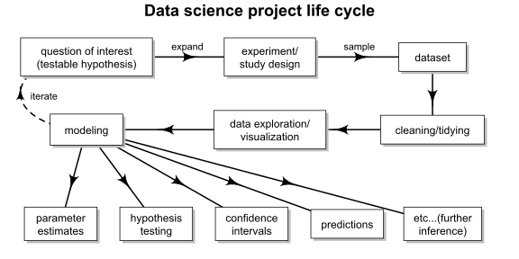

# Overview

I want to start the modeling section with the following overview of what role modeling plays in the "life cycle" of a data science project.

:::{.i96}

:::

Roughly speaking, data science can be divided into 3 phases:

 I.   In Phase I, you identify a research question, design an experiment, gather a sample, and collect some raw data. These steps correspond to the first row of the "life cycle".
 II.  In Phase II, you start with your raw data and clean it (this is probably where 60-90% of time is actually spent), explore it, and figure out the best way to model it. This is the second row.
 III. In Phase III, you fine tune your model, double check all your work, and interpret the results, which may involve reporting estimates, computing tests/intervals, making predictions, etc. This is the third row.

Experiment design & sampling is a more advanced topic, and thus not covered in detail in STAT 240, however we will summarize a few key ideas from Phase I in the next subsection since they are relevant to later topics.

We've spent a lot of time learning the basics of data cleaning, exploration, and visualization, so we're reasonably well covered for Phase II for now, though of course you're always encouraged to explore further on your own.

For most of the remainder of the class, we will focus on Phase III: identifying appropriate models, fitting them well, interpreting the results meaningfully, producing useful further inference such as hypothesis tests & confidence intervals, and communicating the results effectively to a broader audience.

