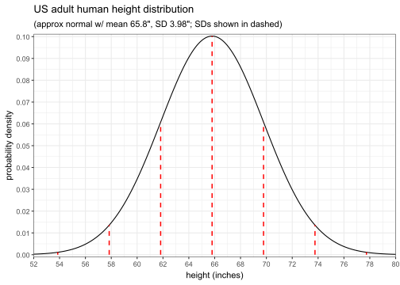

# Intro to Probability

In this section, we'll introduce you to some foundational probability theory that will be necessary for later models. We will do this in a way that is only semi-rigorous, with an emphasis on teaching the materials in an intuitive fashion.


## Random variables (RVs)

Suppose we have an **experiment** that produces an **outcome** each time it's observed. This is modeled by a **random variable**, often denoted with a capital letter, e.g. $X$ or $Y$. The set of all possible outcomes is called the **sample space** and often denoted $\Omega$.

Sets of possible outcomes are called **events**. Each event has some **probability** associated with it. The probability of some event is often denoted $P(\text{event})$.

A **distribution** is any specification of both the outcomes and the associated probabilities of a random variable.

:::{.eg}
Let $X$ be the result of rolling a standard 6-sided die that is **fair**, i.e. the outcomes 1, 2, 3, 4, 5, and 6 all have equal probability. Here are few examples of events and their corresponding probabilities:

 - Probability of getting a 1: $P(X=1)=\frac16$
 - Probability of getting more than 4: $P(X>4)=\frac13$
 - Probability of getting an even number: $P(X=2,4,\text{or }6)=\frac12$
 - Probability of getting a 7: $P(X=7)=0$
:::


## Axioms of probability

In math, **axioms** are basic rules which formally define an object and which are assumed to be true without proof. These form the basis on which everything else rests. These are the axioms of probability:

 1. The probability of an event is always non-negative.
    - Mathematically, $P(E)\ge0$ for any event $E$ of some random variable.
 2. The probability of the entire sample space is always 1.
    - Mathematically, $P(\Omega)=1$ for any random variable. Note 1 is equivalent to 100\%.
 3. The probability of the **union** of **mutually exclusive** events is equal to the sum of the probabilities of each event.
    - Mathematically, if $A\cap B$ is empty, then $P(A\cup B)=P(A)+P(B)$

:::{.def}
Let $A$ and $B$ be two events for some random variable.

The **union** of $A$ and $B$, denoted $A\cup B$, is the event of observing $A$ OR $B$.

The **intersection** of $A$ and $B$, denoted $A\cap B$, is the event of observing $A$ AND $B$.

$A$, $B$ are called **mutually exclusive** if they don't intersect, i.e. they have no outcomes in common.
:::

:::{.eg}
Let's see these in an example. Let $X$ again be the result of rolling a fair, 6-sided die with outcomes $1,2,\ldots,6$.

Let $A$ be the event of observing $X$ to be more than 4, and let $B$ be the event of observing $X$ to be an even number. Then, $A\cap B=\{6\}$ and $A\cup B=\{2,4,5,6\}$. Note that $1,3$ are in neither $A$ nor $B$.

Since $A\cap B=\{6\}$ which is NOT empty, $A$ and $B$ are NOT mutually exclusive. Suppose we define a third event $C$ as observing $X$ to be either $1$ or $3$. Then, $C$ is mutually exclusive with both $A$ and $B$, since both $A\cap C$ and $B\cap C$ are empty.
:::


### Corollaries

From these axioms, we have a few important corollaries (i.e. derived statements) that are also true:

 1. Probabilities are always between 0 and 1.
    - Mathematically, for any event $E$, we have $0\le P(E)\le1$
 2. To get the probability of the "opposite" event, subtract from 1.
    - Mathematically, for any event $E$, we have $P(\text{not }E)=1-P(E)$.
 3. In general, for any $A,B$, the probability of $A$ or $B$ is the probability of $A$ plus $B$ minus the intersection of $A$ and $B$. This is the generalized form of the 3^rd^ axiom.
    - Mathematically, $P(A\cup B)=P(A)+P(B)-P(A\cap B)$.

These are not difficult to derive from the axioms, but we omit the proofs for brevity.^[See [here](https://en.wikipedia.org/wiki/Probability_axioms#Consequences) for details.] 


:::{.eg}
Here's an example of how to use these axioms. Suppose in Nice Town, on an average day, there's a 70% chance it's sunny, and a 40% chance of a light breeze. Suppose there's a 20% chance of being neither sunny nor breezy. What's the probability it's both sunny and breezy?

Let $S$ represent sunny, and $B$ represent breezy. Then, from the information given, we know $P(S)=0.7$, $P(B)=0.4$, and $P(\text{neither \(S\) nor \(B\)})=0.2$.

By corollary 2, $P(\text{neither \(S\) nor \(B\)})=1-P(S\cup B)$, so we have $P(S\cup B)=0.8$.

By corollary 3, $P(S\cup B)=P(S)+P(B)-P(S\cap B)$. Rearranging the terms, we get $P(S\cap B)=P(S)+P(B)-P(S\cup B)=0.7+0.4-0.8=0.3$. Thus, there's a 30% chance of it being both sunny and breezy.
:::


## Discrete vs Continuous RVs

Generally, random variables are either **discrete** or **continuous**.

:::{.def}
A **discrete** RV is one whose **outcomes can be listed out one-by-one**. The list is allowed to be infinite.^[Formally, $\Omega$ must be [countable](https://en.wikipedia.org/wiki/Countable_set).]

A **continuous** RV is the opposite, where **outcomes are in a continuous range** and not listable.
:::

In practice, we usually use **discrete RVs to model integer valued outcomes**, e.g. counts of something; and **continuous RVs to model real number valued outcomes**, e.g. lengths/weights/durations. These require slightly different mathematical notations/treatments.


### Discrete RVs

For discrete RVs, the distribution of outcomes and probabilities is specified with a **probability mass function** (PMF). Note the PMF must satisfy all rules of probability. In particular, all probabilities must be in $[0,1]$, and $P(\Omega)=\sum_\text{k}P(k)=1$ where $k$ represents each possible outcome.


:::{.def}
Let $X$ be a discrete RV. The **probability mass function (PMF)** of $X$ is a function $P$ which, for each possible outcome $k$ in the sample space, specifies the probability that $X$ is observed to be $k$, denoted $P(X\! =\!k)$, or sometimes $P(k)$ for short.

To be a valid PMF, $P$ must satisfy the probability axioms, namely it must always be **non-negative** and **sum to 1** across all possible outcomes in the sample space.
:::


PMFs can be specified using either a table, function, or plot.

:::{#casino-example .eg}
Let $X$ be the number of dollars you win from a new casino game where there's only 4 possible outcomes: you either win nothing with 40% chance, or you win \$1 with 30% chance, or you win \$2 with 20% chance, or you win \$3 with 10% chance.

First, it's easy to see the axioms are satisfied, since all probabilities are in $[0,1]$ and $0.1+0.2+0.3+0.4=1$. Thus, this is a valid PMF. We can specify the PMF in any of the following equivalent ways:

#### Table: {-}

<center>

     k | P(k)
    ---+-----
     0 | 0.4 
     1 | 0.3 
     2 | 0.2 
     3 | 0.1 

</center>

#### Function: {-}

$$P(X\! =\!k)=\begin{cases}\frac1{10}\big(4-k\big) & k=0,1,2,3 \\ 0 & \text{otherwise}\end{cases}$$

#### Plot: {-}

:::{.fold .s}


``` r
# remember to import tidyverse (and optionally, update theme options)
tibble(k = 0:3, p = (4:1)/10) %>%
  ggplot(aes(x = k, y = p)) + geom_col() +
  labs(title = "Distribution of X (winnings from made-up casino game)")
```


:::

:::


:::{.eg}
For another example, let $X$ be the sum of rolling 2 ordinary, fair 6-sided dice (independently)^[[Independence](https://www.probabilitycourse.com/chapter1/1_4_1_independence.php) has a formal probabilistic definition that's beyond the scope of 240. You can simply think of it as rolling the dice in a way that doesn't affect each other.]. What is the PMF of $X$?

First, note the possible outcomes $k$ in the sample space are the integers $k=2,3,\ldots,12$. Next, since the dice are fair, we can find the probability of each outcome $k$ by counting the number of combinations that add to $k$. For example, for $k=5$ the outcomes are 14, 23, 32, and 41. Each outcome has probability 1/36 so summing them we get $P(X=5)=4\cdot\frac1{36}=\frac19$

From this, you can show the probability for each $k=2,3,\ldots,12$ is $P(X=k)=(6-|k-7|)/36$. Thus we can write the PMF as:

$$P(X\! =\!k)=\begin{cases}\frac1{36}\big(6-|k-7|\big)&k=2,3,\ldots,12\\0&\text{otherwise}\end{cases}$$

You can easily check this PMF satisfies the probability axioms. Here's a plot of this PMF:

:::{.fold .s}

``` r
tibble(k = 2:12, p = (6-abs(k-7))/36) %>%
  ggplot(aes(x = k, y = p)) + geom_col() +
  labs(title = "Distribution of X (sum of rolling two fair 6-sided dice)") +
  scale_x_continuous(breaks = 2:12) +
  scale_y_continuous(breaks = seq(0,.2,.02))
```


:::

:::


### Continuous RVs

For continuous RVs, distributions are specified with a **probability density function** (PDF). They are similar to PMFs but with a key distinction: **PDFs do NOT output probability of an outcome**, rather it denotes "density" which can be thought of as the rate of change of probability.

:::{.def}
Let $X$ be a continuous RV. The **probability density function (PDF)** of $X$ is a function $P$ which, for each outcome $x$ in the sample space, specifies the density of probability around $x$.

To be a valid PDF, $P$ must also satisfy the probability axioms, i.e. $P$ must always be **non-negative** and **integrate to 1** across the sample space.
:::

:::{.note}
This is important enough to warrant repeating: a continuous **PDF does NOT output a probability**! For continuous PDFs, **probabilities ALWAYS correspond to areas under the PDF**.

Also note it's customary to use $k$ to represent possible outcomes of discrete PMFs, and $x$ to represent possible outcomes of continuous PDFs.
:::

PDFs are the continuous analog of PMFs, so whenever you might use PMFs in a summation $\sum$ expression, you would switch to a definite integral $\int$ for a PDF. In STAT 240, **we will NOT require you to evaluate these integrals** but we may occasionally show them to familiarize you with the notation. Computations with simple PMFs may be asked however.


:::{.eg}
PDFs can feel strange at first, so here's an easy example to start. According to the [2011-12 National Health and Nutrition Examination Survey](https://wwwn.cdc.gov/Nchs/Nhanes/2011-2012/BMX_G.htm) (NHANES) by the CDC, US adult human height has an approximately normal distribution with mean 65.8 inches and standard deviation 3.98 inches. Below is a plot of the distribution:

:::{.fold .s}

``` r
# use geom_function to plot dnorm (the normal PDF function)
# also plot the mean ± up to 3 standard deviations
ggplot(tibble(SDs = 65.8 + (-3:3)*3.98)) +
  geom_function(fun = \(x) dnorm(x, 65.8, 3.98), xlim = c(52, 80), n = 1001) +
  geom_segment(aes(x = SDs, xend = SDs, y = 0, yend = dnorm(SDs, 65.8, 3.98)),
               color = "red", linetype = "dashed", linewidth = 0.7) +
  scale_x_continuous(breaks = seq(52, 80, 2), expand = c(0, 0)) +
  scale_y_continuous(breaks = seq(0, 0.10, 0.01), expand = c(0, 0.001)) +
  labs(title = "US adult human height distribution",
       subtitle = '(approx normal w/ mean 65.8", SD 3.98"; SDs shown in dashed)',
       x = "height (inches)", y = "probability density")
```


:::

You can easily see the density is non-negative, and with some careful math the area can be shown to be 1. Thus it satisfies the probability axioms.

Remember the density at $x$ is NOT the probability of $x$. Again, probabilities of events correspond to areas under the curve. For example, one can show that for a normal distribution:

 - Approx. 68% of outcomes are between ±1 standard deviation,
 - Approx. 95% of outcomes are between ±2 standard deviations,
 - Approx. 99.7% of outcomes are between ±3 standard deviations.

This rule is called the **empirical rule**. For our distribution of heights, this means about 68% of people are between 62 and 70 inches, about 95% are between 58 and 74 inches, etc.
:::

:::{.eg}
For another example, consider the **uniform distribution** on $(0,1)$. This distribution generalizes rolling a fair die to drawing a number from an interval, where every value inside the interval is equally likely to be selected. Below is a plot of the distribution:

:::{.fold .s}

``` r
# use geom_function to plot dunif (the uniform PDF function)
ggplot() + geom_function(fun = dunif, xlim = c(-.5, 1.5), n = 10001) +
  labs(title = "Uniform distribution between 0 and 1",
       x = "x", y = "probability density")
```


:::

One can also show percentiles are always uniformly distributed, so this is actually a very useful distribution (more on this in STAT 340).
:::


## Expectation & Variance

### Expected value

**Expected value** refers to the **average value** of some random variable (or function thereof). For a discrete random variable $X$, the expected value of $X$---also called $E(X)$, $\mu$, or simply the mean of $X$---is defined:

$$\mu=E(X)=\sum_k\,k\cdot P(X\! =\!k)$$

The summation is performed over all possible outcomes $k$ in the sample space. In plain words, the mean is the sum of the product of each outcome with its probability (i.e. a weighted sum using the probabilities as weights). The formula for a continuous variable is similar but with an integral instead of a summation.

The expected value of a function of a random variable $f(X)$ can also be defined, which represents the average value of $f(X)$ :

$$E\big(f(X)\big)=\sum_k\,f(k)\cdot P(X\! =\!k)$$


:::{#single-die .eg}
Again, as a simple example, consider $X$ being rolling a single fair, 6-sided die. Find $E(X)$.

If the die is fair, then $P(X\! =\!k)=1/6$ for all $k=1,2,\ldots,6$. Then, we get

$$E(X)=\sum_{k=1}^6\,k\cdot(1/6)=\frac16(1+2+\cdots+6)=\frac{21}6=3.5$$

This means the average value of a die roll is 3.5. Note that **the average does NOT need to be a possible observation**! Even though it's impossible to roll a 3.5, the average of each roll over many rolls is in fact 3.5.

Now consider $f(x)=x^2$. What is $E\big(f(X)\big)$, i.e. the average value of $X^2$?

$$E(X^2)=\sum_{k=1}^6\,k^2\cdot(1/6)=\frac16(1+4+\cdots+36)=\frac{91}6\approx15.17$$

Thus, the average of the square of a 6-sided die is about 15.17.
:::

:::{#casino-game2 .eg}
Let's reconsider the [casino game example](#casino-example) above, where $X$ is the average winnings per game. Find the expected value of $X$.

Recall the outcomes $0,1,2,3$ have corresponding probabilities $0.4,0.3,0.2,0.1$. Using the formula, we get

$$E(X)=0\!\cdot\!(0.4)+1\!\cdot\!(0.3)+2\!\cdot\!(0.2)+3\!\cdot\!(0.1)=0.3+0.4+0.3=1$$

Thus, each play on average wins \$1. This means if a casino wants to not lose money, they need to charge at least \$1 per play.
:::


### Variance

The **variance** of a random variable---also called $Var(X)$ or $\sigma^2$---can be thought of as the **average squared distance from the mean** and is defined as:

$$\sigma^2=Var(X)=E\big((X-\mu)^2\big)=\sum_k\,(k\!-\!\mu)^2\cdot P(X\! =\!k)$$

where $\mu$ represents $E(X)$. The variance is used as a measure of spread. The higher the variance, the more "spread out" a RV is.

The **standard deviation** of $X$, often denoted $\sigma$, is then defined as the **square root of the variance**. This is often more convenient to use in calculations instead of the variance since it has the same units as the data. It can be thought of as the average distance of an observation from the mean.

:::{.eg}
Consider again the previous [single, fair 6-sided die example](#single-die). Find the variance and standard deviation of $X$.

We found earlier that $\mu=E(X)=3.5$. Applying the variance formula gives:

$$Var(X)=\sum_{k=1}^6(k\!-\!3.5)^2\cdot(1/6)=\frac16\big((1\!-\!3.5)^2+\cdots+(6\!-\!3.5)^2\big)=\frac{35}{12}\approx2.92$$

So, we found the variance $\sigma^2\approx2.92$, and thus the standard deviation $\sigma\approx1.71$.
:::

:::{.eg}
Let's consider the [casino game example](#casino-game2) a final time. Find the variance and standard deviation of $X$.

We found earlier $\mu=E(X)=1$. Applying the variance formula gives:

$$Var(X)=(0\!-\!1)^2\!\cdot\!(0.4)+(1\!-\!1)^2\!\cdot\!(0.3)+(2\!-\!1)^2\!\cdot\!(0.2)+(3\!-\!1)^2\!\cdot\!(0.1)=1$$

Thus, the variance is also $\sigma^2=1$, and so is the standard deviation $\sigma=1$.
:::

