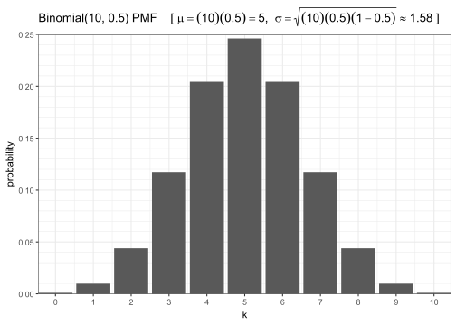
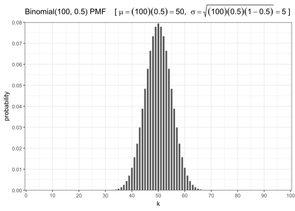
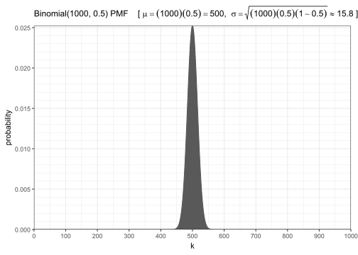
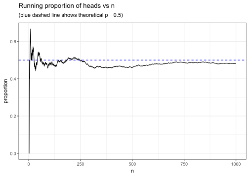
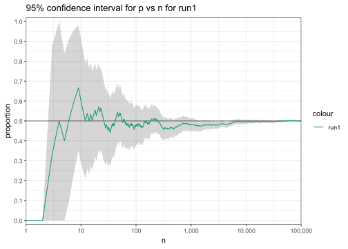

# Inference

In the previous chapter, we introduced the basics of probability theory and discussed some basic random variable models. These form the basis of our inference techniques in the rest of the notes.

In this chapter we'll discuss the concept of **inference**, where you use your observations in a sample to try to infer underlying facts about the broader population. In the process, we will make extensive use of our probability concepts and random variable models from the previous chapter.


## Population vs sample

Recall the idea of population vs sample. Usually we imagine that the **population has some fixed distribution with unknown but constant parameters**. We draw some sample from the population and **observe some sample statistics**. Based on our sample as well as possibly some other **reasonable assumptions we can make**, we identify a potential model that can be applied to the population.

Once we have our sample and our intended model, there are two common methods of inference that we can pursue; they are conceptually related, but have subtle differences:

 - We can run a **hypothesis test**, where we test models against the data to determine which explains the results better.
 - Or we can find **confidence intervals** for the underlying parameters of interest in the model, producing a range in which we are quite certain the true value lies.

These methods are not mutually exclusive and you can certainly do both, but most problems only call for one method. We will discuss both shortly, but first let's briefly discuss sampling distributions.


## Sampling distributions

Why is inference even necessary in the first place? The main reason is this: **samples are random**! This may sound trivially obvious, but the implications are worth examining more closely.


### Example: Coin flips

Imagine we have a **perfectly fair coin**, i.e. Heads (H) and Tails (T) have the exact same probability (and you can't land on the edge). Also assume you have good throwing technique and flip the coin a good many times in the air, so that past throws don't affect subsequent throws, i.e. the **throws are all mutually independent**. This is of course an idealized model, but it usually turns out to be quite practical.

### \# Heads v. $n$

Suppose you flip the coin 10 times and define $X$ as the number of total heads. Note that we can model $X\sim\bin(10,0.5)$. What is the probably of getting exactly 5? Or how about some other number? In fact we've already seen this exact distribution function last chapter:

:::{.fold .s}


``` r
# remember to import tidyverse (and optionally, update theme options)
# also importing latex2exp to write math in plot annotations
library(latex2exp)
tibble(k = 0:10, p = dbinom(k, 10, 0.5)) %>% 
ggplot(aes(x = k, y = p)) + geom_col() +
  scale_x_continuous(breaks = seq(0, 10, 1), expand = 0) +
  scale_y_continuous(breaks = seq(0, 0.25, 0.05), limits = c(0, 0.25),
                     minor_breaks = seq(0, 0.25, 0.01), expand = 0) +
  labs(title = TeX("Binomial(10, 0.5) PMF    [ $\\mu=(10)(0.5)=5$,  $\\sigma
                   =\\sqrt{(10)(0.5)(1-0.5)}\\approx 1.58$ ]"),
       x = "k", y = "probability")
```


:::

You can see that even though 5 is more likely than any other outcome, there's actually over 75% chance that you'd observe something else entirely.

Now suppose you keep going until you get to 100 flips, and again consider the total number of heads $X\sim\bin(100,0.5)$. Here's the distribution:

:::{.fold .s}

``` r
tibble(k = 0:100, p = dbinom(k, 100, 0.5)) %>% 
ggplot(aes(x = k, y = p)) + geom_col(color = "white") +
  scale_x_continuous(breaks = seq(0, 100, 10), expand = 0) +
  scale_y_continuous(breaks = seq(0, 0.08, 0.01), limits = c(0, 0.08), expand = 0) +
  labs(title = TeX("Binomial(100, 0.5) PMF    [ $\\mu=(100)(0.5)=50$,  $
                   \\sigma=\\sqrt{(100)(0.5)(1-0.5)}=5$ ]"),
       x = "k", y = "probability")
```


:::

One thing is immediately apparent: even though the raw SD has increased from 1.58 to 5, the **range of likely outcomes has narrowed compared to $\Omega$**, i.e. compared to $n$, you're unlikely to deviate by as much when the total number of flips is higher. If we continue on to 1000 flips, this becomes even more evident:

:::{.fold .s}

``` r
tibble(k = 0:1000, p = dbinom(k, 1000, 0.5)) %>% 
    ggplot(aes(x = k, y = p)) + geom_col(color = "gray35") +
    scale_x_continuous(breaks = seq(0, 1000, 100), expand = 0) +
    scale_y_continuous(breaks = seq(0, 0.025, 0.005), expand = 0,
                       minor_breaks = seq(0, 0.025, 0.001)) +
  labs(title = TeX("Binomial(1000, 0.5) PMF    [ $\\mu=(1000)(0.5)=500$,  $
                   \\sigma=\\sqrt{(1000)(0.5)(1-0.5)}\\approx 15.8$ ]"),
       x = "k", y = "probability") + theme(plot.title = element_text(size=12))
```


:::


### \% Heads v. $n$

We've just seen that as $n$ increases, the range of values for $X$ (number of heads) we are likely to observe **narrows with respect to the total range** of 0 to $n$.

Let's see this fact in a different way. Let's **actually simulate a sequence of 1000 flips** according to this model, then make a plot showing the **proportion of heads as we go along** after each flip.

:::{.fold .s}

``` r
# use rbinom to explicitly generate 1000 individual flips
# enframe wraps the vector in a data frame for ggplot
# cumsum computes the cumulative sum, i.e. "how many heads so far"
samp <- rbinom(1000, 1, 0.5)
samp %>% enframe("n", "x") %>% ggplot(aes(x = n, y = cumsum(x)/n)) +
  geom_hline(yintercept = 0.5, color = "blue", linetype = "dashed") +
  geom_line() + labs(title = "Running proportion of heads vs n", y = "proportion",
                     subtitle = TeX("(blue dashed line shows theoretical $p=0.5$)"))
```


:::

Let's increase the sample size to $n=10^{5}$ and show $n$ on a logarithmic scale, which improves readability (generally whenever a column is *always positive* and *covers several orders of magnitude*, this can significantly help improve readability).

:::{.fold .s}

``` r
# extend experiment out to 1e5 flips
# scales::comma suppresses scientific notation
samp <- c(samp, rbinom(1e5-length(samp), 1, 0.5))
samp %>% enframe("n", "x") %>% ggplot(aes(x = n, y = cumsum(x)/n)) +
  geom_hline(yintercept = 0.5, color = "blue", linetype = "dashed") +
  geom_line() + scale_x_log10(breaks = 10^(0:5), labels = scales::comma) +
  scale_y_continuous(breaks = scales::pretty_breaks(n = 10)) +
  labs(title = "Running proportion of heads vs n", y = "proportion",
       subtitle = TeX("(blue dashed line shows theoretical $p=0.5$)"))
```


:::

Let's make a final addition to our plot and add 2 additional runs where the entire experiment is repeated, as well as 2 pairs of dashed gray curves showing the ±1 and ±2 SD for each $n$.

:::{.i96 .fold .s}

``` r
p <- tibble(run1 = cumsum(samp), run2 = cumsum(rbinom(1e5, 1, 0.5)),
            run3 = cumsum(rbinom(1e5, 1, 0.5)), n = 1:1e5) %>%
  pivot_longer(1:3, names_to = "Run", values_to = "x") %>%
  ggplot(aes(x = n, y = x/n, color = Run))
for(i in -2:2) p <- p + geom_function(fun = \(x, i) 0.5*(1+i/sqrt(x)),
                                      args = list(i = i), color = "black",
                                      linetype = "dashed", alpha = 0.5)
p <- p + geom_line(linewidth = 0.7) +
  scale_x_log10(breaks = 10^(0:5), labels = scales::comma, expand = 0) +
  scale_y_continuous(breaks = scales::pretty_breaks(n = 10), limits = c(0, 1), expand = .01) +
  labs(title = "Running proportion of heads vs n  (3 runs)", y = "proportion",
       subtitle = TeX("(dashed lines show theoretical $p=0.5$ and ±1, ±2 SD curves)"))
p
```


:::

Now we see a remarkable phenomenon: not only do the runs all converge to the true value of $p=0.5$, but their rates of convergence all fall reasonably within an "envelope" that's proportional to the SD-vs-n curves.


### Law of large numbers (LLN)

The previous plots show a simulated demonstration of what's called the [**law of large numbers**](https://en.wikipedia.org/wiki/Law_of_large_numbers) (LLN), which essentially states that certain statistics are guaranteed to converge to their true values as you increase your sample size.

Specifically, the LLN guarantees for a sample of independently drawn observations, **as $n\to\infty$, any statistic computed as an _average_ of some expression _will_ converge to the true theoretical average value as long as it exists** (i.e. has a well-defined, finite value). This is an oversimplification of course, but it serves our purposes. Note however there's no statement of the rate of convergence, i.e. how fast it converges, merely that it's inevitable.

Examples of some statistics that will converge under the LLN:

$$
\begin{align}
\text{(sample mean)}&&\bar{x}=\frac1n\sum_{i=1}^nx_i~~&\longrightarrow~\mu=\e(X)&&\text{(expected value)}\\
\text{(sample variance)}&&s^2=\frac{\sum_{i=1}^n(x_i-\bar{x})^2}{n-1}~~&\longrightarrow~\sigma^2=\e\big((X-\mu)^2\big)&&\text{(variance)}
\end{align}
$$

where $x_i$ are a sample of [**independent and identically distributed** (iid)](https://en.wikipedia.org/wiki/Independent_and_identically_distributed_random_variables) observations drawn from a population represented by the random variable $X$.

There are many other statistics that also converge (e.g. correlation, skew, etc...) but these two are the most important to us right now. Note the **sample variance also converges to the true variance**, since it can be thought of as the **average squared distance** from the mean (if you factor out a $\frac{n}{n-1}$ correction factor term (as long the $\sigma^2$ exists).

Also note the proportion of heads we saw in the last example can be thought of as the **average of a sample of 1s and 0s** where 1 denotes H and 0 denotes T, so it also **converges to the true probability of heads** by LLN.

The LLN forms the basis of the inference topics which we are about to embark on.


## Confidence intervals (CI)

If you look again at the last plot from the coin flips example but in a different way, since each run stays within a fairly predictable margin of the true probability, for any given sample size we can use our sample proportion to find a range of reasonable values for the true probability. This is what we call a **confidence interval**.

A confidence interval usually has the following form:

$$
\text{$C\%$ confidence interval}~=~(\text{estimate})~\pm~(\text{crit. value})\cdot(\text{std. error})
$$

 - **$C$** is the level of confidence requested. Most commonly, a 95%-level confidence is reported by convention, but this can be any number betweeo 0-100% (not inclusive).
 - **Estimate** is your best guess of the true value based on your sample. For example, if you're trying to estimate the probability of heads, you'd use the proportion of heads in your sample.
 - **Critical value** is a multiplier that depends on $C$, the level of confidence. If you want higher confidence, you must cover more values. For a standard 95% CI, this value is usually approximately 2.
 - **Standard error** is what we call an estimate of the true SD using our sample. In out last plot, this would be an estimate of how far the inner gray lines are from the true probability $p=0.5$.

We'll cover in detail how to compute each of the above quantities for different experiments in the next few chapters, but for now let's do a quick visual example to help build more intuition.

:::{.eg}
Using the last plot, give an approximate 95% confidence interval for the true probability of heads $p$ based on just the first $n=10$ flips from the "run1" experiment.

Looking at a vertical slice along $n=10$, we can see that "run1" had a sample proportion of 0.6, which implies 6 of the first 10 flips were heads. Thus, our sample estimate is 0.6.

We can also see at that point, the 1-SD-above line is at approximately 0.65, which is 0.15 away from the true value, implying the standard error would be close to 0.15.

Using the approximate critical value of 2, our 95% confidence interval for $p$ is $0.6\pm2\cdot0.15=(0.3,0.9)$.

Put it a different way, based on the sample thus far (6/10 heads), we are **95% confident the true probability of heads $p$ is between 30-90%**.
:::

Below is a plot of how the 95% CI updates as the run1 experiment progresses one flip at a time. You can see at any given point in time, we usually do cover the true probability of heads $p=0.5$, as we expect to.

:::{.fold .s}

``` r
# compute and plot 95% CI as experiment progresses
# this will be covered in detail later, but SE is computed by sqrt(p*(1-p)/n)
# where here p refers to the running sample proportion of % of heads out of n
# pmin & pmax are used to ensure the CI bounds for the true p don't exceed [0,1]
tibble(n = 1:1e5, p = cumsum(samp)/n, se = sqrt(p*(1-p)/n)) %>%
  ggplot(aes(x = n, y = p)) +
  geom_ribbon(aes(ymin = pmax(0, p-2*se), ymax = pmin(1, p+2*se)), alpha = 0.2) +
  geom_hline(yintercept = 0.5, color = "black", alpha = 0.5) + geom_line(aes(color = "run1")) +
  scale_x_log10(breaks = 10^(0:5), labels = scales::comma, expand = 0) +
  scale_y_continuous(breaks = scales::pretty_breaks(n = 10), limits = c(0, 1), expand = .01) +
  labs(title = "95% confidence interval for p vs n for run1", y = "proportion")
```


:::


### Interpretation of CI

Let's briefly examine the interpretation of CIs more closely.


