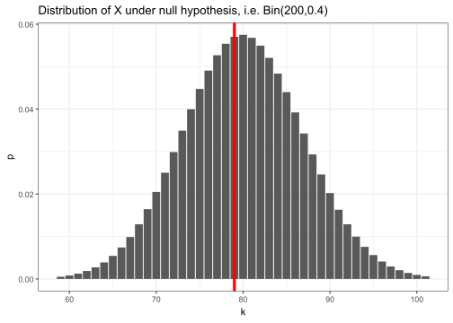

# Proportions

Let's look specifically at proportions-type inference setups, where we apply a **binomial model** to sample proportions to infer about an underlying **probability** in the population. We will divide this into two scenarios:

 - One-proportion scenario, where there is a single population with a single probability parameter of interest, and
 - Two-proportions scenario, where there are two populations, each with its own probability parameter, which we seek to compare.


:::{.note}
A proportions-type inference approach using a binomial model is **only appropriate** if your sample consists of either 1 or 2 samples where, for each sample, your data looks like **counts across two categories**, one of which we consider "success" and the other "failure" (e.g. heads/tails, true/false, etc.).

In these setups, the probability parameter of the binomial model **always corresponds to the probability of the _success_ category** by convention. Make sure to define the category whose probability is of primary interest as "success".
:::


## One proportion

### Model notation

In the one-proportion scenario, suppose we draw a **fixed sample size of $n$** observations, each of which we model as **independent** and having some constant underlying **true probability $p$ of being a success**, and $1-p$ of being a failure (and there's no other possible outcome).

Let lower-case **$x$ be the observed number of successes in our sample**, and note that we must have $0\le x\le n$. Let $\hat p=x/n$ denote then the **proportion of successes in our sample**.

It's customary to also use upper-case $X$ to represent our model of the true distribution of $x$, which here we choose to be $X\sim\bin(n,p)$.

Under these assumptions, $\hat p$ is a natural **point estimate** for $p$, i.e. our **sample proportion of successes estimates the true underlying probability of success $p$**, since the LLN guarantees $\hat p\to p$ as $n\to\infty$.

:::{.note}
Note several things:

 - $n$ must be a fixed, predetermined sample size,
 - trials must be able to be reasonably modeled as independent,
 - there must only be 2 possible outcomes (success & failure) for each trial,
 - $p$ is always the TRUE probability of the "success" category, however it's defined,
 - $\hat p$ is the observed sample proportion, which can estimate the true $p$ by LLN,
 - $X$ represents the theoretical RV model we choose to apply to the sample's observed $x$,
 - $x$ represents the actual observed number of successes in your sample out of $n$ trials.
:::

:::{.eg}


Let's see all this in the context of an example. Below are $n=200$ rolls of a purportedly fair 5-sided die I bought online (yes, I really sat in my office and rolled it 200 times).

{.i3}


``` r
# combine 50-roll chunks of data, split, then parse to numeric vector
rolls <- paste0("21252134521555355115322514314333142113433335345333",
                "43242443535423223523352541521331244241531554241354",
                "34244524112155254341541335443433245314125431131335",
                "43114331251421521112234535251142334354341123345541") %>%
  strsplit("") %>% unlist %>% as.numeric
rolls
```

```
  [1] 2 1 2 5 2 1 3 4 5 2 1 5 5 5 3 5 5 1 1 5 3 2 2 5 1 4 3 1 4 3 3 3 1 4 2 1 1
 [38] 3 4 3 3 3 3 5 3 4 5 3 3 3 4 3 2 4 2 4 4 3 5 3 5 4 2 3 2 2 3 5 2 3 3 5 2 5
 [75] 4 1 5 2 1 3 3 1 2 4 4 2 4 1 5 3 1 5 5 4 2 4 1 3 5 4 3 4 2 4 4 5 2 4 1 1 2
[112] 1 5 5 2 5 4 3 4 1 5 4 1 3 3 5 4 4 3 4 3 3 2 4 5 3 1 4 1 2 5 4 3 1 1 3 1 3
[149] 3 5 4 3 1 1 4 3 3 1 2 5 1 4 2 1 5 2 1 1 1 2 2 3 4 5 3 5 2 5 1 1 4 2 3 3 4
[186] 3 5 4 3 4 1 1 2 3 3 4 5 5 4 1
```

``` r
# quick table + bar plot of results using base R
table(rolls)
```

```
rolls
 1  2  3  4  5 
39 32 50 41 38 
```

``` r
barplot(table(rolls))
```

:::{.i6}

:::

Suppose my question of interest is whether this specific die design is in fact fair. There are different ways of testing this^[the most [powerful](https://www.scribbr.com/statistics/statistical-power) method is probably a [chi-squared test](https://www.scribbr.com/statistics/chi-square-tests).], but a simple way using a proportions-type setup is to ask **whether the two triangular-shaped faces** (which are 4 and 5) **are observed 2/5 or 40% of the time**.

In this setup, we can define "success" as getting 4 or 5, which has theoretical probability $p=0.4$. Our RV model for $X$, i.e. the number of successes (4s & 5s), is then $X\sim\bin(200,0.4)$.

In our sample, we observed $x=41+38=79$ times this actually occured, which gives us a sample proportion of $\hat p=x/n=79/200=0.395$.
:::

### Confidence interval

For a one-proportion scenario, the confidence interval has the following form:

$$
\text{$C\%$ or $(1\!-\!\alpha)$ interval}~=~\hat p~\pm~z_{\alpha/2}\cdot\sqrt{\frac{\hat p(1-\hat p)}{n}},~\text{ where}
$$

 - $\alpha$ is **implicitly defined as 100% – C%**, e.g. for a 95% confidence interval, $\alpha=1-0.95=0.05$,
 
 - $\hat p=x/n$, the sample proportion of successes, is the **point estimate** for the true probability $p$,
 
 - $z_{\alpha/2}$ is the **$\alpha$-level normal critical value** such that $\p(|Z|>|z_{\alpha/2}|)=\p(Z>z_{\alpha/2})+\p(Z<-z_{\alpha/2})=\alpha$, in other words the observation on the standard normal such that the two "outer-tails" defined by it and its mirror image sum to $\alpha$ together.
   
   ::::{.i5 .fold .s}
   
   
   ``` r
   library(latex2exp)
   ggplot() + geom_function(fun=dnorm, xlim=c(-4,4)) +
     stat_function(fun=dnorm, geom="area", xlim=c(-4,qnorm(.025)), fill="red") +
     stat_function(fun=dnorm, geom="area", xlim=c(qnorm(.975),4), fill="red") +
     scale_x_continuous(breaks=qnorm(c(.025,.5,.975)), minor_breaks=NULL, expand=0,
                        labels=TeX(c("$-z_{\\alpha/2}$","0","$z_{\\alpha/2}$"))) +
     scale_y_continuous(breaks=NULL, limits=c(0,.4), expand=0) + theme(axis.text.x=element_text(size=13)) +
     labs(x=NULL, y=NULL, title=TeX("$z_{\\alpha/2}$ critical value for Z (red areas sum to $\\alpha$)"))
   ```
   
   
   ::::
   
   This value is called $z_{\alpha/2}$ since by convention the subscript denotes the area of only the right-corner, which is $\alpha/2$ by symmetry. To compute $\alpha/2$ for a C% interval, you need to ask `qnorm()` for the $(1-\alpha/2)$--percentile, e.g. for a 95% confidence interval, we seek the 97.5%-tile:
   
   
   ``` r
   # for a given α, e.g.
   alpha <- 0.05
   # compute the 1-α/2 percentile as the z_α/2 critical value
   1-alpha/2
   ```
   
   ```
   [1] 0.975
   ```
   
   ``` r
   qnorm(0.975)  # often approximated as 1.96 or simply 2
   ```
   
   ```
   [1] 1.959964
   ```
 
 - and finally $\se(\hat p)=\sqrt{\hat p(1-\hat p)/n}$ is the **estimated standard error of $\hat p$**, which can be thought of as dividing the binomial SD by $n$ then substituting $p\to\hat p$ everywhere.

:::{.eg}
Continuing the example above, a 95% confidence interval for $p$ based on 79 successes out of 200 trials can be computed as:


``` r
# define x, n
x <- sum(rolls>=4) ; n <- length(rolls)
x
```

```
[1] 79
```

``` r
n
```

```
[1] 200
```

``` r
# define p-hat
phat <- x/n   # alternative shortcut: phat <- mean(rolls>=4)
phat
```

```
[1] 0.395
```

``` r
# 95% confidence interval, using c(-1,1) as a shorcut for ±
phat + c(-1,1) * qnorm(0.975) * sqrt(phat*(1-phat)/n)
```

```
[1] 0.32725 0.46275
```

Thus, a 95% confidence interval for $p$, i.e. the true probability of 4 or 5, is (0.33,0.46), or in other words, **we are 95% confident the true $p$ is between 0.33 and 0.46**.

If a different level of confidence is desired, simply change the argument to `qnorm()`:


``` r
# e.g. for 90% interval, implied alpha=0.10 so we want qnorm of (1-0.1/2)=0.95
phat + c(-1,1) * qnorm(0.95) * sqrt(phat*(1-phat)/n)
```

```
[1] 0.3381424 0.4518576
```

``` r
# a shortcut is to take the midpoint between the confidence level and 1
# another example, for a 99% interval, we want qnorm of 0.995
phat + c(-1,1) * qnorm(0.995) * sqrt(phat*(1-phat)/n)
```

```
[1] 0.3059614 0.4840386
```

Note the lower the confidence desired the smaller the interval, and vice versa the higher the confidence desired the larger the interval.
:::

### Hypothesis testing

For a one-proportion scenario, where you wish to test the following hypotheses:

$$
H_0:p=p_0~~~~~~~~\\
~~~~~~~~H_a:p<,\,\ne,\,\text{or}> p_0
$$

You start, as always, by **assuming the null**, i.e. suppose that $X\sim\bin(n,p_0)$. Note this means your sample observation $x$ is drawn from this distribution.

For the p-value, simply **compute the appropriate tail area of $x$ corresponding to the alternative**. Remember the rule is for one-sided take the corresponding side tail, and for two-sided take the two outer tails (or take one outer tail and double it).

Then finally, compare with $\alpha$ and make a conclusion.


:::{.eg}
Continuing with the die example, we saw in our sample $\hat p=0.395$ was quite close to what we expected under a fair die of $p_0=0.4$. Let's formally test this. Recall from the previous section if we wish to reject $H_0$ if our sample statistic is too high OR too low, we choose the two-sided alternative. This applies here, since if $\hat p$ is too low or too high vs $0.4$, we should reject. Thus, we choose:

$$
H_0:p=0.4\\
H_a:p\ne0.4
$$

Next, under the null we have $X\sim\bin(200,0.4)$. This distribution is shown below, along with a red line at our observed sample $x=79$.

:::{.fold .s}

``` r
mu = n*.4 ; sd = sqrt(n*.4*(1-.4))
tibble(k=floor(mu-3*sd):ceiling(mu+3*sd),p=dbinom(k,n,0.4)) %>% 
  ggplot(aes(x=k,y=p)) + geom_col() + geom_vline(xintercept=x, color="red", linewidth=1.5) +
  ggtitle(str_glue("Distribution of X under null hypothesis, i.e. Bin({n},0.4)"))
```


:::

Recall for a two-sided alternative, we take the "outer-tail" corresponding to our observed statistic and multiply by 2 to get our final p-value. Here, this means we look for $2\cdot\p(X\le79)$ where $X\sim\bin(200,0.4)$.


``` r
# our two-sided p-value here
2 * pbinom(x, n, 0.4)
```

```
[1] 0.9463115
```

**Important note: if our sample $x$ were on the _RIGHT_ half of the curve instead of the left, then the "outer-tail" here would be the _RIGHT_ side tail, **i.e. $\p(X\ge x)$.

If instead our alternative had been $<$ or $>$, then instead the p-value here would be $\p(X\le79)$ or $\p(X\ge79)$ respectively.


``` r
# p-value if Ha had been p<0.4
pbinom(x, n, 0.4)
```

```
[1] 0.4731557
```

``` r
# p-value if Ha had been p>0.4 (note the -1 to include the bar at x)
1 - pbinom(x-1, n, 0.4)
```

```
[1] 0.5838754
```

In any of these cases, we see the p-value is quite large compared to $\alpha$. This means our experimental result of $x=79$ was in fact close to our expectations, so there's no evidence to refute the null. Thus, we do not reject the null, and we conclude the die appears to be fair.
:::


### R method

Of course, you can also use R to compute the interval or do the testing. This is a good way to check your manual calculations to make sure you did it right. The function for both is `binom.test()`. It accepts several arguments:

 - `x` is the observed sample count $x$
 
 - `n` is the sample size `n`
 
 - `p` (defaults to 0.5) is the hypothesized proportion under the null $p_0$
 
 - `alternative` (defaults to `"two.sided"`) controls the direction of the alternative and can be set instead to either `"greater"` or `"less"`
 
 - `conf.level` (defaults to 0.95) controls the desired confidence level

Important note: setting a one-sided alternative will generate a one-sided confidence interval with one end at $\pm\infty$, which is generally not what we desire, so if you want a standard confidence interval as well as a one-sided test, you should run the function twice.

:::{.eg}
Continuing with the die example, recall we still have `x`, `n` defined


``` r
print(c(x,n))
```

```
[1]  79 200
```

Let's compute a 95% confidence interval for our problem:


``` r
binom.test(x, n, p=0.4)
```

```

	Exact binomial test

data:  x and n
number of successes = 79, number of trials = 200, p-value = 0.9425
alternative hypothesis: true probability of success is not equal to 0.4
95 percent confidence interval:
 0.3267650 0.4663964
sample estimates:
probability of success 
                 0.395 
```

Note this interval is very slightly wider than our computation, since it uses a modified method called the [Clopper-Pearson](https://en.wikipedia.org/wiki/Binomial_proportion_confidence_interval#Clopper%E2%80%93Pearson_interval) formula, which is technically slightly better than our method which is called the [Wald](https://en.wikipedia.org/wiki/Binomial_proportion_confidence_interval#Problems_with_using_a_normal_approximation_or_%22Wald_interval%22) interval, but this is beyond the scope of STAT240. For our purposes we will prefer the simpler Wald method.

We can also compute a 90% or 99% interval:


``` r
binom.test(x, n, p=0.4, conf.level=0.90)
```

```

	Exact binomial test

data:  x and n
number of successes = 79, number of trials = 200, p-value = 0.9425
alternative hypothesis: true probability of success is not equal to 0.4
90 percent confidence interval:
 0.3371018 0.4552518
sample estimates:
probability of success 
                 0.395 
```

``` r
binom.test(x, n, p=0.4, conf.level=0.99)
```

```

	Exact binomial test

data:  x and n
number of successes = 79, number of trials = 200, p-value = 0.9425
alternative hypothesis: true probability of success is not equal to 0.4
99 percent confidence interval:
 0.3069060 0.4882182
sample estimates:
probability of success 
                 0.395 
```

For a hypothesis test, note the previous outputs all show that the two-sided p-value is 0.9425. This is once again very slightly different from our computation, since it uses a slightly more exact method where instead of doing $2\cdot\p(X\le79)$, it computes $\p(X\le79)+\p(X\ge81)$.

``` r
pbinom(79,200,0.4) + 1-pbinom(80,200,.4)
```

```
[1] 0.9424936
```

Again, we can feel free to continue doubling the outer tail area on one side as an approximation, which should usually be fairly accurate. We can also run one-sided tests if we wish:


``` r
binom.test(x, n, p=0.4, alternative="less")
```

```

	Exact binomial test

data:  x and n
number of successes = 79, number of trials = 200, p-value = 0.4732
alternative hypothesis: true probability of success is less than 0.4
95 percent confidence interval:
 0.0000000 0.4552518
sample estimates:
probability of success 
                 0.395 
```

``` r
binom.test(x, n, p=0.4, alternative="greater")
```

```

	Exact binomial test

data:  x and n
number of successes = 79, number of trials = 200, p-value = 0.5839
alternative hypothesis: true probability of success is greater than 0.4
95 percent confidence interval:
 0.3371018 1.0000000
sample estimates:
probability of success 
                 0.395 
```

This time, the p-values are exactly what we found previously (up to rounding).
:::


## Two proportions

### Model notation

In the two-proportions scenario, 

